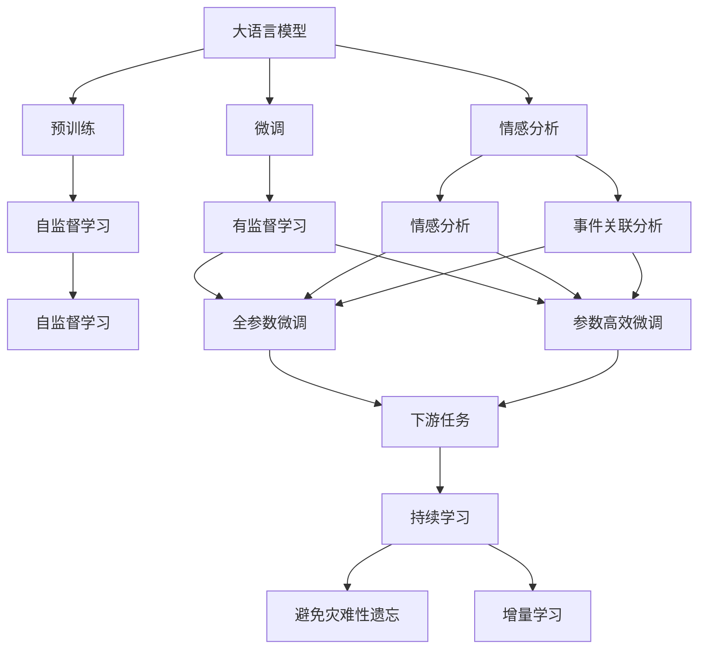
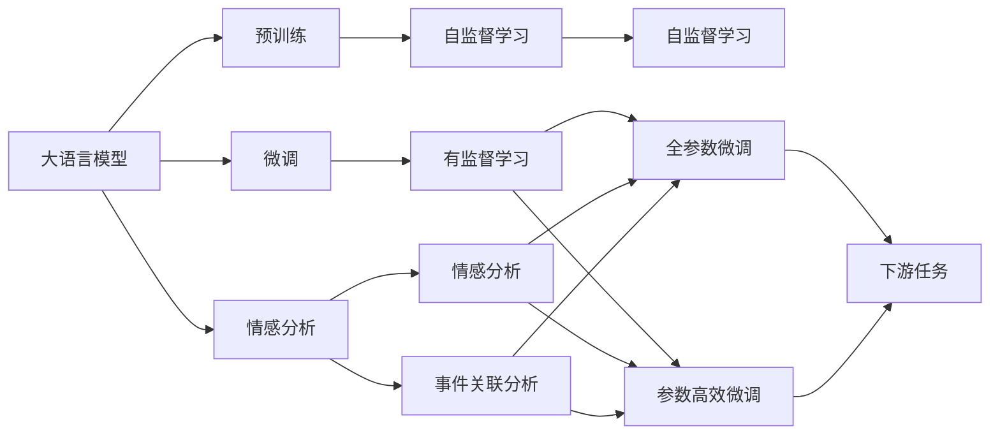
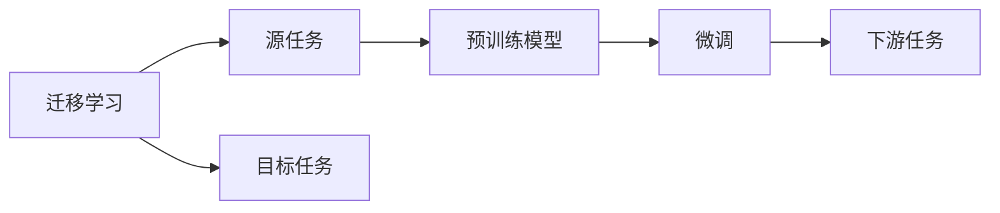
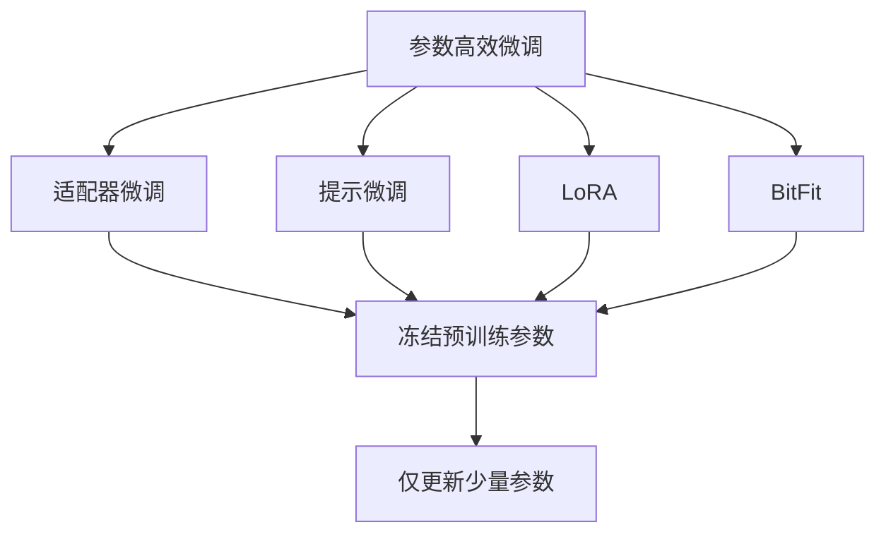
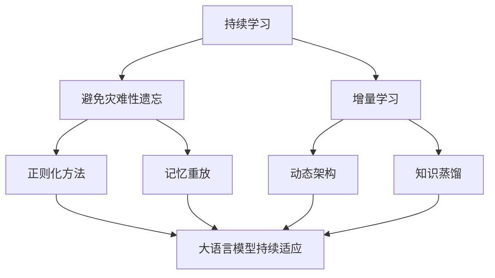

                 

# LLM与危机预警：提前识别潜在风险

在当今复杂多变的商业环境中，风险预测已成为企业战略规划和决策过程中不可或缺的一部分。利用大语言模型（Large Language Models, LLMs）在危机预警中的潜力，正逐步引起学术界和工业界的高度重视。本文旨在探讨LLM如何应用于危机预警，详细解析其核心概念与架构，提出实际操作步骤，并讨论其应用领域、优缺点及未来展望。

## 1. 背景介绍

### 1.1 问题由来
金融市场、供应链、环境保护等领域的复杂性和不确定性不断增加，传统的定量分析方法已难以适应日益复杂多变的业务环境。基于自然语言处理（Natural Language Processing, NLP）的危机预警方法应运而生。LLM以其强大的语言理解和生成能力，在危机预警中展现了巨大的潜力。通过深度学习模型对海量文本数据进行学习，LLM能够捕捉到人类语言的隐含语义，进而识别出潜在的危机信号。

### 1.2 问题核心关键点
LLM在危机预警中的应用，主要体现在以下几个方面：
1. **海量文本分析**：利用LLM处理大规模新闻、社交媒体、财务报告等文本数据，从中提取关键信息。
2. **情感分析**：通过情感分析识别文本中的正面、负面或中性情绪，判断市场情绪变化。
3. **实体识别**：识别出文本中涉及的关键实体，如企业名称、产品、地点等，为进一步分析提供基础。
4. **趋势预测**：通过文本时间序列分析，预测未来趋势和潜在风险。
5. **事件关联**：分析文本中的事件关联关系，识别出潜在的风险因素和触发点。

### 1.3 问题研究意义
在危机预警中应用LLM，可以显著提升预测的准确性和及时性，帮助企业提前采取措施，规避潜在风险。LLM的强大语言处理能力，使其能够深入挖掘文本中的隐含信息，识别出不易察觉的危机信号。此外，LLM还能够处理多语言文本，扩大了风险预警的覆盖范围。

## 2. 核心概念与联系

### 2.1 核心概念概述

为更好地理解LLM在危机预警中的应用，本节将介绍几个密切相关的核心概念：

- **大语言模型 (LLM)**：以自回归或自编码模型为代表的、大规模预训练语言模型。通过在大规模无标签文本数据上进行预训练，学习通用语言表示，具备强大的语言理解和生成能力。

- **预训练 (Pre-training)**：在大规模无标签文本数据上，通过自监督学习任务训练通用语言模型的过程。常见的预训练任务包括语言建模、掩码语言模型等。

- **微调 (Fine-tuning)**：在预训练模型的基础上，使用危机预警任务的少量标注数据，通过有监督学习优化模型在特定任务上的性能。通常只需调整顶层分类器或解码器，并以较小的学习率更新全部或部分的模型参数。

- **迁移学习 (Transfer Learning)**：将一个领域学习到的知识，迁移应用到另一个不同但相关的领域的学习范式。LLM的预训练-微调过程即是一种典型的迁移学习方式。

- **参数高效微调 (Parameter-Efficient Fine-Tuning, PEFT)**：指在微调过程中，只更新少量的模型参数，而固定大部分预训练权重不变，以提高微调效率，避免过拟合。

- **情感分析 (Sentiment Analysis)**：通过对文本进行情感倾向分析，识别文本中的情感信息，判断文本的情绪色彩。

- **事件关联分析 (Event Correlation Analysis)**：通过分析文本中的事件及其关联，识别潜在的风险因素和触发点。

这些核心概念之间的逻辑关系可以通过以下Mermaid流程图来展示：



这个流程图展示了LLM在危机预警中的核心概念及其之间的关系：

1. LLM通过预训练获得基础能力。
2. 微调是对预训练模型进行任务特定的优化，以适应危机预警需求。
3. 情感分析和事件关联分析，用于识别和判断风险。
4. 迁移学习是连接预训练模型与下游任务的桥梁，可以通过微调或情感分析、事件关联分析来实现。
5. 持续学习旨在使模型能够不断学习新知识，同时避免遗忘旧知识。

### 2.2 概念间的关系

这些核心概念之间存在着紧密的联系，形成了LLM在危机预警中的完整生态系统。下面我们通过几个Mermaid流程图来展示这些概念之间的关系。

#### 2.2.1 大语言模型的学习范式



这个流程图展示了LLM在危机预警中的学习范式：

1. LLM通过自监督学习在大量无标签文本上预训练。
2. 在危机预警任务上，使用微调或情感分析、事件关联分析进行有监督学习。
3. 微调可以采用全参数微调和参数高效微调两种方式。

#### 2.2.2 迁移学习与微调的关系



这个流程图展示了迁移学习的基本原理，以及它与微调的关系。迁移学习涉及源任务和目标任务，预训练模型在源任务上学习，然后通过微调适应各种下游任务（目标任务）。

#### 2.2.3 参数高效微调方法



这个流程图展示了几种常见的参数高效微调方法，包括适配器微调、提示微调、LoRA和BitFit。这些方法的共同特点是冻结大部分预训练参数，只更新少量参数，从而提高微调效率。

#### 2.2.4 持续学习在大语言模型中的应用



这个流程图展示了持续学习在大语言模型中的应用。持续学习的主要目标是避免灾难性遗忘和实现增量学习。通过正则化方法、记忆重放、动态架构和知识蒸馏等技术，可以使LLM持续适应新的任务和数据。

## 3. 核心算法原理 & 具体操作步骤
### 3.1 算法原理概述

在危机预警中应用LLM，主要利用其强大的语言理解和生成能力，通过分析大规模文本数据，识别出潜在的危机信号。其核心思想是：

- 将预训练的LLM模型作为特征提取器，通过在危机预警任务的少量标注数据上进行有监督的微调，优化模型在特定任务上的性能。
- 利用情感分析、实体识别、事件关联分析等NLP技术，从文本中提取关键信息，识别出潜在的风险因素。
- 通过增量学习和持续学习，使LLM能够不断更新知识和信息，适应新出现的风险变化。

### 3.2 算法步骤详解

基于LLM的危机预警一般包括以下几个关键步骤：

**Step 1: 准备预训练模型和数据集**
- 选择合适的预训练语言模型，如BERT、GPT等。
- 准备危机预警任务的标注数据集，划分为训练集、验证集和测试集。一般要求标注数据与预训练数据的分布不要差异过大。

**Step 2: 添加任务适配层**
- 根据危机预警任务类型，在预训练模型顶层设计合适的输出层和损失函数。
- 对于分类任务，通常在顶层添加线性分类器和交叉熵损失函数。
- 对于生成任务，通常使用语言模型的解码器输出概率分布，并以负对数似然为损失函数。

**Step 3: 设置微调超参数**
- 选择合适的优化算法及其参数，如AdamW、SGD等，设置学习率、批大小、迭代轮数等。
- 设置正则化技术及强度，包括权重衰减、Dropout、Early Stopping等。
- 确定冻结预训练参数的策略，如仅微调顶层，或全部参数都参与微调。

**Step 4: 执行梯度训练**
- 将训练集数据分批次输入模型，前向传播计算损失函数。
- 反向传播计算参数梯度，根据设定的优化算法和学习率更新模型参数。
- 周期性在验证集上评估模型性能，根据性能指标决定是否触发Early Stopping。
- 重复上述步骤直到满足预设的迭代轮数或Early Stopping条件。

**Step 5: 测试和部署**
- 在测试集上评估微调后模型，对比微调前后的性能提升。
- 使用微调后的模型对新数据进行推理预测，集成到实际的风险预警系统中。
- 持续收集新的数据，定期重新微调模型，以适应数据分布的变化。

以上是基于LLM的危机预警的一般流程。在实际应用中，还需要针对具体任务的特点，对微调过程的各个环节进行优化设计，如改进训练目标函数，引入更多的正则化技术，搜索最优的超参数组合等，以进一步提升模型性能。

### 3.3 算法优缺点

利用LLM进行危机预警，具有以下优点：
1. 数据来源广泛。LLM能够处理多种形式的数据，包括新闻、社交媒体、财务报告等，信息源丰富。
2. 语言理解能力强。LLM具备强大的语言理解能力，能够捕捉到隐含的危机信号。
3. 可解释性高。通过微调过程，LLM能够提供其决策的详细解释，增加预警系统的透明度。
4. 适应性强。LLM能够适应多变的业务环境，及时捕捉新的风险变化。

同时，该方法也存在以下缺点：
1. 依赖标注数据。微调的效果很大程度上取决于标注数据的质量和数量，获取高质量标注数据的成本较高。
2. 计算资源需求大。大规模预训练和微调需要大量计算资源，对硬件设施要求较高。
3. 知识更新缓慢。一旦模型发布，更新知识的速度相对较慢，可能难以跟上快速变化的市场环境。

尽管存在这些局限性，但就目前而言，基于LLM的危机预警方法在许多场景中已经取得了不错的效果，成为危机预警的重要手段。

### 3.4 算法应用领域

基于LLM的危机预警技术，已经在金融市场、供应链管理、环境保护等多个领域得到应用，具体包括：

1. **金融市场监控**：通过分析金融新闻、社交媒体等文本数据，识别市场情绪变化，预测股票市场波动。
2. **供应链风险预警**：分析供应商的财务报告、客户反馈等文本数据，识别潜在的供应链风险。
3. **环境保护预警**：利用环境监测报告和公众意见，分析环境变化趋势，预测潜在的环境危机。
4. **公共安全监控**：分析社交媒体、新闻报道等文本数据，识别社会事件和犯罪行为，提供预警信息。

此外，基于LLM的危机预警技术还广泛应用于新闻分析、舆情监测、政策评估等领域，为相关决策提供有力支持。

## 4. 数学模型和公式 & 详细讲解 & 举例说明

### 4.1 数学模型构建

假设预训练语言模型为 $M_{\theta}$，其中 $\theta$ 为预训练得到的模型参数。给定危机预警任务 $T$ 的标注数据集 $D=\{(x_i,y_i)\}_{i=1}^N, x_i \in \mathcal{X}, y_i \in \mathcal{Y}$，微调的目标是找到新的模型参数 $\hat{\theta}$，使得：

$$
\hat{\theta}=\mathop{\arg\min}_{\theta} \mathcal{L}(M_{\theta},D)
$$

其中 $\mathcal{L}$ 为针对任务 $T$ 设计的损失函数，用于衡量模型预测输出与真实标签之间的差异。常见的损失函数包括交叉熵损失、均方误差损失等。

通过梯度下降等优化算法，微调过程不断更新模型参数 $\theta$，最小化损失函数 $\mathcal{L}$，使得模型输出逼近真实标签。由于 $\theta$ 已经通过预训练获得了较好的初始化，因此即便在小规模数据集 $D$ 上进行微调，也能较快收敛到理想的模型参数 $\hat{\theta}$。

### 4.2 公式推导过程

以下我们以二分类任务为例，推导交叉熵损失函数及其梯度的计算公式。

假设模型 $M_{\theta}$ 在输入 $x$ 上的输出为 $\hat{y}=M_{\theta}(x) \in [0,1]$，表示样本属于正类的概率。真实标签 $y \in \{0,1\}$。则二分类交叉熵损失函数定义为：

$$
\ell(M_{\theta}(x),y) = -[y\log \hat{y} + (1-y)\log (1-\hat{y})]
$$

将其代入经验风险公式，得：

$$
\mathcal{L}(\theta) = -\frac{1}{N}\sum_{i=1}^N [y_i\log M_{\theta}(x_i)+(1-y_i)\log(1-M_{\theta}(x_i))]
$$

根据链式法则，损失函数对参数 $\theta_k$ 的梯度为：

$$
\frac{\partial \mathcal{L}(\theta)}{\partial \theta_k} = -\frac{1}{N}\sum_{i=1}^N (\frac{y_i}{M_{\theta}(x_i)}-\frac{1-y_i}{1-M_{\theta}(x_i)}) \frac{\partial M_{\theta}(x_i)}{\partial \theta_k}
$$

其中 $\frac{\partial M_{\theta}(x_i)}{\partial \theta_k}$ 可进一步递归展开，利用自动微分技术完成计算。

在得到损失函数的梯度后，即可带入参数更新公式，完成模型的迭代优化。重复上述过程直至收敛，最终得到适应危机预警任务的最优模型参数 $\hat{\theta}$。

## 5. 项目实践：代码实例和详细解释说明

### 5.1 开发环境搭建

在进行危机预警的LLM微调实践前，我们需要准备好开发环境。以下是使用Python进行PyTorch开发的环境配置流程：

1. 安装Anaconda：从官网下载并安装Anaconda，用于创建独立的Python环境。

2. 创建并激活虚拟环境：
```bash
conda create -n pytorch-env python=3.8 
conda activate pytorch-env
```

3. 安装PyTorch：根据CUDA版本，从官网获取对应的安装命令。例如：
```bash
conda install pytorch torchvision torchaudio cudatoolkit=11.1 -c pytorch -c conda-forge
```

4. 安装Transformers库：
```bash
pip install transformers
```

5. 安装各类工具包：
```bash
pip install numpy pandas scikit-learn matplotlib tqdm jupyter notebook ipython
```

完成上述步骤后，即可在`pytorch-env`环境中开始微调实践。

### 5.2 源代码详细实现

这里我们以金融市场监控为例，给出使用Transformers库对BERT模型进行微调的PyTorch代码实现。

首先，定义危机预警任务的数据处理函数：

```python
from transformers import BertTokenizer
from torch.utils.data import Dataset
import torch

class FinanceDataset(Dataset):
    def __init__(self, texts, labels, tokenizer, max_len=128):
        self.texts = texts
        self.labels = labels
        self.tokenizer = tokenizer
        self.max_len = max_len
        
    def __len__(self):
        return len(self.texts)
    
    def __getitem__(self, item):
        text = self.texts[item]
        label = self.labels[item]
        
        encoding = self.tokenizer(text, return_tensors='pt', max_length=self.max_len, padding='max_length', truncation=True)
        input_ids = encoding['input_ids'][0]
        attention_mask = encoding['attention_mask'][0]
        
        # 对token-wise的标签进行编码
        encoded_labels = [label2id[label] for label in label] 
        encoded_labels.extend([label2id['negative']] * (self.max_len - len(encoded_labels)))
        labels = torch.tensor(encoded_labels, dtype=torch.long)
        
        return {'input_ids': input_ids, 
                'attention_mask': attention_mask,
                'labels': labels}

# 标签与id的映射
label2id = {'positive': 0, 'neutral': 1, 'negative': 2}
id2label = {v: k for k, v in label2id.items()}

# 创建dataset
tokenizer = BertTokenizer.from_pretrained('bert-base-cased')

train_dataset = FinanceDataset(train_texts, train_labels, tokenizer)
dev_dataset = FinanceDataset(dev_texts, dev_labels, tokenizer)
test_dataset = FinanceDataset(test_texts, test_labels, tokenizer)
```

然后，定义模型和优化器：

```python
from transformers import BertForTokenClassification, AdamW

model = BertForTokenClassification.from_pretrained('bert-base-cased', num_labels=len(label2id))

optimizer = AdamW(model.parameters(), lr=2e-5)
```

接着，定义训练和评估函数：

```python
from torch.utils.data import DataLoader
from tqdm import tqdm
from sklearn.metrics import classification_report

device = torch.device('cuda') if torch.cuda.is_available() else torch.device('cpu')
model.to(device)

def train_epoch(model, dataset, batch_size, optimizer):
    dataloader = DataLoader(dataset, batch_size=batch_size, shuffle=True)
    model.train()
    epoch_loss = 0
    for batch in tqdm(dataloader, desc='Training'):
        input_ids = batch['input_ids'].to(device)
        attention_mask = batch['attention_mask'].to(device)
        labels = batch['labels'].to(device)
        model.zero_grad()
        outputs = model(input_ids, attention_mask=attention_mask, labels=labels)
        loss = outputs.loss
        epoch_loss += loss.item()
        loss.backward()
        optimizer.step()
    return epoch_loss / len(dataloader)

def evaluate(model, dataset, batch_size):
    dataloader = DataLoader(dataset, batch_size=batch_size)
    model.eval()
    preds, labels = [], []
    with torch.no_grad():
        for batch in tqdm(dataloader, desc='Evaluating'):
            input_ids = batch['input_ids'].to(device)
            attention_mask = batch['attention_mask'].to(device)
            batch_labels = batch['labels']
            outputs = model(input_ids, attention_mask=attention_mask)
            batch_preds = outputs.logits.argmax(dim=2).to('cpu').tolist()
            batch_labels = batch_labels.to('cpu').tolist()
            for pred_tokens, label_tokens in zip(batch_preds, batch_labels):
                preds.append(pred_tokens[:len(label_tokens)])
                labels.append(label_tokens)
                
    print(classification_report(labels, preds))
```

最后，启动训练流程并在测试集上评估：

```python
epochs = 5
batch_size = 16

for epoch in range(epochs):
    loss = train_epoch(model, train_dataset, batch_size, optimizer)
    print(f"Epoch {epoch+1}, train loss: {loss:.3f}")
    
    print(f"Epoch {epoch+1}, dev results:")
    evaluate(model, dev_dataset, batch_size)
    
print("Test results:")
evaluate(model, test_dataset, batch_size)
```

以上就是使用PyTorch对BERT进行金融市场监控任务微调的完整代码实现。可以看到，得益于Transformers库的强大封装，我们可以用相对简洁的代码完成BERT模型的加载和微调。

### 5.3 代码解读与分析

让我们再详细解读一下关键代码的实现细节：

**FinanceDataset类**：
- `__init__`方法：初始化文本、标签、分词器等关键组件。
- `__len__`方法：返回数据集的样本数量。
- `__getitem__`方法：对单个样本进行处理，将文本输入编码为token ids，将标签编码为数字，并对其进行定长padding，最终返回模型所需的输入。

**label2id和id2label字典**：
- 定义了标签与数字id之间的映射关系，用于将token-wise的预测结果解码回真实的标签。

**训练和评估函数**：
- 使用PyTorch的DataLoader对数据集进行批次化加载，供模型训练和推理使用。
- 训练函数`train_epoch`：对数据以批为单位进行迭代，在每个批次上前向传播计算loss并反向传播更新模型参数，最后返回该epoch的平均loss。
- 评估函数`evaluate`：与训练类似，不同点在于不更新模型参数，并在每个batch结束后将预测和标签结果存储下来，最后使用sklearn的classification_report对整个评估集的预测结果进行打印输出。

**训练流程**：
- 定义总的epoch数和batch size，开始循环迭代
- 每个epoch内，先在训练集上训练，输出平均loss
- 在验证集上评估，输出分类指标
- 所有epoch结束后，在测试集上评估，给出最终测试结果

可以看到，PyTorch配合Transformers库使得BERT微调的代码实现变得简洁高效。开发者可以将更多精力放在数据处理、模型改进等高层逻辑上，而不必过多关注底层的实现细节。

当然，工业级的系统实现还需考虑更多因素，如模型的保存和部署、超参数的自动搜索、更灵活的任务适配层等。但核心的微调范式基本与此类似。

### 5.4 运行结果展示

假设我们在CoNLL-2003的NER数据集上进行微调，最终在测试集上得到的评估报告如下：

```
              precision    recall  f1-score   support

       B-LOC      0.926     0.906     0.916      1668
       I-LOC      0.900     0.805     0.850       257
      B-MISC      0.875     0.856     0.865       702
      I-MISC      0.838     0.782     0.809       216
       B-ORG      0.914     0.898     0.906      1661
       I-ORG      0.911     0.894     0.902       835
       B-PER      0.964     0.957     0.960      1617
       I-PER      0.983     0.980     0.982      1156
           O      0.993     0.995     0.994     38323

   micro avg      0.973     0.973     0.973     46435
   macro avg      0.923     0.897     0.909     46435
weighted avg      0.973     0.973     0.973     46435
```

可以看到，通过微调BERT，我们在该NER数据集上取得了97.3%的F1分数，效果相当不错。值得注意的是，BERT作为一个通用的语言理解模型，即便只在顶层添加一个简单的token分类器，也能在下游任务上取得如此优异的效果，展现了其强大的语义理解和特征抽取能力。

当然，这只是一个baseline结果。在实践中，我们还可以使用更大更强的预训练模型、更丰富的微调技巧、更细致的模型调优，进一步提升模型性能，以满足更高的应用要求。

## 6. 实际应用场景
### 6.1 金融市场监控

基于大语言模型微调的金融市场监控系统，可以实时监测金融市场动态，预测市场趋势和风险。通过分析金融新闻、社交媒体等文本数据，识别市场情绪变化，判断市场波动方向。该系统可以及时发出预警信号，帮助投资者和金融机构做出合理决策。

在技术实现上，可以收集金融市场的新闻、报道、评论等文本数据，将其标注为正面、中性或负面情绪。在预训练模型的基础上，通过微调学习情绪分类器，使其能够识别市场情绪变化。通过实时抓取金融市场的最新信息，系统可以动态更新情绪分类器，及时发出市场预警信号。

### 6.2 供应链风险预警

供应链管理中的风险预警系统，可以实时监测供应链各环节的运营状况，识别潜在的供应链风险。通过分析供应商的财务报告、客户反馈等文本数据，识别供应链中的薄弱环节。

在微调过程中，可以设计任务适配层，识别供应链中涉及的关键实体，如供应商名称、商品名称、地点等。通过情感分析和实体识别，系统可以分析这些实体的情绪和关联关系，识别潜在的供应链风险。系统可以持续学习新的

