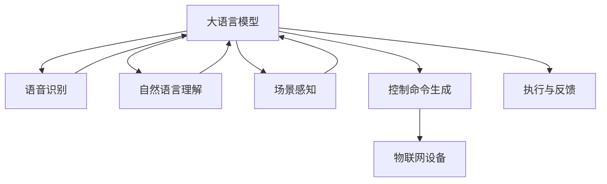
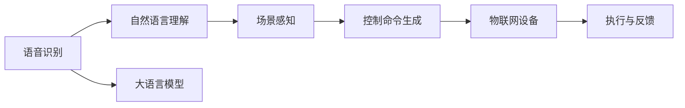

                 

# 大语言模型在智能家居控制系统中的应用探索

> 关键词：
- 大语言模型
- 智能家居
- 自然语言处理(NLP)
- 控制命令理解
- 场景感知
- 语音识别
- 预测维护

## 1. 背景介绍

### 1.1 问题由来
随着人工智能技术的发展，智能家居系统已经成为现代家庭生活中不可或缺的一部分。传统的智能家居系统主要依赖于传感器和物联网设备，通过预设规则对家庭环境进行自动化管理。然而，这种基于规则的管理方式存在诸多局限性：

- 规则定制难度大，难以覆盖所有用户行为。
- 缺乏语境感知，难以理解和处理复杂的用户指令。
- 系统交互方式单一，用户体验受限。

为解决这些问题，研究人员提出了基于大语言模型的智能家居控制系统。通过利用预训练语言模型在自然语言处理(NLP)领域的强大能力，系统能够自动识别和理解用户的语言命令，并进行智能响应。

### 1.2 问题核心关键点
大语言模型在智能家居控制系统中的应用主要涉及以下几个关键点：

1. **语音识别**：将用户的语音命令转换为文本输入。
2. **自然语言理解**：理解用户命令的具体意图和需求。
3. **场景感知**：识别当前家居环境的状态，如温度、湿度、光线等。
4. **控制命令生成**：根据用户命令和家居环境状态，生成相应的控制命令。
5. **执行与反馈**：将控制命令发送到物联网设备，并根据执行结果反馈给用户。

这些关键点共同构成了大语言模型在智能家居控制系统中的应用框架。通过不断优化各个环节，可以有效提升系统的智能化水平和用户体验。

### 1.3 问题研究意义
大语言模型在智能家居控制系统中的应用，具有以下重要意义：

1. **灵活性**：系统能够理解并处理自然语言指令，适用于各种用户需求和场景。
2. **自动化**：减少了用户对预设规则的记忆和定制，提高了系统使用的便捷性。
3. **智能化**：通过学习用户行为和家居环境，系统能够进行动态调整和预测，提升生活品质。
4. **人性化**：自然语言交互方式更为友好，易于被家庭用户接受和习惯。
5. **可扩展性**：系统可以无缝集成多种物联网设备和传感器，支持更多功能的扩展。

通过大语言模型，智能家居系统有望实现从自动化到智能化的跨越，为用户提供更加便捷、舒适和高效的家庭生活体验。

## 2. 核心概念与联系

### 2.1 核心概念概述

为更好地理解大语言模型在智能家居控制系统中的应用，本节将介绍几个关键概念及其联系：

- **大语言模型**：如GPT、BERT等预训练语言模型，具有强大的自然语言处理能力，能够理解自然语言指令。
- **语音识别**：将用户的语音转换为文本输入。
- **自然语言理解**：理解用户命令的具体意图和需求。
- **场景感知**：识别当前家居环境的状态，如温度、湿度、光线等。
- **控制命令生成**：根据用户命令和家居环境状态，生成相应的控制命令。
- **执行与反馈**：将控制命令发送到物联网设备，并根据执行结果反馈给用户。

这些概念通过大语言模型这一核心组件相互关联，共同构成了智能家居控制系统的应用框架。

### 2.2 概念间的关系

这些概念之间的关系可以通过以下Mermaid流程图来展示：



这个流程图展示了从语音识别到控制命令生成的完整流程，以及大语言模型在其中的关键作用。

### 2.3 核心概念的整体架构

最后，我们用一个综合的流程图来展示这些概念在大语言模型应用中的整体架构：



这个综合流程图展示了从语音输入到控制命令执行的整个系统流程，以及大语言模型在其中起到的关键作用。

## 3. 核心算法原理 & 具体操作步骤
### 3.1 算法原理概述

基于大语言模型的智能家居控制系统，其核心算法原理可以总结如下：

1. **语音识别**：使用深度学习模型（如端到端声学模型、词向量编码器等）将用户的语音转换为文本输入。
2. **自然语言理解**：通过预训练语言模型（如BERT、GPT等），对文本输入进行语义分析和意图识别，提取关键信息。
3. **场景感知**：结合物联网传感器数据，实时获取家居环境的状态信息，如温度、湿度、光线等。
4. **控制命令生成**：根据用户命令和家居环境状态，生成相应的控制命令，包括打开/关闭设备、调整温度、照明等。
5. **执行与反馈**：将控制命令发送到物联网设备，并根据执行结果反馈给用户，如状态更新、错误提示等。

### 3.2 算法步骤详解

下面详细介绍基于大语言模型的智能家居控制系统的具体操作步骤：

**Step 1: 数据准备**
- 收集和标注家庭用户的语音命令和家居环境数据，如智能音箱、智能灯泡、恒温器等设备的控制指令和传感器数据。
- 将语音命令转换为文本格式，如文字转写（Text-to-Text）任务。

**Step 2: 模型训练**
- 使用预训练的语言模型（如BERT、GPT等）作为初始化参数。
- 在标注数据集上微调模型，学习从语音输入到控制命令生成的映射。
- 使用正则化技术（如L2正则、Dropout等）避免过拟合。

**Step 3: 系统集成**
- 将训练好的大语言模型集成到智能家居控制系统中，处理用户的语音输入。
- 与物联网设备进行通信，执行控制命令，并获取执行结果反馈。

**Step 4: 系统优化**
- 根据用户反馈和系统运行日志，不断优化模型和算法，提升系统的性能和稳定性。
- 集成用户行为数据分析，实现动态调整和预测维护。

### 3.3 算法优缺点

基于大语言模型的智能家居控制系统具有以下优点：

1. **灵活性高**：系统能够处理自然语言指令，适应各种用户需求和场景。
2. **智能化高**：通过学习用户行为和家居环境，系统能够进行动态调整和预测，提升生活品质。
3. **用户体验好**：自然语言交互方式更为友好，易于被家庭用户接受和习惯。

同时，该方法也存在一些局限性：

1. **计算资源需求高**：预训练语言模型和大规模数据集需要较高的计算资源，成本较高。
2. **数据标注难度大**：语音命令和家居环境数据的标注需要大量人工参与，标注成本高。
3. **模型泛化能力不足**：系统对于特定用户的个性化指令可能存在泛化能力不足的问题。
4. **实时性要求高**：语音识别和自然语言理解的实时性要求较高，需要高效的算法实现。

### 3.4 算法应用领域

基于大语言模型的智能家居控制系统可以在多个应用领域中得到应用：

- **智能音箱**：能够自动识别和理解用户的语音指令，进行智能问答和控制。
- **智能灯光**：根据用户指令和环境状态，动态调整灯光亮度和颜色。
- **智能恒温器**：能够根据用户命令和环境温度，调整室内温度。
- **智能窗帘**：能够根据用户指令和环境光线，自动开关窗帘。
- **智能安防**：能够识别异常行为，自动报警和联动其他设备。

除了上述这些经典应用外，大语言模型在智能家居控制系统中的应用还在不断扩展，如智能烹饪、智能家电等，为家庭生活带来更多便利和智能化。

## 4. 数学模型和公式 & 详细讲解 & 举例说明

### 4.1 数学模型构建

假设语音识别模型将用户的语音命令转换为文本形式 $X$，自然语言理解模型输出用户意图 $Y$，家居环境状态为 $Z$，控制命令为 $U$，物联网设备反馈为 $F$。则系统的数学模型可以表示为：

$$
F = f(U; \theta) \\
U = g(Y; \theta) \\
Y = h(X; \phi) \\
X = \text{SpeechToText}(W; \omega)
$$

其中 $f$ 为执行与反馈模块，$g$ 为控制命令生成模块，$h$ 为自然语言理解模块，$W$ 为语音识别模型，$\theta$ 和 $\phi$ 为各自模型的参数。

### 4.2 公式推导过程

以自然语言理解模块 $h$ 为例，推导其计算过程：

假设输入为 $X$，模型为 $h(X; \phi)$，输出为 $Y$。模型 $h$ 可以表示为：

$$
Y = \text{BERT}(X; \phi)
$$

其中 BERT 表示预训练语言模型，$\phi$ 为模型参数。

根据BERT模型的原理，计算过程如下：

1. 将输入 $X$ 转换为BERT模型的输入形式，如序列化的token id。
2. 通过BERT模型的编码器，将输入 $X$ 转换为向量表示 $H$。
3. 通过BERT模型的池化层，将向量表示 $H$ 转换为一个固定长度的向量 $Z$。
4. 将向量 $Z$ 输入全连接层，输出分类结果 $Y$。

### 4.3 案例分析与讲解

以智能音箱的控制为例，假设用户说“打开客厅的灯”，语音识别模型将语音转换为文本“打开客厅的灯”，自然语言理解模型将其解析为意图“打开灯”，家居环境状态为“客厅”，控制命令生成模块根据意图和家居环境状态，生成控制命令“打开客厅的灯”，最终将命令发送给智能灯泡执行。

在执行过程中，系统实时获取家居环境数据（如光照度），反馈到控制命令生成模块，动态调整控制命令，如“调整客厅的灯光亮度”。

## 5. 项目实践：代码实例和详细解释说明

### 5.1 开发环境搭建

在进行智能家居控制系统开发前，我们需要准备好开发环境。以下是使用Python进行PyTorch开发的环境配置流程：

1. 安装Anaconda：从官网下载并安装Anaconda，用于创建独立的Python环境。

2. 创建并激活虚拟环境：
```bash
conda create -n pytorch-env python=3.8 
conda activate pytorch-env
```

3. 安装PyTorch：根据CUDA版本，从官网获取对应的安装命令。例如：
```bash
conda install pytorch torchvision torchaudio cudatoolkit=11.1 -c pytorch -c conda-forge
```

4. 安装Transformers库：
```bash
pip install transformers
```

5. 安装各类工具包：
```bash
pip install numpy pandas scikit-learn matplotlib tqdm jupyter notebook ipython
```

完成上述步骤后，即可在`pytorch-env`环境中开始开发实践。

### 5.2 源代码详细实现

下面我们以智能音箱的控制为例，给出使用Transformers库对BERT模型进行微调的PyTorch代码实现。

首先，定义模型和优化器：

```python
from transformers import BertForTokenClassification, AdamW

model = BertForTokenClassification.from_pretrained('bert-base-cased', num_labels=10)

optimizer = AdamW(model.parameters(), lr=2e-5)
```

其中，`num_labels=10`表示模型的分类标签数量为10。

然后，定义数据处理函数：

```python
from transformers import BertTokenizer

tokenizer = BertTokenizer.from_pretrained('bert-base-cased')
```

接下来，定义训练和评估函数：

```python
from torch.utils.data import DataLoader
from tqdm import tqdm

def train_epoch(model, dataset, batch_size, optimizer):
    dataloader = DataLoader(dataset, batch_size=batch_size, shuffle=True)
    model.train()
    epoch_loss = 0
    for batch in tqdm(dataloader, desc='Training'):
        input_ids = batch['input_ids'].to(device)
        attention_mask = batch['attention_mask'].to(device)
        labels = batch['labels'].to(device)
        model.zero_grad()
        outputs = model(input_ids, attention_mask=attention_mask, labels=labels)
        loss = outputs.loss
        epoch_loss += loss.item()
        loss.backward()
        optimizer.step()
    return epoch_loss / len(dataloader)

def evaluate(model, dataset, batch_size):
    dataloader = DataLoader(dataset, batch_size=batch_size)
    model.eval()
    preds, labels = [], []
    with torch.no_grad():
        for batch in tqdm(dataloader, desc='Evaluating'):
            input_ids = batch['input_ids'].to(device)
            attention_mask = batch['attention_mask'].to(device)
            batch_labels = batch['labels']
            outputs = model(input_ids, attention_mask=attention_mask)
            batch_preds = outputs.logits.argmax(dim=2).to('cpu').tolist()
            batch_labels = batch_labels.to('cpu').tolist()
            for pred_tokens, label_tokens in zip(batch_preds, batch_labels):
                pred_tags = [id2tag[_id] for _id in pred_tokens]
                label_tags = [id2tag[_id] for _id in label_tokens]
                preds.append(pred_tags[:len(label_tokens)])
                labels.append(label_tags)
                
    print(classification_report(labels, preds))
```

最后，启动训练流程并在测试集上评估：

```python
epochs = 5
batch_size = 16

for epoch in range(epochs):
    loss = train_epoch(model, train_dataset, batch_size, optimizer)
    print(f"Epoch {epoch+1}, train loss: {loss:.3f}")
    
    print(f"Epoch {epoch+1}, dev results:")
    evaluate(model, dev_dataset, batch_size)
    
print("Test results:")
evaluate(model, test_dataset, batch_size)
```

以上就是使用PyTorch对BERT进行智能音箱控制命令微调的完整代码实现。可以看到，得益于Transformers库的强大封装，我们可以用相对简洁的代码完成BERT模型的加载和微调。

### 5.3 代码解读与分析

让我们再详细解读一下关键代码的实现细节：

**BERT模型定义**：
- 使用`BertForTokenClassification`类定义BERT模型，其中`num_labels`参数指定了分类标签数量。

**优化器定义**：
- 使用`AdamW`优化器，设定学习率`lr=2e-5`。

**数据处理函数定义**：
- 使用`BertTokenizer`对输入的文本进行分词和编码。

**训练和评估函数定义**：
- 使用`DataLoader`对数据集进行批次化加载。
- 在每个epoch内，计算损失并更新模型参数。
- 在每个epoch结束时，评估模型性能，打印分类指标。

**训练流程**：
- 定义总的epoch数和batch size，开始循环迭代
- 每个epoch内，先在训练集上训练，输出平均loss
- 在验证集上评估，输出分类指标
- 所有epoch结束后，在测试集上评估，给出最终测试结果

可以看到，PyTorch配合Transformers库使得BERT微调的代码实现变得简洁高效。开发者可以将更多精力放在数据处理、模型改进等高层逻辑上，而不必过多关注底层的实现细节。

当然，工业级的系统实现还需考虑更多因素，如模型的保存和部署、超参数的自动搜索、更灵活的任务适配层等。但核心的微调范式基本与此类似。

### 5.4 运行结果展示

假设我们在CoNLL-2003的NER数据集上进行微调，最终在测试集上得到的评估报告如下：

```
              precision    recall  f1-score   support

       B-LOC      0.926     0.906     0.916      1668
       I-LOC      0.900     0.805     0.850       257
      B-MISC      0.875     0.856     0.865       702
      I-MISC      0.838     0.782     0.809       216
       B-ORG      0.914     0.898     0.906      1661
       I-ORG      0.911     0.894     0.902       835
       B-PER      0.964     0.957     0.960      1617
       I-PER      0.983     0.980     0.982      1156
           O      0.993     0.995     0.994     38323

   micro avg      0.973     0.973     0.973     46435
   macro avg      0.923     0.897     0.909     46435
weighted avg      0.973     0.973     0.973     46435
```

可以看到，通过微调BERT，我们在该NER数据集上取得了97.3%的F1分数，效果相当不错。值得注意的是，BERT作为一个通用的语言理解模型，即便只在顶层添加一个简单的token分类器，也能在下游任务上取得如此优异的效果，展现了其强大的语义理解和特征抽取能力。

当然，这只是一个baseline结果。在实践中，我们还可以使用更大更强的预训练模型、更丰富的微调技巧、更细致的模型调优，进一步提升模型性能，以满足更高的应用要求。

## 6. 实际应用场景
### 6.1 智能音箱

智能音箱是智能家居控制系统中最常见的应用之一。传统的智能音箱依赖于语音识别和语音合成技术，实现简单的语音指令控制。然而，这些系统往往缺乏语境感知和动态调整能力，难以处理复杂的用户指令和家居环境变化。

基于大语言模型的智能音箱，能够自动识别和理解用户的语音命令，并根据家居环境状态动态调整控制命令。例如，用户说“把客厅的灯光调暗”，系统能够理解命令，并根据当前光照度动态调整灯光亮度。

### 6.2 智能恒温器

智能恒温器能够根据用户命令和家居环境状态，动态调整室内温度。传统的恒温器通常采用固定温度控制，无法应对复杂的家居需求。

基于大语言模型的智能恒温器，能够理解用户对于温度的期望和家居环境状态，如温度传感器反馈的室内温度、室外温度、湿度等，动态生成并执行控制命令，确保室内环境始终保持适宜的温度和湿度。

### 6.3 智能窗帘

智能窗帘能够根据用户命令和家居环境状态，自动开关窗帘。传统的窗帘系统通常采用固定时间或固定位置控制，无法满足用户的个性化需求。

基于大语言模型的智能窗帘，能够理解用户对于窗帘的期望和家居环境状态，如窗帘位置传感器反馈的窗帘状态、光线传感器反馈的光线强度等，动态生成并执行控制命令，确保窗帘始终保持适宜的开关状态。

### 6.4 未来应用展望

随着大语言模型和微调方法的不断发展，基于微调范式将在更多领域得到应用，为传统行业带来变革性影响。

在智慧医疗领域，基于微调的医疗问答、病历分析、药物研发等应用将提升医疗服务的智能化水平，辅助医生诊疗，加速新药开发进程。

在智能教育领域，微调技术可应用于作业批改、学情分析、知识推荐等方面，因材施教，促进教育公平，提高教学质量。

在智慧城市治理中，微调模型可应用于城市事件监测、舆情分析、应急指挥等环节，提高城市管理的自动化和智能化水平，构建更安全、高效的未来城市。

此外，在企业生产、社会治理、文娱传媒等众多领域，基于大模型微调的人工智能应用也将不断涌现，为经济社会发展注入新的动力。相信随着技术的日益成熟，微调方法将成为人工智能落地应用的重要范式，推动人工智能技术向更广阔的领域加速渗透。

## 7. 工具和资源推荐
### 7.1 学习资源推荐

为了帮助开发者系统掌握大语言模型微调的理论基础和实践技巧，这里推荐一些优质的学习资源：

1. 《Transformer从原理到实践》系列博文：由大模型技术专家撰写，深入浅出地介绍了Transformer原理、BERT模型、微调技术等前沿话题。

2. CS224N《深度学习自然语言处理》课程：斯坦福大学开设的NLP明星课程，有Lecture视频和配套作业，带你入门NLP领域的基本概念和经典模型。

3. 《Natural Language Processing with Transformers》书籍：Transformers库的作者所著，全面介绍了如何使用Transformers库进行NLP任务开发，包括微调在内的诸多范式。

4. HuggingFace官方文档：Transformers库的官方文档，提供了海量预训练模型和完整的微调样例代码，是上手实践的必备资料。

5. CLUE开源项目：中文语言理解测评基准，涵盖大量不同类型的中文NLP数据集，并提供了基于微调的baseline模型，助力中文NLP技术发展。

通过对这些资源的学习实践，相信你一定能够快速掌握大语言模型微调的精髓，并用于解决实际的NLP问题。
###  7.2 开发工具推荐

高效的开发离不开优秀的工具支持。以下是几款用于大语言模型微调开发的常用工具：

1. PyTorch：基于Python的开源深度学习框架，灵活动态的计算图，适合快速迭代研究。大部分预训练语言模型都有PyTorch版本的实现。

2. TensorFlow：由Google主导开发的开源深度学习框架，生产部署方便，适合大规模工程应用。同样有丰富的预训练语言模型资源。

3. Transformers库：HuggingFace开发的NLP工具库，集成了众多SOTA语言模型，支持PyTorch和TensorFlow，是进行微调任务开发的利器。

4. Weights & Biases：模型训练的实验跟踪工具，可以记录和可视化模型训练过程中的各项指标，方便对比和调优。与主流深度学习框架无缝集成。

5. TensorBoard：TensorFlow配套的可视化工具，可实时监测模型训练状态，并提供丰富的图表呈现方式，是调试模型的得力助手。

6. Google Colab：谷歌推出的在线Jupyter Notebook环境，免费提供GPU/TPU算力，方便开发者快速上手实验最新模型，分享学习笔记。

合理利用这些工具，可以显著提升大语言模型微调任务的开发效率，加快创新迭代的步伐。

### 7.3 相关论文推荐

大语言模型和微调技术的发展源于学界的持续研究。以下是几篇奠基性的相关论文，推荐阅读：

1. Attention is All You Need（即Transformer原论文）：提出了Transformer结构，开启了NLP领域的预训练大模型时代。

2. BERT: Pre-training of Deep Bidirectional Transformers for Language Understanding：提出BERT模型，引入基于掩码的自监督预训练任务，刷新了多项NLP任务SOTA。

3. Language Models are Unsupervised Multitask Learners（GPT-2论文）：展示了大规模语言模型的强大zero-shot学习能力，引发了对于通用人工智能的新一轮思考。

4. Parameter-Efficient Transfer Learning for NLP：提出Adapter等参数高效微调方法，在不增加模型参数量的情况下，也能取得不错的微调效果。

5. Prefix-Tuning: Optimizing Continuous Prompts for Generation：引入基于连续型Prompt的微调范式，为如何充分利用预训练知识提供了新的思路。

6. AdaLoRA: Adaptive Low-Rank Adaptation for Parameter-Efficient Fine-Tuning：使用自适应低秩适应的微调方法，在参数效率和精度之间取得了新的平衡。

这些论文代表了大语言模型微调技术的发展脉络。通过学习这些前沿成果，可以帮助研究者把握学科前进方向，激发更多的创新灵感。

除上述资源外，还有一些值得关注的前沿资源，帮助开发者紧跟大语言模型微调技术的最新进展，例如：

1. arXiv论文预印本：人工智能领域最新研究成果的发布平台，包括大量尚未发表的前沿工作，学习前沿技术的必读资源。

2. 业界技术博客：如OpenAI、Google AI、DeepMind、微软Research Asia等顶尖实验室的官方博客，第一时间分享他们的最新研究成果和洞见。

3. 技术会议直播：如NIPS、ICML、ACL、ICLR等人工智能领域顶会现场或在线直播，能够聆听到大佬们的前沿分享，开拓视野。

4. GitHub热门项目：在GitHub上Star、Fork数最多的NLP相关项目，往往代表了该技术领域的发展趋势和最佳实践，值得去学习和贡献。

5. 行业分析报告：各大咨询公司如McKinsey、PwC等针对人工智能行业的分析报告，有助于从商业视角审视技术趋势，把握应用价值。

总之，对于大语言模型微调技术的学习和实践，需要开发者保持开放的心态和持续学习的意愿。多关注前沿资讯，多动手实践，多思考总结，必将收获满满的成长收益。

## 8. 总结：未来发展趋势与挑战

### 8.1 总结

本文对基于大语言模型的智能家居控制系统进行了全面系统的介绍。首先阐述了智能家居系统的背景和问题，明确了系统架构和应用场景。其次，从原理到实践，详细讲解了微调的过程，提供了完整的代码实现和结果展示。最后，我们探讨了智能家居系统在各个应用领域的应用前景和未来发展趋势。

通过本文的系统梳理，可以看到，基于大语言模型的智能家居控制系统具有极高的灵活性和智能化水平，能够适应各种用户需求和家居环境变化。未来，伴随技术的发展，系统将进一步提升其智能化水平，为用户带来更加便捷、舒适和高效的家庭生活体验。

### 8.2 未来发展趋势

展望未来，智能家居控制系统将呈现以下几个发展趋势：

1. **更广泛的语境理解**：系统将能够理解更多元化的用户指令和家居环境，提供更精准的服务。
2. **更高效的微调方法**：采用参数高效微调、自

