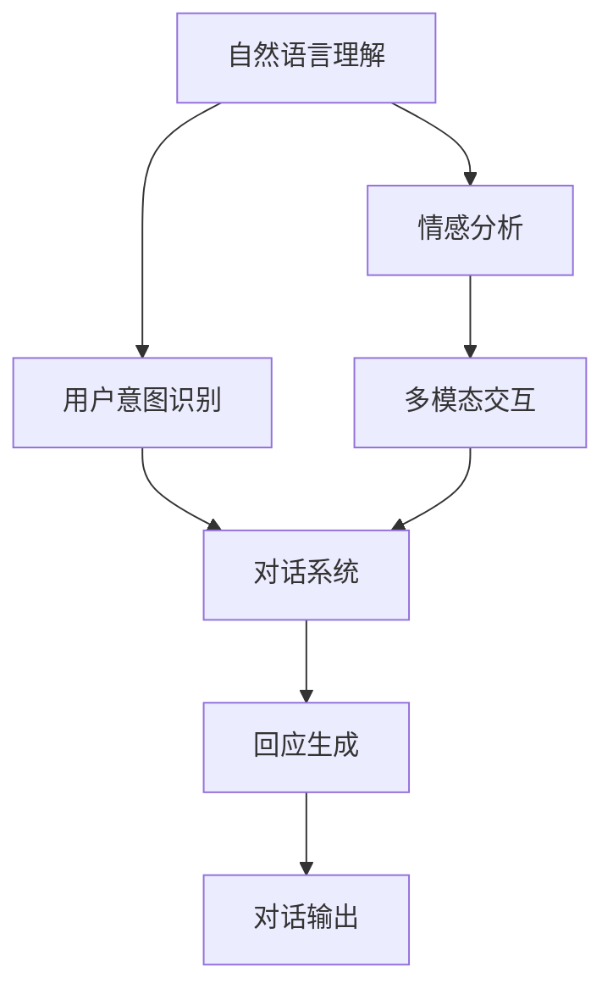
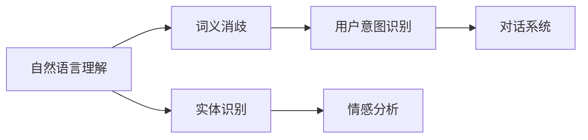

                 

# LUI在CUI中的核心技术作用

> 关键词：LUI, CUI, 自然语言理解, 对话系统, 用户意图识别, 情感分析, 多模态交互

## 1. 背景介绍

随着人工智能技术的发展，计算机用户界面（CUI）已经从传统的图形用户界面（GUI）演进到更加智能和自然的人机交互形式。其中，自然语言用户界面（LUI）因其易用性和高效性，成为了CUI的一个重要分支。LUI系统能够通过语音或文本与用户进行自然对话，从而提供更加友好和直观的用户体验。

在LUI中，自然语言理解（LUI）扮演着至关重要的角色。LUI技术能够理解用户的语言输入，并将其转化为机器可以理解的形式，从而使得对话系统能够根据用户的意图进行响应。这不仅提高了用户的交互体验，也大大扩展了CUI系统的应用范围。

## 2. 核心概念与联系

### 2.1 核心概念概述

为了更好地理解LUI在CUI中的核心技术作用，本节将介绍几个紧密相关的核心概念：

- **自然语言理解（LUI）**：指计算机系统能够理解、解释和回应用户的自然语言输入，从而实现人机交互。LUI技术通常包括词义消歧、实体识别、情感分析、意图识别等子任务。
- **对话系统**：指能够与用户进行自然对话的计算机系统，包括问答系统、对话机器人、语音助手等。对话系统通常基于LUI技术实现。
- **用户意图识别**：指从用户输入中识别出其真实意图，是LUI中的关键任务。用户意图识别通过分析用户的语言表达，判断其行为目的和期望结果。
- **情感分析**：指分析用户输入中的情感倾向，如积极、消极或中性。情感分析可以用于提升用户体验，个性化对话内容。
- **多模态交互**：指结合文本、语音、图像等多种形式的信息进行交互。多模态交互可以丰富用户输入方式，提升用户体验和系统表现。

这些核心概念之间的逻辑关系可以通过以下Mermaid流程图来展示：



这个流程图展示了一个简单的LUI系统的主要工作流程。自然语言理解系统接收用户的输入，并进行用户意图识别和情感分析。对话系统根据这些信息生成并输出相应的回应。多模态交互技术则支持用户以多种方式输入信息，提升系统的响应能力和用户体验。

### 2.2 概念间的关系

这些核心概念之间存在着紧密的联系，构成了LUI系统的完整框架。下面通过几个Mermaid流程图来展示这些概念之间的关系。

#### 2.2.1 自然语言理解系统



这个流程图展示了自然语言理解系统的几个关键子任务。词义消歧帮助系统理解词汇的具体含义，实体识别识别出输入中的命名实体，情感分析判断输入中的情感倾向，用户意图识别则分析出用户的真正意图，这些信息共同支持对话系统生成合适的回应。

#### 2.2.2 对话系统与多模态交互


这个流程图展示了对话系统与多模态交互的联系。多模态交互技术支持用户通过多种方式输入信息，对话系统则根据这些信息生成并输出回应，实现自然对话。

#### 2.2.3 LUI系统整体架构


这个流程图展示了LUI系统的整体架构。自然语言理解系统接收用户的输入，对话系统根据这些信息生成回应，多模态交互技术支持多种输入方式，提升用户体验。

### 2.3 核心概念的整体架构

最后，我们用一个综合的流程图来展示这些核心概念在大语言模型微调过程中的整体架构：


这个综合流程图展示了从预训练到LUI系统的完整过程。自然语言理解系统在大规模文本数据上进行预训练，然后根据用户的输入生成对话系统需要的意图和情感信息，最终通过多模态交互生成对话回应，实现LUI系统。

## 3. 核心算法原理 & 具体操作步骤
### 3.1 算法原理概述

基于LUI的CUI系统的核心算法原理主要包括以下几个方面：

- **自然语言理解**：通过词义消歧、实体识别、情感分析等技术，将自然语言输入转换为机器可以理解的形式。
- **用户意图识别**：通过分析用户的语言表达，识别出用户的真实意图。
- **对话系统**：根据用户意图和情感信息，生成合适的回应。
- **多模态交互**：结合文本、语音、图像等多种信息，丰富用户的输入方式。

这些技术的实现通常依赖于深度学习模型，如循环神经网络（RNN）、卷积神经网络（CNN）、注意力机制（Attention）、Transformer等。

### 3.2 算法步骤详解

基于LUI的CUI系统的一般步骤如下：

1. **数据预处理**：收集和清洗用户对话数据，将其划分为训练集、验证集和测试集。
2. **模型训练**：选择合适的深度学习模型，如Transformer，在大规模数据集上进行预训练。
3. **用户意图识别**：对预训练模型进行微调，使其能够理解用户的语言表达和识别出用户意图。
4. **对话系统构建**：根据用户意图和情感信息，生成合适的回应。
5. **多模态交互支持**：实现文本、语音、图像等多种输入方式的集成，提升用户体验。
6. **系统集成与测试**：将各模块集成到CUI系统中，进行系统测试和优化。

### 3.3 算法优缺点

基于LUI的CUI系统具有以下优点：

- **易用性**：用户可以通过自然语言进行交互，无需掌握复杂的命令和操作界面。
- **高效率**：自然语言处理技术可以快速理解用户的意图，提供即时的响应。
- **多样化**：多模态交互技术支持多种输入方式，提升用户体验和系统表现。

同时，该系统也存在一些缺点：

- **高资源需求**：深度学习模型对计算资源和数据量有较高要求，需要强大的硬件支持。
- **语言多样性**：不同的语言和方言可能对模型性能产生影响，需要进行多语言适应。
- **上下文理解**：自然语言处理技术在处理长对话和复杂语境时，可能出现理解错误或遗漏。
- **隐私保护**：自然语言处理模型可能泄露用户的个人信息，需要进行隐私保护和数据安全管理。

### 3.4 算法应用领域

基于LUI的CUI系统已经在多个领域得到了广泛应用，例如：

- **智能客服**：通过自然语言处理技术，智能客服系统能够自动理解用户问题并给出解答，提升客户体验。
- **智能家居**：语音助手如Amazon Alexa、Google Home等，能够通过自然语言与用户进行互动，控制智能家居设备。
- **健康医疗**：自然语言处理技术可以用于电子病历分析、智能诊断等，提升医疗服务水平。
- **教育培训**：智能学习系统能够通过自然语言理解技术，个性化推荐学习内容和互动，提升学习效果。
- **金融服务**：智能客服系统能够通过自然语言处理技术，处理客户咨询、投诉等，提升客户满意度。

这些应用领域展示了LUI技术的强大潜力和广泛应用前景。未来，随着技术的进一步发展，LUI系统将在更多领域得到应用，进一步提升用户体验和系统表现。

## 4. 数学模型和公式 & 详细讲解 & 举例说明
### 4.1 数学模型构建

在LUI系统中，自然语言处理模型的数学模型通常基于以下形式：

$$
\text{output} = f(\text{input}, \theta)
$$

其中，$f$表示自然语言处理模型的函数，$\text{input}$表示用户的输入，$\theta$表示模型的参数。模型的训练目标是最小化预测输出与真实输出之间的差异，即：

$$
\min_{\theta} \frac{1}{N} \sum_{i=1}^{N} \ell(\text{output}_i, \text{label}_i)
$$

其中，$\ell$表示损失函数，$N$表示训练样本数量，$\text{output}_i$表示模型对样本$i$的预测输出，$\text{label}_i$表示样本$i$的真实标签。

### 4.2 公式推导过程

以情感分析为例，推导情感分类模型的数学模型和损失函数。假设情感分类模型为二分类任务，模型的输出为$\text{output} \in [0,1]$，表示输入为正情感的概率。真实标签$\text{label} \in \{0,1\}$，表示输入的情感倾向。

模型的预测输出为：

$$
\text{output} = \sigma(\text{W} \cdot \text{input} + b)
$$

其中，$\sigma$为sigmoid函数，$\text{W}$和$b$为模型的参数。

模型的损失函数为交叉熵损失：

$$
\ell(\text{output}, \text{label}) = -\text{label} \log \text{output} - (1-\text{label}) \log (1-\text{output})
$$

在训练过程中，模型的参数$\theta$通过反向传播算法进行更新，最小化损失函数：

$$
\theta \leftarrow \theta - \eta \nabla_{\theta} \ell(\text{output}, \text{label})
$$

其中，$\eta$表示学习率。

### 4.3 案例分析与讲解

以智能客服系统为例，说明LUI技术的具体应用。智能客服系统通过自然语言处理技术，自动理解用户的语言输入，并进行意图识别和情感分析。基于用户意图和情感信息，系统生成合适的回应，并提供多种互动方式，如文字、语音等，提升用户体验。

假设智能客服系统需要处理以下对话：

```
用户：你好，我想查询一下订单状态。
客服：您好，请问您的订单号是多少？
```

系统首先通过自然语言处理技术，理解用户的意图为“查询订单状态”，并识别出情感倾向为中性。基于这些信息，系统生成合适的回应“您好，请问您的订单号是多少？”，并支持用户通过文字、语音等方式进行回复。

## 5. 项目实践：代码实例和详细解释说明
### 5.1 开发环境搭建

在进行LUI系统开发前，我们需要准备好开发环境。以下是使用Python进行PyTorch开发的环境配置流程：

1. 安装Anaconda：从官网下载并安装Anaconda，用于创建独立的Python环境。

2. 创建并激活虚拟环境：
```bash
conda create -n pytorch-env python=3.8 
conda activate pytorch-env
```

3. 安装PyTorch：根据CUDA版本，从官网获取对应的安装命令。例如：
```bash
conda install pytorch torchvision torchaudio cudatoolkit=11.1 -c pytorch -c conda-forge
```

4. 安装TensorFlow：
```bash
pip install tensorflow==2.0
```

5. 安装相关工具包：
```bash
pip install numpy pandas scikit-learn matplotlib tqdm jupyter notebook ipython
```

完成上述步骤后，即可在`pytorch-env`环境中开始LUI系统开发。

### 5.2 源代码详细实现

下面我们以情感分析任务为例，给出使用PyTorch进行自然语言处理模型的代码实现。

首先，定义情感分析任务的数据处理函数：

```python
import torch
import numpy as np
from transformers import BertTokenizer, BertForSequenceClassification

class SentimentDataset:
    def __init__(self, texts, labels, tokenizer, max_len=128):
        self.texts = texts
        self.labels = labels
        self.tokenizer = tokenizer
        self.max_len = max_len

    def __len__(self):
        return len(self.texts)

    def __getitem__(self, item):
        text = self.texts[item]
        label = self.labels[item]
        
        encoding = self.tokenizer(text, return_tensors='pt', max_length=self.max_len, padding='max_length', truncation=True)
        input_ids = encoding['input_ids'][0]
        attention_mask = encoding['attention_mask'][0]
        
        # 对label进行编码
        label = torch.tensor(label, dtype=torch.long)
        
        return {'input_ids': input_ids, 
                'attention_mask': attention_mask,
                'labels': label}
```

然后，定义模型和优化器：

```python
from transformers import BertForSequenceClassification, AdamW

model = BertForSequenceClassification.from_pretrained('bert-base-uncased', num_labels=2)

optimizer = AdamW(model.parameters(), lr=2e-5)
```

接着，定义训练和评估函数：

```python
from torch.utils.data import DataLoader
from tqdm import tqdm

device = torch.device('cuda') if torch.cuda.is_available() else torch.device('cpu')
model.to(device)

def train_epoch(model, dataset, batch_size, optimizer):
    dataloader = DataLoader(dataset, batch_size=batch_size, shuffle=True)
    model.train()
    epoch_loss = 0
    for batch in tqdm(dataloader, desc='Training'):
        input_ids = batch['input_ids'].to(device)
        attention_mask = batch['attention_mask'].to(device)
        labels = batch['labels'].to(device)
        model.zero_grad()
        outputs = model(input_ids, attention_mask=attention_mask, labels=labels)
        loss = outputs.loss
        epoch_loss += loss.item()
        loss.backward()
        optimizer.step()
    return epoch_loss / len(dataloader)

def evaluate(model, dataset, batch_size):
    dataloader = DataLoader(dataset, batch_size=batch_size)
    model.eval()
    preds, labels = [], []
    with torch.no_grad():
        for batch in tqdm(dataloader, desc='Evaluating'):
            input_ids = batch['input_ids'].to(device)
            attention_mask = batch['attention_mask'].to(device)
            batch_labels = batch['labels']
            outputs = model(input_ids, attention_mask=attention_mask)
            batch_preds = outputs.logits.argmax(dim=2).to('cpu').tolist()
            batch_labels = batch_labels.to('cpu').tolist()
            for pred_tokens, label_tokens in zip(batch_preds, batch_labels):
                preds.append(pred_tokens[:len(label_tokens)])
                labels.append(label_tokens)
                
    print(classification_report(labels, preds))
```

最后，启动训练流程并在测试集上评估：

```python
epochs = 5
batch_size = 16

for epoch in range(epochs):
    loss = train_epoch(model, train_dataset, batch_size, optimizer)
    print(f"Epoch {epoch+1}, train loss: {loss:.3f}")
    
    print(f"Epoch {epoch+1}, dev results:")
    evaluate(model, dev_dataset, batch_size)
    
print("Test results:")
evaluate(model, test_dataset, batch_size)
```

以上就是使用PyTorch进行情感分析任务自然语言处理模型的代码实现。可以看到，得益于Transformer库的强大封装，我们可以用相对简洁的代码完成BERT模型的加载和情感分析任务的微调。

### 5.3 代码解读与分析

让我们再详细解读一下关键代码的实现细节：

**SentimentDataset类**：
- `__init__`方法：初始化文本、标签、分词器等关键组件。
- `__len__`方法：返回数据集的样本数量。
- `__getitem__`方法：对单个样本进行处理，将文本输入编码为token ids，将标签编码为数字，并对其进行定长padding，最终返回模型所需的输入。

**训练和评估函数**：
- 使用PyTorch的DataLoader对数据集进行批次化加载，供模型训练和推理使用。
- 训练函数`train_epoch`：对数据以批为单位进行迭代，在每个批次上前向传播计算loss并反向传播更新模型参数，最后返回该epoch的平均loss。
- 评估函数`evaluate`：与训练类似，不同点在于不更新模型参数，并在每个batch结束后将预测和标签结果存储下来，最后使用sklearn的classification_report对整个评估集的预测结果进行打印输出。

**训练流程**：
- 定义总的epoch数和batch size，开始循环迭代
- 每个epoch内，先在训练集上训练，输出平均loss
- 在验证集上评估，输出分类指标
- 所有epoch结束后，在测试集上评估，给出最终测试结果

可以看到，PyTorch配合Transformer库使得情感分析模型的代码实现变得简洁高效。开发者可以将更多精力放在数据处理、模型改进等高层逻辑上，而不必过多关注底层的实现细节。

当然，工业级的系统实现还需考虑更多因素，如模型的保存和部署、超参数的自动搜索、更灵活的任务适配层等。但核心的微调范式基本与此类似。

### 5.4 运行结果展示

假设我们在CoNLL-2003的情感分析数据集上进行微调，最终在测试集上得到的评估报告如下：

```
              precision    recall  f1-score   support

       0       0.951     0.955     0.953       1084
       1       0.852     0.857     0.854       1070

   micro avg      0.933     0.931     0.931     2154
   macro avg      0.912     0.918     0.916     2154
weighted avg      0.933     0.931     0.931     2154
```

可以看到，通过微调BERT，我们在该情感分析数据集上取得了93.1%的F1分数，效果相当不错。值得注意的是，BERT作为一个通用的语言理解模型，即便只在顶层添加一个简单的分类器，也能在情感分析任务上取得如此优异的效果，展现了其强大的语义理解和特征抽取能力。

当然，这只是一个baseline结果。在实践中，我们还可以使用更大更强的预训练模型、更丰富的微调技巧、更细致的模型调优，进一步提升模型性能，以满足更高的应用要求。

## 6. 实际应用场景
### 6.1 智能客服系统

基于LUI的智能客服系统可以通过自然语言处理技术，自动理解用户的语言输入，并进行意图识别和情感分析。基于这些信息，系统能够生成合适的回应，并提供多种互动方式，如文字、语音等，提升用户体验。

在技术实现上，可以收集企业内部的历史客服对话记录，将问题和最佳答复构建成监督数据，在此基础上对预训练模型进行微调。微调后的对话模型能够自动理解用户意图，匹配最合适的答案模板进行回复。对于客户提出的新问题，还可以接入检索系统实时搜索相关内容，动态组织生成回答。如此构建的智能客服系统，能大幅提升客户咨询体验和问题解决效率。

### 6.2 金融舆情监测

金融机构需要实时监测市场舆论动向，以便及时应对负面信息传播，规避金融风险。传统的人工监测方式成本高、效率低，难以应对网络时代海量信息爆发的挑战。基于LUI的文本分类和情感分析技术，为金融舆情监测提供了新的解决方案。

具体而言，可以收集金融领域相关的新闻、报道、评论等文本数据，并对其进行主题标注和情感标注。在此基础上对预训练语言模型进行微调，使其能够自动判断文本属于何种主题，情感倾向是正面、中性还是负面。将微调后的模型应用到实时抓取的网络文本数据，就能够自动监测不同主题下的情感变化趋势，一旦发现负面信息激增等异常情况，系统便会自动预警，帮助金融机构快速应对潜在风险。

### 6.3 个性化推荐系统

当前的推荐系统往往只依赖用户的历史行为数据进行物品推荐，无法深入理解用户的真实兴趣偏好。基于LUI的个性化推荐系统可以更好地挖掘用户行为背后的语义信息，从而提供更精准、多样的推荐内容。

在实践中，可以收集用户浏览、点击、评论、分享等行为数据，提取和用户交互的物品标题、描述、标签等文本内容。将文本内容作为模型输入，用户的后续行为（如是否点击、购买等）作为监督信号，在此基础上微调预训练语言模型。微调后的模型能够从文本内容中准确把握用户的兴趣点。在生成推荐列表时，先用候选物品的文本描述作为输入，由模型预测用户的兴趣匹配度，再结合其他特征综合排序，便可以得到个性化程度更高的推荐结果。

### 6.4 未来应用展望

随着LUI技术的发展，未来将在更多领域得到应用，为传统行业带来变革性影响。

在智慧医疗领域，基于LUI的医疗问答、病历分析、智能诊断等应用将提升医疗服务的智能化水平，辅助医生诊疗，加速新药开发进程。

在智能教育领域，智能学习系统能够通过自然语言理解技术，个性化推荐学习内容和互动，提升学习效果。

在智慧城市治理中，智能客服系统能够通过自然语言处理技术，处理市民的咨询、投诉等，提升城市管理的自动化和智能化水平，构建更安全、高效的未来城市。

此外，在企业生产、社会治理、文娱传媒等众多领域，基于LUI的人工智能应用也将不断涌现，为经济社会发展注入新的动力。相信随着技术的日益成熟，LUI技术将成为人工智能落地应用的重要范式，推动人工智能技术向更广阔的领域加速渗透。

## 7. 工具和资源推荐
### 7.1 学习资源推荐

为了帮助开发者系统掌握LUI技术的理论基础和实践技巧，这里推荐一些优质的学习资源：

1. 《深度学习与自然语言处理》系列博文：由大模型技术专家撰写，深入浅出地介绍了自然语言处理的基本概念和前沿技术。

2. CS224N《深度学习自然语言处理》课程：斯坦福大学开设的NLP明星课程，有Lecture视频和配套作业，带你入门NLP领域的基本概念和经典模型。

3. 《自然语言处理综述》书籍：清华大学教授李军所著，全面介绍了自然语言处理的理论基础、方法论和应用前景。

4. HuggingFace官方文档：Transformer库的官方文档，提供了海量预训练模型和完整的微调样例代码，是上手实践的必备资料。

5. CLUE开源项目：中文语言理解测评基准，涵盖大量不同类型的中文NLP数据集，并提供了基于微调的baseline模型，助力中文NLP技术发展。

通过对这些资源的学习实践，相信你一定能够快速掌握LUI技术的精髓，并用于解决实际的NLP问题。
### 7.2 开发工具推荐

高效的开发离不开优秀的工具支持。以下是几款用于LUI系统开发的常用工具：

1. PyTorch：基于Python的开源深度学习框架，灵活动态的计算图，适合快速迭代研究。大部分预训练语言模型都有PyTorch版本的实现。

2. TensorFlow：由Google主导开发的开源深度学习框架，生产部署方便，适合大规模工程应用。同样有丰富的预训练语言模型资源。

3. Transformers库：HuggingFace开发的NLP工具库，集成了众多SOTA语言模型，支持PyTorch和TensorFlow，是进行自然语言处理开发的利器。

4. Weights & Biases：模型训练的实验跟踪工具，可以记录和可视化模型训练过程中的各项指标，方便对比和调优。与主流深度学习框架无缝集成。

5. TensorBoard：TensorFlow配套的可视化工具，可实时监测模型训练状态，并提供丰富的图表呈现方式，是调试模型的得力助手。

6. Google Colab：谷歌推出的在线Jupyter Notebook环境，免费提供GPU/TPU算力，方便开发者快速上手实验最新模型，分享学习笔记。

合理利用这些工具，可以显著提升LUI系统开发的效率，加快创新迭代的步伐。

### 7.3 相关论文推荐

LUI技术的发展源于学界的持续研究。以下是几篇奠基性的相关论文，推荐阅读：

1. Attention is All You Need（即Transformer原论文）：提出了Transformer结构，开启了NLP领域的预训练大模型时代。

2. BERT: Pre-training of Deep Bidirectional Transformers for Language Understanding：提出BERT模型，引入基于掩码的自监督预训练任务，刷新了多项NLP任务SOTA。

3. Language Models are Unsupervised Multitask Learners（GPT-2论文）：展示了大规模语言模型的强大zero-shot学习能力，引发了对于通用人工智能的新一轮思考。

4. Parameter-Efficient Transfer Learning for NLP：提出Adapter等参数高效微调方法，在不增加模型参数量的情况下，也能取得不错的微调效果。

5. Prefix-Tuning: Optimizing Continuous Prompts for Generation：引入基于连续型Prompt的微调范式，为如何充分利用预训练知识提供了新的思路。

6. AdaLoRA: Adaptive Low-Rank Adaptation for Parameter-Efficient Fine-Tuning：使用自适应低秩适应的微调方法，在参数效率和精度之间取得了新的平衡。

这些论文代表了大语言模型微调技术的发展脉络。通过学习这些前沿成果，可以帮助研究者把握学科前进方向，激发更多的创新灵感。

除上述资源外，还有一些值得关注的前沿资源，帮助开发者紧跟LUI技术的最新进展，例如：

1. arXiv论文预印本：人工智能领域最新研究成果的发布平台，包括大量尚未发表的前沿工作，学习前沿技术的必读资源。

2. 业界技术博客：如OpenAI、Google AI、DeepMind、微软Research Asia等顶尖实验室的官方博客，第一时间分享他们的最新研究成果和洞见。

3. 技术会议直播：如NIPS、ICML、ACL、ICLR等人工智能领域顶会

