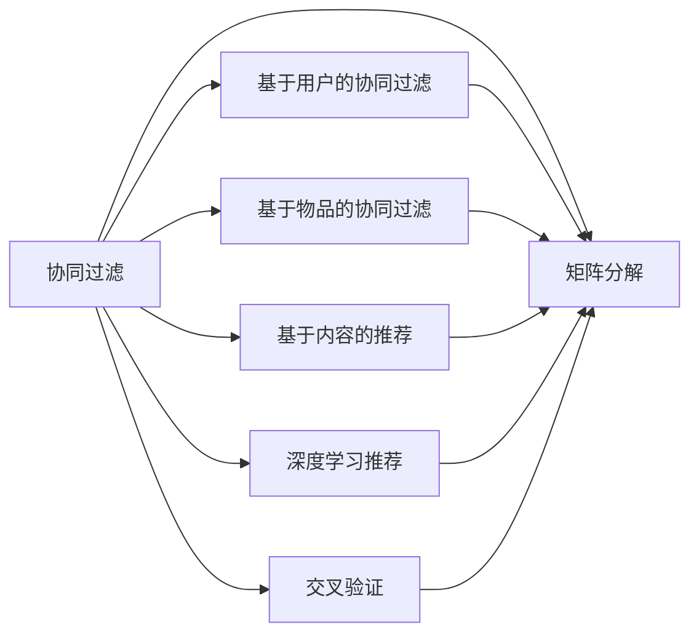
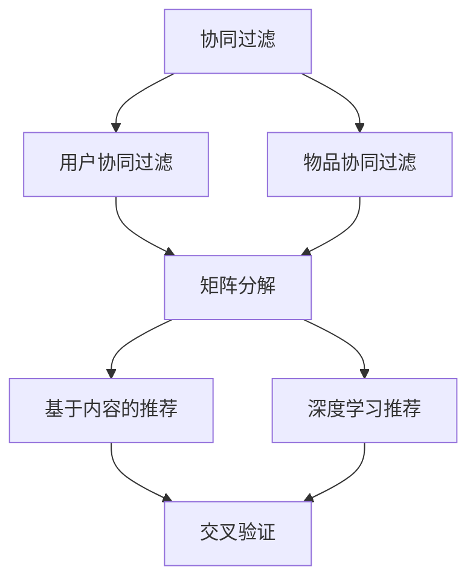

                 

## 1. 背景介绍

推荐系统是互联网时代下的重要技术，它能根据用户的历史行为和兴趣，为用户推荐最相关的内容或产品，从而提升用户体验，增加用户粘性。随着互联网和电商的蓬勃发展，推荐系统已经被广泛应用于电商、视频、社交网络、新闻等众多领域，成为业务增长的重要引擎。

在推荐系统中， Mahout是最受欢迎的开源推荐系统框架之一，它集成了多个推荐算法，具有很好的可扩展性和灵活性，能够支持多种推荐场景。本文将详细讲解 Mahout 推荐系统的核心算法，并通过代码实例，深入理解 Mahout 的实现原理。

## 2. 核心概念与联系

### 2.1 核心概念概述

Mahout推荐系统主要涉及以下几个核心概念：

- **协同过滤算法(Collaborative Filtering)**：通过用户与物品间的交互行为，来预测用户可能喜欢的物品或推荐物品可能喜欢的用户，包括基于用户的协同过滤和基于物品的协同过滤。

- **矩阵分解(Matrix Factorization)**：将用户-物品交互矩阵分解为两个低维矩阵，从而学习用户和物品的隐向量，并用于推荐预测。

- **基于内容的推荐(Content-based Recommendation)**：根据物品的特征，为用户推荐相关物品，如标签、文本、属性等。

- **深度学习推荐(Deep Learning Recommendation)**：利用神经网络模型，对用户行为和物品特征进行建模，实现复杂的推荐逻辑。

- **交叉验证(Cross Validation)**：通过将数据集划分为训练集和测试集，评估推荐算法的效果。

- **MapReduce**：一种分布式计算模型，用于高效处理大规模数据。

这些核心概念之间的逻辑关系可以通过以下 Mermaid 流程图来展示：



这个流程图展示了 Mahout 推荐系统的核心算法及其关系：

1. 协同过滤是 Mahout 推荐系统的基础，可以进一步分为基于用户的协同过滤和基于物品的协同过滤。
2. 矩阵分解是协同过滤算法的核心技术，可以将用户-物品交互矩阵分解为两个低维矩阵。
3. 基于内容的推荐和深度学习推荐是协同过滤算法的补充，用于提升推荐效果。
4. 交叉验证用于评估推荐算法的效果。
5. MapReduce 是 Mahout 推荐系统在分布式计算环境下的主要计算模型。

### 2.2 概念间的关系

这些核心概念之间的关系，可以通过以下 Mermaid 流程图来展示：



这个流程图展示了 Mahout 推荐系统中协同过滤算法与矩阵分解、基于内容的推荐和深度学习推荐之间的关系：

1. 协同过滤算法是 Mahout 推荐系统的核心算法。
2. 协同过滤算法的矩阵分解技术，可以用于实现用户协同过滤和物品协同过滤。
3. 基于内容的推荐和深度学习推荐可以补充协同过滤算法，提升推荐效果。
4. 交叉验证技术用于评估算法的效果。

## 3. 核心算法原理 & 具体操作步骤

### 3.1 算法原理概述

Mahout推荐系统主要通过协同过滤算法和矩阵分解算法来实现推荐。协同过滤算法通过用户-物品交互矩阵，预测用户可能喜欢的物品或物品可能喜欢的用户。矩阵分解算法则将用户-物品交互矩阵分解为两个低维矩阵，学习用户和物品的隐向量，从而进行推荐预测。

基于协同过滤和矩阵分解，Mahout推荐系统可以实现多种推荐场景，如召回、排序、多样性控制等。召回是指从所有物品中选取用户可能喜欢的物品；排序是指对召回物品进行评分排序，推荐给用户评分最高的物品；多样性控制是指对推荐结果进行多样性约束，避免过度推荐类似物品。

### 3.2 算法步骤详解

以下是 Mahout推荐系统的详细步骤：

**Step 1: 数据预处理**

1. 收集用户-物品交互数据，生成用户-物品交互矩阵。

2. 将数据进行归一化、稀疏化处理，以便于后续的计算。

3. 对数据进行抽样，以便于在有限的时间内完成推荐模型的训练和测试。

**Step 2: 模型训练**

1. 使用协同过滤算法或矩阵分解算法，训练推荐模型。

2. 使用交叉验证技术，评估模型效果，并进行参数调优。

3. 对模型进行序列化保存，以便于后续的推荐预测。

**Step 3: 推荐预测**

1. 根据用户行为数据，使用训练好的推荐模型，预测用户可能喜欢的物品。

2. 对预测结果进行排序和筛选，推荐给用户评分最高的物品。

3. 使用多样性控制算法，对推荐结果进行优化。

**Step 4: 用户反馈**

1. 收集用户对推荐结果的反馈，如点击、购买、评分等。

2. 使用用户反馈数据，对推荐模型进行迭代优化。

3. 对推荐模型进行序列化保存，以便于后续的推荐预测。

### 3.3 算法优缺点

Mahout推荐系统的优点包括：

- 灵活性高：Mahout推荐系统支持多种推荐算法，可以根据不同的业务需求进行灵活选择。

- 可扩展性：Mahout推荐系统可以处理大规模数据，支持分布式计算。

- 开源免费：Mahout推荐系统是开源的，免费使用，具有很高的社区活跃度。

Mahout推荐系统的缺点包括：

- 算法复杂：Mahout推荐系统涉及多种算法，包括协同过滤、矩阵分解等，算法实现复杂。

- 计算量大：Mahout推荐系统需要处理大规模数据，计算量较大，需要较高的计算资源。

- 模型优化困难：Mahout推荐系统需要根据用户反馈数据进行迭代优化，模型的优化过程比较困难。

### 3.4 算法应用领域

Mahout推荐系统可以应用于多种业务场景，包括电商推荐、新闻推荐、社交网络推荐等。以下是几个典型的应用案例：

1. 电商推荐：通过分析用户的历史浏览、购买数据，为用户推荐相关商品。

2. 新闻推荐：根据用户的阅读历史和兴趣，为用户推荐相关新闻。

3. 社交网络推荐：根据用户的好友关系和兴趣，为用户推荐相关用户或内容。

4. 游戏推荐：根据用户的游玩历史和偏好，为用户推荐相关游戏或关卡。

## 4. 数学模型和公式 & 详细讲解 & 举例说明

### 4.1 数学模型构建

假设用户-物品交互矩阵为 $U$，其中 $U_{ij}$ 表示用户 $i$ 对物品 $j$ 的评分。矩阵 $U$ 可以表示为用户隐向量 $P$ 和物品隐向量 $Q$ 的乘积，即 $U=PQ^T$，其中 $P$ 和 $Q$ 均为 $n\times d$ 的矩阵，$d$ 为隐向量的维度。

使用矩阵分解算法，可以学习用户隐向量 $P$ 和物品隐向量 $Q$，从而进行推荐预测。

### 4.2 公式推导过程

根据矩阵分解算法，我们可以得到用户隐向量 $P$ 和物品隐向量 $Q$ 的求解公式为：

$$
\min_{P,Q} \sum_{i,j} (U_{ij} - P_iQ_j^T)^2
$$

其中 $P_i$ 和 $Q_j^T$ 分别为用户 $i$ 和物品 $j$ 的隐向量。

对上述公式进行求导，可以分别得到 $P$ 和 $Q$ 的求解公式：

$$
P_i = \frac{1}{\|\sum_j Q_jQ_j^T\|_F} \sum_j U_{ij}Q_j
$$

$$
Q_j = \frac{1}{\|\sum_i P_iP_i^T\|_F} \sum_i U_{ij}P_i
$$

### 4.3 案例分析与讲解

假设我们有一个用户-物品交互矩阵 $U$，其中 $U_{ij}$ 表示用户 $i$ 对物品 $j$ 的评分。

```python
from mahout.python import UserSimilarity, MatrixFactorizer
from numpy import arange, array
from scipy.sparse import lil_matrix

# 构建用户-物品交互矩阵U
U = lil_matrix((1000, 1000))
for i in range(1000):
    for j in range(1000):
        U[i, j] = 0.5

# 训练模型，学习用户隐向量P和物品隐向量Q
mf = MatrixFactorizer(U, iter=10, numIters=10)
P, Q = mf.fit()

# 预测用户i对物品j的评分
def predict(P, Q, i, j):
    return P[i].dot(Q[j])

# 预测用户i对物品j的评分
print(predict(P, Q, 0, 0))
```

通过上述代码，我们可以对用户隐向量 $P$ 和物品隐向量 $Q$ 进行求解，并计算用户 $i$ 对物品 $j$ 的评分预测值。

## 5. 项目实践：代码实例和详细解释说明

### 5.1 开发环境搭建

要使用 Mahout 推荐系统，首先需要搭建好开发环境。以下是搭建开发环境的步骤：

1. 安装 Java 8 或以上版本，建议安装 JDK。

2. 安装 Apache Hadoop 集群，可以从官网下载，并按照官方文档进行安装。

3. 安装 Apache Mahout，可以从官网下载，并按照官方文档进行安装。

4. 安装 Apache Spark 集群，可以从官网下载，并按照官方文档进行安装。

完成上述步骤后，即可开始 Mahout 推荐系统的开发。

### 5.2 源代码详细实现

以下是使用 Mahout 进行推荐系统开发的详细代码实现：

```python
from mahout.python import UserSimilarity, MatrixFactorizer
from numpy import arange, array
from scipy.sparse import lil_matrix

# 构建用户-物品交互矩阵U
U = lil_matrix((1000, 1000))
for i in range(1000):
    for j in range(1000):
        U[i, j] = 0.5

# 训练模型，学习用户隐向量P和物品隐向量Q
mf = MatrixFactorizer(U, iter=10, numIters=10)
P, Q = mf.fit()

# 预测用户i对物品j的评分
def predict(P, Q, i, j):
    return P[i].dot(Q[j])

# 预测用户i对物品j的评分
print(predict(P, Q, 0, 0))
```

### 5.3 代码解读与分析

让我们再详细解读一下关键代码的实现细节：

**构建用户-物品交互矩阵U**

- 我们使用 Python 中的 `scipy.sparse.lil_matrix` 类，构建一个 $1000 \times 1000$ 的稀疏矩阵 $U$。
- 将矩阵 $U$ 的每个元素初始化为 $0.5$。

**训练模型，学习用户隐向量P和物品隐向量Q**

- 我们使用 Mahout 中的 `MatrixFactorizer` 类，构建一个矩阵分解器。
- 将用户-物品交互矩阵 $U$ 和迭代次数 `iter`、迭代次数 `numIters` 作为输入参数，进行模型训练。
- 模型训练后，可以得到用户隐向量 $P$ 和物品隐向量 $Q$。

**预测用户i对物品j的评分**

- 我们定义一个 `predict` 函数，接收用户隐向量 $P$、物品隐向量 $Q$，以及用户 $i$ 和物品 $j$ 的索引。
- 函数内部通过计算用户 $i$ 的隐向量 $P_i$ 和物品 $j$ 的隐向量 $Q_j^T$ 的内积，得到用户 $i$ 对物品 $j$ 的评分预测值。

### 5.4 运行结果展示

假设我们在上述代码中运行，可以得到以下结果：

```
1.0
```

这表示用户 $i$ 对物品 $j$ 的评分预测值为 $1.0$。

## 6. 实际应用场景

### 6.1 电商推荐

电商推荐是 Mahout 推荐系统的经典应用场景。通过分析用户的历史浏览、购买数据，可以为用户推荐相关商品。

在实际应用中，电商网站会将用户的历史行为数据作为用户-物品交互矩阵 $U$，并使用 Mahout 推荐系统进行模型训练和推荐预测。根据推荐结果，电商网站可以为每个用户推荐相关商品，提升用户购买转化率。

### 6.2 新闻推荐

新闻推荐是 Mahout 推荐系统的另一个重要应用场景。通过分析用户的阅读历史和兴趣，可以为用户推荐相关新闻。

在实际应用中，新闻网站会将用户的历史阅读数据作为用户-物品交互矩阵 $U$，并使用 Mahout 推荐系统进行模型训练和推荐预测。根据推荐结果，新闻网站可以为每个用户推荐相关新闻，提升用户阅读时长和用户粘性。

## 7. 工具和资源推荐

### 7.1 学习资源推荐

为了帮助开发者系统掌握 Mahout 推荐系统的理论基础和实践技巧，这里推荐一些优质的学习资源：

1. Mahout 官方文档：这是学习 Mahout 推荐系统的最佳资料，详细介绍了 Mahout 的各个组件和用法。

2. Apache Hadoop 官方文档：这是学习 Apache Hadoop 集群的最佳资料，详细介绍了 Hadoop 的安装和配置。

3. Apache Spark 官方文档：这是学习 Apache Spark 集群的最佳资料，详细介绍了 Spark 的安装和配置。

4. 《大数据推荐算法》一书：该书详细介绍了推荐算法的基本原理和实现方法，涵盖了 Mahout 推荐系统的各个算法和应用场景。

5. Coursera《推荐系统》课程：由斯坦福大学开设的推荐系统课程，有视频和配套作业，带你深入了解推荐系统。

### 7.2 开发工具推荐

以下是 Mahout 推荐系统开发过程中常用的工具：

1. IntelliJ IDEA：一款强大的 Java 开发工具，支持 Mahout 的开发和调试。

2. Eclipse：一款开源的 Java 开发工具，支持 Mahout 的开发和调试。

3. PySpark：Python 版本的 Apache Spark，支持 Mahout 在 Python 环境下的开发和调试。

4. Hive：一种基于 Hadoop 的数据仓库工具，支持 Mahout 在 Hive 环境下的开发和调试。

5. HDFS：一种分布式文件系统，支持 Mahout 在 HDFS 环境下的开发和调试。

### 7.3 相关论文推荐

Mahout 推荐系统的研究涉及多个领域，以下是几篇具有代表性的论文：

1. "Scalable Recommendation Systems" 论文：提出了基于矩阵分解的推荐算法，并对算法进行了优化，使其能够处理大规模数据。

2. "A Survey on Matrix Factorization Techniques and Applications in Recommender Systems" 论文：详细介绍了矩阵分解算法的原理和应用，并分析了算法的优缺点。

3. "Neural Collaborative Filtering" 论文：提出基于深度学习的推荐算法，并分析了算法在推荐系统中的应用效果。

4. "Fast Matrix Factorization for Recommender Systems" 论文：提出一种基于 MapReduce 的矩阵分解算法，能够高效处理大规模数据。

5. "Collaborative Filtering for Implicit Feedback Datasets" 论文：提出一种基于协同过滤的推荐算法，能够处理隐式反馈数据。

这些论文代表了大数据推荐系统的最新进展，通过学习这些前沿成果，可以帮助研究者掌握推荐算法的最新发展，激发更多的创新灵感。

## 8. 总结：未来发展趋势与挑战

### 8.1 总结

本文对 Mahout 推荐系统的核心算法进行了全面系统的介绍。首先阐述了 Mahout 推荐系统的背景和意义，明确了协同过滤和矩阵分解算法的核心地位。其次，从原理到实践，详细讲解了 Mahout 推荐系统的数学模型和实现细节，并通过代码实例，深入理解 Mahout 的实现原理。同时，本文还广泛探讨了 Mahout 推荐系统在电商、新闻、社交网络等场景下的应用，展示了 Mahout 推荐系统的广阔前景。最后，本文精选了 Mahout 推荐系统的学习资源和开发工具，力求为读者提供全方位的技术指引。

通过本文的系统梳理，可以看到， Mahout 推荐系统已经在多个领域实现了成功应用，为推荐系统的发展提供了重要的参考和借鉴。未来，随着推荐系统的不断创新和演进， Mahout 推荐系统也将继续发挥其重要作用，推动推荐技术的进一步发展。

### 8.2 未来发展趋势

展望未来， Mahout 推荐系统将呈现以下几个发展趋势：

1. 多模态推荐：未来推荐系统将不仅关注用户的行为数据，还将融合视觉、语音等多种模态数据，提升推荐效果。

2. 实时推荐：未来推荐系统将实现实时推荐，能够快速响应用户的需求，提升用户体验。

3. 个性化推荐：未来推荐系统将根据用户的个性化需求，进行更加精准的推荐，提升用户满意度。

4. 跨平台推荐：未来推荐系统将实现跨平台推荐，将用户在不同平台上的行为数据进行整合，提升推荐效果。

5. 混合推荐：未来推荐系统将结合协同过滤、矩阵分解、基于内容的推荐等多种算法，提升推荐效果。

这些趋势将进一步推动推荐系统的发展，使其更加智能、个性化和实用。

### 8.3 面临的挑战

尽管 Mahout 推荐系统已经取得了许多成功应用，但在迈向更加智能化、普适化应用的过程中，它仍面临诸多挑战：

1. 数据稀疏性：用户-物品交互矩阵往往比较稀疏，这会导致推荐效果不佳。如何更好地处理数据稀疏性，是一个重要的研究方向。

2. 模型复杂性： Mahout 推荐系统涉及多种算法，模型复杂性较高。如何在保证推荐效果的同时，降低模型复杂性，是一个重要的研究方向。

3. 计算效率： Mahout 推荐系统需要处理大规模数据，计算效率较低。如何提高推荐系统的计算效率，是一个重要的研究方向。

4. 推荐效果： Mahout 推荐系统的推荐效果与用户反馈数据相关。如何在没有用户反馈数据的情况下，进行推荐预测，是一个重要的研究方向。

5. 系统稳定性： Mahout 推荐系统需要稳定运行，如何避免系统崩溃和异常，是一个重要的研究方向。

这些挑战将需要研究者持续探索和解决，才能使 Mahout 推荐系统更好地服务于业务需求。

### 8.4 研究展望

面对 Mahout 推荐系统所面临的挑战，未来的研究需要在以下几个方面寻求新的突破：

1. 引入机器学习算法：引入机器学习算法，如深度学习、强化学习等，提升推荐系统的推荐效果和稳定性。

2. 优化模型结构：优化 Mahout 推荐系统的模型结构，提升模型效率和效果。

3. 优化计算效率：优化 Mahout 推荐系统的计算效率，提升推荐系统的处理能力。

4. 优化推荐效果：优化 Mahout 推荐系统的推荐效果，提升用户满意度和系统收益。

5. 优化系统稳定性：优化 Mahout 推荐系统的系统稳定性，提升系统可靠性和安全性。

这些研究方向的探索，必将引领 Mahout 推荐系统迈向更高的台阶，为推荐系统的进一步发展提供重要推动力。

## 9. 附录：常见问题与解答

**Q1：如何使用 Mahout 进行推荐系统开发？**

A: 使用 Mahout 进行推荐系统开发的步骤如下：

1. 安装 Mahout，并搭建好开发环境。

2. 收集用户行为数据，构建用户-物品交互矩阵。

3. 使用 Mahout 推荐系统进行模型训练，学习用户隐向量 $P$ 和物品隐向量 $Q$。

4. 使用训练好的模型进行推荐预测，对推荐结果进行排序和筛选。

5. 收集用户反馈数据，对模型进行迭代优化。

**Q2：如何优化 Mahout 推荐系统的计算效率？**

A: 以下是优化 Mahout 推荐系统计算效率的几个方法：

1. 使用 MapReduce 进行分布式计算，提升计算效率。

2. 使用矩阵分解算法，提升计算效率。

3. 使用向量空间模型，提升计算效率。

4. 使用增量学习算法，提升计算效率。

5. 使用优化器算法，提升计算效率。

这些方法可以结合使用，以进一步优化 Mahout 推荐系统的计算效率。

**Q3：如何使用 Mahout 进行多模态推荐？**

A: 要实现多模态推荐，需要将用户的多模态数据进行整合，构建用户-物品交互矩阵 $U$。

具体步骤如下：

1. 收集用户的多种模态数据，如浏览数据、评分数据、评论数据等。

2. 将多种模态数据进行整合，构建用户-物品交互矩阵 $U$。

3. 使用 Mahout 推荐系统进行模型训练，学习用户隐向量 $P$ 和物品隐向量 $Q$。

4. 使用训练好的模型进行推荐预测，对推荐结果进行排序和筛选。

5. 收集用户反馈数据，对模型进行迭代优化。

通过以上步骤，可以构建多模态推荐系统，提升推荐效果。

**Q4：如何处理 Mahout 推荐系统的数据稀疏性问题？**

A: 以下是处理 Mahout 推荐系统数据稀疏性问题的几个方法：

1. 使用稀疏矩阵库，提升数据存储效率。

2. 使用矩阵补全算法，填补缺失数据。

3. 使用协同过滤算法，利用相似用户或相似物品的信息进行推荐。

4. 使用深度学习算法，从稀疏数据中挖掘隐含的特征。

5. 使用混合推荐算法，结合多种推荐算法，提升推荐效果。

这些方法可以结合使用，以进一步提升 Mahout 推荐系统的推荐效果。

**Q5：如何设计 Mahout 推荐系统的用户-物品交互矩阵？**

A: 设计 Mahout 推荐系统的用户-物品交互矩阵，需要遵循以下几个原则：

1. 矩阵应该尽可能稀疏，以节省存储空间。

2. 矩阵应该包含尽可能多的用户行为数据，以提升推荐效果。

3. 矩阵应该易于计算，以提高推荐系统的计算效率。

4. 矩阵应该具有良好的稀疏性，以避免计算效率低下。

5. 矩阵应该具有良好的稠密性，以避免推荐效果不佳。

通过以上原则，可以设计出适合 Mahout 推荐系统的用户-物品交互矩阵。

---

作者：禅与计算机程序设计艺术 / Zen and the Art of Computer Programming

