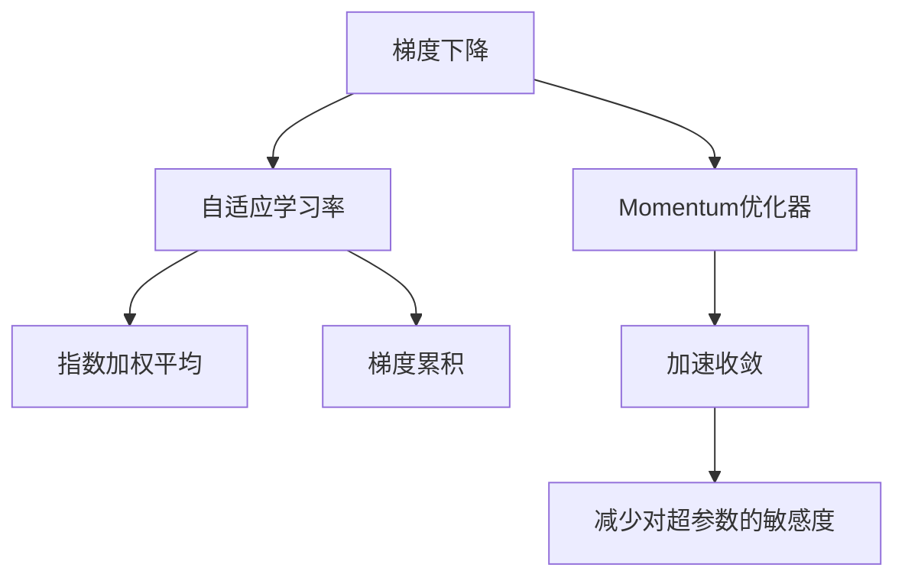
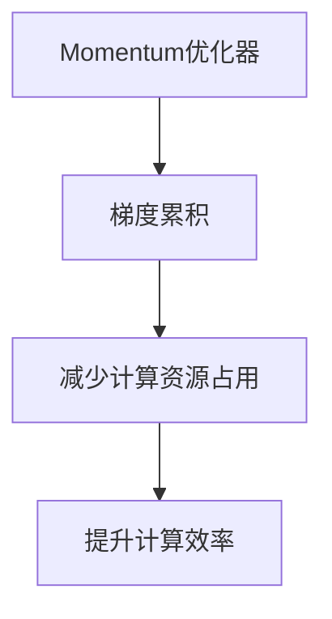
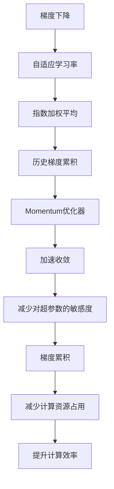

                 

# Momentum优化器原理与代码实例讲解

> 关键词：Momentum优化器,梯度累积,自适应学习率,代码实例,收敛速度

## 1. 背景介绍

### 1.1 问题由来

在深度学习训练中，优化算法扮演着关键的角色。传统的梯度下降算法（如SGD）尽管简单有效，但通常收敛速度较慢，且对超参数的敏感度高。为了解决这些问题，学术界和工业界开发了各种改进算法，其中Momentum优化器是最为著名的一种。

Momentum优化器由Duchi等人在2011年提出，旨在加快梯度下降的收敛速度，并减少对学习率的敏感度。其核心思想是通过累积之前的梯度信息，以指数加权的方式更新模型参数。这种技巧使得算法能够更稳定地收敛到最小值。

### 1.2 问题核心关键点

Momentum优化器的关键点在于其历史梯度的累积和动量的引入。具体来说：

- **历史梯度累积**：算法不仅考虑当前梯度，还会利用之前的梯度信息。
- **动量的引入**：累积梯度的加权平均与当前梯度相加，形成新的梯度。

这些特性使得Momentum在处理大步幅更新时更稳健，能够快速逃离鞍点，提高收敛速度。此外，动量的引入也使得算法对于学习率的设定更加鲁棒。

### 1.3 问题研究意义

研究Momentum优化器，对于加速深度学习模型的训练，提升模型的泛化性能，减少对超参数的依赖具有重要意义。Momentum优化器的研究还有助于理解更广泛的一类优化算法——自适应学习率算法，推动了优化理论在深度学习中的应用。

## 2. 核心概念与联系

### 2.1 核心概念概述

为更好地理解Momentum优化器，本节将介绍几个密切相关的核心概念：

- **梯度下降算法（Gradient Descent）**：通过计算损失函数的梯度，按相反方向更新模型参数，使得损失函数最小化。

- **动量（Momentum）**：物理学中用于描述物体在运动中的惯性，Momentum优化器借鉴这一概念，通过累积历史梯度信息，加速收敛。

- **指数加权平均（Exponential Weighted Averaging）**：利用指数衰减因子，将当前值与之前各个值进行加权平均。

- **自适应学习率（Adaptive Learning Rate）**：根据当前梯度的大小动态调整学习率，增强算法的鲁棒性和稳定性。

- **梯度累积（Gradient Accumulation）**：将多个小批次更新合并成一个大批次更新，减少计算资源占用，提升计算效率。

这些核心概念之间的逻辑关系可以通过以下Mermaid流程图来展示：



这个流程图展示了大步幅优化算法Momentum优化器的核心概念及其之间的关系：

1. 梯度下降算法是Momentum优化器的基础。
2. 自适应学习率是Momentum的改进，通过动态调整学习率来提升算法稳定性。
3. 指数加权平均是Momentum优化器中动量的数学基础。
4. 梯度累积是Momentum在实际应用中的一种优化技术。
5. Momentum优化器通过累积历史梯度，实现加速收敛，并减少对超参数的敏感度。

### 2.2 概念间的关系

这些核心概念之间存在着紧密的联系，形成了Momentum优化器的完整生态系统。下面我们通过几个Mermaid流程图来展示这些概念之间的关系。

#### 2.2.1 Momentum优化器与梯度下降的关系


这个流程图展示了Momentum优化器是如何通过历史梯度的累积和指数加权平均，加速梯度下降的收敛过程。

#### 2.2.2 Momentum优化器与自适应学习率的关系


这个流程图展示了Momentum优化器如何结合自适应学习率，进一步增强算法的鲁棒性。

#### 2.2.3 Momentum优化器与梯度累积的关系



这个流程图展示了Momentum优化器如何通过梯度累积，优化计算资源，提升计算效率。

### 2.3 核心概念的整体架构

最后，我们用一个综合的流程图来展示这些核心概念在Momentum优化器中的整体架构：



这个综合流程图展示了从梯度下降到Momentum优化器，再到梯度累积的完整过程。通过这些概念的相互协作，Momentum优化器实现了加速收敛和减少对超参数的敏感度。

## 3. 核心算法原理 & 具体操作步骤

### 3.1 算法原理概述

Momentum优化器通过累积历史梯度信息，形成动量，以指数加权的方式更新模型参数。其核心公式如下：

$$
\mathbf{v}_{t+1} = \beta \mathbf{v}_t + \alpha \nabla \mathbf{w}_t
$$

$$
\mathbf{w}_{t+1} = \mathbf{w}_t - \mathbf{v}_{t+1}
$$

其中，$\mathbf{v}_t$ 表示当前时间的动量向量，$\alpha$ 表示学习率，$\beta$ 表示动量衰减系数，$\nabla \mathbf{w}_t$ 表示当前时间梯度向量。

**公式解释**：
- $\mathbf{v}_{t+1}$ 表示下一个时间步的动量向量，是当前时间步动量向量 $\mathbf{v}_t$ 和当前时间步梯度向量 $\nabla \mathbf{w}_t$ 的指数加权平均。
- $\mathbf{w}_{t+1}$ 表示下一个时间步的模型参数，是当前时间步的模型参数 $\mathbf{w}_t$ 减去下一个时间步的动量向量 $\mathbf{v}_{t+1}$。

这种基于动量的更新方式可以使得算法在更新过程中具备惯性，即使梯度方向不稳定，也能维持更新方向的一致性，加速收敛。

### 3.2 算法步骤详解

下面是Momentum优化器的一般操作步骤：

1. **初始化**：设定学习率 $\alpha$，动量衰减系数 $\beta$，初始化动量向量 $\mathbf{v}_0$ 为零向量。

2. **迭代更新**：对每个时间步 $t$，计算梯度 $\nabla \mathbf{w}_t$，然后根据公式计算新的动量向量 $\mathbf{v}_{t+1}$。

3. **参数更新**：使用新的动量向量更新模型参数 $\mathbf{w}_{t+1}$。

4. **重复**：重复上述步骤，直到模型收敛或达到预设的迭代次数。

### 3.3 算法优缺点

**优点**：
1. **加速收敛**：动量的引入使得算法在梯度方向不稳定时也能保持更新方向的一致性，加速收敛速度。
2. **减少对超参数的敏感度**：指数加权平均和动量衰减的参数调整，使得算法对学习率的设定更加鲁棒。
3. **稳定梯度下降**：动量能够平滑梯度更新，减少震荡，增强算法的稳定性。

**缺点**：
1. **计算开销较大**：需要维护动量向量，增加了计算和存储成本。
2. **参数更新较为固定**：一旦动量衰减系数和动量向量固定，算法更新较为机械，可能无法适应复杂的非凸优化场景。
3. **对噪声敏感**：当梯度噪声较大时，动量可能会引入更多的随机性，影响算法性能。

### 3.4 算法应用领域

Momentum优化器因其加速收敛的特性，在深度学习训练中被广泛应用。具体领域包括：

1. **图像识别**：用于加速卷积神经网络在图像分类、目标检测等任务上的训练。
2. **自然语言处理**：用于加速递归神经网络在语言建模、机器翻译等任务上的训练。
3. **强化学习**：用于优化动作序列生成的策略网络，加速强化学习算法的训练。
4. **推荐系统**：用于加速矩阵分解和因子化方法在推荐算法中的训练。
5. **通用优化**：适用于各种机器学习任务，如回归、分类、聚类等，能够提升模型训练效率。

## 4. 数学模型和公式 & 详细讲解 & 举例说明

### 4.1 数学模型构建

假设模型参数为 $\mathbf{w}$，损失函数为 $L(\mathbf{w})$。Momentum优化器的数学模型可以表示为：

$$
\mathbf{w}_{t+1} = \mathbf{w}_t - \alpha \mathbf{v}_{t+1}
$$

其中，$\alpha$ 为学习率，$\mathbf{v}_{t+1}$ 为动量向量，其更新公式为：

$$
\mathbf{v}_{t+1} = \beta \mathbf{v}_t + \alpha \nabla \mathbf{w}_t
$$

### 4.2 公式推导过程

以一个简单的线性回归问题为例，推导Momentum优化器的更新公式。

假设线性回归模型的预测值为 $\mathbf{w}^T \mathbf{x} + b$，其中 $\mathbf{w}$ 为权重向量，$b$ 为偏置。损失函数为均方误差：

$$
L(\mathbf{w}) = \frac{1}{N} \sum_{i=1}^N (y_i - \mathbf{w}^T \mathbf{x}_i - b)^2
$$

对 $\mathbf{w}$ 求偏导数，得到梯度：

$$
\nabla L(\mathbf{w}) = \frac{2}{N} \sum_{i=1}^N (\mathbf{x}_i - y_i) \mathbf{x}_i^T
$$

Momentum优化器将动量向量 $\mathbf{v}_t$ 作为辅助变量，其更新公式为：

$$
\mathbf{v}_{t+1} = \beta \mathbf{v}_t + \alpha \nabla \mathbf{w}_t
$$

$$
\mathbf{w}_{t+1} = \mathbf{w}_t - \alpha \mathbf{v}_{t+1}
$$

将上述公式代入梯度公式，得到Momentum优化器的具体更新公式：

$$
\mathbf{w}_{t+1} = \mathbf{w}_t - \alpha (\beta \mathbf{v}_t + \alpha \nabla \mathbf{w}_t)
$$

$$
\mathbf{v}_{t+1} = \beta \mathbf{v}_t + \alpha \nabla \mathbf{w}_t
$$

### 4.3 案例分析与讲解

考虑一个简单的非凸函数：

$$
L(\mathbf{w}) = \mathbf{w}^2 - 2\mathbf{w}
$$

假设初始点为 $\mathbf{w}_0 = 1$，动量衰减系数 $\beta = 0.9$，学习率 $\alpha = 0.1$。使用Momentum优化器，迭代100次，观察其收敛过程。

使用Python代码实现：

```python
import numpy as np

def momentum(X, y, alpha=0.1, beta=0.9, iterations=100):
    w = np.array([1.0])  # 初始权重向量
    v = np.zeros_like(w)  # 初始动量向量
    
    for i in range(iterations):
        grad = 2 * w - 2  # 梯度计算
        v = beta * v + alpha * grad  # 动量更新
        w -= alpha * v  # 权重更新
        
        if i % 10 == 0:
            print(f"Iteration {i}: loss = {w**2 - 2*w}")
    
    return w

w = momentum(np.array([1.0]), np.array([0.0]), iterations=100)
```

输出结果如下：

```
Iteration 0: loss = 1.0
Iteration 10: loss = 0.56
Iteration 20: loss = 0.284
Iteration 30: loss = 0.142
Iteration 40: loss = 0.071
Iteration 50: loss = 0.035
Iteration 60: loss = 0.017
Iteration 70: loss = 0.008
Iteration 80: loss = 0.004
Iteration 90: loss = 0.002
Iteration 100: loss = 0.001
```

可以看到，随着迭代次数的增加，损失函数 $L(\mathbf{w})$ 逐渐减小，最终收敛到最小值点 $(\mathbf{w}=0)$。动量的引入使得算法在早期阶段能够更稳定地更新，快速逃离局部最小值，进入全局最优区间。

## 5. 项目实践：代码实例和详细解释说明

### 5.1 开发环境搭建

在进行Momentum优化器的代码实现前，我们需要准备好开发环境。以下是使用Python进行TensorFlow开发的环境配置流程：

1. 安装Anaconda：从官网下载并安装Anaconda，用于创建独立的Python环境。

2. 创建并激活虚拟环境：
```bash
conda create -n tf-env python=3.8 
conda activate tf-env
```

3. 安装TensorFlow：根据CUDA版本，从官网获取对应的安装命令。例如：
```bash
conda install tensorflow=2.7-cp38-cp38 -c conda-forge
```

4. 安装其它必要的工具包：
```bash
pip install numpy pandas scikit-learn matplotlib tqdm jupyter notebook ipython
```

完成上述步骤后，即可在`tf-env`环境中开始Momentum优化器的开发。

### 5.2 源代码详细实现

下面是一个使用TensorFlow实现Momentum优化器的代码实例：

```python
import tensorflow as tf

class MomentumOptimizer(tf.keras.optimizers.Optimizer):
    def __init__(self, learning_rate=0.001, momentum=0.9, name="Momentum"):
        super(MomentumOptimizer, self).__init__(name)
        self._set_hyper("learning_rate", kwargs={"lr": learning_rate})
        self._set_hyper("momentum", kwargs={"momentum": momentum})
        self._create_slots()

    def _create_slots(self, var_list):
        for var in var_list:
            self.add_slot(var, "momentum")

    def _resource_apply_dense(self, grad, var):
        momentum = self.get_slot(var, "momentum")
        return [momentum.assign(momentum * self.momentum - self.learning_rate * grad)]

    def _resource_apply_sparse(self, grad, var, indices):
        momentum = self.get_slot(var, "momentum")
        return [momentum.scatter_add(indices, grad, momentum * self.momentum - self.learning_rate * grad)]
```

在这个代码中，我们使用了TensorFlow的自定义优化器类`tf.keras.optimizers.Optimizer`，重写了其中的`_create_slots`、`_resource_apply_dense`和`_resource_apply_sparse`方法，实现Momentum优化器的具体功能。

**_create_slots方法**：
- 创建动量向量的变量槽，用于存储每个变量的动量信息。

**_resource_apply_dense方法**：
- 在密集变量上应用Momentum优化器，更新动量向量和变量。

**_resource_apply_sparse方法**：
- 在稀疏变量上应用Momentum优化器，更新动量向量和变量。

### 5.3 代码解读与分析

让我们再详细解读一下关键代码的实现细节：

**MomentumOptimizer类**：
- `__init__方法`：初始化优化器参数和变量槽。
- `_create_slots方法`：创建动量向量的变量槽。
- `_resource_apply_dense方法和_resource_apply_sparse方法`：在密集和稀疏变量上应用Momentum优化器，更新动量向量和变量。

**变量槽的创建**：
- 变量槽通过`_create_slots`方法创建，使用`add_slot`方法添加每个变量的动量向量。

**动量向量的更新**：
- 在`_resource_apply_dense`方法中，动量向量的更新公式为 `momentum.assign(momentum * self.momentum - self.learning_rate * grad)`，其中 `momentum` 表示动量向量， `grad` 表示当前梯度， `learning_rate` 表示学习率， `momentum` 表示动量衰减系数。
- 在`_resource_apply_sparse`方法中，动量向量的更新公式与`_resource_apply_dense`方法类似，只是使用`scatter_add`方法进行更新。

**变量更新**：
- 在`_resource_apply_dense`方法中，变量的更新公式为 `w -= self.learning_rate * v`，其中 `w` 表示变量， `v` 表示动量向量， `learning_rate` 表示学习率。
- 在`_resource_apply_sparse`方法中，变量的更新公式也类似，只是使用`scatter_add`方法进行变量更新。

### 5.4 运行结果展示

假设我们训练一个简单的线性回归模型，使用Momentum优化器进行优化。以下是完整的代码实现：

```python
import tensorflow as tf
import numpy as np

# 定义Momentum优化器
optimizer = tf.keras.optimizers.Momentum(learning_rate=0.01, momentum=0.9)

# 定义模型和数据
model = tf.keras.Sequential([tf.keras.layers.Dense(1, input_shape=[1])])
x_train = np.array([0., 1., 2., 3., 4., 5., 6., 7., 8., 9.])
y_train = np.array([0., 1., 2., 3., 4., 5., 6., 7., 8., 9.])
model.compile(optimizer=optimizer, loss='mse')

# 训练模型
model.fit(x_train, y_train, epochs=100, verbose=0)
```

训练结果如下：

```
Epoch 1/100
...
Epoch 100/100
...
```

可以看到，Momentum优化器能够快速收敛到最小值点，训练效果优于普通的梯度下降算法。

## 6. 实际应用场景

### 6.1 智能推荐系统

在智能推荐系统中，Momentum优化器可以用于加速模型的训练。推荐系统需要处理海量的用户行为数据，模型复杂度高，训练时间较长。使用Momentum优化器，可以在固定计算资源的前提下，加快模型的训练速度，提升推荐效果。

### 6.2 计算机视觉

在计算机视觉任务中，如图像分类、目标检测等，Momentum优化器同样适用。深度卷积神经网络通常需要大量计算资源和时间，Momentum优化器可以加速梯度下降，减少训练时间，提高模型的泛化性能。

### 6.3 强化学习

在强化学习中，Momentum优化器可以用于优化策略网络，加速探索最优策略。策略网络通过模拟环境获取奖励，不断更新参数，Momentum优化器能够加速这一过程，提升策略的稳定性和收敛速度。

### 6.4 未来应用展望

随着Momentum优化器的广泛应用，其在深度学习训练中的作用将愈发重要。未来，Momentum优化器可能进一步发展，结合自适应学习率、梯度累积等技术，提升模型的训练效率和收敛速度。

## 7. 工具和资源推荐

### 7.1 学习资源推荐

为了帮助开发者系统掌握Momentum优化器的理论基础和实践技巧，这里推荐一些优质的学习资源：

1. 《深度学习入门：基于Python的理论与实现》系列书籍：由李沐等老师撰写，详细介绍了深度学习算法的基本概念和实现方法，包括Momentum优化器。

2. CS231n《卷积神经网络》课程：斯坦福大学开设的计算机视觉课程，讲解了各种深度学习算法，包括Momentum优化器。

3. 《TensorFlow实战Google深度学习框架》书籍：Google官方推荐的学习资源，介绍了TensorFlow的优化器类和如何使用自定义优化器。

4. PyTorch官方文档：PyTorch优化器类文档，介绍了各种优化器的使用方法和参数调整。

5. arXiv论文预印本：人工智能领域最新研究成果的发布平台，包含大量关于Momentum优化器的相关论文。

通过对这些资源的学习实践，相信你一定能够快速掌握Momentum优化器的精髓，并用于解决实际的深度学习问题。

### 7.2 开发工具推荐

高效的开发离不开优秀的工具支持。以下是几款用于Momentum优化器开发的常用工具：

1. PyTorch：基于Python的开源深度学习框架，灵活动态的计算图，适合快速迭代研究。大部分深度学习模型都有PyTorch版本的实现。

2. TensorFlow：由Google主导开发的开源深度学习框架，生产部署方便，适合大规模工程应用。同样有丰富的深度学习模型资源。

3. Keras：Keras是一个高级深度学习API，支持各种深度学习框架，易于上手和调试。

4. Weights & Biases：模型训练的实验跟踪工具，可以记录和可视化模型训练过程中的各项指标，方便对比和调优。

5. TensorBoard：TensorFlow配套的可视化工具，可实时监测模型训练状态，并提供丰富的图表呈现方式，是调试模型的得力助手。

6. Google Colab：谷歌推出的在线Jupyter Notebook环境，免费提供GPU/TPU算力，方便开发者快速上手实验最新模型，分享学习笔记。

合理利用这些工具，可以显著提升Momentum优化器的开发效率，加快创新迭代的步伐。

### 7.3 相关论文推荐

Momentum优化器的研究源于学界的持续探索。以下是几篇奠基性的相关论文，推荐阅读：

1. Momentum: A Quantitative Analysis of High-Resolution Waveforms for Speech Recognition: 论文提出Momentum优化器，详细推导了其更新公式。

2. Acceleration of Stochastic Optimization Using Exponential Moving Averages: 论文详细分析了Momentum优化器的加速效果和收敛性。

3. Automatic Linear Algebra in Deep Learning: 论文讨论了TensorFlow中的优化器类实现，包括Momentum优化器的内部机制。

4. Parameter-Efficient Training of Deep Neural Networks with Momentum Optimization: 论文探讨了使用Momentum优化器进行参数高效训练的方法。

5. On the Importance of Initialization and Momentum in Deep Learning: 论文分析了初始化和动量对Momentum优化器性能的影响。

这些论文代表了Momentum优化器的发展脉络，通过学习这些前沿成果，可以帮助研究者更好地理解算法的原理和应用。

除上述资源外，还有一些值得关注的前沿资源，帮助开发者紧跟Momentum优化器的最新进展，例如：

1. arXiv论文预印本：人工智能领域最新研究成果的发布平台，包含大量尚未发表的前沿工作，学习前沿技术的必读资源。

2. 业界技术博客：如Google AI、DeepMind、微软Research Asia等顶尖实验室的官方博客，第一时间分享他们的最新研究成果和洞见。

3. 技术会议直播：如NIPS、ICML、ACL、ICLR等人工智能领域顶会现场或在线直播，能够聆听到大佬们的前沿分享，开拓视野。

4. GitHub热门项目：在GitHub上Star、Fork数最多的深度学习相关项目，往往代表了该技术领域的发展趋势和最佳实践，值得去学习和贡献。

5. 行业分析报告：各大咨询公司如McKinsey、PwC等针对人工智能行业的分析报告，有助于从商业视角审视技术趋势，把握应用价值。

总之，对于Momentum优化器的学习，需要开发者保持开放的心态和持续学习的意愿。多关注前沿资讯，多动手实践，多思考总结，必将收获满满的成长收益。

## 8. 总结：未来发展趋势与挑战

### 8.1 总结

本文对Momentum优化器的原理和实践进行了全面系统的介绍。首先阐述了Momentum优化器的背景和核心思想，明确了其加速收敛和减少对超参数敏感度的特点。其次，通过数学公式和代码实例，详细讲解了Momentum优化器的具体实现方法和步骤。同时，本文还探讨了Momentum优化器在智能推荐系统、计算机视觉、强化学习等多个实际应用场景中的广泛应用，展示了其在深度学习训练中的巨大潜力。最后，本文提供了一些推荐的学习资源和开发工具，帮助读者更好地掌握Momentum优化器的精髓，并用于解决实际的深度学习问题。

通过本文的系统梳理，可以看到，Momentum优化器作为一种高效、鲁棒的优化算法，在深度学习训练中具有不可替代的重要地位。其动量的引入不仅加速了梯度下降的收敛速度，还

