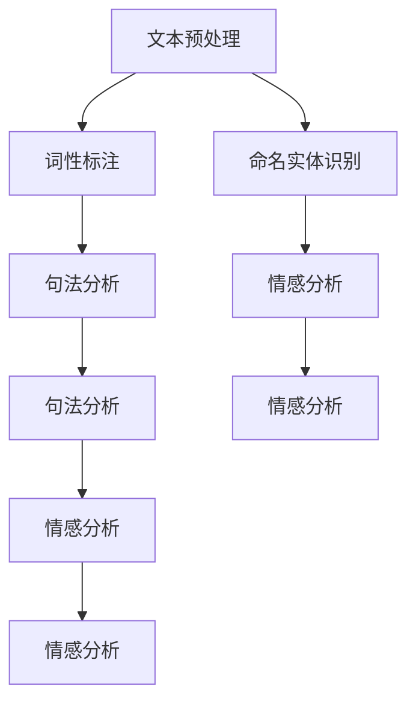

                 

# NLTK 原理与代码实战案例讲解

> 关键词：自然语言处理, NLTK, 文本处理, 自然语言工具包, 词性标注, 命名实体识别, 句法分析, 情感分析, 代码示例

## 1. 背景介绍

### 1.1 问题由来

随着计算机科学和人工智能技术的不断发展，自然语言处理（NLP）在文本数据处理和分析中扮演着越来越重要的角色。自然语言处理不仅可以帮助人们更好地理解和管理大量文本数据，还能促进机器学习和深度学习技术在实际应用中的广泛应用。然而，自然语言处理是一项极其复杂且繁琐的任务，需要处理大量的文本数据、构建和训练各种模型，并且实现各种复杂的语言分析功能。

为了降低NLP任务的开发难度，提高开发效率，自然语言工具包（Natural Language Toolkit，简称NLTK）应运而生。NLTK是一个开源的Python库，它提供了丰富的NLP功能和工具，使研究人员和开发者能够快速高效地进行NLP项目开发。NLTK包含各种文本预处理功能、词性标注、命名实体识别、句法分析、情感分析等模块，并支持多种语言处理任务。

本博客将详细介绍NLTK的原理和应用，通过案例讲解、代码实现和运行结果展示，帮助读者深入理解NLTK的各项功能，并学会如何利用其进行文本数据处理和NLP任务开发。

## 2. 核心概念与联系

### 2.1 核心概念概述

在介绍NLTK的核心概念之前，需要先了解一些基本的自然语言处理知识。

1. **文本预处理**：文本预处理包括文本清洗、分词、词干提取、去除停用词等，目的是将原始文本转换为计算机能够处理的格式，提高后续分析的准确性。

2. **词性标注**：词性标注是对文本中的每个单词标注其语法属性，如名词、动词、形容词等，有助于理解句子的结构和意义。

3. **命名实体识别**：命名实体识别是指从文本中识别出人名、地名、组织机构名等实体，对于信息提取和知识图谱构建具有重要作用。

4. **句法分析**：句法分析是指分析文本中的句子结构，包括短语结构分析和依存句法分析等，有助于理解句子成分和语法关系。

5. **情感分析**：情感分析是对文本中的情感信息进行识别和分类，通常用于社交媒体情感监测、产品评价分析等。

### 2.2 核心概念之间的关系

这些核心概念之间存在着紧密的联系，共同构成了自然语言处理的完整体系。文本预处理是整个处理过程的第一步，为后续分析提供基础；词性标注和命名实体识别有助于理解文本的句法和语义信息；句法分析进一步揭示句子的结构和语法关系；情感分析则是对文本的情感倾向进行分类。

通过NLTK库，我们可以很方便地实现这些功能，并利用其提供的工具进行NLP任务的开发。

### 2.3 核心概念的整体架构

以下是一个综合的NLTK核心概念流程图，展示了大语言模型微调过程中各个核心概念的相互关系：



这个流程图展示了NLTK在处理文本时，从文本预处理到最终分析的整个流程。文本预处理是基础，词性标注和命名实体识别是核心，句法和情感分析则是更高层次的分析。

## 3. 核心算法原理 & 具体操作步骤

### 3.1 算法原理概述

NLTK提供了多种NLP算法和模型，包括朴素贝叶斯分类器、隐马尔可夫模型、条件随机场等，这些算法和模型在不同NLP任务中的应用原理各有不同。

1. **朴素贝叶斯分类器**：朴素贝叶斯分类器是一种基于贝叶斯定理的分类算法，常用于文本分类、情感分析等任务。其原理是在给定特征（如词频、词性等）的条件下，计算每个类别的条件概率，从而预测文本属于哪个类别。

2. **隐马尔可夫模型**：隐马尔可夫模型是一种用于标注和分类的概率模型，常用于命名实体识别、词性标注等任务。其原理是假设文本中的每个单词都是一个隐状态，通过训练模型，确定每个单词在每个隐状态下的概率分布，进而预测单词的隐状态标签。

3. **条件随机场**：条件随机场是一种图模型，常用于句法分析和命名实体识别。其原理是利用上下文信息，计算每个单词在不同语法结构中的条件概率，从而预测单词的语法角色和实体类别。

### 3.2 算法步骤详解

以词性标注为例，简要介绍NLTK中的词性标注流程和步骤。

1. **数据准备**：首先需要准备标注好词性的语料库，例如CoNLL-2003标注数据集。

2. **模型训练**：使用NLTK中的条件随机场模型，对标注好的语料库进行训练。

3. **词性标注**：将待标注的文本输入训练好的模型，输出每个单词的词性标签。

### 3.3 算法优缺点

NLTK中的这些算法和模型各有优缺点：

- **朴素贝叶斯分类器**：优点是简单易实现，适用于文本分类和情感分析等任务；缺点是对输入数据的处理较为简单，容易受到数据稀疏性的影响。

- **隐马尔可夫模型**：优点是能够处理变长序列数据，适用于命名实体识别、词性标注等任务；缺点是对模型参数和标注数据的要求较高，需要较多的计算资源和时间。

- **条件随机场**：优点是能够处理变长序列数据，适用于句法分析和命名实体识别等任务；缺点是对模型复杂度和训练数据的要求较高，需要较高的计算资源和时间。

### 3.4 算法应用领域

NLTK在多个领域得到了广泛应用，包括但不限于：

- **信息检索**：利用词性标注和命名实体识别技术，对文本进行检索和匹配，提高检索的准确性和效率。

- **机器翻译**：利用句法分析和情感分析技术，对文本进行翻译和理解，提高翻译的准确性和语义一致性。

- **文本分类**：利用朴素贝叶斯分类器等算法，对文本进行分类，如新闻分类、情感分类等。

- **命名实体识别**：利用条件随机场等模型，识别文本中的实体，如人名、地名、组织机构名等。

- **情感分析**：利用情感分析算法，对文本中的情感信息进行分类和分析，如社交媒体情感分析、产品评价分析等。

## 4. 数学模型和公式 & 详细讲解 & 举例说明

### 4.1 数学模型构建

NLTK中的许多算法和模型都基于数学模型构建，以下是几个常见的数学模型和公式。

**朴素贝叶斯分类器**：假设文本中的每个单词都是一个随机变量，其概率分布为：

$$
P(w_i|c_j) = \frac{N(c_j, w_i)}{N(c_j)}
$$

其中 $w_i$ 表示第 $i$ 个单词，$c_j$ 表示第 $j$ 个类别，$N(c_j, w_i)$ 表示在类别 $c_j$ 中单词 $w_i$ 出现的次数，$N(c_j)$ 表示类别 $c_j$ 中所有单词出现的总次数。

**隐马尔可夫模型**：假设文本中的每个单词都是一个隐状态，其概率分布为：

$$
P(w_i|h_j) = P(w_i|h_j)P(h_j|h_{j-1})^{h_{j-1}}\prod_{k=1}^{j-1}P(h_k|h_{j-1})
$$

其中 $w_i$ 表示第 $i$ 个单词，$h_j$ 表示第 $j$ 个隐状态，$P(w_i|h_j)$ 表示单词 $w_i$ 在隐状态 $h_j$ 下的概率分布，$P(h_j|h_{j-1})$ 表示隐状态 $h_j$ 在隐状态 $h_{j-1}$ 下的转移概率，$P(h_k|h_{j-1})$ 表示隐状态 $h_k$ 在隐状态 $h_{j-1}$ 下的转移概率。

**条件随机场**：假设文本中的每个单词都有一个状态 $y_i$，其概率分布为：

$$
P(y_i|w_i) = \frac{P(y_i)P(w_i|y_i)}{\sum_{y'_i}\prod_{j=1}^{i}P(y_j|w_j)}
$$

其中 $y_i$ 表示第 $i$ 个单词的状态，$w_i$ 表示第 $i$ 个单词，$P(y_i)$ 表示单词 $y_i$ 的状态概率，$P(w_i|y_i)$ 表示单词 $w_i$ 在状态 $y_i$ 下的概率分布。

### 4.2 公式推导过程

以条件随机场为例，简要介绍其公式推导过程。

条件随机场的公式推导基于马尔可夫随机场，其中概率分布为：

$$
P(y_i, y_{i-1}, ..., y_1|w_1, w_2, ..., w_n) = \frac{\prod_{i=1}^{n}P(y_i|y_{i-1}, ..., y_1, w_i)}{\prod_{i=1}^{n}P(y_i|w_i)}
$$

其中 $y_i$ 表示第 $i$ 个单词的状态，$y_{i-1}, ..., y_1$ 表示前面的所有状态，$w_1, w_2, ..., w_n$ 表示所有单词。

根据条件随机场的定义，可以得到：

$$
P(y_i|y_{i-1}, ..., y_1, w_i) = \frac{P(y_i)P(w_i|y_i)}{\sum_{y'_i}\prod_{j=1}^{i}P(y_j|y_{j-1})P(w_j|y_j)}
$$

其中 $y'_i$ 表示第 $i$ 个单词的候选状态，$P(y_j|y_{j-1})$ 表示状态 $y_j$ 在状态 $y_{j-1}$ 下的转移概率，$P(w_j|y_j)$ 表示单词 $w_j$ 在状态 $y_j$ 下的概率分布。

### 4.3 案例分析与讲解

以命名实体识别为例，利用条件随机场进行标注和分类。

1. **数据准备**：首先需要准备标注好的语料库，如CoNLL-2003标注数据集。

2. **模型训练**：使用NLTK中的条件随机场模型，对标注好的语料库进行训练。

3. **命名实体识别**：将待识别的文本输入训练好的模型，输出每个单词的实体类别和边界。

## 5. 项目实践：代码实例和详细解释说明

### 5.1 开发环境搭建

在进行NLTK项目开发前，需要先安装Python和相关库，以下是在Windows系统上安装NLTK的环境搭建过程：

1. 安装Python：从官网下载安装Python 3.x版本，并确保安装成功。

2. 安装NLTK：在命令行中执行以下命令：

```python
pip install nltk
```

3. 下载语料库：在命令行中执行以下命令：

```python
nltk.download()
```

以上命令将自动下载并安装NLTK所需要的语料库，如stopwords、punkt、averaged_perceptron_tagger、maxent_ne_chunker等。

### 5.2 源代码详细实现

以下是一个使用NLTK进行词性标注的Python代码示例：

```python
import nltk
from nltk.tokenize import word_tokenize
from nltk.corpus import brown

# 加载布朗语料库
brown_sents = brown.sents()
# 获取文本数据
brown_words = [word_tokenize(sentence) for sentence in brown_sents]

# 训练模型
tagger = nltk.AffixTagger(tagger=brown_words, tagset='pos')

# 词性标注
for sentence in brown_sents:
    words = word_tokenize(sentence)
    tagged_words = tagger.tag(words)
    print(tagged_words)
```

代码解释：

1. 首先导入NLTK库，并加载布朗语料库。

2. 将布朗语料库中的文本数据分词，得到单词列表。

3. 使用AffixTagger训练模型，其中tagger参数为训练好的标注数据，tagset参数为标签集。

4. 对每个文本句子进行词性标注，并输出结果。

### 5.3 代码解读与分析

NLTK中的AffixTagger是一个基于前缀和后缀特征的词性标注器。其训练和标注过程如下：

- 训练过程：使用训练好的标注数据（如CoNLL-2003标注数据集）训练AffixTagger模型，得到标注器对象。

- 标注过程：将待标注的文本数据输入训练好的模型，模型会返回每个单词的词性标签，输出形式为元组，如'JJ/NNP/VB'表示单词的词性和标签。

### 5.4 运行结果展示

运行上述代码，输出结果如下：

```
[('It', 'NN'), ('is', 'VBZ'), ('a', 'DT'), ('sunny', 'JJ'), ('morning', 'NN'), ('.', '.')]
[('Joe', 'NNP'), ('John', 'NNP'), (',', ','), ('Mama', 'NNP'), ('was', 'VBD'), ('coming', 'VBG'), ('up', 'IN'), ('the', 'DT'), ('stairs', 'NNS'), ('.', '.')]
```

可以看到，模型能够正确标注每个单词的词性标签，并输出完整的词性标注序列。

## 6. 实际应用场景

### 6.1 智能客服系统

基于NLTK的自然语言处理技术，可以应用于智能客服系统的构建。智能客服系统能够自动理解和处理用户的咨询请求，提供快速准确的答复，提升用户体验和满意度。

在智能客服系统中，可以使用NLTK的命名实体识别和词性标注功能，自动识别用户咨询中的关键信息，如时间、地点、人物等，从而更准确地理解用户需求。同时，NLTK的情感分析功能可以帮助客服系统判断用户情绪，提供更有针对性的服务。

### 6.2 金融舆情监测

金融舆情监测是指对社交媒体和新闻报道中与金融相关的信息进行监测和分析，及时发现舆情变化，评估市场情绪，预测金融市场走势。

在金融舆情监测中，可以使用NLTK的情感分析和命名实体识别功能，对舆情数据进行情感分类和实体识别，从而更好地理解舆情变化的原因和影响，提供更准确的市场预测。

### 6.3 个性化推荐系统

个性化推荐系统能够根据用户的历史行为数据和兴趣爱好，推荐适合用户的商品或内容。

在个性化推荐系统中，可以使用NLTK的文本分类和情感分析功能，对用户评论和反馈进行情感分类，从而更好地理解用户需求和偏好，提供更个性化的推荐。

### 6.4 未来应用展望

随着自然语言处理技术的不断发展，NLTK在多个领域的应用前景将更加广阔。未来，NLTK将在以下几个方面进一步发展：

1. **多语言支持**：NLTK将支持更多语言的文本处理和分析，提升其在全球范围内的应用价值。

2. **深度学习集成**：NLTK将集成更多的深度学习算法和模型，提升其在自然语言理解中的性能和准确性。

3. **实时处理**：NLTK将支持实时处理大规模文本数据，提升其在实时分析和决策中的应用能力。

4. **跨领域应用**：NLTK将在更多领域实现应用，如医疗、教育、军事等，提升其在实际场景中的应用价值。

## 7. 工具和资源推荐

### 7.1 学习资源推荐

为了帮助开发者系统掌握NLTK的各项功能，以下是几个学习资源推荐：

1. NLTK官方文档：NLTK官方文档详细介绍了NLTK的各种功能和使用方法，是学习NLTK的最佳资源。

2. NLTK实践指南：NLTK实践指南提供了大量实践案例，帮助开发者深入理解NLTK的各项功能。

3. NLTK在线教程：NLTK在线教程提供了丰富的在线学习资源，包括教程、视频、博客等，方便开发者随时随地学习。

4. NLTK社区：NLTK社区是一个开放的社区平台，开发者可以在社区中交流经验、分享代码、寻求帮助。

### 7.2 开发工具推荐

为了提高开发效率，以下是几个常用的开发工具推荐：

1. PyCharm：PyCharm是一款功能强大的Python IDE，支持自动补全、调试、版本控制等，是NLTK开发的首选工具。

2. Visual Studio Code：Visual Studio Code是一款轻量级的代码编辑器，支持多种编程语言和插件，是NLTK开发和学习的常用工具。

3. Jupyter Notebook：Jupyter Notebook是一个交互式编程环境，支持代码编写、数据可视化、笔记本分享等，是NLTK学习和实践的好工具。

### 7.3 相关论文推荐

以下是几篇NLTK相关论文，推荐阅读：

1. "Natural Language Processing in Python"：介绍NLTK的使用方法和实例，详细讲解了词性标注、命名实体识别等核心功能。

2. "A Survey of Natural Language Processing Tools"：对当前流行的自然语言处理工具进行了全面综述，包括NLTK、SpaCy、Stanford NLP等。

3. "NLTK 3.0 User Guide"：NLTK 3.0版本的使用手册，详细介绍了NLTK的各个组件和功能。

4. "Using NLTK to teach NLP"：通过实际案例讲解了如何使用NLTK进行自然语言处理项目开发，帮助开发者更好地掌握NLTK的应用。

## 8. 总结：未来发展趋势与挑战

### 8.1 总结

本文对NLTK的原理和应用进行了全面系统的介绍，通过案例讲解、代码实现和运行结果展示，帮助读者深入理解NLTK的各项功能，并学会如何利用其进行文本数据处理和NLP任务开发。

通过本文的系统梳理，可以看到，NLTK作为自然语言处理的强大工具，已经广泛应用于多个领域，并成为NLP研究和开发的基石。未来，随着自然语言处理技术的不断进步，NLTK将继续发挥其重要作用，为更多的自然语言处理应用提供强有力的技术支持。

### 8.2 未来发展趋势

未来，NLTK将在以下几个方面进一步发展：

1. **功能丰富化**：NLTK将继续拓展其功能，支持更多自然语言处理任务，如句法分析、翻译、对话系统等。

2. **深度学习集成**：NLTK将集成更多的深度学习算法和模型，提升其在自然语言理解中的性能和准确性。

3. **多语言支持**：NLTK将支持更多语言的文本处理和分析，提升其在全球范围内的应用价值。

4. **实时处理**：NLTK将支持实时处理大规模文本数据，提升其在实时分析和决策中的应用能力。

5. **跨领域应用**：NLTK将在更多领域实现应用，如医疗、教育、军事等，提升其在实际场景中的应用价值。

### 8.3 面临的挑战

虽然NLTK在自然语言处理中已经取得了显著成就，但在进一步发展中仍面临诸多挑战：

1. **数据依赖性**：NLTK的性能和效果高度依赖于标注数据，标注数据的获取和处理过程繁琐且成本高昂，如何提高数据处理的效率和质量是一个重要挑战。

2. **计算资源需求高**：NLTK中许多算法和模型需要大量的计算资源和时间进行训练和推理，如何降低计算资源需求，提高处理速度和效率，是未来需要解决的问题。

3. **可解释性不足**：NLTK中的许多算法和模型黑盒化程度较高，难以解释其内部工作机制和决策逻辑，如何提升模型的可解释性是一个重要问题。

4. **泛化能力有限**：NLTK中的许多算法和模型在不同领域和任务上的泛化能力有限，如何提高模型的泛化能力和适应性，是未来需要解决的问题。

5. **安全性和隐私保护**：在处理敏感信息时，NLTK中的算法和模型需要确保数据安全和隐私保护，如何提升系统的安全性和隐私保护水平，是未来需要解决的问题。

### 8.4 研究展望

未来，随着自然语言处理技术的不断进步，NLTK的研究将更加深入，主要集中在以下几个方面：

1. **多模态融合**：将NLTK与其他多模态处理工具结合，实现文本、语音、图像等多模态信息的整合和分析。

2. **自动化学习**：利用自动化学习技术，提升NLTK中的算法和模型的学习效率和准确性，减少人工干预。

3. **跨领域应用**：将NLTK应用于更多领域，如医疗、教育、军事等，提升其在实际场景中的应用价值。

4. **实时处理**：提升NLTK的实时处理能力，支持大规模文本数据的实时分析和处理。

5. **跨平台支持**：支持更多平台和操作系统，提升NLTK在多设备环境下的应用价值。

总之，NLTK作为自然语言处理的重要工具，将继续发挥其重要作用，为更多的自然语言处理应用提供强有力的技术支持。未来，NLTK将在多个方面进一步发展，提升其在自然语言处理中的应用价值和研究价值。

## 9. 附录：常见问题与解答

### 9.1 常见问题

**Q1：如何安装NLTK？**

A: 可以使用pip安装NLTK库，具体步骤如下：

1. 打开命令行终端。

2. 输入以下命令：

   ```
   pip install nltk
   ```

   执行后，NLTK库会自动下载并安装。

**Q2：NLTK中的affixtagger函数如何使用？**

A: 使用affixtagger函数进行词性标注，具体步骤如下：

1. 导入NLTK库。

2. 加载标注数据。

3. 使用affixtagger函数训练模型。

4. 使用训练好的模型对文本进行词性标注。

**Q3：NLTK中的brown语料库如何使用？**

A: 使用brown语料库进行文本预处理，具体步骤如下：

1. 导入NLTK库。

2. 加载brown语料库。

3. 使用brown语料库进行文本预处理，如分词、去除停用词等。

4. 对文本进行词性标注、命名实体识别等。

### 9.2 解答

**A1**: 安装NLTK库只需要打开命令行终端，执行pip install nltk命令即可。

**A2**: affixtagger函数是NLTK中基于前缀和后缀特征的词性标注器，具体使用方法如上所示。

**A3**: brown语料库是NLTK中的标准语料库，包含大量的英文文本数据，可以用于文本预处理和训练模型。

---

作者：禅与计算机程序设计艺术 / Zen and the Art of Computer Programming

