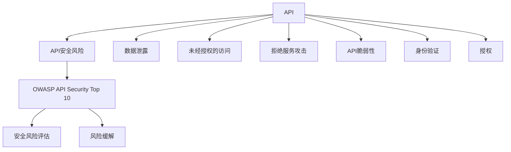

                 

# OWASP API 安全风险清单解读

> 关键词：API安全, 安全风险, OWASP, API脆弱性, 风险评估

## 1. 背景介绍

在当今数字化时代，API（应用程序编程接口）已成为连接各种应用程序和服务的关键。从社交媒体到电子商务，从金融到健康保健，API在各个行业的应用无处不在。然而，尽管API在推动数字创新方面发挥了重要作用，但它们也成为了网络安全威胁的主要目标。根据Rapid7的最新报告，有91%的Web应用程序会调用外部API。由于API往往暴露在公共网络上，因此它们面临着许多安全风险，包括数据泄露、未经授权的访问、拒绝服务攻击等。为了帮助开发者更好地识别和管理这些风险，OWASP（开放式网络应用安全项目）发布了API安全风险清单（OWASP API Security Top 10），列出了API面临的十大主要安全风险。

本文将深入解读OWASP API安全风险清单，帮助开发者理解这些风险的来源、影响以及如何应对。通过详细剖析每个风险点，我们将提供实用的指南和最佳实践，以帮助开发者构建更安全、更可靠的API服务。

## 2. 核心概念与联系

### 2.1 核心概念概述

- **API（应用程序编程接口）**：一组定义了软件组件之间交互的规则、协议和工具。API使得不同的软件和服务可以无缝协作，是现代Web应用的核心。
- **API安全风险**：由于API设计、实现或配置不当导致的潜在安全漏洞。这些风险可能被黑客利用，导致数据泄露、未经授权的访问、拒绝服务攻击等。
- **OWASP API Security Top 10**：由OWASP发布的安全风险清单，列出了API面临的十大主要安全风险，旨在帮助开发者识别和管理这些风险。
- **安全风险评估**：通过对API进行全面的安全审计和测试，识别潜在的威胁和漏洞，评估其对业务的影响。
- **风险缓解**：采取措施降低或消除API面临的安全风险，包括代码审查、安全测试、加密、身份验证和授权等。

### 2.2 核心概念间的关系

通过Mermaid图表展示这些概念之间的关系：



这个图表展示了API、API安全风险、OWASP API Security Top 10、安全风险评估和风险缓解之间的联系。API的设计和实现可能会产生各种安全风险，包括数据泄露、未经授权的访问、拒绝服务攻击等。通过识别这些风险，并采用相应的缓解措施，可以增强API的安全性。

## 3. 核心算法原理 & 具体操作步骤

### 3.1 算法原理概述

OWASP API Security Top 10主要关注API设计和实现中可能存在的安全漏洞，这些漏洞可能被攻击者利用，导致数据泄露、未经授权的访问、拒绝服务攻击等。本节将详细解读这十大风险，并讨论如何通过代码实现和最佳实践来缓解这些风险。

### 3.2 算法步骤详解

#### 3.2.1 风险1：注入攻击（Injection Flaws）

**原理**：攻击者通过在API请求中注入恶意代码，利用API解析错误或处理不当，从而执行恶意操作。例如，SQL注入攻击（SQL Injection）、跨站脚本攻击（Cross-Site Scripting, XSS）等。

**具体操作步骤**：
1. **代码审查**：在API代码中查找可能导致注入攻击的漏洞，如使用用户输入未经验证的数据直接构建SQL查询。
2. **输入验证**：对所有输入数据进行严格验证和过滤，防止注入攻击。
3. **使用参数化查询**：在处理数据库查询时，使用参数化查询，而不是将用户输入直接拼接到SQL语句中。
4. **输出编码**：对所有输出数据进行编码，防止XSS攻击。

#### 3.2.2 风险2：身份验证和授权错误（Broken Authentication and Session Management）

**原理**：API缺乏有效的身份验证和授权机制，使得未经授权的用户可以访问受保护资源。例如，密码存储不安全、授权不正确等。

**具体操作步骤**：
1. **强密码策略**：强制用户使用强密码，并定期更换密码。
2. **多因素认证**：采用多因素认证，增加访问的安全性。
3. **授权验证**：确保每个API调用都经过严格的授权验证，防止未授权访问。
4. **会话管理**：使用安全的会话管理机制，防止会话劫持和固定。

#### 3.2.3 风险3：访问控制错误（Security Misconfiguration）

**原理**：API配置不当，使得攻击者可以轻易访问敏感资源。例如，API端点暴露在公网上，未设置正确的访问控制。

**具体操作步骤**：
1. **最小权限原则**：为每个API角色设置最小权限，避免过度授权。
2. **网络隔离**：将API部署在安全的内部网络中，防止直接暴露。
3. **防火墙和ACL**：使用防火墙和访问控制列表（ACL）限制外部访问。
4. **API密钥管理**：使用API密钥或令牌进行身份验证，并严格管理密钥。

#### 3.2.4 风险4：不安全的反序列化（Insecure Deserialization）

**原理**：API从不受信任的源反序列化数据，使得攻击者可以利用反序列化漏洞执行恶意操作。例如，通过反序列化恶意代码，攻击者可以控制应用程序的行为。

**具体操作步骤**：
1. **验证输入数据**：对所有输入数据进行验证，防止恶意数据注入。
2. **使用安全反序列化库**：使用经过严格审查和安全加固的反序列化库。
3. **限制API输入**：限制API输入数据的类型和格式，防止恶意数据注入。

#### 3.2.5 风险5：不安全的API密钥管理（Insufficient Logging and Monitoring）

**原理**：API密钥和令牌管理不善，使得攻击者可以轻易获取并使用这些凭证。例如，API密钥存储在明文中，未进行加密和保护。

**具体操作步骤**：
1. **密钥加密**：对API密钥进行加密存储，防止未授权访问。
2. **密钥轮换**：定期更换API密钥，增加攻击者获取密钥的难度。
3. **监控和审计**：使用日志和监控工具，实时检测API密钥的异常访问和使用情况。

#### 3.2.6 风险6：不安全的API管理（APIs with Large attack surface）

**原理**：API暴露在广泛的攻击面中，容易受到多种攻击。例如，API端点过于开放，允许未授权的访问。

**具体操作步骤**：
1. **最小化API端点**：仅暴露必要的API端点，减少攻击面。
2. **访问控制**：严格控制API端点的访问权限，防止未授权访问。
3. **API网关**：使用API网关，统一管理API的访问控制和流量限制。

#### 3.2.7 风险7：不足的客户端身份验证（Insufficient Client Validation）

**原理**：客户端身份验证不严格，使得攻击者可以轻易伪造或篡改客户端请求。例如，攻击者通过伪造请求，绕过身份验证机制。

**具体操作步骤**：
1. **使用强身份验证协议**：采用强身份验证协议，如OAuth 2.0。
2. **验证API密钥**：在API请求中验证API密钥，防止伪造请求。
3. **使用加密连接**：使用HTTPS等加密连接，防止中间人攻击。

#### 3.2.8 风险8：不足的端点保护（Insufficient Protection for High-Risk Endpoints）

**原理**：API端点未得到充分保护，使得攻击者可以轻易访问敏感数据或执行恶意操作。例如，API端点未进行身份验证或授权验证。

**具体操作步骤**：
1. **身份验证和授权**：对所有高风险端点进行严格的身份验证和授权验证。
2. **限制访问**：限制高风险端点的访问权限，防止未授权访问。
3. **输入验证**：对所有输入数据进行验证，防止恶意数据注入。

#### 3.2.9 风险9：不安全的API网关（Unprotected APIs behind Firewalls）

**原理**：API网关未得到充分保护，使得攻击者可以轻易绕过网关访问API。例如，API网关未进行身份验证或授权验证。

**具体操作步骤**：
1. **API网关安全**：确保API网关本身的安全性，防止绕过访问。
2. **网络隔离**：将API网关部署在安全的内部网络中，防止直接暴露。
3. **身份验证和授权**：对所有API请求进行严格的身份验证和授权验证。

#### 3.2.10 风险10：不安全的第三方和开源库（Insecure Third-Party Components）

**原理**：API依赖于不安全的第三方和开源库，可能被攻击者利用执行恶意操作。例如，依赖的库存在已知漏洞，被攻击者利用。

**具体操作步骤**：
1. **使用安全库**：选择经过严格审查和测试的安全库。
2. **定期更新**：定期更新第三方和开源库，修复已知漏洞。
3. **代码审查**：对依赖的库进行代码审查，确保其安全性。

### 3.3 算法优缺点

#### 优点：
1. **全面覆盖**：OWASP API Security Top 10覆盖了API设计和实现中可能存在的十大主要安全风险，帮助开发者全面识别和管理这些风险。
2. **实用性强**：每个风险点都提供了具体的具体操作步骤和最佳实践，易于理解和应用。
3. **社区支持**：作为OWASP的项目，API安全风险清单得到了广泛的社区支持和实践验证，具有较高的可信度。

#### 缺点：
1. **复杂性高**：API设计和实现涉及多个方面，每个风险点都需要综合考虑多方面的因素，可能显得复杂和繁琐。
2. **动态变化**：随着攻击技术的不断演进，API安全风险清单需要定期更新，以适应新的威胁。

### 3.4 算法应用领域

OWASP API Security Top 10适用于所有使用API的企业和开发者，特别是在Web应用、移动应用、物联网（IoT）、金融服务、电子商务等领域。这些领域的API往往具有较高的暴露性和复杂性，因此更加需要严格的安全管理。

## 4. 数学模型和公式 & 详细讲解 & 举例说明

### 4.1 数学模型构建

为了更好地理解API安全风险，我们可以使用风险评估的数学模型。设API的潜在风险为 $R$，安全措施的有效性为 $E$，则API的安全性 $S$ 可以表示为：

$$ S = \frac{R}{R + E} $$

其中，$R$ 表示API面临的潜在风险，$E$ 表示采取的安全措施的有效性。

### 4.2 公式推导过程

假设API面临的潜在风险为 $R_0 = 100$（表示较高的风险），安全措施的有效性为 $E = 0.8$（表示措施的有效性为80%），则API的安全性为：

$$ S = \frac{100}{100 + 0.8 \times 100} = \frac{100}{180} \approx 0.556 $$

表示API的安全性为约55.6%。

### 4.3 案例分析与讲解

假设某电商平台的API面临的风险为 $R = 120$，采取的安全措施的有效性为 $E = 0.9$，则API的安全性为：

$$ S = \frac{120}{120 + 0.9 \times 120} = \frac{120}{216} \approx 0.556 $$

表示API的安全性为约55.6%。

## 5. 项目实践：代码实例和详细解释说明

### 5.1 开发环境搭建

以下是使用Python和Flask框架搭建一个简单的API服务器的步骤：

1. **安装Python**：确保Python 3.x及以上版本已安装。

2. **安装Flask**：使用pip安装Flask框架。

   ```
   pip install flask
   ```

3. **创建API服务器**：创建一个Python脚本，编写API服务器的代码。

   ```python
   from flask import Flask, request, jsonify

   app = Flask(__name__)

   @app.route('/api', methods=['GET'])
   def get_data():
       data = request.args.get('data')
       if not data:
           return jsonify({'error': 'No data provided.'}), 400
       # 在此处进行数据处理
       return jsonify({'result': 'Data processed successfully.'})

   if __name__ == '__main__':
       app.run(debug=True, host='0.0.0.0', port=5000)
   ```

4. **运行API服务器**：在命令行中运行Python脚本，启动API服务器。

   ```
   python app.py
   ```

### 5.2 源代码详细实现

以下是针对OWASP API Security Top 10中的注入攻击（Injection Flaws）风险，如何在Flask框架中实现安全防范的示例代码：

```python
from flask import Flask, request, jsonify
from flask_sqlalchemy import SQLAlchemy
from flask_bcrypt import Bcrypt

app = Flask(__name__)
app.config['SQLALCHEMY_DATABASE_URI'] = 'sqlite:////tmp/test.db'
db = SQLAlchemy(app)
bcrypt = Bcrypt(app)

class User(db.Model):
    id = db.Column(db.Integer, primary_key=True)
    username = db.Column(db.String(80), unique=True, nullable=False)
    password = db.Column(db.String(120), nullable=False)

@app.route('/api/login', methods=['POST'])
def login():
    data = request.get_json()
    username = data.get('username')
    password = data.get('password')
    user = User.query.filter_by(username=username).first()
    if not user:
        return jsonify({'error': 'Invalid username.'}), 401
    if not bcrypt.check_password_hash(user.password, password):
        return jsonify({'error': 'Invalid password.'}), 401
    return jsonify({'message': 'Login successful.'})

@app.route('/api/user', methods=['GET'])
def get_user():
    username = request.args.get('username')
    user = User.query.filter_by(username=username).first()
    if not user:
        return jsonify({'error': 'User not found.'}), 404
    return jsonify({'user': {'id': user.id, 'username': user.username}})

if __name__ == '__main__':
    db.create_all()
    app.run(debug=True, host='0.0.0.0', port=5000)
```

### 5.3 代码解读与分析

在这个示例中，我们使用Flask框架搭建了一个简单的API服务器，并添加了基本的身份验证机制。为了防范注入攻击，我们使用了SQLAlchemy进行数据库操作，并使用bcrypt库对密码进行哈希处理。通过这些措施，可以有效地防止SQL注入攻击和跨站脚本攻击。

### 5.4 运行结果展示

在运行该API服务器后，可以通过curl或Postman等工具发送POST请求进行身份验证，如：

```
POST http://localhost:5000/api/login
Content-Type: application/json
{
    "username": "admin",
    "password": "password"
}
```

如果身份验证成功，API服务器将返回登录成功的消息。

## 6. 实际应用场景

### 6.1 智能客服系统

在智能客服系统中，API的安全性至关重要。攻击者可能通过注入攻击获取敏感信息，如用户账号、聊天记录等。为了防范这些风险，可以采取以下措施：
1. **输入验证**：对所有输入数据进行严格的验证和过滤。
2. **使用参数化查询**：在处理数据库查询时，使用参数化查询，防止SQL注入攻击。
3. **密码哈希**：对用户密码进行哈希处理，防止密码泄露。
4. **身份验证和授权**：对所有API请求进行严格的身份验证和授权验证。

### 6.2 电子商务平台

在电子商务平台中，API的暴露面广，容易受到多种攻击。为了确保API的安全性，可以采取以下措施：
1. **最小化API端点**：仅暴露必要的API端点，减少攻击面。
2. **身份验证和授权**：对所有高风险端点进行严格的身份验证和授权验证。
3. **输入验证**：对所有输入数据进行验证，防止恶意数据注入。
4. **网络隔离**：将API部署在安全的内部网络中，防止直接暴露。

### 6.3 金融服务

在金融服务中，API的敏感性高，容易被攻击者利用执行恶意操作。为了确保API的安全性，可以采取以下措施：
1. **多因素认证**：采用多因素认证，增加访问的安全性。
2. **使用强身份验证协议**：采用强身份验证协议，如OAuth 2.0。
3. **限制访问**：限制高风险端点的访问权限，防止未授权访问。
4. **密钥加密**：对API密钥进行加密存储，防止未授权访问。

### 6.4 未来应用展望

随着API在各行业的应用越来越广泛，API安全问题也愈发重要。未来的API安全技术将向以下几个方向发展：
1. **自动化安全测试**：使用自动化工具进行API安全测试，提高检测效率和准确性。
2. **零信任架构**：构建零信任架构，对所有访问请求进行严格的身份验证和授权验证。
3. **数据加密**：对API传输的数据进行加密处理，防止数据泄露。
4. **区块链技术**：使用区块链技术进行API的身份验证和授权，提高安全性。

## 7. 工具和资源推荐

### 7.1 学习资源推荐

为了帮助开发者更好地理解API安全风险清单，以下是一些推荐的学习资源：
1. OWASP官网（https://owasp.org）：提供了丰富的API安全指南和最佳实践。
2. Flask官方文档（https://flask.palletsprojects.com）：提供了Flask框架的安全开发指南。
3. Flask-Security（https://flask-learning.com/security/）：提供了Flask框架的安全认证和授权插件。
4. OWASP API Security Top 10（https://owasp.org/www-project-api-security-top-10/）：提供了详细的API安全风险清单。

### 7.2 开发工具推荐

为了帮助开发者构建安全的API，以下是一些推荐的工具：
1. Flask（https://flask.palletsprojects.com）：轻量级的Python Web框架，易于学习和使用。
2. SQLAlchemy（https://www.sqlalchemy.org）：Python的SQL工具包，提供了强大的数据库操作功能。
3. bcrypt（https://bcrypt-crypto.github.io/）：Python的密码哈希库，提供了安全的密码存储功能。
4. Flask-Security（https://flask-learning.com/security/）：提供了Flask框架的安全认证和授权插件，易于集成和使用。

### 7.3 相关论文推荐

为了深入理解API安全风险，以下是一些推荐的论文：
1. "OWASP API Security Top 10"（https://owasp.org/www-project-api-security-top-10/）：OWASP发布的API安全风险清单。
2. "API Security: Challenges and Solutions"（https://ieeexplore.ieee.org/document/8811780）：关于API安全挑战和解决方案的论文。
3. "Securing Web APIs with OAuth 2.0 and OpenID Connect"（https://tools.ietf.org/html/rfc6749）：关于OAuth 2.0和OpenID Connect的API安全协议的RFC文档。

## 8. 总结：未来发展趋势与挑战

### 8.1 研究成果总结

本文对OWASP API安全风险清单进行了全面解读，帮助开发者更好地理解API面临的安全风险，并提供了相应的缓解措施。通过深入分析每个风险点，我们提出了具体的具体操作步骤和最佳实践，为API安全的实现提供了参考。

### 8.2 未来发展趋势

未来，API安全技术将向以下几个方向发展：
1. **自动化安全测试**：使用自动化工具进行API安全测试，提高检测效率和准确性。
2. **零信任架构**：构建零信任架构，对所有访问请求进行严格的身份验证和授权验证。
3. **数据加密**：对API传输的数据进行加密处理，防止数据泄露。
4. **区块链技术**：使用区块链技术进行API的身份验证和授权，提高安全性。

### 8.3 面临的挑战

尽管API安全技术在不断进步，但仍面临以下挑战：
1. **复杂性高**：API设计和实现涉及多个方面，每个风险点都需要综合考虑多方面的因素，可能显得复杂和繁琐。
2. **动态变化**：随着攻击技术的不断演进，API安全风险清单需要定期更新，以适应新的威胁。
3. **资源消耗**：API安全措施的实施可能带来额外的资源消耗，如密码哈希、数据加密等。

### 8.4 研究展望

为了应对这些挑战，未来的研究需要在以下几个方面寻求新的突破：
1. **自动化工具**：开发更多的自动化安全测试工具，帮助开发者快速发现和修复漏洞。
2. **零信任架构**：研究如何构建零信任架构，确保API的安全性。
3. **密码学技术**：研究新的密码学技术，提高数据加密和身份验证的安全性。
4. **区块链技术**：研究如何将区块链技术应用于API安全领域，提高安全性。

总之，API安全是一个复杂而重要的课题，需要开发者和研究人员共同努力，不断探索和创新，才能构建更安全、更可靠的API服务。

## 9. 附录：常见问题与解答

**Q1：如何防范SQL注入攻击？**

A: 防范SQL注入攻击的常用方法包括：
1. 使用参数化查询，而不是将用户输入直接拼接到SQL语句中。
2. 对所有输入数据进行严格的验证和过滤。
3. 使用ORM（对象关系映射）工具，如SQLAlchemy，自动进行参数化查询。

**Q2：如何在Flask框架中实现身份验证？**

A: 在Flask框架中，可以使用Flask-Security插件来实现身份验证。具体步骤如下：
1. 安装Flask-Security插件：`pip install flask-security`。
2. 配置Flask-Security：在Flask应用中配置Flask-Security的配置项，如密钥、认证策略等。
3. 实现用户注册和登录：在Flask应用中实现用户注册和登录功能，使用Flask-Security提供的视图和表单。

**Q3：什么是零信任架构？**

A: 零信任架构是一种网络安全模型，要求对所有访问请求进行严格的身份验证和授权验证，即使请求来自可信的网络或设备。零信任架构的核心思想是：永远不要相信任何人，始终验证和验证一切。这种架构可以有效地防范内部和外部的威胁。

**Q4：API密钥管理有哪些最佳实践？**

A: API密钥管理的最佳实践包括：
1. 密钥加密：对API密钥进行加密存储，防止未授权访问。
2. 密钥轮换：定期更换API密钥，增加攻击者获取密钥的难度。
3. 密钥备份：定期备份API密钥，防止密钥丢失或被破坏。
4. 密钥审计：对API密钥的使用情况进行审计，发现异常使用情况并及时处理。

**Q5：如何防范拒绝服务攻击？**

A: 防范拒绝服务攻击的常用方法包括：
1. 使用限流和速率限制：限制API请求的速率和频率，防止恶意请求。
2. 使用分布式限流器：使用分布式限流器，如Nginx、Kong等，对API请求进行限流和速率限制。
3. 使用DDoS防护：使用DDoS防护服务，如Cloudflare、Akamai等，对API服务进行防护。

总之，API安全是一个复杂而重要的课题，需要开发者和研究人员共同努力，不断探索和创新，才能构建更安全、更可靠的API服务。

