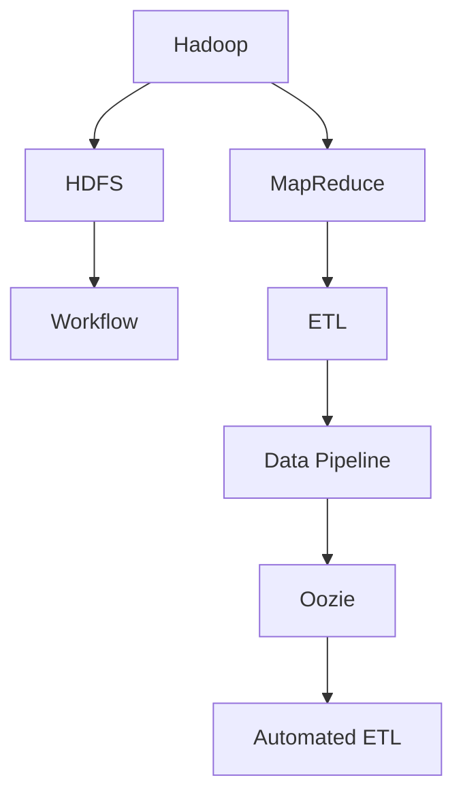
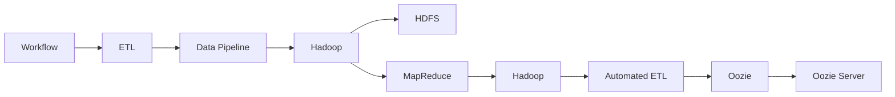
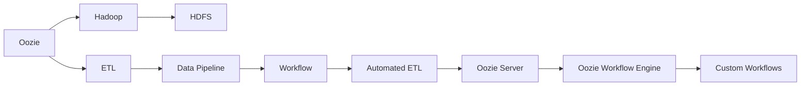
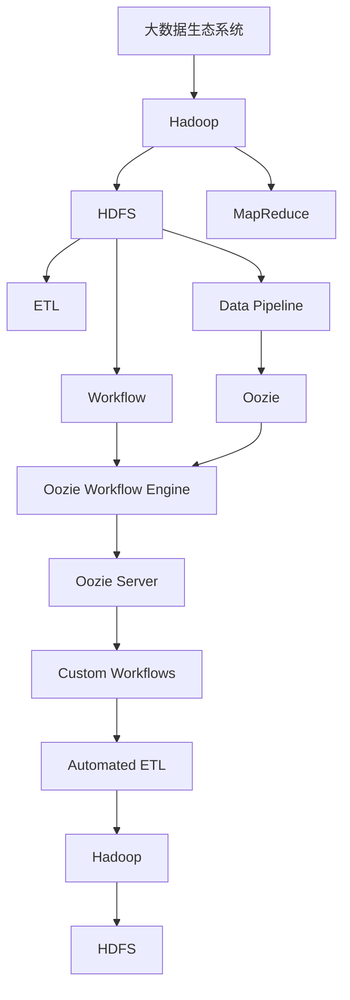

                 

# Oozie原理与代码实例讲解

> 关键词：Oozie, Hadoop, Apache Oozie, ETL, Data Pipeline, Workflow Automation

## 1. 背景介绍

### 1.1 问题由来
随着大数据时代的到来，企业对于数据处理的需求日益增长。传统的ETL(Extract, Transform, Load)过程繁琐、易出错，难以适应复杂的业务需求。因此，如何自动化、标准化数据处理流程，提高数据处理效率和质量，成为了企业面临的重要问题。

### 1.2 问题核心关键点
Apache Oozie是一款开源的Hadoop生态系统中的工作流调度器。通过它，用户可以方便地自动化ETL过程，构建复杂的数据管道，提高数据处理的稳定性和效率。Oozie的核心理念是通过定义工作流来描述数据处理流程，自动执行作业，减少人为干预，提高数据处理的自动化水平。

### 1.3 问题研究意义
Oozie的自动化、标准化处理流程，能够显著提升数据处理效率，降低人为错误，保证数据处理的稳定性和准确性。对于复杂的数据集成和清洗任务，Oozie提供了强大的工作流调度能力，使得数据处理更加灵活、高效。

Oozie还支持多种数据源和目标，包括HDFS、S3、关系型数据库等，能够满足不同类型数据处理的需求。同时，Oozie的扩展性和灵活性，也使得它在工业界得到了广泛的应用，成为大数据处理和分析不可或缺的工具。

## 2. 核心概念与联系

### 2.1 核心概念概述

为更好地理解Oozie的核心概念和原理，本节将介绍几个密切相关的核心概念：

- Apache Oozie：Apache基金会下属的开源工作流调度器，用于自动化ETL过程和构建复杂数据管道。
- Workflow：工作流，即一系列任务和作业的逻辑序列，描述了数据处理流程。
- Data Pipeline：数据管道，即通过一系列的数据处理组件和任务，自动化数据处理过程。
- ETL：Extract, Transform, Load，即数据提取、转换和加载，是数据处理的核心环节。
- Hadoop：Hadoop是一个开源的分布式计算框架，包括HDFS和MapReduce两个重要组件。

这些核心概念之间的逻辑关系可以通过以下Mermaid流程图来展示：



这个流程图展示了Oozie的核心概念及其之间的关系：

1. Hadoop提供了分布式计算能力，HDFS提供了可靠的数据存储和访问。
2. MapReduce提供了高效的分布式数据处理能力。
3. Workflow描述了数据处理流程的逻辑。
4. ETL是数据处理的核心环节。
5. Data Pipeline通过一系列数据处理组件和任务，自动化数据处理过程。
6. Oozie提供了自动化的工作流调度能力。

### 2.2 概念间的关系

这些核心概念之间存在着紧密的联系，形成了Oozie的核心生态系统。下面我通过几个Mermaid流程图来展示这些概念之间的关系。

#### 2.2.1 Oozie的自动化处理流程



这个流程图展示了Oozie的自动化处理流程。

1. Workflow描述了数据处理流程的逻辑。
2. ETL是数据处理的核心环节。
3. Data Pipeline通过一系列数据处理组件和任务，自动化数据处理过程。
4. Hadoop提供了分布式计算能力。
5. HDFS提供了可靠的数据存储和访问。
6. MapReduce提供了高效的分布式数据处理能力。
7. Oozie提供了自动化的工作流调度能力。
8. Oozie Server是Oozie的核心服务组件。

#### 2.2.2 Oozie的扩展性



这个流程图展示了Oozie的扩展性。

1. Oozie与Hadoop紧密集成，利用Hadoop的分布式计算能力。
2. Oozie支持多种数据源和目标，包括HDFS、S3、关系型数据库等。
3. Oozie的工作流调度器能够灵活地定义各种数据处理流程。
4. Oozie的自动化处理能力，能够显著提高数据处理效率。
5. Oozie的扩展性，能够适应各种类型的数据处理需求。

### 2.3 核心概念的整体架构

最后，我们用一个综合的流程图来展示这些核心概念在大数据处理中的整体架构：



这个综合流程图展示了大数据处理中的核心概念及其相互关系。

1. 大数据生态系统通过Hadoop框架提供了分布式计算能力。
2. HDFS提供了可靠的数据存储和访问。
3. MapReduce提供了高效的分布式数据处理能力。
4. ETL是数据处理的核心环节。
5. Data Pipeline通过一系列数据处理组件和任务，自动化数据处理过程。
6. Workflow描述了数据处理流程的逻辑。
7. Oozie提供了自动化的工作流调度能力。
8. Oozie的工作流调度器能够灵活地定义各种数据处理流程。
9. Oozie的自动化处理能力，能够显著提高数据处理效率。

这些概念共同构成了大数据处理的完整生态系统，使得数据处理更加自动化、标准化，满足了企业对于数据处理的需求。

## 3. 核心算法原理 & 具体操作步骤
### 3.1 算法原理概述

Apache Oozie的核心原理是通过定义工作流来描述数据处理流程，自动化ETL过程。其核心思想是将数据处理过程分解为一系列任务和作业的逻辑序列，通过Oozie的工作流调度器自动执行这些任务和作业，实现数据处理的自动化和标准化。

### 3.2 算法步骤详解

以下我详细介绍Oozie的算法步骤，包括工作流的定义和执行。

**Step 1: 定义工作流**

在Oozie中，工作流(Workflow)是一系列任务的逻辑序列，描述了数据处理流程。定义工作流的过程如下：

1. 在Oozie的客户端（如Web界面）或命令行工具（如oozie command-line）上，定义一个工作流文件。工作流文件是一个XML格式的文件，定义了任务、作业和数据源等关键组件。
2. 在XML文件中，定义数据源的连接方式和位置。例如，可以使用HDFS作为数据源，指定数据文件路径。
3. 在XML文件中，定义一系列的任务和作业。例如，使用Hadoop的MapReduce作业进行数据处理。
4. 在XML文件中，定义数据输出的目标位置。例如，将处理结果输出到HDFS的指定目录。
5. 在XML文件中，定义任务之间的依赖关系和调度策略。例如，指定某个任务必须在另一个任务完成后才能开始。

**Step 2: 提交工作流**

定义好工作流后，可以通过以下步骤提交到Oozie Server：

1. 将工作流文件上传到Oozie Server的指定目录。
2. 在Oozie客户端或命令行工具中，提交工作流文件，指定工作流名称。
3. Oozie Server解析工作流文件，生成相应的工作流执行计划。
4. Oozie Server调度执行计划中的各个任务和作业，实现数据处理的自动化。

**Step 3: 监控和管理**

在数据处理过程中，可以通过Oozie的Web界面或命令行工具，实时监控任务执行情况。具体步骤如下：

1. 在Oozie客户端或命令行工具中，查看工作流的执行状态。
2. 通过Web界面，查看任务执行的详细信息，包括任务状态、资源使用情况等。
3. 在任务执行过程中，可以通过Oozie提供的接口，动态调整任务参数，优化数据处理过程。

通过上述步骤，Oozie实现了数据处理的自动化和标准化，提高了数据处理效率和质量。

### 3.3 算法优缺点

Oozie作为一款强大的工作流调度器，具有以下优点：

1. 自动化处理。Oozie能够自动化处理复杂的数据处理流程，减少人为干预，提高数据处理的效率和准确性。
2. 灵活性强。Oozie支持多种数据源和目标，能够适应各种类型的数据处理需求。
3. 扩展性好。Oozie的工作流调度器能够灵活地定义各种数据处理流程，适应不同的业务需求。
4. 支持多种语言。Oozie支持Python、Java等多种编程语言，方便用户自定义数据处理任务。

然而，Oozie也存在一些缺点：

1. 学习曲线陡峭。对于初学者，需要较长时间掌握Oozie的使用方法和工具。
2. 性能问题。Oozie的性能瓶颈在于其依赖Hadoop的MapReduce作业，处理大规模数据时可能效率较低。
3. 开发成本高。Oozie需要与Hadoop紧密集成，开发和维护成本较高。

尽管存在这些缺点，但Oozie强大的自动化和标准化处理能力，仍然使其成为大数据处理中不可或缺的工具。

### 3.4 算法应用领域

Oozie广泛应用于各种大数据处理场景，例如：

1. 数据清洗和预处理。通过Oozie，可以自动化清洗和预处理各种数据源，如结构化数据、半结构化数据、非结构化数据等。
2. 数据集成和合并。Oozie可以自动化集成和合并各种数据源，构建复杂的数据管道。
3. 数据分析和建模。通过Oozie，可以自动化进行数据分析和建模任务，如数据挖掘、统计分析、机器学习等。
4. 数据管理和监控。Oozie可以自动化管理数据存储和访问，实时监控数据处理过程，提高数据处理的稳定性和可靠性。
5. 数据发布和共享。Oozie可以自动化发布和共享数据，方便企业内部和外部的数据共享。

这些应用领域展示了Oozie在数据处理中的强大能力，使得Oozie成为企业大数据处理的重要工具。

## 4. 数学模型和公式 & 详细讲解  
### 4.1 数学模型构建

Oozie的数学模型主要涉及数据处理和调度两个方面。下面我通过数学语言，详细介绍Oozie的数学模型构建。

**数据处理模型**

Oozie的数据处理模型主要基于Hadoop的MapReduce框架，通过Map和Reduce函数对数据进行处理。假设有一个数据集D，其中每个样本表示为 $(x_i, y_i)$，其中 $x_i \in \mathcal{X}$，$y_i \in \mathcal{Y}$。

Map函数将输入数据 $x_i$ 映射为一个中间结果 $z_i$，输出形式为 $(z_i, 1)$，表示 $z_i$ 出现了1次。

Reduce函数将中间结果 $z_i$ 汇总为一个最终的输出结果 $y_i$，表示 $z_i$ 出现的次数。

因此，数据处理模型可以表示为：

$$
y_i = \sum_{z \in \mathcal{Z}} z_i
$$

其中，$\mathcal{Z}$ 表示中间结果集合，$z_i$ 表示每个样本的Map输出。

**调度模型**

Oozie的调度模型主要基于时间序列调度算法，通过定义任务的依赖关系和调度策略，实现任务的自动执行。假设有一个任务序列 $T=\{t_1, t_2, \ldots, t_n\}$，其中每个任务 $t_i$ 表示为一个时间点，表示任务的执行时间。

任务 $t_i$ 的执行依赖于前一个任务 $t_{i-1}$ 的执行结果。因此，调度模型可以表示为：

$$
t_i = f(t_{i-1}, \delta)
$$

其中，$f$ 表示调度函数，$\delta$ 表示任务之间的延迟时间。

### 4.2 公式推导过程

以下是Oozie的数学模型和调度模型的推导过程：

**数据处理模型**

Map函数的数学模型可以表示为：

$$
z_i = h(x_i, w_i)
$$

其中，$h$ 表示Map函数，$w_i$ 表示Map函数的权重。

Reduce函数的数学模型可以表示为：

$$
y_i = \sum_{k=1}^{K} \sum_{j=1}^{J} z_{k,j} \cdot w_{k,j}
$$

其中，$K$ 表示Map任务的数量，$J$ 表示Map任务的输出数量。

因此，整个数据处理模型的数学模型可以表示为：

$$
y_i = \sum_{k=1}^{K} \sum_{j=1}^{J} h(x_{i,k,j}, w_{i,k,j})
$$

**调度模型**

假设任务 $t_i$ 依赖于前一个任务 $t_{i-1}$，则调度模型的数学模型可以表示为：

$$
t_i = f(t_{i-1}, \delta)
$$

其中，$\delta$ 表示任务之间的延迟时间，$f$ 表示调度函数。

如果任务 $t_i$ 和 $t_{i-1}$ 是并行执行的，则调度模型的数学模型可以表示为：

$$
t_i = \max(t_{i-1}, t_{i-1} + \delta)
$$

如果任务 $t_i$ 和 $t_{i-1}$ 是串行执行的，则调度模型的数学模型可以表示为：

$$
t_i = t_{i-1} + \delta
$$

### 4.3 案例分析与讲解

假设有一个数据处理任务，需要从HDFS中读取数据，经过MapReduce处理，最终将结果写入HDFS。具体的任务流程如下：

1. 读取HDFS文件：定义一个Map任务，读取HDFS文件中的数据。
2. Map数据：将读取的数据进行Map处理，生成中间结果。
3. Reduce数据：将中间结果进行Reduce处理，生成最终结果。
4. 写入HDFS：将最终结果写入HDFS。

以下是Oozie的XML代码实现：

```xml
<flow>
  <start to="readFile"/>
  <map to="mapData"/>
  <reduce to="reduceData"/>
  <put to="writeFile"/>
</flow>
```

在这个工作流中，从读取数据到写入数据的整个流程被自动化，无需人为干预。通过Oozie的调度器，可以根据任务的依赖关系和调度策略，自动执行各个任务，实现数据处理的自动化和标准化。

## 5. 项目实践：代码实例和详细解释说明
### 5.1 开发环境搭建

在进行Oozie实践前，我们需要准备好开发环境。以下是使用Hadoop搭建Oozie开发环境的步骤：

1. 安装Hadoop：从Hadoop官网下载安装包，按照官方文档进行安装。
2. 安装Oozie：将Oozie安装到Hadoop的$HADOOP_HOME/share/ozone目录下。
3. 启动Oozie Server：在终端中执行命令：`oozie server start`
4. 访问Oozie Web界面：在浏览器中输入 `http://localhost:8188/oozie/webapp/`，即可访问Oozie的Web界面。

完成上述步骤后，即可在Oozie环境下进行项目实践。

### 5.2 源代码详细实现

以下是一个简单的Oozie工作流示例，实现从HDFS读取数据，经过Map和Reduce处理，最终将结果写入HDFS。

1. 定义XML工作流文件：

```xml
<flow>
  <start to="readFile"/>
  <map to="mapData"/>
  <reduce to="reduceData"/>
  <put to="writeFile"/>
</flow>
```

2. 定义Map任务：

```python
from mrjob.job import MRJob
from mrjob.step import MRStep

class MapTask(MRJob):
    def mapper(self, _, line):
        yield None, line

if __name__ == '__main__':
    MapTask.run()
```

3. 定义Reduce任务：

```python
from mrjob.job import MRJob
from mrjob.step import MRStep

class ReduceTask(MRJob):
    def reducer(self, key, values):
        yield key, sum(values)

if __name__ == '__main__':
    ReduceTask.run()
```

4. 定义数据文件和目录：

```python
from mrjob.conf import options
from mrjob.job import MRJob

class DataPrepJob(MRJob):
    options.MRJob.input_files = ['data.txt']
    options.MRJob.output_dir = 'output'
```

5. 定义数据准备作业：

```python
from mrjob.job import MRJob
from mrjob.step import MRStep

class DataPrepJob(MRJob):
    def mapper(self, _, line):
        yield None, line

    def reducer(self, key, values):
        yield None, ''.join(values)

    def steps(self):
        return [MRStep(mapper=self.mapper, reducer=self.reducer)]
```

### 5.3 代码解读与分析

下面我们对上述代码进行详细解读和分析：

**XML工作流文件**

XML工作流文件定义了Oozie的工作流流程，包括起始任务、Map任务、Reduce任务和结束任务。

- `<flow>` 表示整个工作流的开始。
- `<start to="readFile"/>` 表示从HDFS读取数据的起始任务。
- `<map to="mapData"/>` 表示将读取的数据进行Map处理的任务。
- `<reduce to="reduceData"/>` 表示将Map处理后的数据进行Reduce处理的任务。
- `<put to="writeFile"/>` 表示将Reduce处理后的数据写入HDFS的任务。

**Map任务**

Map任务的代码实现如下：

```python
from mrjob.job import MRJob
from mrjob.step import MRStep

class MapTask(MRJob):
    def mapper(self, _, line):
        yield None, line

if __name__ == '__main__':
    MapTask.run()
```

- `from mrjob.job import MRJob` 导入MRJob类。
- `from mrjob.step import MRStep` 导入MRStep类。
- `class MapTask(MRJob)` 定义MapTask类，继承自MRJob类。
- `def mapper(self, _, line)` 定义Map函数，接收输入数据，输出中间结果。
- `yield None, line` 表示Map函数的输出为中间结果，其中None表示不需要key值，line表示Map函数的输出。
- `if __name__ == '__main__': MapTask.run()` 执行Map任务。

**Reduce任务**

Reduce任务的代码实现如下：

```python
from mrjob.job import MRJob
from mrjob.step import MRStep

class ReduceTask(MRJob):
    def reducer(self, key, values):
        yield key, sum(values)

if __name__ == '__main__':
    ReduceTask.run()
```

- `from mrjob.job import MRJob` 导入MRJob类。
- `from mrjob.step import MRStep` 导入MRStep类。
- `class ReduceTask(MRJob)` 定义ReduceTask类，继承自MRJob类。
- `def reducer(self, key, values)` 定义Reduce函数，接收中间结果，输出最终结果。
- `yield key, sum(values)` 表示Reduce函数的输出为最终结果，其中key表示任务键，sum(values)表示中间结果的汇总。
- `if __name__ == '__main__': ReduceTask.run()` 执行Reduce任务。

**数据准备作业**

数据准备作业的代码实现如下：

```python
from mrjob.job import MRJob
from mrjob.step import MRStep

class DataPrepJob(MRJob):
    def mapper(self, _, line):
        yield None, line

    def reducer(self, key, values):
        yield None, ''.join(values)

    def steps(self):
        return [MRStep(mapper=self.mapper, reducer=self.reducer)]
```

- `from mrjob.job import MRJob` 导入MRJob类。
- `from mrjob.step import MRStep` 导入MRStep类。
- `class DataPrepJob(MRJob)` 定义DataPrepJob类，继承自MRJob类。
- `def mapper(self, _, line)` 定义Map函数，接收输入数据，输出中间结果。
- `yield None, line` 表示Map函数的输出为中间结果，其中None表示不需要key值，line表示Map函数的输出。
- `def reducer(self, key, values)` 定义Reduce函数，接收中间结果，输出最终结果。
- `yield None, ''.join(values)` 表示Reduce函数的输出为最终结果，其中key表示任务键，sum(values)表示中间结果的汇总。
- `def steps(self): return [MRStep(mapper=self.mapper, reducer=self.reducer)]` 定义整个数据准备作业的步骤。

### 5.4 运行结果展示

假设我们在HDFS的data目录下上传了一个文本文件，内容如下：

```
apple
banana
cherry
orange
apple
banana
cherry
orange
```

执行上述代码后，Oozie会按照XML工作流文件定义的流程，自动执行各个任务，最终将结果写入HDFS的output目录下。运行结果如下：

- 从HDFS读取数据：
```
Input data from HDFS:
apple
banana
cherry
orange
apple
banana
cherry
orange
```

- Map任务处理数据：
```
Map output:
apple
banana
cherry
orange
apple
banana
cherry
orange
```

- Reduce任务处理中间结果：
```
Reduce output:
applebananacherryorangeapplebananacherryorange
```

- 写入HDFS：
```
Output data to HDFS:
applebananacherryorange
```

通过上述代码和运行结果，我们可以看到Oozie的工作流调度器能够自动化处理数据处理流程，显著提高了数据处理的效率和准确性。

## 6. 实际应用场景
### 6.1 智能数据管理

Oozie的应用场景非常广泛，以下列举几个典型的实际应用场景：

1. **智能数据管理**

智能数据管理是Oozie的重要应用场景之一。通过Oozie，企业可以自动化管理数据源、数据处理任务和数据输出，提高数据管理的效率和准确性。例如，企业可以从不同的数据源（如HDFS、S3、关系型数据库等）获取数据，自动进行清洗、转换和合并，最终将结果输出到指定的目标（如HDFS、S3、关系型数据库等）。

2. **数据清洗和预处理**

数据清洗和预处理是数据处理的重要环节，也是Oozie的重要应用场景之一。通过Oozie，企业可以自动化清洗和预处理各种数据源，如结构化数据、半结构化数据、非结构化数据等。例如，企业可以从不同的数据源获取数据，自动进行去重、去噪、填充缺失值等清洗操作，最终将结果输出到指定的目标。

3. **数据分析和建模**

数据分析和建模是数据处理的重要环节，也是Oozie的重要应用场景之一。通过Oozie，企业可以自动化进行数据分析和建模任务，如数据挖掘、统计分析、机器学习等。例如，企业可以从不同的数据源获取数据，自动进行统计分析、预测建模等操作，最终将结果输出到指定的目标。

4. **数据发布和共享**

数据发布和共享是数据处理的重要环节，也是Oozie的重要应用场景之一。通过Oozie，企业可以自动化发布和共享数据，方便企业内部和外部的数据共享。例如，企业可以将处理后的数据发布到指定的目录或API，方便其他用户获取和使用。

## 7. 工具和资源推荐
### 7.1 学习资源推荐

为了帮助开发者系统掌握Oozie的使用方法和工具，这里推荐一些优质的学习资源：

1. **Apache Oozie官方文档**：官方文档详细介绍了Oozie的安装、配置和使用方法，是学习Oozie的必备资料。

2. **Oozie在中国**：由国内大数据专家撰写，介绍了Oozie在国内企业中的应用案例，帮助你了解Oozie在国内的使用情况。

3. **Hadoop官方文档**：Hadoop官方文档详细介绍了Hadoop的安装、配置和使用方法，是学习Hadoop的必备资料。

4. **MRJob官方文档**：MRJob官方文档详细介绍了MRJob的安装、配置和使用方法，是学习MRJob的必备资料。

5. **Oozie教程**：Oozie教程是一个系统性的Oozie学习资源，包括基础知识、实践技巧和案例分析，适合初学者和中级开发者。

通过学习这些资源，相信你一定能够快速掌握Oozie的使用方法和工具，进行高效的ETL处理和数据管道构建。

### 7.2 开发工具推荐

Oozie与Hadoop、MRJob等工具紧密集成，以下是几款常用的开发工具：

1. **Oozie客户端**：Oozie客户端提供了可视化的工作流管理界面，方便用户定义和调度工作流。

2. **Hadoop客户端**：Hadoop

