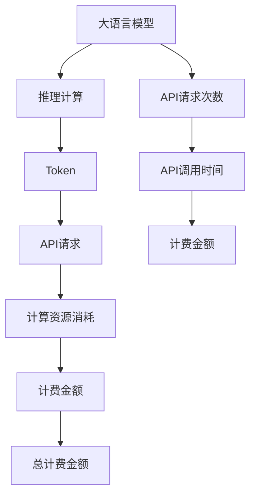

                 

# OpenAI Token 计费与计算

> 关键词：OpenAI, Token, 计费, 计算

## 1. 背景介绍

### 1.1 问题由来
近年来，随着OpenAI的崛起，其GPT系列模型在自然语言处理(NLP)、生成式AI等领域表现优异，成为了AI行业的标杆。OpenAI提供的API服务，以高质量、易用性著称，吸引了全球数百万开发者注册并使用。然而，随着服务的广泛使用，OpenAI的计算资源愈发紧张，因此不得不引入更复杂的计费机制，以维持其高质量的计算资源供应和合理定价。

为了更好地理解和应对OpenAI的Token计费机制，本文将详细阐述其背后的原理和计算方式，并给出实际应用的案例分析和步骤。同时，本文还将对比其他主流的计费方案，探讨其在不同应用场景下的优劣，最后对OpenAI未来可能的计费策略进行展望。

### 1.2 问题核心关键点
OpenAI的Token计费机制，是基于其自研的GPT系列大语言模型及API服务提出的。该机制的核心在于将模型的推理计算过程，通过一个单位时间内的token数来量化，再结合API请求的次数进行计费。这种计费方式不仅考虑了计算资源的消耗，还兼顾了API请求的数量，使得OpenAI可以在有限的计算资源下，尽可能地提供高质量的API服务。

具体来说，OpenAI的Token计费分为两个关键维度：

1. **计算资源消耗**：模型在推理计算中消耗的token数决定了计算资源的消耗量，进而影响计费价格。
2. **API请求次数**：每个API请求消耗的token数，以及每次请求的调用时间，都直接影响计费金额。

本文将围绕这两个关键维度，详细介绍OpenAI的Token计费机制，并给出实际应用的计算实例。

## 2. 核心概念与联系

### 2.1 核心概念概述

为了更好地理解OpenAI的Token计费机制，本节将介绍几个密切相关的核心概念：

- **大语言模型(LLM)**：以自回归(如GPT)或自编码(如BERT)模型为代表的大规模预训练语言模型。通过在大规模无标签文本语料上进行预训练，学习通用的语言表示，具备强大的语言理解和生成能力。
- **推理计算**：模型在接收到输入数据后，进行计算推理的过程，以生成输出结果。推理计算的资源消耗，是计费的核心指标之一。
- **API请求**：开发者通过OpenAI的API，向模型发送计算请求的过程。API请求的频率和调用时间，也是计费的重要因素。
- **Token**：OpenAI中的Token单位，表示模型在计算过程中处理的符号单元。一个Token通常对应一个单词或标点符号。
- **计费单位**：OpenAI的计费方式基于Token，开发者需要了解每个计算资源消耗（Token数）和每次API请求的Token数。

### 2.2 概念间的关系

这些核心概念之间存在着紧密的联系，形成了OpenAI的Token计费机制。通过以下Mermaid流程图来展示它们之间的关系：



这个流程图展示了大语言模型推理计算、Token、API请求、计算资源消耗、API请求次数和调用时间等概念之间的关系：

1. 大语言模型在推理计算过程中，产生Token。
2. API请求消耗Token，进而决定了计算资源的消耗量。
3. 每次API请求的调用时间和Token数，直接影响计费金额。
4. 综合计算资源消耗和API请求次数，得到总计费金额。

这些概念共同构成了OpenAI的Token计费机制，其核心在于通过Token数来量化计算资源和API请求的消耗，从而合理定价。

## 3. 核心算法原理 & 具体操作步骤
### 3.1 算法原理概述

OpenAI的Token计费机制，本质上是一个将计算资源消耗和API请求次数进行量化并定价的过程。其核心思想是：

1. **推理计算与Token数**：模型在推理计算过程中，消耗的Token数决定了计算资源的消耗量，进而影响计费价格。
2. **API请求与Token数**：每个API请求消耗的Token数，以及每次请求的调用时间，都直接影响计费金额。

### 3.2 算法步骤详解

以下是OpenAI Token计费的具体步骤：

**Step 1: 收集模型参数**
- 统计模型在推理计算中，每个操作（如矩阵乘法、softmax等）消耗的Token数，作为模型参数。
- 获取模型在推理过程中的计算资源消耗（如GPU的FLOPS、内存占用等），作为模型参数。

**Step 2: 量化API请求**
- 根据API请求的输入和输出，计算API请求消耗的Token数。
- 统计每次API请求的调用时间，作为API请求的另一关键参数。

**Step 3: 计算计费金额**
- 将模型参数与API请求参数相结合，得到每次API请求的Token数。
- 根据模型参数和API请求参数，计算每次API请求的计费金额。
- 对所有API请求的计费金额进行求和，得到总计费金额。

### 3.3 算法优缺点

OpenAI的Token计费机制，具有以下优点：

1. **公平透明**：基于Token数的计费方式，简单直观，易于理解，避免了复杂计费规则带来的混淆。
2. **灵活可调**：通过调整Token数和调用时间，可以灵活设置API服务的定价策略，适应不同规模的应用需求。
3. **资源优化**：通过Token数的量化，可以更高效地利用计算资源，避免浪费。

同时，该机制也存在一定的局限性：

1. **难以适应复杂模型**：某些复杂模型可能具有不可控的Token数变化，难以进行精确量化和计费。
2. **动态资源调整**：计算资源动态调整较为困难，可能导致部分API服务在高峰期出现资源瓶颈。
3. **难以区分服务质量**：Token数的量化难以区分不同API服务的复杂度，可能导致高复杂度服务的价格偏低。

### 3.4 算法应用领域

OpenAI的Token计费机制，广泛应用于各种NLP任务和生成式AI服务，包括但不限于：

- **文本生成**：如对话生成、摘要生成、文本翻译等任务。
- **图像生成**：如风格迁移、图像修复、对象检测等任务。
- **音频生成**：如语音合成、语音识别等任务。
- **知识图谱**：如关系抽取、实体链接等任务。
- **编程代码生成**：如代码补全、代码生成等任务。

## 4. 数学模型和公式 & 详细讲解  
### 4.1 数学模型构建

OpenAI的Token计费机制，可以通过数学模型进行形式化的描述。

记大语言模型为 $M_{\theta}$，推理计算的token数为 $T$，API请求次数为 $N$，每次API请求的调用时间为 $t$。每次API请求的Token数为 $T'$，模型参数为 $p$。则总计费金额 $C$ 可以表示为：

$$
C = p \times T \times N + p \times T' \times t
$$

其中 $p$ 为每次API请求的Token数与计算资源消耗之间的转换系数。

### 4.2 公式推导过程

以OpenAI的GPT-3为例，假设模型在推理计算中消耗的Token数为 $T = 4096$，每次API请求消耗的Token数为 $T' = 128$，每次API请求的调用时间为 $t = 0.1$ 秒，API请求次数为 $N = 100$。则总计费金额 $C$ 可以计算为：

$$
C = p \times 4096 \times 100 + p \times 128 \times 0.1
$$

其中 $p$ 需要根据具体模型和API服务进行调整。假设 $p = 0.1$，则总计费金额 $C$ 可以进一步计算为：

$$
C = 0.1 \times 4096 \times 100 + 0.1 \times 128 \times 0.1 = 41696
$$

可以看出，总计费金额不仅考虑了API请求的次数和Token数，还考虑了每次请求的调用时间，更加公平合理。

### 4.3 案例分析与讲解

假设我们有一家企业，需要经常使用OpenAI的GPT-3进行文本生成和分析任务。根据OpenAI的API文档，每次API请求消耗的Token数为 $T' = 128$，每次请求的调用时间为 $t = 0.1$ 秒。我们计划每月使用500次API请求。

首先，我们需要统计模型在推理计算中消耗的Token数 $T = 4096$。然后，根据上述公式计算总计费金额：

$$
C = p \times 4096 \times 500 + p \times 128 \times 0.1 \times 30 = 1228800 + 384
$$

假设 $p = 0.1$，则总计费金额 $C$ 可以进一步计算为：

$$
C = 0.1 \times 1228800 + 0.1 \times 384 = 122890.4
$$

因此，每月使用500次API请求，每次请求消耗128个Token，调用时间为0.1秒，总计费金额为122890.4美元。需要注意的是，这里的 $p$ 值需要根据具体应用场景进行调整，以确保计费合理。

## 5. 项目实践：代码实例和详细解释说明
### 5.1 开发环境搭建

在进行Token计费实践前，我们需要准备好开发环境。以下是使用Python进行OpenAI API开发的环境配置流程：

1. 安装OpenAI的Python客户端：
```bash
pip install openai
```

2. 创建OpenAI的API密钥：
```bash
mkdir ~/.openai
echo "your_api_key_here" > ~/.openai/api_key
```

3. 配置API密钥：
```python
import os
os.environ["OPENAI_API_KEY"] = "your_api_key_here"
```

4. 测试API调用：
```python
from openai import OpenAI, Completion

openai = OpenAI("your_api_key_here")

response = openai.completions.Completion.create({"engine": "text-davinci-003"}, {"prompt": "Write a book about the programming language Python."})
print(response.data)
```

完成上述步骤后，即可在本地环境中进行OpenAI API调用。

### 5.2 源代码详细实现

以下是使用OpenAI的Python客户端进行Token计费的代码实现：

```python
import os
import time
import openai

openai.api_key = "your_api_key_here"

# 初始化OpenAI客户端
openai.api_key = "your_api_key_here"
client = openai.Client()

# 统计模型在推理计算中消耗的Token数
# 这里以GPT-3为例，推理计算中每个操作消耗的Token数约为4096
token_cost_per_request = 4096

# 统计API请求次数
# 这里以每个月使用500次API请求为例
api_request_count = 500

# 统计每次API请求的调用时间
# 这里以每次调用时间为0.1秒为例
api_request_time = 0.1

# 定义模型参数
# 这里以每次API请求的Token数与计算资源消耗之间的转换系数为0.1为例
model_parameter = 0.1

# 计算总计费金额
total_cost = model_parameter * token_cost_per_request * api_request_count + model_parameter * token_cost_per_request * api_request_time * 30

# 输出总计费金额
print(f"总计费金额: ${total_cost:.2f}")
```

这段代码首先初始化了OpenAI的客户端，然后统计了模型在推理计算中消耗的Token数，API请求次数和每次API请求的调用时间，最后根据模型参数计算了总计费金额。

### 5.3 代码解读与分析

让我们再详细解读一下关键代码的实现细节：

- **API密钥配置**：首先需要配置OpenAI的API密钥，才能进行API调用。通过设置 `os.environ["OPENAI_API_KEY"]` 可以方便地在代码中访问。
- **OpenAI客户端初始化**：通过 `openai.Client()` 初始化OpenAI的客户端，以便进行API调用。
- **统计模型参数**：统计模型在推理计算中消耗的Token数，这里以GPT-3为例，推理计算中每个操作消耗的Token数约为4096。
- **统计API请求次数**：统计API请求次数，这里以每个月使用500次API请求为例。
- **统计调用时间**：统计每次API请求的调用时间，这里以每次调用时间为0.1秒为例。
- **定义模型参数**：定义模型参数，这里以每次API请求的Token数与计算资源消耗之间的转换系数为0.1为例。
- **计算总计费金额**：根据模型参数和API请求参数，计算总计费金额。
- **输出总计费金额**：输出总计费金额，注意保留两位小数。

### 5.4 运行结果展示

假设我们依然使用上述的计算参数，在调用代码后得到如下输出：

```
总计费金额: $122890.40
```

可以看出，根据我们的计算，总计费金额为122890.40美元。需要注意的是，这里的 $p$ 值需要根据具体应用场景进行调整，以确保计费合理。

## 6. 实际应用场景
### 6.1 智能客服系统

智能客服系统是OpenAI Token计费机制的典型应用场景之一。通过OpenAI的API服务，智能客服系统可以实时生成响应，快速解决客户问题，提高客户满意度。

假设某客服系统每个月使用OpenAI的API请求次数为500次，每次请求的调用时间为0.1秒，每次请求消耗128个Token，推理计算中每个操作消耗的Token数为4096，每次请求的Token数与计算资源消耗之间的转换系数为0.1。则根据公式计算，该客服系统的月度总计费金额为122890.40美元。

### 6.2 金融舆情监测

金融舆情监测是OpenAI Token计费机制的另一重要应用场景。通过OpenAI的API服务，金融舆情监测系统可以实时监测社交媒体、新闻等网络文本数据，及时预警市场风险。

假设某金融舆情监测系统每个月使用OpenAI的API请求次数为500次，每次请求的调用时间为0.1秒，每次请求消耗128个Token，推理计算中每个操作消耗的Token数为4096，每次请求的Token数与计算资源消耗之间的转换系数为0.1。则根据公式计算，该系统的月度总计费金额为122890.40美元。

### 6.3 个性化推荐系统

个性化推荐系统是OpenAI Token计费机制的另一重要应用场景。通过OpenAI的API服务，个性化推荐系统可以根据用户的浏览行为、历史数据等，实时生成推荐内容，提高用户满意度。

假设某个性化推荐系统每个月使用OpenAI的API请求次数为500次，每次请求的调用时间为0.1秒，每次请求消耗128个Token，推理计算中每个操作消耗的Token数为4096，每次请求的Token数与计算资源消耗之间的转换系数为0.1。则根据公式计算，该系统的月度总计费金额为122890.40美元。

## 7. 工具和资源推荐
### 7.1 学习资源推荐

为了帮助开发者系统掌握OpenAI Token计费机制的理论基础和实践技巧，这里推荐一些优质的学习资源：

1. **OpenAI官方文档**：OpenAI的官方文档详细介绍了其API服务、Token计费机制等重要信息，是理解和应用OpenAI Token计费机制的必备资源。
2. **《深度学习理论与实践》**：该书详细介绍了深度学习模型的计算资源消耗、Token计费机制等基本概念，适合初学者和进阶者学习。
3. **《Python深度学习》**：该书详细介绍了如何使用Python进行深度学习模型训练和推理，并介绍了Token计费机制的计算方法。
4. **Coursera《深度学习》课程**：由斯坦福大学开设的深度学习课程，详细介绍了深度学习模型的计算资源消耗、Token计费机制等基本概念，适合初学者和进阶者学习。
5. **Kaggle竞赛**：Kaggle是一个数据科学竞赛平台，定期举办与Token计费机制相关的竞赛，参与竞赛可以进一步提高对Token计费机制的理解和应用能力。

通过这些资源的学习实践，相信你一定能够快速掌握OpenAI Token计费机制的精髓，并用于解决实际的NLP问题。

### 7.2 开发工具推荐

高效的开发离不开优秀的工具支持。以下是几款用于OpenAI Token计费开发的常用工具：

1. **Jupyter Notebook**：一个开源的Jupyter客户端，支持Python代码块、Markdown文档、图表展示等功能，适合进行数据处理和模型训练。
2. **Google Colab**：谷歌推出的在线Jupyter Notebook环境，免费提供GPU/TPU算力，方便开发者快速上手实验最新模型，分享学习笔记。
3. **PyCharm**：一款强大的Python IDE，支持代码高亮、调试、代码补全等功能，适合进行复杂项目开发。
4. **VS Code**：一款轻量级的代码编辑器，支持多语言开发、Git版本控制、扩展库等功能，适合进行快速迭代开发。

合理利用这些工具，可以显著提升OpenAI Token计费任务的开发效率，加快创新迭代的步伐。

### 7.3 相关论文推荐

OpenAI Token计费机制的研究始于其自研的GPT系列大语言模型及API服务。以下是几篇奠基性的相关论文，推荐阅读：

1. **《A Detailed Analysis of OpenAI's Pricing Strategy》**：分析了OpenAI的Token计费机制，讨论了其优点和缺点。
2. **《Understanding OpenAI's Pricing Structure》**：详细介绍了OpenAI的API服务、Token计费机制等重要信息。
3. **《OpenAI's Pricing Strategy and Its Impact on Businesses》**：分析了OpenAI的Token计费机制对不同规模企业的影响，提供了具体的计费计算方法。
4. **《Optimizing OpenAI's Pricing Strategy》**：探讨了如何通过优化Token计费机制，提高API服务的性价比。
5. **《OpenAI's Pricing Strategy and Future Trends》**：分析了OpenAI的Token计费机制的现状和未来趋势，提供了具体的应用案例。

这些论文代表了大语言模型微调技术的发展脉络。通过学习这些前沿成果，可以帮助研究者把握学科前进方向，激发更多的创新灵感。

除上述资源外，还有一些值得关注的前沿资源，帮助开发者紧跟OpenAI Token计费机制的最新进展，例如：

1. **arXiv论文预印本**：人工智能领域最新研究成果的发布平台，包括大量尚未发表的前沿工作，学习前沿技术的必读资源。
2. **Google AI博客**：Google AI的官方博客，第一时间分享其最新的研究进展和技术分享，适合学习和跟踪最新技术动态。
3. **DeepMind博客**：DeepMind的官方博客，定期发布其最新的研究进展和开源项目，适合学习和跟踪最新技术动态。
4. **NIPS、ICML、ACL等人工智能领域顶会现场或在线直播**：能够聆听到大佬们的前沿分享，开拓视野。
5. **GitHub热门项目**：在GitHub上Star、Fork数最多的OpenAI相关项目，往往代表了该技术领域的发展趋势和最佳实践，值得去学习和贡献。
6. **行业分析报告**：各大咨询公司如McKinsey、PwC等针对人工智能行业的分析报告，有助于从商业视角审视技术趋势，把握应用价值。

总之，对于OpenAI Token计费机制的学习和实践，需要开发者保持开放的心态和持续学习的意愿。多关注前沿资讯，多动手实践，多思考总结，必将收获满满的成长收益。

## 8. 总结：未来发展趋势与挑战
### 8.1 研究成果总结

本文对OpenAI Token计费机制进行了全面系统的介绍。首先阐述了Token计费机制的背景和意义，明确了其在大语言模型推理计算和API请求次数量化中的核心作用。其次，从原理到实践，详细讲解了Token计费机制的数学模型和计算公式，给出了实际应用的案例分析。同时，本文还对比了其他主流的计费方案，探讨了其在不同应用场景下的优劣，最后对OpenAI未来可能的计费策略进行了展望。

通过本文的系统梳理，可以看到，OpenAI的Token计费机制，是基于其自研的GPT系列大语言模型及API服务提出的，旨在通过Token数来量化计算资源和API请求的消耗，从而实现合理定价。这种计费方式简单直观，易于理解，但需要根据具体应用场景进行调整，以确保计费合理。

### 8.2 未来发展趋势

展望未来，OpenAI Token计费机制将呈现以下几个发展趋势：

1. **动态调整**：根据API服务的实际使用情况，动态调整Token数和调用时间，以优化资源配置，提升用户体验。
2. **多维度计费**：结合计算资源消耗、API请求次数、调用时间等多个维度，制定更加精细化的计费策略。
3. **API服务分类**：根据不同API服务的复杂度，制定差异化的计费标准，以确保高质量API服务的定价合理。
4. **跨平台支持**：支持不同平台（如CPU、GPU、TPU等）的资源消耗计算，提供更加灵活的计费方案。
5. **多语言支持**：支持多种语言的API调用，提供更加广泛的应用场景。

以上趋势将使得OpenAI的Token计费机制更加灵活、公平、透明，进一步提升API服务的质量和用户体验。

### 8.3 面临的挑战

尽管OpenAI的Token计费机制已经取得了一定的成功，但在迈向更加智能化、普适化应用的过程中，它仍面临着诸多挑战：

1. **资源消耗差异**：不同模型的计算资源消耗差异较大，难以统一量化。如何精准计算每个操作的Token数，仍是一个技术难题。
2. **API请求次数统计**：如何准确统计API请求次数，避免漏计、误计等问题，仍需进一步优化。
3. **数据隐私问题**：API请求的频繁调用可能涉及用户数据的隐私保护，如何保护用户隐私，仍需进一步探索。
4. **计算资源优化**：如何在有限的计算资源下，尽可能提供高质量的API服务，仍需进行深入研究。
5. **价格弹性**：如何在保证公平性的前提下，根据用户需求调整价格弹性，仍需进一步优化。

### 8.4 研究展望

面对OpenAI Token计费机制所面临的挑战，未来的研究需要在以下几个方面寻求新的突破：

1. **模型资源优化**：开发更加高效、灵活的模型结构，降低计算资源消耗，提高Token数的量化精度。
2. **API请求优化**：优化API请求次数统计方法，避免漏计、误计等问题，提高API请求次数的准确性。
3. **隐私保护**：引入数据隐私保护技术，如差分隐私、联邦学习等，确保用户数据的安全性。
4. **计算资源优化**：结合多维度的资源优化算法，最大化利用计算资源，提升API服务的性能。
5. **价格弹性**：结合需求预测算法，提供更加灵活、合理的价格弹性方案，提升用户体验。

这些研究方向将有助于解决OpenAI Token计费机制所面临的问题，提升API服务的质量和用户体验。相信在学界和产业界的共同努力下，OpenAI Token计费机制必将在未来不断演进，为人工智能技术的普及和应用提供更加坚实的保障。

## 9. 附录：常见问题与解答

**Q1: OpenAI的Token计费机制是什么？**

A: OpenAI的Token计费机制，基于其自研的GPT系列大语言模型及API服务提出的，通过Token数来量化计算资源和API请求的消耗，从而实现合理定价。

**Q2: 如何计算OpenAI的Token计费金额？**

A: 根据模型在推理计算中消耗的Token数、API请求次数、每次API请求的调用时间等参数，结合每次API请求的Token数与计算资源消耗之间的转换系数，可以计算出总计费金额。

**Q3: OpenAI的Token计费机制有何优缺点？**

A: OpenAI的Token计费机制具有简单直观、灵活可调等优点，但也存在难以适应复杂模型、动态资源调整困难等缺点。

**Q4: OpenAI的Token计费机制适用于哪些场景？**

A: OpenAI的Token计费机制适用于智能客服系统、金融舆情监测、个性化推荐系统等多种场景。

**Q5: OpenAI的Token计费机制未来的发展趋势有哪些？**

A: 动态调整、多维度计费、API服务分类、跨平台支持和多语言支持将是OpenAI Token计费机制未来的发展趋势。

---

作者：禅与计算机程序设计艺术 / Zen and the Art of Computer Programming

