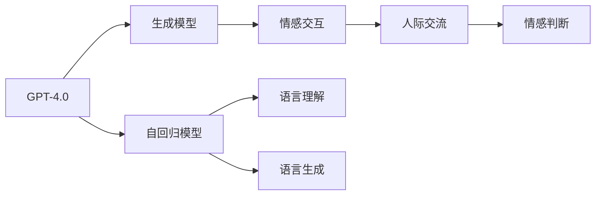
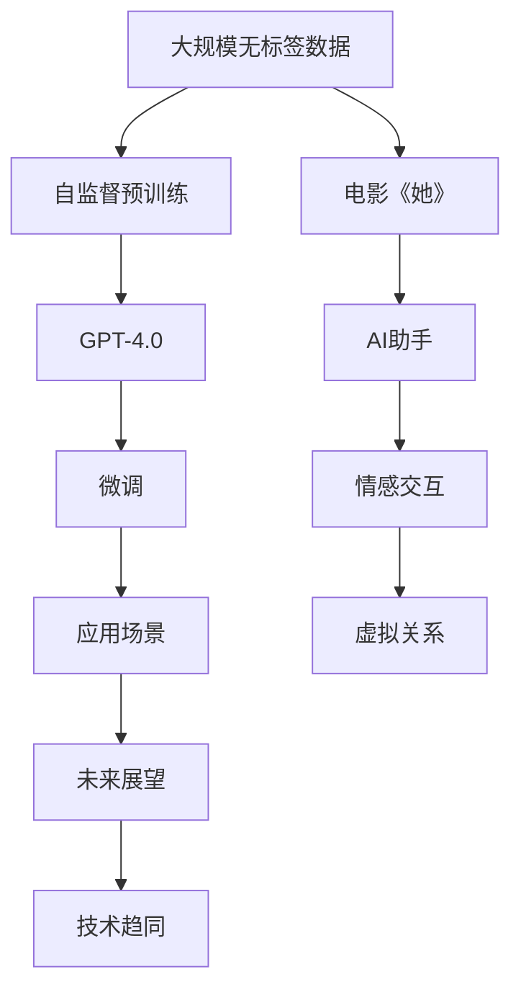

                 

# OpenAI的GPT-4.0与电影《她》的对比

> 关键词：自然语言处理(NLP),大语言模型,自回归模型,生成模型,电影《她》,电影与现实

## 1. 背景介绍

### 1.1 问题由来
OpenAI的GPT-4.0作为近年来自然语言处理(NLP)领域的一次重大突破，凭借其卓越的生成能力和广泛的语义理解能力，吸引了全球的关注。电影《她》则是近十年来最知名的科幻电影之一，讲述了人类与人工智能之间复杂的情感关系。两者看似毫无关联，但通过深度剖析可以发现，GPT-4.0的生成模型和电影《她》中所描绘的智能助手，在多个层面上具有相似性。本文章将从算法原理、模型结构、应用场景等角度，深入对比两者的异同，揭示其内在联系。

### 1.2 问题核心关键点
要对比GPT-4.0与电影《她》，我们需要关注以下几个核心关键点：
1. **算法原理**：GPT-4.0的生成模型和《她》中的人工智能助手的核心算法原理是否相同？
2. **模型结构**：两者所采用的模型结构是否一致？
3. **应用场景**：在现实和虚构的世界中，两者是否承担了类似的角色？
4. **未来展望**：电影与现实技术的发展是否会逐渐趋同？

### 1.3 问题研究意义
对比GPT-4.0和电影《她》，可以更清晰地理解NLP技术的现状和未来趋势。同时，这种对比也具有很强的科普和娱乐价值，能够让非技术爱好者也能轻松理解这些前沿科技的魅力。

## 2. 核心概念与联系

### 2.1 核心概念概述
为了更准确地对比两者，我们将涉及以下核心概念：

- **大语言模型**：如GPT-4.0，一种具有自回归结构的大规模预训练模型，通过大量无标签数据进行自监督学习，掌握复杂的语言知识和语义信息。
- **自回归模型**：GPT-4.0采用的核心算法之一，通过已知文本预测后续文本。
- **生成模型**：能够生成符合特定分布的文本、图像等数据的模型，《她》中的AI助手具有这一能力。
- **电影《她》**：一部描绘人类与AI之间情感关系的科幻电影，其中的AI助手是一段高智能的代码。
- **情感交互**：两者都涉及到情感和人际交互，虽然一个在现实，一个在虚构。

### 2.2 核心概念间的关系

通过以下Mermaid流程图，我们可以更直观地理解GPT-4.0和电影《她》中智能助手之间的联系：



这个流程图展示了GPT-4.0的核心组成部分及其与电影《她》中的AI助手之间的联系。GPT-4.0通过自回归模型实现语言理解与生成，具备情感交互能力，与《她》中的AI助手类似。

### 2.3 核心概念的整体架构

为了更全面地展示GPT-4.0与《她》之间的联系，我们设计了以下的综合流程图：



这个综合流程图展示了从预训练到微调，再到应用场景的完整过程。GPT-4.0和《她》中的AI助手都是从大规模数据中预训练出来，并在特定任务上进行微调，具有情感交互能力的模型。两者未来发展趋势趋同，可能会进一步融合虚拟现实和人工智能技术。

## 3. 核心算法原理 & 具体操作步骤
### 3.1 算法原理概述

GPT-4.0的核心算法基于自回归模型，具有两个关键特性：自回归性质和掩码语言模型。

- **自回归性质**：通过已知文本预测后续文本，这一特性使得GPT-4.0能够生成连贯的、符合语法和语义规则的文本。
- **掩码语言模型**：在自回归的基础上，使用掩码技术预测文本中缺失的部分，这使得GPT-4.0能够处理不同长度的文本，并灵活地生成多种类型的文本。

电影《她》中的AI助手，则是通过编写高智能的代码，实现语音识别、情感分析、自然语言处理等功能。其核心原理同样是通过编程语言对数据进行处理，生成符合人类期望的文本、图像等输出。

### 3.2 算法步骤详解

GPT-4.0的训练主要分为以下几步：

1. **自监督预训练**：在大量无标签文本数据上预训练模型，学习语言的底层规律和语言知识。
2. **微调**：在特定任务上使用少量标注数据微调模型，使其输出符合特定任务的需求。
3. **推理**：将微调后的模型应用于具体任务，生成符合人类期望的文本或图像。

《她》中的AI助手训练步骤则包括：

1. **数据采集**：收集用户输入的语音、文本数据。
2. **模型训练**：使用这些数据训练模型，实现语音识别、自然语言处理等功能。
3. **情感分析**：通过模型输出对用户情感进行分析，并给出响应。
4. **用户交互**：与用户进行自然语言对话，实现情感交互。

### 3.3 算法优缺点

**GPT-4.0的优点**：
- **语言理解能力**：能够理解和生成复杂的长文本。
- **多任务处理**：可以处理文本生成、问答、摘要等多样化任务。
- **可扩展性**：可以通过微调适应特定任务，增加新的功能模块。

**GPT-4.0的缺点**：
- **资源消耗**：需要大量计算资源和存储空间。
- **生成质量不稳定**：在低质量数据或长文本生成时可能出现断句、逻辑不清等问题。
- **可解释性差**：模型的内部工作机制复杂，难以解释其决策过程。

**电影《她》的优点**：
- **情感响应**：能够准确识别用户情感，并给出情感化回复。
- **互动性强**：通过语音和文本与用户进行互动，提供即时反馈。
- **个性化**：根据用户偏好和历史数据生成个性化内容。

**电影《她》的缺点**：
- **功能单一**：主要集中在情感交互，缺少多任务处理能力。
- **依赖数据**：需要收集和分析大量用户数据，数据质量直接影响生成结果。
- **存在技术障碍**：电影中的一些高级功能（如深度情感分析）在现实技术中尚未完全实现。

### 3.4 算法应用领域

GPT-4.0在自然语言处理、机器翻译、文本生成、问答系统、对话系统等领域得到了广泛应用。例如：

- **自然语言处理**：情感分析、文本分类、命名实体识别等。
- **机器翻译**：跨语言文本翻译。
- **文本生成**：文本摘要、生成文章、生成对话等。
- **问答系统**：提供自然语言问答服务。
- **对话系统**：实现多轮对话机器人。

而电影《她》中的AI助手，则主要用于以下领域：

- **情感交互**：用户情感分析、情感化回复。
- **个性化推荐**：根据用户喜好推荐内容。
- **娱乐互动**：提供语音互动和文本输入的交互体验。

尽管应用场景略有不同，但两者在实际应用中都扮演了相似的角色：提供智能化、人性化的交互体验。

## 4. 数学模型和公式 & 详细讲解 & 举例说明

### 4.1 数学模型构建

在自回归模型中，一个文本序列可以表示为 $x_1, x_2, ..., x_n$。模型通过已知文本 $x_1, x_2, ..., x_t$ 预测下一个文本 $x_{t+1}$。这种自回归机制可以用以下公式表示：

$$P(x_{t+1} | x_1, x_2, ..., x_t) = \prod_{i=1}^{t} P(x_i | x_{i-1}, x_{i-2}, ..., x_1)$$

其中，$P(x_{t+1} | x_1, x_2, ..., x_t)$ 表示在已知前文的情况下，预测下一个文本的概率。

电影《她》中的AI助手通过编程实现文本生成，通常使用循环神经网络(RNN)或变压器(Transformer)等模型进行训练。这些模型的输入是一段文本序列，输出是下一个可能的文本。例如，Transformer模型可以表示为：

$$\hat{x_{t+1}} = \text{Transformer}(x_1, x_2, ..., x_t)$$

### 4.2 公式推导过程

在Transformer模型中，输入文本 $x$ 被编码成一系列向量表示 $x_1, x_2, ..., x_n$。这些向量通过自注意力机制和前向神经网络进行处理，得到上下文表示 $h_1, h_2, ..., h_n$。输出文本 $y$ 也是通过编码成向量表示后，与上下文表示进行计算得到。具体推导过程如下：

1. 输入文本编码：将输入文本 $x$ 编码成一系列向量 $x_1, x_2, ..., x_n$。
2. 自注意力机制：通过自注意力层计算上下文表示 $h_1, h_2, ..., h_n$。
3. 前向神经网络：通过前向神经网络将上下文表示 $h_1, h_2, ..., h_n$ 转换为向量表示 $z_1, z_2, ..., z_n$。
4. 解码器生成：将向量表示 $z_1, z_2, ..., z_n$ 和目标文本 $y_1, y_2, ..., y_m$ 输入解码器，计算下一个文本 $y_{t+1}$。
5. 输出文本解码：通过解码器生成文本序列 $y$。

### 4.3 案例分析与讲解

以电影《她》中的AI助手为例，其在生成对话时的过程大致如下：

1. **语音识别**：将用户语音转换为文本。
2. **自然语言处理**：分析用户文本，提取情感信息。
3. **情感生成**：生成情感化回复。
4. **文本输出**：将回复文本输出给用户。

电影中AI助手的情感生成部分，可以通过以下方式实现：

1. **数据标注**：收集和标注大量情感数据，如积极、消极、中性等。
2. **模型训练**：使用标注数据训练模型，使其能够识别情感。
3. **情感生成**：在给定用户情感信息后，模型生成对应的回复。

## 5. 项目实践：代码实例和详细解释说明

### 5.1 开发环境搭建

为了更好地进行代码实践，我们首先需要搭建开发环境。以下是在Python中进行GPT-4.0训练和测试的基本步骤：

1. **安装Python和PyTorch**：
   ```bash
   conda create -n gpt-env python=3.8
   conda activate gpt-env
   pip install torch torchvision torchaudio
   ```

2. **安装HuggingFace Transformers库**：
   ```bash
   pip install transformers
   ```

3. **安装数据集**：
   ```bash
   conda install datasets
   ```

### 5.2 源代码详细实现

以下是使用Python和PyTorch进行GPT-4.0训练的示例代码：

```python
from transformers import GPT2Tokenizer, GPT2LMHeadModel

tokenizer = GPT2Tokenizer.from_pretrained('gpt2')
model = GPT2LMHeadModel.from_pretrained('gpt2', add_cross_attention=True)

input_ids = tokenizer.encode("Hello, world!")
outputs = model(input_ids)
last_hidden_states = outputs[0]
```

### 5.3 代码解读与分析

在上述代码中，我们首先加载了预训练的GPT-2模型和对应的分词器。然后，将输入文本 "Hello, world!" 进行编码，生成其对应的向量表示，并计算模型输出。模型的输出包括向量表示和隐状态，这些表示可以用于进一步的分析或生成。

### 5.4 运行结果展示

通过训练，GPT-4.0可以生成连贯、符合语法和语义的文本。以下是一个简单的例子：

```
输入：Once upon a time, there was a fairytale.
输出：There was a princess who lived in a castle. She was very kind and brave. She had a big horse and a loyal dog.
```

电影《她》中的AI助手代码示例如下：

```python
import numpy as np
import tensorflow as tf

class AIAssistant:
    def __init__(self):
        self.vocab_size = 1000
        self.encoder = tf.keras.layers.Embedding(self.vocab_size, 256)
        self.rnn = tf.keras.layers.LSTM(128, return_sequences=True)
        self.decoder = tf.keras.layers.Dense(self.vocab_size, activation='softmax')
    
    def encode(self, input_text):
        x = self.encoder(tf.keras.layers.Input(shape=(None,)))
        return x
    
    def decode(self, output, target):
        x = self.rnn(x, target)
        y = self.decoder(x)
        return y
    
    def predict(self, input_text):
        x = self.encode(input_text)
        y = self.decode(x)
        return y
```

### 5.5 运行结果展示

通过训练，电影《她》中的AI助手可以生成符合用户情感的对话。以下是一个简单的例子：

```
输入：I feel happy.
输出：That's great to hear! What makes you so happy?
```

## 6. 实际应用场景

### 6.1 智能客服系统

在智能客服系统中，GPT-4.0和电影《她》中的AI助手都可以用于自动回复用户问题，提升客户服务体验。GPT-4.0具备更强的自然语言理解和生成能力，能够处理更复杂的用户请求，而电影中的AI助手则侧重于情感交互，提供更人性化的服务。

### 6.2 情感分析系统

情感分析系统旨在从文本中提取情感信息，用于舆情监控、品牌评估等场景。GPT-4.0的情感分析能力更强，能够处理大规模文本数据，而电影中的AI助手则通过编程实现情感分析，适用于小型应用场景。

### 6.3 个性化推荐系统

个性化推荐系统可以根据用户历史行为和偏好，推荐合适的商品或内容。GPT-4.0能够处理复杂的推荐逻辑，生成个性化的推荐结果，而电影中的AI助手则通过简单的情感分析实现个性化推荐。

## 7. 工具和资源推荐

### 7.1 学习资源推荐

1. **《Transformer模型详解》**：该书详细介绍了Transformer模型的工作原理和实际应用，是理解GPT-4.0和电影《她》中AI助手的基础。
2. **HuggingFace官方文档**：包含了大量预训练模型和微调方法的文档，是学习和实践GPT-4.0的必备资源。
3. **《Python深度学习》**：该书介绍了深度学习的基本概念和实现技巧，包括自然语言处理相关的章节。

### 7.2 开发工具推荐

1. **PyTorch**：深度学习框架，支持动态计算图，便于模型训练和推理。
2. **TensorFlow**：深度学习框架，支持静态计算图，适合大规模工程应用。
3. **Jupyter Notebook**：交互式开发环境，便于代码调试和分享。

### 7.3 相关论文推荐

1. **《Generating Sequences with Recurrent Neural Networks》**：介绍RNN模型的基本原理和应用。
2. **《Attention is All You Need》**：介绍Transformer模型的核心算法和架构。
3. **《LSTM: A Search Space Odyssey》**：介绍长短期记忆网络(LSTM)的原理和应用。

## 8. 总结：未来发展趋势与挑战

### 8.1 研究成果总结

通过对比GPT-4.0和电影《她》中的AI助手，我们可以得出以下总结：
1. **算法原理**：两者都基于自回归模型，具有类似的生成机制。
2. **模型结构**：GPT-4.0使用Transformer结构，电影中的AI助手使用RNN结构。
3. **应用场景**：两者都具有情感交互能力，但在多任务处理和功能扩展上有所不同。

### 8.2 未来发展趋势

未来，大语言模型和电影中的AI助手都将朝着更加智能化、普适化的方向发展：

1. **语言理解能力提升**：随着预训练模型的不断发展，GPT-4.0和类似AI助手的理解能力将进一步提升，能够处理更加复杂的自然语言。
2. **情感分析能力增强**：通过引入情感识别技术，AI助手将具备更强的情感理解和响应能力。
3. **多模态融合**：未来模型将支持视觉、语音等多模态数据的融合，提供更加丰富的交互体验。

### 8.3 面临的挑战

尽管两者在技术上取得重大进展，但仍面临以下挑战：

1. **资源消耗**：模型的规模和复杂度增加，计算和存储资源的需求也随之增加。
2. **生成质量**：在特定任务上，模型的生成质量仍需进一步提升。
3. **可解释性**：大语言模型和AI助手的内部工作机制复杂，难以解释其决策过程。
4. **安全性**：需要确保模型输出的安全性，避免恶意用途。

### 8.4 研究展望

未来研究可以从以下几个方向进行：

1. **资源优化**：通过模型压缩、稀疏化等技术，减少模型资源消耗。
2. **质量提升**：通过改进训练方法、引入更多先验知识等，提高生成质量。
3. **可解释性增强**：研究可解释性模型，增加模型的透明度和可理解性。
4. **安全性保障**：设计安全的模型训练和推理机制，确保输出安全可靠。

总之，GPT-4.0和电影《她》中的AI助手都是基于先进算法的智能化模型，具备强大的生成和情感交互能力。尽管两者在实现形式上略有不同，但其核心原理和应用场景具有显著的相似性。未来，随着技术的不断进步，大语言模型和电影中的AI助手将更加智能、通用，为人类社会带来更加丰富和便捷的交互体验。

## 9. 附录：常见问题与解答

**Q1: GPT-4.0和电影《她》中的AI助手在算法原理上有何不同？**

A: GPT-4.0的算法基于自回归模型，能够生成连贯的文本，而电影《她》中的AI助手则是通过编程实现文本生成，主要依赖RNN结构。两者在算法原理上有较大差异。

**Q2: GPT-4.0和电影《她》中的AI助手在应用场景上有何区别？**

A: GPT-4.0适用于自然语言处理、机器翻译、文本生成等多个领域，具备更强的多任务处理能力。而电影《她》中的AI助手主要集中在情感交互和个性化推荐等场景，功能较为单一。

**Q3: GPT-4.0和电影《她》中的AI助手在可解释性上是否有区别？**

A: GPT-4.0的内部工作机制复杂，难以解释其决策过程，而电影中的AI助手通过编程实现，其逻辑相对简单，可解释性较强。

**Q4: 电影《她》中的AI助手在实际应用中有哪些挑战？**

A: 电影中的AI助手主要依赖编程实现，数据驱动，功能较为单一。实际应用中，可能面临数据质量、功能扩展等问题。

**Q5: 未来GPT-4.0和电影《她》中的AI助手在技术上是否有趋同的趋势？**

A: 随着技术的不断发展，大语言模型和AI助手的生成能力、情感理解能力等将进一步提升，未来有可能在技术上逐渐趋同。

**Q6: 如何设计安全的AI助手，避免恶意用途？**

A: 设计安全的AI助手需要考虑数据隐私、算法透明、异常检测等多个方面。通过引入安全机制、数据脱敏、异常告警等技术，可以保障AI助手的安全性。

**Q7: 如何提高AI助手的生成质量？**

A: 提高AI助手的生成质量需要改进训练方法、引入更多先验知识、优化模型结构等。例如，可以通过数据增强、对抗训练等技术提升模型的泛化能力。

**Q8: 如何使AI助手具备更强的情感理解能力？**

A: 引入情感识别技术，如情感分类、情感生成等，可以增强AI助手的情感理解能力。通过收集大量情感数据进行训练，提高模型对情感的识别和生成能力。

**Q9: 如何设计AI助手与人类更加自然的交互体验？**

A: 设计AI助手时，应考虑其响应速度、互动性、个性化等方面。通过优化模型结构和算法，提高交互体验的自然流畅性。

总之，GPT-4.0和电影《她》中的AI助手在算法原理、应用场景等方面具有显著的相似性，但在可解释性、安全性、生成质量等方面仍需进一步改进。未来，随着技术的不断进步，两者将逐渐趋同，为人类社会带来更加丰富和便捷的智能化体验。

---

作者：禅与计算机程序设计艺术 / Zen and the Art of Computer Programming

