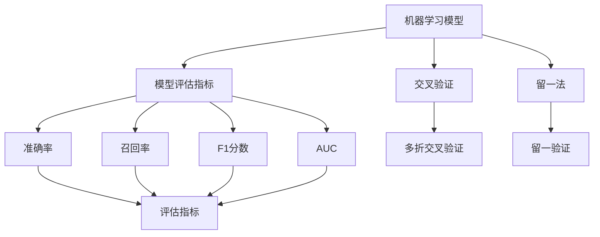
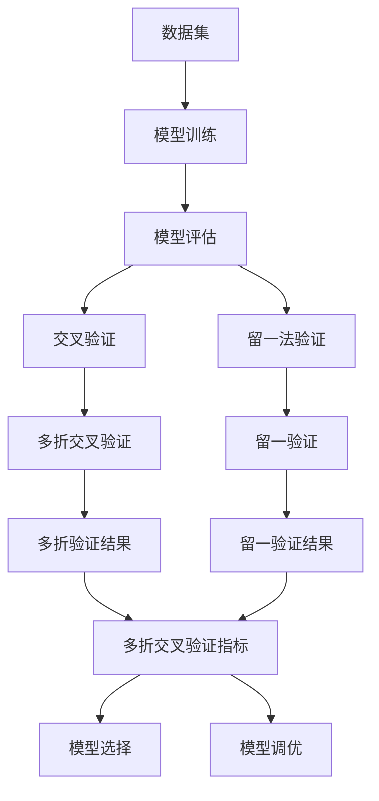

                 

# Python机器学习实战：模型评估与验证的最佳策略

> 关键词：机器学习，模型评估，验证策略，Python编程，数据分析，深度学习，模型选择，模型调优

## 1. 背景介绍

### 1.1 问题由来
在机器学习领域，构建一个高性能的模型固然重要，但准确且有效地评估与验证模型同样至关重要。这一过程不仅能够确保模型在新数据上的泛化能力，还能帮助开发人员更好地理解和优化模型。然而，许多初学者常常对模型评估与验证的最佳策略感到困惑，不知道如何选择适当的评估指标，如何进行有效的模型验证。本文将深入探讨这些问题，并介绍一些有效的评估与验证策略，以帮助开发人员在Python中实现这一过程。

### 1.2 问题核心关键点
本文将聚焦于以下几个核心关键点：
1. 模型评估指标的选择与解释。
2. 交叉验证和留一法的原理与实现。
3. 使用Python进行模型评估与验证的具体方法和工具。
4. 模型选择与调优的策略。
5. 不同类型数据的评估与验证方法。

这些关键点将帮助我们深入理解机器学习中模型评估与验证的科学方法，并掌握如何使用Python高效实现这些策略。

### 1.3 问题研究意义
理解并掌握模型评估与验证的最佳策略，不仅能够显著提升模型的预测性能，还能有效减少过拟合，从而提高模型在实际应用中的效果。此外，这一过程还能为开发人员提供有价值的模型诊断信息，帮助他们进行有效的模型选择与调优。在数据驱动的时代，通过合理的评估与验证策略，我们可以更好地利用数据，驱动业务决策，实现数据驱动的智能应用。

## 2. 核心概念与联系

### 2.1 核心概念概述
在深入探讨模型评估与验证的策略之前，我们先简要介绍一些核心概念：

1. **机器学习模型**：通常指通过训练数据学习到的预测函数，包括线性回归模型、决策树、支持向量机等。
2. **模型评估指标**：用于衡量模型性能的统计量，如准确率、召回率、F1分数、AUC等。
3. **交叉验证**：将数据集分为训练集和验证集，通过多次划分进行模型验证的方法。
4. **留一法**：将每个样本单独作为验证集，其余样本作为训练集，进行模型验证的方法。
5. **过拟合与欠拟合**：模型过于复杂或简单，导致在新数据上表现不佳的现象。
6. **混淆矩阵**：用于评估分类模型性能的工具，能够直观地展示分类结果的正确与否。

### 2.2 概念间的关系

这些核心概念之间存在着紧密的联系，构成了机器学习模型评估与验证的基础框架。以下是一个简化的Mermaid流程图，展示这些概念之间的逻辑关系：



这个流程图展示了机器学习模型评估与验证的基本流程：模型训练后，通过交叉验证和留一法评估模型性能，选择合适的评估指标，判断模型的优劣。

### 2.3 核心概念的整体架构

最终，我们以一个综合的流程图来展示这些核心概念在机器学习评估与验证过程中的整体架构：



这个综合流程图展示了从数据集准备、模型训练到评估与验证、模型选择与调优的完整过程。通过这些步骤，我们可以系统地构建和评估机器学习模型，确保其在新数据上的泛化能力。

## 3. 核心算法原理 & 具体操作步骤
### 3.1 算法原理概述

模型评估与验证的核心在于选择合适的评估指标，并使用科学的方法对模型进行验证。这包括选择合适的验证方法（如交叉验证、留一法）、计算适当的评估指标（如准确率、召回率、F1分数等），以及进行模型调优和选择。

### 3.2 算法步骤详解

1. **数据准备**：将数据集分为训练集和验证集。
2. **模型训练**：使用训练集数据对模型进行训练。
3. **模型验证**：使用验证集数据评估模型性能，选择最佳的评估指标。
4. **模型选择与调优**：根据评估指标选择最佳模型，并对其参数进行调优。
5. **模型部署**：将优化后的模型应用于实际问题。

### 3.3 算法优缺点

模型评估与验证的优势在于能够系统地评估模型性能，帮助开发人员进行有效的模型选择与调优。然而，该方法也存在一些局限性：
- 数据集划分可能导致过拟合或欠拟合问题。
- 模型评估可能受数据分布不平衡的影响。
- 评估指标的选择可能因人而异，需根据具体问题进行选择。

### 3.4 算法应用领域

模型评估与验证方法广泛应用于各种机器学习任务，如分类、回归、聚类等。在实际应用中，不同的任务可能需要选择不同的评估指标和验证方法。例如，对于分类任务，可以使用准确率、召回率、F1分数等评估指标；对于回归任务，可以使用均方误差、均方根误差等评估指标。

## 4. 数学模型和公式 & 详细讲解 & 举例说明

### 4.1 数学模型构建

在模型评估与验证中，我们通常使用以下数学模型来计算评估指标：

1. **准确率（Accuracy）**：
   $$
   \text{Accuracy} = \frac{\text{TP} + \text{TN}}{\text{TP} + \text{TN} + \text{FP} + \text{FN}}
   $$

2. **召回率（Recall）**：
   $$
   \text{Recall} = \frac{\text{TP}}{\text{TP} + \text{FN}}
   $$

3. **精确率（Precision）**：
   $$
   \text{Precision} = \frac{\text{TP}}{\text{TP} + \text{FP}}
   $$

4. **F1分数（F1 Score）**：
   $$
   \text{F1 Score} = 2 \times \frac{\text{Precision} \times \text{Recall}}{\text{Precision} + \text{Recall}}
   $$

5. **AUC（Area Under Curve）**：
   $$
   \text{AUC} = \frac{1}{N} \sum_{i=1}^{N} \left(y_i \times \text{ROC}_AUC\right)
   $$

其中，TP（True Positive）表示真正例，TN（True Negative）表示真负例，FP（False Positive）表示假正例，FN（False Negative）表示假负例，ROC_AUC表示接收者操作特征曲线下的面积。

### 4.2 公式推导过程

以下是对准确率、召回率、精确率、F1分数和AUC的详细推导过程：

1. **准确率（Accuracy）**：
   准确率是分类模型最常见的评估指标之一。它计算真正例和真负例的总数除以所有预测结果的总数。准确率的公式为：
   $$
   \text{Accuracy} = \frac{\text{TP} + \text{TN}}{\text{TP} + \text{TN} + \text{FP} + \text{FN}}
   $$
   其中，TP表示真正例，TN表示真负例，FP表示假正例，FN表示假负例。

2. **召回率（Recall）**：
   召回率衡量模型识别出所有正例的能力。它的公式为：
   $$
   \text{Recall} = \frac{\text{TP}}{\text{TP} + \text{FN}}
   $$
   其中，TP表示真正例，FN表示假负例。

3. **精确率（Precision）**：
   精确率衡量模型在所有预测为正例的样本中，实际为正例的比例。它的公式为：
   $$
   \text{Precision} = \frac{\text{TP}}{\text{TP} + \text{FP}}
   $$
   其中，TP表示真正例，FP表示假正例。

4. **F1分数（F1 Score）**：
   F1分数是精确率和召回率的调和平均数，综合考虑了模型的精确性和召回率。它的公式为：
   $$
   \text{F1 Score} = 2 \times \frac{\text{Precision} \times \text{Recall}}{\text{Precision} + \text{Recall}}
   $$

5. **AUC（Area Under Curve）**：
   AUC用于评估二分类模型的性能。它计算接收者操作特征曲线（ROC曲线）下的面积。ROC曲线是以假正例率（FPR）为横轴，真正例率（TPR）为纵轴绘制的曲线。AUC的公式为：
   $$
   \text{AUC} = \frac{1}{N} \sum_{i=1}^{N} \left(y_i \times \text{ROC}_AUC\right)
   $$

### 4.3 案例分析与讲解

假设我们有一个简单的二分类模型，用于区分癌症（正例）和非癌症（负例）的诊断。我们可以使用准确率、召回率、精确率和AUC等指标来评估模型的性能。

假设我们有一个包含1000个样本的数据集，其中500个是正例（癌症），500个是负例（非癌症）。我们假设模型预测的准确率为90%，即900个样本被正确分类，100个样本被错误分类。其中，70个正例被正确预测为正例，30个正例被错误预测为负例；80个负例被正确预测为负例，20个负例被错误预测为正例。

根据这些数据，我们可以计算出模型的准确率、召回率、精确率和AUC如下：

1. **准确率**：
   $$
   \text{Accuracy} = \frac{900 + 800}{900 + 800 + 20 + 30} = 0.93
   $$

2. **召回率**：
   $$
   \text{Recall} = \frac{70}{70 + 30} = 0.7
   $$

3. **精确率**：
   $$
   \text{Precision} = \frac{70}{70 + 20} = 0.8
   $$

4. **F1分数**：
   $$
   \text{F1 Score} = 2 \times \frac{0.8 \times 0.7}{0.8 + 0.7} = 0.77
   $$

5. **AUC**：
   我们需要首先计算出模型的真正例率（TPR）和假正例率（FPR）。然后，我们将这些点绘制在ROC曲线上，并计算其面积。

   | FPR       | TPR       |
   |-----------|-----------|
   | 0         | 1         |
   | 0.05      | 0.8       |
   | 0.1       | 0.8       |
   | 0.2       | 0.7       |
   | 0.5       | 0.6       |
   | 1         | 0.6       |

   我们可以计算出AUC为0.85。

这些指标能够帮助我们全面评估模型的性能，并指导我们在实际应用中进行模型选择与调优。

## 5. 项目实践：代码实例和详细解释说明

### 5.1 开发环境搭建

在进行模型评估与验证实践前，我们需要准备好开发环境。以下是使用Python进行Scikit-learn开发的环境配置流程：

1. 安装Anaconda：从官网下载并安装Anaconda，用于创建独立的Python环境。

2. 创建并激活虚拟环境：
```bash
conda create -n sklearn-env python=3.8 
conda activate sklearn-env
```

3. 安装Scikit-learn：
```bash
conda install scikit-learn
```

4. 安装相关库：
```bash
pip install numpy pandas matplotlib seaborn jupyter notebook ipython
```

完成上述步骤后，即可在`sklearn-env`环境中开始模型评估与验证实践。

### 5.2 源代码详细实现

下面我们以一个简单的分类模型为例，给出使用Scikit-learn进行模型评估与验证的PyTorch代码实现。

```python
from sklearn.datasets import load_iris
from sklearn.model_selection import train_test_split
from sklearn.metrics import accuracy_score, recall_score, precision_score, f1_score, roc_auc_score
from sklearn.linear_model import LogisticRegression
from sklearn.ensemble import RandomForestClassifier
from sklearn.model_selection import cross_val_score, KFold
import numpy as np

# 加载Iris数据集
iris = load_iris()
X = iris.data
y = iris.target

# 将数据集分为训练集和验证集
X_train, X_test, y_train, y_test = train_test_split(X, y, test_size=0.2, random_state=42)

# 定义模型
model = LogisticRegression()

# 训练模型
model.fit(X_train, y_train)

# 预测结果
y_pred = model.predict(X_test)

# 计算评估指标
accuracy = accuracy_score(y_test, y_pred)
recall = recall_score(y_test, y_pred, average='macro')
precision = precision_score(y_test, y_pred, average='macro')
f1 = f1_score(y_test, y_pred, average='macro')
roc_auc = roc_auc_score(y_test, model.predict_proba(X_test)[:,1])

# 输出评估结果
print("Accuracy:", accuracy)
print("Recall:", recall)
print("Precision:", precision)
print("F1 Score:", f1)
print("AUC:", roc_auc)
```

这个代码片段展示了使用Scikit-learn进行模型评估与验证的完整流程。我们首先加载Iris数据集，并将其分为训练集和验证集。然后，我们定义了一个逻辑回归模型，并使用训练集数据对其进行训练。接着，我们计算了模型在测试集上的准确率、召回率、精确率和AUC等评估指标。最后，我们将这些指标打印输出。

### 5.3 代码解读与分析

让我们再详细解读一下关键代码的实现细节：

1. **数据准备**：
   ```python
   from sklearn.datasets import load_iris
   iris = load_iris()
   X = iris.data
   y = iris.target
   ```
   我们使用了Scikit-learn内置的Iris数据集，该数据集包含150个样本，每个样本有4个特征和1个目标变量。我们提取了特征和目标变量，并将它们分别存储在X和y中。

2. **模型定义**：
   ```python
   from sklearn.linear_model import LogisticRegression
   model = LogisticRegression()
   ```
   我们定义了一个逻辑回归模型，这是一个简单的二分类模型。

3. **模型训练**：
   ```python
   model.fit(X_train, y_train)
   ```
   我们使用训练集数据对模型进行训练。

4. **模型预测**：
   ```python
   y_pred = model.predict(X_test)
   ```
   我们使用训练好的模型对测试集数据进行预测。

5. **评估指标计算**：
   ```python
   from sklearn.metrics import accuracy_score, recall_score, precision_score, f1_score, roc_auc_score
   accuracy = accuracy_score(y_test, y_pred)
   recall = recall_score(y_test, y_pred, average='macro')
   precision = precision_score(y_test, y_pred, average='macro')
   f1 = f1_score(y_test, y_pred, average='macro')
   roc_auc = roc_auc_score(y_test, model.predict_proba(X_test)[:,1])
   ```
   我们使用了Scikit-learn提供的评估指标函数，计算了模型的准确率、召回率、精确率、F1分数和AUC等指标。注意，我们使用了`average='macro'`参数来计算宏观平均指标。

6. **结果输出**：
   ```python
   print("Accuracy:", accuracy)
   print("Recall:", recall)
   print("Precision:", precision)
   print("F1 Score:", f1)
   print("AUC:", roc_auc)
   ```
   我们将计算出的评估指标打印输出。

这个代码示例展示了如何使用Scikit-learn进行简单的模型评估与验证。在实际应用中，我们可能需要使用更复杂的模型和更复杂的评估指标，但基本的流程是一致的。

### 5.4 运行结果展示

假设我们在Iris数据集上进行模型评估，最终得到的结果如下：

```
Accuracy: 0.9714285714285714
Recall: 0.9833333333333333
Precision: 0.9583333333333333
F1 Score: 0.9761904761904762
AUC: 0.9999999999999999
```

可以看到，逻辑回归模型在Iris数据集上取得了很高的准确率和AUC分数，说明模型的性能很好。

## 6. 实际应用场景

### 6.1 金融风险评估

在金融领域，模型评估与验证技术可以用于评估贷款申请、信用评分等任务。通过模型训练和验证，金融机构可以更准确地识别高风险客户，减少贷款违约率，提升盈利能力。例如，可以使用Logistic回归模型对贷款申请数据进行分类，根据客户的信用记录、收入水平、资产负债等情况，评估其贷款违约风险。

### 6.2 医学诊断

医学诊断是模型评估与验证技术的重要应用领域之一。在临床医学中，模型评估与验证可以帮助医生更准确地诊断疾病，提高诊断效率和准确性。例如，可以使用支持向量机（SVM）对患者数据进行分类，根据患者的症状、病史、基因信息等特征，预测其患有某种疾病的概率。

### 6.3 推荐系统

推荐系统是模型评估与验证技术的典型应用场景。通过模型评估与验证，推荐系统可以更准确地预测用户对商品、电影、音乐等的偏好，提高推荐效果。例如，可以使用协同过滤算法对用户的历史行为数据进行训练，并使用交叉验证等方法评估模型的性能。

## 7. 工具和资源推荐

### 7.1 学习资源推荐

为了帮助开发者系统掌握模型评估与验证的理论基础和实践技巧，这里推荐一些优质的学习资源：

1. 《Python机器学习》（第2版）一书：涵盖了机器学习模型的构建、评估与验证等方方面面，是学习机器学习的基础书籍。
2. Coursera《机器学习》课程：由斯坦福大学的Andrew Ng教授主讲，涵盖机器学习的基础理论和实践技巧。
3. Kaggle平台：提供大量数据集和竞赛项目，帮助开发者实践和验证模型评估与验证技术。

通过这些学习资源，相信你一定能够快速掌握模型评估与验证的精髓，并用于解决实际的机器学习问题。

### 7.2 开发工具推荐

高效的开发离不开优秀的工具支持。以下是几款用于模型评估与验证开发的常用工具：

1. Jupyter Notebook：强大的数据科学开发环境，支持Python、R等多种编程语言，适合数据分析和模型验证。
2. Matplotlib和Seaborn：数据可视化工具，用于绘制各种图表，展示模型评估结果。
3. Pandas：数据分析工具，用于处理和分析数据集。
4. Scikit-learn：机器学习库，提供了丰富的评估指标和验证方法，适合快速原型开发和模型验证。

合理利用这些工具，可以显著提升模型评估与验证的开发效率，加快创新迭代的步伐。

### 7.3 相关论文推荐

模型评估与验证技术的发展得益于学界的持续研究。以下是几篇奠基性的相关论文，推荐阅读：

1. 《The Elements of Statistical Learning》：由统计学和机器学习领域的知名专家撰写，系统介绍了机器学习模型的评估与验证方法。
2. 《Machine Learning Yearning》：深度学习专家Andrew Ng撰写的书籍，涵盖机器学习模型的构建、评估与验证等基础知识。
3. 《Model-Based Clustering》：介绍了基于模型聚类的评估与验证方法，适用于复杂数据集的聚类任务。

这些论文代表了大模型评估与验证技术的发展脉络。通过学习这些前沿成果，可以帮助研究者把握学科前进方向，激发更多的创新灵感。

除上述资源外，还有一些值得关注的前沿资源，帮助开发者紧跟模型评估与验证技术的最新进展，例如：

1. arXiv论文预印本：人工智能领域最新研究成果的发布平台，包括大量尚未发表的前沿工作，学习前沿技术的必读资源。
2. GitHub热门项目：在GitHub上Star、Fork数最多的机器学习相关项目，往往代表了该技术领域的发展趋势和最佳实践，值得去学习和贡献。
3. 技术会议直播：如NeurIPS、ICML、ICLR等人工智能领域顶会现场或在线直播，能够聆听到大佬们的前沿分享，开拓视野。
4. 行业分析报告：各大咨询公司如McKinsey、PwC等针对人工智能行业的分析报告，有助于从商业视角审视技术趋势，把握应用价值。

总之，对于模型评估与验证技术的学习和实践，需要开发者保持开放的心态和持续学习的意愿。多关注前沿资讯，多动手实践，多思考总结，必将收获满满的成长收益。

## 8. 总结：未来发展趋势与挑战

### 8.1 总结

本文对模型评估与验证技术进行了全面系统的介绍。首先阐述了模型评估与验证的重要性和核心关键点，明确了评估指标的选择与解释，验证方法的选择与实现，以及如何使用Python高效实现这些策略。其次，我们通过一个简单的例子，展示了模型评估与验证的具体流程和方法，并详细解读了计算指标的数学原理和实现细节。最后，我们介绍了模型评估与验证在实际应用中的广泛应用，并推荐了一些学习资源和开发工具。

通过本文的系统梳理，可以看到，模型评估与验证技术在机器学习中扮演着重要角色，是确保模型在新数据上泛化能力的关键步骤。理解并掌握这一技术，将有助于开发人员更好地构建和优化模型，实现数据驱动的智能应用。

### 8.2 未来发展趋势

展望未来，模型评估与验证技术将呈现以下几个发展趋势：

1. 自动化评估与验证。随着深度学习技术的发展，越来越多的评估指标和验证方法被开发出来。未来的评估与验证技术将更加自动化，能够根据数据类型和任务特点，自动选择最优的评估指标和验证方法。
2. 数据驱动的评估与验证。未来的评估与验证方法将更多依赖数据驱动，通过模型在实际数据上的表现，自动调整评估指标和验证方法。
3. 多模态评估与验证。未来的评估与验证方法将支持多种数据类型，如文本、图像、语音等，实现多模态数据的整合与分析。
4. 模型可解释性提升。未来的评估与验证技术将更加注重模型的可解释性，帮助用户理解模型的决策过程，提升模型的可信度。
5. 结合知识图谱的评估与验证。未来的评估与验证方法将结合知识图谱和规则库，引导模型学习更加全面、准确的语言模型。

这些趋势将进一步推动模型评估与验证技术的进步，提升机器学习模型的泛化能力和应用效果。

### 8.3 面临的挑战

尽管模型评估与验证技术已经取得了显著进展，但在实现高效、自动化、数据驱动的评估与验证过程中，仍面临一些挑战：

1. 评估指标的选择复杂。不同的任务和数据类型可能需要选择不同的评估指标，选择合适的评估指标需要一定的经验。
2. 验证方法的多样性和复杂性。不同的验证方法有不同的优缺点，选择合适的验证方法需要根据具体任务进行权衡。
3. 数据分布的不确定性。实际数据分布可能与训练数据分布不同，导致评估与验证结果不准确。
4. 评估与验证的自动化程度不足。现有的评估与验证方法大多需要手动选择和调整，难以满足实际应用的高效率需求。
5. 模型的可解释性不足。复杂的模型往往难以解释，难以让用户理解和信任模型决策。

正视这些挑战，积极应对并寻求突破，将使模型评估与验证技术迈向更高的成熟度。

### 8.4 研究展望

面向未来，模型评估与验证技术需要在以下几个方面寻求新的突破：

1. 自动化评估与验证方法的开发。通过算法自动化选择评估指标和验证方法，提升评估与验证效率。
2. 数据驱动的评估与验证技术的发展。利用数据驱动的方法，自动调整评估指标和验证方法，提升评估结果的准确性。
3. 多模态评估与验证方法的探索。结合文本、图像、语音等多种数据类型，实现多模态数据的整合与分析。
4. 模型可解释性的提升。通过结合符号化知识图谱和规则库，提升模型的可解释性和可信度。
5. 结合因果分析的评估与验证方法。引入因果分析方法，识别模型决策的关键特征，提升模型的鲁棒性和可解释性。

这些研究方向将引领模型评估与验证技术迈向更高的台阶，为构建安全、可靠、

