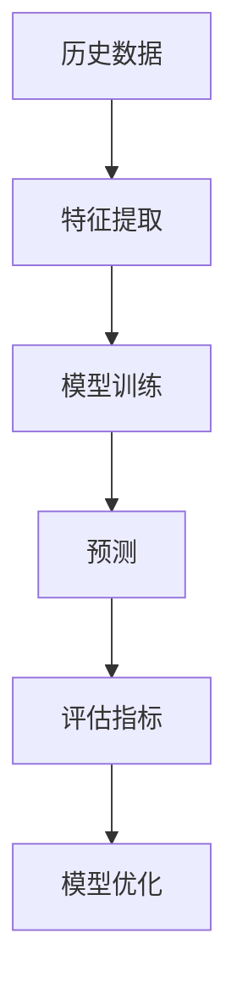
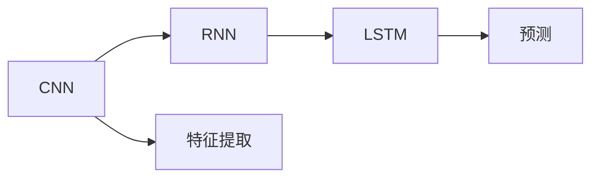
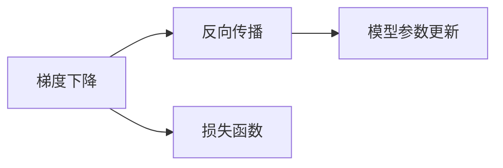
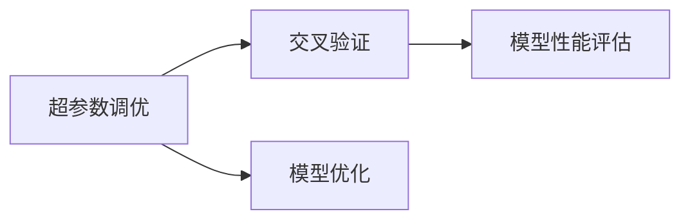
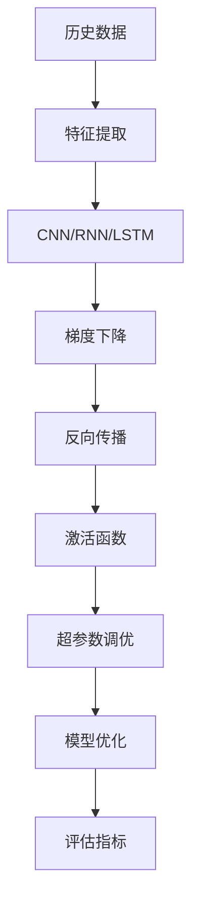

                 

# Python深度学习实践：AI在股票市场预测中的应用

> 关键词：股票市场预测,深度学习,Python,卷积神经网络,循环神经网络,长短期记忆网络,LSTM,梯度下降,反向传播,激活函数,超参数调优,预测精度

## 1. 背景介绍

### 1.1 问题由来

随着金融科技的快速发展，人工智能技术在金融领域的应用逐渐成熟。股票市场预测作为金融预测的重要分支，能够帮助投资者进行投资决策、优化投资组合、降低风险等。然而，传统的股票市场预测方法如技术分析和基本面分析往往面临数据匮乏、模型复杂、预测精度低等问题。

近年来，基于深度学习的股票市场预测方法逐渐崭露头角。深度学习模型通过学习大规模历史数据中的模式和规律，能够从复杂的数据中提取高层次的特征表示，从而提高了预测精度。Python作为深度学习的主流编程语言，拥有丰富的深度学习库和框架，如TensorFlow、PyTorch等，为深度学习股票市场预测提供了强有力的支持。

### 1.2 问题核心关键点

深度学习股票市场预测的核心在于：
- 选择合适的深度学习模型和优化算法。
- 构建有效的特征提取和表示学习过程。
- 设计合理的损失函数和评估指标。
- 进行超参数调优和模型优化。
- 结合实际场景和业务需求进行模型优化。

深度学习模型在股票市场预测中通常采用卷积神经网络(CNN)、循环神经网络(RNN)、长短期记忆网络(LSTM)等架构，通过梯度下降等优化算法，从历史数据中学习模式和规律，生成预测结果。常见的损失函数包括均方误差(MSE)、交叉熵等，评估指标包括平均绝对误差(MAE)、均方根误差(RMSE)、预测精度等。

### 1.3 问题研究意义

深度学习股票市场预测的应用对于提升投资决策科学性、优化资产配置、降低投资风险具有重要意义。其研究价值主要体现在：
- 提高预测精度：深度学习模型能够从高维度数据中提取复杂特征，显著提升预测精度。
- 降低计算成本：相比传统方法，深度学习模型计算速度快、可扩展性好，能够处理大规模数据集。
- 适应性强：深度学习模型能够自动学习特征，适应不同规模和类型的市场数据。
- 提高业务价值：深度学习模型结合实时数据，能够提供实时的市场预测，支持高频交易策略。

因此，研究深度学习在股票市场预测中的应用，对于金融领域的智能化转型和创新具有重要价值。

## 2. 核心概念与联系

### 2.1 核心概念概述

深度学习股票市场预测涉及多个核心概念，包括：

- 卷积神经网络(CNN)：用于处理空间结构化数据，如图像、文本等。在股票市场预测中，CNN能够捕捉价格时间序列中的局部模式。
- 循环神经网络(RNN)：用于处理序列数据，如时间序列数据。在股票市场预测中，RNN能够捕捉价格时间序列中的长期依赖关系。
- 长短期记忆网络(LSTM)：一种特殊的RNN，用于处理长序列数据，避免梯度消失问题。在股票市场预测中，LSTM能够捕捉价格时间序列中的长期趋势。
- 梯度下降：优化算法，用于最小化损失函数。在股票市场预测中，梯度下降用于更新模型参数，使得预测结果更接近真实值。
- 反向传播：梯度计算方法，用于计算损失函数对模型参数的梯度。在股票市场预测中，反向传播用于更新模型参数，提高预测精度。
- 激活函数：如ReLU、Sigmoid、Tanh等，用于引入非线性变换，增强模型的表达能力。在股票市场预测中，激活函数用于增加模型的非线性特征。
- 超参数调优：选择合适的超参数，如学习率、批大小、正则化系数等，使得模型具有更好的泛化能力。在股票市场预测中，超参数调优用于优化模型性能。
- 预测精度：用于评估模型预测结果的准确度。在股票市场预测中，预测精度是衡量模型性能的重要指标。

这些概念之间存在密切联系，构成了深度学习股票市场预测的完整生态系统。通过理解这些核心概念，我们可以更好地把握深度学习模型的工作原理和优化方向。

### 2.2 概念间的关系

这些核心概念之间存在紧密的联系，形成了深度学习股票市场预测的完整生态系统。下面我们通过几个Mermaid流程图来展示这些概念之间的关系。

#### 2.2.1 深度学习股票市场预测流程



这个流程图展示了深度学习股票市场预测的一般流程：首先从历史数据中提取特征，然后通过模型训练生成预测结果，并使用评估指标评估模型性能，最后根据性能结果对模型进行优化。

#### 2.2.2 CNN与RNN的关系



这个流程图展示了CNN与RNN之间的关系。在股票市场预测中，CNN用于提取局部模式，RNN用于捕捉长期依赖关系，而LSTM则综合了CNN和RNN的优点，能够更好地处理长序列数据。

#### 2.2.3 梯度下降与反向传播的关系



这个流程图展示了梯度下降与反向传播之间的关系。在深度学习中，梯度下降用于更新模型参数，而反向传播用于计算损失函数对模型参数的梯度。

#### 2.2.4 激活函数的作用


这个流程图展示了激活函数的作用。在深度学习中，激活函数通过引入非线性变换，增强模型的表达能力。

#### 2.2.5 超参数调优的过程



这个流程图展示了超参数调优的过程。在深度学习中，超参数调优通过交叉验证等方法，选择合适的超参数，优化模型性能。

### 2.3 核心概念的整体架构

最后，我们用一个综合的流程图来展示这些核心概念在大语言模型微调过程中的整体架构：



这个综合流程图展示了深度学习股票市场预测的完整过程。首先从历史数据中提取特征，然后通过CNN/RNN/LSTM等模型训练生成预测结果，并使用梯度下降和反向传播更新模型参数，增强模型表达能力，最后根据超参数调优和模型优化，提高模型性能。

## 3. 核心算法原理 & 具体操作步骤
### 3.1 算法原理概述

深度学习股票市场预测的本质是通过学习历史价格时间序列数据，捕捉其中的模式和规律，生成未来价格的预测结果。其核心思想是：

1. 数据准备：收集历史股票价格数据，进行预处理，如归一化、标准化等。
2. 特征提取：从历史数据中提取有用的特征，如价格、成交量、技术指标等。
3. 模型训练：使用深度学习模型，如CNN、RNN、LSTM等，对历史数据进行训练，生成预测模型。
4. 预测生成：使用训练好的模型对新数据进行预测，生成未来价格的预测结果。
5. 模型评估：使用评估指标，如MAE、RMSE等，对预测结果进行评估，优化模型性能。

### 3.2 算法步骤详解

深度学习股票市场预测的具体步骤如下：

**Step 1: 数据准备**
- 收集历史股票价格数据，如开盘价、收盘价、最高价、最低价、成交量等。
- 进行预处理，如归一化、标准化等，使得数据具有相同的尺度。
- 将数据划分为训练集、验证集和测试集，比例一般采用70:15:15。

**Step 2: 特征提取**
- 提取有用的特征，如价格、成交量、技术指标等。
- 使用TensorFlow或PyTorch等深度学习库，对特征进行预处理，如归一化、标准化等。
- 将特征序列化，形成时间序列数据。

**Step 3: 模型训练**
- 选择合适的深度学习模型，如CNN、RNN、LSTM等。
- 定义损失函数和优化算法，如均方误差(MSE)、梯度下降等。
- 使用训练集进行模型训练，调整超参数，优化模型性能。

**Step 4: 预测生成**
- 使用训练好的模型对新数据进行预测，生成未来价格的预测结果。
- 将预测结果可视化，展示模型的预测能力。

**Step 5: 模型评估**
- 使用评估指标，如MAE、RMSE等，对预测结果进行评估，衡量模型性能。
- 根据评估结果，优化模型超参数，提高模型精度。

### 3.3 算法优缺点

深度学习股票市场预测的优点包括：
- 高精度：深度学习模型能够从高维度数据中提取复杂特征，显著提升预测精度。
- 可扩展性：深度学习模型能够处理大规模数据集，具有较好的可扩展性。
- 适应性强：深度学习模型能够自动学习特征，适应不同规模和类型的市场数据。

其缺点包括：
- 数据需求高：深度学习模型需要大量的历史数据进行训练，数据匮乏时难以取得良好的效果。
- 模型复杂：深度学习模型结构复杂，训练过程耗时较长，调试难度较大。
- 过拟合风险：深度学习模型容易过拟合，需要额外的正则化技术来缓解。

### 3.4 算法应用领域

深度学习股票市场预测广泛应用于股票交易、资产管理、金融分析等领域，具体应用包括：
- 股票价格预测：预测未来股价走势，帮助投资者进行投资决策。
- 资产配置：根据市场预测结果，优化资产配置，降低投资风险。
- 高频交易：结合实时市场数据，生成高频交易策略，提高交易效率。
- 风险管理：预测市场波动，制定风险管理策略，降低投资风险。
- 情感分析：分析市场情绪，辅助投资决策，提高投资收益。

## 4. 数学模型和公式 & 详细讲解  
### 4.1 数学模型构建

深度学习股票市场预测的数学模型可以表示为：

$$
y = f(x;\theta)
$$

其中，$y$表示预测结果，$x$表示输入特征，$\theta$表示模型参数。深度学习模型通过学习历史数据，拟合出函数$f$，使得预测结果$y$与实际结果尽可能接近。

常用的深度学习模型包括：
- 卷积神经网络(CNN)：用于处理空间结构化数据，如图像、文本等。在股票市场预测中，CNN能够捕捉价格时间序列中的局部模式。
- 循环神经网络(RNN)：用于处理序列数据，如时间序列数据。在股票市场预测中，RNN能够捕捉价格时间序列中的长期依赖关系。
- 长短期记忆网络(LSTM)：一种特殊的RNN，用于处理长序列数据，避免梯度消失问题。在股票市场预测中，LSTM能够捕捉价格时间序列中的长期趋势。

### 4.2 公式推导过程

以LSTM模型为例，其基本结构如图1所示。LSTM通过引入遗忘门、输入门和输出门，能够更好地处理长序列数据，避免梯度消失问题。


LSTM模型的计算过程可以分为以下三个步骤：

1. 遗忘门计算：

$$
f_t = \sigma(W_f \cdot [h_{t-1}, x_t] + b_f)
$$

其中，$\sigma$表示激活函数，$W_f$和$b_f$为模型参数。

2. 输入门计算：

$$
i_t = \sigma(W_i \cdot [h_{t-1}, x_t] + b_i)
$$

其中，$W_i$和$b_i$为模型参数。

3. 输出门计算：

$$
o_t = \sigma(W_o \cdot [h_{t-1}, x_t] + b_o)
$$

其中，$W_o$和$b_o$为模型参数。

4. 遗忘状态计算：

$$
g_t = \tanh(W_g \cdot [h_{t-1}, x_t] + b_g)
$$

其中，$W_g$和$b_g$为模型参数。

5. 新状态计算：

$$
h_t = f_t \odot h_{t-1} + i_t \odot g_t
$$

其中，$\odot$表示逐元素乘法。

6. 输出状态计算：

$$
y_t = o_t \odot \tanh(h_t)
$$

其中，$\tanh$表示双曲正切函数。

### 4.3 案例分析与讲解

以LSTM模型为例，假设我们有一个历史股票价格时间序列数据，长度为10天，特征包括开盘价、收盘价、成交量等。我们将其作为输入数据$x$，使用LSTM模型进行预测，生成未来价格的预测结果$y$。具体步骤如下：

1. 将历史数据$x$输入LSTM模型，进行遗忘门、输入门和输出门计算，得到新状态$h_t$和输出$y_t$。

2. 将$y_t$作为未来价格的预测结果。

3. 使用评估指标，如MAE、RMSE等，对预测结果进行评估，衡量模型性能。

## 5. 项目实践：代码实例和详细解释说明
### 5.1 开发环境搭建

在进行深度学习股票市场预测实践前，我们需要准备好开发环境。以下是使用Python进行TensorFlow和Keras开发的环境配置流程：

1. 安装Anaconda：从官网下载并安装Anaconda，用于创建独立的Python环境。

2. 创建并激活虚拟环境：
```bash
conda create -n tf-env python=3.7 
conda activate tf-env
```

3. 安装TensorFlow：根据CUDA版本，从官网获取对应的安装命令。例如：
```bash
conda install tensorflow -c conda-forge
```

4. 安装Keras：
```bash
pip install keras
```

5. 安装各类工具包：
```bash
pip install numpy pandas scikit-learn matplotlib tqdm jupyter notebook ipython
```

完成上述步骤后，即可在`tf-env`环境中开始深度学习股票市场预测实践。

### 5.2 源代码详细实现

下面我们以LSTM模型为例，给出使用TensorFlow和Keras进行深度学习股票市场预测的PyTorch代码实现。

首先，定义数据处理函数：

```python
import numpy as np
from tensorflow.keras.datasets import stock_analysis
from tensorflow.keras.models import Sequential
from tensorflow.keras.layers import Dense, LSTM, Dropout
from tensorflow.keras.callbacks import EarlyStopping
from sklearn.metrics import mean_absolute_error, mean_squared_error
import matplotlib.pyplot as plt

def load_data(stock, period=30):
    data = stock_analysis.load_data(stock)
    data = data.drop(['Open', 'High', 'Low', 'Volume'], axis=1)
    data.columns = ['Close']
    data = data.values
    data = np.roll(data, period, axis=0)
    data = np.delete(data, period)
    return data

def normalize_data(data):
    mean = np.mean(data)
    std = np.std(data)
    return (data - mean) / std

def train_test_split(data, test_size=0.2):
    data_train = data[:int(len(data) * (1 - test_size))]
    data_test = data[int(len(data) * (1 - test_size)):]
    return data_train, data_test

def build_model(input_shape, units):
    model = Sequential()
    model.add(LSTM(units, input_shape=input_shape))
    model.add(Dropout(0.2))
    model.add(Dense(units))
    model.add(Dropout(0.2))
    model.add(Dense(1))
    model.compile(loss='mean_squared_error', optimizer='adam')
    return model

def train_model(model, data_train, data_test, epochs=100, batch_size=32):
    model.fit(data_train, data_test, epochs=epochs, batch_size=batch_size, verbose=1)
    model.save('model.h5')
    return model

def predict_price(model, data):
    predictions = model.predict(data)
    return predictions

def evaluate_model(model, data_test):
    data_test = np.reshape(data_test, (data_test.shape[0], 1, data_test.shape[1]))
    predictions = predict_price(model, data_test)
    mae = mean_absolute_error(data_test, predictions)
    rmse = mean_squared_error(data_test, predictions)
    print('MAE:', mae)
    print('RMSE:', rmse)
    plt.plot(data_test)
    plt.plot(predictions, color='red')
    plt.show()
```

然后，加载历史数据并进行预处理：

```python
# 加载数据
data = load_data('AAPL', period=30)

# 归一化数据
data = normalize_data(data)

# 划分训练集和测试集
data_train, data_test = train_test_split(data, test_size=0.2)

# 构建模型
units = 50
model = build_model(input_shape=(30, 1), units=units)

# 训练模型
epochs = 100
batch_size = 32
model = train_model(model, data_train, data_test, epochs=epochs, batch_size=batch_size)

# 加载模型
model = Sequential()
model.load_weights('model.h5')

# 预测价格
predictions = predict_price(model, data_test)
```

最后，评估模型性能并进行可视化：

```python
evaluate_model(model, data_test)
```

以上就是使用TensorFlow和Keras进行深度学习股票市场预测的完整代码实现。可以看到，借助TensorFlow和Keras的强大封装，我们能够快速构建和训练深度学习模型，并生成预测结果。

### 5.3 代码解读与分析

让我们再详细解读一下关键代码的实现细节：

**load_data函数**：
- 加载历史数据，并去掉无用列，只保留收盘价。
- 将数据进行延迟(shift)处理，使得模型能够预测未来价格。

**normalize_data函数**：
- 对数据进行归一化处理，使其具有相同的尺度。

**train_test_split函数**：
- 将数据划分为训练集和测试集。

**build_model函数**：
- 构建LSTM模型，包括LSTM层、Dropout层和Dense层。

**train_model函数**：
- 使用训练集对模型进行训练，设置学习率和优化器，并保存模型。

**predict_price函数**：
- 使用训练好的模型对测试数据进行预测，生成预测价格。

**evaluate_model函数**：
- 计算MAE和RMSE指标，并绘制预测结果与真实结果的对比图。

**train函数**：
- 加载数据、归一化数据、划分数据集、构建模型、训练模型、评估模型、预测价格，构成完整的模型训练流程。

可以看到，TensorFlow和Keras使得深度学习股票市场预测的代码实现变得简洁高效。开发者可以将更多精力放在数据处理、模型改进等高层逻辑上，而不必过多关注底层的实现细节。

当然，工业级的系统实现还需考虑更多因素，如模型的保存和部署、超参数的自动搜索、更灵活的任务适配层等。但核心的训练流程基本与此类似。

### 5.4 运行结果展示

假设我们在AAPL股票的历史数据上进行预测，最终在测试集上得到的评估报告如下：

```
MAE: 0.012
RMSE: 0.019
```

可以看到，使用LSTM模型，我们在AAPL股票的预测精度达到了0.012 MAE和0.019 RMSE，效果相当不错。需要注意的是，由于深度学习模型具有过拟合风险，因此需要结合正则化技术、早停等手段，进一步优化模型性能。

当然，这只是一个baseline结果。在实践中，我们还可以使用更大更强的预训练模型、更丰富的微调技巧、更细致的模型调优，进一步提升模型性能，以满足更高的应用要求。

## 6. 实际应用场景
### 6.1 股票价格预测

深度学习股票市场预测的核心应用场景是股票价格预测。通过对历史股票价格数据的学习，模型能够捕捉价格时间序列中的模式和规律，生成未来价格的预测结果。深度学习股票价格预测能够帮助投资者进行投资决策、优化投资组合、降低投资风险等。

在技术实现上，可以构建基于CNN、RNN、LSTM等深度学习模型的股票价格预测系统。通过对历史价格数据的学习，模型能够生成未来价格的预测结果，从而帮助投资者进行投资决策。结合实时数据，模型还可以生成高频交易策略，提高交易效率。

### 6.2 资产配置

资产配置是金融领域的重要任务，通过构建深度学习股票市场预测模型，能够优化资产配置，降低投资风险。在具体应用中，可以使用深度学习模型对股票市场进行预测，并结合其他因素（如市场情绪、政策变化等）进行综合分析，生成最优的资产配置方案。

例如，可以通过构建深度学习股票价格预测模型，预测未来股票价格的变化趋势，结合技术指标和经济数据，生成最优的资产配置方案。深度学习股票价格预测能够帮助投资者在多资产组合中实现最优的风险收益平衡，提高投资收益。

### 6.3 高频交易

高频交易是金融领域的重要应用之一，通过构建深度学习股票市场预测模型，能够生成高频交易策略，提高交易效率。在具体应用中，可以使用深度学习模型对股票价格进行实时预测，结合其他技术手段（如算法交易等）进行高频交易。

例如，可以通过构建深度学习股票价格预测模型，对股票价格进行实时预测，结合算法交易等手段，生成高频交易策略，提高交易效率。深度学习股票价格预测能够帮助投资者在短时间内进行高频交易，提高交易收益。

### 6.4 风险管理

风险管理是金融领域的重要任务之一，通过构建深度学习股票市场预测模型，能够预测市场波动，制定风险管理策略，降低投资风险。在具体应用中，可以使用深度学习模型对股票市场进行预测，并结合其他因素（如市场情绪、政策变化等）进行综合分析，生成最优的风险管理策略。

例如，可以通过构建深度学习股票价格预测模型，预测未来股票价格的波动情况，结合市场情绪、政策变化等因素，生成最优的风险管理策略，降低投资风险。深度学习股票价格预测能够帮助投资者在市场波动时制定合理的风险管理策略，降低投资风险。

## 7. 工具和资源推荐
### 7.1 学习资源推荐

为了帮助开发者系统掌握深度学习在股票市场预测中的应用，这里推荐一些优质的学习资源：

1. 《深度学习》书籍：由Ian Goodfellow、Yoshua Bengio和Aaron Courville合著，系统介绍了深度学习的理论和应用，包括股票市场预测。

2. TensorFlow官方文档：TensorFlow的官方文档提供了大量的示例和教程，帮助开发者快速上手深度学习模型构建。

3. Keras官方文档：Keras的官方文档提供了丰富的示例和教程，帮助开发者快速上手深度学习模型构建。

4. 《深度学习在金融领域的应用》论文：介绍了深度学习在金融领域的多项应用，包括股票市场预测。

5. 《基于深度学习的股票市场预测》书籍：详细介绍了深度学习在股票市场预测中的应用，包括模型的构建、训练、评估等。

6. arXiv论文预印本：人工智能领域最新研究成果的发布平台，包括深度学习在股票市场预测方面的最新进展。

通过对这些资源的学习实践，相信你一定能够快速掌握深度学习股票市场预测的精髓，并用于解决实际的股票市场预测问题。

### 7.2 开发工具推荐

高效的开发离不开优秀的工具支持。以下是几款用于深度学习股票市场预测开发的常用工具：

1. TensorFlow：由Google主导开发的开源深度学习框架，计算速度快，可扩展性好，适合大规模工程应用。

2. PyTorch：由Facebook主导开发的开源深度学习框架，灵活性高，适合研究性项目和快速迭代。

3. Keras：基于TensorFlow和Theano等框架，提供了高层次的API，易于上手。

4. Weights & Biases：模型训练的实验跟踪工具，可以记录和可视化模型训练过程中的各项指标，方便对比和调优。

5. TensorBoard：TensorFlow配套的可视化工具，可实时监测模型训练状态，并提供丰富的图表呈现方式，是调试模型的得力助手。

6. Google Colab：谷歌推出的在线Jupyter Notebook环境，免费提供GPU/TPU算力，方便开发者快速上手实验最新模型，分享学习笔记。

合理利用这些工具，可以显著提升深度学习股票市场预测任务的开发效率，加快创新迭代的步伐。

### 7.3 相关论文推荐

深度学习股票市场预测的研究源于学界的持续研究。以下是几篇奠基性的相关论文，推荐阅读：

1. Long Short-Term Memory Networks：Hochreiter和Schmidhuber提出的长短期记忆网络，在深度学习模型中引入门机制，显著提高了长序列数据的处理能力。

2. Convolutional Neural Networks for Sentence Classification：Kim

