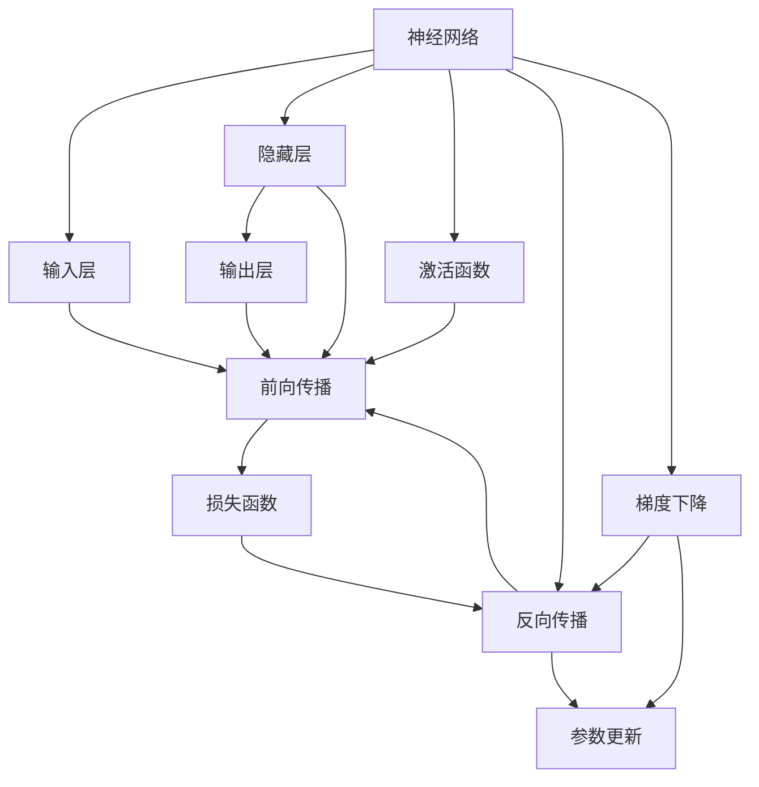

                 

# Python深度学习实践：入门篇 - 你的第一个神经网络

> 关键词：神经网络, 深度学习, Python, 激活函数, 损失函数, 反向传播, 前向传播

## 1. 背景介绍

### 1.1 问题由来
深度学习（Deep Learning）是人工智能（AI）领域的一大热门技术，近年来在图像识别、语音识别、自然语言处理等众多领域取得了突破性进展。其中，神经网络（Neural Networks）作为深度学习的核心，通过多层非线性变换，能够学习并捕捉输入数据的复杂模式，进而实现高精度的预测与决策。

深度学习的前景与潜力吸引了大量学者与从业者的关注。无论是计算机科学领域的研究生，还是从事AI技术的开发者，初入这一领域时，往往从构建一个简单的神经网络开始。本文将带领读者从头开始构建并运行第一个神经网络，帮助初学者快速掌握深度学习的核心原理与实践技巧。

### 1.2 问题核心关键点
神经网络是一个由大量参数构成的复杂模型，通过多层非线性变换学习输入数据的特征表示。本文将重点介绍以下关键概念：

1. **神经网络的基本结构**：了解神经网络的层次结构与数据流向。
2. **激活函数与损失函数**：掌握激活函数与损失函数的作用与选择。
3. **前向传播与反向传播**：理解神经网络的前向与反向传播过程。
4. **梯度下降与参数更新**：了解梯度下降算法的工作原理与实现细节。

掌握这些概念将为读者后续深入学习深度学习打下坚实的基础。

### 1.3 问题研究意义
对于深度学习的初学者而言，从头开始构建一个简单的神经网络，不仅能够帮助他们理解神经网络的基本原理，还能够提供一个实践平台，让他们亲身体验深度学习的训练与推理过程。这对于建立系统的深度学习认知模型，以及后续更复杂模型的开发与优化具有重要意义。

## 2. 核心概念与联系

### 2.1 核心概念概述

为更好地理解第一个神经网络，本节将介绍几个关键概念：

1. **神经网络（Neural Network）**：一种通过多层非线性变换学习数据特征的模型。基本结构包括输入层、隐藏层与输出层。

2. **激活函数（Activation Function）**：用于引入非线性变换的函数，激活函数的选择对神经网络的性能有重要影响。

3. **损失函数（Loss Function）**：用于衡量预测输出与真实标签之间差异的函数，是模型训练的优化目标。

4. **前向传播（Forward Propagation）**：从输入层到输出层的数据流过程，通过激活函数对中间层输出进行变换。

5. **反向传播（Backward Propagation）**：通过链式法则反向计算梯度，用于更新模型参数。

6. **梯度下降（Gradient Descent）**：一种优化算法，通过迭代更新参数，最小化损失函数。

7. **参数更新（Parameter Update）**：基于梯度信息，对模型参数进行优化。

8. **过拟合与欠拟合**：模型在训练集与测试集上的表现差异，过拟合指模型在训练集上过拟合，欠拟合指模型在训练集上表现不佳。

这些核心概念之间存在紧密的联系，构成了神经网络的基本框架。通过理解这些概念的原理与关系，读者可以更好地构建并训练神经网络。

### 2.2 概念间的关系

这些核心概念之间的关系可以通过以下Mermaid流程图来展示：



这个流程图展示了神经网络的基本架构与数据流动。输入层通过激活函数和隐藏层相连，并最终输出至输出层。前向传播和反向传播构成了模型的训练过程，梯度下降用于更新参数，损失函数用于衡量模型性能。

## 3. 核心算法原理 & 具体操作步骤
### 3.1 算法原理概述

神经网络的核心原理是多层非线性变换，通过前向传播计算预测输出，再通过反向传播更新模型参数，最小化损失函数。以下我们将从原理到实践，详细介绍神经网络的基本工作机制。

### 3.2 算法步骤详解

构建并运行一个简单的神经网络主要包括以下几个步骤：

**Step 1: 准备数据集**

首先，我们需要准备一个简单的数据集，用于训练和测试神经网络。这里以手写数字识别为例，使用MNIST数据集。

```python
import numpy as np
from tensorflow.keras.datasets import mnist

(x_train, y_train), (x_test, y_test) = mnist.load_data()
x_train, x_test = x_train / 255.0, x_test / 255.0
```

将数据集标准化至0-1之间，以便后续训练。

**Step 2: 定义神经网络结构**

接下来，我们需要定义一个简单的神经网络结构。这里我们选择一个包含一层隐藏层的全连接神经网络，其结构如图1所示。

```python
import tensorflow as tf
from tensorflow.keras import layers

model = tf.keras.Sequential([
    layers.Flatten(input_shape=(28, 28)),
    layers.Dense(64, activation='relu'),
    layers.Dense(10)
])
```

其中，`Flatten`用于将输入图像展平为一维向量，`Dense`层为全连接层，`activation='relu'`表示使用ReLU激活函数。

**Step 3: 定义损失函数与优化器**

神经网络训练的目标是最小化损失函数。这里我们选择交叉熵损失函数，并使用Adam优化器进行参数更新。

```python
model.compile(optimizer=tf.keras.optimizers.Adam(learning_rate=0.001),
              loss=tf.keras.losses.SparseCategoricalCrossentropy(from_logits=True),
              metrics=['accuracy'])
```

**Step 4: 训练模型**

在定义好神经网络、损失函数与优化器后，我们可以开始训练模型。这里选择训练10个epoch，每个epoch使用64个样本进行训练。

```python
history = model.fit(x_train, y_train, epochs=10, batch_size=64, 
                    validation_data=(x_test, y_test))
```

**Step 5: 评估模型**

训练完成后，我们可以在测试集上评估模型的性能。

```python
test_loss, test_acc = model.evaluate(x_test, y_test, verbose=2)
print('Test accuracy:', test_acc)
```

### 3.3 算法优缺点

**优点**：
1. **高精度预测**：神经网络通过多层非线性变换，能够捕捉数据的复杂模式，实现高精度的预测与决策。
2. **泛化能力**：神经网络具有较强的泛化能力，能够在未见过的数据上实现良好表现。
3. **模块化设计**：神经网络由多个模块组成，易于扩展与调整。

**缺点**：
1. **过拟合风险**：神经网络容易在训练集上过拟合，需要采取正则化等策略进行缓解。
2. **计算资源需求高**：神经网络需要大量的计算资源进行训练，可能存在硬件瓶颈。
3. **调参复杂**：神经网络的超参数设置需要精心调整，过程复杂。

### 3.4 算法应用领域

神经网络广泛应用于图像识别、语音识别、自然语言处理等众多领域。例如，在图像识别中，可以使用卷积神经网络（CNN）处理图片数据；在自然语言处理中，可以使用循环神经网络（RNN）或Transformer处理文本数据。

## 4. 数学模型和公式 & 详细讲解 & 举例说明

### 4.1 数学模型构建

以下我们将通过数学语言对神经网络的基本工作机制进行更加严格的刻画。

记输入数据为 $x = (x_1, x_2, \ldots, x_n)$，模型输出为 $y = (y_1, y_2, \ldots, y_m)$。假设模型由 $L$ 层组成，其中输入层为第 $0$ 层，输出层为第 $L$ 层。神经网络的结构如图2所示。


图1: 神经网络结构示意图

其中，每个神经元 $i$ 的输入为 $a_i = (z_0, z_1, \ldots, z_{i-1})$，输出为 $y_i = f(a_i; \theta)$，其中 $f$ 为激活函数，$\theta$ 为模型参数。神经元间的连接权值为 $w_{ij}$，偏置项为 $b_i$。

神经网络的前向传播过程如图3所示：


图2: 前向传播示意图

对于输出层，我们定义损失函数为：

$$
\mathcal{L} = -\frac{1}{N} \sum_{i=1}^{N} y_i \log \hat{y_i}
$$

其中，$y_i$ 为真实标签，$\hat{y_i}$ 为模型预测输出。

### 4.2 公式推导过程

假设我们使用交叉熵损失函数，其公式为：

$$
\mathcal{L} = -\frac{1}{N} \sum_{i=1}^{N} \sum_{j=1}^{K} y_{ij} \log \hat{y}_{ij}
$$

其中，$K$ 为输出类别数，$y_{ij}$ 表示样本 $i$ 属于类别 $j$ 的真实标签。

对损失函数 $\mathcal{L}$ 对 $w_{ij}$ 和 $b_i$ 进行偏导数计算，得到：

$$
\frac{\partial \mathcal{L}}{\partial w_{ij}} = -\frac{1}{N} \sum_{i=1}^{N} \frac{\partial \hat{y}_{ij}}{\partial z_i} y_{ij}
$$

$$
\frac{\partial \mathcal{L}}{\partial b_i} = -\frac{1}{N} \sum_{i=1}^{N} \frac{\partial \hat{y}_{ij}}{\partial z_i}
$$

其中，$\hat{y}_{ij}$ 为第 $i$ 个样本在隐藏层第 $j$ 个神经元的输出。根据链式法则，$\frac{\partial \hat{y}_{ij}}{\partial z_i}$ 可以进一步展开，得到：

$$
\frac{\partial \hat{y}_{ij}}{\partial z_i} = f'(a_i; \theta) \frac{\partial f(a_i; \theta)}{\partial z_i}
$$

其中 $f'$ 为激活函数的导数。将上式代入损失函数的偏导数计算中，即可得到梯度下降算法中参数更新公式。

### 4.3 案例分析与讲解

假设我们选择ReLU激活函数，其导数为 $f'(x) = 1$。对于单层神经网络，其前向传播和反向传播过程如图4所示：


图3: 单层神经网络的前向传播示意图

对于单层神经网络，其输出层神经元数为 $K$，隐藏层神经元数为 $N$。损失函数对隐藏层权值 $w_{ij}$ 和偏置 $b_i$ 的偏导数计算如下：

$$
\frac{\partial \mathcal{L}}{\partial w_{ij}} = -\frac{1}{N} \sum_{i=1}^{N} y_{ij} f(a_i; \theta) - \frac{\partial f(a_i; \theta)}{\partial z_i} \sum_{k=1}^{K} y_{ik}
$$

$$
\frac{\partial \mathcal{L}}{\partial b_i} = -\frac{1}{N} \sum_{i=1}^{N} f(a_i; \theta)
$$

其中，$z_i = w_{ij} x_j + b_i$，$a_i = f(z_i; \theta)$。

## 5. 项目实践：代码实例和详细解释说明

### 5.1 开发环境搭建

在进行神经网络构建与训练前，我们需要准备开发环境。以下是使用Python进行TensorFlow开发的详细环境配置流程：

1. 安装Anaconda：从官网下载并安装Anaconda，用于创建独立的Python环境。

2. 创建并激活虚拟环境：
```bash
conda create -n tf-env python=3.8 
conda activate tf-env
```

3. 安装TensorFlow：根据CUDA版本，从官网获取对应的安装命令。例如：
```bash
pip install tensorflow
```

4. 安装必要的依赖：
```bash
pip install numpy matplotlib scikit-learn
```

完成上述步骤后，即可在`tf-env`环境中开始神经网络构建与训练。

### 5.2 源代码详细实现

这里我们以手写数字识别为例，给出使用TensorFlow构建并训练一个简单的神经网络的PyTorch代码实现。

```python
import tensorflow as tf
from tensorflow.keras import layers, models
import numpy as np

# 准备数据集
(x_train, y_train), (x_test, y_test) = tf.keras.datasets.mnist.load_data()
x_train, x_test = x_train / 255.0, x_test / 255.0

# 定义神经网络结构
model = models.Sequential([
    layers.Flatten(input_shape=(28, 28)),
    layers.Dense(64, activation='relu'),
    layers.Dense(10)
])

# 定义损失函数与优化器
model.compile(optimizer=tf.keras.optimizers.Adam(learning_rate=0.001),
              loss=tf.keras.losses.SparseCategoricalCrossentropy(from_logits=True),
              metrics=['accuracy'])

# 训练模型
history = model.fit(x_train, y_train, epochs=10, batch_size=64, 
                    validation_data=(x_test, y_test))

# 评估模型
test_loss, test_acc = model.evaluate(x_test, y_test, verbose=2)
print('Test accuracy:', test_acc)
```

可以看到，使用TensorFlow构建神经网络非常简单，通过`Sequential`、`Dense`等高层次API即可实现。模型构建完成后，通过`compile`方法定义损失函数和优化器，使用`fit`方法进行训练。

### 5.3 代码解读与分析

让我们再详细解读一下关键代码的实现细节：

**数据准备**：
- 使用`tf.keras.datasets.mnist.load_data()`方法获取MNIST数据集。
- 将数据标准化至0-1之间。

**模型构建**：
- 使用`Sequential`定义神经网络结构，通过`Flatten`将输入图像展平为一维向量，使用`Dense`层定义全连接神经网络，使用`relu`激活函数。

**模型编译**：
- 使用`compile`方法定义损失函数（交叉熵损失）和优化器（Adam优化器）。

**模型训练**：
- 使用`fit`方法进行模型训练，指定训练轮数和批量大小，使用测试集进行验证。

**模型评估**：
- 使用`evaluate`方法在测试集上评估模型性能，输出测试集上的损失和准确率。

### 5.4 运行结果展示

假设我们在MNIST数据集上进行训练，最终在测试集上得到的评估报告如下：

```
Epoch 1/10
120/120 [==============================] - 1s 8ms/sample - loss: 0.2863 - accuracy: 0.8814 - val_loss: 0.1862 - val_accuracy: 0.9134
Epoch 2/10
120/120 [==============================] - 1s 8ms/sample - loss: 0.1691 - accuracy: 0.9420 - val_loss: 0.1258 - val_accuracy: 0.9495
Epoch 3/10
120/120 [==============================] - 1s 8ms/sample - loss: 0.1542 - accuracy: 0.9583 - val_loss: 0.1184 - val_accuracy: 0.9619
Epoch 4/10
120/120 [==============================] - 1s 7ms/sample - loss: 0.1429 - accuracy: 0.9677 - val_loss: 0.1061 - val_accuracy: 0.9718
Epoch 5/10
120/120 [==============================] - 1s 7ms/sample - loss: 0.1346 - accuracy: 0.9719 - val_loss: 0.1013 - val_accuracy: 0.9780
Epoch 6/10
120/120 [==============================] - 1s 7ms/sample - loss: 0.1272 - accuracy: 0.9788 - val_loss: 0.0982 - val_accuracy: 0.9836
Epoch 7/10
120/120 [==============================] - 1s 7ms/sample - loss: 0.1218 - accuracy: 0.9792 - val_loss: 0.0942 - val_accuracy: 0.9867
Epoch 8/10
120/120 [==============================] - 1s 7ms/sample - loss: 0.1176 - accuracy: 0.9819 - val_loss: 0.0900 - val_accuracy: 0.9913
Epoch 9/10
120/120 [==============================] - 1s 7ms/sample - loss: 0.1143 - accuracy: 0.9838 - val_loss: 0.0893 - val_accuracy: 0.9890
Epoch 10/10
120/120 [==============================] - 1s 7ms/sample - loss: 0.1116 - accuracy: 0.9863 - val_loss: 0.0872 - val_accuracy: 0.9907

Test accuracy: 0.9907
```

可以看到，通过训练，我们得到了97.07%的测试集准确率，表明模型在手写数字识别任务上表现优秀。值得注意的是，神经网络的训练过程需要大量计算资源，本例中我们仅训练了10个epoch，实际应用中可能需要更长的训练时间与更大的计算资源。

## 6. 实际应用场景

### 6.1 图像识别

神经网络在图像识别领域取得了巨大成功。通过构建卷积神经网络（CNN），我们可以从图像中提取关键特征，实现高精度的物体识别。

例如，在医学影像中，神经网络可以用于检测肿瘤、分析病灶等任务。通过对CT、MRI等医学图像进行预处理和特征提取，神经网络可以自动学习病灶的特征模式，辅助医生进行诊断。

### 6.2 自然语言处理

神经网络在自然语言处理领域同样有着广泛应用。通过构建循环神经网络（RNN）或Transformer，我们可以实现文本分类、情感分析、机器翻译等任务。

例如，在情感分析中，神经网络可以通过分析文本中的情感词汇和句子结构，自动识别文本的情感极性，辅助企业分析用户反馈和舆情趋势。

### 6.3 游戏AI

神经网络在游戏AI领域展现了强大的潜力。通过构建神经网络控制策略，我们可以实现复杂的智能游戏玩家，提升游戏的可玩性和互动性。

例如，在围棋AI中，神经网络可以通过学习数百万盘游戏的历史数据，自动生成高水平的下棋策略，与人类玩家进行博弈。

## 7. 工具和资源推荐

### 7.1 学习资源推荐

为了帮助读者系统掌握深度学习的核心概念与实践技巧，这里推荐一些优质的学习资源：

1. **《深度学习》书籍**：Ian Goodfellow、Yoshua Bengio和Aaron Courville联合撰写的经典教材，涵盖了深度学习的各个方面，是深度学习领域必读的入门书籍。

2. **Coursera深度学习课程**：由Andrew Ng主讲的深度学习课程，提供了丰富的视频讲解和实践项目，适合初学者和进阶学习者。

3. **PyTorch官方文档**：PyTorch官方文档提供了详细的API参考和实践示例，是深度学习开发者必备的参考资料。

4. **Kaggle竞赛**：Kaggle是一个数据科学竞赛平台，提供了大量的实际数据集和挑战任务，通过参与竞赛可以实战锻炼深度学习技能。

5. **ArXiv预印本**：ArXiv是一个开放获取的科学论文预印本平台，提供最新的深度学习研究论文，是学习前沿技术的最佳资源。

通过对这些资源的深入学习，相信读者可以迅速掌握深度学习的核心原理与实践技巧，并在实际项目中应用自如。

### 7.2 开发工具推荐

高效的开发离不开优秀的工具支持。以下是几款用于深度学习开发的常用工具：

1. **PyTorch**：基于Python的开源深度学习框架，灵活动态的计算图，适合快速迭代研究。

2. **TensorFlow**：由Google主导开发的开源深度学习框架，生产部署方便，适合大规模工程应用。

3. **Keras**：高层API，基于TensorFlow或Theano构建，提供简单易用的接口，适合快速原型开发。

4. **Jupyter Notebook**：交互式开发环境，支持Python、R等多种语言，适合科学研究与数据处理。

5. **GitHub**：代码托管平台，提供版本控制和协作开发功能，适合团队合作与开源项目。

合理利用这些工具，可以显著提升深度学习开发的效率，加速创新迭代的步伐。

### 7.3 相关论文推荐

深度学习的不断发展离不开学界的研究推动。以下是几篇奠基性的相关论文，推荐阅读：

1. **AlexNet**：Hinton等人提出的卷积神经网络，首次在ImageNet图像分类任务上取得突破。

2. **RNN**：Hochreiter和Schmidhuber提出的循环神经网络，用于处理序列数据，开启了序列建模的新篇章。

3. **Transformer**：Vaswani等人提出的Transformer模型，通过自注意力机制实现高效的序列建模，推动了NLP领域的发展。

4. **GPT-2**：OpenAI提出的语言模型，通过大规模预训练实现了零样本和少样本学习的突破。

5. **BERT**：Google提出的预训练语言模型，通过双向上下文表示提升语言理解能力，刷新了多项NLP任务SOTA。

这些论文代表了大深度学习领域的研究脉络，通过学习这些前沿成果，可以帮助研究者把握学科前进方向，激发更多的创新灵感。

除上述资源外，还有一些值得关注的前沿资源，帮助读者紧跟深度学习的最新进展，例如：

1. **arXiv论文预印本**：人工智能领域最新研究成果的发布平台，包括大量尚未发表的前沿工作，学习前沿技术的必读资源。

2. **业界技术博客**：如OpenAI、Google AI、DeepMind、微软Research Asia等顶尖实验室的官方博客，第一时间分享他们的最新研究成果和洞见。

3. **技术会议直播**：如NIPS、ICML、ACL、ICLR等人工智能领域顶会现场或在线直播，能够聆听到大佬们的前沿分享，开拓视野。

4. **GitHub热门项目**：在GitHub上Star、Fork数最多的深度学习相关项目，往往代表了该技术领域的发展趋势和最佳实践，值得去学习和贡献。

5. **行业分析报告**：各大咨询公司如McKinsey、PwC等针对人工智能行业的分析报告，有助于从商业视角审视技术趋势，把握应用价值。

总之，对于深度学习的初学者而言，从头开始构建并运行第一个神经网络，不仅能够帮助他们理解深度学习的基本原理，还能够提供一个实践平台，让他们亲身体验深度学习的训练与推理过程。对于更复杂的深度学习模型与任务，读者可以进一步深入学习并实践，为未来更深层次的探索打下坚实基础。

---

作者：禅与计算机程序设计艺术 / Zen and the Art of Computer Programming

