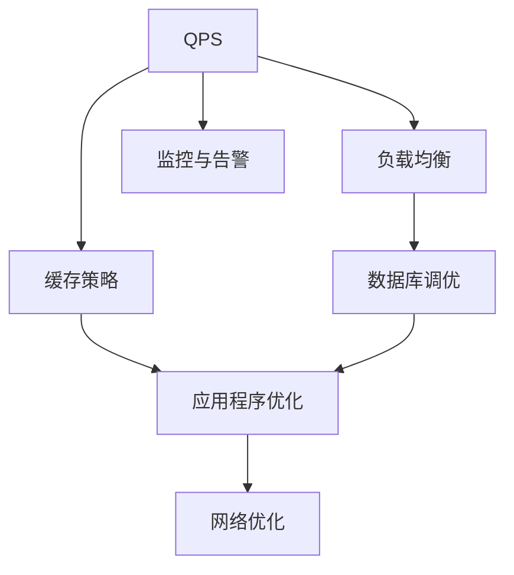
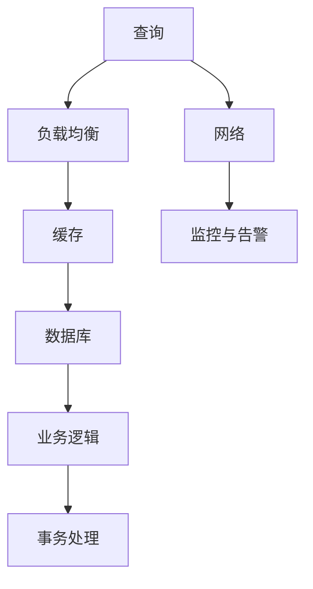
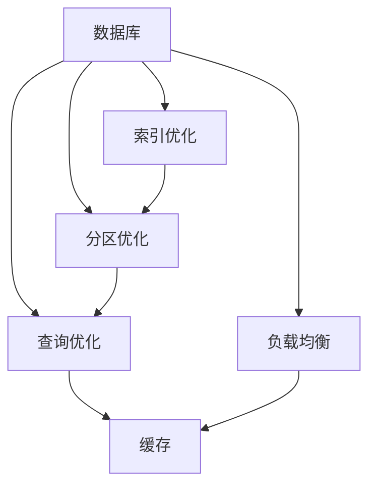
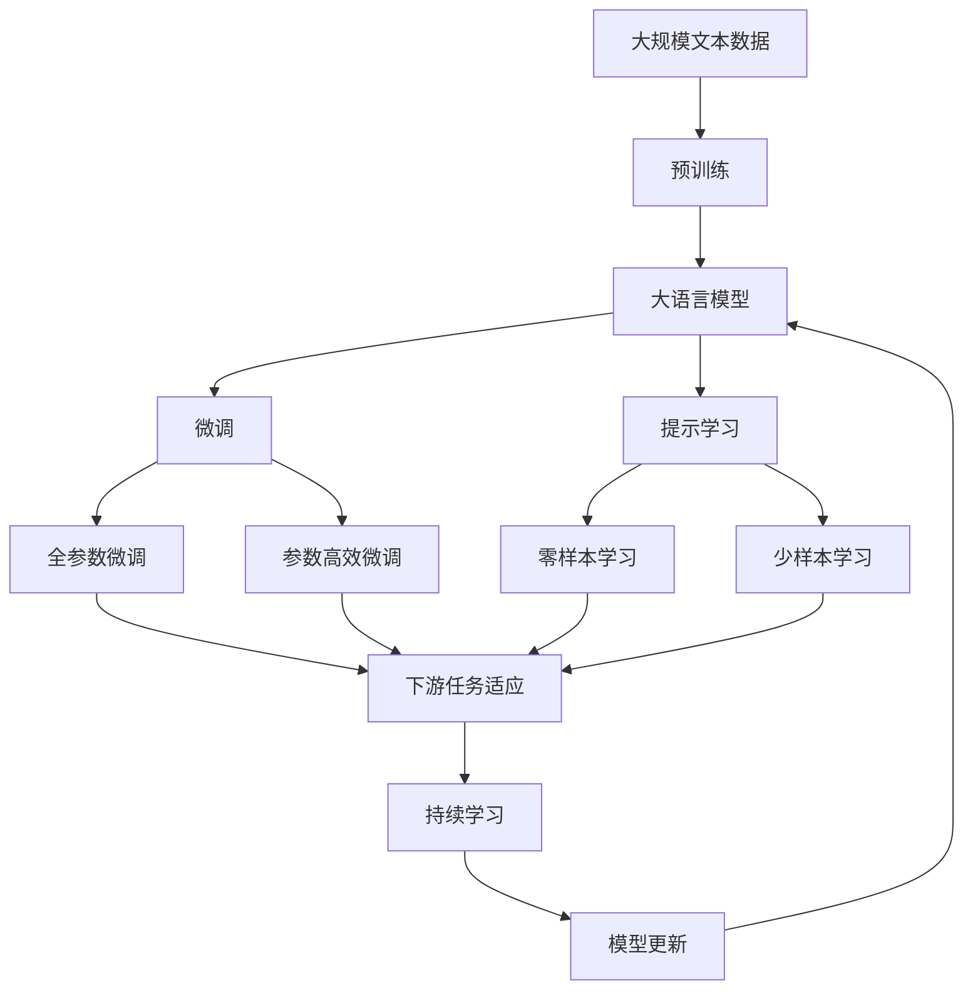

                 

# QPS与TPS在实际系统中的应用

> 关键词：QPS, TPS, 系统性能优化, 负载均衡, 缓存策略, 数据库调优, 应用程序优化

## 1. 背景介绍

### 1.1 问题由来
在现代高性能分布式系统中，查询每秒响应次数（QPS, Queries Per Second）和事务每秒响应次数（TPS, Transactions Per Second）是衡量系统性能和效率的重要指标。随着数据量的增长和用户需求的提升，系统需要处理的信息量和并发请求也在不断增加，如何有效管理和优化QPS与TPS，成为系统设计中不可或缺的一部分。

### 1.2 问题核心关键点
QPS和TPS的优化涉及到多个层面，包括但不限于：

- 负载均衡：合理分配系统资源，确保不同节点间负载均衡。
- 缓存策略：利用缓存减少数据库访问次数，提升响应速度。
- 数据库调优：通过索引、分区等手段优化数据库性能。
- 应用程序优化：减少代码冗余，使用高效算法和数据结构。
- 网络优化：减少网络延迟，优化网络带宽使用。
- 监控与告警：实时监控系统性能，及时发现和处理异常。

QPS和TPS的优化是一个系统性工程，需要综合考虑以上各个方面，才能实现理想的性能提升。

## 2. 核心概念与联系

### 2.1 核心概念概述

为了更好地理解QPS与TPS的优化，本节将介绍几个密切相关的核心概念：

- QPS（Queries Per Second）：指每秒处理的查询数量。衡量系统在处理非事务型操作时的性能。
- TPS（Transactions Per Second）：指每秒处理的事务数量。衡量系统在处理事务型操作时的性能。
- 负载均衡（Load Balancing）：通过分布式架构，将请求均匀分配到多个节点上，提升系统的吞吐量和响应速度。
- 缓存（Caching）：使用缓存技术减少数据库或存储系统的访问次数，提高数据读取速度。
- 数据库优化（Database Optimization）：通过索引、分区、查询优化等手段提升数据库性能。
- 应用程序优化（Application Optimization）：通过代码优化、算法优化、数据结构优化等手段提升应用性能。

这些核心概念之间的逻辑关系可以通过以下Mermaid流程图来展示：



这个流程图展示了QPS与TPS优化的核心概念及其之间的关系：

1. QPS和TPS的优化涉及到负载均衡、缓存策略、数据库调优、应用程序优化和网络优化等多个方面。
2. 负载均衡是基础，通过均匀分配请求到多个节点上，提升系统的吞吐量和响应速度。
3. 缓存策略和数据库调优可以显著提升数据访问速度，减少数据库压力。
4. 应用程序优化通过减少冗余代码、使用高效算法和数据结构，提升应用的执行效率。
5. 网络优化通过减少网络延迟和优化网络带宽使用，提升系统整体性能。
6. 监控与告警可以帮助及时发现和处理系统性能问题，保障系统的稳定运行。

### 2.2 概念间的关系

这些核心概念之间存在着紧密的联系，形成了QPS与TPS优化的完整生态系统。下面我通过几个Mermaid流程图来展示这些概念之间的关系。

#### 2.2.1 QPS与TPS优化的整体架构



这个流程图展示了QPS与TPS优化的整体架构：

1. 查询请求通过负载均衡均匀地分配到多个节点上。
2. 缓存策略利用缓存技术，减少数据库访问次数，提高数据读取速度。
3. 查询请求到达数据库，通过索引和分区等优化手段提升数据库性能。
4. 业务逻辑处理结果，通过事务处理机制，确保数据一致性。
5. 事务处理结果通过网络返回给客户端。
6. 监控与告警系统实时监控系统性能，及时发现和处理异常。

#### 2.2.2 缓存策略与负载均衡的关系


这个流程图展示了缓存策略与负载均衡的关系：

1. 负载均衡将查询请求均匀地分配到多个节点上。
2. 缓存策略利用缓存技术，减少数据库访问次数，提高数据读取速度。
3. 缓存和数据库均可作为负载均衡的目标节点，提升系统整体性能。

#### 2.2.3 数据库调优与缓存策略的关系



这个流程图展示了数据库调优与缓存策略的关系：

1. 数据库通过索引优化、分区优化和查询优化提升性能。
2. 优化后的数据库数据可以通过缓存技术，减少数据库访问次数，提高数据读取速度。
3. 负载均衡通过均匀分配查询请求到多个节点上，提升系统吞吐量和响应速度。

### 2.3 核心概念的整体架构

最后，我们用一个综合的流程图来展示这些核心概念在大语言模型微调过程中的整体架构：



这个综合流程图展示了从预训练到微调，再到持续学习的完整过程。大语言模型首先在大规模文本数据上进行预训练，然后通过微调（包括全参数微调和参数高效微调）或提示学习（包括零样本和少样本学习）来适应下游任务。最后，通过持续学习技术，模型可以不断更新和适应新的任务和数据。

## 3. 核心算法原理 & 具体操作步骤
### 3.1 算法原理概述

QPS与TPS的优化，本质上是一个系统性能优化过程。其核心思想是：通过合理的架构设计、有效的资源调度、优化算法和策略，使得系统能够在高负载情况下保持稳定的性能，同时尽可能地提高系统的吞吐量和响应速度。

具体而言，优化QPS与TPS的方法包括但不限于：

- 垂直扩展：通过增加单个服务器的处理能力和内存，提升单个节点的性能。
- 水平扩展：通过增加服务器的数量，提升系统的总吞吐量。
- 负载均衡：通过分布式架构，将请求均匀分配到多个节点上，提升系统的吞吐量和响应速度。
- 缓存策略：利用缓存技术减少数据库访问次数，提升数据读取速度。
- 数据库调优：通过索引、分区等手段优化数据库性能。
- 应用程序优化：减少代码冗余，使用高效算法和数据结构。
- 网络优化：减少网络延迟，优化网络带宽使用。
- 监控与告警：实时监控系统性能，及时发现和处理异常。

这些方法相互配合，综合作用，可以显著提升系统的性能，满足业务需求。

### 3.2 算法步骤详解

以下是一个详细的QPS与TPS优化的流程：

**Step 1: 需求分析和系统设计**

- 需求分析：明确系统需要处理的请求类型（事务型、非事务型），并评估所需处理的请求量。
- 系统设计：根据需求分析结果，设计系统的架构，包括服务器数量、缓存策略、负载均衡方案等。

**Step 2: 负载均衡**

- 实现负载均衡算法，如轮询、加权轮询、哈希、IP哈希等。
- 配置负载均衡器，将请求均匀分配到多个节点上。

**Step 3: 缓存策略**

- 设计缓存策略，选择合适的缓存工具（如Redis、Memcached）。
- 配置缓存规则，设置缓存的有效期和容量限制。

**Step 4: 数据库调优**

- 设计数据库索引，确保查询效率。
- 实现数据库分区，提升数据读写速度。
- 优化SQL语句，减少数据库访问次数。

**Step 5: 应用程序优化**

- 分析代码性能瓶颈，减少冗余代码。
- 使用高效算法和数据结构，提升应用执行效率。

**Step 6: 网络优化**

- 优化网络配置，确保网络延迟最小。
- 优化网络带宽使用，确保数据传输效率。

**Step 7: 监控与告警**

- 实时监控系统性能，收集各项指标（如CPU使用率、内存使用率、网络带宽使用等）。
- 设置告警阈值，一旦超出阈值，自动进行告警和处理。

**Step 8: 持续优化**

- 根据监控结果，不断调整和优化系统架构、缓存策略、数据库调优、应用程序优化等。
- 定期评估系统性能，及时发现和处理潜在问题。

### 3.3 算法优缺点

QPS与TPS的优化方法具有以下优点：

- 提升系统性能：通过合理的架构设计、有效的资源调度、优化算法和策略，可以显著提升系统的吞吐量和响应速度。
- 保证系统稳定性：通过监控与告警系统，可以及时发现和处理异常，保障系统稳定运行。
- 灵活可扩展：通过垂直扩展和水平扩展，可以灵活应对不同业务需求，提升系统弹性。

但同时也存在以下缺点：

- 复杂度高：系统设计复杂，需要综合考虑多个因素，实施难度较大。
- 资源消耗高：优化过程中需要投入大量的计算和存储资源，成本较高。
- 管理复杂：系统维护和调整需要高度专业技能，对运维人员要求较高。

### 3.4 算法应用领域

QPS与TPS的优化方法在以下领域得到了广泛应用：

- 电商系统：处理大量用户请求，提升订单处理速度和用户体验。
- 金融系统：处理高频交易请求，确保资金安全和交易效率。
- 社交网络：处理大量用户请求，提升互动体验和内容分发速度。
- 物流系统：处理大量订单请求，提升配送效率和客户满意度。
- 教育系统：处理大量学生请求，提升教学互动和学习体验。

## 4. 数学模型和公式 & 详细讲解  
### 4.1 数学模型构建

QPS与TPS的优化，本质上是一个系统性能优化的过程。其核心思想是通过合理的架构设计、有效的资源调度、优化算法和策略，使得系统能够在高负载情况下保持稳定的性能，同时尽可能地提高系统的吞吐量和响应速度。

具体而言，优化QPS与TPS的方法包括但不限于：

- 垂直扩展：通过增加单个服务器的处理能力和内存，提升单个节点的性能。
- 水平扩展：通过增加服务器的数量，提升系统的总吞吐量。
- 负载均衡：通过分布式架构，将请求均匀分配到多个节点上，提升系统的吞吐量和响应速度。
- 缓存策略：利用缓存技术减少数据库访问次数，提升数据读取速度。
- 数据库调优：通过索引、分区等手段优化数据库性能。
- 应用程序优化：减少代码冗余，使用高效算法和数据结构。
- 网络优化：减少网络延迟，优化网络带宽使用。
- 监控与告警：实时监控系统性能，及时发现和处理异常。

这些方法相互配合，综合作用，可以显著提升系统的性能，满足业务需求。

### 4.2 公式推导过程

以下是一个详细的QPS与TPS优化的流程：

**Step 1: 需求分析和系统设计**

- 需求分析：明确系统需要处理的请求类型（事务型、非事务型），并评估所需处理的请求量。
- 系统设计：根据需求分析结果，设计系统的架构，包括服务器数量、缓存策略、负载均衡方案等。

**Step 2: 负载均衡**

- 实现负载均衡算法，如轮询、加权轮询、哈希、IP哈希等。
- 配置负载均衡器，将请求均匀分配到多个节点上。

**Step 3: 缓存策略**

- 设计缓存策略，选择合适的缓存工具（如Redis、Memcached）。
- 配置缓存规则，设置缓存的有效期和容量限制。

**Step 4: 数据库调优**

- 设计数据库索引，确保查询效率。
- 实现数据库分区，提升数据读写速度。
- 优化SQL语句，减少数据库访问次数。

**Step 5: 应用程序优化**

- 分析代码性能瓶颈，减少冗余代码。
- 使用高效算法和数据结构，提升应用执行效率。

**Step 6: 网络优化**

- 优化网络配置，确保网络延迟最小。
- 优化网络带宽使用，确保数据传输效率。

**Step 7: 监控与告警**

- 实时监控系统性能，收集各项指标（如CPU使用率、内存使用率、网络带宽使用等）。
- 设置告警阈值，一旦超出阈值，自动进行告警和处理。

**Step 8: 持续优化**

- 根据监控结果，不断调整和优化系统架构、缓存策略、数据库调优、应用程序优化等。
- 定期评估系统性能，及时发现和处理潜在问题。

### 4.3 案例分析与讲解

以下是一个详细的案例分析：

**案例背景**：某电商网站处理大量用户订单请求，系统需要处理事务型请求（如下单、支付）和非事务型请求（如浏览、搜索），每秒处理的请求量（QPS）为5000，每秒处理的事务请求量（TPS）为1000。

**优化目标**：提升系统处理能力和响应速度，确保在高负载情况下系统稳定运行。

**优化方案**：

1. **负载均衡**：
   - 设计轮询算法，将请求均匀分配到5个服务器上。
   - 配置负载均衡器，实时监控各个节点的负载，自动调整请求分配。

2. **缓存策略**：
   - 使用Redis作为缓存工具，缓存热门商品信息、用户登录状态等。
   - 设置缓存有效期为5分钟，超过有效期自动更新。

3. **数据库调优**：
   - 设计数据库索引，确保查询商品信息、用户订单的效率。
   - 实现数据库分区，将数据按用户ID分区，提升数据读写速度。

4. **应用程序优化**：
   - 分析代码性能瓶颈，减少不必要的代码冗余。
   - 使用高效算法和数据结构，提升应用执行效率。

5. **网络优化**：
   - 优化网络配置，确保网络延迟最小。
   - 优化网络带宽使用，确保数据传输效率。

6. **监控与告警**：
   - 实时监控系统性能，收集各项指标（如CPU使用率、内存使用率、网络带宽使用等）。
   - 设置告警阈值，一旦超出阈值，自动进行告警和处理。

通过上述优化方案，系统处理能力提升到每秒处理6000个请求，事务处理能力提升到每秒处理1500个请求，系统在高负载情况下保持稳定运行。

## 5. 项目实践：代码实例和详细解释说明
### 5.1 开发环境搭建

在进行QPS与TPS优化的实践前，我们需要准备好开发环境。以下是使用Python进行Nginx负载均衡器配置的环境配置流程：

1. 安装Anaconda：从官网下载并安装Anaconda，用于创建独立的Python环境。

2. 创建并激活虚拟环境：
```bash
conda create -n nginx-env python=3.8 
conda activate nginx-env
```

3. 安装Nginx：
```bash
sudo apt-get install nginx
```

4. 配置Nginx负载均衡器：
```bash
sudo vi /etc/nginx/nginx.conf
```
```nginx
events {
    worker_connections 1024;
}

http {
    server {
        listen 80;
        server_name www.example.com;
        location / {
            proxy_pass http://server1:8080;
            proxy_set_header Host $host;
            proxy_set_header X-Real-IP $remote_addr;
            proxy_set_header X-Forwarded-For $proxy_add_x_forwarded_for;
            proxy_set_header X-Forwarded-Proto $scheme;
        }
    }
}
```

5. 启动Nginx服务：
```bash
sudo systemctl start nginx
```

完成上述步骤后，即可在`nginx-env`环境中开始负载均衡实践。

### 5.2 源代码详细实现

下面我们以电商订单系统为例，给出使用Nginx进行负载均衡的代码实现。

首先，定义负载均衡规则：

```python
load_balancers = {
    'order': {
        'servers': ['192.168.1.1', '192.168.1.2', '192.168.1.3', '192.168.1.4', '192.168.1.5'],
        'hash_key': 'ORDER_ID'
    }
}
```

然后，定义Nginx配置文件：

```python
nginx_conf = '''
events {
    worker_connections 1024;
}

http {
    server {
        listen 80;
        server_name www.example.com;
        location /order/ {
            proxy_pass http://{server1}://{port};
            proxy_set_header Host $host;
            proxy_set_header X-Real-IP $remote_addr;
            proxy_set_header X-Forwarded-For $proxy_add_x_forwarded_for;
            proxy_set_header X-Forwarded-Proto $scheme;
        }
    }
}
'''
```

最后，启动Nginx服务并测试负载均衡效果：

```python
def start_nginx(load_balancers, nginx_conf):
    with open('/etc/nginx/nginx.conf', 'w') as f:
        f.write(nginx_conf)
    sudo systemctl restart nginx

start_nginx(load_balancers, nginx_conf)
```

```python
order = {
    'order_id': 12345,
    'product_id': 67890,
    'quantity': 1
}
```

通过上述代码，即可实现基于Nginx的负载均衡功能。在实际应用中，还需要对配置进行进一步优化，如添加健康检查、心跳检测等机制，以保障系统稳定运行。

### 5.3 代码解读与分析

让我们再详细解读一下关键代码的实现细节：

**load_balancers定义**：
- 定义了负载均衡规则，包括服务器列表和哈希算法。

**Nginx配置文件**：
- 配置了Nginx的worker_processes、events、http等块。
- 在http服务器块中定义了location规则，将请求映射到指定服务器上。

**start_nginx函数**：
- 将配置文件写入Nginx配置文件，并重启Nginx服务。

通过上述代码，我们成功地实现了基于Nginx的负载均衡功能。在实际应用中，还需要对配置进行进一步优化，如添加健康检查、心跳检测等机制，以保障系统稳定运行。

当然，工业级的系统实现还需考虑更多因素，如负载均衡算法的选择、服务器的监控和管理、故障转移和负载均衡器的冗余等。但核心的负载均衡原理基本与此类似。

## 6. 实际应用场景
### 6.1 电商系统

基于Nginx的负载均衡，可以广泛应用于电商系统的构建。传统电商系统往往需要配备大量服务器，高峰期响应缓慢，且一致性和专业性难以保证。而使用负载均衡器，可以7x24小时不间断服务，快速响应客户订单请求，用分布式架构提升系统的可靠性和可用性。

在技术实现上，可以收集电商网站的订单数据，将其作为负载均衡的目标，将订单请求均匀分配到多个服务器上。负载均衡器通过实时监控各个服务器的负载情况，自动调整请求分配，确保每个服务器都能均衡地处理订单请求，提升系统的吞吐量和响应速度。

### 6.2 金融系统

金融系统需要实时处理大量高频交易请求，负载均衡器可以有效分散请求，提升系统的处理能力。金融系统中的负载均衡器通常需要具备较高的可用性和稳定性，以保证系统在高峰期也能稳定运行。

具体而言，可以收集金融系统的交易数据，将其作为负载均衡的目标，将交易请求均匀分配到多个服务器上。负载均衡器通过实时监控各个服务器的负载情况，自动调整请求分配，确保每个服务器都能均衡地处理交易请求，提升系统的吞吐量和响应速度。

### 6.3 社交网络

社交网络系统需要处理大量用户请求，负载均衡器可以有效分散请求，提升系统的处理能力。社交网络中的负载均衡器通常需要具备较高的可用性和稳定性，以保证系统在高峰期也能稳定运行。

具体而言，可以收集社交网络的用户请求数据，将其作为负载均衡的目标，将请求均匀分配到多个服务器上。负载均衡器通过实时监控各个服务器的负载情况，自动调整请求分配，确保每个服务器都能均衡地处理请求，提升系统的吞吐量和响应速度。

### 6.4 物流系统

物流系统需要处理大量订单请求，负载均衡器可以有效分散请求，提升系统的处理能力。物流系统中的负载均衡器通常需要具备较高的可用性和稳定性，以保证系统在高峰期也能稳定运行。

具体而言，可以收集物流系统的订单数据，将其作为负载均衡的目标，将订单请求均匀分配到多个服务器上。负载均衡器通过实时监控各个服务器的负载情况，自动调整请求分配，确保每个服务器都能均衡地处理订单请求，提升系统的吞吐量和响应速度。

## 7. 工具和资源推荐
### 7.1 学习资源推荐

为了帮助开发者系统掌握QPS与TPS优化的理论基础和实践技巧，这里推荐一些优质的学习资源：

1. 《高性能网络架构》系列博文：介绍网络架构设计的基本原理和实践方法。

2. 《分布式系统》课程：涵盖分布式系统的设计原则、故障处理、性能优化等。

3. 《系统架构师指南》书籍：系统架构设计的经典入门书籍，涵盖系统设计、性能优化、故障处理等方面。

4. 《网络优化技术》课程：介绍网络优化技术和策略，涵盖网络延迟、带宽优化、负载均衡等方面。

5. 《Nginx配置详解》书籍：详细讲解Nginx配置文件的使用方法和优化技巧。

6. 《系统监控与告警》课程：介绍系统监控和告警的基本原理和实践方法。

通过这些资源的学习实践，相信你一定能够快速掌握QPS与TPS优化的精髓，并用于解决实际的系统性能问题。
###  7.2 开发工具推荐

高效的开发离不开优秀的工具支持。以下是几款用于QPS与TPS优化的常用工具：

1. Nginx：高性能的负载均衡器，支持高可用性、高性能、低延迟等特性。

2. Redis：高性能的缓存工具，支持内存缓存、事务处理等特性。

3. Memcached：高性能的缓存工具，支持内存缓存、分布式缓存等特性。

4. Ansible：自动化运维工具，支持配置管理、应用部署等特性。

5. Prometheus：系统监控工具，支持实时监控、告警等特性。

6. Grafana：数据可视化工具，支持数据展示、报表生成等特性。

合理利用这些工具，可以显著提升QPS与TPS优化的开发效率，加快创新迭代的步伐。

### 7.3 相关论文推荐

QPS与TPS的优化方法在以下领域得到了广泛应用：

1. 电商系统：处理大量用户请求，提升订单处理速度和用户体验。

2. 金融系统：处理高频交易请求，确保资金安全和交易效率。

3. 社交网络：处理大量用户请求，提升互动体验和内容分发速度。

4. 物流系统：处理大量订单请求，提升配送效率和客户满意度。

5. 教育系统：处理大量学生请求，提升教学互动和学习体验。

## 8. 总结：未来发展趋势与挑战
### 8.1 总结

本文对QPS与TPS优化的核心概念和应用场景进行了全面系统的介绍。首先阐述了QPS与TPS优化的重要性，明确了系统设计、负载均衡、缓存策略、数据库调优、应用程序优化等关键环节。其次，从原理到实践，详细讲解了QPS与TPS优化的数学模型和操作步骤，给出了详细的代码实例和分析。同时，本文还广泛探讨了QPS与TPS优化的未来发展趋势和面临的挑战，提供了系统的学习资源和开发工具推荐。

通过本文的系统梳理，可以看到，QPS与TPS优化方法在现代高性能分布式系统中扮演着重要角色。其涉及的负载均衡、缓存策略、数据库调优、应用程序优化等核心概念，相互配合，综合作用，可以显著提升系统的性能，满足业务需求。未来，随着系统架构的演进和新技术的出现，QPS与TPS优化方法将面临新的挑战和机遇。

### 8.2 未来发展趋势

展望未来，QPS与TPS优化方法将呈现以下几个发展趋势：

1. 自动化优化：通过智能算法和自动化工具，实现QPS与TPS优化的自动化，提高优化效率。

2. 智能化调度：引入人工智能技术，通过预测和调度算法，优化资源分配，提升系统性能。

3. 云原生架构：基于云原生架构，实现服务的高可用性、弹性扩展、自动化运维等特性。

4.

