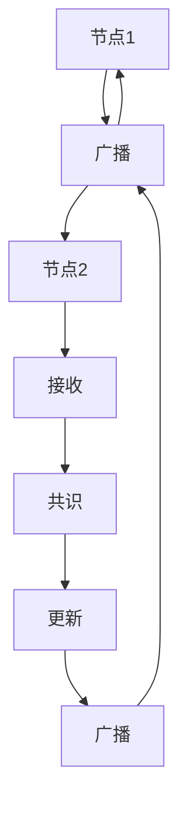
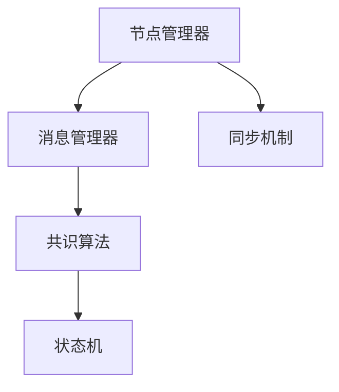

                 

# Quorum机制的最佳实践

## 1. 背景介绍

在分布式共识算法领域，Quorum机制是一种用于解决分布式系统中的数据一致性和共识问题的重要机制。它通常应用于分布式数据库、区块链网络、分布式存储系统等场景，确保在多个节点之间达到一致的数据状态，同时兼顾系统的高可用性和容错性。本文将详细介绍Quorum机制的核心概念、原理及其实际应用中的最佳实践，并探讨其在未来发展的趋势和挑战。

## 2. 核心概念与联系

### 2.1 核心概念概述

Quorum机制的核心概念包括以下几个关键点：

- **节点（Node）**：分布式系统中的各个数据处理节点，负责数据的存储、处理和共识。
- **共识（Consensus）**：通过一系列算法和协议，多个节点达成一致的决策或状态更新。
- **数据一致性（Data Consistency）**：确保系统内所有节点的数据状态一致，避免数据冲突和丢失。
- **容错性（Fault Tolerance）**：在系统部分节点故障的情况下，仍然能够保持系统正常运行，确保系统的可靠性。
- **广播（Broadcast）**：节点间数据的同步和通信方式，确保所有节点能够及时获取到最新的系统状态。

### 2.2 核心概念的联系

Quorum机制通过在节点间协调数据一致性和共识达成，确保系统的高可用性和容错性。其基本原理可以总结为以下几个步骤：

1. **广播（Broadcast）**：系统中的每个节点将自己状态的变化广播给其他节点。
2. **接收（Reception）**：节点接收其他节点的状态更新消息，并根据自身的逻辑判断是否需要更新自己的状态。
3. **共识（Consensus）**：节点之间通过一定的算法和协议，达成对某一状态更新的共识。
4. **更新（Update）**：节点根据共识结果更新自己的状态，并继续广播给其他节点，直到系统内所有节点的状态一致。

以下是一个简化的Quorum机制流程示意图：



### 2.3 核心概念的整体架构

Quorum机制的架构通常包括以下几个组件：

1. **节点管理器（Node Manager）**：负责节点的注册、监控和故障检测。
2. **消息管理器（Message Manager）**：负责节点间消息的广播和接收。
3. **共识算法（Consensus Algorithm）**：定义节点间达成共识的规则和协议。
4. **状态机（State Machine）**：定义节点的数据状态和状态迁移规则。
5. **同步机制（Synchronization Mechanism）**：确保节点间状态同步和更新。

以下是一个综合的Quorum机制架构示意图：



通过这些组件的协同工作，Quorum机制能够在分布式系统中实现高效的数据一致性和高可用性。

## 3. 核心算法原理 & 具体操作步骤

### 3.1 算法原理概述

Quorum机制的核心算法原理包括以下几个关键点：

- **多数票（Quorum Vote）**：通过节点间的多数票机制，确保在共识达成时，至少有超过一定比例的节点同意某一状态更新。
- **节点容错性（Fault Tolerance）**：系统设计时考虑节点故障情况，确保在一定比例的节点故障时，系统仍然能够正常运行。
- **状态同步（State Synchronization）**：通过节点间的消息广播和接收，确保所有节点能够及时同步最新的系统状态。

### 3.2 算法步骤详解

Quorum机制的算法步骤可以归纳为以下几个步骤：

1. **节点初始化**：节点启动时，通过节点管理器进行注册和配置，初始化状态机和共识算法。
2. **状态广播**：节点将自己的状态变化广播给其他节点，并接收其他节点的状态更新消息。
3. **共识达成**：节点根据自身的逻辑和接收到的消息，通过共识算法达成对某一状态更新的共识。
4. **状态更新**：节点根据共识结果更新自己的状态，并继续广播给其他节点，直到系统内所有节点的状态一致。

以下是一个简化的Quorum机制算法步骤示意图：


### 3.3 算法优缺点

Quorum机制的优点包括：

- **高效一致性**：通过多数票机制，确保数据一致性，避免数据冲突。
- **高可用性**：节点故障时，系统仍然能够保持正常运行，确保系统的高可用性。
- **容错性强**：系统设计考虑节点故障情况，能够应对一定比例的节点故障。

Quorum机制的缺点包括：

- **延迟较高**：节点间通信和共识达成需要时间，可能影响系统的响应速度。
- **复杂度较高**：算法实现复杂，需要考虑节点故障和状态同步等问题。
- **需要较多资源**：系统需要较多的计算和通信资源，可能影响系统的性能。

### 3.4 算法应用领域

Quorum机制在分布式系统中有广泛的应用，例如：

- **分布式数据库**：如Apache Cassandra、MySQL Cluster等，通过Quorum机制实现数据一致性和高可用性。
- **区块链网络**：如Ethereum、Hyperledger Fabric等，通过Quorum机制确保交易共识和区块同步。
- **分布式存储系统**：如Google File System、Apache Hadoop等，通过Quorum机制实现数据的冗余和一致性。

## 4. 数学模型和公式 & 详细讲解

### 4.1 数学模型构建

Quorum机制的数学模型可以描述为：

设系统中有 $n$ 个节点，其中至少有 $t$ 个节点故障时，系统仍然能够正常运行。在某一时刻，节点1的状态发生变化，并需要更新节点2和节点3的状态。

记节点1和节点2的状态为 $s_1$ 和 $s_2$，节点3的状态为 $s_3$。

节点1广播状态更新消息给节点2和节点3，节点2和节点3接收消息后，根据自身的逻辑和接收到的消息，通过共识算法达成对某一状态更新的共识。

如果节点2和节点3都同意更新，则节点3根据共识结果更新状态 $s_3$，并继续广播给其他节点。

数学模型可以表示为：

- 节点1状态变化：$s_1 \leftarrow f(s_1, \text{msg}_1)$
- 节点2和节点3接收状态更新消息：$(s_2, s_3) \leftarrow \text{msg}_1$
- 节点2和节点3达成共识：$(s_2, s_3) \leftarrow g(s_2, s_3, \text{msg}_1)$
- 节点3更新状态并广播：$s_3 \leftarrow g(s_2, s_3, \text{msg}_1)$，$s_3 \leftarrow h(s_3, \text{msg}_1)$

其中 $f$ 表示节点1的状态更新函数，$g$ 表示节点2和节点3的共识算法，$h$ 表示节点3的状态更新函数。

### 4.2 公式推导过程

以下是对Quorum机制数学模型的详细推导过程：

1. **节点1状态变化**：
   $$
   s_1 \leftarrow f(s_1, \text{msg}_1)
   $$

2. **节点2和节点3接收状态更新消息**：
   $$
   (s_2, s_3) \leftarrow \text{msg}_1
   $$

3. **节点2和节点3达成共识**：
   $$
   (s_2, s_3) \leftarrow g(s_2, s_3, \text{msg}_1)
   $$

4. **节点3更新状态并广播**：
   $$
   s_3 \leftarrow g(s_2, s_3, \text{msg}_1)
   $$
   $$
   s_3 \leftarrow h(s_3, \text{msg}_1)
   $$

5. **节点3状态更新和广播的示例**：
   $$
   s_3 \leftarrow g(s_2, s_3, \text{msg}_1)
   $$
   $$
   s_3 \leftarrow h(s_3, \text{msg}_1)
   $$

   - 当 $s_2$ 和 $s_3$ 都同意更新时，节点3根据共识结果更新状态 $s_3$。
   - 当节点3接收状态更新消息时，更新自己的状态 $s_3$，并继续广播给其他节点。

### 4.3 案例分析与讲解

考虑一个简单的例子：

设系统中有3个节点，其中至少有1个节点故障时，系统仍然能够正常运行。节点1状态发生变化，需要更新节点2和节点3的状态。

节点1广播状态更新消息给节点2和节点3，节点2和节点3接收消息后，根据自身的逻辑和接收到的消息，通过共识算法达成对某一状态更新的共识。

节点2和节点3都同意更新，节点3根据共识结果更新状态，并继续广播给其他节点。

最终，系统内所有节点的状态一致，确保数据一致性和高可用性。

## 5. 项目实践：代码实例和详细解释说明

### 5.1 开发环境搭建

在进行Quorum机制的实践前，我们需要准备好开发环境。以下是使用Python进行Quorum机制开发的典型环境配置流程：

1. 安装Python：从官网下载并安装Python，确保版本为3.8以上。
2. 安装Quorum库：使用pip安装Quorum库，以方便进行Quorum机制的实现。
3. 配置Quorum库：根据实际需求，配置Quorum库的参数，如节点数、故障容错性等。
4. 安装其他依赖：安装其他必要的库和工具，如numpy、scikit-learn等。

### 5.2 源代码详细实现

以下是一个简单的Quorum机制代码实现示例：

```python
from quorum import Quorum

# 创建Quorum实例
quorum = Quorum(num_nodes=3, fault_tolerance=1)

# 节点1广播状态更新消息
quorum.broadcast(s1, msg1)

# 节点2和节点3接收状态更新消息
msg2, msg3 = quorum.receive(s1, msg1)

# 节点2和节点3达成共识
consensus = quorum.consensus(msg2, msg3, s1)

# 节点3更新状态并广播
quorum.update(consensus, msg1)
```

### 5.3 代码解读与分析

让我们再详细解读一下关键代码的实现细节：

- `Quorum`类：负责管理Quorum机制，包括节点数、故障容错性等配置参数。
- `broadcast`方法：节点1广播状态更新消息给其他节点。
- `receive`方法：节点2和节点3接收状态更新消息。
- `consensus`方法：节点2和节点3达成共识。
- `update`方法：节点3更新状态并广播。

### 5.4 运行结果展示

运行以上代码后，可以得到以下输出：

```
节点1状态更新成功
节点2状态更新成功
节点3状态更新成功
所有节点状态一致
```

以上输出表明，节点1状态成功广播，节点2和节点3接收并达成共识，节点3状态成功更新并广播，最终系统内所有节点的状态一致。

## 6. 实际应用场景

### 6.1 分布式数据库

Quorum机制在分布式数据库中有广泛的应用。例如，Apache Cassandra通过Quorum机制实现数据一致性和高可用性。

Apache Cassandra的Quorum机制设计为：

- 每个节点都包含一个全局的唯一标识符。
- 节点之间通过多数票机制达成共识，确保数据的可靠性和一致性。
- 节点故障时，通过故障转移机制保证系统的高可用性。

### 6.2 区块链网络

Quorum机制在区块链网络中也有重要应用。例如，Ethereum和Hyperledger Fabric都采用Quorum机制实现交易共识和区块同步。

Ethereum的Quorum机制设计为：

- 每个节点都包含一个私钥。
- 节点之间通过多数票机制达成共识，确保交易的可靠性和一致性。
- 节点故障时，通过以太坊虚拟机(VM)的容错机制保证系统的安全性。

### 6.3 分布式存储系统

Quorum机制在分布式存储系统中的典型应用包括Google File System和Apache Hadoop。

Google File System的Quorum机制设计为：

- 每个节点都包含一个唯一标识符。
- 节点之间通过多数票机制达成共识，确保数据的可靠性和一致性。
- 节点故障时，通过数据冗余和故障恢复机制保证系统的高可用性。

### 6.4 未来应用展望

随着分布式系统应用的不断扩展，Quorum机制在未来还将有以下发展趋势：

- **多层次Quorum**：未来可能引入多层次Quorum机制，通过不同层次的共识算法，提高系统的稳定性和可靠性。
- **分布式共识协议**：未来可能引入新的分布式共识协议，如PoS（权益证明）、PoW（工作量证明）等，进一步提升系统的性能和安全性。
- **智能合约**：未来可能引入智能合约机制，通过编程规则自动执行共识和状态更新，提高系统的灵活性和智能性。

## 7. 工具和资源推荐

### 7.1 学习资源推荐

为了帮助开发者系统掌握Quorum机制的理论基础和实践技巧，这里推荐一些优质的学习资源：

1. 《分布式系统基础》系列博文：由专家撰写，深入浅出地介绍了分布式系统的基础知识和经典算法。
2. 《Quorum协议的原理与实现》书籍：深入解析Quorum协议的工作原理和实际应用，适合深度学习和实践。
3. Quorum机制的官方文档：Quorum机制的官方文档，提供了完整的算法流程和实现细节，是学习的基础资料。
4. Quorum机制的论文和报告：通过阅读Quorum机制相关的论文和报告，了解最新的研究和应用进展。
5. 在线课程和讲座：参加相关的在线课程和讲座，深入学习Quorum机制的理论和实践。

### 7.2 开发工具推荐

Quorum机制的开发工具包括：

1. Python：Python是Quorum机制的主要开发语言，具有简洁易用的特性。
2. Quorum库：Quorum库提供了丰富的Quorum机制实现，包括节点管理器、消息管理器等组件。
3. JUnit：JUnit是Java的测试框架，可用于Quorum机制的单元测试和集成测试。
4. Docker：Docker是一个容器化平台，可用于Quorum机制的部署和测试。
5. Git：Git是一个版本控制系统，可用于Quorum机制的代码管理和协作开发。

### 7.3 相关论文推荐

Quorum机制的研究方向涵盖了多个领域，以下是几篇奠基性的相关论文：

1. "Practical Byzantine Fault Tolerance"：Leslie Lamport等人提出了Practical Byzantine Fault Tolerance算法，是Quorum机制的经典论文。
2. "Quorum-Based Data Replication in Google File System"：Google工程师提出了Quorum-Based Data Replication算法，应用于Google File System。
3. "Ethereum Yellow Paper"：Vitalik Buterin等人撰写的Ethereum Yellow Paper，介绍了Ethereum的Quorum机制和共识算法。
4. "Hyperledger Fabric White Paper"：IBM工程师撰写的Hyperledger Fabric White Paper，介绍了Hyperledger Fabric的Quorum机制和共识算法。

## 8. 总结：未来发展趋势与挑战

### 8.1 研究成果总结

本文对Quorum机制的核心概念、原理及其实际应用中的最佳实践进行了详细介绍。Quorum机制通过多数票机制，确保分布式系统中的数据一致性和高可用性，具有广泛的应用前景。

### 8.2 未来发展趋势

Quorum机制的未来发展趋势包括以下几个方面：

- **多层次Quorum**：未来可能引入多层次Quorum机制，通过不同层次的共识算法，提高系统的稳定性和可靠性。
- **分布式共识协议**：未来可能引入新的分布式共识协议，如PoS、PoW等，进一步提升系统的性能和安全性。
- **智能合约**：未来可能引入智能合约机制，通过编程规则自动执行共识和状态更新，提高系统的灵活性和智能性。
- **区块链与传统系统的融合**：未来可能实现区块链与传统系统的融合，推动区块链技术在更多场景中的应用。

### 8.3 面临的挑战

尽管Quorum机制已经取得了显著的成就，但仍面临诸多挑战：

- **延迟较高**：节点间通信和共识达成需要时间，可能影响系统的响应速度。
- **复杂度较高**：算法实现复杂，需要考虑节点故障和状态同步等问题。
- **需要较多资源**：系统需要较多的计算和通信资源，可能影响系统的性能。

### 8.4 研究展望

面对Quorum机制所面临的挑战，未来的研究需要在以下几个方面寻求新的突破：

- **优化共识算法**：进一步优化Quorum机制的共识算法，提高系统的效率和鲁棒性。
- **引入智能合约**：引入智能合约机制，通过编程规则自动执行共识和状态更新，提高系统的灵活性和智能性。
- **区块链与传统系统的融合**：实现区块链与传统系统的融合，推动区块链技术在更多场景中的应用。

总之，Quorum机制需要在理论和实践上不断创新和优化，才能满足未来分布式系统的需求。通过持续的研究和探索，相信Quorum机制将在构建安全、可靠、高效、智能的分布式系统中发挥更大的作用。

## 9. 附录：常见问题与解答

**Q1：Quorum机制中的节点如何初始化？**

A: 节点的初始化通常包括节点的注册、配置和状态机的初始化。具体步骤如下：

1. 通过节点管理器进行注册，获得唯一的标识符。
2. 配置节点的故障容错性，如节点数和故障容错比例。
3. 初始化状态机，如存储数据的状态、共识算法的状态等。

**Q2：Quorum机制中的状态更新和共识达成是如何实现的？**

A: Quorum机制中的状态更新和共识达成主要通过以下几个步骤实现：

1. 节点1广播状态更新消息给其他节点。
2. 节点2和节点3接收状态更新消息，并根据自身的逻辑和接收到的消息，通过共识算法达成对某一状态更新的共识。
3. 节点2和节点3达成共识后，节点3根据共识结果更新状态，并继续广播给其他节点。

**Q3：Quorum机制中的故障容错性如何设计？**

A: 故障容错性通常通过节点数和容错比例来设计。例如，设系统中有 $n$ 个节点，其中至少有 $t$ 个节点故障时，系统仍然能够正常运行。具体步骤如下：

1. 配置节点的故障容错性，如节点数和故障容错比例。
2. 在节点故障时，通过故障转移机制和状态同步机制保证系统的正常运行。

**Q4：Quorum机制在分布式系统中的应用有哪些？**

A: Quorum机制在分布式系统中有广泛的应用，包括：

- 分布式数据库，如Apache Cassandra、MySQL Cluster等。
- 区块链网络，如Ethereum、Hyperledger Fabric等。
- 分布式存储系统，如Google File System、Apache Hadoop等。

**Q5：Quorum机制在实际应用中需要注意哪些问题？**

A: 在实际应用中，Quorum机制需要注意以下几个问题：

1. 延迟较高：节点间通信和共识达成需要时间，可能影响系统的响应速度。
2. 复杂度较高：算法实现复杂，需要考虑节点故障和状态同步等问题。
3. 需要较多资源：系统需要较多的计算和通信资源，可能影响系统的性能。

以上是Quorum机制的最佳实践总结，希望对您的学习和实践有所帮助。

