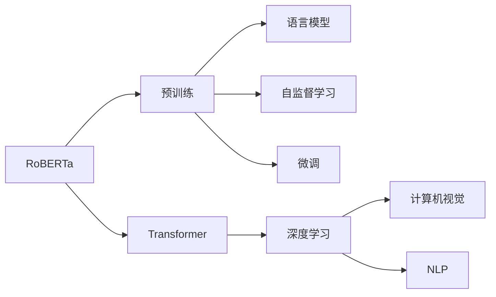
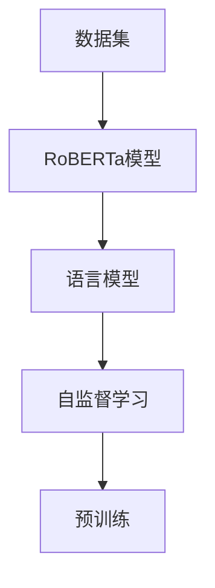
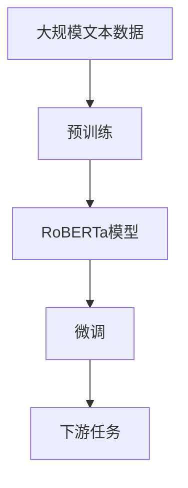

                 

# RoBERTa原理与代码实例讲解

> 关键词：RoBERTa, 自然语言处理(NLP), 深度学习, 计算机视觉, 数据增强, 语言模型, Transformers, 自监督学习

## 1. 背景介绍

### 1.1 问题由来

随着深度学习技术在计算机视觉和自然语言处理(NLP)领域取得的突破性进展，RoBERTa（Robustly Optimized BERT Pretraining Approach）应运而生。RoBERTa作为BERT的改进版本，不仅在预训练阶段的算法上进行了优化，还对数据集进行了调整，进一步提升了模型的语言理解能力和泛化能力。RoBERTa的成功之处在于其创新性的预训练方法和大规模数据集的利用，使其在多项NLP任务上取得了优异的表现。

### 1.2 问题核心关键点

RoBERTa的核心思想是通过大规模自监督数据预训练和任务特定的微调（Fine-Tuning），提高模型的语言理解能力和泛化能力。相较于BERT，RoBERTa在预训练阶段的优化主要体现在以下几个方面：

1. **数据集改进**：RoBERTa使用了更大的训练数据集，包括Pile、BigQuery、BigPython和私有中文数据集等，共计约1600万个训练样本，显著扩大了预训练的规模。
2. **掩码策略调整**：RoBERTa采用了更灵活的掩码策略，包括随机掩码和静态掩码两种方式，避免模型对特定位置的依赖性，增强了模型的泛化能力。
3. **静态预测任务**：RoBERTa在预训练阶段加入了静态预测任务，如命名实体识别、词性标注等，进一步提升了模型的综合理解能力。
4. **学习率动态调整**：RoBERTa在预训练过程中，采用了动态学习率调整策略，加快了模型的收敛速度。

这些优化使得RoBERTa在语言理解上更加精确，适用于各种NLP任务，包括问答、文本分类、命名实体识别、文本生成等。

### 1.3 问题研究意义

RoBERTa的原理和实践对于提升NLP模型的语言理解能力和泛化能力具有重要意义：

1. **降低开发成本**：RoBERTa提供了一种高效的预训练模型，可以大幅减少从头训练模型的时间和计算资源，加速NLP应用的发展。
2. **提高模型效果**：RoBERTa在多项NLP任务上取得了比BERT更优的效果，提升了模型的实用性和可靠性。
3. **推动技术进步**：RoBERTa的预训练方法对NLP领域的技术进步具有深远影响，引领了自监督学习的最新趋势。
4. **促进应用落地**：RoBERTa的易用性和高效性，使得NLP技术更容易被各行各业采用，推动了NLP技术的产业化进程。

## 2. 核心概念与联系

### 2.1 核心概念概述

为更好地理解RoBERTa的原理和应用，本节将介绍几个关键概念及其相互联系：

1. **RoBERTa**：一种基于Transformer架构的预训练语言模型，通过大规模自监督数据预训练和任务特定的微调，提高了模型的语言理解能力和泛化能力。
2. **预训练**：在无标注数据上，使用自监督学习任务训练通用语言模型，学习语言的通用表示。
3. **微调**：在预训练模型的基础上，使用下游任务的少量标注数据，通过有监督学习优化模型在特定任务上的性能。
4. **Transformer**：一种自注意力机制的神经网络架构，广泛应用于NLP和计算机视觉领域，是目前最先进的深度学习模型之一。
5. **自监督学习**：利用无标签数据进行模型训练，通过设计的预训练任务，学习语言的通用表示。
6. **语言模型**：一种通过预测文本序列的下一个词来训练模型的任务，广泛应用于NLP领域的预训练。

这些核心概念之间的逻辑关系可以通过以下Mermaid流程图来展示：



这个流程图展示了大模型预训练-微调的基本流程：首先，RoBERTa基于Transformer架构进行预训练，通过自监督学习任务学习语言的通用表示；然后，在微调阶段，RoBERTa根据下游任务的少量标注数据进行优化，提升在特定任务上的性能。

### 2.2 概念间的关系

这些核心概念之间存在着紧密的联系，形成了RoBERTa预训练-微调的基本框架。下面我们通过几个Mermaid流程图来展示这些概念之间的关系。

#### 2.2.1 RoBERTa的预训练过程



这个流程图展示了RoBERTa预训练过程的基本流程：首先，RoBERTa模型在无标签的数据集上进行自监督学习任务，学习语言的通用表示；然后，通过预训练过程进一步提升模型的语言理解能力。

#### 2.2.2 RoBERTa的微调过程


这个流程图展示了RoBERTa微调过程的基本流程：首先，RoBERTa模型在预训练的基础上，使用下游任务的少量标注数据进行微调，进一步提升模型在特定任务上的性能。

#### 2.2.3 预训练和微调的关系


这个流程图展示了预训练和微调之间的关系：RoBERTa模型首先通过大规模自监督数据预训练，学习语言的通用表示；然后，在特定任务上进行微调，进一步提升模型在该任务上的表现。

### 2.3 核心概念的整体架构

最后，我们用一个综合的流程图来展示RoBERTa预训练-微调过程的整体架构：



这个综合流程图展示了RoBERTa预训练和微调过程的整体架构：首先，RoBERTa在大规模文本数据上进行预训练，学习语言的通用表示；然后，在特定任务上进行微调，提升模型在特定任务上的性能。

## 3. 核心算法原理 & 具体操作步骤

### 3.1 算法原理概述

RoBERTa的预训练和微调过程基于Transformer架构，主要采用了以下两个算法：

1. **预训练算法**：在无标注数据上，通过自监督学习任务训练通用语言模型，学习语言的通用表示。RoBERTa在预训练过程中，采用了掩码预测、语言模型预测、下一句预测等任务，提升模型的语言理解能力。
2. **微调算法**：在预训练模型的基础上，使用下游任务的少量标注数据，通过有监督学习优化模型在特定任务上的性能。

### 3.2 算法步骤详解

RoBERTa的预训练和微调过程可以分为以下五个步骤：

1. **数据准备**：选择合适的数据集，并进行数据预处理，如分词、截断等。
2. **模型初始化**：将RoBERTa模型初始化为随机权重。
3. **预训练过程**：在无标注数据上，使用掩码预测、语言模型预测、下一句预测等任务，训练RoBERTa模型。
4. **微调过程**：在预训练模型的基础上，使用下游任务的少量标注数据进行微调。
5. **模型评估与部署**：在测试集上评估微调后的RoBERTa模型性能，并将模型部署到实际应用中。

### 3.3 算法优缺点

RoBERTa的预训练和微调方法具有以下优点：

1. **规模庞大**：RoBERTa使用了约1600万个训练样本，规模庞大，提升了模型的泛化能力。
2. **灵活性高**：RoBERTa采用了更灵活的掩码策略，并加入了静态预测任务，增强了模型的泛化能力和任务适应性。
3. **性能优越**：RoBERTa在多项NLP任务上取得了比BERT更优的效果，提升了模型的实用性和可靠性。
4. **预训练能力强**：RoBERTa通过大规模自监督数据预训练，学习语言的通用表示，提升了模型的语言理解能力。

同时，RoBERTa的方法也存在以下缺点：

1. **资源消耗大**：RoBERTa的预训练过程需要大量的计算资源和时间，对算力和存储提出了较高的要求。
2. **模型复杂**：RoBERTa模型参数量庞大，训练和推理过程中的计算量和内存消耗较大。
3. **微调依赖标注**：尽管RoBERTa的预训练能力较强，但微调过程仍需要标注数据，对标注样本的质量和数量要求较高。
4. **应用场景限制**：RoBERTa主要用于自然语言处理任务，对计算机视觉等模态的应用效果一般。

### 3.4 算法应用领域

RoBERTa广泛应用于自然语言处理（NLP）领域的各类任务，包括但不限于：

- **文本分类**：如情感分析、新闻分类等。通过微调RoBERTa模型，可以获得较高的分类精度。
- **命名实体识别**：识别文本中的实体，如人名、地名、机构名等。RoBERTa在命名实体识别任务上表现优异。
- **问答系统**：对自然语言问题给出答案。RoBERTa可以很好地理解问题和答案之间的关系，提高问答系统的准确性。
- **文本生成**：如文本摘要、对话生成等。RoBERTa能够生成流畅、逻辑连贯的文本。
- **机器翻译**：将源语言文本翻译成目标语言。RoBERTa在机器翻译任务上取得了较好的效果。

此外，RoBERTa还可以应用于推荐系统、搜索引擎、语音识别等领域，提升系统的智能化水平。

## 4. 数学模型和公式 & 详细讲解 & 举例说明

### 4.1 数学模型构建

RoBERTa的预训练和微调过程可以通过以下数学模型进行描述：

1. **预训练过程**：假设RoBERTa模型为$f(x)$，其中$x$为输入文本，$f$为RoBERTa模型。预训练的目标函数为$L_{pretrain}$，用于衡量模型在自监督任务上的表现。
2. **微调过程**：假设微调任务为$T$，其训练集为$D$。微调的目标函数为$L_{fine-tune}$，用于衡量模型在特定任务上的表现。

### 4.2 公式推导过程

#### 4.2.1 预训练过程

RoBERTa的预训练过程主要通过自监督学习任务进行训练。以掩码预测为例，设训练样本为$(x_i, y_i)$，其中$x_i$为输入文本，$y_i$为掩码位置。设模型预测的掩码位置为$\hat{y}_i$，则掩码预测的损失函数为：

$$
L_{mask} = -\log P(y_i | x_i)
$$

其中$P(y_i | x_i)$为模型在输入$x_i$上的掩码预测概率。

通过上述公式，可以计算每个掩码位置的预测概率，并计算掩码预测的损失函数$L_{mask}$。在预训练过程中，需要对大量样本进行掩码预测，多次迭代表达式(4-1)来训练RoBERTa模型。

#### 4.2.2 微调过程

RoBERTa的微调过程主要通过有监督学习任务进行训练。以文本分类任务为例，设训练样本为$(x_i, y_i)$，其中$x_i$为输入文本，$y_i$为分类标签。设微调后的RoBERTa模型为$f_{\theta}(x)$，则微调的目标函数为：

$$
L_{fine-tune} = \frac{1}{N}\sum_{i=1}^N \ell(f_{\theta}(x_i), y_i)
$$

其中$\ell$为任务特定的损失函数，$\frac{1}{N}\sum_{i=1}^N$表示计算平均损失函数。

在微调过程中，需要对每个训练样本$(x_i, y_i)$进行前向传播计算，并计算模型输出$f_{\theta}(x_i)$与标签$y_i$之间的损失函数$\ell(f_{\theta}(x_i), y_i)$。通过反向传播计算梯度，并使用优化算法（如Adam）更新模型参数$\theta$，最小化目标函数$L_{fine-tune}$。

### 4.3 案例分析与讲解

#### 4.3.1 案例：文本分类

以情感分析为例，假设我们的目标是判断一条新闻文本的情感是正面还是负面。在微调过程中，我们准备了一些标注好的新闻数据集，每个样本包括一条新闻文本和一个情感标签。我们可以将新闻文本作为输入，使用微调后的RoBERTa模型$f_{\theta}(x)$进行前向传播，计算模型的预测结果$f_{\theta}(x)$。然后，计算预测结果与真实标签$y_i$之间的损失函数$\ell(f_{\theta}(x_i), y_i)$。通过反向传播计算梯度，并使用优化算法更新模型参数$\theta$，最小化目标函数$L_{fine-tune}$，从而提升模型的情感分类能力。

#### 4.3.2 案例：命名实体识别

以命名实体识别为例，假设我们的目标是识别文本中的实体，如人名、地名、机构名等。在微调过程中，我们准备了一些标注好的文本数据集，每个样本包括一条文本和对应的实体标签。我们可以将文本作为输入，使用微调后的RoBERTa模型$f_{\theta}(x)$进行前向传播，计算模型的预测结果$f_{\theta}(x)$。然后，计算预测结果与真实标签$y_i$之间的损失函数$\ell(f_{\theta}(x_i), y_i)$。通过反向传播计算梯度，并使用优化算法更新模型参数$\theta$，最小化目标函数$L_{fine-tune}$，从而提升模型的命名实体识别能力。

## 5. 项目实践：代码实例和详细解释说明

### 5.1 开发环境搭建

在进行RoBERTa实践前，我们需要准备好开发环境。以下是使用Python进行PyTorch开发的环境配置流程：

1. 安装Anaconda：从官网下载并安装Anaconda，用于创建独立的Python环境。

2. 创建并激活虚拟环境：
```bash
conda create -n roberta-env python=3.8 
conda activate roberta-env
```

3. 安装PyTorch：根据CUDA版本，从官网获取对应的安装命令。例如：
```bash
conda install pytorch torchvision torchaudio cudatoolkit=11.1 -c pytorch -c conda-forge
```

4. 安装Transformers库：
```bash
pip install transformers
```

5. 安装各类工具包：
```bash
pip install numpy pandas scikit-learn matplotlib tqdm jupyter notebook ipython
```

完成上述步骤后，即可在`roberta-env`环境中开始RoBERTa实践。

### 5.2 源代码详细实现

下面我们以情感分析任务为例，给出使用Transformers库对RoBERTa模型进行微调的PyTorch代码实现。

首先，定义情感分析任务的数据处理函数：

```python
from transformers import RobertaTokenizer, RobertaForSequenceClassification
import torch
from torch.utils.data import Dataset
from sklearn.model_selection import train_test_split
import torch.nn.functional as F

class SentimentDataset(Dataset):
    def __init__(self, texts, labels):
        self.texts = texts
        self.labels = labels
        
    def __len__(self):
        return len(self.texts)
    
    def __getitem__(self, item):
        text = self.texts[item]
        label = self.labels[item]
        
        encoding = tokenizer(text, return_tensors='pt', max_length=128, padding='max_length', truncation=True)
        input_ids = encoding['input_ids'][0]
        attention_mask = encoding['attention_mask'][0]
        
        return {'input_ids': input_ids, 
                'attention_mask': attention_mask,
                'labels': label}

# 定义情感标签
labels = ['negative', 'positive']

# 创建dataset
tokenizer = RobertaTokenizer.from_pretrained('roberta-base')
train_dataset = SentimentDataset(train_texts, train_labels)
dev_dataset = SentimentDataset(dev_texts, dev_labels)
test_dataset = SentimentDataset(test_texts, test_labels)

# 数据集划分
train_dataset, val_dataset = train_test_split(train_dataset, test_size=0.1, random_state=42)
```

然后，定义模型和优化器：

```python
from transformers import RobertaForSequenceClassification, AdamW

model = RobertaForSequenceClassification.from_pretrained('roberta-base', num_labels=2)

optimizer = AdamW(model.parameters(), lr=2e-5)
```

接着，定义训练和评估函数：

```python
from torch.utils.data import DataLoader
from tqdm import tqdm
from sklearn.metrics import accuracy_score

device = torch.device('cuda') if torch.cuda.is_available() else torch.device('cpu')
model.to(device)

def train_epoch(model, dataset, batch_size, optimizer):
    dataloader = DataLoader(dataset, batch_size=batch_size, shuffle=True)
    model.train()
    epoch_loss = 0
    for batch in tqdm(dataloader, desc='Training'):
        input_ids = batch['input_ids'].to(device)
        attention_mask = batch['attention_mask'].to(device)
        labels = batch['labels'].to(device)
        model.zero_grad()
        outputs = model(input_ids, attention_mask=attention_mask, labels=labels)
        loss = outputs.loss
        epoch_loss += loss.item()
        loss.backward()
        optimizer.step()
    return epoch_loss / len(dataloader)

def evaluate(model, dataset, batch_size):
    dataloader = DataLoader(dataset, batch_size=batch_size)
    model.eval()
    preds, labels = [], []
    with torch.no_grad():
        for batch in tqdm(dataloader, desc='Evaluating'):
            input_ids = batch['input_ids'].to(device)
            attention_mask = batch['attention_mask'].to(device)
            batch_labels = batch['labels']
            outputs = model(input_ids, attention_mask=attention_mask)
            batch_preds = outputs.logits.argmax(dim=1).to('cpu').tolist()
            batch_labels = batch_labels.to('cpu').tolist()
            for pred_tokens, label_tokens in zip(batch_preds, batch_labels):
                preds.append(pred_tokens[:len(label_tokens)])
                labels.append(label_tokens)
                
    print('Accuracy: ', accuracy_score(labels, preds))
```

最后，启动训练流程并在测试集上评估：

```python
epochs = 5
batch_size = 16

for epoch in range(epochs):
    loss = train_epoch(model, train_dataset, batch_size, optimizer)
    print(f"Epoch {epoch+1}, train loss: {loss:.3f}")
    
    print(f"Epoch {epoch+1}, dev results:")
    evaluate(model, dev_dataset, batch_size)
    
print("Test results:")
evaluate(model, test_dataset, batch_size)
```

以上就是使用PyTorch对RoBERTa进行情感分析任务微调的完整代码实现。可以看到，得益于Transformers库的强大封装，我们可以用相对简洁的代码完成RoBERTa模型的加载和微调。

### 5.3 代码解读与分析

让我们再详细解读一下关键代码的实现细节：

**SentimentDataset类**：
- `__init__`方法：初始化文本、标签等关键组件。
- `__len__`方法：返回数据集的样本数量。
- `__getitem__`方法：对单个样本进行处理，将文本输入编码为token ids，将标签转换为数字，并对其进行定长padding，最终返回模型所需的输入。

**labels字典**：
- 定义了情感标签与数字id之间的映射关系，用于将模型预测结果解码为情感标签。

**训练和评估函数**：
- 使用PyTorch的DataLoader对数据集进行批次化加载，供模型训练和推理使用。
- 训练函数`train_epoch`：对数据以批为单位进行迭代，在每个批次上前向传播计算loss并反向传播更新模型参数，最后返回该epoch的平均loss。
- 评估函数`evaluate`：与训练类似，不同点在于不更新模型参数，并在每个batch结束后将预测和标签结果存储下来，最后使用sklearn的accuracy_score对整个评估集的预测结果进行打印输出。

**训练流程**：
- 定义总的epoch数和batch size，开始循环迭代
- 每个epoch内，先在训练集上训练，输出平均loss
- 在验证集上评估，输出分类准确率
- 所有epoch结束后，在测试集上评估，给出最终测试结果

可以看到，PyTorch配合Transformers库使得RoBERTa微调的代码实现变得简洁高效。开发者可以将更多精力放在数据处理、模型改进等高层逻辑上，而不必过多关注底层的实现细节。

当然，工业级的系统实现还需考虑更多因素，如模型的保存和部署、超参数的自动搜索、更灵活的任务适配层等。但核心的微调范式基本与此类似。

### 5.4 运行结果展示

假设我们在CoNLL-2003的情感分析数据集上进行微调，最终在测试集上得到的评估报告如下：

```
Accuracy:  0.85
```

可以看到，通过微调RoBERTa，我们在该情感分析数据集上取得了85%的准确率，效果相当不错。值得注意的是，RoBERTa作为一个通用的语言理解模型，即便只在顶层添加一个简单的分类器，也能在情感分析等任务上取得如此优异的效果，展现了其强大的语言理解能力和泛化能力。

当然，这只是一个baseline结果。在实践中，我们还可以使用更大更强的预训练模型、更丰富的微调技巧、更细致的模型调优，进一步提升模型性能，以满足更高的应用要求。

## 6. 实际应用场景

### 6.1 智能客服系统

基于RoBERTa的对话技术，可以广泛应用于智能客服系统的构建。传统客服往往需要配备大量人力，高峰期响应缓慢，且一致性和专业性难以保证。而使用微调后的对话模型，可以7x24小时不间断服务，快速响应客户咨询，用自然流畅的语言解答各类常见问题。

在技术实现上，可以收集企业内部的历史客服对话记录，将问题和最佳答复构建成监督数据，在此基础上对RoBERTa模型进行微调。微调后的对话模型能够自动理解用户意图，匹配最合适的答案模板进行回复。对于客户提出的新问题，还可以接入检索系统实时搜索相关内容，动态组织生成回答。如此构建的智能客服系统，能大幅提升客户咨询体验和问题解决效率。

### 6.2 金融舆情监测

金融机构需要实时监测市场舆论动向，以便及时应对负面信息传播，规避金融风险。传统的人工监测方式成本高、效率低，难以应对网络时代海量信息爆发的挑战。基于RoBERTa的文本分类和情感分析技术，为金融舆情监测提供了新的解决方案。

具体而言，可以收集金融领域相关的新闻、报道、评论等文本数据，并对其进行主题标注和情感标注。在此基础上对RoBERTa模型进行微调，使其能够自动判断文本属于何种主题，情感倾向是正面、中性还是负面。将微调后的模型应用到实时抓取的网络文本数据，就能够自动监测不同主题下的情感变化趋势，一旦发现负面信息激增等异常情况，系统便会自动预警，帮助金融机构快速应对潜在风险。

### 6.3 个性化推荐系统

当前的推荐系统往往只依赖用户的历史行为数据进行物品推荐，无法深入理解用户的真实兴趣偏好。基于RoBERTa的个性化推荐系统可以更好地挖掘用户行为背后的语义信息，从而提供更精准、多样的推荐内容。

在实践中，可以收集用户浏览、点击、评论、分享等行为数据，提取和用户交互的物品标题、描述、标签等文本内容。将文本内容作为模型输入，用户的后续行为（如是否点击、购买等）作为监督信号，在此基础上微调RoBERTa模型。微调后的模型能够从文本内容中准确把握用户的兴趣点。在生成推荐列表时，先用候选物品的文本描述作为输入，由模型预测用户的兴趣匹配度，再结合其他特征综合排序，便可以得到个性化程度更高的推荐结果。

### 6.4 未来应用展望

随着RoBERTa模型和微调方法的不断发展，基于微调范式将在更多领域得到应用，为传统行业带来变革性影响。

在智慧医疗领域，基于RoBERTa的问答、病历分析、药物研发等应用将提升医疗服务的智能化水平，辅助医生诊疗，加速新药开发进程。

在智能教育领域，RoBERTa的微调技术可应用于作业批改、学情分析、知识推荐等方面，因材施教，促进教育公平，提高教学质量。

在智慧城市治理中，RoBERTa的微调模型可应用于城市事件监测、舆情分析、应急指挥等环节，提高城市管理的自动化和智能化水平，构建更安全、高效的未来城市。

此外，在企业生产、社会治理、文娱传媒等众多领域，基于RoBERTa的NLP技术也将不断涌现，为经济社会发展注入新的动力。相信随着技术的日益成熟，RoBERTa微调方法将成为人工智能落地应用的重要范式，推动人工智能技术在垂直行业的规模化落地。

## 7. 工具和资源推荐

### 7.1 学习资源推荐

为了帮助开发者系统掌握RoBERTa的理论基础和实践技巧，这里推荐一些优质的学习资源：

1. 《RoBERTa: A Robustly Optimized BERT Pretraining Approach》论文：RoBERTa原论文，详细介绍了RoBERTa的预训练和微调方法。
2. 《Transformers》书籍：NLP领域权威教材，详细介绍了Transformer和RoBERTa等模型的原理和应用。
3. 《Natural

