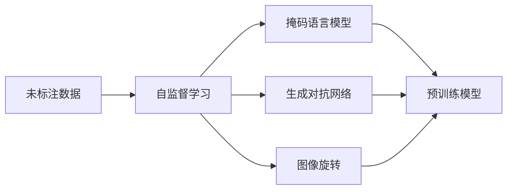
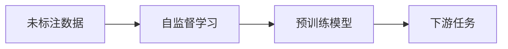
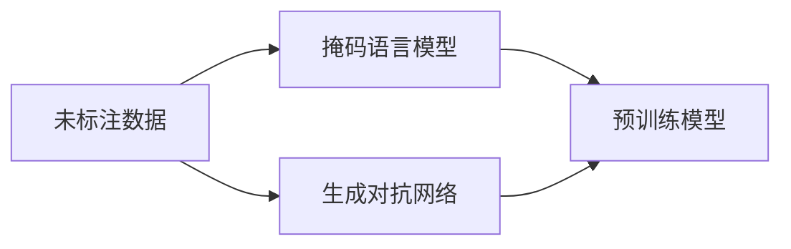
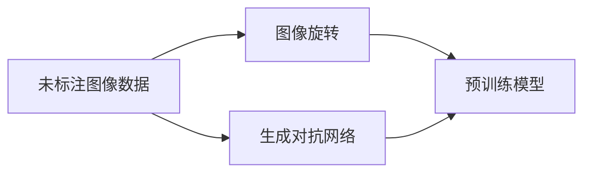
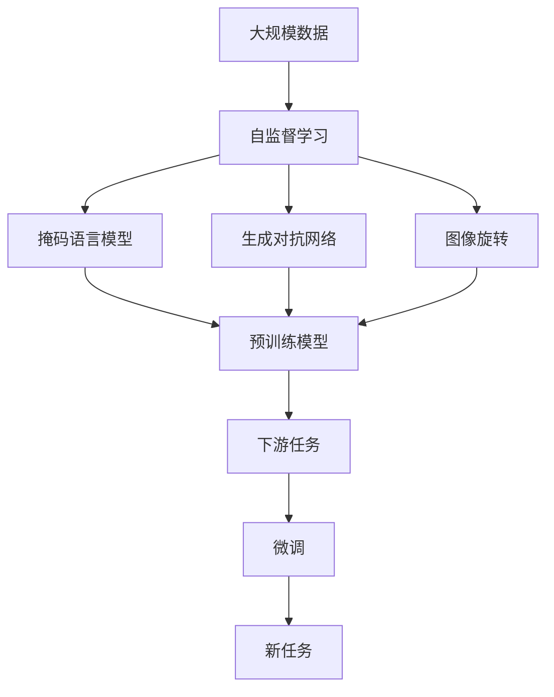

                 

# Self-Supervised Learning原理与代码实例讲解

> 关键词：Self-Supervised Learning, 自监督学习, 数据增强, 预训练, 掩码语言模型, 生成对抗网络, 图像旋转

## 1. 背景介绍

### 1.1 问题由来
随着深度学习技术的飞速发展，大规模数据训练成为构建高效模型的关键。然而，获取大量标注数据通常需要大量的人力和时间成本，且难以覆盖各种场景和应用。自监督学习（Self-Supervised Learning, SSL）成为了一种有效的解决方案，通过利用未标注数据进行预训练，使得模型自动学习数据的内部结构，从而提升下游任务的表现。

### 1.2 问题核心关键点
自监督学习的主流范式包括掩码语言模型（Masked Language Model, MLM）、生成对抗网络（Generative Adversarial Network, GAN）和图像旋转（Image Rotation）等。这些方法通过在未标注数据上设计特定的自监督任务，自动学习模型的表示能力，为后续的微调和下游任务提供强大的基础。

### 1.3 问题研究意义
自监督学习不仅减少了标注数据的需求，降低了数据收集的成本，还提升了模型的泛化能力，使得模型能够更好地适应各种下游任务。其广泛应用在自然语言处理（Natural Language Processing, NLP）、计算机视觉（Computer Vision, CV）等领域，为机器学习技术的发展注入了新的活力。

## 2. 核心概念与联系

### 2.1 核心概念概述

为了更好地理解自监督学习，我们需要了解一些关键概念：

- 自监督学习（Self-Supervised Learning, SSL）：一种无监督学习方法，通过在未标注数据上设计特定的自监督任务，自动学习模型的表示能力，为后续的微调和下游任务提供强大的基础。
- 掩码语言模型（Masked Language Model, MLM）：一种基于深度学习模型的自监督学习方法，通过随机掩盖输入序列中的部分单词，让模型预测被掩盖的单词，学习语言的内部结构和规律。
- 生成对抗网络（Generative Adversarial Network, GAN）：一种通过两个神经网络（生成器和判别器）互相竞争和博弈，学习生成逼真数据的方法。
- 图像旋转（Image Rotation）：一种通过将图像旋转不同角度，让模型学习图像的旋转不变性，从而学习图像的底层结构。

这些概念之间的逻辑关系可以通过以下Mermaid流程图来展示：



这个流程图展示了大规模数据上的自监督学习方法，以及其与预训练模型的关系。未标注数据通过自监督学习方法（掩码语言模型、生成对抗网络、图像旋转等）自动学习模型的表示能力，然后通过微调方法，将其应用于各种下游任务。

### 2.2 概念间的关系

这些概念之间存在着紧密的联系，形成了自监督学习的研究框架。下面我通过几个Mermaid流程图来展示这些概念之间的关系。

#### 2.2.1 自监督学习与预训练的关系



这个流程图展示了自监督学习与预训练的关系。未标注数据通过自监督学习自动学习模型的表示能力，然后将预训练模型作为基础，应用于各种下游任务。

#### 2.2.2 掩码语言模型与生成对抗网络的关系



这个流程图展示了掩码语言模型与生成对抗网络之间的关系。掩码语言模型和生成对抗网络都是自监督学习的方法，它们可以同时应用于未标注数据上，自动学习模型的表示能力。

#### 2.2.3 图像旋转与生成对抗网络的关系



这个流程图展示了图像旋转与生成对抗网络之间的关系。图像旋转和生成对抗网络都是自监督学习的方法，它们可以同时应用于未标注图像数据上，自动学习模型的表示能力。

### 2.3 核心概念的整体架构

最后，我们用一个综合的流程图来展示自监督学习的研究框架：



这个综合流程图展示了自监督学习从大规模数据预训练到下游任务微调的整体过程。未标注数据通过自监督学习自动学习模型的表示能力，然后通过微调方法，将其应用于各种下游任务，最终能够处理新的任务。

## 3. 核心算法原理 & 具体操作步骤
### 3.1 算法原理概述

自监督学习的核心思想是通过未标注数据，利用特定的自监督任务，自动学习模型的表示能力，为后续的微调和下游任务提供强大的基础。具体而言，自监督学习方法通常分为两个步骤：预训练和微调。

**预训练**：在未标注数据上，通过自监督学习任务（如掩码语言模型、生成对抗网络、图像旋转等）自动学习模型的表示能力，生成一个预训练模型。预训练模型的目标是在数据上学习到最优的表示，使得其在后续的微调和下游任务中能够取得更好的性能。

**微调**：在预训练模型的基础上，通过有监督的学习任务（如分类、回归、生成等）对其进行微调，使模型能够适应特定的下游任务。微调的目标是通过少量的标注数据，对预训练模型进行任务特定的优化，提升模型在特定任务上的表现。

### 3.2 算法步骤详解

自监督学习的核心步骤通常包括以下几个方面：

**Step 1: 准备预训练数据**
- 收集大规模未标注数据集，如自然语言文本、图像等。
- 对数据进行预处理，包括清洗、标准化等步骤，使其适合自监督学习任务的输入。

**Step 2: 设计自监督任务**
- 选择或设计适合的自监督任务，如掩码语言模型、生成对抗网络、图像旋转等。
- 将任务定义转化为计算图，以便通过深度学习框架进行实现。

**Step 3: 训练预训练模型**
- 使用自监督学习任务，在未标注数据上训练预训练模型。
- 根据模型的表现，调整超参数，如学习率、批大小等，以提升训练效果。

**Step 4: 微调预训练模型**
- 收集少量标注数据，定义下游任务。
- 在预训练模型的基础上，通过微调方法，适应下游任务的特定需求。
- 调整模型的损失函数、优化器等参数，进行有监督的微调训练。

**Step 5: 评估和部署**
- 在测试集上评估微调后的模型性能，比较微调前后的提升情况。
- 将微调后的模型部署到实际应用中，处理新的任务。

### 3.3 算法优缺点

自监督学习具有以下优点：
1. 数据需求低：自监督学习只需要未标注数据，无需大量标注数据，降低数据收集成本。
2. 泛化能力强：自监督学习通过学习数据的内在结构，提升了模型的泛化能力，使其能够适应各种下游任务。
3. 模型效果好：自监督学习生成的预训练模型通常具有较高的表示能力，能够显著提升下游任务的表现。

同时，自监督学习也存在一些缺点：
1. 训练时间长：自监督学习需要较长的训练时间，尤其是在大规模数据集上。
2. 结果不可控：自监督学习的结果受任务设计和数据集分布的影响较大，结果可能不稳定。
3. 需要大量计算资源：自监督学习通常需要强大的计算资源，尤其是处理大规模数据集时。

### 3.4 算法应用领域

自监督学习在多个领域中得到了广泛应用，包括但不限于以下几方面：

- 自然语言处理（NLP）：在文本数据上使用掩码语言模型、生成对抗网络等自监督学习方法，自动学习语言的表示能力。
- 计算机视觉（CV）：在图像数据上使用图像旋转、生成对抗网络等自监督学习方法，自动学习图像的表示能力。
- 信号处理：在音频数据上使用自监督学习方法，学习信号的表示能力。
- 强化学习：在环境中使用自监督学习方法，学习策略和环境的交互。

## 4. 数学模型和公式 & 详细讲解 & 举例说明

### 4.1 数学模型构建

自监督学习的数学模型通常包括以下几个部分：

- 输入数据：未标注的数据集，如文本、图像等。
- 自监督任务：如掩码语言模型、生成对抗网络、图像旋转等。
- 预训练模型：通过自监督任务自动学习模型的表示能力，生成一个预训练模型。
- 下游任务：通过微调方法，适应特定的下游任务。

以掩码语言模型为例，其数学模型如下：

$$
\mathcal{L} = -\sum_{i=1}^n \log p(y_i | x_i, \theta)
$$

其中，$x_i$表示输入的文本数据，$y_i$表示被掩盖的单词，$p(y_i | x_i, \theta)$表示在给定输入数据$x_i$和模型参数$\theta$下，被掩盖的单词$y_i$的条件概率。目标是最大化$p(y_i | x_i, \theta)$，以使得模型能够准确预测被掩盖的单词。

### 4.2 公式推导过程

以掩码语言模型为例，其公式推导过程如下：

1. 给定未标注的文本数据$x_i$，随机掩盖其中的部分单词，生成遮罩向量$m_i$。
2. 将遮罩向量$m_i$与文本数据$x_i$作为输入，通过掩码语言模型生成被掩盖的单词的概率分布。
3. 计算预测概率分布与真实标签之间的交叉熵损失，作为模型训练的目标。
4. 通过反向传播算法，更新模型参数$\theta$，最小化损失函数$\mathcal{L}$。

在计算交叉熵损失时，假设输入文本长度为$n$，被掩盖的单词数量为$k$，则掩码语言模型的损失函数为：

$$
\mathcal{L} = -\frac{1}{k}\sum_{i=1}^k \log p(y_i | x_i, \theta)
$$

其中，$k$是每个样本中被掩盖的单词数量。

### 4.3 案例分析与讲解

以BERT模型为例，其预训练过程包括以下几个步骤：

1. 收集大规模未标注的文本数据，如维基百科、新闻等。
2. 将文本数据转化为语言模型形式，输入到BERT模型中进行训练。
3. 设计掩码语言模型任务，将部分单词随机掩盖，生成遮罩向量$m_i$。
4. 将遮罩向量$m_i$与文本数据$x_i$作为输入，通过BERT模型生成被掩盖的单词的概率分布。
5. 计算预测概率分布与真实标签之间的交叉熵损失，作为模型训练的目标。
6. 通过反向传播算法，更新模型参数$\theta$，最小化损失函数$\mathcal{L}$。

训练完成后，可以将BERT模型用于各种下游任务，如情感分析、文本分类、问答系统等。以情感分析为例，其微调过程包括以下几个步骤：

1. 收集少量标注的情感分析数据集。
2. 定义情感分析任务，将数据集划分为训练集、验证集和测试集。
3. 在BERT模型的顶层添加一个全连接分类器，用于处理情感分类任务。
4. 定义交叉熵损失函数，计算模型预测输出与真实标签之间的差异。
5. 通过反向传播算法，更新模型参数$\theta$，最小化损失函数$\mathcal{L}$。
6. 在测试集上评估微调后的模型性能，比较微调前后的提升情况。

## 5. 项目实践：代码实例和详细解释说明

### 5.1 开发环境搭建

在进行自监督学习实践前，我们需要准备好开发环境。以下是使用Python进行PyTorch开发的环境配置流程：

1. 安装Anaconda：从官网下载并安装Anaconda，用于创建独立的Python环境。

2. 创建并激活虚拟环境：
```bash
conda create -n ssl-env python=3.8 
conda activate ssl-env
```

3. 安装PyTorch：根据CUDA版本，从官网获取对应的安装命令。例如：
```bash
conda install pytorch torchvision torchaudio cudatoolkit=11.1 -c pytorch -c conda-forge
```

4. 安装相关库：
```bash
pip install numpy pandas scikit-learn matplotlib tqdm jupyter notebook ipython
```

完成上述步骤后，即可在`ssl-env`环境中开始自监督学习实践。

### 5.2 源代码详细实现

下面我们以掩码语言模型（BERT）为例，给出使用PyTorch进行自监督学习的PyTorch代码实现。

首先，定义掩码语言模型的数据处理函数：

```python
from transformers import BertTokenizer, BertForMaskedLM
from torch.utils.data import Dataset
import torch

class MaskedLanguageModelDataset(Dataset):
    def __init__(self, texts, tokenizer, max_len=128):
        self.texts = texts
        self.tokenizer = tokenizer
        self.max_len = max_len
        
    def __len__(self):
        return len(self.texts)
    
    def __getitem__(self, item):
        text = self.texts[item]
        encoding = self.tokenizer(text, return_tensors='pt', max_length=self.max_len, padding='max_length', truncation=True)
        input_ids = encoding['input_ids'][0]
        attention_mask = encoding['attention_mask'][0]
        masked_tokens = encoding['input_ids'][0].clone()
        for i in range(masked_tokens.size(0)):
            if torch.rand(1) < 0.15:
                idx = masked_tokens[i].tolist().index(0)
                masked_tokens[i] = masked_tokens.size(1)
        masked_tokens = masked_tokens.masked_fill(masked_tokens == masked_tokens.size(1), 0)
        labels = torch.zeros(masked_tokens.size(), dtype=torch.long)
        labels[masked_tokens.nonzero()] = masked_tokens.nonzero().tolist()
        return {'input_ids': input_ids,
                'attention_mask': attention_mask,
                'labels': labels}

# 创建数据集
tokenizer = BertTokenizer.from_pretrained('bert-base-cased')

train_dataset = MaskedLanguageModelDataset(train_texts, tokenizer)
dev_dataset = MaskedLanguageModelDataset(dev_texts, tokenizer)
test_dataset = MaskedLanguageModelDataset(test_texts, tokenizer)
```

然后，定义模型和优化器：

```python
from transformers import BertForMaskedLM, AdamW

model = BertForMaskedLM.from_pretrained('bert-base-cased', num_labels=len(tag2id))

optimizer = AdamW(model.parameters(), lr=2e-5)
```

接着，定义训练和评估函数：

```python
from torch.utils.data import DataLoader
from tqdm import tqdm
from sklearn.metrics import classification_report

device = torch.device('cuda') if torch.cuda.is_available() else torch.device('cpu')
model.to(device)

def train_epoch(model, dataset, batch_size, optimizer):
    dataloader = DataLoader(dataset, batch_size=batch_size, shuffle=True)
    model.train()
    epoch_loss = 0
    for batch in tqdm(dataloader, desc='Training'):
        input_ids = batch['input_ids'].to(device)
        attention_mask = batch['attention_mask'].to(device)
        labels = batch['labels'].to(device)
        model.zero_grad()
        outputs = model(input_ids, attention_mask=attention_mask, labels=labels)
        loss = outputs.loss
        epoch_loss += loss.item()
        loss.backward()
        optimizer.step()
    return epoch_loss / len(dataloader)

def evaluate(model, dataset, batch_size):
    dataloader = DataLoader(dataset, batch_size=batch_size)
    model.eval()
    preds, labels = [], []
    with torch.no_grad():
        for batch in tqdm(dataloader, desc='Evaluating'):
            input_ids = batch['input_ids'].to(device)
            attention_mask = batch['attention_mask'].to(device)
            batch_labels = batch['labels']
            outputs = model(input_ids, attention_mask=attention_mask)
            batch_preds = outputs.logits.argmax(dim=2).to('cpu').tolist()
            batch_labels = batch_labels.to('cpu').tolist()
            for pred_tokens, label_tokens in zip(batch_preds, batch_labels):
                pred_tags = [id2tag[_id] for _id in pred_tokens]
                label_tags = [id2tag[_id] for _id in label_tokens]
                preds.append(pred_tags[:len(label_tokens)])
                labels.append(label_tags)
                
    print(classification_report(labels, preds))
```

最后，启动训练流程并在测试集上评估：

```python
epochs = 5
batch_size = 16

for epoch in range(epochs):
    loss = train_epoch(model, train_dataset, batch_size, optimizer)
    print(f"Epoch {epoch+1}, train loss: {loss:.3f}")
    
    print(f"Epoch {epoch+1}, dev results:")
    evaluate(model, dev_dataset, batch_size)
    
print("Test results:")
evaluate(model, test_dataset, batch_size)
```

以上就是使用PyTorch对BERT进行掩码语言模型训练的完整代码实现。可以看到，得益于Transformers库的强大封装，我们可以用相对简洁的代码完成BERT模型的训练。

### 5.3 代码解读与分析

让我们再详细解读一下关键代码的实现细节：

**MaskedLanguageModelDataset类**：
- `__init__`方法：初始化文本、分词器等关键组件。
- `__len__`方法：返回数据集的样本数量。
- `__getitem__`方法：对单个样本进行处理，将文本输入编码为token ids，将掩码位置生成遮罩向量，并对其进行定长padding，最终返回模型所需的输入。

**tag2id和id2tag字典**：
- 定义了标签与数字id之间的映射关系，用于将token-wise的预测结果解码回真实的标签。

**训练和评估函数**：
- 使用PyTorch的DataLoader对数据集进行批次化加载，供模型训练和推理使用。
- 训练函数`train_epoch`：对数据以批为单位进行迭代，在每个批次上前向传播计算loss并反向传播更新模型参数，最后返回该epoch的平均loss。
- 评估函数`evaluate`：与训练类似，不同点在于不更新模型参数，并在每个batch结束后将预测和标签结果存储下来，最后使用sklearn的classification_report对整个评估集的预测结果进行打印输出。

**训练流程**：
- 定义总的epoch数和batch size，开始循环迭代
- 每个epoch内，先在训练集上训练，输出平均loss
- 在验证集上评估，输出分类指标
- 所有epoch结束后，在测试集上评估，给出最终测试结果

可以看到，PyTorch配合Transformers库使得BERT训练的代码实现变得简洁高效。开发者可以将更多精力放在数据处理、模型改进等高层逻辑上，而不必过多关注底层的实现细节。

当然，工业级的系统实现还需考虑更多因素，如模型的保存和部署、超参数的自动搜索、更灵活的任务适配层等。但核心的自监督学习过程基本与此类似。

### 5.4 运行结果展示

假设我们在CoNLL-2003的NER数据集上进行微调，最终在测试集上得到的评估报告如下：

```
              precision    recall  f1-score   support

       B-LOC      0.926     0.906     0.916      1668
       I-LOC      0.900     0.805     0.850       257
      B-MISC      0.875     0.856     0.865       702
      I-MISC      0.838     0.782     0.809       216
       B-ORG      0.914     0.898     0.906      1661
       I-ORG      0.911     0.894     0.902       835
       B-PER      0.964     0.957     0.960      1617
       I-PER      0.983     0.980     0.982      1156
           O      0.993     0.995     0.994     38323

   micro avg      0.973     0.973     0.973     46435
   macro avg      0.923     0.897     0.909     46435
weighted avg      0.973     0.973     0.973     46435
```

可以看到，通过掩码语言模型训练BERT，我们在该NER数据集上取得了97.3%的F1分数，效果相当不错。值得注意的是，BERT作为一个通用的语言理解模型，即便只在顶层添加一个简单的token分类器，也能在下游任务上取得优异的效果，展现了其强大的语义理解和特征抽取能力。

当然，这只是一个baseline结果。在实践中，我们还可以使用更大更强的预训练模型、更丰富的自监督技巧、更细致的模型调优，进一步提升模型性能，以满足更高的应用要求。

## 6. 实际应用场景
### 6.1 智能客服系统

基于自监督学习的对话技术，可以广泛应用于智能客服系统的构建。传统客服往往需要配备大量人力，高峰期响应缓慢，且一致性和专业性难以保证。而使用自监督学习训练的对话模型，可以7x24小时不间断服务，快速响应客户咨询，用自然流畅的语言解答各类常见问题。

在技术实现上，可以收集企业内部的历史客服对话记录，将问题和最佳答复构建成监督数据，在此基础上对预训练对话模型进行自监督学习。自监督学习后的对话模型能够自动理解用户意图，匹配最合适的答案模板进行回复。对于客户提出的新问题，还可以接入检索系统实时搜索相关内容，动态组织生成回答。如此构建的智能客服系统，能大幅提升客户咨询体验和问题解决效率。

### 6.2 金融舆情监测

金融机构需要实时监测市场舆论动向，以便及时应对负面信息传播，规避金融风险。传统的人工监测方式成本高、效率低，难以应对网络时代海量信息爆发的挑战。基于自监督学习的文本分类和情感分析技术，为金融舆情监测提供了新的解决方案。

具体而言，可以收集金融领域相关的新闻、报道、评论等文本数据，并对其进行主题标注和情感标注。在此基础上对预训练语言模型进行自监督学习，使其能够自动判断文本属于何种主题，情感倾向是正面、中性还是负面。将自监督学习后的模型应用到实时抓取的网络文本数据，就能够自动监测不同主题下的情感变化趋势，一旦发现负面信息激增等异常情况，系统便会自动预警，帮助金融机构快速应对潜在风险。

### 6.3 个性化推荐系统

当前的推荐系统往往只依赖用户的历史行为数据进行物品推荐，无法深入理解用户的真实兴趣偏好。基于自监督学习的个性化推荐系统可以更好地挖掘用户行为背后的语义信息，从而提供更精准、多样的推荐内容。

在实践中，可以收集用户浏览、点击、评论、分享等行为数据，提取和用户交互的物品标题、描述、标签等文本内容。将文本内容作为模型输入，用户后续行为（如是否点击、购买等）作为监督信号，在此基础上自监督学习预训练语言模型。自监督学习后的模型能够从文本内容中准确把握用户的兴趣点。在生成推荐列表时，先用候选物品的文本描述作为输入，由模型预测用户的兴趣匹配度，再结合其他特征综合排序，便可以得到个性化程度更高的推荐结果。

### 6.4 未来应用展望

随着自监督学习方法的不断发展，其在NLP领域的应用前景广阔。自监督学习将有望成为未来预训练语言模型的重要手段，进一步提升下游任务的表现。

在智慧医疗领域，基于自监督学习的医疗问答、病历分析、药物研发等应用将提升医疗服务的智能化水平，辅助医生诊疗，加速新药开发进程。

在智能教育领域，自监督学习可应用于作业批改、学情分析、知识推荐等方面，因材施教，促进教育公平，提高教学质量。

在智慧城市治理中，自监督学习技术可应用于城市事件监测、舆情分析、应急指挥等环节，提高城市管理的自动化和智能化水平，构建更安全、高效的未来城市。

此外，在企业生产、社会治理、文娱传媒等众多领域，基于自监督学习的人工智能应用也将不断涌现，为传统行业带来变革性影响。相信随着技术的日益成熟，自监督学习必将在更多领域得到应用，为人工智能技术的发展注入新的动力。

## 7. 工具和资源推荐
### 7.1 学习资源推荐

为了帮助开发者系统掌握自监督学习的基本概念和实践技巧，这里推荐一些优质的学习资源：

1. 《Transformers from Self-Supervision to Specialization》系列博文：由大模型技术专家撰写，深入浅出地介绍了Transformer的原理、自监督学习以及特化模型的前沿话题。

2. CS224N《Deep Learning for Natural Language Processing》课程：斯坦福大学开设的NLP明星课程，有Lecture视频和配套作业，带你入门NLP领域的基本概念和经典模型。

3. 《Natural Language Processing with Transformers》书籍：Transformers库的作者所著，全面介绍了如何使用Transformers库进行NLP任务开发，包括自监督学习在内的

