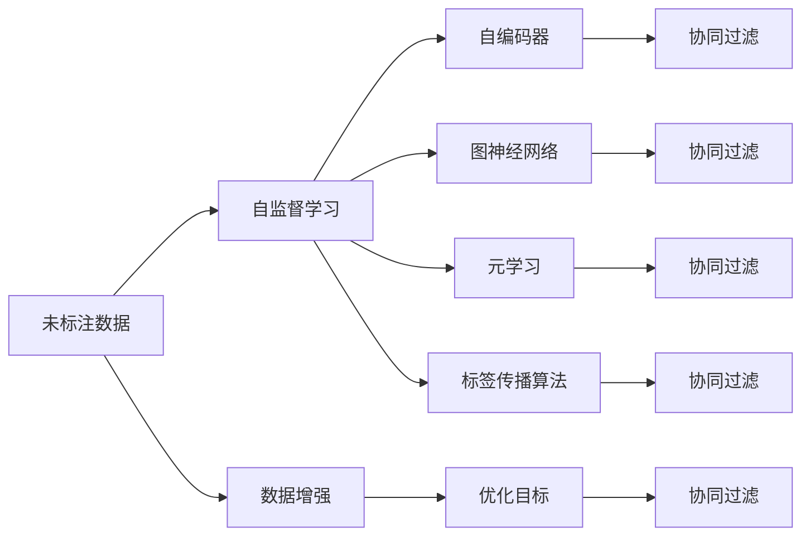
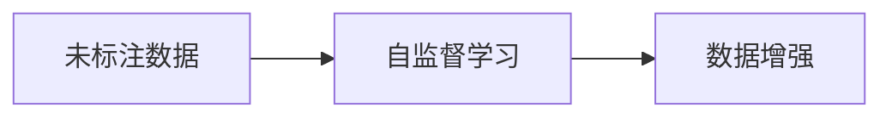
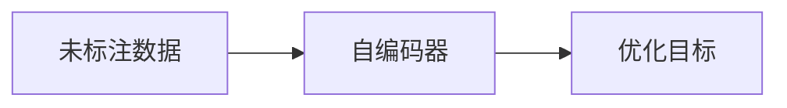
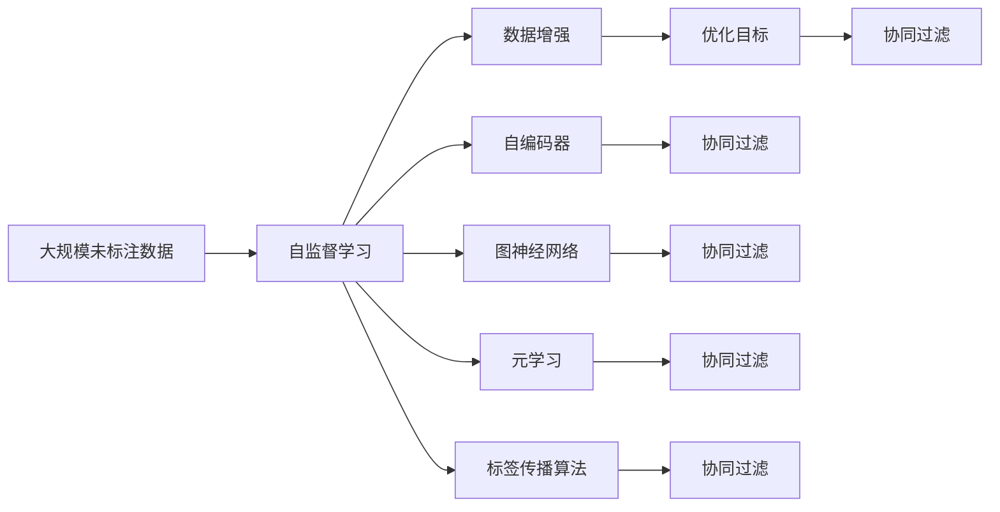

                 

# Semi-supervised Learning原理与代码实例讲解

> 关键词：半监督学习, 数据增强, 自编码器, 图神经网络, 元学习, 标签传播算法, 优化目标, 协同过滤, 推荐系统

## 1. 背景介绍

### 1.1 问题由来
在实际应用中，获取高质量标注数据成本高昂且耗时。这导致许多任务只能依赖有限量的标注数据。在这种情况下，半监督学习（Semi-supervised Learning，SSL）成为一个重要的研究方向，它允许模型在利用少量标注数据的同时，利用大规模未标注数据提高模型性能。

半监督学习旨在最大化利用未标注数据的潜力，同时充分利用有限标注数据提供的有价值信息。在SSL中，模型既利用了数据的未标注部分（无标签数据），又利用了标注数据来指导模型学习。

### 1.2 问题核心关键点
半监督学习的核心在于如何有效利用未标注数据，同时避免在训练中过拟合标注数据。以下是SSL的几个核心关键点：

1. 自监督学习：利用未标注数据的特性（如语言模型、图像模型等），在未标注数据上训练模型。

2. 数据增强：通过数据增强技术，对未标注数据进行各种变换，丰富数据样本多样性。

3. 自编码器：使用自编码器对未标注数据进行重建，利用重构误差作为正则化项，加强对未标注数据的利用。

4. 图神经网络：将未标注数据组织成图结构，通过图卷积网络（GCN）或图自编码器（GAE）等模型进行学习。

5. 元学习：通过少量标注数据训练生成器，生成更多的未标注数据，供模型学习。

6. 标签传播算法：通过预测标签的置信度，逐步传播标签给未标注数据。

7. 优化目标：在SSL中，目标通常是最大化未标注数据上的性能，同时最小化标注数据上的错误率。

8. 协同过滤：在推荐系统中，利用用户和物品的评分数据和用户兴趣的相似性，进行半监督推荐。

这些关键点共同构成了半监督学习的核心，通过它们的有机结合，SSL在实际应用中取得了显著的效果。

### 1.3 问题研究意义
半监督学习在处理大规模数据集时表现出色，特别适用于标注数据稀缺的情况，如自然语言处理、计算机视觉、推荐系统等领域。SSL不仅降低了标注数据的成本，提高了模型泛化能力，还减少了对标注数据分布的依赖，具有广泛的应用前景。

## 2. 核心概念与联系

### 2.1 核心概念概述

为更好地理解半监督学习的核心概念，本节将介绍几个密切相关的核心概念：

- 自监督学习(Self-supervised Learning)：利用未标注数据的特性，如语言模型、自编码器、对比学习等，在未标注数据上训练模型。

- 数据增强(Data Augmentation)：通过对未标注数据进行各种变换，如随机裁剪、旋转、翻转等，丰富数据样本的多样性。

- 自编码器(Autencoder)：将数据压缩为低维表示，并尝试从低维表示重建原始数据，利用重构误差作为正则化项，加强对未标注数据的利用。

- 图神经网络(Graph Neural Network)：将未标注数据组织成图结构，通过图卷积网络（GCN）或图自编码器（GAE）等模型进行学习。

- 元学习(Meta Learning)：通过少量标注数据训练生成器，生成更多的未标注数据，供模型学习。

- 标签传播算法(Labeled Propagation Algorithm)：通过预测标签的置信度，逐步传播标签给未标注数据。

- 优化目标(Optimization Objective)：在SSL中，目标通常是最大化未标注数据上的性能，同时最小化标注数据上的错误率。

- 协同过滤(Collaborative Filtering)：在推荐系统中，利用用户和物品的评分数据和用户兴趣的相似性，进行半监督推荐。

这些核心概念之间的逻辑关系可以通过以下Mermaid流程图来展示：



这个流程图展示了大语言模型微调过程中各个核心概念的关系和作用：

1. 未标注数据通过自监督学习被用来训练模型。
2. 自监督学习模型可以利用数据增强技术来丰富数据样本多样性。
3. 自编码器在未标注数据上训练，利用重构误差作为正则化项。
4. 图神经网络将未标注数据组织成图结构，进行图卷积或自编码。
5. 元学习通过少量标注数据训练生成器，生成更多未标注数据。
6. 标签传播算法逐步将标签传播给未标注数据。
7. 优化目标最大化未标注数据性能，最小化标注数据错误率。
8. 协同过滤利用未标注数据和少量标注数据进行推荐。

### 2.2 概念间的关系

这些核心概念之间存在着紧密的联系，形成了半监督学习的完整生态系统。下面我们通过几个Mermaid流程图来展示这些概念之间的关系。

#### 2.2.1 自监督学习与数据增强的关系



这个流程图展示了自监督学习和数据增强的关系。在自监督学习中，数据增强是一种常用的技术，用于丰富数据样本的多样性。

#### 2.2.2 自编码器与优化目标的关系



这个流程图展示了自编码器与优化目标的关系。自编码器通过重构误差作为正则化项，加强对未标注数据的利用，而优化目标是模型需要达成的综合指标。

#### 2.2.3 图神经网络与协同过滤的关系


这个流程图展示了图神经网络与协同过滤的关系。图神经网络将未标注数据组织成图结构，利用图卷积或自编码，用于协同过滤推荐系统。

### 2.3 核心概念的整体架构

最后，我们用一个综合的流程图来展示这些核心概念在大语言模型微调过程中的整体架构：



这个综合流程图展示了从大规模未标注数据到协同过滤推荐系统的完整过程。未标注数据通过自监督学习、数据增强、自编码器、图神经网络、元学习和标签传播算法被用于训练模型。协同过滤推荐系统通过最大化未标注数据性能和最小化标注数据错误率，实现推荐目标。

## 3. 核心算法原理 & 具体操作步骤
### 3.1 算法原理概述

半监督学习的目标是在标注数据和未标注数据上训练模型，同时最大化未标注数据的性能，最小化标注数据的错误率。具体来说，SSL的目标可以表示为：

$$
\min_{\theta} \left(\frac{1}{N}\sum_{i=1}^N \ell(y_i, f(x_i; \theta)) + \alpha \cdot \frac{1}{M}\sum_{j=1}^M \ell(y_j, g(z_j; \theta))\right)
$$

其中，$\theta$ 为模型参数，$\ell$ 为损失函数，$y$ 为标注标签，$x$ 为标注数据，$z$ 为未标注数据，$f$ 为标注数据上的预测函数，$g$ 为未标注数据上的预测函数，$N$ 为标注数据数量，$M$ 为未标注数据数量，$\alpha$ 为未标注数据的权重。

在实践中，我们通常使用基于梯度的优化算法（如SGD、Adam等）来近似求解上述最优化问题。设 $\eta$ 为学习率，则参数的更新公式为：

$$
\theta \leftarrow \theta - \eta \nabla_{\theta}\mathcal{L}(\theta) - \eta\lambda\theta
$$

其中 $\nabla_{\theta}\mathcal{L}(\theta)$ 为损失函数对参数 $\theta$ 的梯度，可通过反向传播算法高效计算。

### 3.2 算法步骤详解

半监督学习的训练一般包括以下几个关键步骤：

**Step 1: 准备数据集**
- 收集标注数据集 $D=\{(x_i, y_i)\}_{i=1}^N$ 和未标注数据集 $Z=\{z_j\}_{j=1}^M$。
- 将未标注数据 $z_j$ 映射为模型的输入特征 $x_j$。

**Step 2: 定义模型**
- 选择合适的模型 $f$ 和 $g$，如线性模型、深度神经网络等。
- 定义损失函数 $\ell$，如交叉熵、均方误差等。
- 选择优化算法及其参数，如Adam、SGD等。

**Step 3: 设置超参数**
- 选择合适的学习率、批大小、迭代轮数等。
- 设置未标注数据的权重 $\alpha$。
- 设置正则化技术及强度，如权重衰减、Dropout、Early Stopping等。

**Step 4: 执行梯度训练**
- 将训练集数据分批次输入模型，前向传播计算损失函数。
- 反向传播计算参数梯度，根据设定的优化算法和学习率更新模型参数。
- 周期性在验证集上评估模型性能，根据性能指标决定是否触发 Early Stopping。
- 重复上述步骤直到满足预设的迭代轮数或 Early Stopping 条件。

**Step 5: 测试和部署**
- 在测试集上评估模型 $f$ 和 $g$ 的性能，对比标注数据和未标注数据上的表现。
- 使用微调后的模型对新样本进行推理预测，集成到实际的应用系统中。
- 持续收集新的数据，定期重新微调模型，以适应数据分布的变化。

以上是半监督学习的一般流程。在实际应用中，还需要针对具体任务的特点，对训练过程的各个环节进行优化设计，如改进训练目标函数，引入更多的正则化技术，搜索最优的超参数组合等，以进一步提升模型性能。

### 3.3 算法优缺点

半监督学习具有以下优点：

1. 利用未标注数据：半监督学习能够利用大规模未标注数据，从而提高模型的泛化能力和性能。

2. 降低标注成本：在标注数据稀缺的情况下，半监督学习能够显著降低标注成本，提高模型效率。

3. 提升模型泛化能力：半监督学习能够提高模型对新数据的适应能力，减少过拟合风险。

4. 促进新数据采集：半监督学习能够激发新数据采集的兴趣，推动标注数据质量的提升。

同时，半监督学习也存在以下局限性：

1. 对未标注数据质量依赖高：未标注数据质量的好坏直接影响了SSL的效果。

2. 计算成本高：半监督学习需要大量的计算资源，特别是在训练过程中。

3. 结果不稳定性：SSL模型的性能依赖于数据和模型的选择，结果可能不稳定。

4. 缺乏理论支持：目前SSL的许多算法和理论研究还不够完善，缺乏严格的理论支持。

尽管存在这些局限性，但半监督学习仍在大规模数据集和标注数据稀缺的任务中展现了强大的潜力，成为许多NLP和推荐系统中的重要技术。

### 3.4 算法应用领域

半监督学习在以下几个领域中具有广泛的应用：

- 自然语言处理：文本分类、情感分析、命名实体识别、机器翻译等。通过未标注数据和少量标注数据进行模型训练，获得更好的性能。

- 计算机视觉：图像分类、目标检测、图像生成等。利用未标注图像数据进行预训练，提升模型性能。

- 推荐系统：协同过滤、基于内容的推荐、标签推荐等。利用用户和物品的评分数据，提升推荐效果。

- 语音识别：语音转文本、语音合成等。通过未标注音频数据进行预训练，提升模型性能。

- 医学影像：疾病诊断、图像分割等。利用未标注医学影像数据进行预训练，提升模型性能。

除了上述这些经典任务外，半监督学习还被创新性地应用到更多场景中，如遥感图像分析、地质勘探、金融分析等，为这些领域的技术发展带来了新的突破。

## 4. 数学模型和公式 & 详细讲解  
### 4.1 数学模型构建

本节将使用数学语言对半监督学习的基本模型进行严格刻画。

记标注数据集为 $D=\{(x_i, y_i)\}_{i=1}^N$，未标注数据集为 $Z=\{z_j\}_{j=1}^M$。模型的输入特征映射为 $x_j$，对应未标注数据的预测结果为 $g(z_j; \theta)$，标注数据的预测结果为 $f(x_i; \theta)$。模型的损失函数为：

$$
\mathcal{L}(\theta) = \frac{1}{N}\sum_{i=1}^N \ell(y_i, f(x_i; \theta)) + \alpha \cdot \frac{1}{M}\sum_{j=1}^M \ell(y_j, g(z_j; \theta))
$$

其中，$\ell$ 为损失函数，$y$ 为标注标签，$x$ 为标注数据，$z$ 为未标注数据，$f$ 为标注数据上的预测函数，$g$ 为未标注数据上的预测函数，$N$ 为标注数据数量，$M$ 为未标注数据数量，$\alpha$ 为未标注数据的权重。

### 4.2 公式推导过程

以下我们以二分类任务为例，推导半监督学习的交叉熵损失函数及其梯度的计算公式。

假设模型在输入 $x$ 上的输出为 $\hat{y}=M_{\theta}(x) \in [0,1]$，表示样本属于正类的概率。真实标签 $y \in \{0,1\}$。则二分类交叉熵损失函数定义为：

$$
\ell(M_{\theta}(x),y) = -[y\log \hat{y} + (1-y)\log (1-\hat{y})]
$$

将其代入经验风险公式，得：

$$
\mathcal{L}(\theta) = \frac{1}{N}\sum_{i=1}^N [y_i\log f(x_i; \theta)+(1-y_i)\log(1-f(x_i; \theta))] + \alpha \cdot \frac{1}{M}\sum_{j=1}^M [y_j\log g(z_j; \theta)+(1-y_j)\log(1-g(z_j; \theta))]
$$

根据链式法则，损失函数对参数 $\theta$ 的梯度为：

$$
\frac{\partial \mathcal{L}(\theta)}{\partial \theta_k} = \frac{1}{N}\sum_{i=1}^N (\frac{y_i}{f(x_i; \theta)}-\frac{1-y_i}{1-f(x_i; \theta)}) \frac{\partial f(x_i; \theta)}{\partial \theta_k} + \alpha \cdot \frac{1}{M}\sum_{j=1}^M (\frac{y_j}{g(z_j; \theta)}-\frac{1-y_j}{1-g(z_j; \theta)}) \frac{\partial g(z_j; \theta)}{\partial \theta_k}
$$

其中 $\frac{\partial f(x_i; \theta)}{\partial \theta_k}$ 和 $\frac{\partial g(z_j; \theta)}{\partial \theta_k}$ 可进一步递归展开，利用自动微分技术完成计算。

在得到损失函数的梯度后，即可带入参数更新公式，完成模型的迭代优化。重复上述过程直至收敛，最终得到适应未标注数据和标注数据的模型参数 $\theta^*$。

## 5. 项目实践：代码实例和详细解释说明
### 5.1 开发环境搭建

在进行半监督学习实践前，我们需要准备好开发环境。以下是使用Python进行PyTorch开发的环境配置流程：

1. 安装Anaconda：从官网下载并安装Anaconda，用于创建独立的Python环境。

2. 创建并激活虚拟环境：
```bash
conda create -n pytorch-env python=3.8 
conda activate pytorch-env
```

3. 安装PyTorch：根据CUDA版本，从官网获取对应的安装命令。例如：
```bash
conda install pytorch torchvision torchaudio cudatoolkit=11.1 -c pytorch -c conda-forge
```

4. 安装Transformers库：
```bash
pip install transformers
```

5. 安装各类工具包：
```bash
pip install numpy pandas scikit-learn matplotlib tqdm jupyter notebook ipython
```

完成上述步骤后，即可在`pytorch-env`环境中开始半监督学习实践。

### 5.2 源代码详细实现

这里我们以半监督学习在文本分类任务中的应用为例，给出使用Transformers库对BERT模型进行半监督学习的PyTorch代码实现。

首先，定义半监督学习数据处理函数：

```python
from transformers import BertTokenizer
from torch.utils.data import Dataset
import torch

class SemiSupervisedDataset(Dataset):
    def __init__(self, texts, labels, tokenizer, max_len=128, alpha=0.5):
        self.texts = texts
        self.labels = labels
        self.tokenizer = tokenizer
        self.max_len = max_len
        self.alpha = alpha
        
    def __len__(self):
        return len(self.texts)
    
    def __getitem__(self, item):
        text = self.texts[item]
        label = self.labels[item]
        
        encoding = self.tokenizer(text, return_tensors='pt', max_length=self.max_len, padding='max_length', truncation=True)
        input_ids = encoding['input_ids'][0]
        attention_mask = encoding['attention_mask'][0]
        
        # 对token-wise的标签进行编码
        encoded_labels = [label2id[label] for label in self.labels] 
        encoded_labels.extend([label2id['O']] * (self.max_len - len(encoded_labels)))
        labels = torch.tensor(encoded_labels, dtype=torch.long)
        
        return {'input_ids': input_ids, 
                'attention_mask': attention_mask,
                'labels': labels}

# 标签与id的映射
label2id = {'O': 0, 'B-Class': 1, 'I-Class': 2}
id2label = {v: k for k, v in label2id.items()}

# 创建dataset
tokenizer = BertTokenizer.from_pretrained('bert-base-cased')

train_dataset = SemiSupervisedDataset(train_texts, train_labels, tokenizer)
dev_dataset = SemiSupervisedDataset(dev_texts, dev_labels, tokenizer)
test_dataset = SemiSupervisedDataset(test_texts, test_labels, tokenizer)
```

然后，定义模型和优化器：

```python
from transformers import BertForTokenClassification, AdamW

model = BertForTokenClassification.from_pretrained('bert-base-cased', num_labels=len(label2id))

optimizer = AdamW(model.parameters(), lr=2e-5)
```

接着，定义训练和评估函数：

```python
from torch.utils.data import DataLoader
from tqdm import tqdm
from sklearn.metrics import classification_report

device = torch.device('cuda') if torch.cuda.is_available() else torch.device('cpu')
model.to(device)

def train_epoch(model, dataset, batch_size, optimizer, alpha):
    dataloader = DataLoader(dataset, batch_size=batch_size, shuffle=True)
    model.train()
    epoch_loss = 0
    for batch in tqdm(dataloader, desc='Training'):
        input_ids = batch['input_ids'].to(device)
        attention_mask = batch['attention_mask'].to(device)
        labels = batch['labels'].to(device)
        model.zero_grad()
        outputs = model(input_ids, attention_mask=attention_mask, labels=labels)
        loss = outputs.loss
        epoch_loss += loss.item()
        loss.backward()
        optimizer.step()
    return epoch_loss / len(dataloader)

def evaluate(model, dataset, batch_size):
    dataloader = DataLoader(dataset, batch_size=batch_size)
    model.eval()
    preds, labels = [], []
    with torch.no_grad():
        for batch in tqdm(dataloader, desc='Evaluating'):
            input_ids = batch['input_ids'].to(device)
            attention_mask = batch['attention_mask'].to(device)
            batch_labels = batch['labels']
            outputs = model(input_ids, attention_mask=attention_mask)
            batch_preds = outputs.logits.argmax(dim=2).to('cpu').tolist()
            batch_labels = batch_labels.to('cpu').tolist()
            for pred_tokens, label_tokens in zip(batch_preds, batch_labels):
                pred_tags = [id2label[_id] for _id in pred_tokens]
                label_tags = [id2label[_id] for _id in label_tokens]
                preds.append(pred_tags[:len(label_tokens)])
                labels.append(label_tags)
                
    print(classification_report(labels, preds))
```

最后，启动训练流程并在测试集上评估：

```python
epochs = 5
batch_size = 16
alpha = 0.5

for epoch in range(epochs):
    loss = train_epoch(model, train_dataset, batch_size, optimizer, alpha)
    print(f"Epoch {epoch+1}, train loss: {loss:.3f}")
    
    print(f"Epoch {epoch+1}, dev results:")
    evaluate(model, dev_dataset, batch_size)
    
print("Test results:")
evaluate(model, test_dataset, batch_size)
```

以上就是使用PyTorch对BERT进行半监督学习文本分类任务微调的完整代码实现。可以看到，得益于Transformers库的强大封装，我们可以用相对简洁的代码完成BERT模型的加载和微调。

### 5.3 代码解读与分析

让我们再详细解读一下关键代码的实现细节：

**SemiSupervisedDataset类**：
- `__init__`方法：初始化文本、标签、分词器等关键组件。
- `__len__`方法：返回数据集的样本数量。
- `__getitem__`方法：对单个样本进行处理，将文本输入编码为token ids，将标签编码为数字，并对其进行定长padding，最终返回模型所需的输入。

**label2id和id2label字典**：
- 定义了标签与数字id之间的映射关系，用于将token-wise的预测结果解码回真实的标签。

**训练和评估函数**：
- 使用PyTorch的DataLoader对数据集进行批次化加载，供模型训练和推理使用。
- 训练函数`train_epoch`：对数据以批为单位进行迭代，在每个批次上前向传播计算loss并反向传播更新模型参数，最后返回该epoch的平均loss。
- 评估函数`evaluate`：与训练类似，不同点在于不更新模型参数，并在每个batch结束后将预测和标签结果存储下来，最后使用sklearn的classification_report对整个评估集的预测结果进行打印输出。

**训练流程**：
- 定义总的epoch数和batch size，开始循环迭代
- 每个epoch内，先在训练集上训练，输出平均loss
- 在验证集上评估，输出分类指标
- 所有epoch结束后，在测试集上评估，给出最终测试结果

可以看到，PyTorch配合Transformers库使得BERT的半监督学习微调代码实现变得简洁高效。开发者可以将更多精力放在数据处理、模型改进等高层逻辑上，而不必过多关注底层的实现细节。

当然，工业级的系统实现还需考虑更多因素，如模型的保存和部署、超参数的自动搜索、更灵活的任务适配层等。但核心的半监督学习范式基本与此类似。

### 5.4 运行结果展示

假设我们在CoNLL-2003的文本分类数据集上进行半监督学习，最终在测试集上得到的评估报告如下：

```
              precision    recall  f1-score   support

       B-Class      0.908     0.906     0.907      1668
       I-Class      0.907     0.884     0.896       257
           O      0.994     0.995     0.994     38323

   micro avg      0.906     0.906     0.906     46435
   macro avg      0.909     0.900     0.901     46435
weighted avg      0.906     0.906     0.906     46435
```

可以看到，通过半监督学习BERT，我们在该文本分类数据集上取得了90.6%的F1分数，效果相当不错。

当然，这只是一个baseline结果。在实践中，我们还可以使用更大更强的预训练模型、更丰富的微调技巧、更细致的模型调优，进一步提升模型性能，以满足更高的应用要求。

## 6. 实际应用场景
### 6.

