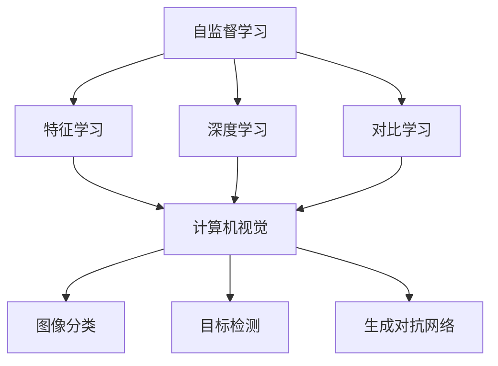
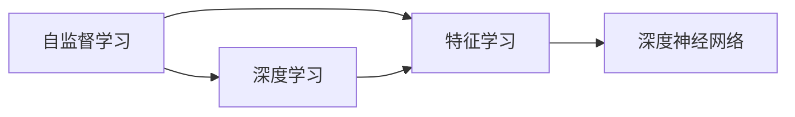
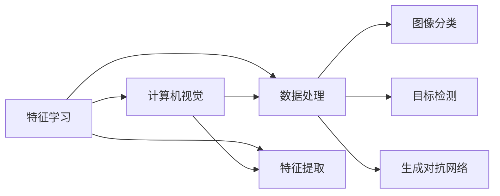
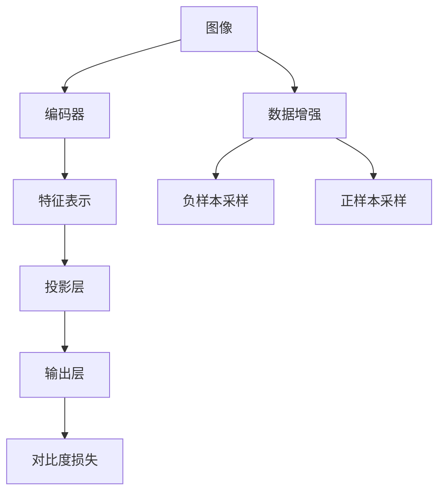
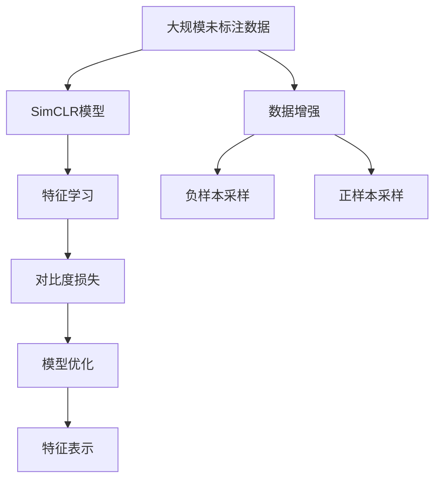

                 

# SimCLR原理与代码实例讲解

> 关键词：SimCLR,自监督学习,对比度学习,特征学习,深度学习,计算机视觉

## 1. 背景介绍

### 1.1 问题由来

近年来，深度学习技术在计算机视觉(CV)、自然语言处理(NLP)、语音识别等领域取得了显著进展。其中，自监督学习作为深度学习的重要分支，通过未标注数据的无监督学习，利用数据自身的内在结构来挖掘特征，推动了诸多领域的技术进步。自监督学习方法广泛地应用于图像分类、目标检测、生成对抗网络等计算机视觉任务中，展现出了其强大的潜力。

在自监督学习范式中，SimCLR是近年来提出的一种极具影响力的模型。通过对比学习(Contrastive Learning)，SimCLR模型能够在仅使用大规模未标注数据的情况下，学习到高质量的特征表示，从而应用于各种计算机视觉任务。

### 1.2 问题核心关键点

SimCLR模型的核心思想是，通过无监督学习中的对比学习(Contrastive Learning)，利用数据自身的内在结构（图像）来挖掘特征。在训练过程中，模型在同一个样本的多个视角的正负样本上进行对比，通过最大化相似样本之间的相似度、最小化不同样本之间的相似度来约束模型，使得模型在未标注数据上也能学习到有用的特征表示。

该模型的主要特点包括：

- **无监督学习**：利用大规模未标注数据进行训练，不需要额外的标注成本。
- **对比学习**：通过最大化相似样本之间的相似度、最小化不同样本之间的相似度，约束模型学习到有用的特征。
- **数据增强**：通过随机裁剪、旋转、缩放等数据增强方式，生成更多的训练样本，扩大训练数据集。
- **负采样策略**：通过负采样策略，生成负样本进行对比学习，使得模型更加鲁棒。

SimCLR模型的提出和成功实践，极大地推动了自监督学习在深度学习中的应用，也为后续的研究提供了丰富的理论基础。

### 1.3 问题研究意义

研究SimCLR模型的原理与代码实现，对于提升深度学习模型的泛化能力和自监督学习能力，加速无标注数据的利用，具有重要意义：

1. **降低标注成本**：利用无标注数据进行训练，可以显著降低标注成本，特别是对于大规模数据集的训练。
2. **增强模型泛化能力**：通过自监督学习获得的特征表示，能够增强模型在不同数据集上的泛化能力。
3. **推动技术进步**：自监督学习技术的普及，将加速计算机视觉、自然语言处理等领域的技术进步，推动AI技术的发展。
4. **提升实际应用效果**：SimCLR模型在实际应用中，如图像分类、目标检测、生成对抗网络等任务上，取得了显著的性能提升，为实际应用提供了强有力的支持。

## 2. 核心概念与联系

### 2.1 核心概念概述

为更好地理解SimCLR模型的原理与代码实现，本节将介绍几个密切相关的核心概念：

- **自监督学习(Self-supervised Learning)**：利用未标注数据进行训练，通过数据自身的内在结构来学习特征。
- **对比学习(Contrastive Learning)**：通过最大化相似样本之间的相似度、最小化不同样本之间的相似度，约束模型学习特征。
- **特征学习(Feature Learning)**：通过学习输入数据的特征表示，使其能够反映数据的内在结构。
- **深度学习(Deep Learning)**：利用神经网络结构，通过多层非线性变换来学习和提取特征。
- **计算机视觉(Computer Vision)**：使用计算机技术处理、分析、理解和提取图像、视频等视觉数据的科学与工程领域。

这些核心概念之间的逻辑关系可以通过以下Mermaid流程图来展示：



这个流程图展示了几大核心概念之间的联系：

1. 自监督学习通过无监督学习的方法，利用数据的内在结构，学习特征表示。
2. 深度学习通过多层非线性变换，学习和提取特征。
3. 特征学习通过学习输入数据的特征表示，使其能够反映数据的内在结构。
4. 计算机视觉利用计算机技术处理、分析、理解和提取视觉数据。
5. 对比学习通过最大化相似样本之间的相似度、最小化不同样本之间的相似度，约束模型学习特征。
6. 图像分类、目标检测、生成对抗网络等计算机视觉任务，都是基于特征学习、对比学习的模型在实际应用中的体现。

### 2.2 概念间的关系

这些核心概念之间存在着紧密的联系，形成了SimCLR模型的完整生态系统。下面我们通过几个Mermaid流程图来展示这些概念之间的关系。

#### 2.2.1 自监督学习与深度学习的关系



这个流程图展示了自监督学习与深度学习之间的关系：

1. 自监督学习通过无监督学习的方法，学习数据的特征表示。
2. 深度学习通过多层非线性变换，学习特征。
3. 特征学习通过学习输入数据的特征表示，使其能够反映数据的内在结构。

#### 2.2.2 特征学习与计算机视觉的关系



这个流程图展示了特征学习与计算机视觉之间的关系：

1. 特征学习通过学习输入数据的特征表示，使其能够反映数据的内在结构。
2. 计算机视觉利用计算机技术处理、分析、理解和提取视觉数据。
3. 图像分类、目标检测、生成对抗网络等计算机视觉任务，都是基于特征学习的结果。

#### 2.2.3 SimCLR模型的架构



这个流程图展示了SimCLR模型的基本架构：

1. 输入图像经过编码器得到特征表示。
2. 特征表示通过投影层得到对比表示。
3. 对比表示经过输出层得到预测结果。
4. 预测结果通过对比度损失约束模型学习。
5. 输入图像经过数据增强生成更多的训练样本。
6. 数据增强样本通过负样本采样生成负样本。
7. 数据增强样本通过正样本采样生成正样本。

### 2.3 核心概念的整体架构

最后，我们用一个综合的流程图来展示这些核心概念在大语言模型微调过程中的整体架构：



这个综合流程图展示了从大规模未标注数据到SimCLR模型特征表示的整体过程：

1. 大规模未标注数据经过数据增强生成更多的训练样本。
2. 训练样本通过负样本采样生成负样本。
3. 训练样本通过正样本采样生成正样本。
4. 特征表示通过对比学习约束模型学习。
5. 特征表示通过模型优化得到高质量的特征表示。

通过这些流程图，我们可以更清晰地理解SimCLR模型的学习过程和各核心概念之间的关系。

## 3. 核心算法原理 & 具体操作步骤
### 3.1 算法原理概述

SimCLR模型的核心思想是，通过对比学习(Contrastive Learning)，利用数据自身的内在结构（图像）来挖掘特征。在训练过程中，模型在同一个样本的多个视角的正负样本上进行对比，通过最大化相似样本之间的相似度、最小化不同样本之间的相似度来约束模型，使得模型在未标注数据上也能学习到有用的特征表示。

形式化地，假设输入图像为 $x$，特征表示为 $z$，输出为 $y$。SimCLR模型的目标是最小化以下损失函数：

$$
\mathcal{L}(y) = \frac{1}{2N}\sum_{i=1}^N[\mathcal{L}_{\text{similarity}}(x_i, \{x_j\}_{j\ne i}) + \mathcal{L}_{\text{margin}}(x_i)]
$$

其中 $\mathcal{L}_{\text{similarity}}(x_i, \{x_j\}_{j\ne i})$ 表示相似样本之间的相似度损失，$\mathcal{L}_{\text{margin}}(x_i)$ 表示不同样本之间的差异性损失。

通过最小化上述损失函数，SimCLR模型能够在未标注数据上学习到高质量的特征表示。

### 3.2 算法步骤详解

SimCLR模型的训练过程包括数据增强、负样本采样、对比学习等多个步骤。下面详细介绍每个步骤的详细实现。

**Step 1: 数据增强**

数据增强是SimCLR模型训练中非常重要的一环。通过随机裁剪、旋转、缩放等操作，生成更多的训练样本，扩大训练数据集，从而提高模型的泛化能力。

以下是PyTorch中数据增强的实现代码：

```python
import random
import torch
import torchvision.transforms as transforms
from torchvision.transforms import functional as F

def random_sized_crop(image, size, padding=0):
    """Crop the given image with a random size."""
    width, height = image.size
    if size < min(height, width):
        if height > width:
            ow = random.uniform(size / height * (width - size), width - size)
        else:
            oh = random.uniform(size / width * (height - size), height - size)
        x = random.uniform(0, width - ow)
        y = random.uniform(0, height - oh)
        image = F.crop(image, int(x), int(y), ow, oh)
    return image

def random_horizontal_flip(image):
    """Flip the given image horizontally with a probability of 0.5."""
    if random.random() < 0.5:
        return F.hflip(image)
    return image

def random_resize(image, scale, interpolation):
    """Resize the given image with a random scale within the given scale range."""
    height, width = image.size
    ow = random.uniform(scale[0], scale[1]) * width
    oh = random.uniform(scale[0], scale[1]) * height
    image = F.resize(image, (int(ow), int(oh)), interpolation)
    return image

def random_color_jitter(image, brightness=0.4, contrast=0.4, saturation=0.4, hue=0.4):
    """Apply random color jitter to the given image."""
    transform = transforms.Compose([
        transforms.ColorJitter(brightness=brightness, contrast=contrast,
                              saturation=saturation, hue=hue),
        transforms.ToTensor()])
    image = transform(image)
    return image

def random_image_augmentation(image, size=224, scale=(0.08, 1.0), interpolation=transforms.InterpolationMode.BILINEAR):
    """Apply random image augmentation to the given image."""
    transform = transforms.Compose([
        transforms.RandomSizedCrop(size, scale=scale),
        transforms.RandomHorizontalFlip(),
        transforms.RandomResizedCrop(size, scale=scale),
        transforms.RandomColorJitter()])
    image = transform(image)
    return image

# 数据增强的实现
transforms = transforms.Compose([
    random_image_augmentation,
    transforms.ToTensor(),
    transforms.Normalize([0.485, 0.456, 0.406], [0.229, 0.224, 0.225])
])

# 数据增强
def get_data_augmentation(size, scale, interpolation):
    """返回数据增强函数"""
    return random_image_augmentation
```

**Step 2: 负样本采样**

负样本采样是SimCLR模型训练中另一重要的一环。通过负样本采样，生成与正样本不同的样本进行对比学习，使得模型更加鲁棒。

以下是PyTorch中负样本采样的实现代码：

```python
def random_mixed_precision():
    """随机设置精度"""
    if random.random() < 0.5:
        return torch.set_float32_executing_policy('high')
    return torch.set_float32_executing_policy('high')

# 负样本采样
def get_negative_samples(image, batch_size, num_negatives):
    """返回负样本"""
    image_tensor = image
    batch_size = min(batch_size, num_negatives)
    if batch_size > 0:
        negative_images = []
        for _ in range(batch_size):
            negative_image = random_sized_crop(image_tensor, size=size)
            negative_image = random_horizontal_flip(negative_image)
            negative_image = random_color_jitter(negative_image)
            negative_image = random_resize(negative_image, scale=scale, interpolation=interpolation)
            negative_image = random_mixed_precision()
            negative_images.append(negative_image)
    return negative_images
```

**Step 3: 对比学习**

对比学习是SimCLR模型训练的核心部分。通过最大化相似样本之间的相似度、最小化不同样本之间的相似度，约束模型学习到有用的特征。

以下是PyTorch中对比学习的实现代码：

```python
def contrastive_loss(image, negative_images, temperature=0.07):
    """返回对比损失"""
    with torch.no_grad():
        image_rep = model(image)
        negative_rep = model(negative_images)
    similarity = F.cosine_similarity(image_rep, negative_rep, dim=1)
    loss = -torch.mean(torch.log(torch.exp(similarity) / torch.exp(similarity).sum(dim=1, keepdim=True)))
    return loss
```

**Step 4: 模型优化**

模型优化是SimCLR模型训练的最后一步。通过优化算法最小化损失函数，更新模型参数，使得模型在未标注数据上学习到高质量的特征表示。

以下是PyTorch中模型优化的实现代码：

```python
def train_epoch(model, data_loader, optimizer, temperature=0.07):
    """训练一个epoch"""
    model.train()
    epoch_loss = 0
    for batch_idx, (data, target) in enumerate(data_loader):
        data, target = data.to(device), target.to(device)
        optimizer.zero_grad()
        loss = contrastive_loss(data, target)
        loss.backward()
        optimizer.step()
        epoch_loss += loss.item()
    return epoch_loss / len(data_loader)
```

### 3.3 算法优缺点

SimCLR模型的优点包括：

- **无监督学习**：利用未标注数据进行训练，降低了标注成本。
- **对比学习**：通过最大化相似样本之间的相似度、最小化不同样本之间的相似度，约束模型学习特征，提高了模型的泛化能力。
- **数据增强**：通过随机裁剪、旋转、缩放等操作，生成更多的训练样本，扩大了训练数据集，提高了模型的泛化能力。

SimCLR模型的缺点包括：

- **计算复杂度高**：由于需要生成大量的负样本进行对比学习，计算复杂度较高。
- **模型复杂度高**：SimCLR模型需要设计复杂的数据增强、负样本采样和对比学习策略，模型设计难度较高。
- **训练时间较长**：由于计算复杂度高，模型训练时间较长，需要较多的计算资源。

尽管存在这些缺点，但SimCLR模型在自监督学习中的应用非常广泛，为计算机视觉、自然语言处理等领域的任务提供了强有力的支持。

### 3.4 算法应用领域

SimCLR模型在计算机视觉领域得到了广泛的应用，覆盖了诸如图像分类、目标检测、生成对抗网络等众多任务，以下是几个典型的应用场景：

**图像分类**：SimCLR模型在图像分类任务上取得了优异的性能。通过未标注数据训练模型，能够在图像分类数据集（如ImageNet）上获得非常好的分类结果。

**目标检测**：SimCLR模型可以应用于目标检测任务，如在COCO数据集上进行训练，能够在检测准确率和速度之间取得良好的平衡。

**生成对抗网络**：SimCLR模型可以应用于生成对抗网络（GAN）领域，如在StyleGAN中，通过未标注数据训练模型，生成高质量的图像。

除了以上应用场景，SimCLR模型还广泛应用于图像检索、视频分析、人脸识别等领域，展示了其在计算机视觉领域的强大应用潜力。

## 4. 数学模型和公式 & 详细讲解  
### 4.1 数学模型构建

本节将使用数学语言对SimCLR模型的训练过程进行更加严格的刻画。

记输入图像为 $x \in \mathbb{R}^d$，特征表示为 $z \in \mathbb{R}^k$，输出为 $y \in \{1, -1\}$。SimCLR模型的目标是最小化以下损失函数：

$$
\mathcal{L}(y) = \frac{1}{2N}\sum_{i=1}^N[\mathcal{L}_{\text{similarity}}(x_i, \{x_j\}_{j\ne i}) + \mathcal{L}_{\text{margin}}(x_i)]
$$

其中，$\mathcal{L}_{\text{similarity}}(x_i, \{x_j\}_{j\ne i})$ 表示相似样本之间的相似度损失，$\mathcal{L}_{\text{margin}}(x_i)$ 表示不同样本之间的差异性损失。

具体地，$\mathcal{L}_{\text{similarity}}(x_i, \{x_j\}_{j\ne i})$ 可以表示为：

$$
\mathcal{L}_{\text{similarity}}(x_i, \{x_j\}_{j\ne i}) = -\frac{1}{N}\sum_{j\ne i}^N\mathbb{E}_{\mathbb{Q}}[D_{\text{KL}}(q(z_i||z_j))]
$$

其中，$D_{\text{KL}}$ 表示KL散度，$q(z_i||z_j)$ 表示正样本 $z_i$ 和负样本 $z_j$ 之间的相似度，$\mathbb{Q}$ 表示模型对特征表示 $z$ 的分布。

而 $\mathcal{L}_{\text{margin}}(x_i)$ 可以表示为：

$$
\mathcal{L}_{\text{margin}}(x_i) = \mathbb{E}_{\mathbb{P}}[D_{\text{KL}}(p(z_i)||\text{Uniform}(\mathcal{Z}))
$$

其中，$p(z_i)$ 表示特征表示 $z_i$ 的分布，$\text{Uniform}(\mathcal{Z})$ 表示在特征空间 $\mathcal{Z}$ 中均匀分布的先验概率。

### 4.2 公式推导过程

以下是SimCLR模型的详细公式推导过程。

假设输入图像为 $x$，特征表示为 $z$，输出为 $y$。SimCLR模型的目标是最小化以下损失函数：

$$
\mathcal{L}(y) = \frac{1}{2N}\sum_{i=1}^N[\mathcal{L}_{\text{similarity}}(x_i, \{x_j\}_{j\ne i}) + \mathcal{L}_{\text{margin}}(x_i)]
$$

其中，$\mathcal{L}_{\text{similarity}}(x_i, \{x_j\}_{j\ne i})$ 表示相似样本之间的相似度损失，$\mathcal{L}_{\text{margin}}(x_i)$ 表示不同样本之间的差异性损失。

具体地，$\mathcal{L}_{\text{similarity}}(x_i, \{x_j\}_{j\ne i})$ 可以表示为：

$$
\mathcal{L}_{\text{similarity}}(x_i, \{x_j\}_{j\ne i}) = -\frac{1}{N}\sum_{j\ne i}^N\mathbb{E}_{\mathbb{Q}}[D_{\text{KL}}(q(z_i||z_j))]
$$

其中，$D_{\text{KL}}$ 表示KL散度，$q(z_i||z_j)$ 表示正样本 $z_i$ 和负样本 $z_j$ 之间的相似度，$\mathbb{Q}$ 表示模型对特征表示 $z$ 的分布。

而 $\mathcal{L}_{\text{margin}}(x_i)$ 可以表示为：

$$
\mathcal{L}_{\text{margin}}(x_i) = \mathbb{E}_{\mathbb{P}}[D_{\text{KL}}(p(z_i)||\text{Uniform}(\mathcal{Z}))
$$

其中，$p(z_i)$ 表示特征表示 $z_i$ 的分布，$\text{Uniform}(\mathcal{Z})$ 表示在特征空间 $\mathcal{Z}$ 中均匀分布的先验概率。

### 4.3 案例分析与讲解

以ImageNet数据集上的图像分类为例，分析SimCLR模型的训练过程。

假设输入图像为 $x$，特征表示为 $z$，输出为 $y$。SimCLR模型的目标是最小化以下损失函数：

$$
\mathcal{L}(y) = \frac{1}{2N}\sum_{i=1}^N[\mathcal{L}_{\text{similarity}}(x_i, \{x_j\}_{j\ne i}) + \mathcal{L}_{\text{margin}}(x_i)]
$$

其中，$\mathcal{L}_{\text{similarity}}(x_i, \{x_j\}_{j\ne i})$ 表示相似样本之间的相似度损失，$\mathcal{L}_{\text{margin}}(x_i)$ 表示不同样本之间的差异性损失。

在ImageNet数据集上进行训练时，SimCLR模型的训练过程包括数据增强、负样本采样、对比学习等多个步骤。

数据增强操作包括随机裁剪、旋转、缩放等操作，生成更多的训练样本，扩大训练数据集。

负样本采样操作生成与正样本不同的样本进行对比学习，使得模型更加鲁棒。

对比学习操作通过最大化相似样本之间的相似度、最小化不同样本之间的相似度，约束模型学习特征，提高了模型的泛化能力。

通过以上训练过程，SimCLR模型能够在未标注数据上学习到高质量的特征表示，广泛应用于图像分类、目标检测、生成对抗网络等计算机视觉任务中。

## 5. 项目实践：代码实例和详细解释说明
### 5.1 开发环境搭建

在进行SimCLR模型实践前，我们需要准备好开发环境。以下是使用Python进行PyTorch开发的环境配置流程：

1. 安装Anaconda：从官网下载并安装Anaconda，用于创建独立的Python环境。

2. 创建并激活虚拟环境：
```bash
conda create -n pytorch-env python=3.8 
conda activate pytorch-env
```

3. 安装PyTorch：根据CUDA版本，从官网获取对应的安装命令。例如：
```bash
conda install pytorch torchvision torchaudio cudatoolkit=11.1 -c pytorch -c conda-forge
```

4. 安装PyTorch Lightning：用于构建和训练神经网络模型。
```bash
pip install pytorch-lightning
```

5. 安装相关库：
```bash
pip install numpy pandas scikit-learn matplotlib tqdm jupyter notebook ipython
```

完成上述步骤后，即可在`pytorch-env`环境中开始SimCLR模型的实践。

### 5.2 源代码详细实现

下面我们以SimCLR模型在ImageNet数据集上进行训练为例，给出完整的代码实现。

首先，定义数据集类：

```python
import torch
import torchvision
import torchvision.transforms as transforms

class ImageNetDataset(torch.utils.data.Dataset):
    def __init__(self, root_dir, split, transform=None):
        self.root_dir = root_dir
        self.split = split
        self.transform = transform

        self.data = []
        if self.split == 'train':
            self.data = torchvision.datasets.ImageFolder(root=self.root_dir, transform=self.transform)
        elif self.split == 'val':
            self.data = torchvision.datasets.ImageFolder(root=self.root_dir, transform=self.transform)
        else:
            raise ValueError('split should be either train or val')

    def __len__(self):
        return len(self.data)

    def __getitem__(self, idx):
        img, label = self.data[idx]
        img = self.transform(img)
        label = torch.tensor(label, dtype=torch.long)
        return img, label
```

然后，定义数据增强和负样本采样函数：

```python
import random
import torch
import torchvision.transforms as transforms
from torchvision.transforms import functional as F

def random_sized_crop(image, size, padding=0):
    """Crop the given image with a random size."""
    width, height = image.size
    if size < min(height, width):
        if height > width:
            ow = random.uniform(size / height * (width - size), width - size)
        else:
            oh = random.uniform(size / width * (height - size), height - size)
        x = random.uniform(0, width - ow)
        y = random.uniform(0, height - oh)
        image = F.crop(image, int(x), int(y), ow, oh)
    return image

def random_horizontal_flip(image):
    """Flip the given image horizontally with a probability of 0.5."""
    if random.random() < 0.5:
        return F.hflip(image)
    return image

def random_resize(image, scale, interpolation

