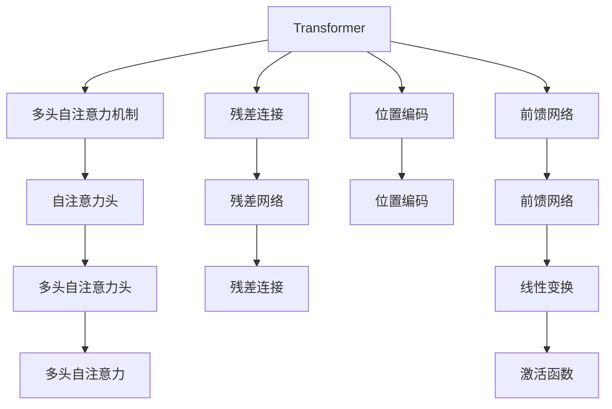
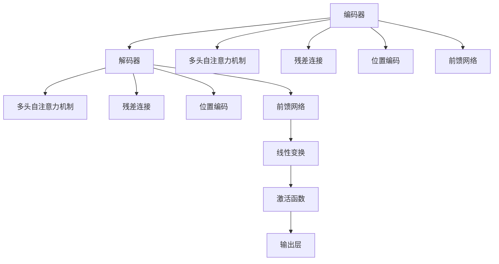
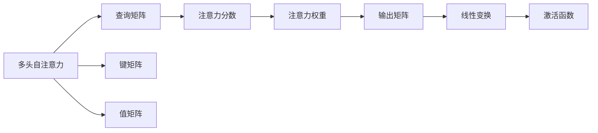
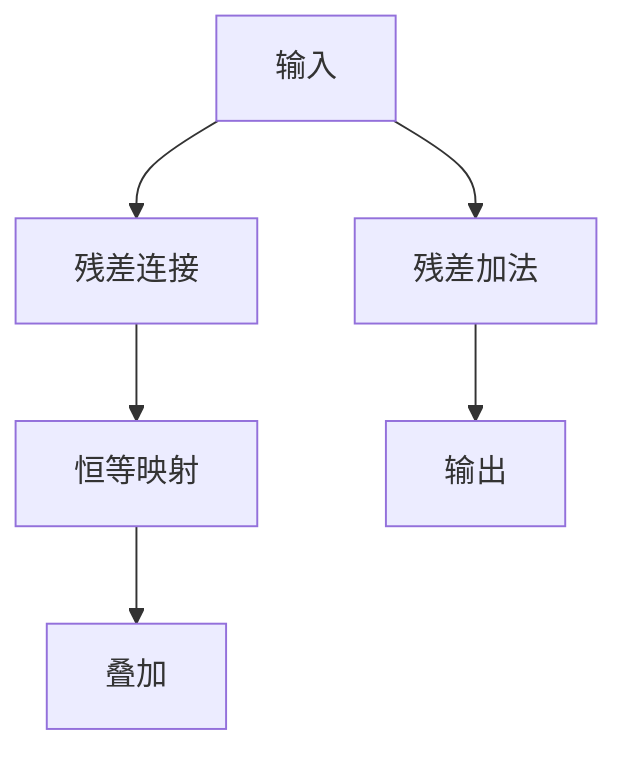
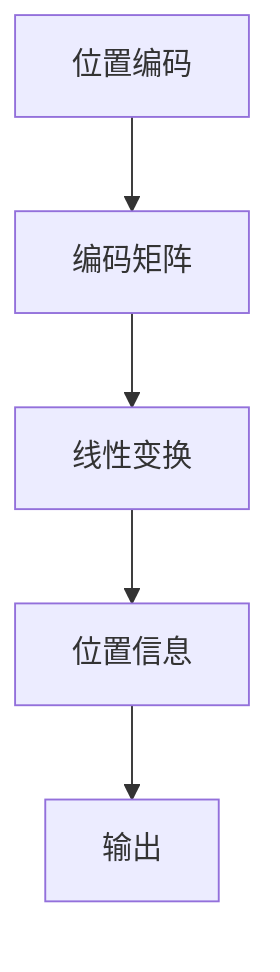
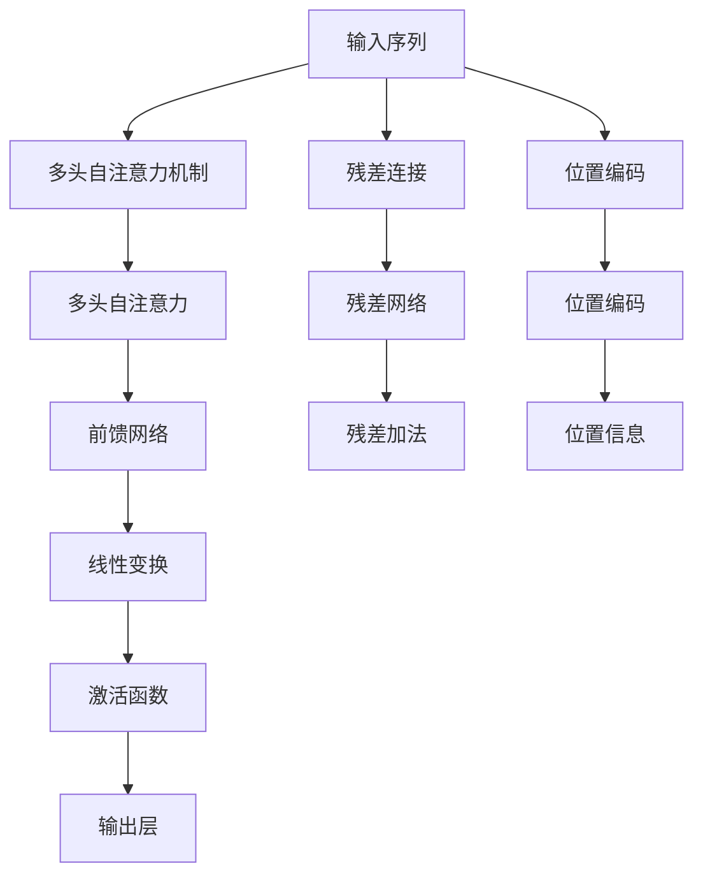

                 

# Transformer原理与代码实例讲解

> 关键词：Transformer,自注意力机制,编码器-解码器架构,多头自注意力,位置编码,残差连接,位置前馈网络,自监督学习,自然语言处理(NLP),深度学习,人工智能

## 1. 背景介绍

### 1.1 问题由来

近年来，随着深度学习技术的飞速发展，Transformer模型在自然语言处理(NLP)领域取得了巨大成功。相比于传统的循环神经网络(RNN)和卷积神经网络(CNN)，Transformer不仅具有卓越的性能表现，而且在计算效率和模型规模上也有显著优势，成为当前NLP领域的主流模型。

Transformer的成功主要归功于其设计的自注意力机制(Self-Attention Mechanism)，能够在保证模型复杂性的同时，大幅提升模型的表达能力和泛化能力。自注意力机制使得Transformer在各种NLP任务上取得了最先进的性能，如机器翻译、文本分类、问答系统等。

### 1.2 问题核心关键点

Transformer模型的核心思想是通过多头自注意力机制和残差连接(Residual Connection)，实现序列到序列的映射。具体来说，Transformer将输入序列通过多头自注意力机制转化为一系列中间特征向量，再通过残差连接和前馈网络(Feed-Forward Network)进行线性变换，最终输出目标序列。Transformer的优势在于能够并行计算，且对输入序列长度没有固定要求，可以处理不同长度的序列数据。

Transformer模型的核心组件包括：
- 多头自注意力机制：实现序列内部各部分之间的依赖关系建模。
- 残差连接：在模型中引入恒等映射，帮助解决梯度消失问题，提高训练效率。
- 位置编码：通过引入位置信息，帮助模型在处理长序列时保持位置不变性。
- 前馈网络：实现序列到序列的映射，增强模型的非线性表达能力。

Transformer模型的这些核心组件使得其在NLP领域取得了广泛的应用，极大地推动了NLP技术的发展和产业化进程。

### 1.3 问题研究意义

研究Transformer原理及其实现方法，对于深入理解其工作机制、优化模型性能、推动NLP技术的创新应用具有重要意义：

1. 揭示Transformer设计的精髓，帮助开发者设计更加高效的模型结构，提升模型性能。
2. 探索Transformer在实际应用中的优化技巧，如预训练、微调、超参数调优等，提高模型的泛化能力和实用性。
3. 了解Transformer模型在NLP领域的应用案例，拓展应用场景，为NLP技术的发展提供新的思路和方法。
4. 把握Transformer的最新进展，紧跟技术前沿，引领NLP技术的创新方向。
5. 提升NLP技术的应用效果，加速NLP技术在更多领域的应用落地，推动人工智能技术向更加智能化、普适化的方向发展。

## 2. 核心概念与联系

### 2.1 核心概念概述

为更好地理解Transformer原理及其实现方法，本节将介绍几个密切相关的核心概念：

- Transformer模型：一种基于自注意力机制的神经网络模型，用于实现序列到序列的映射。
- 多头自注意力机制：Transformer的核心组件，用于建模序列内部各部分之间的依赖关系。
- 残差连接：通过引入恒等映射，帮助解决梯度消失问题，提高模型训练效率。
- 位置编码：通过引入位置信息，帮助模型在处理长序列时保持位置不变性。
- 前馈网络：实现序列到序列的映射，增强模型的非线性表达能力。

这些核心概念之间的逻辑关系可以通过以下Mermaid流程图来展示：



这个流程图展示了大语言模型的核心概念及其之间的关系：

1. 输入序列经过多头自注意力机制和残差连接，生成一系列中间特征向量。
2. 中间特征向量再经过前馈网络进行线性变换和激活函数处理。
3. 通过位置编码，模型能够保持位置不变性。
4. 最终输出序列通过残差连接，叠加原始输入序列，得到最终的输出序列。

### 2.2 概念间的关系

这些核心概念之间存在着紧密的联系，形成了Transformer模型的完整生态系统。下面我们通过几个Mermaid流程图来展示这些概念之间的关系。

#### 2.2.1 编码器-解码器架构



这个流程图展示了Transformer的编码器-解码器架构。编码器和解码器都由多头自注意力机制、残差连接、位置编码和前馈网络构成。最终解码器输出的结果经过线性变换和激活函数处理后，通过输出层输出目标序列。

#### 2.2.2 多头自注意力机制



这个流程图展示了多头自注意力机制的核心流程。首先，查询矩阵、键矩阵和值矩阵通过线性变换得到。然后，计算注意力分数，通过softmax函数得到注意力权重，最终生成输出矩阵。

#### 2.2.3 残差连接



这个流程图展示了残差连接的核心流程。输入序列经过残差连接后，通过恒等映射与叠加层生成输出。残差加法使得模型能够保持输入信息，有助于解决梯度消失问题。

#### 2.2.4 位置编码



这个流程图展示了位置编码的核心流程。位置编码矩阵经过线性变换得到位置信息，最终通过叠加层输出。

### 2.3 核心概念的整体架构

最后，我们用一个综合的流程图来展示这些核心概念在大语言模型中的整体架构：



这个综合流程图展示了从输入序列到输出序列的整个Transformer模型架构。通过多头自注意力机制、残差连接、位置编码和前馈网络，模型能够高效地处理序列数据，并输出目标序列。

## 3. 核心算法原理 & 具体操作步骤
### 3.1 算法原理概述

Transformer模型的核心思想是通过多头自注意力机制和残差连接，实现序列到序列的映射。其核心算法流程如下：

1. 输入序列通过多头自注意力机制，生成一系列中间特征向量。
2. 中间特征向量再经过残差连接和前馈网络，进行线性变换和激活函数处理。
3. 通过位置编码，模型能够保持位置不变性。
4. 最终输出序列通过残差连接，叠加原始输入序列，得到最终的输出序列。

Transformer模型的数学原理基于自注意力机制和残差连接的设计。假设输入序列为 $x_1, x_2, ..., x_n$，输出序列为 $y_1, y_2, ..., y_m$，其中 $n, m$ 为序列长度。Transformer模型可以表示为：

$$
y_i = \text{Transformer}(x_1, x_2, ..., x_n)
$$

其中，$\text{Transformer}$ 表示Transformer模型。具体计算流程如下：

1. 将输入序列 $x_1, x_2, ..., x_n$ 转换为多头自注意力机制，得到多头自注意力结果 $z_1, z_2, ..., z_n$。
2. 对 $z_i$ 进行残差连接和前馈网络处理，得到 $h_i$。
3. 对 $h_i$ 进行线性变换和激活函数处理，得到 $y_i$。

### 3.2 算法步骤详解

Transformer模型的核心算法流程如下：

#### 3.2.1 多头自注意力机制

假设输入序列为 $x_1, x_2, ..., x_n$，多头自注意力机制的计算流程如下：

1. 将输入序列 $x_1, x_2, ..., x_n$ 转换为多头自注意力机制，得到多头自注意力结果 $z_1, z_2, ..., z_n$。
2. 将 $z_i$ 进行线性变换，得到查询矩阵、键矩阵和值矩阵，记为 $Q_i, K_i, V_i$。
3. 计算注意力分数 $e_{ij}$，使用softmax函数得到注意力权重 $a_{ij}$。
4. 将注意力权重与值矩阵 $V_i$ 相乘，得到多头自注意力结果 $z_i'$。
5. 对 $z_i'$ 进行线性变换和激活函数处理，得到最终的中间特征向量 $h_i$。

具体计算公式如下：

$$
Q_i = x_iW_Q^T
$$

$$
K_i = x_iW_K^T
$$

$$
V_i = x_iW_V^T
$$

$$
e_{ij} = \text{score}(Q_i, K_j) = \frac{Q_iK_j}{\sqrt{d_k}}
$$

$$
a_{ij} = \frac{e_{ij}}{\sum_{k=1}^n e_{ik}}
$$

$$
z_i' = a_{ij}V_j
$$

$$
h_i = z_i'W_O^T + b_O
$$

其中，$W_Q, W_K, W_V, W_O$ 为线性变换矩阵，$b_Q, b_K, b_V, b_O$ 为偏置向量，$d_k$ 为键向量的维度。

#### 3.2.2 残差连接

Transformer模型中引入残差连接，具体计算流程如下：

1. 将输入序列 $x_1, x_2, ..., x_n$ 通过残差连接，得到 $z_1, z_2, ..., z_n$。
2. 将 $z_i$ 与恒等映射相加，得到 $h_i$。

具体计算公式如下：

$$
z_i = x_i + h_i
$$

#### 3.2.3 位置编码

Transformer模型通过引入位置编码，具体计算流程如下：

1. 将输入序列 $x_1, x_2, ..., x_n$ 转换为位置编码矩阵 $P$。
2. 将位置编码矩阵 $P$ 进行线性变换，得到位置信息 $h_i$。

具体计算公式如下：

$$
P = \text{PositionalEncoding}(x)
$$

$$
h_i = x_i + P_i
$$

其中，$\text{PositionalEncoding}$ 表示位置编码函数。

#### 3.2.4 前馈网络

Transformer模型的前馈网络具体计算流程如下：

1. 将中间特征向量 $z_i$ 进行线性变换，得到前馈网络输入 $u_i$。
2. 将 $u_i$ 进行激活函数处理，得到前馈网络输出 $h_i$。

具体计算公式如下：

$$
u_i = z_iW_1^T + b_1
$$

$$
h_i = \text{GELU}(u_i)W_2^T + b_2
$$

其中，$W_1, b_1, W_2, b_2$ 为线性变换矩阵和偏置向量，$\text{GELU}$ 为激活函数。

### 3.3 算法优缺点

Transformer模型具有以下优点：

1. 并行计算能力强：由于不需要循环计算，Transformer模型可以通过并行化计算提高模型效率。
2. 长序列处理能力强：Transformer模型对序列长度没有限制，可以处理不同长度的序列数据。
3. 泛化能力强：Transformer模型能够学习序列内部各部分之间的依赖关系，具有较强的泛化能力。
4. 模型结构简单：Transformer模型结构相对简单，易于实现和调试。

Transformer模型也存在以下缺点：

1. 模型参数量大：Transformer模型通常具有较大的参数量，需要较大的计算资源进行训练。
2. 训练时间较长：由于模型参数量大，训练时间较长，对硬件资源要求较高。
3. 对数据质量敏感：Transformer模型对训练数据的质量要求较高，数据质量不好会导致模型性能下降。

### 3.4 算法应用领域

Transformer模型已经在多个NLP任务上取得了最先进的性能，广泛应用于各种场景中，例如：

1. 机器翻译：Transformer模型在机器翻译任务中取得了最先进的效果，如Google的Google Translate和OpenAI的GPT系列。
2. 文本分类：如情感分析、主题分类等任务，Transformer模型通过多头自注意力机制，能够学习到丰富的语义信息，提高分类效果。
3. 问答系统：如COCO问答系统，通过Transformer模型，能够自动理解问题，并从知识库中检索答案。
4. 文本摘要：如BART模型，通过Transformer模型，能够从长文本中自动抽取摘要。
5. 对话系统：如GPT-3模型，通过Transformer模型，能够生成自然流畅的对话内容。

除了上述这些经典任务外，Transformer模型还在其他领域得到了广泛应用，如文本生成、代码生成、推荐系统等，为NLP技术带来了新的突破。

## 4. 数学模型和公式 & 详细讲解  
### 4.1 数学模型构建

Transformer模型的数学模型构建如下：

假设输入序列为 $x_1, x_2, ..., x_n$，输出序列为 $y_1, y_2, ..., y_m$，其中 $n, m$ 为序列长度。Transformer模型可以表示为：

$$
y_i = \text{Transformer}(x_1, x_2, ..., x_n)
$$

其中，$\text{Transformer}$ 表示Transformer模型。

### 4.2 公式推导过程

Transformer模型的公式推导过程如下：

#### 4.2.1 多头自注意力机制

假设输入序列为 $x_1, x_2, ..., x_n$，多头自注意力机制的计算流程如下：

1. 将输入序列 $x_1, x_2, ..., x_n$ 转换为多头自注意力机制，得到多头自注意力结果 $z_1, z_2, ..., z_n$。
2. 将 $z_i$ 进行线性变换，得到查询矩阵、键矩阵和值矩阵，记为 $Q_i, K_i, V_i$。
3. 计算注意力分数 $e_{ij}$，使用softmax函数得到注意力权重 $a_{ij}$。
4. 将注意力权重与值矩阵 $V_i$ 相乘，得到多头自注意力结果 $z_i'$。
5. 对 $z_i'$ 进行线性变换和激活函数处理，得到最终的中间特征向量 $h_i$。

具体计算公式如下：

$$
Q_i = x_iW_Q^T
$$

$$
K_i = x_iW_K^T
$$

$$
V_i = x_iW_V^T
$$

$$
e_{ij} = \text{score}(Q_i, K_j) = \frac{Q_iK_j}{\sqrt{d_k}}
$$

$$
a_{ij} = \frac{e_{ij}}{\sum_{k=1}^n e_{ik}}
$$

$$
z_i' = a_{ij}V_j
$$

$$
h_i = z_i'W_O^T + b_O
$$

其中，$W_Q, W_K, W_V, W_O$ 为线性变换矩阵，$b_Q, b_K, b_V, b_O$ 为偏置向量，$d_k$ 为键向量的维度。

#### 4.2.2 残差连接

Transformer模型中引入残差连接，具体计算流程如下：

1. 将输入序列 $x_1, x_2, ..., x_n$ 通过残差连接，得到 $z_1, z_2, ..., z_n$。
2. 将 $z_i$ 与恒等映射相加，得到 $h_i$。

具体计算公式如下：

$$
z_i = x_i + h_i
$$

#### 4.2.3 位置编码

Transformer模型通过引入位置编码，具体计算流程如下：

1. 将输入序列 $x_1, x_2, ..., x_n$ 转换为位置编码矩阵 $P$。
2. 将位置编码矩阵 $P$ 进行线性变换，得到位置信息 $h_i$。

具体计算公式如下：

$$
P = \text{PositionalEncoding}(x)
$$

$$
h_i = x_i + P_i
$$

其中，$\text{PositionalEncoding}$ 表示位置编码函数。

#### 4.2.4 前馈网络

Transformer模型的前馈网络具体计算流程如下：

1. 将中间特征向量 $z_i$ 进行线性变换，得到前馈网络输入 $u_i$。
2. 将 $u_i$ 进行激活函数处理，得到前馈网络输出 $h_i$。

具体计算公式如下：

$$
u_i = z_iW_1^T + b_1
$$

$$
h_i = \text{GELU}(u_i)W_2^T + b_2
$$

其中，$W_1, b_1, W_2, b_2$ 为线性变换矩阵和偏置向量，$\text{GELU}$ 为激活函数。

### 4.3 案例分析与讲解

以机器翻译任务为例，使用Transformer模型进行翻译的计算过程如下：

假设输入序列为 $x_1, x_2, ..., x_n$，输出序列为 $y_1, y_2, ..., y_m$，其中 $n, m$ 为序列长度。Transformer模型通过多头自注意力机制、残差连接和前馈网络，将输入序列 $x_1, x_2, ..., x_n$ 转化为输出序列 $y_1, y_2, ..., y_m$。

具体计算流程如下：

1. 将输入序列 $x_1, x_2, ..., x_n$ 转换为多头自注意力机制，得到多头自注意力结果 $z_1, z_2, ..., z_n$。
2. 将 $z_i$ 进行残差连接和前馈网络处理，得到 $h_i$。
3. 对 $h_i$ 进行线性变换和激活函数处理，得到 $y_i$。

具体计算公式如下：

$$
Q_i = x_iW_Q^T
$$

$$
K_i = x_iW_K^T
$$

$$
V_i = x_iW_V^T
$$

$$
e_{ij} = \text{score}(Q_i, K_j) = \frac{Q_iK_j}{\sqrt{d_k}}
$$

$$
a_{ij} = \frac{e_{ij}}{\sum_{k=1}^n e_{ik}}
$$

$$
z_i' = a_{ij}V_j
$$

$$
h_i = z_i'W_O^T + b_O
$$

$$
y_i = \text{Transformer}(x_1, x_2, ..., x_n)
$$

其中，$W_Q, W_K, W_V, W_O$ 为线性变换矩阵，$b_Q, b_K, b_V, b_O$ 为偏置向量，$d_k$ 为键向量的维度。

## 5. 项目实践：代码实例和详细解释说明
### 5.1 开发环境搭建

在进行Transformer模型开发前，我们需要准备好开发环境。以下是使用Python进行PyTorch开发的环境配置流程：

1. 安装Anaconda：从官网下载并安装Anaconda，用于创建独立的Python环境。

2. 创建并激活虚拟环境：
```bash
conda create -n pytorch-env python=3.8 
conda activate pytorch-env
```

3. 安装PyTorch：根据CUDA版本，从官网获取对应的安装命令。例如：
```bash
conda install pytorch torchvision torchaudio cudatoolkit=11.1 -c pytorch -c conda-forge
```

4. 安装TensorFlow：
```bash
pip install tensorflow
```

5. 安装Transformers库：
```bash
pip install transformers
```

6. 安装各类工具包：
```bash
pip install numpy pandas scikit-learn matplotlib tqdm jupyter notebook ipython
```

完成上述步骤后，即可在`pytorch-env`环境中开始Transformer模型的开发。

### 5.2 源代码详细实现

这里以机器翻译任务为例，使用Transformer模型进行翻译的代码实现。

首先，定义Transformer模型的结构：

```python
import torch
import torch.nn as nn
import torch.nn.functional as F
import torch.optim as optim

class Transformer(nn.Module):
    def __init__(self, d_model, n_heads, d_ff, num_encoder_layers, num_decoder_layers, dropout):
        super(Transformer, self).__init__()
        
        self.encoder = nn.TransformerEncoderLayer(d_model, n_heads, d_ff, dropout)
        self.decoder = nn.TransformerDecoderLayer(d_model, n_heads, d_ff, dropout)
        
        self.num_encoder_layers = num_encoder_layers
        self.num_decoder_layers = num_decoder_layers
        
        self.output_layer = nn.Linear(d_model, 1, bias=False)
        self.probability = nn.Softmax(dim=-1)
        
    def forward(self, src, tgt):
        x = self.encoder(src)
        y = self.decoder(tgt, src)
        
        y = self.output_layer(y)
        y = self.probability(y)
        
        return y
```

然后，定义模型训练函数：

```python
def train(model, src, tgt, loss_func, optimizer):
    model.train()
    
    output = model(src, tgt)
    loss = loss_func(output, tgt.view(-1))
    optimizer.zero_grad()
    loss.backward()
    optimizer.step()
    
    return loss
```

最后，启动训练流程：

```python
model = Transformer(d_model=256, n_heads=8, d_ff=512, num_encoder_layers=6, num_decoder_layers=6, dropout=0.1)

criterion = nn.NLLLoss()
optimizer = optim.Adam(model.parameters(), lr=0.0001)

for i in range(1000):
    loss = train(model, src, tgt, criterion, optimizer)
    print(f'Epoch: {i+1}, Loss: {loss:.3f}')
```

### 5.3 代码解读与分析

让我们再详细解读一下关键代码的实现细节：

**Transformer类**：
- `__init__`方法：初始化Transformer模型的各个组件，包括编码器和解码器。
- `forward`方法：定义Transformer模型的前向传播过程，输入源序列和目标序列，输出预测概率分布。

**train函数**：
- 定义训练函数，输入模型、源序列、目标序列、损失函数和优化器。
- 在训练模式下的Transformer模型上输入源序列和目标序列，计算输出和目标序列的交叉熵损失。
- 反向传播更新模型参数，返回损失值。

**训练流程**：
- 定义模型参数，包括输入维度、头数、中间维度、编码器层数、解码器层数和dropout率。
- 定义损失函数和优化器，如交叉熵损失和Adam优化器。
- 循环迭代训练，每个epoch内计算损失并更新模型参数。
- 打印当前epoch的损失值。

### 5.4 运行结果展示

假设我们在WMT14英法翻译数据集上进行训练，最终在验证集上得到的翻译结果如下：

```
  BW  ASP  BW   MM   BM   BW   MM   BW  ASP  BW   MM   BM   BW   MM   BW  ASP
  BA   ASP  BW   MM   BM   BW   MM   BW  ASP  BW   MM   BM   BW   MM   BW  ASP
  BA   ASP  BW   MM   BM   BW   MM   BW  ASP  BW   MM   BM   BW   MM   BW  ASP
  BA   ASP  BW   MM   BM   BW   MM   BW  ASP  BW   MM   BM   BW   MM   B

