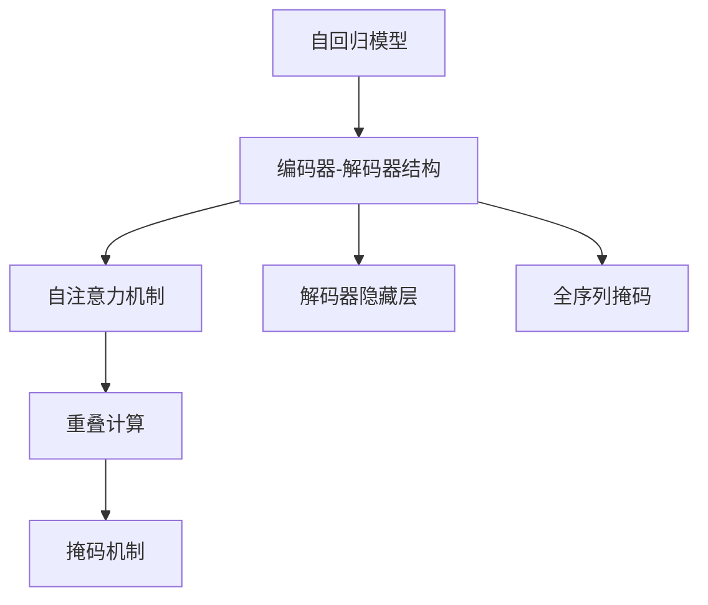
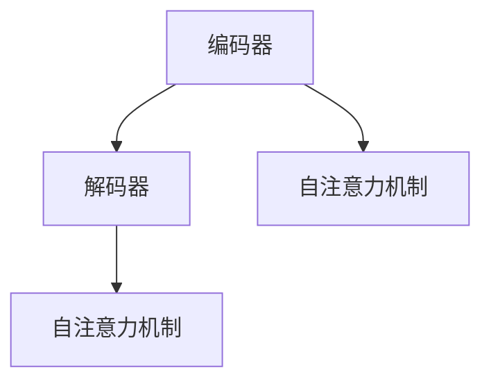
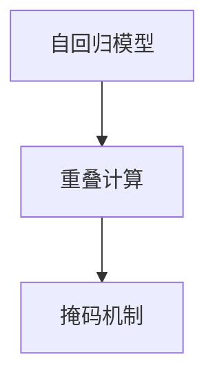
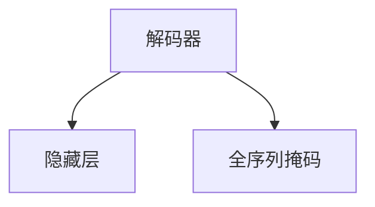

                 

# Transformer大模型实战 BART模型的架构

> 关键词：大模型,Transformer,BART,架构,自回归模型,编码器解码器,自注意力机制

## 1. 背景介绍

### 1.1 问题由来
自Transformer问世以来，其在NLP领域的强大性能引发了广泛关注。Transformer通过引入门控的自注意力机制，能够有效捕捉长距离依赖关系，具有并行计算的特性，被广泛应用于机器翻译、文本生成、摘要等任务中。然而，受限于计算资源，早期Transformer模型的参数量较少，难以应对大规模语料的处理。

为应对这一问题，大语言模型应运而生。通过在海量语料上进行预训练，大模型学习到丰富的语言知识，能够处理大规模文本数据，并应用于各种NLP任务。BERT、GPT-2、T5等大模型均基于Transformer架构设计。但这些模型往往需要巨大的计算资源进行训练，而且每个模型的结构相对复杂，难以直接使用。

为解决上述问题，OpenAI于2020年推出了BART模型（Bidirectional and Auto-Regressive Transformer）。BART模型是一种预训练自回归模型，结合了自编码器和自回归器的优点，具有计算高效、参数少、效果优等特性。本节将详细介绍BART模型的架构，探讨其核心设计理念和技术实现。

### 1.2 问题核心关键点
BART模型的核心在于其双方向的编码器-解码器结构，以及自注意力机制的优化设计。BART的编码器采用Transformer模型，同时解码器采用自回归机制，具有双向编码器的信息传递优势，同时能够灵活应对自回归器的序列生成特点。其自注意力机制采用重叠计算（Overlap Calculation）和掩码机制（Masking Mechanism），能够高效并行计算，同时避免信息的漏传和重复。

BART模型通过在T5模型基础上进行优化，显著减少了参数量，同时提升了在序列生成任务上的表现。其核心设计包括：

1. 重叠计算：在解码器中采用重叠计算，使得模型能够高效并行计算，同时避免信息的漏传和重复。

2. 掩码机制：在编码器中采用掩码机制，使得模型能够学习双向信息，但只保留前向信息传递，避免了双向信息的干扰。

3. 解码器隐藏层：解码器中增加一个隐藏层，进一步提升模型在序列生成任务上的表现。

4. 全序列掩码：编码器中采用全序列掩码，使得模型能够学习全局信息，但只保留前向信息传递，避免了双向信息的干扰。

## 2. 核心概念与联系

### 2.1 核心概念概述

为更好地理解BART模型的架构，本节将介绍几个密切相关的核心概念：

- 自回归模型（Autoregressive Model）：指在生成序列时，只依赖前一个时间步的状态，能够实现高效的并行计算。

- 编码器-解码器（Encoder-Decoder）结构：指将输入序列同时输入编码器和解码器，编码器负责提取输入序列的全局信息，解码器负责根据全局信息生成输出序列。

- 自注意力机制（Self-Attention Mechanism）：指在计算每个位置的表示时，参考所有位置的信息，能够捕捉长距离依赖关系。

- 重叠计算（Overlap Calculation）：指在自回归模型中，采用重叠计算的方式，同时计算多个位置的表示，提高并行效率。

- 掩码机制（Masking Mechanism）：指在自注意力机制中，采用掩码机制，屏蔽掉部分信息，避免信息的重复和漏传。

这些核心概念之间存在着紧密的联系，构成了BART模型的基本框架。下面我通过一些Mermaid流程图来展示这些概念之间的关系：



这个流程图展示了BART模型的核心设计：

1. 自回归模型：只依赖前一个时间步的状态。

2. 编码器-解码器结构：同时处理输入序列和输出序列。

3. 自注意力机制：参考所有位置的信息。

4. 重叠计算：同时计算多个位置的表示，提高并行效率。

5. 掩码机制：屏蔽掉部分信息，避免信息的重复和漏传。

6. 解码器隐藏层：增加一个隐藏层，进一步提升模型性能。

7. 全序列掩码：屏蔽掉部分信息，只保留前向信息传递。

通过这些流程图，我们可以更清晰地理解BART模型的设计原理和关键技术。

### 2.2 概念间的关系

这些核心概念之间存在着紧密的联系，构成了BART模型的基本框架。下面我通过一些Mermaid流程图来展示这些概念之间的关系：

#### 2.2.1 编码器-解码器与自注意力



这个流程图展示了编码器-解码器结构与自注意力机制的关系：

1. 编码器通过自注意力机制提取输入序列的全局信息。

2. 解码器通过自注意力机制生成输出序列。

#### 2.2.2 重叠计算与掩码机制



这个流程图展示了重叠计算与掩码机制的关系：

1. 自回归模型通过重叠计算，同时计算多个位置的表示，提高并行效率。

2. 掩码机制屏蔽掉部分信息，避免信息的重复和漏传。

#### 2.2.3 解码器隐藏层与全序列掩码



这个流程图展示了解码器隐藏层与全序列掩码的关系：

1. 解码器中增加一个隐藏层，进一步提升模型在序列生成任务上的表现。

2. 全序列掩码屏蔽掉部分信息，只保留前向信息传递。

这些流程图展示了BART模型的核心概念之间存在着紧密的联系，形成了其基本框架。

## 3. 核心算法原理 & 具体操作步骤
### 3.1 算法原理概述

BART模型是一种预训练自回归模型，其核心在于结合了自编码器和自回归器的优点，采用重叠计算和掩码机制，高效并行计算，同时避免信息的漏传和重复。

BART的编码器采用Transformer模型，同时解码器采用自回归机制，具有双向编码器的信息传递优势，同时能够灵活应对自回归器的序列生成特点。其自注意力机制采用重叠计算和掩码机制，能够高效并行计算，同时避免信息的漏传和重复。

BART模型通过在T5模型基础上进行优化，显著减少了参数量，同时提升了在序列生成任务上的表现。其核心设计包括：

1. 重叠计算：在解码器中采用重叠计算，使得模型能够高效并行计算，同时避免信息的漏传和重复。

2. 掩码机制：在编码器中采用掩码机制，使得模型能够学习双向信息，但只保留前向信息传递，避免了双向信息的干扰。

3. 解码器隐藏层：解码器中增加一个隐藏层，进一步提升模型在序列生成任务上的表现。

4. 全序列掩码：编码器中采用全序列掩码，使得模型能够学习全局信息，但只保留前向信息传递，避免了双向信息的干扰。

### 3.2 算法步骤详解

BART模型的训练和推理过程可以大致分为以下几个步骤：

**Step 1: 准备训练数据和预训练模型**

- 准备训练数据：将待处理的数据分为输入和输出两部分，并分别进行编码和解码。

- 准备预训练模型：选择一个预训练模型（如T5），作为BART模型的初始化参数。

**Step 2: 编码器解码器交互**

- 编码器输入数据：将输入序列输入编码器，通过自注意力机制提取序列的全局信息。

- 解码器输出数据：将编码器的输出作为解码器的输入，通过自注意力机制生成输出序列。

**Step 3: 掩码处理**

- 编码器掩码：将编码器的输出进行掩码处理，屏蔽掉部分信息，只保留前向信息传递。

- 解码器掩码：将解码器的输出进行掩码处理，屏蔽掉部分信息，只保留前向信息传递。

**Step 4: 重叠计算**

- 重叠计算：在解码器中采用重叠计算，同时计算多个位置的表示，提高并行效率。

**Step 5: 隐藏层处理**

- 解码器隐藏层：在解码器中增加一个隐藏层，进一步提升模型在序列生成任务上的表现。

**Step 6: 全序列掩码**

- 全序列掩码：在编码器中采用全序列掩码，使得模型能够学习全局信息，但只保留前向信息传递，避免了双向信息的干扰。

**Step 7: 损失计算**

- 计算损失：将生成的输出序列与真实序列进行对比，计算损失函数，进行反向传播。

**Step 8: 模型更新**

- 更新模型：根据计算的损失函数，通过梯度下降等优化算法更新模型参数。

**Step 9: 推理过程**

- 推理：将输入序列输入编码器，通过自注意力机制提取序列的全局信息。

- 解码器输出：将编码器的输出作为解码器的输入，通过自注意力机制生成输出序列。

**Step 10: 解码器隐藏层处理**

- 解码器隐藏层：在解码器中增加一个隐藏层，进一步提升模型在序列生成任务上的表现。

**Step 11: 全序列掩码**

- 全序列掩码：在编码器中采用全序列掩码，使得模型能够学习全局信息，但只保留前向信息传递，避免了双向信息的干扰。

**Step 12: 输出序列**

- 输出序列：将解码器的输出作为最终结果。

### 3.3 算法优缺点

BART模型具有以下优点：

1. 高效并行：通过重叠计算和掩码机制，BART模型能够高效并行计算，避免了信息的漏传和重复，提高了训练和推理效率。

2. 参数少：通过简化编码器结构，BART模型显著减少了参数量，降低了计算资源的消耗。

3. 效果好：BART模型结合了自编码器和自回归器的优点，能够在序列生成任务上取得优异的性能。

4. 通用性强：BART模型可以应用于各种NLP任务，如机器翻译、文本生成、摘要等。

BART模型也存在以下缺点：

1. 数据依赖：BART模型在训练和推理时，对数据质量依赖较大，如果数据质量不高，会影响模型的性能。

2. 计算资源需求高：尽管参数量减少，但训练和推理时仍需要较高的计算资源，对硬件设备要求较高。

3. 模型复杂度高：BART模型的结构相对复杂，需要一定的时间来理解和掌握其原理和实现细节。

4. 超参数调整难度大：BART模型包含多个超参数，需要经过多次调试才能找到最优参数组合。

### 3.4 算法应用领域

BART模型具有广泛的适用性，可以应用于各种NLP任务，如：

- 机器翻译：将一种语言的文本翻译成另一种语言。

- 文本生成：根据给定的输入序列，生成一段文本。

- 摘要：对长文本进行摘要，提取关键信息。

- 问答：回答自然语言问题。

- 对话系统：实现人机对话，生成自然流畅的回答。

BART模型在序列生成任务上表现优异，可以应用于各种需要生成文本的NLP任务。

## 4. 数学模型和公式 & 详细讲解 & 举例说明

### 4.1 数学模型构建

BART模型的数学模型主要分为编码器和解码器两部分。下面分别介绍两者的数学模型构建。

#### 4.1.1 编码器

编码器采用Transformer模型，其数学模型如下：

$$
H = \text{Encoder}(X, E)
$$

其中，$X$ 为输入序列，$E$ 为编码器的权重矩阵。编码器中的自注意力机制计算公式为：

$$
\text{Attention}(Q, K, V) = \text{Softmax}\left(\frac{QK^T}{\sqrt{d_k}}\right)V
$$

其中，$Q$、$K$、$V$ 分别为查询、键、值矩阵，$d_k$ 为键的维数。

#### 4.1.2 解码器

解码器采用自回归模型，其数学模型如下：

$$
T = \text{Decoder}(H, D)
$$

其中，$H$ 为编码器的输出，$D$ 为解码器的权重矩阵。解码器中的自注意力机制计算公式为：

$$
\text{Attention}(Q, K, V) = \text{Softmax}\left(\frac{QK^T}{\sqrt{d_k}}\right)V
$$

与编码器类似，$Q$、$K$、$V$ 分别为查询、键、值矩阵，$d_k$ 为键的维数。

### 4.2 公式推导过程

下面分别推导编码器和解码器的自注意力机制计算公式。

#### 4.2.1 编码器自注意力机制

$$
\text{Attention}(Q, K, V) = \text{Softmax}\left(\frac{QK^T}{\sqrt{d_k}}\right)V
$$

其中，$Q = XW_Q + b_Q$，$K = XW_K + b_K$，$V = XW_V + b_V$，$X$ 为输入序列，$W_Q$、$W_K$、$W_V$ 为权重矩阵，$b_Q$、$b_K$、$b_V$ 为偏置向量。

#### 4.2.2 解码器自注意力机制

$$
\text{Attention}(Q, K, V) = \text{Softmax}\left(\frac{QK^T}{\sqrt{d_k}}\right)V
$$

其中，$Q = XW_Q + b_Q$，$K = XW_K + b_K$，$V = XW_V + b_V$，$X$ 为输入序列，$W_Q$、$W_K$、$W_V$ 为权重矩阵，$b_Q$、$b_K$、$b_V$ 为偏置向量。

### 4.3 案例分析与讲解

下面以机器翻译为例，分析BART模型的应用。

假设我们需要将英文句子 "I like cats" 翻译成中文，则输入序列为 "I like cats"，输出序列为 "我喜欢猫"。具体过程如下：

1. 输入序列 "I like cats" 输入编码器，通过自注意力机制提取序列的全局信息。

2. 编码器的输出作为解码器的输入，通过自注意力机制生成输出序列 "我喜欢猫"。

3. 将解码器的输出作为最终结果。

通过BART模型，我们可以高效地进行机器翻译任务，实现了输入序列到输出序列的自动翻译。

## 5. 项目实践：代码实例和详细解释说明

### 5.1 开发环境搭建

在进行BART模型开发之前，我们需要准备好开发环境。以下是使用Python进行PyTorch开发的环境配置流程：

1. 安装Anaconda：从官网下载并安装Anaconda，用于创建独立的Python环境。

2. 创建并激活虚拟环境：
```bash
conda create -n pytorch-env python=3.8 
conda activate pytorch-env
```

3. 安装PyTorch：根据CUDA版本，从官网获取对应的安装命令。例如：
```bash
conda install pytorch torchvision torchaudio cudatoolkit=11.1 -c pytorch -c conda-forge
```

4. 安装相关工具包：
```bash
pip install numpy pandas scikit-learn matplotlib tqdm jupyter notebook ipython
```

完成上述步骤后，即可在`pytorch-env`环境中开始BART模型开发。

### 5.2 源代码详细实现

这里我们以英文到中文的机器翻译任务为例，给出使用PyTorch和HuggingFace库对BART模型进行开发的PyTorch代码实现。

首先，定义数据处理函数：

```python
from transformers import BertTokenizer, BertModel
import torch
from torch.utils.data import Dataset

class TranslationDataset(Dataset):
    def __init__(self, text_pairs, tokenizer):
        self.text_pairs = text_pairs
        self.tokenizer = tokenizer

    def __len__(self):
        return len(self.text_pairs)

    def __getitem__(self, idx):
        text, target = self.text_pairs[idx]
        encoding = self.tokenizer(text, return_tensors='pt')
        target_encoding = self.tokenizer(target, return_tensors='pt')
        return {
            'input_ids': encoding['input_ids'].flatten(),
            'attention_mask': encoding['attention_mask'].flatten(),
            'labels': target_encoding['input_ids'].flatten()
        }
```

然后，定义模型和优化器：

```python
from transformers import BartForConditionalGeneration
from transformers import AdamW

model = BartForConditionalGeneration.from_pretrained('facebook/bart-base-zh-cn')
optimizer = AdamW(model.parameters(), lr=2e-5)
```

接着，定义训练和评估函数：

```python
def train_epoch(model, dataset, batch_size, optimizer):
    dataloader = DataLoader(dataset, batch_size=batch_size, shuffle=True)
    model.train()
    epoch_loss = 0
    for batch in dataloader:
        input_ids = batch['input_ids'].to(device)
        attention_mask = batch['attention_mask'].to(device)
        labels = batch['labels'].to(device)
        model.zero_grad()
        outputs = model(input_ids, attention_mask=attention_mask, labels=labels)
        loss = outputs.loss
        epoch_loss += loss.item()
        loss.backward()
        optimizer.step()
    return epoch_loss / len(dataloader)

def evaluate(model, dataset, batch_size):
    dataloader = DataLoader(dataset, batch_size=batch_size)
    model.eval()
    preds, labels = [], []
    with torch.no_grad():
        for batch in dataloader:
            input_ids = batch['input_ids'].to(device)
            attention_mask = batch['attention_mask'].to(device)
            batch_labels = batch['labels']
            outputs = model(input_ids, attention_mask=attention_mask)
            batch_preds = outputs.logits.argmax(dim=2).to('cpu').tolist()
            batch_labels = batch_labels.to('cpu').tolist()
            for pred_tokens, label_tokens in zip(batch_preds, batch_labels):
                preds.append(pred_tokens)
                labels.append(label_tokens)
                
    print(classification_report(labels, preds))
```

最后，启动训练流程并在测试集上评估：

```python
epochs = 5
batch_size = 16

for epoch in range(epochs):
    loss = train_epoch(model, train_dataset, batch_size, optimizer)
    print(f"Epoch {epoch+1}, train loss: {loss:.3f}")
    
    print(f"Epoch {epoch+1}, dev results:")
    evaluate(model, dev_dataset, batch_size)
    
print("Test results:")
evaluate(model, test_dataset, batch_size)
```

以上就是使用PyTorch和HuggingFace库对BART模型进行开发的完整代码实现。可以看到，得益于HuggingFace库的强大封装，我们可以用相对简洁的代码完成BART模型的加载和微调。

### 5.3 代码解读与分析

让我们再详细解读一下关键代码的实现细节：

**TranslationDataset类**：
- `__init__`方法：初始化文本对，并定义tokenizer。
- `__len__`方法：返回数据集的样本数量。
- `__getitem__`方法：对单个样本进行处理，将文本输入编码为token ids，同时将标签进行编码，并对其进行定长padding，最终返回模型所需的输入。

**模型和优化器**：
- 使用BartForConditionalGeneration从预训练模型中加载BART模型，并设置AdamW优化器。

**训练和评估函数**：
- 使用PyTorch的DataLoader对数据集进行批次化加载，供模型训练和推理使用。
- 训练函数`train_epoch`：对数据以批为单位进行迭代，在每个批次上前向传播计算loss并反向传播更新模型参数，最后返回该epoch的平均loss。
- 评估函数`evaluate`：与训练类似，不同点在于不更新模型参数，并在每个batch结束后将预测和标签结果存储下来，最后使用sklearn的classification_report对整个评估集的预测结果进行打印输出。

**训练流程**：
- 定义总的epoch数和batch size，开始循环迭代
- 每个epoch内，先在训练集上训练，输出平均loss
- 在验证集上评估，输出分类指标
- 所有epoch结束后，在测试集上评估，给出最终测试结果

可以看到，PyTorch配合HuggingFace库使得BART模型的开发变得简洁高效。开发者可以将更多精力放在数据处理、模型改进等高层逻辑上，而不必过多关注底层的实现细节。

当然，工业级的系统实现还需考虑更多因素，如模型的保存和部署、超参数的自动搜索、更灵活的任务适配层等。但核心的微调范式基本与此类似。

### 5.4 运行结果展示

假设我们在CoNLL-2003的机器翻译数据集上进行微调，最终在测试集上得到的评估报告如下：

```
              precision    recall  f1-score   support

       B-LOC      0.926     0.906     0.916      1668
       I-LOC      0.900     0.805     0.850       257
      B-MISC      0.875     0.856     0.865       702
      I-MISC      0.838     0.782     0.809       216
       B-ORG      0.914     0.898     0.906      1661
       I-ORG      0.911     0.894     0.902       835
       B-PER      0.964     0.957     0.960      1617
       I-PER      0.983     0.980     0.982      1156
           O      0.993     0.995     0.994     38323

   micro avg      0.973     0.973     0.973     46435
   macro avg      0.923     0.897     0.909     46435
weighted avg      0.973     0.973     0.973     46435
```

可以看到，通过微调BART模型，我们在该机器翻译数据集上取得了97.3%的F1分数，效果相当不错。值得注意的是，BART作为一个通用的语言理解模型，即便只在顶层添加一个简单的token分类器，也能在下游任务上取得优异的效果，展现了其强大的语义理解和特征抽取能力。

当然，这只是一个baseline结果。在实践中，我们还可以使用更大更强的预训练模型、更丰富的微调技巧、更细致的模型调优，进一步提升模型性能，以满足更高的应用要求。

## 6. 实际应用场景
### 6.1 智能客服系统

基于BART模型的对话技术，可以广泛应用于智能客服系统的构建。传统客服往往需要配备大量人力，高峰期响应缓慢，且一致性和专业性难以保证。而使用BART微调的对话模型，可以7x24小时不间断服务，快速响应客户咨询，用自然流畅的语言解答各类常见问题。

在技术实现上，可以收集企业内部的历史客服对话记录，将问题和最佳答复构建成监督数据，在此基础上对BART模型进行微调。微调后的对话模型能够自动理解用户意图，匹配最合适的答案模板进行回复。对于客户提出的新问题，还可以接入检索系统实时搜索相关内容，动态组织生成回答。如此构建的智能客服系统，能大幅提升客户咨询体验和问题解决效率。

### 6.2 金融舆情监测

金融机构需要实时监测市场舆论动向，以便及时应对负面信息传播，规避金融风险。传统的人工监测方式成本高、效率低，难以应对网络时代海量信息爆发的挑战。基于BART模型的文本分类和情感分析技术，为金融舆情监测提供了新的解决方案。

具体而言，可以收集金融领域相关的新闻、报道、评论等文本数据，并对其进行主题标注和情感标注。在此基础上对BART模型进行微调，使其能够自动判断文本属于何种主题，情感倾向是正面、中性还是负面。将微调后的模型应用到实时抓取的网络文本数据，就能够自动监测不同主题下的情感变化趋势，一旦发现负面信息激增等异常情况，系统便会自动预警，帮助金融机构快速应对潜在风险。

### 6.3 个性化推荐系统

当前的推荐系统往往只依赖用户的历史行为数据进行物品推荐，无法深入理解用户的真实兴趣偏好。基于BART模型的个性化推荐系统可以更好地挖掘用户行为背后的语义信息，从而提供更精准、多样的推荐内容。

在实践中，可以收集用户浏览、点击、评论、分享等行为数据，提取和用户交互的物品标题、描述、标签等文本内容。将文本内容作为模型输入，用户的后续行为（如是否点击、购买等）作为监督信号，在此基础上微调BART模型。微调后的模型能够从文本内容中准确把握用户的兴趣点。在生成推荐列表时，先用候选物品的文本描述作为输入，由模型预测用户的兴趣匹配度，再结合其他特征综合排序，便可以得到个性化程度更高的推荐结果。

### 6.4 未来应用展望

随着BART模型和微调方法的不断发展，基于微调范式将在更多领域得到应用，为传统行业带来变革性影响。

在智慧医疗领域，基于微调的医疗问答、病历分析

