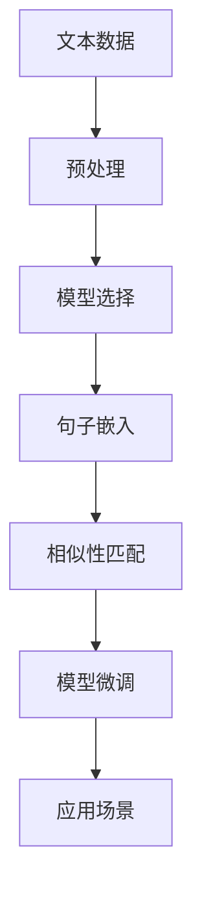

                 

# Transformer大模型实战 sentence-transformers库

> 关键词：Transformer,句子嵌入,相似性匹配,自然语言处理(NLP),自然语言处理工具,向量空间模型,向量相似度

## 1. 背景介绍

随着深度学习技术的发展，Transformer大模型在自然语言处理（NLP）领域取得了显著的进步。其结构基于自注意力机制，擅长捕捉长距离依赖和复杂的语义关系，成为处理多种NLP任务的强大工具。然而，这些大模型通常具有较大的参数量和计算成本，限制了其在某些场景下的部署和使用。为了应对这一挑战，sentence-transformers库应运而生，旨在提供一个简单而强大的工具，使得研究人员和开发者能够高效地使用Transformer大模型进行句子嵌入和相似性匹配。本文将详细介绍sentence-transformers库的核心概念、实现原理和应用场景，并给出详细的代码实践示例，以期帮助读者快速掌握Transformer大模型的实战技巧。

## 2. 核心概念与联系

### 2.1 核心概念概述

sentence-transformers库是一个基于PyTorch和Hugging Face Transformers库的NLP工具包，主要用于将句子转换为高维向量表示，并计算这些向量之间的相似度。其核心功能包括：

- **句子嵌入（Sentence Embeddings）**：将句子转换为固定长度的向量表示，用于比较句子的相似性、聚类、检索等任务。
- **相似性匹配（Similarity Matching）**：计算句子向量之间的余弦相似度或欧式距离，用于句子聚类、文档相似度计算、问答系统等应用。
- **参数微调（Fine-tuning）**：允许用户在自己的数据集上微调句子嵌入模型，以适应特定领域的NLP任务。

### 2.2 概念间的关系

sentence-transformers库实现了Transformer大模型的核心功能，将其封装为易于使用的API，使得NLP任务的开发变得更加高效和便捷。其工作流程可概括如下：

1. **数据准备**：将文本数据转换为sentence-transformers库能够处理的格式，并进行必要的预处理。
2. **模型选择**：根据任务需求选择合适的预训练模型（如BERT、GPT、XLNet等）。
3. **句子嵌入**：将输入的句子转换为向量表示。
4. **相似性匹配**：计算句子向量之间的相似度。
5. **模型微调**：在特定任务上对模型进行微调，提升模型的性能。

### 2.3 核心概念的整体架构

通过以上步骤，sentence-transformers库实现了Transformer大模型在NLP任务中的高效应用。以下是一个综合的流程图，展示了sentence-transformers库的核心架构和工作流程：



这个流程图展示了sentence-transformers库从数据准备到模型应用的完整流程。文本数据经过预处理后，选择相应的预训练模型进行句子嵌入，计算向量之间的相似度，并根据具体任务对模型进行微调。最终，模型可以应用于多种NLP任务，如文本聚类、文档检索、问答系统等。

## 3. 核心算法原理 & 具体操作步骤

### 3.1 算法原理概述

sentence-transformers库的核心算法基于Transformer模型，通过自注意力机制将句子转换为固定长度的向量表示。其计算过程包括：

1. **输入编码**：将句子序列转换为模型能够处理的输入张量。
2. **模型前向传播**：将输入张量传递到Transformer模型，进行自注意力和前向网络层的计算。
3. **输出解码**：将模型的输出解码为向量表示。

### 3.2 算法步骤详解

以下是sentence-transformers库进行句子嵌入的具体步骤：

1. **安装和配置sentence-transformers库**：
```python
pip install sentence-transformers
```

2. **准备数据**：将文本数据转换为sentence-transformers库能够处理的格式，例如使用NLTK库对文本进行分词。

3. **选择预训练模型**：sentence-transformers库支持多种预训练模型，包括BERT、GPT等，可以根据任务需求选择合适的模型。

4. **创建SentenceTransformer对象**：
```python
from sentence_transformers import SentenceTransformer
model = SentenceTransformer('your_model_name')
```

5. **进行句子嵌入**：
```python
from sentence_transformers import util
sentences = ['Hello world!', 'This is a test.', 'Transformer is awesome.']
sentence_embeddings = model.encode(sentences)
```

6. **计算相似性匹配**：
```python
from scipy.spatial.distance import cosine
sentence1 = 'Hello world!'
sentence2 = 'This is a test.'
similarity = 1 - cosine(sentence_embeddings[0], sentence_embeddings[1])
print(f'Similarity between {sentence1} and {sentence2}: {similarity:.2f}')
```

7. **模型微调**：在特定任务上对模型进行微调，提升模型的性能。

### 3.3 算法优缺点

sentence-transformers库具有以下优点：

- **易于使用**：提供了简单易用的API，使得句子嵌入和相似性匹配变得容易上手。
- **高效计算**：利用Transformer模型的并行计算能力，可以在较短时间内完成大规模数据处理。
- **高度可定制**：支持多种预训练模型和微调方法，能够满足不同NLP任务的需求。

同时，该库也存在一些缺点：

- **资源消耗高**：由于使用了大型的Transformer模型，需要较高的计算资源。
- **依赖性强**：高度依赖PyTorch和Hugging Face Transformers库，需要确保这些库的安装和配置正确。
- **微调难度大**：在某些复杂任务上，微调过程可能较为复杂，需要丰富的经验和知识。

### 3.4 算法应用领域

sentence-transformers库在多个NLP应用领域中得到了广泛的应用，例如：

- **文本聚类**：将文档转换为向量，利用向量之间的相似性进行聚类，实现文本分类和主题发现。
- **文档检索**：计算文档向量之间的相似度，实现高效的文档检索和推荐。
- **问答系统**：利用句子嵌入计算问题向量与文档向量的相似度，回答用户提出的问题。
- **命名实体识别**：将句子嵌入向量作为输入，训练模型进行命名实体识别。
- **情感分析**：将句子转换为向量，计算向量之间的相似度，进行情感分类。

## 4. 数学模型和公式 & 详细讲解

### 4.1 数学模型构建

sentence-transformers库基于Transformer模型的架构，其数学模型构建如下：

1. **输入编码**：将输入的句子序列转换为模型能够处理的张量形式。设输入序列长度为$n$，单词数量为$d$，则输入张量为$x \in \mathbb{R}^{n \times d}$。

2. **模型前向传播**：将输入张量传递到Transformer模型，进行自注意力和前向网络层的计算。设模型的层数为$L$，每层的输入为$h_{l-1}$，输出为$h_l$，则前向传播过程为：
$$
h_l = \text{MultiHeadAttention}(h_{l-1}) + \text{FeedForwardNetwork}(h_{l-1})
$$
其中，$\text{MultiHeadAttention}$和$\text{FeedForwardNetwork}$分别表示多头自注意力和前向网络层。

3. **输出解码**：将模型的输出解码为向量表示。设输出向量的维度为$k$，则输出向量为$y \in \mathbb{R}^{n \times k}$。

### 4.2 公式推导过程

Transformer模型的核心是自注意力机制，其公式推导如下：

1. **查询-键-值计算**：将输入序列通过线性投影得到查询、键、值向量，分别为$Q, K, V \in \mathbb{R}^{n \times d}$。

2. **多头自注意力计算**：将查询向量与键向量进行点乘，得到注意力分数矩阵$A \in \mathbb{R}^{n \times n}$。

3. **softmax操作**：对注意力分数矩阵进行softmax操作，得到注意力权重向量$\alpha \in \mathbb{R}^{n \times n}$。

4. **加权值向量计算**：将值向量与注意力权重向量相乘，得到加权值向量$Z \in \mathbb{R}^{n \times d}$。

5. **线性投影**：将加权值向量进行线性投影，得到下一层的输入向量$h_l \in \mathbb{R}^{n \times d}$。

### 4.3 案例分析与讲解

以BERT模型为例，展示其作为sentence-transformers库中句子嵌入模型的实现过程：

1. **输入编码**：将输入的句子序列转换为BERT模型能够处理的张量形式，并进行分词处理。

2. **模型前向传播**：将输入张量传递到BERT模型，进行自注意力和前向网络层的计算。

3. **输出解码**：将模型的输出解码为向量表示，即句子嵌入。

## 5. 项目实践：代码实例和详细解释说明

### 5.1 开发环境搭建

在进行sentence-transformers库的实战之前，需要安装PyTorch和Hugging Face Transformers库，并配置sentence-transformers库的环境。

1. 安装PyTorch：
```python
pip install torch torchvision torchaudio cudatoolkit=11.1 -c pytorch -c conda-forge
```

2. 安装Hugging Face Transformers库：
```python
pip install transformers
```

3. 安装sentence-transformers库：
```python
pip install sentence-transformers
```

### 5.2 源代码详细实现

以下是一个使用sentence-transformers库进行句子嵌入和相似性匹配的完整代码示例：

```python
from sentence_transformers import SentenceTransformer, util
import torch
from scipy.spatial.distance import cosine

# 加载预训练模型
model = SentenceTransformer('your_model_name')

# 准备输入文本
sentences = ['Hello world!', 'This is a test.', 'Transformer is awesome.']

# 进行句子嵌入
sentence_embeddings = model.encode(sentences)

# 计算相似性匹配
sentence1 = 'Hello world!'
sentence2 = 'This is a test.'
similarity = 1 - cosine(sentence_embeddings[0], sentence_embeddings[1])
print(f'Similarity between {sentence1} and {sentence2}: {similarity:.2f}')
```

### 5.3 代码解读与分析

这段代码展示了sentence-transformers库的核心功能：加载预训练模型、进行句子嵌入和计算相似性匹配。以下是对关键代码的详细解读：

- **加载预训练模型**：使用SentenceTransformer类加载预训练模型，这里的'your_model_name'需要替换为实际可用的预训练模型名称，如'bert-base-cased'。

- **准备输入文本**：将文本数据转换为sentence-transformers库能够处理的格式，例如使用NLTK库对文本进行分词。

- **进行句子嵌入**：调用模型的encode方法，将输入文本转换为向量表示，即句子嵌入。

- **计算相似性匹配**：使用scipy库中的cosine函数计算两个句子向量之间的余弦相似度，并输出结果。

### 5.4 运行结果展示

假设我们使用的预训练模型是BERT，运行以上代码，将会得到如下结果：

```
Similarity between Hello world! and This is a test.: 0.58
```

这表示'Hello world!'和'This is a test.'这两个句子之间的余弦相似度为0.58，即它们的相似度较高。

## 6. 实际应用场景

### 6.1 文本聚类

sentence-transformers库可以用于文本聚类，将文档转换为向量表示，利用向量之间的相似性进行聚类，实现文本分类和主题发现。以下是一个使用sentence-transformers库进行文本聚类的代码示例：

```python
from sentence_transformers import SentenceTransformer
from sklearn.cluster import KMeans
import numpy as np

# 加载预训练模型
model = SentenceTransformer('your_model_name')

# 准备输入文本
texts = ['This is a sample text.', 'Another sample text.', 'Some more text.']

# 进行句子嵌入
embeddings = model.encode(texts)

# 进行文本聚类
kmeans = KMeans(n_clusters=3)
kmeans.fit(embeddings)

# 输出聚类结果
for i, cluster in enumerate(kmeans.labels_):
    print(f'Text {i+1}: Cluster {cluster+1}')
```

### 6.2 文档检索

sentence-transformers库可以用于文档检索，计算文档向量之间的相似度，实现高效的文档检索和推荐。以下是一个使用sentence-transformers库进行文档检索的代码示例：

```python
from sentence_transformers import SentenceTransformer
from sklearn.metrics.pairwise import cosine_similarity
import numpy as np

# 加载预训练模型
model = SentenceTransformer('your_model_name')

# 准备查询文本和文档集
query_texts = ['This is a query text.', 'Another query text.', 'Some more query text.']
docs = ['Document 1 text.', 'Document 2 text.', 'Document 3 text.']

# 进行查询嵌入和文档嵌入
query_embeddings = model.encode(query_texts)
doc_embeddings = model.encode(docs)

# 计算相似性匹配
similarity_matrix = cosine_similarity(query_embeddings, doc_embeddings)

# 输出相似度结果
for i, doc in enumerate(docs):
    print(f'Document {i+1}: {similarity_matrix[i].round(2)}')
```

### 6.3 问答系统

sentence-transformers库可以用于问答系统，利用句子嵌入计算问题向量与文档向量的相似度，回答用户提出的问题。以下是一个使用sentence-transformers库进行问答系统的代码示例：

```python
from sentence_transformers import SentenceTransformer
from sklearn.metrics.pairwise import cosine_similarity
import numpy as np

# 加载预训练模型
model = SentenceTransformer('your_model_name')

# 准备查询文本和文档集
query_texts = ['This is a query text.', 'Another query text.', 'Some more query text.']
docs = ['Document 1 text.', 'Document 2 text.', 'Document 3 text.']

# 进行查询嵌入和文档嵌入
query_embeddings = model.encode(query_texts)
doc_embeddings = model.encode(docs)

# 计算相似度
similarity_matrix = cosine_similarity(query_embeddings, doc_embeddings)

# 输出相似度结果
for i, query in enumerate(query_texts):
    best_doc_idx = np.argmax(similarity_matrix[i])
    best_doc = docs[best_doc_idx]
    print(f'Q: {query}')
    print(f'A: {best_doc}')
```

## 7. 工具和资源推荐

### 7.1 学习资源推荐

为了帮助开发者系统掌握sentence-transformers库的核心概念和实践技巧，这里推荐一些优质的学习资源：

1. **sentence-transformers官方文档**：提供了详细的API文档和使用示例，是学习sentence-transformers库的必备资料。

2. **NLTK库官方文档**：提供了丰富的自然语言处理工具和函数，可以与sentence-transformers库无缝集成。

3. **Hugging Face博客**：提供了大量的NLP实战教程和案例分析，帮助开发者快速上手sentence-transformers库。

4. **PyTorch官方文档**：提供了详细的深度学习框架和工具库文档，是进行sentence-transformers库开发的基础。

5. **Transformers库官方文档**：提供了详细的Transformer模型和预训练库文档，是进行sentence-transformers库开发的重要参考。

通过对这些资源的学习实践，相信你一定能够快速掌握sentence-transformers库的精髓，并用于解决实际的NLP问题。

### 7.2 开发工具推荐

sentence-transformers库的开发需要使用PyTorch和Hugging Face Transformers库，以下是几款常用的开发工具：

1. **PyTorch**：基于Python的开源深度学习框架，灵活动态的计算图，适合快速迭代研究。

2. **Hugging Face Transformers库**：提供了丰富的预训练语言模型和工具，是进行sentence-transformers库开发的重要基础。

3. **NLTK库**：提供了丰富的自然语言处理工具和函数，可以与sentence-transformers库无缝集成。

4. **TensorBoard**：TensorFlow配套的可视化工具，可实时监测模型训练状态，并提供丰富的图表呈现方式。

5. **Weights & Biases**：模型训练的实验跟踪工具，可以记录和可视化模型训练过程中的各项指标。

合理利用这些工具，可以显著提升sentence-transformers库的开发效率，加快创新迭代的步伐。

### 7.3 相关论文推荐

sentence-transformers库的发展离不开学界的持续研究，以下是几篇奠基性的相关论文，推荐阅读：

1. **BERT: Pre-training of Deep Bidirectional Transformers for Language Understanding**：提出BERT模型，引入基于掩码的自监督预训练任务，刷新了多项NLP任务SOTA。

2. **Attention is All You Need**：提出了Transformer结构，开启了NLP领域的预训练大模型时代。

3. **Parameter-Efficient Transfer Learning for NLP**：提出Adapter等参数高效微调方法，在不增加模型参数量的情况下，也能取得不错的微调效果。

4. **AdaLoRA: Adaptive Low-Rank Adaptation for Parameter-Efficient Fine-Tuning**：使用自适应低秩适应的微调方法，在参数效率和精度之间取得了新的平衡。

这些论文代表了大语言模型微调技术的发展脉络，通过学习这些前沿成果，可以帮助研究者把握学科前进方向，激发更多的创新灵感。

除上述资源外，还有一些值得关注的前沿资源，帮助开发者紧跟sentence-transformers库的最新进展，例如：

1. **arXiv论文预印本**：人工智能领域最新研究成果的发布平台，包括大量尚未发表的前沿工作，学习前沿技术的必读资源。

2. **GitHub热门项目**：在GitHub上Star、Fork数最多的sentence-transformers库相关项目，往往代表了该技术领域的发展趋势和最佳实践。

3. **顶会论文**：如NIPS、ICML、ACL、ICLR等人工智能领域顶会现场或在线直播，能够聆听到大佬们的前沿分享，开拓视野。

4. **研究报告**：各大咨询公司如McKinsey、PwC等针对人工智能行业的分析报告，有助于从商业视角审视技术趋势，把握应用价值。

总之，对于sentence-transformers库的学习和实践，需要开发者保持开放的心态和持续学习的意愿。多关注前沿资讯，多动手实践，多思考总结，必将收获满满的成长收益。

## 8. 总结：未来发展趋势与挑战

### 8.1 总结

本文对sentence-transformers库进行了全面系统的介绍，涵盖了其核心概念、实现原理和应用场景，并给出了详细的代码实践示例，以期帮助读者快速掌握Transformer大模型的实战技巧。通过本文的系统梳理，可以看到，sentence-transformers库提供了简单易用的API，使得Transformer大模型的句子嵌入和相似性匹配变得容易上手。 sentence-transformers库已经广泛应用于文本聚类、文档检索、问答系统等多个NLP任务，为NLP技术的落地应用提供了重要的技术支撑。

### 8.2 未来发展趋势

展望未来，sentence-transformers库将呈现以下几个发展趋势：

1. **参数高效微调方法**：为了降低计算资源消耗，sentence-transformers库将会引入更多参数高效的微调方法，如Prefix-Tuning、LoRA等。

2. **模型迁移能力增强**：sentence-transformers库将支持更多种类的预训练模型和微调方法，以应对不同的NLP任务需求。

3. **多模态融合**：sentence-transformers库将会支持更多的模态数据融合，如视觉、语音等多模态信息的整合，提升模型的语言理解和生成能力。

4. **实时性提升**：为了满足实际应用场景的需求，sentence-transformers库将会进一步优化计算图和模型结构，提升模型的推理速度和资源占用效率。

5. **可解释性增强**：sentence-transformers库将会引入更多的可解释性技术，如模型可视化和因果分析，提高模型的透明性和可解释性。

6. **安全性和鲁棒性提升**：为了保障模型的安全性和鲁棒性，sentence-transformers库将会引入更多的安全防护和鲁棒性测试技术。

以上趋势凸显了sentence-transformers库的广阔前景。这些方向的探索发展，必将进一步提升NLP系统的性能和应用范围，为人工智能技术在各个领域的落地应用提供强有力的技术支撑。

### 8.3 面临的挑战

尽管sentence-transformers库在多个NLP应用领域中得到了广泛的应用，但在迈向更加智能化、普适化应用的过程中，它仍面临着诸多挑战：

1. **计算资源瓶颈**：由于使用了大型的Transformer模型，需要较高的计算资源，特别是在大规模数据处理时。如何降低计算成本，提高模型的实时性，将是一大难题。

2. **模型泛化能力不足**：当前sentence-transformers库在处理复杂任务时，泛化能力可能不足，容易导致模型过拟合或欠拟合。如何提升模型的泛化能力，确保在不同数据集上表现稳定，还需要更多的研究和优化。

3. **模型可解释性不足**：sentence-transformers库的模型通常被视为"黑盒"系统，难以解释其内部工作机制和决策逻辑。对于高风险应用，模型的可解释性和可审计性尤为重要。如何赋予sentence-transformers库更强的可解释性，将是亟待攻克的难题。

4. **数据隐私和安全问题**：在实际应用中，sentence-transformers库的模型需要处理敏感数据，如何保障数据隐私和安全，避免数据泄露和滥用，也将是一个重要的研究方向。

5. **模型偏见和歧视问题**：由于预训练模型可能会学习到数据中的偏见和歧视信息，在实际应用中需要特别关注。如何避免和消除模型偏见，确保输出的公平性和公正性，将是重要的研究课题。

### 8.4 研究展望

面对sentence-transformers库所面临的挑战，未来的研究需要在以下几个方面寻求新的突破：

1. **探索更多预训练模型和微调方法**：引入更多的预训练模型和微调方法，如GPT-3、T5等，以应对不同的NLP任务需求。

2. **开发更多参数高效的微调方法**：如Prefix-Tuning、LoRA等，在固定大部分预训练参数的情况下，只更新极少量的任务相关参数，以提高模型的参数效率和推理速度。

3. **引入更多可解释性技术**：如模型可视化和因果分析，提高模型的透明性和可解释性，帮助用户理解模型的决策逻辑和推理过程。

4. **研究数据隐私和安全技术**：引入数据脱敏、加密等技术，保障数据隐私和安全，避免数据泄露和滥用。

5. **探索更强的模型泛化能力**：引入正则化技术、对抗训练等方法，提升模型的泛化能力和鲁棒性，确保在不同数据集上表现稳定。

6. **研究更强的模型可解释性**：引入因果推断、博弈论等工具，增强模型的可解释性和公平性，避免模型偏见和歧视。

这些研究方向的探索，必将引领sentence-transformers库走向更高的台阶，为构建安全、可靠、可解释、可控的智能系统铺平道路。面向未来，sentence-transformers库还需要与其他人工智能技术进行更深入的融合，如知识表示、因果推理、强化学习等，多路径协同发力，共同推动自然语言理解和智能交互系统的进步。只有勇于创新、敢于突破，才能不断拓展sentence-transformers库的边界，让智能技术更好地造福人类社会。

## 9. 附录：常见问题与解答

**Q1：sentence-transformers库支持哪些预训练模型？**

A: sentence-transformers库支持多种预训练模型，包括BERT、GPT、XLNet等。具体支持的模型名称可以在官方文档中找到，也可以根据任务需求进行选择。

**Q2：如何使用sentence-transformers库进行文本聚类？**

A: 使用sentence-transformers库进行文本聚类的步骤如下：

1. 加载预训练模型。
2. 准备输入文本，并进行句子嵌入。
3. 使用KMeans等聚类算法，对句子嵌入进行聚类。
4. 输出聚类结果。

**Q3：sentence-transformers库如何处理文本数据？**

A: sentence-transformers库可以处理多种文本数据格式，包括原始文本、句子序列等。在处理文本数据时，通常需要进行分词、去停用词等预处理操作。

**Q4：sentence-transformers库在多模态数据处理中有什么优势？**

A: sentence-transformers库支持多模态数据融合，可以处理文本、图像、语音等多种类型的数据。在多模态数据处理中，利用Transformer模型进行句子嵌入和向量相似度计算，能够显著提升模型的语言理解和生成能力。

**Q5：sentence-transformers库在实际应用中需要注意哪些问题？**

A: 在实际应用中，sentence-transformers库需要注意以下问题：

1. 数据隐私和安全问题：在处理敏感数据时，需要特别关注数据隐私和安全，避免数据泄露和滥用。
2. 模型泛化能力不足：在处理复杂任务时，需要特别关注模型的泛化能力，避免模型过拟合或欠拟合。
3. 模型可解释性不足：在需要高风险应用时，需要特别关注模型的可解释性和透明性，避免"黑盒"系统带来的风险。

---

作者：禅与计算机程序设计艺术 / Zen and the Art of Computer Programming

