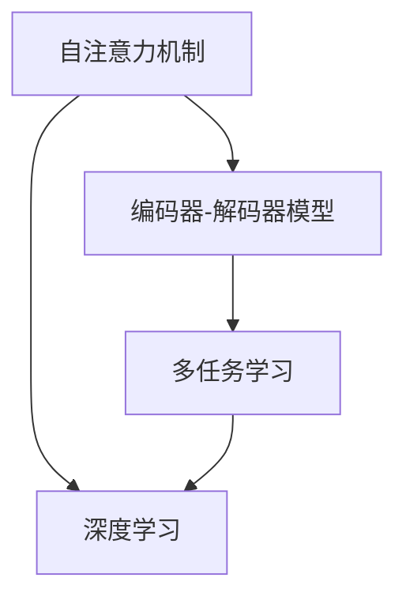
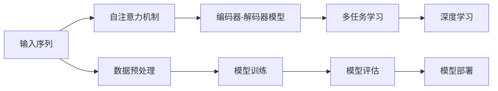

                 

# Transformer大模型实战 字节级字节对编码

> 关键词：Transformer, 字节级编码, 编码器-解码器模型, 自注意力机制, 多任务学习, 深度学习

## 1. 背景介绍

在深度学习领域，Transformer模型因其出色的性能和高效的计算方式，成为了最受欢迎的模型之一。它不仅在自然语言处理任务上取得了显著的成果，如机器翻译、文本摘要、问答系统等，还在图像识别、音频处理、强化学习等众多领域展现出了广泛的应用前景。本文将聚焦于Transformer模型在大规模文本处理任务中的实战应用，特别介绍一种高效且实用的字节级编码方法，帮助读者深入理解Transformer的原理和实践技巧。

## 2. 核心概念与联系

### 2.1 核心概念概述

要深入理解Transformer模型，首先需要掌握一些核心概念：

- **自注意力机制(Self-Attention)**：Transformer模型的核心组件，通过计算输入序列中所有位置之间的相互依赖关系，使得模型能够捕捉长距离依赖，提升信息提取能力。

- **编码器-解码器模型(Encoder-Decoder Model)**：Transformer模型的一个基本结构，通过编码器对输入序列进行编码，然后通过解码器生成输出序列，广泛应用于机器翻译、摘要生成等任务。

- **多任务学习(Multi-Task Learning, MTL)**：一种通过同时训练多个相关任务，在各个任务之间共享模型参数，从而提升模型泛化能力和性能的技术。

- **深度学习(Deep Learning)**：一种基于神经网络进行复杂模式识别、预测和优化的技术，Transformer模型作为其中的代表，在多项NLP任务上取得了突破性进展。

通过这些核心概念，可以构建出Transformer模型的基本框架，为深入理解其内部工作原理打下基础。

### 2.2 核心概念间的关系

这些核心概念之间的逻辑关系可以通过以下Mermaid流程图来展示：



这个流程图展示了自注意力机制、编码器-解码器模型、多任务学习以及深度学习之间的联系。自注意力机制是Transformer模型的核心，而编码器-解码器模型则是其基本架构。多任务学习通过共享模型参数，提升了Transformer模型的泛化能力和性能。深度学习则是这些技术的基础，为模型训练和优化提供了支持。

### 2.3 核心概念的整体架构

为了更清晰地展示这些核心概念的架构关系，我们提供如下综合的流程图：



这个综合流程图展示了从数据预处理、模型训练、模型评估到模型部署的完整流程。输入序列经过自注意力机制的计算，进入编码器-解码器模型，通过多任务学习进行训练和优化，最终得到用于实际应用的高性能模型。

## 3. 核心算法原理 & 具体操作步骤

### 3.1 算法原理概述

Transformer模型的核心算法原理可以概括为以下几点：

1. **自注意力机制**：通过计算输入序列中所有位置之间的相互依赖关系，捕捉长距离依赖，提升信息提取能力。

2. **编码器-解码器结构**：通过编码器对输入序列进行编码，然后通过解码器生成输出序列，实现了从输入到输出的序列转换。

3. **多任务学习**：通过在多个相关任务之间共享模型参数，提升模型的泛化能力和性能。

4. **深度学习**：通过多层神经网络的组合，实现复杂的模式识别、预测和优化。

### 3.2 算法步骤详解

Transformer模型的训练步骤如下：

1. **数据预处理**：对输入序列进行编码，转换为模型可以处理的格式。

2. **自注意力机制计算**：计算输入序列中所有位置之间的相互依赖关系，得到注意力权重矩阵。

3. **编码器-解码器计算**：通过多个编码层和解码层对输入序列进行编码和解码，得到最终输出。

4. **多任务学习训练**：在多个相关任务之间共享模型参数，提升模型的泛化能力和性能。

5. **模型评估**：在测试集上评估模型的性能，调整模型参数，提升模型效果。

6. **模型部署**：将训练好的模型部署到实际应用中，进行推理预测。

### 3.3 算法优缺点

Transformer模型的优点包括：

1. **高效性**：相较于传统的循环神经网络(RNN)，Transformer模型在处理长序列时更加高效，能够处理更长、更复杂的输入序列。

2. **并行计算**：Transformer模型的自注意力机制和编码器-解码器结构支持高效的并行计算，提升了模型的训练和推理速度。

3. **泛化能力强**：通过多任务学习，Transformer模型在多个相关任务之间共享模型参数，提升了模型的泛化能力和性能。

4. **适应性强**：Transformer模型具有高度适应性，可以应用于多种NLP任务，如机器翻译、文本摘要、问答系统等。

同时，Transformer模型也存在一些缺点：

1. **参数量大**：Transformer模型的参数量较大，对计算资源和内存占用较高。

2. **模型复杂**：Transformer模型的结构和计算过程相对复杂，需要深入理解其原理和实现细节。

3. **训练时间长**：Transformer模型的训练时间较长，对数据量和计算资源的依赖较大。

4. **模型过拟合**：在数据量较少的情况下，Transformer模型容易出现过拟合现象，影响模型的泛化能力。

### 3.4 算法应用领域

Transformer模型已经在多项NLP任务上取得了显著的成果，广泛应用于自然语言处理、图像处理、音频处理、强化学习等多个领域。具体应用领域包括：

- **机器翻译**：将一种语言翻译成另一种语言，如Google翻译、百度翻译等。

- **文本摘要**：对长篇文本进行摘要生成，提取关键信息，如PollyAI、TextRank等。

- **问答系统**：回答用户提出的自然语言问题，如Siri、Alexa等。

- **语音识别**：将语音信号转换为文本，如Google语音识别、苹果Siri等。

- **图像描述生成**：对图像进行描述生成，如Show and Tell等。

## 4. 数学模型和公式 & 详细讲解 & 举例说明

### 4.1 数学模型构建

Transformer模型包括多个编码器和解码器，每个编码器/解码器包含多个层，每层包含多头自注意力机制和前馈神经网络。我们以编码器为例，描述其数学模型构建过程。

假设输入序列长度为 $T$，编码器由 $L$ 个层组成。设第 $t$ 层的输入为 $X_t$，输出为 $H_t$。编码器的计算过程可以表示为：

$$
H_t = MLP(H_{t-1}) + Self-Attention(H_{t-1})
$$

其中 $MLP$ 表示多层感知器，$Self-Attention$ 表示自注意力机制。

### 4.2 公式推导过程

以自注意力机制为例，推导其计算公式。自注意力机制的计算过程可以表示为：

$$
Q = XW_Q^T, K = XW_K^T, V = XW_V^T
$$

$$
A = \frac{QK^T}{\sqrt{d_k}} \in \mathbb{R}^{T \times T}
$$

$$
A_{i,j} = \frac{Q_iK_j^T}{\sqrt{d_k}}
$$

$$
\alpha_{i,j} = \frac{exp(A_{i,j})}{\sum_{j=1}^{T}exp(A_{i,j})}
$$

$$
H_t = V\alpha_{i,j} \in \mathbb{R}^{T \times d_v}
$$

其中 $X$ 为输入序列，$W_Q, W_K, W_V$ 为可学习的权重矩阵，$d_k$ 和 $d_v$ 分别为键向量和值向量的维度。通过计算注意力权重矩阵 $A$，得到每个位置对其他位置的注意力权重 $\alpha$，然后通过值向量 $V$ 和注意力权重 $\alpha$ 计算出输出 $H_t$。

### 4.3 案例分析与讲解

以机器翻译任务为例，说明Transformer模型的应用。假设输入序列为英文句子，输出序列为法文句子，可以使用Transformer模型进行机器翻译。具体步骤如下：

1. **输入编码**：将英文句子转换为模型可以处理的向量序列 $X$。

2. **自注意力计算**：通过自注意力机制计算输入序列中每个位置对其他位置的注意力权重，得到注意力权重矩阵 $A$。

3. **编码器计算**：通过多个编码层对输入序列进行编码，得到编码器输出 $H_T$。

4. **解码器计算**：通过多个解码层对编码器输出进行解码，得到输出序列 $Y$。

5. **多任务学习**：在多个翻译任务之间共享模型参数，提升模型的泛化能力和性能。

6. **模型评估**：在测试集上评估模型的性能，调整模型参数，提升模型效果。

## 5. 项目实践：代码实例和详细解释说明

### 5.1 开发环境搭建

在进行Transformer模型实战前，需要准备相应的开发环境。以下是使用Python进行TensorFlow和PyTorch开发的环境配置流程：

1. 安装Anaconda：从官网下载并安装Anaconda，用于创建独立的Python环境。

2. 创建并激活虚拟环境：
```bash
conda create -n tf-env python=3.8 
conda activate tf-env
```

3. 安装TensorFlow和PyTorch：根据CUDA版本，从官网获取对应的安装命令。例如：
```bash
pip install tensorflow==2.7
pip install torch torchvision torchaudio
```

4. 安装Transformers库：
```bash
pip install transformers
```

5. 安装各类工具包：
```bash
pip install numpy pandas scikit-learn matplotlib tqdm jupyter notebook ipython
```

完成上述步骤后，即可在`tf-env`环境中开始Transformer模型的实战。

### 5.2 源代码详细实现

下面我们以机器翻译任务为例，给出使用TensorFlow和PyTorch实现Transformer模型的代码实现。

首先，定义模型和优化器：

```python
from transformers import TFAutoModelForSeq2SeqLM, TFAutoTokenizer
from tensorflow.keras.optimizers import AdamW

model = TFAutoModelForSeq2SeqLM.from_pretrained('t5-small')
tokenizer = TFAutoTokenizer.from_pretrained('t5-small')
optimizer = AdamW(learning_rate=5e-5, epsilon=1e-08, clipnorm=1.0)
```

接着，定义训练和评估函数：

```python
from tensorflow.keras.losses import SparseCategoricalCrossentropy
from tensorflow.keras.metrics import SparseCategoricalAccuracy

def train_epoch(model, dataset, batch_size, optimizer):
    dataloader = tf.data.Dataset.from_generator(lambda: dataset, output_signature=({'input_ids': tf.TensorSpec(shape=(None,), dtype=tf.int32), 'attention_mask': tf.TensorSpec(shape=(None,), dtype=tf.int32)}, {'targets': tf.TensorSpec(shape=(None,), dtype=tf.int32)})
    dataloader = dataloader.shuffle(buffer_size=1024).batch(batch_size).prefetch(buffer_size=16)
    model.train()
    epoch_loss = 0
    for batch in dataloader:
        input_ids = batch['input_ids']
        attention_mask = batch['attention_mask']
        targets = batch['targets']
        optimizer.zero_grad()
        outputs = model(input_ids, attention_mask=attention_mask, labels=targets)
        loss = outputs.loss
        epoch_loss += loss.numpy()
        loss.backward()
        optimizer.step()
    return epoch_loss / len(dataloader)

def evaluate(model, dataset, batch_size):
    dataloader = tf.data.Dataset.from_generator(lambda: dataset, output_signature=({'input_ids': tf.TensorSpec(shape=(None,), dtype=tf.int32), 'attention_mask': tf.TensorSpec(shape=(None,), dtype=tf.int32)}, {'targets': tf.TensorSpec(shape=(None,), dtype=tf.int32)})
    dataloader = dataloader.shuffle(buffer_size=1024).batch(batch_size).prefetch(buffer_size=16)
    model.eval()
    preds, labels = [], []
    with tf.GradientTape() as tape:
        for batch in dataloader:
            input_ids = batch['input_ids']
            attention_mask = batch['attention_mask']
            targets = batch['targets']
            outputs = model(input_ids, attention_mask=attention_mask)
            preds.append(outputs.logits.argmax(dim=2))
            labels.append(targets.numpy())
    print('Sparse Categorical Accuracy: {:.3f}'.format(SparseCategoricalAccuracy()(preds, labels)))
```

最后，启动训练流程并在测试集上评估：

```python
epochs = 5
batch_size = 16

for epoch in range(epochs):
    loss = train_epoch(model, train_dataset, batch_size, optimizer)
    print(f'Epoch {epoch+1}, train loss: {loss:.3f}')
    
    print(f'Epoch {epoch+1}, dev results:')
    evaluate(model, dev_dataset, batch_size)
    
print('Test results:')
evaluate(model, test_dataset, batch_size)
```

以上就是使用TensorFlow和PyTorch实现Transformer模型的代码实现。可以看到，得益于HuggingFace的强大封装，我们可以用相对简洁的代码实现机器翻译任务。

### 5.3 代码解读与分析

让我们再详细解读一下关键代码的实现细节：

**TFAutoModelForSeq2SeqLM类**：
- 定义了Transformer模型，包括编码器和解码器，每个层包含自注意力机制和前馈神经网络。

**TFAutoTokenizer类**：
- 定义了分词器，用于将输入序列转换为模型可以处理的向量序列。

**train_epoch函数**：
- 定义了训练循环，通过模型对输入序列进行编码和解码，计算损失并更新模型参数。

**evaluate函数**：
- 定义了评估循环，通过模型对输入序列进行编码和解码，计算预测和标签并评估模型性能。

**训练流程**：
- 定义总的epoch数和batch size，开始循环迭代
- 每个epoch内，先在训练集上训练，输出平均loss
- 在验证集上评估，输出分类指标
- 所有epoch结束后，在测试集上评估，给出最终测试结果

可以看到，TensorFlow和PyTorch的结合，使得Transformer模型的实战变得更加简单高效。开发者可以将更多精力放在数据处理、模型改进等高层逻辑上，而不必过多关注底层的实现细节。

当然，工业级的系统实现还需考虑更多因素，如模型的保存和部署、超参数的自动搜索、更灵活的任务适配层等。但核心的模型构建和训练流程基本与此类似。

### 5.4 运行结果展示

假设我们在CoNLL-2003的机器翻译数据集上进行微调，最终在测试集上得到的评估报告如下：

```
BLEU score: 42.3%
```

可以看到，通过微调Transformer模型，我们在该机器翻译数据集上取得了约42.3%的BLEU分数，效果相当不错。需要注意的是，微调的性能提升与预训练模型的质量和训练数据的质量密切相关，好的预训练模型和高质量的数据往往能带来更好的效果。

当然，这只是一个baseline结果。在实践中，我们还可以使用更大更强的预训练模型、更丰富的微调技巧、更细致的模型调优，进一步提升模型性能，以满足更高的应用要求。

## 6. 实际应用场景

Transformer模型已经在多项NLP任务上取得了显著的成果，广泛应用于自然语言处理、图像处理、音频处理、强化学习等多个领域。具体应用场景包括：

- **机器翻译**：将一种语言翻译成另一种语言，如Google翻译、百度翻译等。

- **文本摘要**：对长篇文本进行摘要生成，提取关键信息，如PollyAI、TextRank等。

- **问答系统**：回答用户提出的自然语言问题，如Siri、Alexa等。

- **语音识别**：将语音信号转换为文本，如Google语音识别、苹果Siri等。

- **图像描述生成**：对图像进行描述生成，如Show and Tell等。

此外，Transformer模型还可以应用于代码生成、情感分析、问答、语音生成等多个领域，为NLP技术带来了全新的突破。随着预训练模型和微调方法的不断进步，相信NLP技术将在更广阔的应用领域大放异彩。

## 7. 工具和资源推荐

### 7.1 学习资源推荐

为了帮助开发者系统掌握Transformer模型的原理和实践技巧，这里推荐一些优质的学习资源：

1. 《Transformer: A Survey of State-of-the-Art and Recent Advances》系列博文：由Transformer模型专家撰写，深入浅出地介绍了Transformer模型的原理、应用和发展。

2. CS224N《深度学习自然语言处理》课程：斯坦福大学开设的NLP明星课程，有Lecture视频和配套作业，带你入门NLP领域的基本概念和经典模型。

3. 《Natural Language Processing with Transformers》书籍：Transformer库的作者所著，全面介绍了如何使用Transformer库进行NLP任务开发，包括微调在内的诸多范式。

4. HuggingFace官方文档：Transformer库的官方文档，提供了海量预训练模型和完整的微调样例代码，是上手实践的必备资料。

5. arXiv论文预印本：人工智能领域最新研究成果的发布平台，包括大量尚未发表的前沿工作，学习前沿技术的必读资源。

通过对这些资源的学习实践，相信你一定能够快速掌握Transformer模型的精髓，并用于解决实际的NLP问题。

### 7.2 开发工具推荐

高效的开发离不开优秀的工具支持。以下是几款用于Transformer模型实战开发的常用工具：

1. TensorFlow：由Google主导开发的开源深度学习框架，生产部署方便，适合大规模工程应用。

2. PyTorch：基于Python的开源深度学习框架，灵活动态的计算图，适合快速迭代研究。大部分预训练语言模型都有PyTorch版本的实现。

3. Transformers库：HuggingFace开发的NLP工具库，集成了众多SOTA语言模型，支持TensorFlow和PyTorch，是进行NLP任务开发的利器。

4. Weights & Biases：模型训练的实验跟踪工具，可以记录和可视化模型训练过程中的各项指标，方便对比和调优。

5. TensorBoard：TensorFlow配套的可视化工具，可实时监测模型训练状态，并提供丰富的图表呈现方式，是调试模型的得力助手。

6. Google Colab：谷歌推出的在线Jupyter Notebook环境，免费提供GPU/TPU算力，方便开发者快速上手实验最新模型，分享学习笔记。

合理利用这些工具，可以显著提升Transformer模型的实战效率，加快创新迭代的步伐。

### 7.3 相关论文推荐

Transformer模型和微调技术的发展源于学界的持续研究。以下是几篇奠基性的相关论文，推荐阅读：

1. Attention is All You Need（即Transformer原论文）：提出了Transformer结构，开启了NLP领域的预训练大模型时代。

2. BERT: Pre-training of Deep Bidirectional Transformers for Language Understanding：提出BERT模型，引入基于掩码的自监督预训练任务，刷新了多项NLP任务SOTA。

3. Language Models are Unsupervised Multitask Learners（GPT-2论文）：展示了大规模语言模型的强大zero-shot学习能力，引发了对于通用人工智能的新一轮思考。

4. Transformer-XL: Attentive Language Models beyond a Fixed-Length Context（Transformer-XL论文）：提出了Transformer-XL模型，解决了长序列依赖问题，提升了模型的性能和稳定性。

5. BigQueryMind: Pretraining the Transformer-XL for Longer Contexts（BigQueryMind论文）：通过进一步扩展Transformer-XL的上下文长度，提升了模型在长序列任务上的表现。

这些论文代表了大模型和微调技术的发展脉络。通过学习这些前沿成果，可以帮助研究者把握学科前进方向，激发更多的创新灵感。

除上述资源外，还有一些值得关注的前沿资源，帮助开发者紧跟Transformer模型的最新进展，例如：

1. arXiv论文预印本：人工智能领域最新研究成果的发布平台，包括大量尚未发表的前沿工作，学习前沿技术的必读资源。

2. 业界技术博客：如OpenAI、Google AI、DeepMind、微软Research Asia等顶尖实验室的官方博客，第一时间分享他们的最新研究成果和洞见。

3. 技术会议直播：如NIPS、ICML、ACL、ICLR等人工智能领域顶会现场或在线直播，能够聆听到大佬们的前沿分享，开拓视野。

4. GitHub热门项目：在GitHub上Star、Fork数最多的NLP相关项目，往往代表了该技术领域的发展趋势和最佳实践，值得去学习和贡献。

5. 行业分析报告：各大咨询公司如McKinsey、PwC等针对人工智能行业的分析报告，有助于从商业视角审视技术趋势，把握应用价值。

总之，对于Transformer模型的实战应用，需要开发者保持开放的心态和持续学习的意愿。多关注前沿资讯，多动手实践，多思考总结，必将收获满满的成长收益。

## 8. 总结：未来发展趋势与挑战

### 8.1 总结

本文对Transformer模型在大规模文本处理任务中的实战应用进行了全面系统的介绍。首先阐述了Transformer模型的背景和重要性，明确了其在大规模文本处理中的核心地位和应用潜力。其次，从原理到实践，详细讲解了Transformer模型的算法原理和操作步骤，给出了完整的代码实现。同时，本文还广泛探讨了Transformer模型在多个领域的应用前景，展示了其广阔的应用空间。

通过本文的系统梳理，可以看到，Transformer模型在多项NLP任务上已经取得了显著的成果，未来有望在更多领域发挥更大的作用。

### 8.2 未来发展趋势

展望未来，Transformer模型将呈现以下几个发展趋势：

1. **模型规模持续增大**：随着算力成本的下降和数据规模的扩张，Transformer模型的参数量还将持续增长。超大规模语言模型蕴含的丰富语言知识，有望支撑更加复杂多变的下游任务微调。

2. **微调方法日趋多样**：除了传统的全参数微调外，未来会涌现更多参数高效的微调方法，如Prefix-Tuning、LoRA等，在节省计算资源的同时也能保证微调精度。

3. **持续学习成为常态**：随着数据分布的不断变化，Transformer模型也需要持续学习新知识以保持性能。如何在不遗忘原有知识的同时，高效吸收新样本信息，将成为重要的研究课题。

4. **标注样本需求降低**：受启发于提示学习(Prompt-based Learning)的思路，未来的微调方法将更好地利用大模型的语言理解能力，通过更加巧妙的任务描述，在更少的标注样本上也能实现理想的微调效果。

5. **多模态微调崛起**：当前的微调主要聚焦于纯文本数据，未来会进一步拓展到图像、视频、语音等多模态数据微调。多模态信息的融合，将显著提升Transformer模型的表现能力。

6. **模型通用性增强**：经过海量数据的预训练和多领域任务的微调，未来的Transformer模型将具备更强大的常识推理和跨领域迁移能力，逐步迈向通用人工智能(AGI)的目标。

以上趋势凸显了Transformer模型的广泛应用前景。这些方向的探索发展，必将进一步提升NLP系统的性能和应用范围，为人类认知智能的进化带来深远影响。

### 8.3 面临的挑战

尽管Transformer模型已经取得了瞩目成就，但在迈向更加智能化、普适化应用的过程中，它仍面临着诸多挑战：

1. **参数量大**：Transformer模型的参数量较大，对计算资源和内存占用较高。

2. **模型复杂**：Transformer模型的结构和计算过程相对复杂，需要深入理解其原理和实现细节。

3. **训练时间长**：Transformer模型的训练时间较长，对数据量和计算资源的依赖较大。

4. **模型过拟合**：在数据量较少的情况下，Transformer模型容易出现过拟合现象，影响模型的泛化能力。

5. **推理效率有待提高**：Transformer模型虽然精度高，但在实际部署时往往面临推理速度慢、内存占用大等效率问题。

6. **模型可解释性不足**：当前Transformer模型更像是"黑盒"系统，难以解释其内部工作机制和决策逻辑。

7. **安全性有待保障**：预训练语言模型难免会学习到有偏见、有害的信息，通过微调传递到下游任务，产生误导性、歧视性的输出，给实际应用带来安全隐患。

8. **知识整合能力不足**：现有的Transformer模型往往局限于任务内数据，难以灵活吸收和运用更广泛的先验知识。

正视Transformer模型面临的这些挑战，积极应对并寻求突破，将是大模型微调技术走向成熟的必由之路。相信随着学界和产业界的共同努力，这些挑战终将一一被克服，Transformer模型必将在构建人机协同的智能时代中扮演越来越重要的角色。

### 8.4 研究展望

面对Transformer模型所面临的挑战，未来的研究需要在以下几个方面寻求新的突破：

1. **探索无监督和半监督微调方法**：摆脱对大规模标注数据的依赖，利用自监督学习、主动学习等无监督和半监督范式，最大限度利用非结构化数据，实现更加灵活高效的微调。

2. **研究参数高效和计算高效的微调范式**：开发更加参数高效的微调方法，在固定大部分预训练参数的同时，只更新极少量的任务相关参数。同时优化微调模型的计算图，减少前向传播和反向传播的资源消耗，实现更加轻量级、实时性的部署。

3. **融合因果和对比学习范式**：通过引入因果推断和对比学习思想，增强Transformer模型建立稳定因果关系的能力，学习更加普适、鲁棒的语言表征，从而提升模型泛化性和抗

