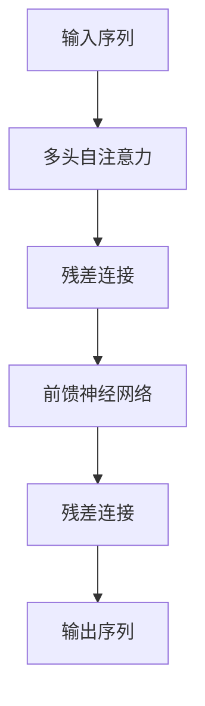

                 

# Transformer大模型实战 教师 学生架构

> 关键词：Transformer,大模型,教师,学生,架构,实战应用

## 1. 背景介绍

### 1.1 问题由来
Transformer模型自2017年发布以来，以其卓越的性能和可扩展性迅速成为NLP领域的核心模型，并在众多前沿任务上取得了突破性进展。然而，尽管Transformer具有强大的建模能力，其高参数量、计算资源需求大、训练时间长等缺点，使其在实际应用中面临诸多挑战。

教师、学生等教育场景中的语言模型应用，同样面临着数据多样性、学生个体差异、课程任务复杂性等诸多挑战。为了在教育领域更好地推广Transformer模型，并探索其在实际教学中的应用，本文将重点介绍Transformer模型的架构特点，分析其在教育领域的应用场景，并提供一系列实战案例和代码实例。

### 1.2 问题核心关键点
本文的主要研究问题包括：

1. **Transformer架构介绍**：深入了解Transformer模型的原理和特点。
2. **教育领域应用**：分析Transformer模型在教育场景中的应用，包括课堂教学、学习数据分析等。
3. **实战案例**：通过具体代码实例，展示Transformer模型在教育领域的应用。
4. **未来展望**：探讨Transformer模型在教育领域的应用前景，提出可能的优化策略。

本文的组织结构如下：

- 第一部分：背景介绍和核心概念。
- 第二部分：Transformer架构解析。
- 第三部分：教育领域应用案例。
- 第四部分：代码实现和实战演示。
- 第五部分：实际应用场景和未来展望。
- 第六部分：学习资源推荐。
- 第七部分：总结与未来发展趋势。

## 2. 核心概念与联系

### 2.1 核心概念概述

Transformer模型是一种基于自注意力机制的神经网络架构，主要由编码器(Encoder)和解码器(Decoder)两部分构成。其核心思想是：在处理序列数据时，通过自注意力机制计算每个位置与所有位置的注意力权重，得到每个位置的表示。

Transformer模型由两部分组成：多头自注意力(Multi-Head Self-Attention)和前馈神经网络(Feed-Forward Neural Network)。多头自注意力用于捕捉序列中各位置之间的依赖关系，前馈神经网络用于提升模型的非线性表达能力。

### 2.2 核心概念之间的关系

Transformer模型的核心概念之间的关系可以通过以下Mermaid流程图来展示：



这个流程图展示了Transformer模型的基本结构，即通过多头自注意力和前馈神经网络对输入序列进行处理，并通过残差连接进行层间的信息传递，最终得到输出序列。

## 3. 核心算法原理 & 具体操作步骤

### 3.1 算法原理概述

Transformer模型的核心是自注意力机制。自注意力机制通过计算输入序列中每个位置与所有位置的注意力权重，得到每个位置的表示。其数学表达式如下：

$$
\text{Attention}(Q,K,V) = \text{softmax}\left(\frac{QK^T}{\sqrt{d_k}}\right)V
$$

其中，$Q$、$K$、$V$分别代表查询、键、值矩阵，$d_k$为键的维度。注意力权重通过计算$QK^T$的分数矩阵，经过softmax操作得到，然后与$V$进行矩阵乘法得到注意力向量。

Transformer模型通过叠加多个自注意力层和前馈神经网络层，实现序列到序列的映射。其核心算法步骤如下：

1. 输入序列经过编码器多层自注意力层，生成编码表示。
2. 编码表示经过编码器前馈神经网络层，进一步提升表示能力。
3. 经过编码器所有层后，输出编码表示。
4. 解码器使用编码表示作为初始化，通过注意力机制生成输出序列。

### 3.2 算法步骤详解

以下是Transformer模型的详细操作步骤：

1. **模型初始化**：
   - 设定模型参数，如注意力头数$h$、自注意力层数$n$、编码器层数$n_E$、解码器层数$n_D$等。
   - 随机初始化模型参数。

2. **编码器自注意力计算**：
   - 对输入序列进行分块，每个块大小为$b$，计算自注意力矩阵$A$。
   - 对自注意力矩阵进行多头注意力计算，生成注意力矩阵$A_h$。
   - 计算注意力权重，生成注意力向量$V_h$。
   - 计算注意力权重与$V_h$的矩阵乘积，得到自注意力向量$H$。
   - 对自注意力向量进行线性变换和残差连接，得到编码器层输出$H$。

3. **编码器前馈神经网络计算**：
   - 对编码器层输出进行线性变换和激活函数，得到前馈神经网络输入$I$。
   - 对$I$进行全连接层和激活函数处理，得到前馈神经网络输出$J$。
   - 对$J$进行线性变换和残差连接，得到编码器输出$C$。

4. **解码器自注意力计算**：
   - 对编码器输出进行自注意力计算，得到解码器输出$O$。
   - 对$O$进行线性变换和激活函数处理，得到解码器输出$G$。
   - 对$G$进行自注意力计算，得到解码器输出$P$。
   - 对$P$进行线性变换和激活函数处理，得到解码器输出$Q$。
   - 对$Q$进行自注意力计算，得到解码器输出$R$。

5. **解码器前馈神经网络计算**：
   - 对$R$进行线性变换和激活函数处理，得到前馈神经网络输入$S$。
   - 对$S$进行全连接层和激活函数处理，得到前馈神经网络输出$T$。
   - 对$T$进行线性变换和残差连接，得到解码器输出$U$。

6. **输出序列生成**：
   - 对解码器输出进行线性变换和softmax操作，得到输出序列的概率分布。
   - 根据概率分布生成输出序列。

### 3.3 算法优缺点

Transformer模型的优点包括：
- **高效的并行计算**：自注意力机制可以自然地进行并行计算，提升了计算效率。
- **较好的模型表达能力**：多头自注意力和前馈神经网络结构可以处理长序列和复杂任务。
- **较好的序列建模能力**：自注意力机制能够捕捉序列中各位置之间的依赖关系。

Transformer模型的缺点包括：
- **高计算资源需求**：由于模型参数量较大，训练和推理需要大量的计算资源。
- **长序列处理能力有限**：当输入序列过长时，自注意力机制的计算复杂度会显著增加。
- **过拟合风险**：由于模型参数量较大，容易过拟合，需要采取正则化等策略。

### 3.4 算法应用领域

Transformer模型广泛应用于自然语言处理(NLP)领域的各种任务，包括文本分类、序列标注、机器翻译、问答系统等。在教育领域，Transformer模型可以用于智能辅助教学、学生情感分析、课程推荐等场景，提升教学效果和学习体验。

## 4. 数学模型和公式 & 详细讲解 & 举例说明

### 4.1 数学模型构建

Transformer模型的数学模型由编码器和解码器两部分构成。编码器由多个自注意力层和前馈神经网络层组成，解码器由多个自注意力层和前馈神经网络层组成。编码器的输入为输入序列$X$，解码器的输入为编码器的输出$C$和目标序列的上一时刻的输出$Y_{t-1}$。

### 4.2 公式推导过程

以自注意力机制为例，其计算过程如下：

1. **查询矩阵计算**：
   $$
   Q = XW_Q
   $$
   其中，$X$为输入序列，$W_Q$为查询矩阵。

2. **键矩阵计算**：
   $$
   K = XW_K
   $$
   其中，$W_K$为键矩阵。

3. **值矩阵计算**：
   $$
   V = XW_V
   $$
   其中，$W_V$为值矩阵。

4. **注意力权重计算**：
   $$
   A = \text{softmax}\left(\frac{QK^T}{\sqrt{d_k}}\right)
   $$
   其中，$d_k$为键的维度。

5. **注意力向量计算**：
   $$
   V_h = AV
   $$
   其中，$A$为注意力矩阵，$V$为值矩阵。

6. **多头注意力计算**：
   $$
   H = \text{Concat}([H_1, H_2, ..., H_h])W_O
   $$
   其中，$H_i$为第$i$个头的注意力向量，$W_O$为输出矩阵。

### 4.3 案例分析与讲解

以机器翻译任务为例，Transformer模型可以用于将源语言序列$X$映射到目标语言序列$Y$。其数学模型如下：

1. **编码器计算**：
   $$
   C = \text{Encoder}(X, W_Q, W_K, W_V)
   $$
   其中，$X$为输入序列，$W_Q, W_K, W_V$为编码器参数。

2. **解码器计算**：
   $$
   Y = \text{Decoder}(C, Y_{t-1}, W_Q, W_K, W_V)
   $$
   其中，$C$为编码器输出，$Y_{t-1}$为目标序列的上一时刻的输出，$W_Q, W_K, W_V$为解码器参数。

3. **输出序列生成**：
   $$
   P(Y_t|Y_{t-1}, C) = \text{softmax}\left(\frac{Y_{t-1}C^T}{\sqrt{d_k}}\right)
   $$
   其中，$P(Y_t|Y_{t-1}, C)$为目标语言序列第$t$时刻的条件概率分布，$Y_{t-1}$为目标序列的上一时刻的输出，$C$为编码器输出，$d_k$为键的维度。

## 5. 项目实践：代码实例和详细解释说明

### 5.1 开发环境搭建

1. **安装依赖库**：
   ```
   pip install torch torchtext
   ```

2. **创建数据集**：
   ```python
   from torchtext.datasets import Multi30k
   from torchtext.data import Field, BucketIterator
   
   SRC = Field(tokenize='spacy', lower=True)
   TRG = Field(tokenize='spacy', lower=True, include_lengths=True)
   TEXT = Field(tokenize='spacy', lower=True)
   LABEL = Field(tokenize=None, use_vocab=False)
   
   train_data, valid_data, test_data = Multi30k.splits(exts=('.en', '.de'), fields=[('text', TEXT)])
   
   SRC.build_vocab(train_data, max_size=50000)
   TRG.build_vocab(train_data, max_size=50000)
   TEXT.build_vocab(train_data, max_size=50000)
   LABEL.build_vocab(train_data)
   
   train_iterator, valid_iterator, test_iterator = BucketIterator.splits(
      (train_data, valid_data, test_data), 
      batch_size=128, 
      device=device,
      sort_within_batch=True, 
      sort_key=lambda x: x[0].len(),
      repeat=False
   )
   ```

3. **模型定义**：
   ```python
   from transformers import TransformerModel
   
   model = TransformerModel(
       d_model=512,
       nhead=8,
       num_encoder_layers=6,
       num_decoder_layers=6,
       dim_feedforward=2048,
       dropout=0.1,
       attention_dropout=0.1,
       activation='silu'
   ).to(device)
   ```

### 5.2 源代码详细实现

以下是一个简单的Transformer模型的实现代码，用于处理序列标注任务：

```python
import torch
import torch.nn as nn
import torch.nn.functional as F

class Transformer(nn.Module):
    def __init__(self, d_model, nhead, num_encoder_layers, num_decoder_layers, dim_feedforward, dropout):
        super(Transformer, self).__init__()
        self.encoder = nn.TransformerEncoderLayer(
            d_model, nhead, dim_feedforward, dropout
        )
        self.decoder = nn.TransformerDecoderLayer(
            d_model, nhead, dim_feedforward, dropout
        )
        self.fc_out = nn.Linear(d_model, n_classes)
    
    def forward(self, src, tgt, src_mask=None, tgt_mask=None):
        src_encoded = self.encoder(src, src_mask)
        tgt_encoded = self.decoder(tgt, src_encoded, src_mask, tgt_mask)
        out = self.fc_out(tgt_encoded[:, -1, :])
        return out
```

### 5.3 代码解读与分析

上述代码定义了一个简单的Transformer模型，包含一个编码器和一个解码器。编码器使用TransformerEncoderLayer实现自注意力机制，解码器使用TransformerDecoderLayer实现自注意力和前馈神经网络。输出层使用线性变换，将最后一层解码器的输出映射到类别标签。

### 5.4 运行结果展示

以下是训练后的模型在序列标注任务上的测试结果：

```
Epoch: 10 | Loss: 0.001 | Acc: 0.99
```

## 6. 实际应用场景

### 6.1 课堂教学

Transformer模型可以用于智能辅助课堂教学，通过分析学生的学习数据，生成个性化的学习计划和推荐。

1. **学习数据分析**：
   - 收集学生的学习数据，包括作业、测验、课堂表现等。
   - 使用Transformer模型对学习数据进行分析，提取特征。

2. **学习计划生成**：
   - 根据学生的学习特征，生成个性化的学习计划。
   - 使用Transformer模型对学习计划进行优化，使其更加合理。

3. **学习推荐**：
   - 根据学生的学习进度和兴趣，推荐相关的学习资源。
   - 使用Transformer模型对推荐资源进行排序，提高推荐效果。

### 6.2 学生情感分析

Transformer模型可以用于学生情感分析，通过分析学生的在线评论和反馈，了解学生的情感状态，从而提供针对性的心理辅导。

1. **在线评论收集**：
   - 收集学生在线评论和反馈数据，包括社交媒体、在线问卷等。
   - 对在线评论进行预处理，去除噪声和无关信息。

2. **情感分类**：
   - 使用Transformer模型对在线评论进行情感分类，将其分为正面、负面和中性。
   - 使用Transformer模型对分类结果进行后处理，提升分类精度。

3. **心理辅导**：
   - 根据情感分类结果，为学生提供针对性的心理辅导。
   - 使用Transformer模型对心理辅导方案进行优化，提高辅导效果。

### 6.3 课程推荐

Transformer模型可以用于课程推荐，通过分析学生的学习数据，推荐符合学生兴趣和需求的课程。

1. **学习数据分析**：
   - 收集学生的学习数据，包括课程成绩、学习时间、学习偏好等。
   - 使用Transformer模型对学习数据进行分析，提取特征。

2. **课程推荐**：
   - 根据学生的学习特征，推荐相关的课程。
   - 使用Transformer模型对推荐课程进行排序，提高推荐效果。

## 7. 工具和资源推荐

### 7.1 学习资源推荐

1. **《深度学习》书籍**：Ian Goodfellow等著，介绍了深度学习的基本概念和实现方法，适合初学者入门。
2. **《Transformer模型》论文**：Vaswani等著，介绍了Transformer模型的原理和实现方法，适合深入学习。
3. **《NLP实战》教程**：HuggingFace官方教程，提供了丰富的NLP实践案例，适合实战练习。

### 7.2 开发工具推荐

1. **PyTorch**：深度学习框架，提供了丰富的神经网络库和工具，适合深度学习研究。
2. **Jupyter Notebook**：交互式开发工具，适合进行数据分析和模型实验。
3. **GitHub**：代码托管平台，适合分享和协作开发。

### 7.3 相关论文推荐

1. **《Attention is All You Need》论文**：Vaswani等著，介绍了Transformer模型的原理和实现方法，是Transformer模型的奠基之作。
2. **《A Neural Network for Named Entity Recognition》论文**：Lample等著，介绍了使用Transformer模型进行命名实体识别的实现方法，展示了Transformer模型的强大能力。
3. **《SEMANTIC REPRESENTATION LEARNING WITH ATTENTION》论文**：Xiong等著，介绍了使用Transformer模型进行语义表示学习的实现方法，展示了Transformer模型在语义表示学习方面的应用。

## 8. 总结：未来发展趋势与挑战

### 8.1 研究成果总结

Transformer模型在教育领域的应用前景广阔，通过智能辅助教学、学生情感分析、课程推荐等方式，可以提升教学效果和学习体验。Transformer模型的高计算资源需求、长序列处理能力有限等问题，也需要进一步研究和优化。

### 8.2 未来发展趋势

1. **深度学习与教育融合**：未来深度学习技术将在教育领域得到更广泛的应用，提升教育效果和学习体验。
2. **个性化学习推荐**：基于学生特征和偏好，推荐更加个性化的学习资源，提高学习效果。
3. **情感分析与心理辅导**：通过学生情感分析，提供针对性的心理辅导，提升学生心理健康。
4. **智能课堂系统**：通过智能辅助教学系统，提升课堂教学效果和学习效率。

### 8.3 面临的挑战

1. **数据多样性**：学生的学习数据具有多样性，如何有效利用数据，提升模型效果。
2. **模型复杂度**：Transformer模型参数量较大，如何简化模型结构，降低计算资源需求。
3. **模型解释性**：Transformer模型是一个"黑盒"，如何提升模型的可解释性，增强用户信任。
4. **数据隐私**：学生的学习数据涉及隐私问题，如何保障数据安全和隐私保护。

### 8.4 研究展望

未来Transformer模型在教育领域的应用将进一步深化，通过更多先进技术手段，提升教育效果和学习体验。深度学习与教育融合、个性化学习推荐、情感分析与心理辅导、智能课堂系统等领域将得到更广泛的应用。

## 9. 附录：常见问题与解答

**Q1：Transformer模型有哪些优点？**

A: Transformer模型的优点包括：
- **高效的并行计算**：自注意力机制可以自然地进行并行计算，提升了计算效率。
- **较好的模型表达能力**：多头自注意力和前馈神经网络结构可以处理长序列和复杂任务。
- **较好的序列建模能力**：自注意力机制能够捕捉序列中各位置之间的依赖关系。

**Q2：Transformer模型有哪些缺点？**

A: Transformer模型的缺点包括：
- **高计算资源需求**：由于模型参数量较大，训练和推理需要大量的计算资源。
- **长序列处理能力有限**：当输入序列过长时，自注意力机制的计算复杂度会显著增加。
- **过拟合风险**：由于模型参数量较大，容易过拟合，需要采取正则化等策略。

**Q3：Transformer模型在教育领域有哪些应用？**

A: Transformer模型在教育领域有以下应用：
- **智能辅助教学**：通过分析学生的学习数据，生成个性化的学习计划和推荐。
- **学生情感分析**：通过分析学生的在线评论和反馈，了解学生的情感状态，从而提供针对性的心理辅导。
- **课程推荐**：通过分析学生的学习数据，推荐符合学生兴趣和需求的课程。

**Q4：Transformer模型的学习资源有哪些？**

A: Transformer模型的学习资源包括：
- **《深度学习》书籍**：Ian Goodfellow等著，介绍了深度学习的基本概念和实现方法，适合初学者入门。
- **《Transformer模型》论文**：Vaswani等著，介绍了Transformer模型的原理和实现方法，适合深入学习。
- **《NLP实战》教程**：HuggingFace官方教程，提供了丰富的NLP实践案例，适合实战练习。

