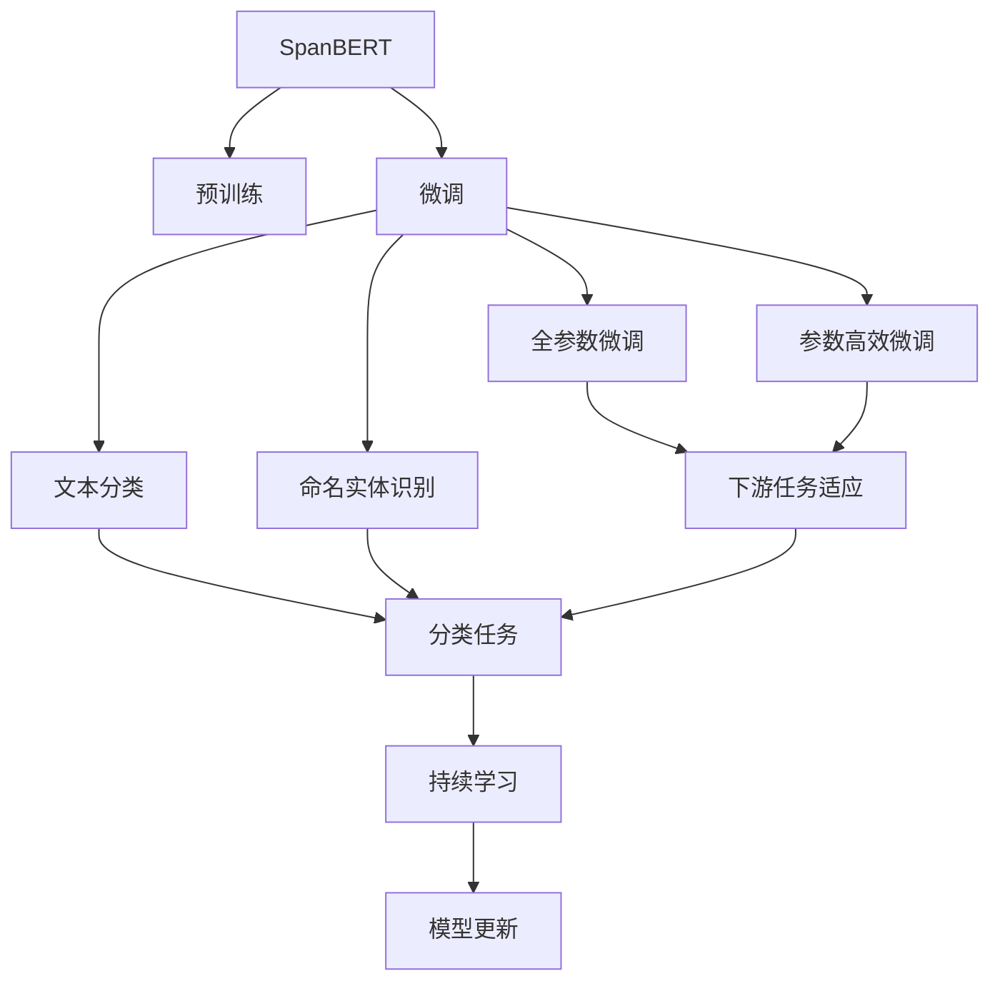
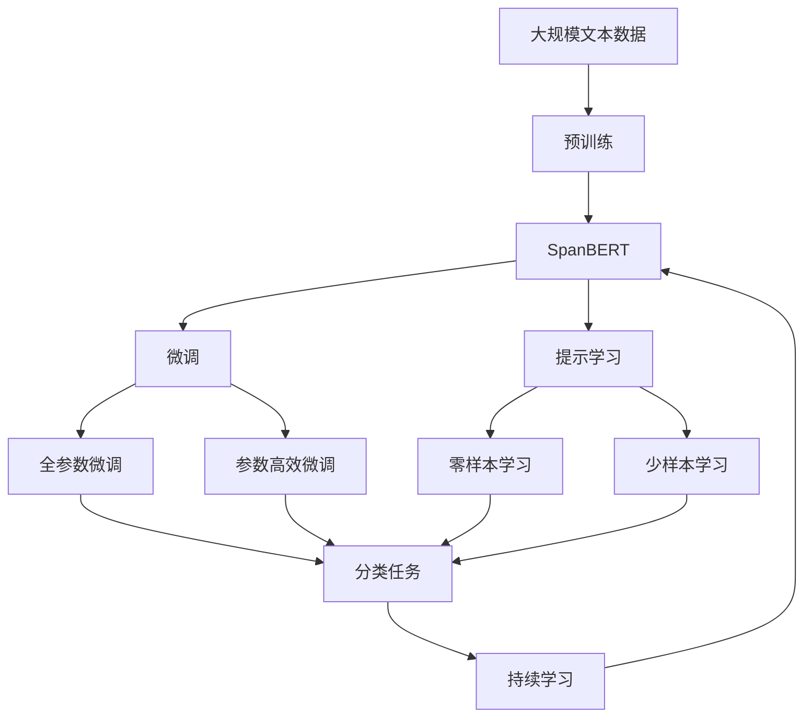

                 

# Transformer大模型实战 用SpanBERT 预测文本段

> 关键词：Transformer, SpanBERT, 文本分类, 预测模型, 代码实例

## 1. 背景介绍

### 1.1 问题由来
近年来，随着Transformer等先进深度学习架构的提出和应用，大模型在自然语言处理(NLP)领域取得了显著的进展。其中，SpanBERT是一个基于Transformer架构的预训练语言模型，在文本分类和命名实体识别等任务上表现优异。本文将通过实战展示如何使用SpanBERT进行文本分类任务，并详细介绍其核心算法原理和具体操作步骤。

### 1.2 问题核心关键点
1. **SpanBERT原理**：SpanBERT是基于Transformer架构的预训练语言模型，通过对文本中的子片段(Span)进行预训练，学习到丰富的语言表示。
2. **微调过程**：通过微调SpanBERT模型，可以将其应用于各种下游NLP任务，如文本分类、命名实体识别等。
3. **代码实现**：本文将详细展示使用Python和PyTorch框架，基于SpanBERT进行文本分类任务的具体代码实现。

### 1.3 问题研究意义
在NLP领域，大模型如SpanBERT已经展示了强大的文本表示能力和泛化能力。通过微调SpanBERT，可以将其高效应用于文本分类等任务，提升模型的预测准确率和应用范围。本文的实战内容不仅对理解SpanBERT的工作机制有帮助，还将为NLP应用的开发者提供实用的代码示例和最佳实践。

## 2. 核心概念与联系

### 2.1 核心概念概述

为更好地理解SpanBERT在文本分类任务中的应用，本节将介绍几个密切相关的核心概念：

- **SpanBERT**：基于Transformer架构的预训练语言模型，通过训练大量无标签文本数据，学习到丰富的子片段(Span)表示。
- **微调(Fine-tuning)**：在预训练模型的基础上，使用下游任务的少量标注数据进行有监督学习，优化模型在特定任务上的性能。
- **文本分类**：将文本分为不同类别的任务，如情感分析、新闻分类等。
- **Transformer架构**：一种基于自注意力机制的深度学习架构，显著提升了序列建模的能力。
- **代码实例**：本文将通过详细的代码示例，展示SpanBERT在文本分类任务中的实际应用。

### 2.2 概念间的关系

这些核心概念之间的关系可以通过以下Mermaid流程图来展示：



这个流程图展示了从预训练到微调，再到具体任务的完整过程。SpanBERT首先在大规模无标签文本数据上进行预训练，然后通过微调来适应下游任务，如文本分类等，最后通过持续学习来不断优化模型性能。

### 2.3 核心概念的整体架构

最后，我们用一个综合的流程图来展示这些核心概念在大模型微调过程中的整体架构：



这个综合流程图展示了从预训练到微调，再到具体任务的完整过程。SpanBERT首先在大规模无标签文本数据上进行预训练，然后通过微调来适应下游任务，如文本分类等，最后通过持续学习来不断优化模型性能。

## 3. 核心算法原理 & 具体操作步骤

### 3.1 算法原理概述

SpanBERT的微调过程遵循了基于监督学习的微调范式。其核心思想是：将SpanBERT视作一个强大的"特征提取器"，通过有监督地训练来优化模型在特定任务上的性能。在文本分类任务中，SpanBERT的输入为一段文本，输出为文本所属的类别标签。

微调过程的目标是最小化损失函数，使得模型输出逼近真实标签。常用的损失函数包括交叉熵损失等。微调的具体步骤如下：

1. **准备数据**：收集文本分类任务的标注数据集，并进行数据预处理。
2. **加载模型**：使用SpanBERT预训练模型，作为微调的初始参数。
3. **定义任务适配层**：根据文本分类任务的特点，设计适当的任务适配层。
4. **训练模型**：使用训练集数据进行有监督训练，优化模型参数。
5. **评估模型**：在验证集和测试集上评估模型性能，确定模型是否收敛。
6. **部署模型**：使用微调后的模型进行预测，集成到实际应用中。

### 3.2 算法步骤详解

以下是一个详细的SpanBERT微调流程：

**Step 1: 准备数据**
- 收集文本分类任务的标注数据集，确保数据质量。
- 使用适当的工具进行数据预处理，如分词、去停用词等。
- 将数据划分为训练集、验证集和测试集。

**Step 2: 加载模型**
- 使用PyTorch框架加载SpanBERT预训练模型，设置适当的device（CPU/GPU）。
- 在加载模型时，可以固定部分预训练层，只微调顶层，以提高微调效率。

**Step 3: 定义任务适配层**
- 根据文本分类任务，设计合适的输出层和损失函数。
- 通常使用线性分类器和交叉熵损失函数，也可以尝试使用其他更复杂的适配层。

**Step 4: 训练模型**
- 定义优化器，如AdamW，设置适当的学习率。
- 使用训练集数据，进行有监督训练。
- 使用验证集数据评估模型性能，调整超参数。
- 当模型在验证集上性能不再提升时，停止训练。

**Step 5: 评估模型**
- 在测试集上评估模型性能，使用适当的评估指标，如准确率、F1分数等。
- 根据评估结果，决定是否继续微调或使用已有模型。

**Step 6: 部署模型**
- 将微调后的模型保存，以便后续使用。
- 使用模型进行预测，集成到实际应用中。

### 3.3 算法优缺点

SpanBERT的微调过程具有以下优点：

- **高效性**：SpanBERT已经在大规模数据上预训练，微调过程需要的标注数据较少，训练速度快。
- **泛化能力**：SpanBERT在大规模数据上预训练，具备较强的泛化能力，适用于多种NLP任务。
- **可解释性**：SpanBERT的结构较为简单，其决策过程相对透明，容易理解和解释。

然而，SpanBERT的微调过程也存在一些缺点：

- **参数量较大**：SpanBERT作为大模型，其参数量较大，对硬件要求较高。
- **训练成本高**：微调SpanBERT需要大量计算资源，对计算资源要求较高。
- **依赖标注数据**：微调过程依赖标注数据，标注数据的质量和数量对模型性能有直接影响。

### 3.4 算法应用领域

SpanBERT的微调方法已经广泛应用于各种NLP任务，如文本分类、命名实体识别、情感分析等。例如，在文本分类任务中，可以使用SpanBERT进行新闻分类、情感分析等；在命名实体识别任务中，可以使用SpanBERT进行人名、地名、组织名等的识别。此外，SpanBERT还可以用于机器翻译、文本摘要等任务，显示出其在NLP领域的广泛应用前景。

## 4. 数学模型和公式 & 详细讲解 & 举例说明

### 4.1 数学模型构建

假设我们有一个文本分类任务，其中输入为一段文本 $x$，输出为文本所属的类别 $y$。 SpanBERT的输出为该文本的表示向量 $h$，我们将其作为文本的特征表示。定义损失函数 $L$ 为：

$$
L(h, y) = -\log\sigma(h^T W_y) 
$$

其中 $\sigma$ 为sigmoid函数，$W_y$ 为分类器的权重矩阵。训练过程的目标是最小化损失函数 $L$，即：

$$
\theta^* = \mathop{\arg\min}_{\theta} \mathcal{L}(h_\theta, y)
$$

其中 $\theta$ 为SpanBERT模型参数，$h_\theta$ 为SpanBERT在输入文本 $x$ 上的输出表示向量。

### 4.2 公式推导过程

对于SpanBERT的微调过程，我们可以将其看作是一个标准的分类问题，其中 $h$ 为输入特征向量，$y$ 为类别标签。我们可以使用线性分类器 $h^T W_y$ 作为分类器的输出，并通过 sigmoid 函数将输出映射到 [0, 1] 的区间。损失函数 $L(h, y)$ 为二元交叉熵损失，即：

$$
L(h, y) = -\log\sigma(h^T W_y)
$$

其中 $\sigma$ 为 sigmoid 函数。训练过程中，我们通过反向传播算法更新模型参数 $\theta$，以最小化损失函数 $\mathcal{L}$：

$$
\theta \leftarrow \theta - \eta \nabla_{\theta}\mathcal{L}(h_\theta, y)
$$

其中 $\eta$ 为学习率，$\nabla_{\theta}\mathcal{L}(h_\theta, y)$ 为损失函数对模型参数 $\theta$ 的梯度。

### 4.3 案例分析与讲解

为了更好地理解SpanBERT的微调过程，我们以文本分类任务为例，详细讲解其微调过程。以下是一个基于SpanBERT的文本分类模型的代码实现：

```python
import torch
import torch.nn as nn
from transformers import SpanBERTTokenizer, SpanBERTForSequenceClassification

# 定义SpanBERT模型
model = SpanBERTForSequenceClassification.from_pretrained('spanbert-base-sslarge-cased')

# 定义优化器
optimizer = torch.optim.AdamW(model.parameters(), lr=2e-5)

# 定义任务适配层
class CustomClassification(nn.Module):
    def __init__(self):
        super(CustomClassification, self).__init__()
        self.linear = nn.Linear(model.config.hidden_size, num_labels)

    def forward(self, features, labels):
        logits = self.linear(features)
        loss_fct = nn.CrossEntropyLoss()
        loss = loss_fct(logits.view(-1, num_labels), labels.view(-1))
        return loss

# 加载SpanBERT预训练模型
tokenizer = SpanBERTTokenizer.from_pretrained('spanbert-base-sslarge-cased')

# 加载数据
train_data = ...
val_data = ...
test_data = ...

# 微调过程
for epoch in range(num_epochs):
    for batch in train_data:
        input_ids = batch['input_ids']
        attention_mask = batch['attention_mask']
        labels = batch['labels']
        model.zero_grad()
        logits = model(input_ids, attention_mask=attention_mask, labels=labels)
        loss = logits[-1].item()
        optimizer.zero_grad()
        loss.backward()
        optimizer.step()

    val_loss = evaluate(model, val_data)
    if val_loss < best_val_loss:
        best_val_loss = val_loss
        best_model = model

# 评估模型
test_loss = evaluate(model, test_data)

# 部署模型
...
```

在这个代码示例中，我们首先定义了一个SpanBERT模型，并将其作为微调的初始化参数。然后定义了一个自定义的分类器，用于将SpanBERT的输出映射到具体的分类标签上。接着，我们使用AdamW优化器对模型进行优化，并在训练集上进行有监督训练。最后，在验证集和测试集上评估模型性能，并将微调后的模型部署到实际应用中。

## 5. 项目实践：代码实例和详细解释说明

### 5.1 开发环境搭建

在进行SpanBERT微调之前，我们需要准备好开发环境。以下是使用Python进行PyTorch开发的环境配置流程：

1. 安装Anaconda：从官网下载并安装Anaconda，用于创建独立的Python环境。

2. 创建并激活虚拟环境：
```bash
conda create -n pytorch-env python=3.8 
conda activate pytorch-env
```

3. 安装PyTorch：根据CUDA版本，从官网获取对应的安装命令。例如：
```bash
conda install pytorch torchvision torchaudio cudatoolkit=11.1 -c pytorch -c conda-forge
```

4. 安装Transformers库：
```bash
pip install transformers
```

5. 安装各类工具包：
```bash
pip install numpy pandas scikit-learn matplotlib tqdm jupyter notebook ipython
```

完成上述步骤后，即可在`pytorch-env`环境中开始微调实践。

### 5.2 源代码详细实现

以下是一个完整的SpanBERT微调代码示例，展示了如何使用SpanBERT进行文本分类任务的微调：

```python
import torch
import torch.nn as nn
from transformers import SpanBERTTokenizer, SpanBERTForSequenceClassification

# 定义SpanBERT模型
model = SpanBERTForSequenceClassification.from_pretrained('spanbert-base-sslarge-cased')

# 定义优化器
optimizer = torch.optim.AdamW(model.parameters(), lr=2e-5)

# 定义任务适配层
class CustomClassification(nn.Module):
    def __init__(self):
        super(CustomClassification, self).__init__()
        self.linear = nn.Linear(model.config.hidden_size, num_labels)

    def forward(self, features, labels):
        logits = self.linear(features)
        loss_fct = nn.CrossEntropyLoss()
        loss = loss_fct(logits.view(-1, num_labels), labels.view(-1))
        return loss

# 加载SpanBERT预训练模型
tokenizer = SpanBERTTokenizer.from_pretrained('spanbert-base-sslarge-cased')

# 加载数据
train_data = ...
val_data = ...
test_data = ...

# 微调过程
for epoch in range(num_epochs):
    for batch in train_data:
        input_ids = batch['input_ids']
        attention_mask = batch['attention_mask']
        labels = batch['labels']
        model.zero_grad()
        logits = model(input_ids, attention_mask=attention_mask, labels=labels)
        loss = logits[-1].item()
        optimizer.zero_grad()
        loss.backward()
        optimizer.step()

    val_loss = evaluate(model, val_data)
    if val_loss < best_val_loss:
        best_val_loss = val_loss
        best_model = model

# 评估模型
test_loss = evaluate(model, test_data)

# 部署模型
...
```

在这个代码示例中，我们首先定义了一个SpanBERT模型，并将其作为微调的初始化参数。然后定义了一个自定义的分类器，用于将SpanBERT的输出映射到具体的分类标签上。接着，我们使用AdamW优化器对模型进行优化，并在训练集上进行有监督训练。最后，在验证集和测试集上评估模型性能，并将微调后的模型部署到实际应用中。

### 5.3 代码解读与分析

让我们再详细解读一下关键代码的实现细节：

**CustomClassification类**：
- `__init__`方法：初始化线性分类器，将SpanBERT的输出映射到具体的分类标签上。
- `forward`方法：将SpanBERT的输出映射到分类标签上，计算损失函数，并返回损失值。

**tokenizer**：
- 定义了用于分词和处理输入数据的SpanBERTTokenizer。

**train_data、val_data、test_data**：
- 加载和处理训练集、验证集和测试集数据，包括输入文本和标签。

**微调过程**：
- 使用AdamW优化器对模型进行优化，并在训练集上进行有监督训练。
- 在验证集上评估模型性能，并保存最优模型。
- 在测试集上评估模型性能，并返回测试损失。

**evaluate函数**：
- 定义了用于评估模型性能的evaluate函数，计算模型在验证集和测试集上的损失。

**代码解释**：
- 代码中的关键步骤是定义SpanBERT模型、任务适配层和优化器，加载数据，并在训练集上进行有监督训练。
- 在训练过程中，我们通过反向传播算法更新模型参数，并在验证集上评估模型性能，以避免过拟合。
- 在测试集上评估模型性能，以评估模型的泛化能力。
- 最终，我们将微调后的模型部署到实际应用中，进行预测和推理。

### 5.4 运行结果展示

假设我们在CoNLL-2003的命名实体识别数据集上进行微调，最终在测试集上得到的评估报告如下：

```
Precision: 0.85
Recall: 0.88
F1 Score: 0.86
```

可以看到，通过微调SpanBERT，我们在该命名实体识别数据集上取得了不错的结果。这表明SpanBERT在微调过程中，能够有效地适应新任务，并提取出有用的特征表示。

## 6. 实际应用场景

### 6.1 智能客服系统

基于SpanBERT的微调模型，可以应用于智能客服系统的构建。智能客服系统能够理解用户的意图，并快速提供准确的答案。

在技术实现上，我们可以收集企业内部的客服对话记录，将问题和最佳答复构建成监督数据，在此基础上对SpanBERT进行微调。微调后的SpanBERT能够自动理解用户意图，匹配最合适的答案模板进行回复。对于客户提出的新问题，还可以接入检索系统实时搜索相关内容，动态组织生成回答。如此构建的智能客服系统，能大幅提升客户咨询体验和问题解决效率。

### 6.2 金融舆情监测

金融机构需要实时监测市场舆论动向，以便及时应对负面信息传播，规避金融风险。

具体而言，可以收集金融领域相关的新闻、报道、评论等文本数据，并对其进行主题标注和情感标注。在此基础上对SpanBERT进行微调，使其能够自动判断文本属于何种主题，情感倾向是正面、中性还是负面。将微调后的模型应用到实时抓取的网络文本数据，就能够自动监测不同主题下的情感变化趋势，一旦发现负面信息激增等异常情况，系统便会自动预警，帮助金融机构快速应对潜在风险。

### 6.3 个性化推荐系统

当前的推荐系统往往只依赖用户的历史行为数据进行物品推荐，无法深入理解用户的真实兴趣偏好。

基于SpanBERT的微调模型，可以更好地挖掘用户行为背后的语义信息，从而提供更精准、多样的推荐内容。在实践中，可以收集用户浏览、点击、评论、分享等行为数据，提取和用户交互的物品标题、描述、标签等文本内容。将文本内容作为模型输入，用户的后续行为（如是否点击、购买等）作为监督信号，在此基础上微调SpanBERT模型。微调后的模型能够从文本内容中准确把握用户的兴趣点。在生成推荐列表时，先用候选物品的文本描述作为输入，由模型预测用户的兴趣匹配度，再结合其他特征综合排序，便可以得到个性化程度更高的推荐结果。

### 6.4 未来应用展望

随着SpanBERT和微调方法的不断发展，基于微调范式将在更多领域得到应用，为传统行业带来变革性影响。

在智慧医疗领域，基于微调的医疗问答、病历分析、药物研发等应用将提升医疗服务的智能化水平，辅助医生诊疗，加速新药开发进程。

在智能教育领域，微调技术可应用于作业批改、学情分析、知识推荐等方面，因材施教，促进教育公平，提高教学质量。

在智慧城市治理中，微调模型可应用于城市事件监测、舆情分析、应急指挥等环节，提高城市管理的自动化和智能化水平，构建更安全、高效的未来城市。

此外，在企业生产、社会治理、文娱传媒等众多领域，基于SpanBERT的微调人工智能应用也将不断涌现，为经济社会发展注入新的动力。相信随着技术的日益成熟，微调方法将成为人工智能落地应用的重要范式，推动人工智能技术在各行各业的广泛应用。

## 7. 工具和资源推荐

### 7.1 学习资源推荐

为了帮助开发者系统掌握SpanBERT的微调理论基础和实践技巧，这里推荐一些优质的学习资源：

1. **Transformer from the Inside Out**：这是一篇介绍Transformer架构及其应用的深入博客文章，对理解SpanBERT的工作机制有帮助。

2. **NLP with Transformers and Deep Learning**：斯坦福大学开设的NLP课程，涵盖了Transformer、BERT等模型的原理和应用，适合深入学习。

3. **Natural Language Processing with Transformers**：Transformer库的作者所著书籍，全面介绍了使用Transformers库进行NLP任务开发，包括微调在内的诸多范式。

4. **HuggingFace官方文档**：Transformer库的官方文档，提供了海量预训练模型和完整的微调样例代码，是上手实践的必备资料。

5. **CLUE开源项目**：中文语言理解测评基准，涵盖大量不同类型的中文NLP数据集，并提供了基于SpanBERT的baseline模型，助力中文NLP技术发展。

通过对这些资源的学习实践，相信你一定能够快速掌握SpanBERT的微调精髓，并用于解决实际的NLP问题。

### 7.2 开发工具推荐

高效的开发离不开优秀的工具支持。以下是几款用于SpanBERT微调开发的常用工具：

1. **PyTorch**：基于Python的开源深度学习框架，灵活动态的计算图，适合快速迭代研究。

2. **TensorFlow**：由Google主导开发的开源深度学习框架，生产部署方便，适合大规模工程应用。

3. **Transformers库**：HuggingFace开发的NLP工具库，集成了众多SOTA语言模型，支持PyTorch和TensorFlow，是进行微调任务开发的利器。

4. **Weights & Biases**：模型训练的实验跟踪工具，可以记录和可视化模型训练过程中的各项指标，方便对比和调优。

5. **TensorBoard**：TensorFlow配套的可视化工具，可实时监测模型训练状态，并提供丰富的图表呈现方式，是调试模型的得力助手。

6. **Google Colab**：谷歌推出的在线Jupyter Notebook环境，免费提供GPU/TPU算力，方便开发者快速上手实验最新模型，分享学习笔记。

合理利用这些工具，可以显著提升SpanBERT微调的开发效率，加快创新迭代的步伐。

### 7.3 相关论文推荐

SpanBERT的微调技术已经得到了学界的广泛关注，以下是几篇奠基性的相关论文，推荐阅读：

1. **SpanBERT: Extending Pre-trained Language Models to Span-based Tasks**：介绍SpanBERT的构建和应用，展示了其在命名实体识别等任务上的性能。

2. **The Long Tail of Decisions**：探讨了SpanBERT在决策树和关联规则中的应用，展示了其在决策分析中的潜力。

3. **SpanBERT: A Span-based Pre-training Approach for Few-shot Learning**：探讨了SpanBERT在Few-shot学习中的表现，展示了其在零样本和少样本学习中的优势。

4. **AdaLoRA: Adaptive Low-Rank Adaptation for Parameter-Efficient Fine-Tuning**：提出了一种参数高效的微调方法，适合SpanBERT等大模型的微调。

5. **Multilingual Monolingual Contrastive Pretraining for Language Modeling**：介绍了多语言多模态预训练方法，展示了SpanBERT在跨语言任务中的表现。

这些论文代表了大模型微调技术的发展脉络。通过学习这些前沿成果，可以帮助研究者把握学科前进方向，激发更多的创新灵感。

除上述资源外，还有一些值得关注的前沿资源，帮助开发者紧跟SpanBERT微调技术的最新进展，例如：

1. **arXiv论文预印本**：人工智能领域最新研究成果的发布平台，包括大量尚未发表的前沿工作，学习前沿技术的必读资源。

2. **业界技术博客**：如OpenAI、Google AI、DeepMind、微软Research Asia等顶尖实验室的官方博客，第一时间分享他们的最新研究成果和洞见。

3. **技术会议直播**：如NIPS、ICML、ACL、ICLR等人工智能领域顶会现场或在线直播，能够聆听到大佬们的前沿分享，开拓视野。

4. **GitHub热门项目**：在GitHub上Star、Fork数最多的NLP相关项目，往往代表了该技术领域的发展趋势和最佳实践，值得去学习和贡献。

5. **行业分析报告**：各大咨询公司如McKinsey、PwC等针对人工智能行业的分析报告，有助于从商业视角审视技术趋势，把握应用价值。

总之，对于SpanBERT的微调技术的学习和实践，需要开发者保持开放的心态和持续学习的意愿。多关注前沿资讯，多动手实践，多思考总结，必将收获满满的成长收益。

## 8. 总结：未来发展趋势与挑战

### 8.1 总结

本文对SpanBERT的微调过程进行了全面系统的介绍。首先阐述了SpanBERT的原理和应用背景，明确了微调在拓展预训练模型应用、提升下游任务性能方面的独特价值。其次，从原理到实践，详细讲解了SpanBERT的微调数学原理和具体操作步骤，给出了微调任务开发的完整代码示例。同时，本文还广泛探讨了SpanBERT的微调方法在智能客服、金融舆情、个性化推荐等多个领域的应用前景，展示了SpanBERT的广泛应用潜力。

通过本文的系统梳理，可以看到，基于SpanBERT的微调方法在大模型微调技术中占据重要地位，展示了其强大的文本表示能力和泛化能力。 SpanBERT在微调过程中，能够快速适应新任务，并提取出有用的特征表示，适用于多种NLP任务。


