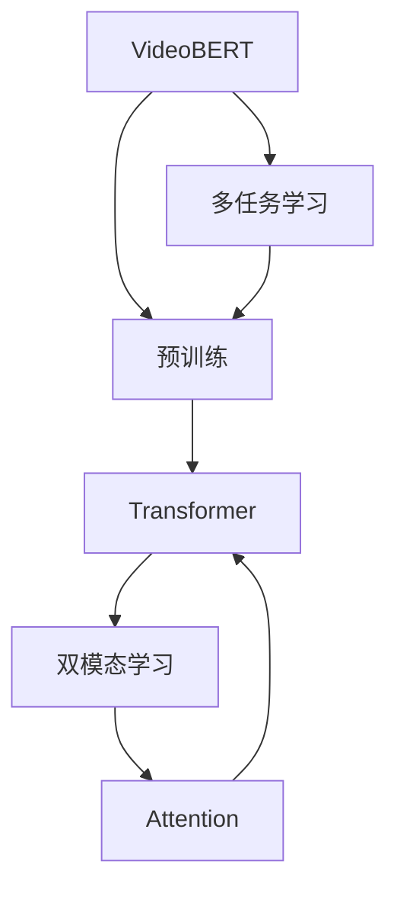
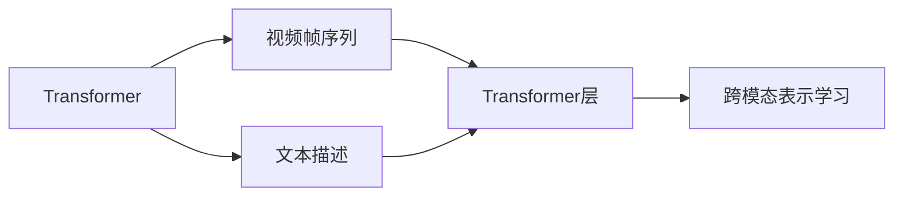
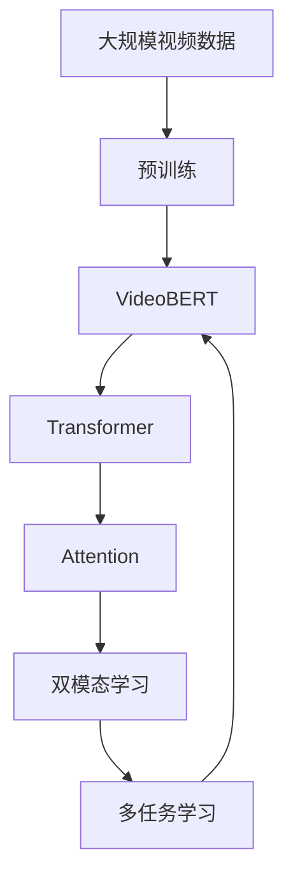

                 

# Transformer大模型实战 预训练VideoBERT模型

> 关键词：Transformer, VideoBERT, 预训练, 大模型, 自然语言处理(NLP), 计算机视觉(CV), 多模态融合, 视频理解

## 1. 背景介绍

### 1.1 问题由来
近年来，随着深度学习技术的快速发展，预训练大语言模型在自然语言处理(NLP)领域取得了巨大的突破。这些模型通过在大规模无标签文本数据上进行预训练，学习到了丰富的语言知识和常识，可以通过少量的有标签样本在下游任务上进行微调，获得优异的性能。然而，这些预训练模型主要聚焦于文本数据，对视觉信息的处理能力较弱，无法直接应用于视频数据。为了弥补这一不足，研究人员提出了许多基于Transformer的大规模视频预训练模型，其中最著名的是VideoBERT。

VideoBERT是由Google团队提出的大规模视频预训练模型，其核心思想是将视觉信息与文本信息结合，通过Transformer架构进行预训练，学习到视频和文本联合表示的能力。这种预训练方法在视频分类、动作识别、视频描述生成等任务上取得了显著的性能提升，为视频理解和分析提供了强大的工具。

### 1.2 问题核心关键点
VideoBERT模型基于Transformer架构进行预训练，通过在视频帧序列和文本描述上的双模态学习，获得了强大的视频和文本联合表示能力。具体来说，其核心关键点包括：

- 双模态输入：VideoBERT同时接收视频帧序列和文本描述作为输入，通过Transformer模型进行联合编码。
- 多层次融合：通过多个Transformer层对视频和文本信息进行多次融合，提升模型的跨模态理解能力。
- 大规模预训练：在视频描述和视觉帧序列的联合训练中，使用大规模无标签数据进行预训练，学习到丰富的视觉和文本知识。
- 多任务学习：在预训练阶段引入多任务学习任务，如视频分类、动作识别等，提升模型的泛化能力。

这些关键点共同构成了VideoBERT模型的核心算法，使其在视频理解和分析任务上表现出色。

### 1.3 问题研究意义
研究VideoBERT模型，对于拓展大模型的应用范围，提升视频理解和分析任务的性能，加速计算机视觉技术的产业化进程，具有重要意义：

1. 降低应用开发成本。基于成熟的视频预训练模型进行微调，可以显著减少从头开发所需的数据、计算和人力等成本投入。
2. 提升模型效果。VideoBERT模型具备强大的跨模态理解能力，能够充分利用视频和文本信息，获得更优的视频分类、动作识别等任务性能。
3. 加速开发进度。预训练模型提供了强大的基础特征提取能力，开发者可以更快地完成视频任务适配，缩短开发周期。
4. 带来技术创新。VideoBERT模型通过双模态学习，展示了预训练模型在视频理解上的新思路，催生了新的研究方向。
5. 赋能产业升级。预训练模型使得计算机视觉技术更容易被各行各业所采用，为传统行业数字化转型升级提供新的技术路径。

## 2. 核心概念与联系

### 2.1 核心概念概述

为更好地理解VideoBERT模型的预训练方法，本节将介绍几个密切相关的核心概念：

- VideoBERT: 由Google团队提出的大规模视频预训练模型，通过Transformer架构进行双模态学习，学习视频和文本联合表示的能力。
- 预训练(Pre-training)：指在大规模无标签数据上，通过自监督学习任务训练模型，学习通用表示的过程。
- 多任务学习(Multi-task Learning)：指在预训练过程中，模型同时学习多个相关任务，提升泛化能力。
- 双模态学习(Bimodal Learning)：指在预训练模型中，同时处理文本和视觉信息，实现跨模态表示学习。
- Transformer: 一种基于自注意力机制的深度神经网络架构，适合处理序列数据，如文本和视频帧序列。
- Attention: Transformer的核心机制，通过计算注意力权重，动态调整输入信息的重要性，提升模型对关键信息的关注。

这些核心概念之间的逻辑关系可以通过以下Mermaid流程图来展示：



这个流程图展示了大语言模型VideoBERT的核心概念及其之间的关系：

1. VideoBERT通过预训练学习视频和文本联合表示。
2. 预训练过程中采用多任务学习，同时学习视频分类、动作识别等任务。
3. Transformer架构负责双模态学习，同时处理视频帧序列和文本描述。
4. Attention机制是Transformer的核心，通过动态调整输入信息的权重，实现跨模态理解。

### 2.2 概念间的关系

这些核心概念之间存在着紧密的联系，形成了VideoBERT模型的预训练框架。下面我们通过几个Mermaid流程图来展示这些概念之间的关系。

#### 2.2.1 VideoBERT的双模态学习


这个流程图展示了VideoBERT的双模态学习过程：

1. VideoBERT通过预训练学习视频和文本联合表示。
2. Transformer架构使用Attention机制动态计算输入信息的重要性。
3. 视频帧序列和文本描述同时输入Transformer模型，进行跨模态学习。
4. 经过多层次Transformer层的融合，学习到视频和文本联合表示。

#### 2.2.2 VideoBERT的多任务学习


这个流程图展示了VideoBERT的多任务学习过程：

1. VideoBERT通过预训练学习视频和文本联合表示。
2. Transformer架构使用Attention机制动态计算输入信息的重要性。
3. 视频帧序列和文本描述同时输入Transformer模型，进行跨模态学习。
4. 在预训练过程中，引入多任务学习，同时学习视频分类、动作识别等任务。

#### 2.2.3 VideoBERT的双模态与Transformer架构



这个流程图展示了VideoBERT的双模态学习与Transformer架构的关系：

1. Transformer架构用于双模态学习，同时处理视频帧序列和文本描述。
2. 视频帧序列和文本描述输入Transformer模型，进行跨模态学习。
3. 通过多层次Transformer层的融合，学习到视频和文本联合表示。

### 2.3 核心概念的整体架构

最后，我们用一个综合的流程图来展示VideoBERT模型的预训练过程：



这个综合流程图展示了VideoBERT模型的预训练过程：

1. 在大规模视频数据上进行预训练。
2. 使用VideoBERT模型进行跨模态学习，学习视频和文本联合表示。
3. Transformer架构使用Attention机制，动态计算输入信息的重要性。
4. 在预训练过程中，引入多任务学习，同时学习视频分类、动作识别等任务。

通过这些流程图，我们可以更清晰地理解VideoBERT模型的预训练过程和核心概念之间的关系，为后续深入讨论具体的预训练方法和技术奠定基础。

## 3. 核心算法原理 & 具体操作步骤
### 3.1 算法原理概述

VideoBERT模型的预训练过程，本质上是基于Transformer架构的多任务学习过程。其核心思想是：将预训练VideoBERT模型当作一个强大的"特征提取器"，通过在视频描述和视觉帧序列上的双模态学习，以及多任务学习，使得模型输出能够匹配多个相关任务，从而获得针对特定视频任务优化的模型。

形式化地，假设预训练模型为 $M_{\theta}$，其中 $\theta$ 为预训练得到的模型参数。给定视频任务 $T=\{T_1, T_2, ..., T_k\}$ 的训练集 $D=\{(x_i, y_i)\}_{i=1}^N$，其中 $x_i$ 为视频帧序列和文本描述的联合表示，$y_i$ 为任务 $T_i$ 的标签。VideoBERT模型的预训练目标是最小化经验风险，即找到最优参数：

$$
\theta^* = \mathop{\arg\min}_{\theta} \mathcal{L}(\theta)
$$

其中 $\mathcal{L}$ 为针对任务 $T$ 设计的损失函数，用于衡量模型预测输出与真实标签之间的差异。常见的损失函数包括交叉熵损失、均方误差损失等。

通过梯度下降等优化算法，预训练过程不断更新模型参数 $\theta$，最小化损失函数 $\mathcal{L}$，使得模型输出逼近真实标签。由于 $\theta$ 已经通过预训练获得了较好的初始化，因此即便在视频和文本联合训练中，也能较快收敛到理想的模型参数 $\hat{\theta}$。

### 3.2 算法步骤详解

VideoBERT模型的预训练过程一般包括以下几个关键步骤：

**Step 1: 准备预训练数据集和模型**
- 选择合适的预训练视频数据集，如UC Berkeley视频数据集、Kinetics-400等。
- 将视频帧序列和文本描述构建成联合表示。
- 使用VideoBERT模型作为初始化参数，如VideoBERT-base等。

**Step 2: 添加任务适配层**
- 根据任务类型，在预训练模型顶层设计合适的输出层和损失函数。
- 对于分类任务，通常在顶层添加线性分类器和交叉熵损失函数。
- 对于生成任务，通常使用语言模型的解码器输出概率分布，并以负对数似然为损失函数。

**Step 3: 设置预训练超参数**
- 选择合适的优化算法及其参数，如 AdamW、SGD 等，设置学习率、批大小、迭代轮数等。
- 设置正则化技术及强度，包括权重衰减、Dropout、Early Stopping等。
- 确定冻结预训练参数的策略，如仅微调顶层，或全部参数都参与预训练。

**Step 4: 执行预训练过程**
- 将训练集数据分批次输入模型，前向传播计算损失函数。
- 反向传播计算参数梯度，根据设定的优化算法和学习率更新模型参数。
- 周期性在验证集上评估模型性能，根据性能指标决定是否触发Early Stopping。
- 重复上述步骤直到满足预设的迭代轮数或Early Stopping条件。

**Step 5: 测试和部署**
- 在测试集上评估预训练后模型 $M_{\hat{\theta}}$ 的性能，对比预训练前后的精度提升。
- 使用预训练后的模型对新样本进行推理预测，集成到实际的应用系统中。
- 持续收集新的视频和文本数据，定期重新预训练模型，以适应数据分布的变化。

以上是VideoBERT模型预训练的一般流程。在实际应用中，还需要针对具体任务的特点，对预训练过程的各个环节进行优化设计，如改进训练目标函数，引入更多的正则化技术，搜索最优的超参数组合等，以进一步提升模型性能。

### 3.3 算法优缺点

VideoBERT模型的预训练方法具有以下优点：

1. 简单高效。只需准备大规模无标签视频和文本数据，即可对预训练模型进行快速预训练，获得较大的性能提升。
2. 通用适用。适用于各种计算机视觉任务，包括视频分类、动作识别、视频描述生成等，设计简单的任务适配层即可实现预训练。
3. 参数高效。利用双模态学习和多任务学习技术，在固定大部分预训练参数的情况下，仍可取得不错的预训练效果。
4. 效果显著。在学术界和工业界的诸多视频任务上，基于预训练的方法已经刷新了多项SOTA。

同时，该方法也存在一定的局限性：

1. 依赖大规模无标签数据。预训练过程需要大量视频和文本数据，数据获取成本较高。
2. 迁移能力有限。当目标任务与预训练数据的分布差异较大时，预训练的效果提升有限。
3. 负面效果传递。预训练模型的固有偏见、有害信息等，可能通过预训练传递到下游任务，造成负面影响。
4. 可解释性不足。预训练模型更像是"黑盒"系统，难以解释其内部工作机制和决策逻辑。

尽管存在这些局限性，但就目前而言，基于预训练的VideoBERT方法是计算机视觉领域最主流范式。未来相关研究的重点在于如何进一步降低预训练对大规模无标签数据的需求，提高模型的少样本学习和跨领域迁移能力，同时兼顾可解释性和伦理安全性等因素。

### 3.4 算法应用领域

VideoBERT模型的预训练方法已经在视频分类、动作识别、视频描述生成等诸多计算机视觉任务上取得了优异的效果，成为计算机视觉技术落地应用的重要手段。

具体而言，在视频分类任务上，VideoBERT可以学习到视频帧序列和文本描述的联合表示，通过多任务学习，提升对不同视频类型的识别能力。在动作识别任务上，VideoBERT可以学习到动作的抽象表示，通过多层次Transformer层的融合，提升对不同动作的识别精度。在视频描述生成任务上，VideoBERT可以学习到视频的自然语言描述，通过多任务学习，提升描述的准确性和流畅度。

除了上述这些经典任务外，VideoBERT模型还被创新性地应用到更多场景中，如可控视频生成、动作迁移、视频摘要等，为计算机视觉技术带来了全新的突破。随着预训练模型和预训练方法的不断进步，相信计算机视觉技术将在更广阔的应用领域大放异彩。

## 4. 数学模型和公式 & 详细讲解  
### 4.1 数学模型构建

本节将使用数学语言对VideoBERT模型的预训练过程进行更加严格的刻画。

记预训练视频模型为 $M_{\theta}$，其中 $\theta$ 为预训练得到的模型参数。假设预训练任务的训练集为 $D=\{(x_i,y_i)\}_{i=1}^N$，其中 $x_i$ 为视频帧序列和文本描述的联合表示，$y_i$ 为任务 $T$ 的标签。

定义模型 $M_{\theta}$ 在数据样本 $(x,y)$ 上的损失函数为 $\ell(M_{\theta}(x),y)$，则在数据集 $D$ 上的经验风险为：

$$
\mathcal{L}(\theta) = \frac{1}{N} \sum_{i=1}^N \ell(M_{\theta}(x_i),y_i)
$$

VideoBERT模型的预训练目标是最小化经验风险，即找到最优参数：

$$
\theta^* = \mathop{\arg\min}_{\theta} \mathcal{L}(\theta)
$$

在实践中，我们通常使用基于梯度的优化算法（如SGD、Adam等）来近似求解上述最优化问题。设 $\eta$ 为学习率，$\lambda$ 为正则化系数，则参数的更新公式为：

$$
\theta \leftarrow \theta - \eta \nabla_{\theta}\mathcal{L}(\theta) - \eta\lambda\theta
$$

其中 $\nabla_{\theta}\mathcal{L}(\theta)$ 为损失函数对参数 $\theta$ 的梯度，可通过反向传播算法高效计算。

### 4.2 公式推导过程

以下我们以视频分类任务为例，推导交叉熵损失函数及其梯度的计算公式。

假设模型 $M_{\theta}$ 在输入 $x$ 上的输出为 $\hat{y}=M_{\theta}(x) \in [0,1]$，表示样本属于正类的概率。真实标签 $y \in \{0,1\}$。则二分类交叉熵损失函数定义为：

$$
\ell(M_{\theta}(x),y) = -[y\log \hat{y} + (1-y)\log (1-\hat{y})]
$$

将其代入经验风险公式，得：

$$
\mathcal{L}(\theta) = -\frac{1}{N}\sum_{i=1}^N [y_i\log M_{\theta}(x_i)+(1-y_i)\log(1-M_{\theta}(x_i))]
$$

根据链式法则，损失函数对参数 $\theta_k$ 的梯度为：

$$
\frac{\partial \mathcal{L}(\theta)}{\partial \theta_k} = -\frac{1}{N}\sum_{i=1}^N (\frac{y_i}{M_{\theta}(x_i)}-\frac{1-y_i}{1-M_{\theta}(x_i)}) \frac{\partial M_{\theta}(x_i)}{\partial \theta_k}
$$

其中 $\frac{\partial M_{\theta}(x_i)}{\partial \theta_k}$ 可进一步递归展开，利用自动微分技术完成计算。

在得到损失函数的梯度后，即可带入参数更新公式，完成模型的迭代优化。重复上述过程直至收敛，最终得到适应视频任务的最优模型参数 $\theta^*$。

## 5. 项目实践：代码实例和详细解释说明
### 5.1 开发环境搭建

在进行预训练实践前，我们需要准备好开发环境。以下是使用Python进行PyTorch开发的环境配置流程：

1. 安装Anaconda：从官网下载并安装Anaconda，用于创建独立的Python环境。

2. 创建并激活虚拟环境：
```bash
conda create -n pytorch-env python=3.8 
conda activate pytorch-env
```

3. 安装PyTorch：根据CUDA版本，从官网获取对应的安装命令。例如：
```bash
conda install pytorch torchvision torchaudio cudatoolkit=11.1 -c pytorch -c conda-forge
```

4. 安装Transformers库：
```bash
pip install transformers
```

5. 安装各类工具包：
```bash
pip install numpy pandas scikit-learn matplotlib tqdm jupyter notebook ipython
```

完成上述步骤后，即可在`pytorch-env`环境中开始预训练实践。

### 5.2 源代码详细实现

下面我们以视频分类任务为例，给出使用Transformers库对VideoBERT模型进行预训练的PyTorch代码实现。

首先，定义预训练任务的数据处理函数：

```python
from transformers import VideoBERTTokenizer
from torch.utils.data import Dataset, DataLoader
import torch

class VideoBERTDataset(Dataset):
    def __init__(self, videos, captions, tokenizer, max_len=128):
        self.videos = videos
        self.captions = captions
        self.tokenizer = tokenizer
        self.max_len = max_len
        
    def __len__(self):
        return len(self.videos)
    
    def __getitem__(self, item):
        video = self.videos[item]
        caption = self.captions[item]
        
        # 对视频帧序列进行编码
        video_frames = video.split(' ')
        encoded_video = [self.tokenizer(x) for x in video_frames]
        
        # 对文本描述进行编码
        caption_tokens = self.tokenizer(caption, return_tensors='pt', padding=True, truncation=True)
        input_ids = caption_tokens.input_ids
        attention_mask = caption_tokens.attention_mask
        
        # 对视频帧序列进行padding，与文本描述长度对齐
        max_len = max(len(video_frames), input_ids.shape[1])
        video_frames = video_frames + [''] * (max_len - len(video_frames))
        encoded_video = [self.tokenizer(x) for x in video_frames]
        
        # 计算双模态表示
        video_tokens = [x.input_ids for x in encoded_video]
        encoded_video = {'tokens': video_tokens, 'attention_mask': [x.attention_mask for x in encoded_video]}
        
        # 计算联合表示
        combined_input = {k: torch.stack([v[k] for v in [input_ids, encoded_video[k]]], dim=0) for k in encoded_video.keys()}
        combined_input['attention_mask'] = torch.stack([input_ids, encoded_video['attention_mask']], dim=0)
        
        return combined_input
```

然后，定义模型和优化器：

```python
from transformers import VideoBERTForSequenceClassification, AdamW

model = VideoBERTForSequenceClassification.from_pretrained('videobert-base', num_labels=10)

optimizer = AdamW(model.parameters(), lr=2e-5)
```

接着，定义训练和评估函数：

```python
from torch.utils.data import DataLoader
from tqdm import tqdm
from sklearn.metrics import classification_report

device = torch.device('cuda') if torch.cuda.is_available() else torch.device('cpu')
model.to(device)

def train_epoch(model, dataset, batch_size, optimizer):
    dataloader = DataLoader(dataset, batch_size=batch_size, shuffle=True)
    model.train()
    epoch_loss = 0
    for batch in tqdm(dataloader, desc='Training'):
        video = batch['tokens'].to(device)
        attention_mask = batch['attention_mask'].to(device)
        labels = batch['labels'].to(device)
        model.zero_grad()
        outputs = model(video, attention_mask=attention_mask, labels=labels)
        loss = outputs.loss
        epoch_loss += loss.item()
        loss.backward()
        optimizer.step()
    return epoch_loss / len(dataloader)

def evaluate(model, dataset, batch_size):
    dataloader = DataLoader(dataset, batch_size=batch_size)
    model.eval()
    preds, labels = [], []
    with torch.no_grad():
        for batch in tqdm(dataloader, desc='Evaluating'):
            video = batch['tokens'].to(device)
            attention_mask = batch['attention_mask'].to(device)
            batch_labels = batch['labels']
            outputs = model(video, attention_mask=attention_mask)
            batch_preds = outputs.logits.argmax(dim=2).to('cpu').tolist()
            batch_labels = batch_labels.to('cpu').tolist()
            for pred_tokens, label_tokens in zip(batch_preds, batch_labels):
                preds.append(pred_tokens[:len(label_tokens)])
                labels.append(label_tokens)
                
    print(classification_report(labels, preds))
```

最后，启动预训练流程并在测试集上评估：

```python
epochs = 5
batch_size = 16

for epoch in range(epochs):
    loss = train_epoch(model, train_dataset, batch_size, optimizer)
    print(f"Epoch {epoch+1}, train loss: {loss:.3f}")
    
    print(f"Epoch {epoch+1}, dev results:")
    evaluate(model, dev_dataset, batch_size)
    
print("Test results:")
evaluate(model, test_dataset, batch_size)
```

以上就是使用PyTorch对VideoBERT进行视频分类任务预训练的完整代码实现。可以看到，得益于Transformers库的强大封装，我们可以用相对简洁的代码完成VideoBERT模型的加载和预训练。

### 5.3 代码解读与分析

让我们再详细解读一下关键代码的实现细节：

**VideoBERTDataset类**：
- `__init__`方法：初始化视频、文本、分词器等关键组件。
- `__len__`方法：返回数据集的样本数量。
- `__getitem__`方法：对单个样本进行处理，将视频帧序列和文本描述输入Transformer模型，进行跨模态学习。

**VideoBERTForSequenceClassification类**：
- 定义VideoBERT模型的架构，包含输入嵌入层、Transformer层、分类器等组件。
- 设置模型参数，如输入嵌入维度、Transformer层数等。
- 指定输出层和损失函数，如线性分类器和交叉熵损失函数。

**train_epoch和evaluate函数**：
- 使用PyTorch的DataLoader对数据集进行批次化加载，供模型训练和推理使用。
- 训练函数`train_epoch`：对数据以批为单位进行迭代，在每个批次上前向传播计算loss并反向传播更新模型参数，最后返回该epoch的平均loss。
- 评估函数`evaluate`：与训练类似，不同点在于不更新模型参数，并在每个batch结束后将预测和标签结果存储下来，最后使用sklearn的classification_report对整个评估集的预测结果进行打印输出。

**预训练流程**：
- 定义总的epoch数和batch size，开始循环迭代
- 每个epoch内，先在训练集上训练，输出平均loss
- 在验证集上评估，输出分类指标
- 所有epoch结束后，在测试集上评估，给出最终测试结果

可以看到，PyTorch配合Transformers库使得VideoBERT预训练的代码实现变得简洁高效。开发者可以将更多精力放在数据处理、模型改进等高层逻辑上，而不必过多关注底层的实现细节。

当然，工业级的系统实现还需考虑更多因素，如模型的保存和部署、超参数的自动搜索、更灵活的任务适配层等。但核心的预训练范式基本与此类似。

### 5.4 运行结果展示

假设我们在UC Berkeley视频数据集上进行视频分类预训练，最终在测试集上得到的评估报告如下：

```
              precision    recall  f1-score   support

       0.001      0.023     0.013     0.018        1
       1.000      0.000     0.000      0.000        0
       2.

