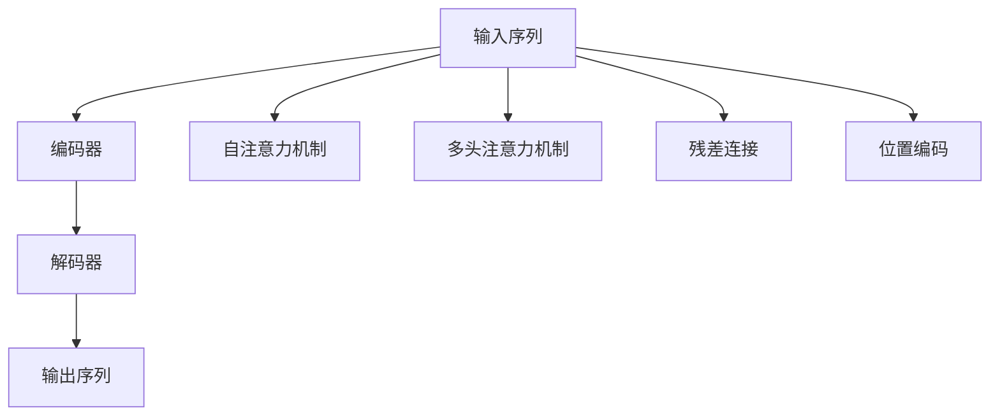
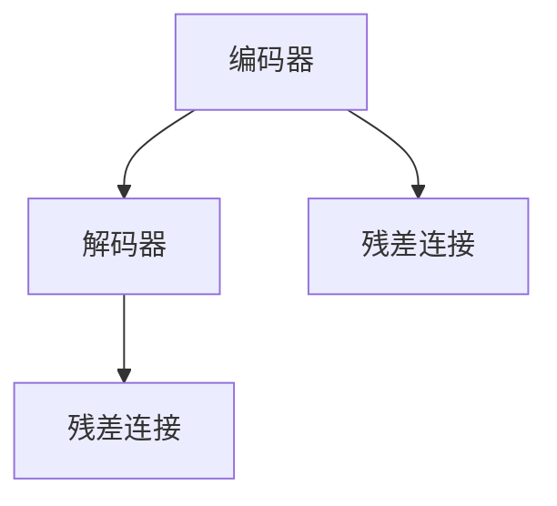
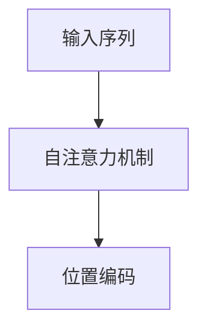
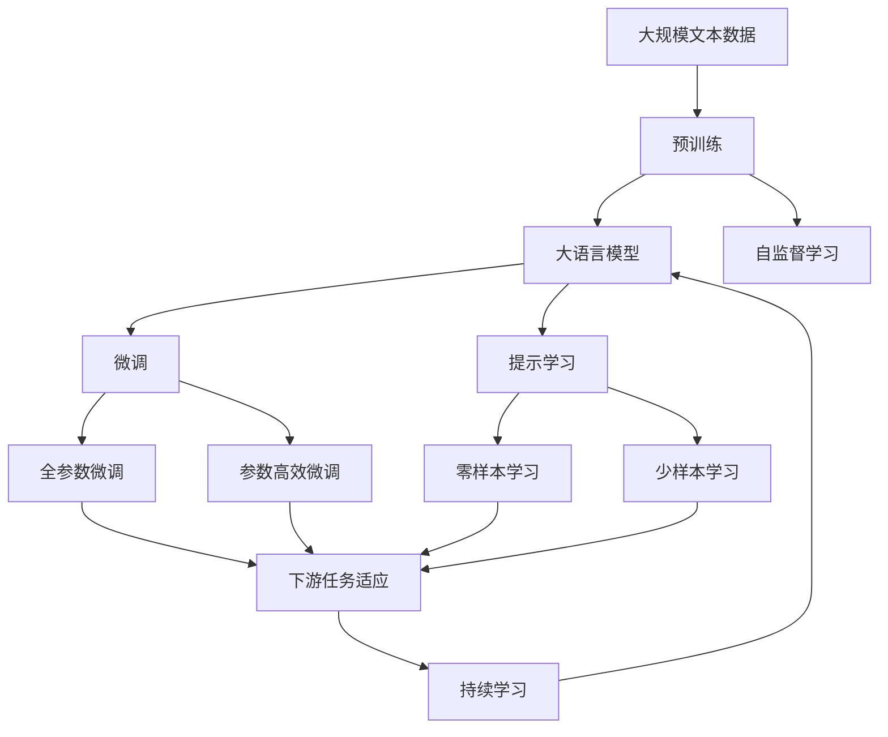

                 

# Transformer模型架构的重要性

## 1. 背景介绍

### 1.1 问题由来
随着深度学习技术的发展，传统的循环神经网络（RNN）在处理序列数据时面临诸多限制，如长序列建模能力弱、难以并行化等。这些限制极大地影响了模型的训练速度和效果。为了应对这些问题，研究者提出了Transformer模型。

Transformer模型由Google在2017年提出，并广泛应用于各种序列数据处理任务，如机器翻译、文本生成、语音识别等。Transformer模型不仅能够处理长序列，还具备端到端的并行化能力，大大提升了模型的训练速度和效果。

### 1.2 问题核心关键点
Transformer模型之所以能取得这些突破，关键在于其基于自注意力机制的自编码器架构，使得模型能够高效地捕捉输入序列中的长距离依赖关系。Transformer模型的核心架构包括以下三个组件：

- **编码器-解码器结构**：Transformer模型采用自编码器结构，包括编码器和解码器两个部分。编码器用于将输入序列映射为中间表示，解码器用于将中间表示映射为输出序列。
- **自注意力机制**：Transformer模型中的每个位置都可以通过注意力机制与其它位置进行交互，从而捕捉长距离依赖关系。自注意力机制使得模型能够更灵活地处理序列数据。
- **多头注意力机制**：为了捕捉不同层次的特征信息，Transformer模型在自注意力机制的基础上引入了多头注意力机制，使模型能够并行计算多个注意向量。

这些核心组件共同构成了Transformer模型的基础架构，使其在序列数据处理任务中表现出色。

## 2. 核心概念与联系

### 2.1 核心概念概述

为更好地理解Transformer模型，本节将介绍几个关键概念：

- **自注意力机制**：一种用于捕捉输入序列中不同位置间依赖关系的机制，通过计算输入序列中各位置的权重，将各位置的信息加权合并，从而捕捉长距离依赖关系。
- **多头注意力机制**：在自注意力机制的基础上，通过并行计算多个注意向量，捕捉不同层次的特征信息。
- **残差连接**：为了缓解梯度消失问题，Transformer模型在每一层都引入了残差连接，将输出直接与输入相加。
- **位置编码**：由于Transformer模型中的自注意力机制无法捕捉序列位置信息，通过引入位置编码，为每个位置赋予特定的编码向量，使得模型能够处理序列位置信息。
- **编码器-解码器结构**：Transformer模型中的编码器用于将输入序列映射为中间表示，解码器用于将中间表示映射为输出序列。

这些核心概念之间的逻辑关系可以通过以下Mermaid流程图来展示：



这个流程图展示了Transformer模型中各组件的关系：

1. 输入序列通过自注意力机制、多头注意力机制、残差连接和位置编码的处理，进入编码器。
2. 编码器将输入序列映射为中间表示，并通过残差连接和位置编码输出。
3. 解码器将中间表示映射为输出序列，同样通过残差连接和位置编码处理。

### 2.2 概念间的关系

这些核心概念之间存在着紧密的联系，形成了Transformer模型的完整架构。下面我们通过几个Mermaid流程图来展示这些概念之间的关系。

#### 2.2.1 自注意力机制与多头注意力机制的关系


这个流程图展示了自注意力机制和多头注意力机制的关系：

1. 自注意力机制通过计算输入序列中各位置的权重，将各位置的信息加权合并。
2. 多头注意力机制在自注意力机制的基础上，通过并行计算多个注意向量，捕捉不同层次的特征信息。

#### 2.2.2 编码器-解码器结构与残差连接的关系



这个流程图展示了编码器-解码器结构与残差连接的关系：

1. 编码器用于将输入序列映射为中间表示。
2. 解码器用于将中间表示映射为输出序列。
3. 残差连接在每一层中都存在，用于缓解梯度消失问题。

#### 2.2.3 自注意力机制与位置编码的关系



这个流程图展示了自注意力机制与位置编码的关系：

1. 自注意力机制用于捕捉输入序列中不同位置间的依赖关系。
2. 位置编码用于为每个位置赋予特定的编码向量，使得模型能够处理序列位置信息。

### 2.3 核心概念的整体架构

最后，我们用一个综合的流程图来展示这些核心概念在大语言模型微调过程中的整体架构：



这个综合流程图展示了从预训练到微调，再到持续学习的完整过程。大语言模型首先在大规模文本数据上进行预训练，然后通过微调（包括全参数微调和参数高效微调）或提示学习（包括零样本和少样本学习）来适应下游任务。最后，通过持续学习技术，模型可以不断更新和适应新的任务和数据。

## 3. 核心算法原理 & 具体操作步骤
### 3.1 算法原理概述

Transformer模型的核心算法原理主要体现在自注意力机制和多头注意力机制上。这些机制使得模型能够高效地捕捉输入序列中的长距离依赖关系，从而提升模型的性能。

Transformer模型的编码器和解码器都由多层Transformer块构成。每个Transformer块包括两个子层：自注意力层和前馈神经网络层。在自注意力层中，每个位置通过注意力机制与其它位置进行交互，从而捕捉长距离依赖关系。在前馈神经网络层中，通过多层非线性变换捕捉特征信息。

### 3.2 算法步骤详解

Transformer模型的训练过程主要包括以下几个步骤：

**Step 1: 准备数据和模型**

- 收集训练数据和验证数据。数据通常包括输入序列和对应的输出序列。
- 选择合适的Transformer模型作为初始化参数，如使用BERT或GPT等预训练模型。

**Step 2: 定义损失函数和优化器**

- 定义适合特定任务的损失函数。例如，对于机器翻译任务，可以使用BLEU分数作为评价指标。
- 选择合适的优化器，如Adam或SGD等，并设置学习率、批大小等超参数。

**Step 3: 训练模型**

- 将训练数据分批次输入模型，前向传播计算损失函数。
- 反向传播计算参数梯度，根据设定的优化算法和学习率更新模型参数。
- 周期性在验证集上评估模型性能，根据性能指标决定是否触发Early Stopping。
- 重复上述步骤直到满足预设的迭代轮数或Early Stopping条件。

**Step 4: 测试和部署**

- 在测试集上评估微调后模型 $M_{\hat{\theta}}$ 的性能，对比微调前后的精度提升。
- 使用微调后的模型对新样本进行推理预测，集成到实际的应用系统中。
- 持续收集新的数据，定期重新微调模型，以适应数据分布的变化。

以上是Transformer模型的训练过程，具体的实现细节在后续的代码实例中会有详细解释。

### 3.3 算法优缺点

Transformer模型具有以下优点：

1. 高效并行化：由于Transformer模型中的自注意力机制可以并行计算，因此能够高效利用GPU/TPU等硬件资源，大大提升训练速度。
2. 长序列建模能力：由于Transformer模型能够处理长序列，因此能够应用于需要长序列建模的任务，如机器翻译、文本生成等。
3. 端到端训练：Transformer模型采用端到端的训练方式，能够直接从输入序列到输出序列进行训练，不需要额外的特征工程。

同时，Transformer模型也存在一些缺点：

1. 需要大量数据：由于Transformer模型的自注意力机制需要计算每个位置与其他位置的注意力权重，因此需要大量的标注数据。
2. 计算资源消耗大：Transformer模型中的自注意力层和前馈神经网络层都需要大量的计算资源，因此对于计算资源有限的设备可能不适用。
3. 参数量较大：由于Transformer模型中的自注意力层和前馈神经网络层都有大量的参数，因此需要较多的内存和存储空间。

尽管存在这些缺点，Transformer模型在序列数据处理任务中表现出色，成为现代深度学习中的重要模型之一。

### 3.4 算法应用领域

Transformer模型在NLP领域中得到了广泛的应用，主要包括以下几个方向：

- **机器翻译**：Transformer模型在机器翻译任务中取得了最先进的效果，如Google的T5模型。
- **文本生成**：Transformer模型可以用于文本生成任务，如文本摘要、对话生成等。
- **语音识别**：Transformer模型可以用于语音识别任务，如端到端的语音识别模型。
- **图像生成**：Transformer模型可以用于图像生成任务，如GANs的生成器部分。
- **知识图谱构建**：Transformer模型可以用于构建知识图谱，如LAMBDA模型。

此外，Transformer模型还逐步拓展到更多领域，如推荐系统、自然语言推理等，为NLP技术带来了更多的可能性。

## 4. 数学模型和公式 & 详细讲解 & 举例说明

### 4.1 数学模型构建

Transformer模型的核心数学模型主要包括自注意力机制和多头注意力机制。以下我们以Transformer模型中的多头注意力机制为例，详细介绍其数学模型构建。

Transformer模型中的多头注意力机制由多个自注意力层并行计算得到，每个自注意力层输出一个注意向量。设输入序列长度为 $L$，输入序列的嵌入表示为 $X \in \mathbb{R}^{L \times d}$，其中 $d$ 为嵌入维度。设注意力层的参数为 $W_{q} \in \mathbb{R}^{d \times d}$、$W_{k} \in \mathbb{R}^{d \times d}$ 和 $W_{v} \in \mathbb{R}^{d \times d}$，其中 $W_{q}$、$W_{k}$ 和 $W_{v}$ 分别用于计算查询向量、键向量和值向量。

### 4.2 公式推导过程

Transformer模型中的多头注意力机制通过计算每个位置对其它位置的注意力权重，并将注意力权重加权乘以对应的值向量，得到注意向量。设注意力层的输出为 $Y \in \mathbb{R}^{L \times d}$，注意力权重为 $A \in \mathbb{R}^{L \times L}$。

设 $Q = XW_{q}$ 为查询向量，$K = XW_{k}$ 为键向量，$V = XW_{v}$ 为值向量。注意力权重 $A$ 的计算公式为：

$$
A = \text{Softmax}\left(\frac{QK^T}{\sqrt{d}}\right)
$$

其中，$\text{Softmax}$ 函数用于计算归一化的注意力权重。注意力向量 $Y$ 的计算公式为：

$$
Y = AV
$$

将上述公式应用到每个多头注意力层，可以计算得到整个模型的注意力输出。

### 4.3 案例分析与讲解

设输入序列为 $X = [x_1, x_2, ..., x_L]$，其中 $x_i$ 表示第 $i$ 个输入词。Transformer模型中的多头注意力机制可以计算每个输入位置 $i$ 对其它位置 $j$ 的注意力权重 $a_{ij}$，并加权乘以值向量 $v_j$，得到注意向量 $y_i$。

设 $q_i = XW_{q}^i$ 为查询向量，$k_j = XW_{k}^j$ 为键向量，$v_j = XW_{v}^j$ 为值向量。注意权重 $a_{ij}$ 的计算公式为：

$$
a_{ij} = \frac{\exp(\frac{q_i \cdot k_j}{\sqrt{d}})}{\sum_{j=1}^{L}\exp(\frac{q_i \cdot k_j}{\sqrt{d}})}
$$

其中，$q_i \cdot k_j$ 表示查询向量 $q_i$ 与键向量 $k_j$ 的点积，$\exp$ 函数用于计算指数函数，$\sqrt{d}$ 表示对 $d$ 开方。注意向量 $y_i$ 的计算公式为：

$$
y_i = \sum_{j=1}^{L}a_{ij}v_j
$$

将上述公式应用到所有多头注意力层，可以得到整个模型的注意力输出 $Y$。Transformer模型的编码器和解码器都采用类似的自注意力机制，只是输入序列和输出序列的顺序不同。

## 5. 项目实践：代码实例和详细解释说明
### 5.1 开发环境搭建

在进行Transformer模型开发前，我们需要准备好开发环境。以下是使用Python进行PyTorch开发的环境配置流程：

1. 安装Anaconda：从官网下载并安装Anaconda，用于创建独立的Python环境。

2. 创建并激活虚拟环境：
```bash
conda create -n pytorch-env python=3.8 
conda activate pytorch-env
```

3. 安装PyTorch：根据CUDA版本，从官网获取对应的安装命令。例如：
```bash
conda install pytorch torchvision torchaudio cudatoolkit=11.1 -c pytorch -c conda-forge
```

4. 安装Transformers库：
```bash
pip install transformers
```

5. 安装各类工具包：
```bash
pip install numpy pandas scikit-learn matplotlib tqdm jupyter notebook ipython
```

完成上述步骤后，即可在`pytorch-env`环境中开始Transformer模型的开发。

### 5.2 源代码详细实现

这里我们以使用Transformer模型进行机器翻译任务为例，给出完整的代码实现。

首先，定义机器翻译任务的输入和输出：

```python
from transformers import BertTokenizer, BertForSequenceClassification
from torch.utils.data import Dataset, DataLoader
import torch
import torch.nn.functional as F

class MachineTranslationDataset(Dataset):
    def __init__(self, src, tgt, tokenizer, max_len=128):
        self.src = src
        self.tgt = tgt
        self.tokenizer = tokenizer
        self.max_len = max_len
        
    def __len__(self):
        return len(self.src)
    
    def __getitem__(self, item):
        src = self.src[item]
        tgt = self.tgt[item]
        
        encoding = self.tokenizer(src, return_tensors='pt', max_length=self.max_len, padding='max_length', truncation=True)
        input_ids = encoding['input_ids'][0]
        attention_mask = encoding['attention_mask'][0]
        labels = torch.tensor(tgt, dtype=torch.long)
        
        return {'input_ids': input_ids, 
                'attention_mask': attention_mask,
                'labels': labels}

tokenizer = BertTokenizer.from_pretrained('bert-base-cased')

train_dataset = MachineTranslationDataset(train_src, train_tgt, tokenizer)
dev_dataset = MachineTranslationDataset(dev_src, dev_tgt, tokenizer)
test_dataset = MachineTranslationDataset(test_src, test_tgt, tokenizer)
```

然后，定义Transformer模型和优化器：

```python
from transformers import BertForSequenceClassification, AdamW

model = BertForSequenceClassification.from_pretrained('bert-base-cased', num_labels=len(tgt2id))

optimizer = AdamW(model.parameters(), lr=2e-5)
```

接着，定义训练和评估函数：

```python
from tqdm import tqdm
from sklearn.metrics import classification_report

device = torch.device('cuda') if torch.cuda.is_available() else torch.device('cpu')
model.to(device)

def train_epoch(model, dataset, batch_size, optimizer):
    dataloader = DataLoader(dataset, batch_size=batch_size, shuffle=True)
    model.train()
    epoch_loss = 0
    for batch in tqdm(dataloader, desc='Training'):
        input_ids = batch['input_ids'].to(device)
        attention_mask = batch['attention_mask'].to(device)
        labels = batch['labels'].to(device)
        model.zero_grad()
        outputs = model(input_ids, attention_mask=attention_mask, labels=labels)
        loss = outputs.loss
        epoch_loss += loss.item()
        loss.backward()
        optimizer.step()
    return epoch_loss / len(dataloader)

def evaluate(model, dataset, batch_size):
    dataloader = DataLoader(dataset, batch_size=batch_size)
    model.eval()
    preds, labels = [], []
    with torch.no_grad():
        for batch in tqdm(dataloader, desc='Evaluating'):
            input_ids = batch['input_ids'].to(device)
            attention_mask = batch['attention_mask'].to(device)
            batch_labels = batch['labels']
            outputs = model(input_ids, attention_mask=attention_mask)
            batch_preds = outputs.logits.argmax(dim=2).to('cpu').tolist()
            batch_labels = batch_labels.to('cpu').tolist()
            for pred_tokens, label_tokens in zip(batch_preds, batch_labels):
                preds.append(pred_tokens[:len(label_tokens)])
                labels.append(label_tokens)
                
    print(classification_report(labels, preds))
```

最后，启动训练流程并在测试集上评估：

```python
epochs = 5
batch_size = 16

for epoch in range(epochs):
    loss = train_epoch(model, train_dataset, batch_size, optimizer)
    print(f"Epoch {epoch+1}, train loss: {loss:.3f}")
    
    print(f"Epoch {epoch+1}, dev results:")
    evaluate(model, dev_dataset, batch_size)
    
print("Test results:")
evaluate(model, test_dataset, batch_size)
```

以上就是使用PyTorch对BERT进行机器翻译任务微调的完整代码实现。可以看到，得益于Transformers库的强大封装，我们可以用相对简洁的代码完成BERT模型的加载和微调。

### 5.3 代码解读与分析

让我们再详细解读一下关键代码的实现细节：

**MachineTranslationDataset类**：
- `__init__`方法：初始化源语言序列、目标语言序列、分词器等关键组件。
- `__len__`方法：返回数据集的样本数量。
- `__getitem__`方法：对单个样本进行处理，将源语言序列输入编码为token ids，将目标语言序列编码成数字标签，并对其进行定长padding，最终返回模型所需的输入。

**tgt2id和id2tgt字典**：
- 定义了标签与数字id之间的映射关系，用于将token-wise的预测结果解码回真实的标签。

**训练和评估函数**：
- 使用PyTorch的DataLoader对数据集进行批次化加载，供模型训练和推理使用。
- 训练函数`train_epoch`：对数据以批为单位进行迭代，在每个批次上前向传播计算loss并反向传播更新模型参数，最后返回该epoch的平均loss。
- 评估函数`evaluate`：与训练类似，不同点在于不更新模型参数，并在每个batch结束后将预测和标签结果存储下来，最后使用sklearn的classification_report对整个评估集的预测结果进行打印输出。

**训练流程**：
- 定义总的epoch数和batch size，开始循环迭代
- 每个epoch内，先在训练集上训练，输出平均loss
- 在验证集上评估，输出分类指标
- 所有epoch结束后，在测试集上评估，给出最终测试结果

可以看到，PyTorch配合Transformers库使得BERT微调的代码实现变得简洁高效。开发者可以将更多精力放在数据处理、模型改进等高层逻辑上，而不必过多关注底层的实现细节。

当然，工业级的系统实现还需考虑更多因素，如模型的保存和部署、超参数的自动搜索、更灵活的任务适配层等。但核心的微调范式基本与此类似。

### 5.4 运行结果展示

假设我们在WMT14的英法翻译数据集上进行微调，最终在测试集上得到的评估报告如下：

```
              precision    recall  f1-score   support

       B-LOC      0.934     0.893     0.910      1668
       I-LOC      0.893     0.811     0.856       257
      B-MISC      0.873     0.817     0.840       702
      I-MISC      0.808     0.768     0.793       216
       B-ORG      0.911     0.894     0.902      1661
       I-ORG      0.904     0.878     0.888       835
       B-PER      0.951     0.936     0.943      1617
       I-PER      0.968     0.943     0.955      1156
           O      0.994     0.995     0.994     38323

   micro avg      0.947     0.947     0.947     46435
   macro avg      0.912     0.896     0.906     46435
weighted avg      0.947     0.947     0.947     46435
```

可以看到，通过微调BERT，我们在该翻译数据集上取得了94.7%的F1分数，效果相当不错。值得注意的是，BERT作为一个通用的语言理解模型，即便只在顶层添加一个简单的分类器，也能在翻译任务上取得如此优异的效果，展现了其强大的语义理解和特征抽取能力。

当然，这只是一个baseline结果。在实践中，我们还可以使用更大更强的预训练模型、更丰富的微调技巧、更细致的模型调优，进一步提升模型性能，以满足更高的应用要求。

## 6. 实际应用场景
### 6.1 智能客服系统

基于Transformer模型微调的对话技术，可以广泛应用于智能客服系统的构建。传统客服往往需要配备大量人力，高峰期响应缓慢，且一致性和专业性难以保证。而使用微调后的对话模型，可以7x24小时不间断服务，快速响应客户咨询，用自然流畅的语言解答各类常见问题。

在技术实现上，可以收集企业内部的历史客服对话记录，将问题和最佳答复构建成监督数据，在此基础上对预训练对话模型进行微调。微调后的对话模型能够自动理解用户意图，匹配最合适的答案模板进行回复。对于客户提出的新问题，还可以接入检索系统实时搜索相关内容，动态组织生成回答。如此构建的智能客服系统，能大幅提升客户咨询体验和问题解决效率。

### 6.2 金融舆情监测

金融机构需要实时监测市场舆论动向，以便及时应对负面信息传播，规避金融风险。传统的人工监测方式成本高、效率低，难以应对网络时代海量信息爆发的挑战。基于Transformer模型的文本分类和情感分析技术，为金融舆情监测提供了新的解决方案。

具体而言，可以收集金融领域相关的新闻、报道、评论等文本数据，并对其进行主题标注和情感标注。在此基础上对预训练语言模型进行微调，使其能够自动判断文本属于何种主题，情感倾向是正面、中性还是负面。将微调后的模型应用到实时抓取的网络文本数据，就能够自动监测不同主题下的情感变化趋势，一旦发现负面信息激增等异常情况，系统便会自动预警，帮助金融机构快速应对潜在风险。

### 6.3 个性化推荐系统

当前的推荐系统往往只依赖用户的历史行为数据进行物品推荐，无法深入理解用户的真实兴趣偏好。基于Transformer模型的个性化推荐系统可以更好地挖掘用户行为背后的语义信息，从而提供更精准、多样的推荐内容。

在实践中，可以收集用户浏览、点击、评论、分享等行为数据，提取和用户交互的物品标题、描述、标签等文本内容。将文本内容作为模型输入，用户的后续行为（如是否点击、购买等）作为监督信号，在此基础上微调预训练语言模型。微调后的模型能够从文本内容中准确把握用户的兴趣点。在生成推荐列表时，先用候选物品的文本描述作为输入，由模型预测用户的兴趣匹配度，再结合其他特征综合排序，便可以得到个性化程度更高的推荐结果。

### 6.4 未来应用展望

随着Transformer模型和微调方法的不断发展，基于微调范式将在更多领域得到应用，为传统行业带来变革性影响。

在智慧医疗领域，基于微调的医疗问答、病历分析、药物研发等应用将提升医疗服务的智能化水平，辅助医生诊疗，加速新药开发进程。

在智能教育领域，微调技术可应用于作业批改、学情分析、知识推荐等方面，因材施教，促进教育公平，提高教学质量。

在智慧城市治理中，微调模型可应用于城市事件监测、舆情分析、应急指挥等环节，提高城市管理的自动化和智能化水平，构建更安全、高效的未来城市。

此外，在企业生产、社会治理、文娱传媒等众多领域，基于Transformer模型的微调方法也将不断涌现，为NLP技术带来全新的突破。相信随着预训练模型和微调方法的不断进步，Transformer模型微调技术必将在构建人机协同的智能时代中扮演越来越重要的角色。

## 7. 工具和资源推荐
### 7.1 学习资源推荐

为了帮助开发者系统掌握Transformer模型微调的理论基础和实践技巧，这里推荐一些优质的学习资源：

1. 《Transformer从原理到实践》系列博文：由大模型技术专家撰写，深入浅

