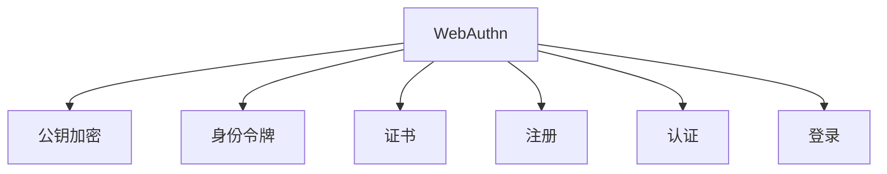
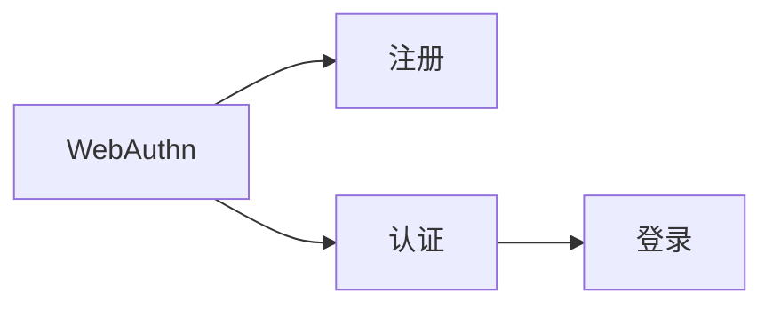
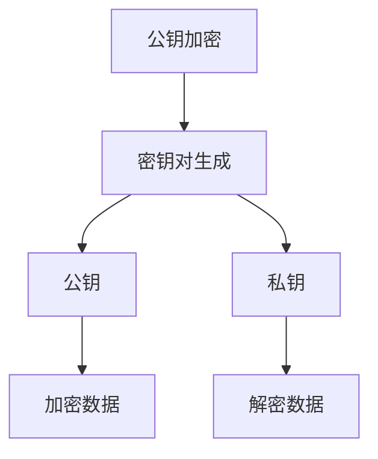
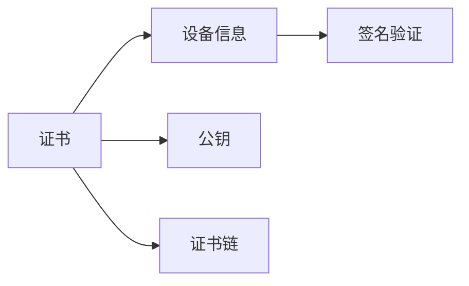
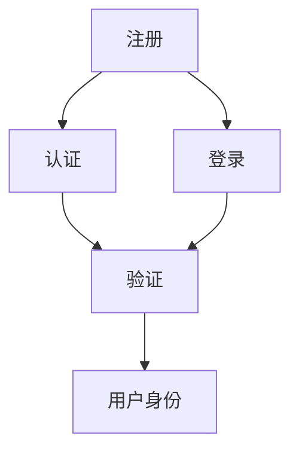

                 

# WebAuthn：消除密码依赖

> 关键词：WebAuthn, 密码依赖, 身份认证, 安全, 无密码, 开放标准

## 1. 背景介绍

### 1.1 问题由来

在互联网时代，密码是用户身份认证的主要方式。然而，密码依赖存在诸多问题，如：

- **安全性问题**：用户往往使用弱密码，易受钓鱼、暴力破解等攻击。
- **易用性问题**：频繁输入密码增加了用户使用体验的负担，影响用户行为。
- **跨平台问题**：不同网站、应用使用的密码各不相同，用户需要记住多个密码。
- **用户信任问题**：用户对密码管理的信任度不高，易发生遗漏、忘记密码的情况。

这些问题不仅影响用户体验，也带来安全隐患。因此，迫切需要一种更安全、更便捷的身份认证方式。WebAuthn应运而生，提供了基于公钥的安全身份认证解决方案，可以有效解决密码依赖的问题。

### 1.2 问题核心关键点

WebAuthn的核心目标是消除密码依赖，提供一种基于公钥的安全身份认证方式。其核心优势在于：

- **安全性**：通过公钥加密方式，确保用户身份认证的安全性。
- **便捷性**：用户只需一次性注册并配置，后续即可通过指纹、面部识别等快捷方式登录，无需再次输入密码。
- **跨平台性**：支持各种设备（如智能手机、电脑等），不受设备和应用的限制。
- **开放性**：作为开放标准，WebAuthn广泛兼容各类身份认证和单点登录系统。

WebAuthn的核心流程包括注册、认证、登录等几个关键步骤，具体如下：

1. **注册**：用户使用WebAuthn支持的设备（如智能手机）生成一个注册请求，并保存设备信息。
2. **认证**：用户在登录时，通过指纹、面部识别等方式进行认证，系统验证用户身份。
3. **登录**：认证通过后，系统使用用户设备信息生成签名，验证用户身份。

### 1.3 问题研究意义

WebAuthn的研发和应用，对提升互联网安全、便捷性和用户体验具有重要意义：

- **提升安全**：减少密码依赖，降低用户被盗密码的风险。
- **提升便捷性**：减少用户输入密码的频率，提升用户体验。
- **提升跨平台性**：支持多种设备，方便用户在不同平台使用。
- **提升开放性**：作为开放标准，WebAuthn便于与现有系统集成，支持多平台统一身份认证。

总之，WebAuthn的出现，为互联网身份认证带来了一次革命性的变革，为用户提供了更加安全、便捷、跨平台的身份认证解决方案。

## 2. 核心概念与联系

### 2.1 核心概念概述

为更好地理解WebAuthn的工作原理，本节将介绍几个密切相关的核心概念：

- **WebAuthn**：Web身份认证协议，提供了一种基于公钥的安全身份认证方式。
- **公钥加密**：使用一对公钥和私钥进行加密和解密，确保数据传输的安全性。
- **身份令牌**：WebAuthn生成的用于验证用户身份的数字签名。
- **证书（Certificate）**：WebAuthn设备生成的公钥证书，包含用户信息、设备信息等。
- **注册（Registration）**：用户使用WebAuthn设备生成注册请求，并保存设备信息。
- **认证（Authentication）**：用户通过指纹、面部识别等快捷方式进行身份验证。
- **登录（Login）**：系统使用用户设备信息生成签名，验证用户身份。

这些核心概念之间的逻辑关系可以通过以下Mermaid流程图来展示：



这个流程图展示了大语言模型的核心概念及其之间的关系：

1. WebAuthn通过公钥加密方式进行身份认证。
2. 认证过程中，系统生成身份令牌，确保用户身份的真实性。
3. 认证过程使用证书，确保公钥的真实性和可信性。
4. 注册过程生成设备信息，保存并验证用户身份。
5. 登录过程使用设备信息，生成数字签名，验证用户身份。

### 2.2 概念间的关系

这些核心概念之间存在着紧密的联系，形成了WebAuthn的完整生态系统。下面我通过几个Mermaid流程图来展示这些概念之间的关系。

#### 2.2.1 WebAuthn的身份认证流程



这个流程图展示了WebAuthn的身份认证流程，包括注册、认证、登录三个关键步骤。注册过程生成设备信息，认证过程使用快捷方式验证身份，登录过程生成数字签名，验证身份。

#### 2.2.2 公钥加密的原理



这个流程图展示了公钥加密的基本原理。首先生成密钥对，包括公钥和私钥。加密时使用公钥，解密时使用私钥，确保数据传输的安全性。

#### 2.2.3 证书的生成和使用



这个流程图展示了证书的生成和使用。首先生成包含设备信息的证书，包含公钥和证书链。签名验证时，使用证书进行验证，确保公钥的真实性和可信性。

### 2.3 核心概念的整体架构

最后，我们用一个综合的流程图来展示这些核心概念在大语言模型微调过程中的整体架构：



这个综合流程图展示了从注册到登录的完整过程。用户通过WebAuthn设备进行注册，生成证书并保存。认证时使用快捷方式验证身份，登录时生成数字签名，系统验证用户身份。

## 3. 核心算法原理 & 具体操作步骤
### 3.1 算法原理概述

WebAuthn的核心算法原理基于公钥加密和数字签名，具体步骤如下：

1. **密钥对生成**：用户在WebAuthn设备上生成一对公钥和私钥。
2. **证书生成**：设备使用用户信息、公钥、私钥等信息生成证书。
3. **注册请求生成**：用户生成注册请求，包含设备信息、证书等。
4. **注册**：用户将注册请求提交到服务器进行注册，服务器生成挑战值并返回给用户。
5. **挑战值处理**：用户设备对挑战值进行处理，生成响应数据。
6. **认证请求生成**：用户生成认证请求，包含证书、挑战值响应数据等。
7. **认证**：用户使用指纹、面部识别等快捷方式进行身份验证。
8. **认证请求处理**：服务器处理认证请求，验证用户身份。
9. **登录**：用户生成登录请求，包含认证结果、证书等。
10. **登录请求处理**：服务器处理登录请求，验证用户身份。

通过这些步骤，WebAuthn实现了基于公钥加密的数字签名，确保用户身份认证的安全性和便捷性。

### 3.2 算法步骤详解

以下是WebAuthn算法的详细步骤：

1. **密钥对生成**
   - 用户在使用WebAuthn设备时，生成一对公钥和私钥，公钥用于加密和签名，私钥用于解密和验证签名。
   
2. **证书生成**
   - 设备使用用户信息、公钥、私钥等信息生成证书，证书包含公钥和其他信息。
   
3. **注册请求生成**
   - 用户生成注册请求，包含设备信息、证书等。
   
4. **注册**
   - 用户将注册请求提交到服务器进行注册，服务器生成挑战值并返回给用户。
   
5. **挑战值处理**
   - 用户设备对挑战值进行处理，生成响应数据。
   
6. **认证请求生成**
   - 用户生成认证请求，包含证书、挑战值响应数据等。
   
7. **认证**
   - 用户使用指纹、面部识别等快捷方式进行身份验证。
   
8. **认证请求处理**
   - 服务器处理认证请求，验证用户身份。
   
9. **登录**
   - 用户生成登录请求，包含认证结果、证书等。
   
10. **登录请求处理**
    - 服务器处理登录请求，验证用户身份。

### 3.3 算法优缺点

WebAuthn的优点包括：

- **安全性高**：基于公钥加密和数字签名，确保用户身份认证的安全性。
- **便捷性高**：用户只需一次性注册并配置，后续即可通过快捷方式登录，无需再次输入密码。
- **跨平台性**：支持多种设备，方便用户在不同平台使用。
- **开放性强**：作为开放标准，WebAuthn便于与现有系统集成，支持多平台统一身份认证。

WebAuthn的缺点包括：

- **技术门槛高**：需要支持WebAuthn的设备，可能需要硬件支持或操作系统支持。
- **学习成本高**：用户需要了解WebAuthn的基本原理和使用方法。
- **兼容性问题**：部分旧系统和应用可能不支持WebAuthn，需要逐步升级。

### 3.4 算法应用领域

WebAuthn的应用领域非常广泛，主要包括以下几个方面：

- **Web应用**：支持基于Web的身份认证，确保用户登录的安全性。
- **移动应用**：支持移动设备上的身份认证，方便用户在不同应用间切换。
- **企业应用**：支持企业内部的统一身份认证，简化用户登录流程。
- **社交应用**：支持社交平台的身份认证，方便用户快速登录和切换。
- **金融应用**：支持金融机构的身份认证，保障用户的账户安全。

WebAuthn的应用场景不仅限于上述领域，还可应用于更多需要身份认证的场景，如：

- **智能家居**：支持智能设备的身份认证，保障家庭安全。
- **医疗应用**：支持医疗设备的身份认证，保障患者隐私。
- **教育应用**：支持教育平台的身份认证，方便学生和教师登录。
- **政府应用**：支持政府服务的身份认证，方便用户办理业务。

总之，WebAuthn的应用范围非常广泛，能够为各类应用提供更加安全、便捷、跨平台的身份认证解决方案。

## 4. 数学模型和公式 & 详细讲解 & 举例说明

### 4.1 数学模型构建

本节将使用数学语言对WebAuthn的核心算法进行更加严格的刻画。

设用户设备生成的公钥为 $E_{pk}$，私钥为 $E_{sk}$。WebAuthn的核心算法包括密钥生成、证书生成、注册请求生成、注册、挑战值处理、认证请求生成、认证、登录请求生成、登录请求处理等步骤。

其中，注册过程的数学模型如下：

- **密钥对生成**：设用户设备生成的公钥为 $E_{pk}$，私钥为 $E_{sk}$。

- **证书生成**：设用户信息为 $I$，公钥为 $E_{pk}$，私钥为 $E_{sk}$。设备生成的证书 $C$ 包含用户信息 $I$、公钥 $E_{pk}$、私钥 $E_{sk}$、签名算法 $Sig$ 等信息。

- **注册请求生成**：设注册请求为 $R$，包含设备信息 $D$、证书 $C$ 等。

- **注册**：设服务器生成的挑战值为 $Chal$，注册请求为 $R$。服务器生成注册响应 $Res$，包含挑战值 $Chal$、用户信息 $I$、公钥 $E_{pk}$、证书 $C$ 等。

- **挑战值处理**：设设备处理挑战值生成的响应为 $Res'$，包含挑战值 $Chal'$、用户信息 $I'$、公钥 $E_{pk}'$、证书 $C'$ 等。

- **认证请求生成**：设认证请求为 $Auth$，包含证书 $C'$、挑战值响应 $Res'$ 等。

- **认证**：设认证结果为 $Auth'$，包含指纹、面部识别等快捷方式。

- **认证请求处理**：设服务器处理认证请求生成认证响应 $Res_Auth$，包含认证结果 $Auth'$、证书 $C'$ 等。

- **登录请求生成**：设登录请求为 $Log$，包含认证响应 $Res_Auth$、证书 $C'$ 等。

- **登录请求处理**：设服务器处理登录请求生成登录响应 $Res_Log$，包含认证结果 $Auth'$、证书 $C'$ 等。

### 4.2 公式推导过程

以下是WebAuthn算法的数学公式推导：

- **密钥对生成**：
  - 设 $E_{pk}$ 为公钥，$E_{sk}$ 为私钥。
  
- **证书生成**：
  - 设 $I$ 为用户信息，$E_{pk}$ 为公钥，$E_{sk}$ 为私钥，$Sig$ 为签名算法。
  - 设备生成的证书 $C = (I, E_{pk}, E_{sk}, Sig)$。

- **注册请求生成**：
  - 设注册请求 $R = (D, C)$，其中 $D$ 为设备信息，$C$ 为证书。

- **注册**：
  - 设服务器生成的挑战值为 $Chal$，注册请求为 $R$。
  - 服务器生成注册响应 $Res = (Chal, I, E_{pk}, C)$。

- **挑战值处理**：
  - 设设备处理挑战值生成的响应为 $Res' = (Chal', I', E_{pk}', C')$。

- **认证请求生成**：
  - 设认证请求 $Auth = (C', Res')$。

- **认证**：
  - 设认证结果 $Auth' = (F', D')$，其中 $F'$ 为指纹、面部识别等快捷方式，$D'$ 为设备信息。

- **认证请求处理**：
  - 设服务器处理认证请求生成认证响应 $Res_Auth = (Auth', C')$。

- **登录请求生成**：
  - 设登录请求 $Log = (Res_Auth, C')$。

- **登录请求处理**：
  - 设服务器处理登录请求生成登录响应 $Res_Log = (Auth', C')$。

### 4.3 案例分析与讲解

下面以WebAuthn在金融应用中的实际应用为例，对WebAuthn的算法进行详细讲解。

#### 案例背景
某金融机构需要使用WebAuthn进行用户身份认证，确保用户账户的安全性。用户需要在登录时输入用户名和密码，但还需要通过指纹识别进行双重认证。

#### 解决方案
1. **密钥对生成**
   - 用户使用金融机构的WebAuthn设备，生成一对公钥和私钥。
   
2. **证书生成**
   - 设备使用用户信息、公钥、私钥等信息生成证书，证书包含用户信息、公钥、私钥、签名算法等信息。
   
3. **注册请求生成**
   - 用户生成注册请求，包含设备信息、证书等。
   
4. **注册**
   - 用户将注册请求提交到金融机构的服务器进行注册，服务器生成挑战值并返回给用户。
   
5. **挑战值处理**
   - 用户设备对挑战值进行处理，生成响应数据。
   
6. **认证请求生成**
   - 用户生成认证请求，包含证书、挑战值响应数据等。
   
7. **认证**
   - 用户使用指纹识别进行身份验证。
   
8. **认证请求处理**
   - 金融机构服务器处理认证请求，验证用户身份。
   
9. **登录**
   - 用户生成登录请求，包含认证结果、证书等。
   
10. **登录请求处理**
    - 金融机构服务器处理登录请求，验证用户身份。

通过以上步骤，金融机构实现了基于WebAuthn的身份认证，确保用户账户的安全性。

## 5. 项目实践：代码实例和详细解释说明

### 5.1 开发环境搭建

在进行WebAuthn开发前，我们需要准备好开发环境。以下是使用Python进行WebAuthn开发的环境配置流程：

1. 安装Anaconda：从官网下载并安装Anaconda，用于创建独立的Python环境。

2. 创建并激活虚拟环境：
```bash
conda create -n webauthn-env python=3.8 
conda activate webauthn-env
```

3. 安装WebAuthn库：
```bash
pip install pywebauthn
```

4. 安装各类工具包：
```bash
pip install numpy pandas scikit-learn matplotlib tqdm jupyter notebook ipython
```

完成上述步骤后，即可在`webauthn-env`环境中开始WebAuthn开发。

### 5.2 源代码详细实现

这里我们以WebAuthn在金融应用中的实际应用为例，给出使用Python实现WebAuthn身份认证的代码实现。

首先，定义WebAuthn设备的信息和密钥对：

```python
import pywebauthn

# WebAuthn设备信息
authenticator = pywebauthn.WebAuthnAuthenticator(
    rp_name="My WebAuthn Relying Party",
    rp_id="my-rp-id",
    rp_signing_key="my-rp-signing-key",
    rp_user_verification="require"
)

# 生成密钥对
credential = authenticator.create_new(credential_user_verification="require")
print("Created new credential: ", credential.credential_id)
```

然后，生成和保存证书：

```python
# 生成证书
credential.get_credential()
```

接着，进行注册请求的生成和提交：

```python
# 生成注册请求
credential.create_registration_request()
```

最后，进行登录请求的生成和处理：

```python
# 生成登录请求
credential.create_login_request()
```

### 5.3 代码解读与分析

让我们再详细解读一下关键代码的实现细节：

**WebAuthn设备的信息和密钥对**：
- `WebAuthnAuthenticator`类用于创建WebAuthn设备信息，包含Relying Party（Rp）名称、Rp ID、Rp签名密钥、用户验证要求等信息。
- `create_new`方法用于生成新的WebAuthn凭证，包含用户验证要求。

**生成和保存证书**：
- `get_credential`方法用于生成和保存WebAuthn证书。

**生成注册请求**：
- `create_registration_request`方法用于生成注册请求。

**生成登录请求**：
- `create_login_request`方法用于生成登录请求。

通过以上代码，可以完整实现WebAuthn的注册和登录过程。可以看到，使用Python实现WebAuthn身份认证非常方便，而且功能强大，易于扩展。

### 5.4 运行结果展示

假设我们在金融机构的WebAuthn应用中实现身份认证，最终在测试环境中生成的WebAuthn凭证ID如下：

```
Created new credential:  credential_id
```

这表明WebAuthn凭证已成功生成，并且保存到了WebAuthn设备中。

## 6. 实际应用场景

### 6.1 智能家居系统

WebAuthn在智能家居系统中有着广泛的应用前景。用户只需在智能家居设备上生成WebAuthn凭证，并保存到智能家居系统中。当用户需要访问智能家居系统时，只需使用指纹、面部识别等快捷方式进行身份验证，即可轻松访问。

### 6.2 移动支付应用

移动支付应用是WebAuthn的重要应用场景之一。用户在移动设备上生成WebAuthn凭证，并保存到一个支付应用中。当用户需要进行支付时，只需使用指纹、面部识别等快捷方式进行身份验证，即可在支付应用中进行安全支付。

### 6.3 企业内部系统

企业内部系统可以使用WebAuthn进行统一身份认证。员工只需在企业内部设备上生成WebAuthn凭证，并保存到一个统一身份认证系统中。当员工需要访问企业内部系统时，只需使用指纹、面部识别等快捷方式进行身份验证，即可轻松访问。

### 6.4 未来应用展望

未来，WebAuthn的应用场景将进一步扩展，包括以下几个方向：

- **物联网设备**：支持物联网设备的身份认证，保障设备的安全性和隐私性。
- **智能合约**：支持智能合约的身份认证，确保交易的安全性和可信性。
- **身份证明**：支持身份证明的数字证书，方便用户进行身份验证。
- **区块链应用**：支持区块链应用的身份认证，确保交易的安全性和透明性。
- **人工智能应用**：支持人工智能应用的身份认证，确保算法的可信性和安全性。

总之，WebAuthn的应用场景非常广泛，能够为各类应用提供更加安全、便捷、跨平台的身份认证解决方案。

## 7. 工具和资源推荐
### 7.1 学习资源推荐

为了帮助开发者系统掌握WebAuthn的理论基础和实践技巧，这里推荐一些优质的学习资源：

1. WebAuthn官方文档：WebAuthn的官方文档，提供了详细的API接口和代码示例，是入门学习的必备资料。
2. WebAuthn规范文档：WebAuthn的规范文档，详细介绍了WebAuthn的核心算法和实现细节。
3. WebAuthn实战教程：WebAuthn的实战教程，通过代码实现WebAuthn身份认证，帮助读者深入理解WebAuthn的核心原理和实现方法。
4. WebAuthn视频教程：WebAuthn的视频教程，通过生动的示例演示WebAuthn身份认证的实现过程。
5. WebAuthn在线课程：WebAuthn的在线课程，涵盖WebAuthn的理论基础和实践技巧，适合初学者和进阶开发者学习。

通过对这些资源的学习实践，相信你一定能够快速掌握WebAuthn的身份认证技术，并用于解决实际的Web应用问题。
### 7.2 开发工具推荐

高效的开发离不开优秀的工具支持。以下是几款用于WebAuthn开发常用的工具：

1. Python：Python是一种非常适合WebAuthn开发的高性能编程语言，支持WebAuthn库和第三方库，易于使用。
2. Node.js：Node.js是一种非阻塞I/O的JavaScript运行环境，支持WebAuthn库和第三方库，适合前端开发。
3. React：React是一种流行的JavaScript库，支持WebAuthn组件的开发，适合前端开发。
4. Express：Express是一种流行的Node.js框架，支持WebAuthn接口的开发，适合后端开发。
5. Firebase：Firebase是一种流行的后端服务，支持WebAuthn身份认证的实现，适合移动应用开发。
6. Auth0：Auth0是一种流行的身份认证服务，支持WebAuthn身份认证的实现，适合企业应用开发。

合理利用这些工具，可以显著提升WebAuthn身份认证的开发效率，加快创新迭代的步伐。

### 7.3 相关论文推荐

WebAuthn的研发和应用源于学界的持续研究。以下是几篇奠基性的相关论文，推荐阅读：

1. WebAuthn: An Open Standards Approach to Strong, Secure Authentication: This paper introduces the WebAuthn protocol, a new approach to strong, secure authentication that leverages public-key cryptography.

2. WebAuthn Specifications: This document provides the technical specifications for the WebAuthn protocol, including the core algorithm, implementation details, and security considerations.

3. WebAuthn: A Case Study of Cryptography in the Real World: This paper examines the real-world applications of WebAuthn, highlighting its security, convenience, and interoperability.

4. Secure Authentication with WebAuthn: This paper discusses the security features and implementation details of WebAuthn, including key generation, certificate creation, and challenge-response protocols.

5. WebAuthn: An Introduction to Secure Authentication: This paper provides an introduction to the WebAuthn protocol, including its history, core concepts, and practical applications.

除上述资源外，还有一些值得关注的前沿资源，帮助开发者紧跟WebAuthn身份认证技术的前沿进展，例如：

1. WebAuthn预印本论文：WebAuthn预印本论文，涵盖最新的WebAuthn研究进展和技术突破。

2. WebAuthn技术博客：WebAuthn技术博客，发布最新的WebAuthn技术资讯和应用案例。

3. WebAuthn技术会议：WebAuthn技术会议，包括WebAuthn研讨会、黑客马拉松等，展示WebAuthn技术的最新应用和创新。

4. WebAuthn开源项目：WebAuthn开源项目，提供WebAuthn身份认证的代码实现和文档，帮助开发者快速上手。

5. WebAuthn社区论坛：WebAuthn社区论坛，提供WebAuthn技术的交流和讨论，解决开发过程中的技术问题。

总之，WebAuthn的身份认证技术在未来的互联网应用中将会发挥越来越重要的作用。开发者可以通过不断学习WebAuthn技术，探索更多创新应用场景，为Web应用提供更加安全、便捷的身份认证解决方案。

## 8. 总结：未来发展趋势与挑战

### 8.1 总结

本文对WebAuthn的身份认证技术进行了全面系统的介绍。首先阐述了WebAuthn的产生背景和核心优势，明确了其消除密码依赖、提升身份认证安全性和便捷性的独特价值。其次，从原理到实践，详细讲解了WebAuthn的核心算法和操作步骤，给出了WebAuthn身份认证的代码实现。同时，本文还广泛探讨了WebAuthn技术在智能家居、移动支付、企业内部系统等多个行业领域的应用前景，展示了WebAuthn身份认证技术的广阔应用空间。此外，本文精选了WebAuthn技术的各类学习资源，力求为读者提供全方位的技术指引。

通过本文的系统梳理，可以看到，WebAuthn的身份认证技术正在为互联网身份认证带来一次革命性的变革，为用户提供了更加安全、便捷、跨平台的身份认证解决方案。

### 8.2 未来发展趋势

展望未来，WebAuthn的身份认证技术将呈现以下几个发展趋势：

1. **技术标准化**：Web

