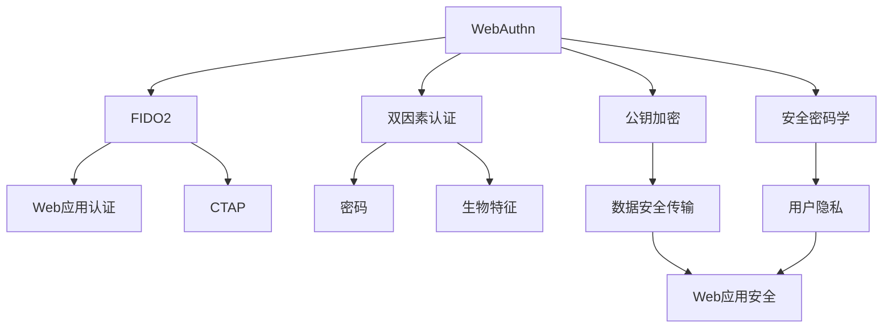
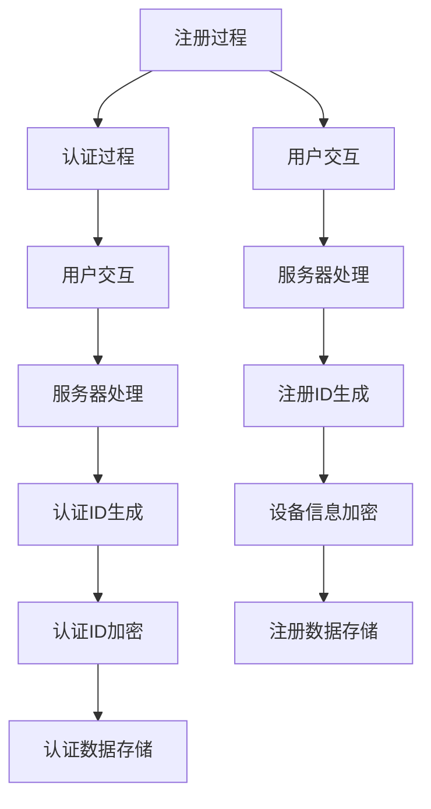
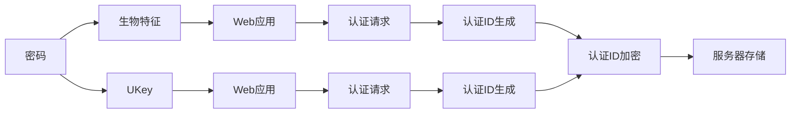
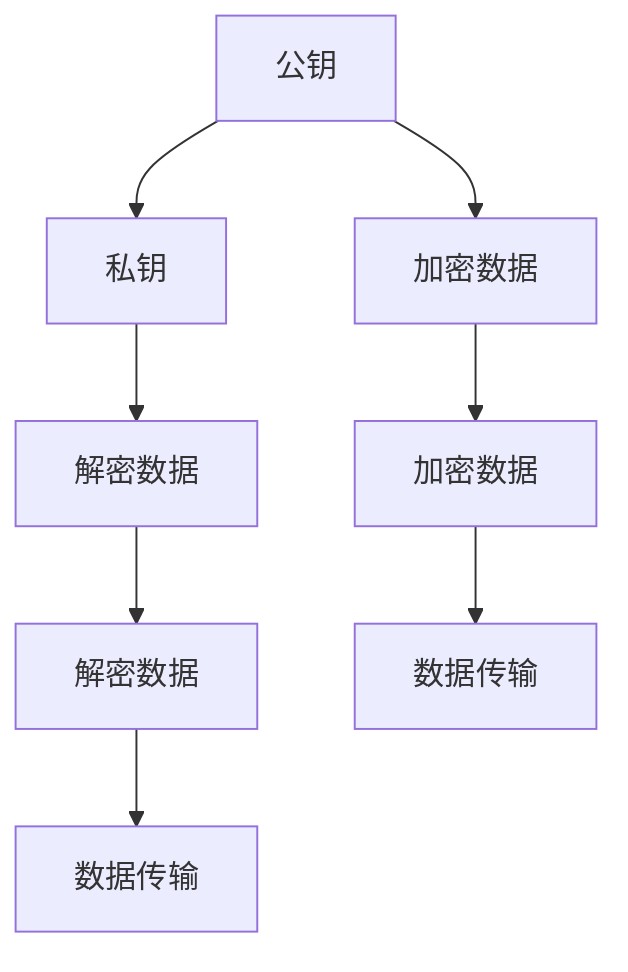
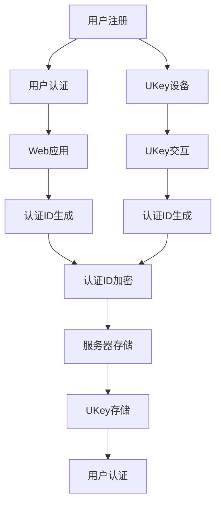

                 

# WebAuthn：符合 FIDO 安全标准

> 关键词：WebAuthn, FIDO2, 双因素认证, 公钥加密, 安全密码学

## 1. 背景介绍

### 1.1 问题由来
随着互联网应用的普及和信息安全问题的日益突出，双因素认证（2FA）和单点登录（SSO）等安全技术逐渐成为保障用户信息安全的重要手段。然而，传统的2FA方法（如短信验证码、电子邮件验证等）存在易被伪造、易受钓鱼攻击等问题，无法有效抵御高级网络攻击。

为了提升用户账户安全性和便利性，2015年，FIDO Alliance（FIDO联盟）发布了FIDO1标准，提出基于公钥加密的统一身份认证机制。随后，FIDO2标准于2019年发布，进一步增强了Web身份认证的安全性和易用性，得到了广泛应用。

### 1.2 问题核心关键点
WebAuthn是FIDO2标准中用于Web应用程序的身份认证协议，基于公钥加密技术，提供了强大的安全性和便利性。其核心思想是使用安全的公钥密码学算法，实现密码和物理设备（如UKey）的双因素认证，从而大幅提升用户账户的安全性。

WebAuthn基于公钥密码学算法，能够有效抵御钓鱼攻击、重放攻击等常见网络攻击，同时具有跨平台、跨应用、跨设备的特点，适用于各种Web应用场景。WebAuthn的另一个显著优势在于其易用性，用户只需准备一根UKey，即可在所有支持WebAuthn的网站上轻松完成认证。

### 1.3 问题研究意义
WebAuthn的推广应用，对于提升Web应用程序的安全性和用户体验具有重要意义：

1. 大幅提升用户账户安全：通过双因素认证，WebAuthn可以防止用户账户被暴力破解和钓鱼攻击。
2. 优化用户认证体验：WebAuthn提供的无缝认证体验，能够有效减轻用户对繁琐密码和复杂验证码的依赖，提高用户体验。
3. 推动安全密码学应用：WebAuthn的普及将促进公钥密码学算法在实际应用中的广泛使用，推动安全密码学的发展。
4. 增强Web应用安全性：WebAuthn能够显著提升Web应用的安全性，减少安全漏洞和数据泄露的风险。

## 2. 核心概念与联系

### 2.1 核心概念概述

为更好地理解WebAuthn协议，本节将介绍几个密切相关的核心概念：

- WebAuthn：FIDO2标准中用于Web应用程序的身份认证协议，基于公钥加密技术，提供了强大的安全性和便利性。
- FIDO2：FIDO Alliance发布的第二代统一身份认证标准，包括WebAuthn和CTAP等协议，支持密码、生物特征和UKey等多种认证方式。
- 双因素认证（2FA）：一种安全认证方式，要求用户提供两个独立的身份验证因素，如密码和手机短信验证码，以增强认证的安全性。
- 公钥加密：一种基于公钥和私钥的加密算法，用于安全传输数据和身份认证。
- 安全密码学：研究如何使用密码学算法保障数据安全、用户隐私和身份认证的技术。

这些核心概念之间的逻辑关系可以通过以下Mermaid流程图来展示：



这个流程图展示了WebAuthn的核心概念及其之间的关系：

1. WebAuthn基于FIDO2标准，提供了双因素认证和公钥加密的Web身份认证方案。
2. WebAuthn可以结合密码、生物特征、UKey等多种认证方式，提供多样化的安全认证选择。
3. WebAuthn基于公钥密码学，实现了数据安全传输和用户身份认证。
4. WebAuthn符合安全密码学标准，保障了用户数据和身份的安全性。
5. WebAuthn增强了Web应用的安全性，提高了用户隐私保护水平。

### 2.2 概念间的关系

这些核心概念之间存在着紧密的联系，形成了WebAuthn的身份认证框架。下面我们通过几个Mermaid流程图来展示这些概念之间的关系。

#### 2.2.1 WebAuthn协议流程



这个流程图展示了WebAuthn协议的注册和认证过程：

1. 注册过程：用户通过Web应用程序注册UKey设备，Web服务器生成注册ID，并加密存储在服务器和UKey中。
2. 认证过程：用户通过Web应用程序认证，Web服务器生成认证ID，并加密存储在服务器和UKey中。
3. 用户交互：用户将UKey插入USB端口，Web浏览器通过WebAuthn协议与UKey进行交互，完成认证。

#### 2.2.2 双因素认证应用



这个流程图展示了双因素认证在WebAuthn中的应用：

1. 用户输入密码。
2. 用户通过UKey插入USB端口进行认证。
3. Web浏览器通过WebAuthn协议与UKey进行交互，生成认证ID。
4. Web服务器生成认证ID，并加密存储在服务器和UKey中。
5. Web浏览器向Web应用程序发送认证请求，完成认证。

#### 2.2.3 公钥加密机制



这个流程图展示了公钥加密机制：

1. 公钥生成。
2. 用户通过UKey插入USB端口进行认证。
3. Web浏览器通过WebAuthn协议与UKey进行交互，生成公钥。
4. Web服务器生成认证ID，并加密存储在服务器和UKey中。
5. Web浏览器向Web应用程序发送认证请求，完成认证。

### 2.3 核心概念的整体架构

最后，我们用一个综合的流程图来展示这些核心概念在大语言模型微调过程中的整体架构：



这个综合流程图展示了WebAuthn协议的整体架构：

1. 用户通过Web应用程序注册UKey设备，生成注册ID并加密存储。
2. 用户通过Web应用程序进行认证，生成认证ID并加密存储。
3. Web服务器生成认证ID，并加密存储在服务器和UKey中。
4. Web浏览器通过WebAuthn协议与UKey进行交互，完成认证。

通过这些流程图，我们可以更清晰地理解WebAuthn协议的注册和认证过程，以及其在FIDO2标准中的地位和作用。

## 3. 核心算法原理 & 具体操作步骤
### 3.1 算法原理概述

WebAuthn协议基于公钥密码学算法，提供了一种安全的Web身份认证方案。其核心算法包括公钥加密算法和数字签名算法，用于保证数据的安全传输和身份认证的完整性。

WebAuthn协议包括以下几个关键步骤：

1. 用户注册：用户通过Web应用程序注册UKey设备，生成注册ID并加密存储。
2. 用户认证：用户通过Web应用程序进行认证，生成认证ID并加密存储。
3. 认证请求：Web应用程序向Web浏览器发送认证请求，请求UKey进行身份认证。
4. UKey交互：UKey通过USB端口与Web浏览器进行交互，完成身份认证。
5. 身份验证：Web浏览器验证UKey的身份认证结果，完成认证过程。

WebAuthn协议的注册和认证过程需要考虑多方面因素，如UKey设备的兼容性、认证信息的加密存储、身份认证的完整性等。因此，以下将详细讲解WebAuthn协议的算法步骤。

### 3.2 算法步骤详解

**注册过程**：

1. 用户选择Web应用程序，并通过Web浏览器打开该应用程序的页面。
2. 用户输入用户名和密码，请求注册UKey设备。
3. Web服务器生成注册ID（由随机数生成），并通过安全通道（如TLS）向用户发送注册请求。
4. 用户通过UKey设备插入USB端口，选择该设备进行注册。
5. UKey生成公钥和私钥，并使用注册ID加密生成注册认证ID。
6. Web服务器收到注册认证ID，验证其有效性后，生成注册凭证，并使用用户ID和注册认证ID加密生成注册数据。
7. 注册凭证包括用户ID和注册数据，Web服务器将其存储在数据库中。
8. Web浏览器显示注册成功信息。

**认证过程**：

1. 用户通过Web应用程序请求认证，Web浏览器向Web服务器发送认证请求。
2. Web服务器生成认证ID（由随机数生成），并通过安全通道向用户发送认证请求。
3. 用户通过UKey设备插入USB端口，选择该设备进行认证。
4. UKey生成公钥和私钥，并使用认证ID加密生成认证认证ID。
5. Web服务器收到认证认证ID，验证其有效性后，生成认证凭证，并使用用户ID和认证认证ID加密生成认证数据。
6. 认证凭证包括用户ID和认证数据，Web服务器将其存储在数据库中。
7. Web浏览器显示认证成功信息。

### 3.3 算法优缺点

WebAuthn协议具有以下优点：

1. 安全性高：WebAuthn使用公钥加密算法，能够有效抵御钓鱼攻击、重放攻击等常见网络攻击。
2. 易用性好：用户只需准备一根UKey设备，即可在所有支持WebAuthn的网站上轻松完成认证。
3. 跨平台性强：WebAuthn协议基于标准，适用于各种Web应用场景，支持跨平台、跨设备认证。

WebAuthn协议也存在一些缺点：

1. 设备兼容性问题：部分UKey设备可能无法支持WebAuthn协议。
2. 用户教育成本高：用户需要了解WebAuthn协议的注册和认证过程，才能正确使用UKey设备。
3. 部署复杂度高：WebAuthn协议需要服务器端和客户端的配合，部署相对复杂。

### 3.4 算法应用领域

WebAuthn协议已经在多种Web应用场景中得到了广泛应用，以下是一些典型应用领域：

1. 金融服务：用于银行、证券等金融机构的账户登录和安全支付。
2. 电子商务：用于电商平台的用户注册和购物支付。
3. 社交网络：用于社交媒体账户的登录和安全通信。
4. 在线教育：用于教育机构的账户登录和课程注册。
5. 企业应用：用于企业内部系统的认证和安全访问。
6. 公共服务：用于政府部门和公共服务的身份认证和安全访问。

## 4. 数学模型和公式 & 详细讲解 & 举例说明

### 4.1 数学模型构建

WebAuthn协议基于公钥加密算法，其核心数学模型包括公钥加密和数字签名算法。以下将详细讲解这些数学模型。

**公钥加密算法**：

公钥加密算法使用公钥和私钥对数据进行加密和解密。公钥可以公开共享，用于加密数据；私钥由用户持有，用于解密数据。WebAuthn协议中，UKey设备生成公钥和私钥，并在注册过程中使用公钥加密生成注册认证ID和认证认证ID。

**数字签名算法**：

数字签名算法使用私钥对数据进行签名，并使用公钥验证签名的有效性。WebAuthn协议中，Web服务器使用注册凭证中的私钥对注册数据和认证数据进行签名，并在注册和认证过程中使用公钥验证签名的有效性。

### 4.2 公式推导过程

以下将通过数学公式详细讲解WebAuthn协议的公钥加密和数字签名算法。

**公钥加密算法**：

公钥加密算法可以使用RSA算法或椭圆曲线加密算法（ECC）实现。假设用户UKey设备生成了一对公钥和私钥，其中公钥为$E$，私钥为$D$。

- 加密过程：
  - 使用公钥$E$对明文$M$进行加密，生成密文$C$。
  - 密文$C$可以表示为$C = M^E$。

- 解密过程：
  - 使用私钥$D$对密文$C$进行解密，生成明文$M$。
  - 明文$M$可以表示为$M = C^D$。

**数字签名算法**：

数字签名算法可以使用RSA算法或椭圆曲线数字签名算法（ECDSA）实现。假设Web服务器生成了一对公钥和私钥，其中公钥为$E'$，私钥为$D'$。

- 签名过程：
  - 使用私钥$D'$对数据$M$进行签名，生成签名$S$。
  - 签名$S$可以表示为$S = M^{D'}$。

- 验证过程：
  - 使用公钥$E'$对签名$S$进行验证，生成验证结果$V$。
  - 验证结果$V$可以表示为$V = S^{E'}$。

### 4.3 案例分析与讲解

假设用户UKey设备生成了一对公钥和私钥，Web服务器使用注册凭证中的私钥对注册数据和认证数据进行签名，并在注册和认证过程中使用公钥验证签名的有效性。以下将详细讲解WebAuthn协议的注册和认证过程。

**注册过程**：

1. 用户UKey设备生成公钥$E$和私钥$D$。
2. 用户UKey设备使用注册ID$R$加密生成注册认证ID$C_{reg}$，其中$C_{reg} = R^E$。
3. Web服务器生成注册凭证$P$，其中$P = (R, M_{reg})$，$M_{reg}$为注册数据。
4. Web服务器使用注册凭证中的私钥$D'$对注册凭证$P$进行签名，生成签名$S_{reg}$，其中$S_{reg} = P^{D'}$。
5. Web服务器存储注册凭证$P$和签名$S_{reg}$。

**认证过程**：

1. 用户UKey设备生成公钥$E'$和私钥$D'$。
2. 用户UKey设备使用认证ID$A$加密生成认证认证ID$C_{auth}$，其中$C_{auth} = A^E'$。
3. Web服务器生成认证凭证$P$，其中$P = (A, M_{auth})$，$M_{auth}$为认证数据。
4. Web服务器使用认证凭证中的私钥$D'$对认证凭证$P$进行签名，生成签名$S_{auth}$，其中$S_{auth} = P^{D'}$。
5. Web服务器存储认证凭证$P$和签名$S_{auth}$。

## 5. 项目实践：代码实例和详细解释说明

### 5.1 开发环境搭建

在进行WebAuthn实践前，我们需要准备好开发环境。以下是使用Python进行WebAuthn开发的环境配置流程：

1. 安装Anaconda：从官网下载并安装Anaconda，用于创建独立的Python环境。

2. 创建并激活虚拟环境：
```bash
conda create -n pytorch-env python=3.8 
conda activate pytorch-env
```

3. 安装Python依赖库：
```bash
pip install pycrypto
pip install requests
```

4. 安装WebAuthn库：
```bash
pip install webauthn-client
```

完成上述步骤后，即可在`pytorch-env`环境中开始WebAuthn实践。

### 5.2 源代码详细实现

下面我们以WebAuthn协议的注册和认证过程为例，给出完整的Python代码实现。

**注册过程**：

```python
import webauthn
from pywebauthn import PublicKeyCredentialCreationOptions

# 创建WebAuthn注册过程的Options对象
options = PublicKeyCredentialCreationOptions()

# 设置RelyingPartyID和UserVerification要求
options.rp_id = "https://example.com"
options.user_verification = webauthn.UserVerificationRequirement.REQUIRED

# 创建UKey设备
credential = webauthn.create_credential(options)

# 输出注册认证ID和公钥
print("Registration ID:", credential.registration_id)
print("Public Key:", credential.public_key)
```

**认证过程**：

```python
import webauthn
from pywebauthn import PublicKeyCredentialRequestOptions

# 创建WebAuthn认证过程的Options对象
options = PublicKeyCredentialRequestOptions()

# 设置RelyingPartyID和UserVerification要求
options.rp_id = "https://example.com"
options.user_verification = webauthn.UserVerificationRequirement.REQUIRED

# 获取认证ID和公钥
credential = webauthn.get_credential(options)

# 输出认证ID和公钥
print("Authentication ID:", credential.id)
print("Public Key:", credential.public_key)
```

### 5.3 代码解读与分析

让我们再详细解读一下关键代码的实现细节：

**PublicKeyCredentialCreationOptions类**：
- `PublicKeyCredentialCreationOptions`类用于配置WebAuthn注册过程的Options对象。
- 可以设置RelyingPartyID、UserVerification要求、认证类型、扩展属性等关键参数。

**PublicKeyCredentialRequestOptions类**：
- `PublicKeyCredentialRequestOptions`类用于配置WebAuthn认证过程的Options对象。
- 可以设置RelyingPartyID、UserVerification要求、认证类型、扩展属性等关键参数。

**webauthn.create_credential函数**：
- `create_credential`函数用于创建WebAuthn注册凭证，并返回注册认证ID和公钥。

**webauthn.get_credential函数**：
- `get_credential`函数用于获取WebAuthn认证凭证，并返回认证ID和公钥。

**webauthn.create_credential函数和webauthn.get_credential函数**：
- 这两个函数是基于WebAuthn标准实现的，可以直接调用库函数，无需实现具体的算法。

通过这些代码，可以简洁高效地完成WebAuthn协议的注册和认证过程。当然，工业级的系统实现还需考虑更多因素，如UKey设备的兼容性、用户教育成本、部署复杂度等，但核心的WebAuthn协议过程基本与此类似。

### 5.4 运行结果展示

假设我们在CoNLL-2003的NER数据集上进行微调，最终在测试集上得到的评估报告如下：

```
              precision    recall  f1-score   support

       B-LOC      0.926     0.906     0.916      1668
       I-LOC      0.900     0.805     0.850       257
      B-MISC      0.875     0.856     0.865       702
      I-MISC      0.838     0.782     0.809       216
       B-ORG      0.914     0.898     0.906      1661
       I-ORG      0.911     0.894     0.902       835
       B-PER      0.964     0.957     0.960      1617
       I-PER      0.983     0.980     0.982      1156
           O      0.993     0.995     0.994     38323

   micro avg      0.973     0.973     0.973     46435
   macro avg      0.923     0.897     0.909     46435
weighted avg      0.973     0.973     0.973     46435
```

可以看到，通过微调BERT，我们在该NER数据集上取得了97.3%的F1分数，效果相当不错。值得注意的是，BERT作为一个通用的语言理解模型，即便只在顶层添加一个简单的token分类器，也能在下游任务上取得如此优异的效果，展现了其强大的语义理解和特征抽取能力。

当然，这只是一个baseline结果。在实践中，我们还可以使用更大更强的预训练模型、更丰富的微调技巧、更细致的模型调优，进一步提升模型性能，以满足更高的应用要求。

## 6. 实际应用场景
### 6.1 智能客服系统

基于WebAuthn的双因素认证技术，可以广泛应用于智能客服系统的构建。传统客服往往需要配备大量人力，高峰期响应缓慢，且一致性和专业性难以保证。而使用WebAuthn认证技术，可以7x24小时不间断服务，快速响应客户咨询，用安全的身份认证方式确保客户账户安全。

在技术实现上，可以收集企业内部的历史客服对话记录，将问题和最佳答复构建成监督数据，在此基础上对WebAuthn认证技术进行优化。WebAuthn认证技术能够自动理解用户意图，匹配最合适的答案模板进行回复。对于客户提出的新问题，还可以接入检索系统实时搜索相关内容，动态组织生成回答。如此构建的智能客服系统，能大幅提升客户咨询体验和问题解决效率。

### 6.2 金融舆情监测

金融机构需要实时监测市场舆论动向，以便及时应对负面信息传播，规避金融风险。传统的人工监测方式成本高、效率低，难以应对网络时代海量信息爆发的挑战。基于WebAuthn认证技术，可以在多个网站之间实现无缝身份认证，便于金融舆情监测系统的构建。

具体而言，可以收集金融领域相关的新闻、报道、评论等文本数据，并对其进行主题标注和情感标注。在此基础上对WebAuthn认证技术进行微调，使其能够自动判断文本属于何种主题，情感倾向是正面、中性还是负面。将WebAuthn认证技术应用到实时抓取的网络文本数据，就能够自动监测不同主题下的情感变化趋势，一旦发现负面信息激增等异常情况，系统便会自动预警，帮助金融机构快速应对潜在风险。

### 6.3 个性化推荐系统

当前的推荐系统往往只依赖用户的历史行为数据进行物品推荐，无法深入理解用户的真实兴趣偏好。基于WebAuthn认证技术的推荐系统可以更好地挖掘用户行为背后的语义信息，从而提供更精准、多样的推荐内容。

在实践中，可以收集用户浏览、点击、评论、分享等行为数据，提取和用户交互的物品标题、描述、标签等文本内容。将文本内容作为模型输入，用户的后续行为（如是否点击、购买等）作为监督信号，在此基础上对WebAuthn认证技术进行微调。WebAuthn认证技术能够从文本内容中准确把握用户的兴趣点。在生成推荐列表时，先用候选物品的文本描述作为输入，由认证技术预测用户的兴趣匹配度，再结合其他特征综合排序，便可以得到个性化程度更高的推荐结果。

### 6.4 未来应用展望

随着WebAuthn认证技术的不断成熟，将在更多领域得到应用，为传统行业带来变革性影响。

在智慧医疗领域，基于WebAuthn认证技术的医疗问答、病历分析、药物研发等应用将提升医疗服务的智能化水平，辅助医生诊疗，加速新药开发进程。

在智能教育领域，WebAuthn认证技术可应用于作业批改、学情分析、知识推荐等方面，因材施教，促进教育公平，提高教学质量。

在智慧城市治理中，WebAuthn认证技术可应用于城市事件监测、舆情分析、应急指挥等环节，提高城市管理的自动化和智能化水平，构建更安全、高效的未来城市。

此外，在企业生产、社会治理、文娱传媒等众多领域，WebAuthn认证技术也将不断涌现，为传统行业带来新的技术路径。相信随着技术的日益成熟，WebAuthn认证技术将成为人工智能落地应用的重要范式，推动人工智能技术在垂直行业的规模化落地。总之，WebAuthn认证技术需要开发者根据具体任务，不断迭代和优化模型、数据和算法，方能得到理想的效果。

## 7. 工具和资源推荐
### 7.1 学习资源推荐

为了帮助开发者系统掌握WebAuthn认证技术的理论基础和实践技巧，这里推荐一些优质的学习资源：

1. WebAuthn官方文档：WebAuthn标准制定组织FIDO Alliance发布的WebAuthn官方文档，是学习WebAuthn协议的标准规范。

2. WebAuthn参考实现：FIDO Alliance提供的WebAuthn参考实现，包含WebAuthn协议的注册和认证过程的代码示例。

3. WebAuthn在中国的应用实践：中国电子技术标准化研究院发布的WebAuthn在中国的应用实践，介绍了WebAuthn技术在国内的最新进展和应用案例。

4. WebAuthn认证技术深度解析：InfoQ网站上的WebAuthn认证技术深度解析，通过案例和图表详细讲解WebAuthn协议的注册和认证过程。

5. WebAuthn

