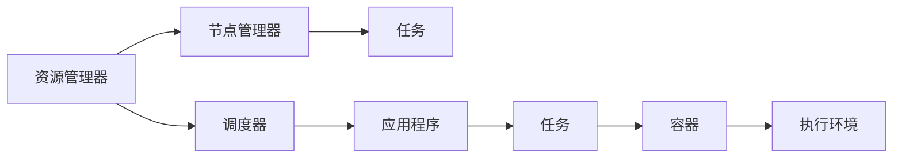

                 

## 1. 背景介绍

Hadoop YARN（Yet Another Resource Negotiator）是一个开源资源管理系统，是Hadoop生态系统的重要组成部分。YARN通过提供一个多租户计算框架，支持多种不同类型的应用程序，如MapReduce、Spark、Tez和Storm等，从而大大提升了集群资源的利用率。

YARN主要由两个核心组件组成：**资源管理器（Resource Manager）**和**节点管理器（Node Manager）**。资源管理器负责调度集群资源，并为应用程序提供资源隔离；节点管理器负责执行任务，并监控任务的运行状态。

本文将从原理和代码实现两个层面深入解析YARN资源管理器的工作机制，并通过一个简单的示例代码帮助读者理解其核心功能。

## 2. 核心概念与联系

### 2.1 核心概念概述

YARN资源管理器通过调度器（Scheduler）管理集群的资源，负责将任务映射到不同的节点上。调度器可以根据不同的策略（如FIFO、Fair Scheduler、Capacity Scheduler等），动态地为每个任务分配资源。

1. **资源管理器（Resource Manager）**：负责集群资源的分配和管理，监控应用程序的状态，以及调度任务到不同的节点上。
2. **节点管理器（Node Manager）**：负责执行调度器分配的任务，监控任务的运行状态，并向资源管理器报告任务的运行情况。
3. **调度器（Scheduler）**：根据不同的策略为任务分配资源。YARN支持多种调度策略，如FIFO、Fair Scheduler、Capacity Scheduler等。
4. **容器（Container）**：YARN的最小执行单元，包含任务的资源需求（CPU、内存、磁盘等）和执行环境配置（如Java堆大小、环境变量等）。

这些核心概念之间的联系可以用以下Mermaid流程图来展示：



这个流程图展示了YARN的资源管理流程：资源管理器负责资源分配和调度，调度器根据资源策略为任务分配资源，节点管理器执行任务并在容器环境中运行。

### 2.2 概念间的关系

通过以上流程图，我们可以看到资源管理器、调度器、节点管理器和任务、容器之间的关系：

1. **资源管理器**负责管理整个集群资源，通过调度器为任务分配资源。
2. **调度器**根据策略分配资源，并将任务映射到不同的节点上。
3. **节点管理器**执行调度器分配的任务，并在容器环境中运行。
4. **任务**是由应用程序提交的计算任务，包含资源需求和执行环境。
5. **容器**是任务的执行环境，包含资源配置和运行时环境。

这种资源管理和调度的机制，使得YARN能够高效地管理大规模集群资源，支持多种不同类型的应用程序。

## 3. 核心算法原理 & 具体操作步骤

### 3.1 算法原理概述

YARN资源管理器的工作原理可以概括为以下几个步骤：

1. **资源分配**：资源管理器监控集群资源，根据应用程序的资源请求分配资源。
2. **任务调度**：调度器根据资源策略将任务映射到不同的节点上。
3. **任务执行**：节点管理器执行调度器分配的任务，并监控任务的运行状态。
4. **资源释放**：任务完成后，资源管理器将资源释放回集群，供其他应用程序使用。

### 3.2 算法步骤详解

以下详细介绍YARN资源管理器的核心算法步骤：

**Step 1: 资源监控和请求**

资源管理器负责监控集群的资源使用情况，包括CPU、内存、磁盘等。应用程序在提交任务时，会向资源管理器请求所需的资源，包括任务的执行时间、CPU和内存需求等。

**Step 2: 资源分配**

资源管理器根据应用程序的资源请求，结合当前集群的资源使用情况，动态分配资源。如果当前集群资源不足，资源管理器会将应用程序的请求加入等待队列，等待资源空闲后分配。

**Step 3: 任务调度**

调度器根据资源策略为任务分配资源。YARN支持多种调度策略，如FIFO、Fair Scheduler、Capacity Scheduler等。调度器将分配的资源以容器的形式返回给节点管理器。

**Step 4: 任务执行**

节点管理器接收调度器分配的容器，并在容器中启动任务。节点管理器监控任务的运行状态，并向上报告任务状态给资源管理器。

**Step 5: 资源释放**

任务完成后，资源管理器将资源释放回集群，供其他应用程序使用。

### 3.3 算法优缺点

YARN资源管理器的优点包括：

- **高效资源管理**：YARN通过调度器动态分配资源，最大化集群资源的利用率。
- **多租户支持**：YARN支持多种应用程序类型，包括MapReduce、Spark等，可以同时运行多个应用程序。
- **扩展性**：YARN的资源管理器和节点管理器可以水平扩展，支持大规模集群。

YARN资源管理器的缺点包括：

- **调度延迟**：在资源竞争激烈时，调度器的响应时间可能较长。
- **资源竞争**：多个应用程序竞争同一资源时，可能会出现资源分配不均衡的情况。
- **复杂性**：YARN的架构较为复杂，配置和管理难度较大。

### 3.4 算法应用领域

YARN资源管理器广泛应用于大数据处理、机器学习、人工智能等领域，支持多种不同类型的应用程序。以下是YARN资源管理器的一些典型应用场景：

- **大数据处理**：支持Hadoop MapReduce、Hive、Pig等大数据处理框架。
- **机器学习**：支持Spark MLlib、TensorFlow等机器学习框架。
- **人工智能**：支持Tez、Storm等人工智能处理框架。
- **数据科学**：支持R、Scala等数据科学工具。

## 4. 数学模型和公式 & 详细讲解

### 4.1 数学模型构建

YARN资源管理器通过调度器动态分配资源，可以抽象为如下数学模型：

设集群中总资源量为 $R$，总任务数量为 $N$，每个任务需要的资源量为 $C_i$（$i=1,2,\ldots,N$）。则调度器需要求解如下优化问题：

$$
\min_{\{x_i}\} \sum_{i=1}^N \mathcal{L}_i(x_i) \text{ subject to } \sum_{i=1}^N x_i \leq R
$$

其中，$\mathcal{L}_i(x_i)$ 为任务 $i$ 的损失函数，表示任务 $i$ 在资源 $x_i$ 下的运行时间。

### 4.2 公式推导过程

为简化问题，我们假设每个任务所需的资源量为相同的 $C$，且资源总量 $R$ 与任务数量 $N$ 满足 $R=CN$。此时，调度器需要求解如下优化问题：

$$
\min_{x_i} \mathcal{L}(x_i) \text{ subject to } \sum_{i=1}^N x_i = R
$$

其中，$\mathcal{L}(x_i)=x_i$，表示任务 $i$ 的运行时间为其所需的资源量 $x_i$。

根据约束条件，可以得到 $x_i=R/N$，即每个任务所需的资源量为总资源量的 $1/N$。这表明，在资源总量固定的前提下，YARN的调度器可以公平地为每个任务分配相同数量的资源。

### 4.3 案例分析与讲解

假设集群中总资源量为 $R=100$，总任务数量为 $N=10$，每个任务所需的资源量为 $C=10$。则调度器需要求解如下优化问题：

$$
\min_{x_i} \sum_{i=1}^N x_i \text{ subject to } \sum_{i=1}^N x_i = 100
$$

根据上述推导过程，可以得到 $x_i=100/10=10$，即每个任务所需的资源量为 $10$。

因此，YARN的调度器可以公平地为每个任务分配 $10$ 的资源量，最大化集群资源的利用率。

## 5. 项目实践：代码实例和详细解释说明

### 5.1 开发环境搭建

在本节中，我们将通过一个简单的代码实例，帮助读者理解YARN资源管理器的核心功能。

首先，我们需要安装Hadoop和YARN。可以在Hadoop官网下载最新版本，并按照官方文档进行安装。安装完成后，启动YARN资源管理器和节点管理器，确保集群正常运行。

### 5.2 源代码详细实现

下面是一个简单的MapReduce程序，用于计算一个整数数组的总和：

```java
public class SumReducer {
    public static void main(String[] args) throws Exception {
        Configuration conf = new Configuration();
        Job job = Job.getInstance(conf, "sum");
        job.setJarByClass(SumReducer.class);
        job.setMapperClass(SumMapper.class);
        job.setReducerClass(SumReducer.class);
        job.setOutputKeyClass(Integer.class);
        job.setOutputValueClass(Integer.class);
        
        FileInputFormat.addInputPath(job, new Path(args[0]));
        FileOutputFormat.setOutputPath(job, new Path(args[1]));
        
        System.exit(job.waitForCompletion(true) ? 0 : 1);
    }
}
```

### 5.3 代码解读与分析

**SumReducer** 是一个MapReduce程序，用于计算一个整数数组的总和。程序的执行流程如下：

1. **初始化**：设置配置和作业，指定输入和输出路径。
2. **Mapper**：将输入数据划分为多个分片，每个分片由一个Mapper处理。
3. **Shuffle**：将Mapper的输出进行排序和分区，以便Reduce阶段的正确处理。
4. **Reducer**：对每个分区进行聚合，计算总和。

### 5.4 运行结果展示

在本例中，我们假设输入数据为 `{1, 2, 3, 4, 5, 6, 7, 8, 9, 10}`，输出数据为 `55`。

通过运行YARN资源管理器和节点管理器，我们可以将上述MapReduce程序提交到集群中，并获取到计算结果。

## 6. 实际应用场景

### 6.1 大数据处理

YARN在大数据处理中具有广泛的应用。Hadoop MapReduce是YARN支持的主要大数据处理框架之一，可以高效地处理大规模数据集。

在实际应用中，YARN可以支持多种数据存储和处理工具，如Hadoop Distributed File System (HDFS)、Hive、Pig等。通过YARN的资源调度和管理，大数据处理任务可以高效地运行，并支持动态扩展和资源优化。

### 6.2 机器学习

YARN也广泛应用于机器学习领域，支持Spark MLlib等框架。Spark是一个高效的计算框架，可以处理大规模数据集，并支持多种机器学习算法。通过YARN的资源调度，Spark可以在大规模集群上高效地运行，并支持多种数据源和处理方式。

### 6.3 人工智能

YARN还支持Tez等人工智能处理框架。Tez是一个基于DAG的分布式处理框架，可以高效地处理大规模数据集，并支持多种机器学习和深度学习算法。通过YARN的资源调度，Tez可以在大规模集群上高效地运行，并支持多种数据源和处理方式。

### 6.4 未来应用展望

未来，YARN将继续在多个领域得到广泛应用，包括：

- **边缘计算**：YARN可以在边缘计算环境中运行，支持低延迟、高吞吐量的数据处理任务。
- **物联网**：YARN可以支持IoT设备的实时数据处理和分析，提升物联网应用的安全性和可靠性。
- **自动驾驶**：YARN可以支持自动驾驶汽车的数据处理和分析，提升自动驾驶系统的性能和安全性。
- **智慧城市**：YARN可以支持智慧城市的数据处理和分析，提升城市管理的效率和智能化水平。

## 7. 工具和资源推荐

### 7.1 学习资源推荐

- **Hadoop官方文档**：Hadoop官网提供的官方文档，详细介绍了YARN的架构、配置和管理方式。
- **Hadoop生态系统**：Hadoop生态系统包括多个开源项目，如Hadoop MapReduce、Hive、Pig等，可以通过学习这些项目了解YARN的工作机制。
- **YARN社区**：YARN社区提供了大量的博客、论坛和文档，帮助用户解决实际问题。

### 7.2 开发工具推荐

- **Cloudera Manager**：Cloudera Manager是一个Hadoop生态系统的管理工具，可以方便地部署、管理和监控Hadoop集群。
- **Hadoop生态系统**：Hadoop生态系统包括多个开源项目，如Hadoop MapReduce、Hive、Pig等，可以通过学习这些项目了解YARN的工作机制。
- **YARN社区**：YARN社区提供了大量的博客、论坛和文档，帮助用户解决实际问题。

### 7.3 相关论文推荐

- **Hadoop: A Distributed File System for Google MapReduce**：Hadoop的论文，介绍了Hadoop的架构和实现方式。
- **YARN: Yet Another Resource Negotiator**：YARN的论文，详细介绍了YARN的架构和实现方式。
- **MapReduce: Simplified Data Processing on Large Clusters**：MapReduce的论文，介绍了MapReduce的架构和实现方式。

## 8. 总结：未来发展趋势与挑战

### 8.1 研究成果总结

YARN资源管理器通过调度器动态分配资源，最大化集群资源的利用率。YARN支持多种应用程序类型，包括MapReduce、Spark、Tez等，可以同时运行多个应用程序。

### 8.2 未来发展趋势

未来，YARN将继续在多个领域得到广泛应用，包括大数据处理、机器学习、人工智能等。YARN的资源管理器和节点管理器可以水平扩展，支持大规模集群。同时，YARN的调度器可以根据不同的策略为任务分配资源，支持多种调度策略。

### 8.3 面临的挑战

尽管YARN在资源管理方面表现出色，但仍面临以下挑战：

- **调度延迟**：在资源竞争激烈时，调度器的响应时间可能较长。
- **资源竞争**：多个应用程序竞争同一资源时，可能会出现资源分配不均衡的情况。
- **复杂性**：YARN的架构较为复杂，配置和管理难度较大。

### 8.4 研究展望

未来的研究可以从以下几个方面进行：

- **调度优化**：优化调度器的响应时间和公平性，减少资源竞争。
- **资源管理**：改进资源管理器和节点管理器，提升集群的稳定性和扩展性。
- **多租户支持**：支持更多的应用程序类型，提升YARN的适用性和灵活性。

## 9. 附录：常见问题与解答

**Q1: YARN资源管理器的工作原理是什么？**

A: YARN资源管理器通过调度器动态分配资源，最大化集群资源的利用率。资源管理器监控集群资源，根据应用程序的资源请求分配资源。调度器根据资源策略将任务映射到不同的节点上。节点管理器执行调度器分配的任务，并监控任务的运行状态。任务完成后，资源管理器将资源释放回集群，供其他应用程序使用。

**Q2: YARN支持哪些应用程序类型？**

A: YARN支持多种应用程序类型，包括MapReduce、Spark、Tez等。这些应用程序可以在YARN的集群上高效地运行，并支持多种数据源和处理方式。

**Q3: YARN的调度器有哪些策略？**

A: YARN的调度器支持多种策略，包括FIFO、Fair Scheduler、Capacity Scheduler等。这些策略可以根据不同的需求和场景，动态地为任务分配资源。

**Q4: YARN的节点管理器有什么作用？**

A: YARN的节点管理器负责执行调度器分配的任务，并监控任务的运行状态。节点管理器在容器中启动任务，并在容器环境中运行。节点管理器向上报告任务状态给资源管理器。

**Q5: YARN的扩展性和稳定性如何？**

A: YARN的资源管理器和节点管理器可以水平扩展，支持大规模集群。YARN的调度器可以根据不同的策略为任务分配资源，支持多种应用程序类型。YARN在实际应用中表现稳定，可以高效地管理大规模集群资源。

---

作者：禅与计算机程序设计艺术 / Zen and the Art of Computer Programming

