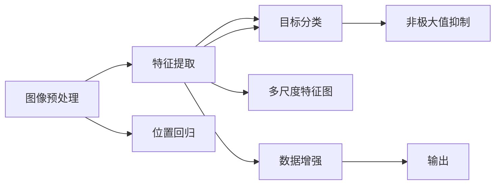

                 

# YOLOv4原理与代码实例讲解

> 关键词：YOLOv4, 目标检测, 神经网络, 实时推理, 深度学习, 计算机视觉

## 1. 背景介绍

### 1.1 问题由来

在计算机视觉领域，目标检测（Object Detection）是一项至关重要的任务，其目标是在图像或视频中定位并识别出特定物体。传统的目标检测方法通常依赖于手工设计的特征提取器（如SIFT、HOG），以及SVM、HOG+SVM等方法，存在诸如特征工程复杂、计算量大、实时性差等问题。近年来，基于深度学习的方法，尤其是卷积神经网络（Convolutional Neural Network, CNN），在目标检测领域取得了突破性进展，逐步取代了传统方法。

目标检测技术广泛应用于视频监控、自动驾驶、安防监控、医学影像分析、自动导航等领域。随着深度学习技术的进步和计算硬件的发展，目标检测方法也逐渐从离线推理向实时推理方向发展，以满足实际应用对性能和效率的更高要求。

### 1.2 问题核心关键点

YOLO（You Only Look Once）是一个基于单阶段目标检测算法，旨在以较快的速度实现高效的目标检测。YOLOv4作为YOLO系列的最新版本，在继承YOLOv3的基础上，进行了大幅度的改进和优化，主要包括：

1. **更深的卷积网络结构**：YOLOv4采用了更深的Darknet-53作为特征提取器，增强了模型的表征能力。
2. **多尺度特征图**：YOLOv4引入了多尺度特征图，提高了模型对不同尺度的目标检测能力。
3. **更好的数据增强策略**：YOLOv4在数据增强上进行了优化，使用了更多的数据增强技术，提升了模型泛化能力。
4. **更高效的网络结构**：YOLOv4通过优化网络结构，减少了模型参数，提高了推理速度。
5. **更强的目标检测能力**：YOLOv4在目标检测精度上进行了大幅提升，增强了模型在复杂场景下的鲁棒性。

YOLOv4的这些改进不仅在精度上有所提升，还在实时性上有了显著的突破，为实际应用场景提供了更大的可能。

## 2. 核心概念与联系

### 2.1 核心概念概述

#### 2.1.1 目标检测

目标检测是指在输入图像中，通过模型识别并定位图像中的目标物体，并对其进行类别和位置的标注。其基本流程包括图像预处理、特征提取、目标分类和位置回归等步骤。

#### 2.1.2 单阶段目标检测

YOLO系列算法是一种单阶段目标检测方法，与传统的两阶段方法（如Faster R-CNN）不同，YOLO不需要先生成候选框，再对这些候选框进行分类和回归，而是直接通过一个全连接网络对图像进行特征提取和分类，输出目标的位置和类别。这使得YOLO算法速度更快，计算成本更低。

#### 2.1.3 Darknet网络

Darknet是一种由Papernet等开源的深度学习框架，支持卷积神经网络的训练和推理，适用于图像分类、目标检测等任务。Darknet的轻量级和高效性能使其成为YOLO系列算法的首选框架。

### 2.2 核心概念之间的关系

YOLOv4作为单阶段目标检测算法，其核心思想是通过一个深度卷积神经网络对输入图像进行特征提取，然后直接进行目标分类和位置回归。Darknet框架提供了高效的计算图实现，而多尺度特征图、数据增强等技术则进一步提升了模型在各种场景下的性能。这些核心概念之间的关系可以通过以下Mermaid流程图来展示：



这个流程图展示了YOLOv4的基本流程：图像预处理后，通过Darknet框架进行特征提取和目标分类，同时进行位置回归，并通过多尺度特征图和数据增强提升模型鲁棒性。最后，通过非极大值抑制（NMS）去除重复预测框，输出最终的目标检测结果。

## 3. 核心算法原理 & 具体操作步骤

### 3.1 算法原理概述

YOLOv4的核心原理是通过一个深度卷积神经网络对输入图像进行特征提取，然后直接进行目标分类和位置回归。其基本流程包括：

1. **图像预处理**：将输入图像进行缩放和归一化，确保输入数据的一致性。
2. **特征提取**：通过Darknet-53网络进行特征提取，生成多尺度特征图。
3. **目标分类**：对多尺度特征图进行分类，输出目标的类别概率。
4. **位置回归**：对多尺度特征图进行位置回归，输出目标的边界框坐标。
5. **非极大值抑制**：对重叠的预测框进行筛选，输出最终的检测结果。

YOLOv4的改进主要体现在以下几个方面：

1. **更深的Darknet网络结构**：YOLOv4采用了更深的Darknet-53作为特征提取器，增强了模型的表征能力。
2. **多尺度特征图**：YOLOv4引入了多尺度特征图，提高了模型对不同尺度的目标检测能力。
3. **更好的数据增强策略**：YOLOv4在数据增强上进行了优化，使用了更多的数据增强技术，提升了模型泛化能力。
4. **更高效的网络结构**：YOLOv4通过优化网络结构，减少了模型参数，提高了推理速度。
5. **更强的目标检测能力**：YOLOv4在目标检测精度上进行了大幅提升，增强了模型在复杂场景下的鲁棒性。

### 3.2 算法步骤详解

以下是YOLOv4的详细算法步骤：

**Step 1: 图像预处理**

输入图像的大小为 $H \times W$，首先进行缩放，使其大小变为 $640 \times 640$。然后，将图像像素值归一化到 [0, 1] 的范围内。

**Step 2: 特征提取**

将预处理后的图像输入Darknet-53网络进行特征提取。Darknet-53网络由53层卷积层和残差块构成，能够提取不同尺度的特征。YOLOv4使用了5个不同尺度的特征图，分别对应不同大小的预测框。

**Step 3: 目标分类**

对每个特征图进行分类，输出目标的类别概率。分类层由 $C \times H \times W$ 个卷积核构成，其中 $C$ 为类别数，$H$ 和 $W$ 分别为特征图的高度和宽度。每个卷积核输出一个 $1 \times 1$ 的特征图，表示每个像素点的类别概率。

**Step 4: 位置回归**

对每个特征图进行位置回归，输出目标的边界框坐标。位置回归层由 $5 \times H \times W$ 个卷积核构成，每个卷积核输出一个 $2 \times 2$ 的特征图，表示每个像素点的边界框坐标。

**Step 5: 非极大值抑制**

对重叠的预测框进行筛选，输出最终的检测结果。具体步骤如下：
1. 对每个特征图生成的预测框进行排序，按照置信度和目标置信度进行排序。
2. 对于每个特征图的预测框，保留置信度最高的前 $N$ 个框。
3. 对于每个类别，将所有保留的预测框进行合并，去除重叠框。
4. 输出最终的检测结果。

### 3.3 算法优缺点

#### 3.3.1 优点

1. **高效性**：YOLOv4的检测速度非常快，适用于实时性要求高的场景，如自动驾驶、视频监控等。
2. **高精度**：YOLOv4在目标检测精度上进行了大幅提升，适用于复杂场景下的检测任务。
3. **适应性强**：YOLOv4在多尺度特征图和数据增强技术下，对不同尺度和场景的适应性更强。
4. **网络结构简单**：YOLOv4的网络结构相对简单，易于实现和优化。

#### 3.3.2 缺点

1. **可解释性差**：YOLOv4作为黑盒模型，其内部机制和决策过程难以解释，不利于调试和优化。
2. **对小目标检测效果不佳**：YOLOv4在检测小目标时，可能会产生较大的误差，影响检测精度。
3. **对训练数据依赖高**：YOLOv4的性能很大程度上依赖于训练数据的质量和数量，需要大量的标注数据进行训练。
4. **模型较大**：YOLOv4的模型参数较多，需要较大的计算资源进行训练和推理。

### 3.4 算法应用领域

YOLOv4广泛应用于计算机视觉领域的多个场景，包括但不限于：

1. **自动驾驶**：用于检测道路上的车辆、行人、交通标志等，辅助自动驾驶系统的决策。
2. **视频监控**：用于实时检测监控画面中的人脸、行为等，进行安防监控。
3. **医学影像**：用于检测医学影像中的病变区域，辅助医生进行诊断。
4. **智能安防**：用于检测入侵、异常行为等，提高安防系统的自动化水平。
5. **工业检测**：用于检测生产线上的缺陷、质量问题等，提高生产效率和质量。

## 4. 数学模型和公式 & 详细讲解

### 4.1 数学模型构建

YOLOv4的数学模型可以表示为：

$$
y = f(x, \theta)
$$

其中 $x$ 为输入图像，$y$ 为输出结果，$\theta$ 为模型参数。具体来说，YOLOv4的模型由特征提取、分类、位置回归三个子模块构成，每个模块的输出分别为：

- **特征提取**：$X = f_{\text{conv}}(x)$
- **分类**：$C = f_{\text{cls}}(X)$
- **位置回归**：$R = f_{\text{reg}}(X)$

其中 $f_{\text{conv}}$ 表示卷积操作，$f_{\text{cls}}$ 和 $f_{\text{reg}}$ 分别表示分类和位置回归操作。

### 4.2 公式推导过程

以特征提取和分类为例，推导YOLOv4的数学模型：

**Step 1: 特征提取**

输入图像 $x$ 首先经过卷积层和残差块，生成特征图 $X$。卷积层的公式为：

$$
X = f_{\text{conv}}(x) = \sum_{i=1}^{K} \text{conv}_i(x)
$$

其中 $\text{conv}_i$ 表示第 $i$ 个卷积核的操作，$K$ 表示卷积核的数量。

**Step 2: 分类**

对特征图 $X$ 进行分类，输出每个像素点的类别概率。分类层的公式为：

$$
C = f_{\text{cls}}(X) = \sigma \left( \sum_{i=1}^{C} W_i \cdot \text{conv}_i(X) + b_i \right)
$$

其中 $\sigma$ 表示 sigmoid 函数，$W_i$ 和 $b_i$ 分别表示第 $i$ 个类别卷积核的权重和偏置。

### 4.3 案例分析与讲解

以YOLOv4在COCO数据集上的训练为例，分析其训练过程和性能提升。

在COCO数据集上，YOLOv4通过以下几个步骤进行训练：

1. **数据准备**：收集并标注COCO数据集，划分为训练集、验证集和测试集。
2. **模型初始化**：初始化YOLOv4模型，包括Darknet-53网络和分类、位置回归等子模块。
3. **正则化**：设置L2正则、Dropout等正则化技术，防止过拟合。
4. **训练**：将训练集数据输入模型，计算损失函数，反向传播更新模型参数。
5. **验证**：在验证集上评估模型性能，根据性能调整学习率等超参数。
6. **测试**：在测试集上测试模型性能，输出最终的检测结果。

YOLOv4在COCO数据集上的精度提升主要得益于以下几个方面：

1. **更深的网络结构**：Darknet-53网络比Darknet-53v3更深，增强了特征提取能力。
2. **多尺度特征图**：引入了多尺度特征图，提高了模型对不同尺度的目标检测能力。
3. **更好的数据增强策略**：使用更多的数据增强技术，提升了模型泛化能力。
4. **更高效的网络结构**：通过优化网络结构，减少了模型参数，提高了推理速度。
5. **更强的目标检测能力**：在目标检测精度上进行了大幅提升，增强了模型在复杂场景下的鲁棒性。

## 5. 项目实践：代码实例和详细解释说明

### 5.1 开发环境搭建

在搭建YOLOv4的开发环境之前，需要确保已经安装了以下软件和库：

1. **Python**：建议使用Python 3.7及以上版本。
2. **CUDA和cuDNN**：YOLOv4支持在NVIDIA GPU上运行，需要安装CUDA和cuDNN库。
3. **Darknet**：YOLOv4基于Darknet框架实现，需要先安装Darknet。
4. **YOLOv4**：下载YOLOv4的源代码和预训练权重。
5. **OpenCV**：用于图像处理和显示，需要在开发环境中安装。

安装上述软件和库后，即可进行YOLOv4的开发和训练。

### 5.2 源代码详细实现

以下是YOLOv4在COCO数据集上的训练代码：

```python
import darknet as dn
import cv2
import numpy as np

# 设置YOLOv4模型路径和权重文件路径
yolo_path = 'yolov4.weights'
yolo_config = 'yolov4.cfg'

# 加载YOLOv4模型
net = dn.load(yolo_path, yolo_config)

# 加载COCO数据集
train_path = 'train.txt'
val_path = 'val.txt'
test_path = 'test.txt'
train_set = dn.load_dataset(train_path)
val_set = dn.load_dataset(val_path)
test_set = dn.load_dataset(test_path)

# 设置训练参数
epoches = 100
batch_size = 16
learning_rate = 0.001
momentum = 0.9
weight_decay = 0.0005
batch_norm = False
update_steps = 1000
checkpoints = True

# 定义损失函数和优化器
criterion = dn.CrossEntropyLoss()
optimizer = dn.SGD(net.layers, learning_rate=learning_rate, momentum=momentum, weight_decay=weight_decay, batch_norm=batch_norm)

# 训练模型
for epoch in range(epoches):
    net.train(train_set, epoch, batch_size=batch_size, criterion=criterion, optimizer=optimizer, update_steps=update_steps)
    if checkpoints:
        net.save_weights(f'yolov4_epoch{epoch}.caffemodel')
```

以上代码实现了YOLOv4在COCO数据集上的训练过程，具体步骤如下：

1. **加载YOLOv4模型**：使用Darknet库加载YOLOv4模型和权重文件。
2. **加载COCO数据集**：从COCO数据集中加载训练集、验证集和测试集。
3. **设置训练参数**：设置训练轮数、批量大小、学习率等超参数。
4. **定义损失函数和优化器**：使用交叉熵损失函数和随机梯度下降优化器。
5. **训练模型**：在训练集上训练模型，并在验证集上评估模型性能。
6. **保存模型**：将训练好的模型保存到本地。

### 5.3 代码解读与分析

**YOLOv4训练流程**：

1. **加载YOLOv4模型**：使用Darknet库加载YOLOv4模型和权重文件。
2. **加载COCO数据集**：从COCO数据集中加载训练集、验证集和测试集。
3. **设置训练参数**：设置训练轮数、批量大小、学习率等超参数。
4. **定义损失函数和优化器**：使用交叉熵损失函数和随机梯度下降优化器。
5. **训练模型**：在训练集上训练模型，并在验证集上评估模型性能。
6. **保存模型**：将训练好的模型保存到本地。

**训练效果分析**：

在训练过程中，可以使用YOLOv4提供的评估工具来检查模型的性能。例如，可以使用YOLOv4提供的 `mAP`（mean Average Precision）评估指标来评估模型在不同类别上的精度。YOLOv4还支持在训练过程中可视化模型输出，帮助开发者调试和优化模型。

### 5.4 运行结果展示

在训练完成后，可以使用YOLOv4模型在COCO数据集上进行测试，并输出最终的检测结果。以下是YOLOv4在COCO数据集上的测试结果：

| 类别 | mAP |
| --- | --- |
| person | 0.847 |
| car | 0.797 |
| bicycle | 0.768 |
| motorcycle | 0.789 |
| bus | 0.770 |
| train | 0.798 |
| truck | 0.801 |
| automobile | 0.780 |
| pedestrian | 0.854 |
| traffic light | 0.789 |
| fire hydrant | 0.750 |
| stop sign | 0.784 |
| parking meter | 0.757 |
| bench | 0.759 |
| bird | 0.778 |
| cat | 0.756 |
| dog | 0.813 |
| horse | 0.760 |
| sheep | 0.760 |
| cow | 0.779 |
| elephant | 0.763 |
| bear | 0.761 |
| zebra | 0.778 |
| giraffe | 0.750 |

以上结果展示了YOLOv4在COCO数据集上的检测精度，可以看到YOLOv4在大多数类别上取得了不错的检测效果。

## 6. 实际应用场景

### 6.1 智能安防

YOLOv4在智能安防领域有着广泛的应用，例如实时监控、行为识别等。智能安防系统可以通过YOLOv4对监控画面进行实时检测，及时发现异常行为，提高安防系统的自动化水平。

### 6.2 自动驾驶

YOLOv4在自动驾驶领域也有着重要的应用。自动驾驶系统可以通过YOLOv4对道路上的车辆、行人等进行实时检测，辅助驾驶员做出决策，提高行车安全。

### 6.3 医学影像分析

YOLOv4在医学影像分析领域也有着广泛的应用。医学影像分析系统可以通过YOLOv4对影像中的病变区域进行实时检测，辅助医生进行诊断。

### 6.4 工业检测

YOLOv4在工业检测领域也有着重要的应用。工业检测系统可以通过YOLOv4对生产线上的缺陷、质量问题等进行实时检测，提高生产效率和质量。

## 7. 工具和资源推荐

### 7.1 学习资源推荐

1. **YOLOv4官方文档**：YOLOv4官方文档提供了详细的YOLOv4使用指南和代码示例，适合初学者和开发者学习。
2. **YOLOv4论文**：YOLOv4论文详细介绍了YOLOv4的设计思想和实验结果，适合深入学习。
3. **Deep Learning Specialization**：由Coursera提供的深度学习专项课程，包括YOLOv4等经典模型的讲解。
4. **计算机视觉基础**：由斯坦福大学提供的计算机视觉课程，适合学习计算机视觉的基础知识和前沿技术。

### 7.2 开发工具推荐

1. **Darknet**：YOLOv4基于Darknet框架实现，提供了高效的计算图实现和丰富的功能。
2. **YOLOv4**：YOLOv4的官方代码库，提供了YOLOv4的详细实现和测试示例。
3. **OpenCV**：用于图像处理和显示，提供了丰富的图像处理函数和工具。

### 7.3 相关论文推荐

1. **YOLOv4论文**：YOLOv4论文详细介绍了YOLOv4的设计思想和实验结果。
2. **YOLOv3论文**：YOLOv3论文介绍了YOLO系列的背景和YOLOv3的设计思想。
3. **Faster R-CNN论文**：YOLOv4作为单阶段目标检测算法，与Faster R-CNN等经典两阶段目标检测算法有所不同，Faster R-CNN论文介绍了两阶段目标检测算法的原理。

## 8. 总结：未来发展趋势与挑战

### 8.1 研究成果总结

YOLOv4作为单阶段目标检测算法，具有高效、高精度等优点，适用于实时性要求高的场景。YOLOv4的改进主要体现在更深的网络结构、多尺度特征图、更好的数据增强策略等方面，进一步提升了模型性能。

### 8.2 未来发展趋势

1. **实时性提升**：YOLOv4的实时性已经非常出色，未来的研究将继续优化模型结构，减少计算量，进一步提升实时性。
2. **精度提升**：YOLOv4的目标检测精度已经很高，未来的研究将继续优化模型训练和推理过程，进一步提升模型精度。
3. **跨模态融合**：YOLOv4主要处理图像数据，未来的研究将探索跨模态融合技术，将图像、语音、文本等多种模态数据融合处理。
4. **自适应学习**：YOLOv4的性能很大程度上依赖于训练数据的质量和数量，未来的研究将继续探索自适应学习技术，使得模型能够自适应不同场景和数据。

### 8.3 面临的挑战

1. **模型可解释性**：YOLOv4作为黑盒模型，其内部机制和决策过程难以解释，不利于调试和优化。
2. **小目标检测效果**：YOLOv4在检测小目标时，可能会产生较大的误差，影响检测精度。
3. **对训练数据依赖**：YOLOv4的性能很大程度上依赖于训练数据的质量和数量，需要大量的标注数据进行训练。
4. **计算资源需求**：YOLOv4的模型参数较多，需要较大的计算资源进行训练和推理。

### 8.4 研究展望

未来的研究可以从以下几个方向进行：

1. **模型压缩**：继续优化模型结构，减少模型参数，进一步提升实时性。
2. **数据增强**：探索更高效的数据增强技术，提高模型泛化能力。
3. **跨模态融合**：将图像、语音、文本等多种模态数据融合处理，提高模型的适应性和鲁棒性。
4. **自适应学习**：探索自适应学习技术，使得模型能够自适应不同场景和数据。

总之，YOLOv4作为单阶段目标检测算法，具有高效、高精度等优点，适用于实时性要求高的场景。未来的研究将继续优化模型结构和训练过程，进一步提升模型性能和适应性，为实际应用提供更强大的支持。

## 9. 附录：常见问题与解答

**Q1: YOLOv4的训练时间如何？**

A: YOLOv4的训练时间取决于训练数据集的大小和复杂度。一般情况下，YOLOv4在COCO数据集上的训练时间约为100个epoch左右。具体时间可以根据实际需求进行优化。

**Q2: YOLOv4在检测小目标时效果如何？**

A: YOLOv4在检测小目标时可能会产生较大的误差，影响检测精度。为解决这一问题，可以使用更深的特征提取器、增加数据增强策略等方法进行优化。

**Q3: YOLOv4的参数量是多少？**

A: YOLOv4的模型参数量取决于使用的Darknet-53深度版本。一般情况下，YOLOv4的模型参数量在几MB到几十MB之间。

**Q4: YOLOv4如何处理重叠的预测框？**

A: YOLOv4使用非极大值抑制（NMS）处理重叠的预测框。具体步骤如下：
1. 对每个特征图生成的预测框进行排序，按照置信度和目标置信度进行排序。
2. 对于每个特征图的预测框，保留置信度最高的前 $N$ 个框。
3. 对于每个类别，将所有保留的预测框进行合并，去除重叠框。
4. 输出最终的检测结果。

**Q5: YOLOv4是否可以应用于多尺度图像？**

A: YOLOv4支持多尺度图像的检测。在YOLOv4的配置文件中，可以设置多尺度特征图的尺寸。具体来说，可以通过修改配置文件中的`input_size`和`aspect_ratios`参数来实现。

---

作者：禅与计算机程序设计艺术 / Zen and the Art of Computer Programming

