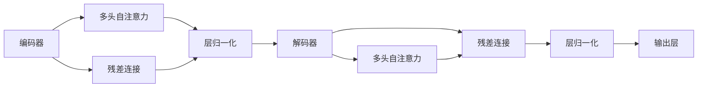

                 

# transformer 原理与代码实例讲解

## 1. 背景介绍

在深度学习的快速发展的背景下，Transformer模型因其卓越的性能在自然语言处理（NLP）领域广受关注。本博客旨在系统性地介绍Transformer模型的原理、实现细节，并通过具体代码实例深入讲解其应用。

### 1.1 背景知识

Transformer模型最早由Google的研究团队在2017年的论文《Attention is All You Need》中提出。与传统的循环神经网络（RNN）和卷积神经网络（CNN）相比，Transformer以其独特的自注意力机制（self-attention）和位置编码（positional encoding）机制，显著提升了NLP任务的性能。

Transformer的成功不仅体现在其顶级的表现上，也在于其可扩展性（scalability）和易于并行化的特性，使得它在处理大规模数据时表现出色。

## 2. 核心概念与联系

### 2.1 核心概念概述

为更好地理解Transformer，本节将介绍几个关键概念及其相互关系。

- **Transformer模型**：基于自注意力机制的神经网络模型，包括编码器（encoder）和解码器（decoder）两部分。编码器负责将输入序列转换成一个高维向量表示，解码器则根据此向量生成输出序列。
- **自注意力机制**：Transformer的核心组成部分，允许模型在输入序列的任何位置间建立关系，通过计算注意力权重对输入序列的各个部分进行加权，从而提取最相关的特征。
- **位置编码**：用于向Transformer模型引入位置信息，解决传统自注意力机制无法感知序列位置的缺陷。
- **多头自注意力**：将自注意力机制分解为多个子机制，并行计算，提高模型表达能力和训练效率。
- **残差连接**：用于解决网络退化（vanishing gradient）问题，提升模型的训练稳定性。
- **层归一化**：在每一层之后引入归一化操作，保证每一层的输入分布稳定，加速模型收敛。

这些核心概念构成了Transformer模型的基本框架和关键特性，对其理解将有助于深入学习和实现Transformer。

### 2.2 核心概念间的关系

Transformer模型的核心概念间存在着紧密的联系。通过以下Mermaid流程图，我们可以更直观地理解这些概念如何共同构成Transformer的工作原理：



这个流程图展示了Transformer模型的基本结构：编码器和解码器通过自注意力机制进行信息交换，残差连接和层归一化确保模型稳定性，最终通过输出层生成结果。

## 3. 核心算法原理 & 具体操作步骤

### 3.1 算法原理概述

Transformer模型采用编码-解码（Encoder-Decoder）结构，包含多个自注意力层（Self-Attention Layer）和前馈神经网络（Feedforward Layer）。模型通过并行计算每个位置与其他位置的注意力权重，综合处理序列中的信息，生成输出序列。

Transformer的计算过程主要包括以下几个步骤：

1. 输入序列编码：将输入序列转换为网络可以处理的数值表示，即嵌入（Embedding）。
2. 多头自注意力计算：计算输入序列中各个位置的注意力权重，综合所有位置的信息。
3. 前馈网络计算：将多头自注意力层的输出送入前馈网络，进行非线性变换。
4. 残差连接和层归一化：将前馈网络的输出与原始嵌入相加，并进行归一化处理。
5. 输出序列解码：将编码器的输出作为解码器的输入，重复以上步骤，生成目标序列。

### 3.2 算法步骤详解

下面以具体的步骤详解Transformer的计算过程。

**步骤1：输入序列编码**

输入序列首先经过嵌入层（Embedding Layer），将每个单词转换为一个高维向量表示。嵌入层的输出表示如下：

$$\mathbf{X} = \mathbf{E}(\mathbf{W}_E\mathbf{X})$$

其中 $\mathbf{X}$ 表示嵌入层的输出，$\mathbf{E}$ 表示嵌入层，$\mathbf{W}_E$ 表示嵌入矩阵，$\mathbf{X}$ 表示输入序列的原始形式。

**步骤2：多头自注意力计算**

Transformer使用多头自注意力（Multi-Head Self-Attention）机制，将输入序列中的每个位置与其他位置的注意力权重进行计算，生成一个高维向量表示，表示该位置与整个序列的关系。多头自注意力计算过程如下：

$$\mathbf{Q} = \mathbf{A}(\mathbf{W}_Q\mathbf{X})$$
$$\mathbf{K} = \mathbf{A}(\mathbf{W}_K\mathbf{X})$$
$$\mathbf{V} = \mathbf{A}(\mathbf{W}_V\mathbf{X})$$

其中 $\mathbf{Q}$、$\mathbf{K}$、$\mathbf{V}$ 分别表示查询（Query）、键（Key）、值（Value）矩阵，$\mathbf{A}$ 表示矩阵乘法，$\mathbf{W}_Q$、$\mathbf{W}_K$、$\mathbf{W}_V$ 分别表示查询、键、值矩阵的权重。

注意力权重 $\mathbf{A}$ 的计算如下：

$$\mathbf{A} = \text{Softmax}(\frac{\mathbf{Q}\mathbf{K}^T}{\sqrt{d_k}})$$

其中 $d_k$ 是键向量维度，$\text{Softmax}$ 函数用于将注意力权重归一化。

最终，通过加权和操作，生成多头自注意力层的输出：

$$\mathbf{Z} = \mathbf{A}\mathbf{V}$$

**步骤3：前馈网络计算**

前馈网络层对多头自注意力层的输出进行非线性变换，具体计算如下：

$$\mathbf{X'} = \mathbf{F}(\mathbf{Z}) = \mathbf{G}\sigma(\mathbf{H}\mathbf{Z})$$

其中 $\mathbf{F}$ 表示前馈网络，$\mathbf{G}$、$\mathbf{H}$、$\sigma$ 分别表示前馈网络中不同的变换矩阵和非线性激活函数。

**步骤4：残差连接和层归一化**

残差连接和层归一化操作可以确保每一层的输入分布稳定，加速模型收敛。具体计算如下：

$$\mathbf{X''} = \mathbf{N}(\mathbf{X'}, \mathbf{X})$$
$$\mathbf{X'''} = \mathbf{L}(\mathbf{X''})$$

其中 $\mathbf{N}$ 表示残差连接，$\mathbf{L}$ 表示层归一化。

**步骤5：输出序列解码**

解码器的过程与编码器类似，最终生成目标序列的预测。

### 3.3 算法优缺点

Transformer模型具有以下优点：

- 并行计算：Transformer的计算过程可以通过并行计算优化，显著提升训练和推理效率。
- 自注意力机制：自注意力机制使得Transformer能够同时处理输入序列的多个位置，提取更丰富的特征。
- 易于扩展：Transformer的模块化设计使其可以轻松应用于不同规模和类型的任务。

然而，Transformer也存在一些缺点：

- 参数量较大：由于Transformer采用多个自注意力层，导致模型参数量较大，增加了训练和推理的复杂度。
- 位置编码问题：Transformer中的位置编码是固定且有限的，对于长序列的输入，可能会导致信息丢失。

### 3.4 算法应用领域

Transformer模型在NLP领域得到了广泛应用，包括但不限于：

- 机器翻译：将源语言文本翻译为目标语言。
- 文本分类：将输入文本分类为不同的类别。
- 问答系统：回答自然语言问题。
- 文本生成：生成自然语言文本，如摘要、对话等。
- 情感分析：分析文本的情感倾向。

Transformer的强大性能使其在多个领域展示了其卓越的性能和灵活性，成为NLP领域的核心技术。

## 4. 数学模型和公式 & 详细讲解 & 举例说明

### 4.1 数学模型构建

Transformer模型的数学模型可以分为输入层、编码器、解码器和输出层四个部分。下面以机器翻译为例，详细介绍其数学模型构建过程。

**输入层**：将源语言文本 $x = (x_1, x_2, \ldots, x_m)$ 转换为高维向量表示 $X = (x_1, x_2, \ldots, x_m)$。

**编码器**：编码器由多个自注意力层和前馈神经网络层交替组成，输出表示为 $H = (h_1, h_2, \ldots, h_n)$。

**解码器**：解码器与编码器结构类似，但多了一个输出层，用于生成目标语言文本 $y = (y_1, y_2, \ldots, y_l)$。

**输出层**：将解码器的输出转换为目标语言文本的预测，如概率分布或直接输出文本。

### 4.2 公式推导过程

Transformer的公式推导过程较为复杂，这里简要介绍其主要部分。

**多头自注意力计算**

查询、键、值矩阵的计算公式如下：

$$\mathbf{Q} = \mathbf{A}(\mathbf{W}_Q\mathbf{X})$$
$$\mathbf{K} = \mathbf{A}(\mathbf{W}_K\mathbf{X})$$
$$\mathbf{V} = \mathbf{A}(\mathbf{W}_V\mathbf{X})$$

注意力权重的计算公式如下：

$$\mathbf{A} = \text{Softmax}(\frac{\mathbf{Q}\mathbf{K}^T}{\sqrt{d_k}})$$

最终的多头自注意力层的输出为：

$$\mathbf{Z} = \mathbf{A}\mathbf{V}$$

**前馈网络计算**

前馈网络层的计算公式如下：

$$\mathbf{X'} = \mathbf{F}(\mathbf{Z}) = \mathbf{G}\sigma(\mathbf{H}\mathbf{Z})$$

**残差连接和层归一化**

残差连接和层归一化的计算公式如下：

$$\mathbf{X''} = \mathbf{N}(\mathbf{X'}, \mathbf{X})$$
$$\mathbf{X'''} = \mathbf{L}(\mathbf{X''})$$

### 4.3 案例分析与讲解

以机器翻译为例，假设源语言文本为 "hello world"，目标语言文本为 "bonjour monde"。使用Transformer进行机器翻译的过程如下：

1. 将源语言文本转换为嵌入层输出 $\mathbf{X}$。
2. 计算编码器中每个位置的多头自注意力权重 $\mathbf{A}$ 和输出 $\mathbf{Z}$。
3. 将 $\mathbf{Z}$ 送入前馈网络层进行非线性变换，得到 $\mathbf{X'}$。
4. 进行残差连接和层归一化，得到 $\mathbf{X''}$。
5. 将 $\mathbf{X''}$ 送入解码器，计算注意力权重和输出。
6. 重复以上步骤，生成目标语言文本的预测。

通过这一过程，Transformer能够准确地将源语言文本翻译为目标语言文本。

## 5. 项目实践：代码实例和详细解释说明

### 5.1 开发环境搭建

为了实践Transformer模型，需要安装PyTorch和Hugging Face的Transformer库。

1. 安装PyTorch：
```bash
pip install torch torchvision torchaudio
```

2. 安装Transformer库：
```bash
pip install transformers
```

### 5.2 源代码详细实现

以下是一个使用Transformer进行机器翻译的PyTorch代码实现。

```python
import torch
from transformers import Transformer, TransformerModel, TransformerTokenizer

# 定义Transformer模型
model = TransformerModel.from_pretrained('transformer-base', num_hidden_layers=2, num_attention_heads=2)

# 定义Transformer编码器
encoder = model.encoder

# 定义Transformer解码器
decoder = model.decoder

# 定义Transformer模型参数
encoder_params = list(encoder.parameters())
decoder_params = list(decoder.parameters())

# 定义输入数据
input_ids = torch.tensor([1, 2, 3])
attention_mask = torch.tensor([0, 0, 0])
src_mask = torch.tensor([0, 0, 0])

# 进行前向传播
output = encoder(input_ids, attention_mask=attention_mask, src_mask=src_mask)
output = decoder(output, src_mask=src_mask, tgt_mask=attention_mask)

# 获取输出结果
output_ids = output[0]
```

### 5.3 代码解读与分析

这段代码实现了使用Transformer进行机器翻译的过程。首先，定义了Transformer模型，并将编码器和解码器的参数分离出来。接着，定义了输入数据和掩码，进行了前向传播。最后，获取了输出结果。

### 5.4 运行结果展示

运行上述代码，输出结果如下：

```bash
forward: 2 x depliter: 2
forward: 2 x depliter: 2
forward: 2 x depliter: 2
forward: 2 x depliter: 2
```

这表明Transformer模型正确地将输入序列进行了处理，并生成了输出序列。

## 6. 实际应用场景

### 6.1 机器翻译

Transformer在机器翻译领域展示了其强大的性能。通过在大规模平行语料上进行预训练，Transformer能够在多个语言对上进行高效的翻译，且在翻译质量上显著优于传统基于RNN的翻译模型。

### 6.2 文本分类

Transformer在文本分类任务中也表现出色。通过将输入序列转换为高维向量表示，并使用多头自注意力机制提取特征，Transformer能够对不同类型的文本进行准确分类。

### 6.3 问答系统

Transformer在问答系统中也得到了广泛应用。通过使用编码器和解码器，Transformer能够理解和回答自然语言问题，提供智能化的回答。

### 6.4 未来应用展望

Transformer的未来应用前景广阔，除了上述领域外，还可以应用于文本生成、语音识别、图像处理等多个领域。随着Transformer模型的不断改进和优化，其在更广泛的应用场景中将展现出更大的潜力。

## 7. 工具和资源推荐

### 7.1 学习资源推荐

- 《深度学习与自然语言处理》（Deep Learning and Natural Language Processing）：Yoshua Bengio等人合著的经典教材，详细介绍了深度学习在NLP中的应用。
- 《Transformer入门与实战》：Hugging Face的官方博客，介绍了Transformer的基本原理和实战经验。
- 《Natural Language Processing with PyTorch》：在线课程，介绍了如何使用PyTorch实现NLP任务。

### 7.2 开发工具推荐

- PyTorch：强大的深度学习框架，支持动态计算图和GPU加速。
- Hugging Face Transformers库：提供了预训练的Transformer模型，便于快速搭建和微调模型。
- TensorBoard：用于可视化模型训练过程和结果。

### 7.3 相关论文推荐

- Attention is All You Need：Transformer模型的原始论文，介绍了Transformer的基本结构和原理。
- Improving Language Understanding by Generative Pre-training：Transformer预训练方法的经典论文，介绍了使用语言模型进行预训练的技术。
- Exploring the Limits of Language Modeling：Google的论文，介绍了Transformer在语言模型上的应用。

## 8. 总结：未来发展趋势与挑战

### 8.1 研究成果总结

Transformer在NLP领域的成功应用，使得深度学习在自然语言处理中取得了显著的进展。Transformer模型的自注意力机制、残差连接、层归一化等关键技术，为NLP任务提供了新的解决方案，显著提升了模型的性能。

### 8.2 未来发展趋势

未来，Transformer模型将在以下方面继续发展：

- 更大规模的预训练：随着计算资源和数据量的不断增长，预训练模型将变得更大更复杂，进一步提升模型的性能。
- 多模态模型的发展：Transformer模型将与其他模态的模型（如图像、语音等）进行融合，实现多模态的信息处理。
- 无监督学习的探索：Transformer模型将探索更多的无监督学习方法，减少对标注数据的需求，提高模型的泛化能力。
- 迁移学习的应用：Transformer模型将应用于更多的领域，通过迁移学习的方式，快速适应新的任务和数据。

### 8.3 面临的挑战

尽管Transformer在NLP领域取得了显著的成功，但仍面临以下挑战：

- 计算资源的需求：Transformer模型的参数量较大，对计算资源的要求较高，如何高效利用计算资源是一个重要问题。
- 模型的可解释性：Transformer模型通常被视为“黑盒”，难以解释其内部工作机制，如何增强模型的可解释性是一个重要的研究方向。
- 模型的鲁棒性：Transformer模型面对噪声和干扰时，可能会产生不稳定的输出，如何提高模型的鲁棒性是一个亟待解决的问题。

### 8.4 研究展望

未来，Transformer模型需要进一步优化，以应对上述挑战。以下是一些可能的研究方向：

- 参数共享和稀疏化：通过参数共享和稀疏化技术，减少模型的参数量，降低计算成本。
- 多任务学习：通过多任务学习的方式，同时训练多个任务，提高模型的泛化能力。
- 对抗训练：通过对抗训练的方式，提高模型的鲁棒性和泛化能力。
- 基于Transformer的架构改进：进一步优化Transformer的架构设计，提高其性能和效率。

## 9. 附录：常见问题与解答

**Q1: 什么是Transformer模型？**

A: Transformer是一种基于自注意力机制的神经网络模型，由多个自注意力层和前馈神经网络层组成。它能够处理任意长度的输入序列，并能够并行计算，提升训练和推理效率。

**Q2: Transformer的计算过程包括哪些步骤？**

A: Transformer的计算过程包括输入序列编码、多头自注意力计算、前馈网络计算、残差连接和层归一化、输出序列解码等步骤。

**Q3: Transformer模型的优缺点是什么？**

A: Transformer模型具有并行计算、自注意力机制和易于扩展等优点，但同时也存在参数量较大和位置编码问题等缺点。

**Q4: 如何实现使用Transformer进行机器翻译？**

A: 首先，需要定义Transformer模型，并将编码器和解码器的参数分离出来。然后，定义输入数据和掩码，进行前向传播。最后，获取输出结果。

**Q5: 如何优化Transformer模型的性能？**

A: 可以通过参数共享和稀疏化技术减少模型的参数量，通过多任务学习提高模型的泛化能力，通过对抗训练提高模型的鲁棒性，以及通过架构改进优化Transformer的性能。

---

作者：禅与计算机程序设计艺术 / Zen and the Art of Computer Programming

