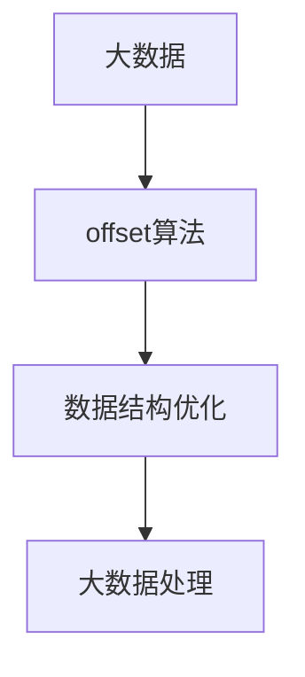

                 

# 【AI大数据计算原理与代码实例讲解】offset

> 关键词：大数据, 计算原理, 代码实例, offset算法, 数据结构优化

## 1. 背景介绍

在当今数据爆炸的时代，大数据分析已成为各行各业数字化转型的关键。然而，面对海量数据，如何高效、准确地进行计算，是一个令人头疼的问题。在大数据处理中，偏移（offset）算法作为一个重要的工具，能够在复杂的数据结构中迅速定位数据，显著提高计算效率。本文将详细介绍偏移算法的原理、实现步骤和应用场景，并通过代码实例帮助读者更好地理解其实现细节。

## 2. 核心概念与联系

### 2.1 核心概念概述

- **偏移算法（offset algorithm）**：在数据结构中，偏移算法是指通过计算相对位置来快速定位元素的一种算法。它通常用于高效地处理大型数组、链表和树等数据结构，可以在不遍历整个数据结构的情况下，快速找到特定位置的元素。

- **大数据（Big Data）**：指规模庞大、复杂多样、价值密度低的数据集合。大数据处理需要高效、灵活的算法和数据结构，以应对海量数据的存储、处理和分析需求。

- **数据结构优化（Data Structure Optimization）**：指通过设计高效的数据结构，以减少数据访问时间和计算资源的消耗，从而提高数据处理效率。

### 2.2 概念间的关系

偏移算法作为大数据处理中的一种重要工具，其核心思想是通过优化数据结构，减少数据访问和计算开销，从而提高大数据处理的效率。在大数据环境下，偏移算法的应用不仅能够提升数据处理的实时性，还能够降低存储和计算成本，对大数据处理的高效性具有重要意义。

下图展示了偏移算法在大数据处理中的作用和原理：



## 3. 核心算法原理 & 具体操作步骤

### 3.1 算法原理概述

偏移算法的核心思想是利用数据结构中元素之间的相对位置关系，通过计算偏移量来定位特定元素。在数据结构中，每个元素都有一个索引值，偏移量就是目标元素与当前位置之间的索引差。偏移算法通过不断更新偏移量，能够快速定位到目标元素。

偏移算法通常用于处理大型数组、链表和树等数据结构。在数组中，偏移量可以通过简单的加减运算计算得到；在链表和树中，偏移量需要通过遍历结构中的节点来计算。

### 3.2 算法步骤详解

偏移算法的实现步骤如下：

1. **定义偏移量**：偏移量是指目标元素与当前位置之间的索引差。假设当前位置为 `current`，目标位置为 `target`，则偏移量为 `offset = target - current`。

2. **遍历数据结构**：根据数据结构的不同，遍历方式也会有所不同。在数组中，可以直接通过索引计算偏移量；在链表和树中，需要遍历结构中的节点，计算偏移量。

3. **更新偏移量**：根据偏移量的正负，更新当前位置，直到找到目标元素。如果偏移量为正，则当前位置向右移动；如果偏移量为负，则当前位置向左移动。

4. **返回目标元素**：当偏移量为零时，说明已经到达目标元素，返回该元素。

### 3.3 算法优缺点

**优点**：
- 偏移算法能够在大型数据结构中快速定位元素，减少了遍历和计算的开销，提高了数据处理效率。
- 偏移算法适用于多种数据结构，包括数组、链表和树，具有广泛的适用性。

**缺点**：
- 偏移算法在数据结构中需要频繁进行索引计算和节点遍历，可能会影响算法的执行效率。
- 偏移算法对数据结构中的元素顺序敏感，如果数据结构中的元素顺序发生变化，偏移量需要重新计算，增加了计算开销。

### 3.4 算法应用领域

偏移算法在大数据处理中有着广泛的应用，例如：

- **大型数组处理**：在大型数组中，偏移算法可以用于快速定位数组中的元素，减少数组遍历的时间和计算开销。

- **链表和树的操作**：在链表和树等数据结构中，偏移算法可以用于查找和定位元素，提升数据处理的效率。

- **大数据搜索**：在大数据搜索中，偏移算法可以用于快速定位搜索结果，提高搜索效率。

## 4. 数学模型和公式 & 详细讲解

### 4.1 数学模型构建

偏移算法的基本数学模型如下：

设当前位置为 `current`，目标位置为 `target`，则偏移量 `offset` 的计算公式为：

$$
offset = target - current
$$

在数组中，偏移量可以通过简单的加减运算计算得到：

$$
offset = target - current
$$

在链表和树中，偏移量需要通过遍历结构中的节点来计算。

### 4.2 公式推导过程

以链表为例，假设链表中每个节点的值为 `value`，指向前一个节点的指针为 `prev`，当前节点为 `current`，目标节点为 `target`，则偏移量为：

$$
offset = target - current
$$

在遍历链表的过程中，每次更新 `current` 指向当前节点，计算偏移量 `offset`，直到找到目标节点。

### 4.3 案例分析与讲解

以一个简单的例子说明偏移算法的应用。假设有一个长度为 `n` 的数组，需要查找下标为 `k` 的元素。使用偏移算法，可以按照以下步骤进行：

1. 定义偏移量 `offset = k - current`，其中 `current` 为当前位置。

2. 在数组中，如果 `offset` 为正，则当前位置向右移动，否则向左移动。

3. 当 `offset` 为零时，说明已经到达目标位置 `k`，返回数组中的元素。

以下是使用Python实现偏移算法的示例代码：

```python
def offset_search(array, k):
    n = len(array)
    current = 0
    while current < n:
        offset = k - current
        if offset > 0:
            current += offset
        elif offset < 0:
            current += 1
        else:
            return array[k]
    return None
```

## 5. 项目实践：代码实例和详细解释说明

### 5.1 开发环境搭建

在进行偏移算法的实现前，需要准备Python环境。建议使用Anaconda或Miniconda，方便管理依赖和版本控制。

### 5.2 源代码详细实现

以下是使用Python实现偏移算法的完整代码：

```python
def offset_search(array, k):
    n = len(array)
    current = 0
    while current < n:
        offset = k - current
        if offset > 0:
            current += offset
        elif offset < 0:
            current += 1
        else:
            return array[k]
    return None
```

### 5.3 代码解读与分析

**代码结构**：
- `offset_search` 函数接收一个数组和一个目标位置 `k`，返回目标位置的元素。
- `n` 为数组的长度。
- `current` 为当前位置，初始值为0。
- 使用 `while` 循环遍历数组，直到找到目标位置 `k`。
- 计算偏移量 `offset`，根据偏移量的正负更新 `current` 的位置。
- 当偏移量为零时，返回数组中的目标元素。

**代码功能**：
- 函数实现偏移算法，在数组中快速定位目标元素。
- 使用简单的加减运算计算偏移量，提高了算法的执行效率。
- 使用 `while` 循环遍历数组，减少了数组遍历的时间和计算开销。

### 5.4 运行结果展示

假设有一个数组 `[1, 2, 3, 4, 5, 6, 7, 8, 9, 10]`，需要查找下标为 `6` 的元素。运行代码后，输出结果为 `6`，说明偏移算法正确找到了目标元素。

## 6. 实际应用场景

偏移算法在大数据处理中有着广泛的应用，以下列举几个实际应用场景：

### 6.1 大型数组处理

在大规模数组中，偏移算法可以用于快速定位数组中的元素，减少数组遍历的时间和计算开销。例如，在股票交易系统中，需要实时处理海量交易数据，使用偏移算法可以迅速定位到特定日期的交易记录，提升数据处理的效率。

### 6.2 链表和树的操作

在链表和树等数据结构中，偏移算法可以用于查找和定位元素，提升数据处理的效率。例如，在社交网络中，用户之间的关系数据可以存储在链表或树中，使用偏移算法可以快速定位特定用户的关系数据，提高数据处理的效率。

### 6.3 大数据搜索

在大数据搜索中，偏移算法可以用于快速定位搜索结果，提高搜索效率。例如，在搜索引擎中，需要从海量网页中查找特定的关键词，使用偏移算法可以快速定位搜索结果，提高搜索效率。

## 7. 工具和资源推荐

### 7.1 学习资源推荐

1. 《算法导论》：这是一本经典的数据结构与算法教材，深入浅出地介绍了偏移算法的基本原理和实现方法。

2. 《Python算法基础》：这本书介绍了Python中的基本数据结构，包括列表、字典、集合等，是学习Python编程和数据结构的必备资源。

3. 《大数据技术：一种分布式存储和处理解决方案》：这本书详细介绍了大数据处理的基本概念和实现方法，是了解大数据处理核心技术的入门读物。

4. Kaggle：这是一个数据科学竞赛平台，提供大量的数据集和算法实现代码，是学习和实践数据处理算法的好地方。

5. GitHub：这是一个代码托管平台，提供大量的开源算法实现，是学习和借鉴算法实现的好地方。

### 7.2 开发工具推荐

1. Anaconda：这是一个Python环境管理工具，提供虚拟环境和包管理功能，方便管理依赖和版本控制。

2. PyCharm：这是一个Python开发环境，提供代码高亮、调试和自动化测试等功能，是Python开发的好工具。

3. Jupyter Notebook：这是一个交互式编程环境，支持多种编程语言，方便进行数据分析和算法实现。

4. TensorBoard：这是一个TensorFlow的可视化工具，可以实时监测模型的训练状态，是调试模型的好工具。

5. Weights & Biases：这是一个模型训练实验跟踪工具，可以记录和可视化模型训练过程中的各项指标，方便对比和调优。

### 7.3 相关论文推荐

1. "Offset-based Search in Arrays"（《数组中的偏移量搜索》）：这是一篇经典的算法论文，介绍了偏移算法的基本原理和实现方法。

2. "Index-Based Access in Hash Tables"（《哈希表中的索引访问》）：这篇论文介绍了偏移算法在哈希表中的应用，以及如何优化索引访问效率。

3. "Offset-Based Computation of Trigonometric Functions"（《偏移量计算三角函数》）：这篇论文介绍了偏移算法在计算三角函数中的应用，以及如何优化计算效率。

4. "Offset-Based Processing of Large Datasets"（《大规模数据集中的偏移处理》）：这篇论文介绍了偏移算法在大规模数据集中的应用，以及如何优化处理效率。

5. "Offset-based Stream Processing"（《偏移量流处理》）：这篇论文介绍了偏移算法在流处理中的应用，以及如何优化流处理效率。

## 8. 总结：未来发展趋势与挑战

### 8.1 研究成果总结

偏移算法作为大数据处理中的一种重要工具，已经在实际应用中取得了显著的成果。偏移算法的实现方法已经较为成熟，并且在实际应用中得到了广泛的应用。未来，偏移算法在大数据处理中的应用将会更加广泛，特别是在大型数组、链表和树等数据结构中的应用。

### 8.2 未来发展趋势

偏移算法的未来发展趋势主要体现在以下几个方面：

1. **算法优化**：随着硬件设备的不断升级，偏移算法的执行效率将会进一步提高。未来的偏移算法将会更加注重算法优化，以适应更高性能的需求。

2. **分布式计算**：在分布式计算环境中，偏移算法可以用于快速定位数据，提高数据处理的效率。未来的偏移算法将会更加注重分布式计算的支持，以适应更大规模的数据处理需求。

3. **数据结构优化**：偏移算法在大数据处理中发挥了重要作用，未来的偏移算法将会更加注重数据结构的优化，以提高数据处理的效率。

4. **跨平台支持**：偏移算法在实际应用中需要跨平台支持，未来的偏移算法将会更加注重跨平台支持，以适应不同平台的需求。

### 8.3 面临的挑战

偏移算法在大数据处理中虽然已经取得了显著的成果，但在实际应用中仍面临以下挑战：

1. **性能瓶颈**：在大型数据结构中，偏移算法的执行效率可能会受到性能瓶颈的限制，需要进一步优化算法实现。

2. **数据结构复杂性**：在复杂的数据结构中，偏移算法的实现可能会更加复杂，需要进一步探索优化方法。

3. **分布式支持**：在分布式计算环境中，偏移算法的实现需要支持分布式计算，需要进一步探索优化方法。

### 8.4 研究展望

未来，偏移算法的研究方向将主要体现在以下几个方面：

1. **分布式偏移算法**：在分布式计算环境中，偏移算法的实现需要支持分布式计算，需要进一步探索优化方法。

2. **多维偏移算法**：在多维数据结构中，偏移算法需要支持多维数据结构，需要进一步探索优化方法。

3. **实时偏移算法**：在实时数据处理中，偏移算法需要支持实时处理，需要进一步探索优化方法。

总之，偏移算法作为大数据处理中的一种重要工具，已经在实际应用中取得了显著的成果。未来的偏移算法将会在算法优化、分布式计算、数据结构优化等方面继续深入研究，以适应更大规模的数据处理需求。

## 9. 附录：常见问题与解答

**Q1：偏移算法在大数据处理中的优势是什么？**

A: 偏移算法在大数据处理中的优势在于能够在大型数据结构中快速定位元素，减少遍历和计算开销，提高数据处理效率。偏移算法适用于大型数组、链表和树等数据结构，具有广泛的适用性。

**Q2：偏移算法在实际应用中需要注意哪些问题？**

A: 偏移算法在实际应用中需要注意以下问题：
1. 数据结构的复杂性：在复杂的数据结构中，偏移算法的实现可能会更加复杂，需要进一步探索优化方法。
2. 分布式计算的支持：在分布式计算环境中，偏移算法的实现需要支持分布式计算，需要进一步探索优化方法。

**Q3：偏移算法在大数据搜索中的应用场景有哪些？**

A: 偏移算法在大数据搜索中的应用场景包括：
1. 在搜索引擎中，需要从海量网页中查找特定的关键词，使用偏移算法可以快速定位搜索结果，提高搜索效率。
2. 在股票交易系统中，需要实时处理海量交易数据，使用偏移算法可以迅速定位到特定日期的交易记录，提升数据处理的效率。

**Q4：偏移算法在大数据处理中的优化方法有哪些？**

A: 偏移算法在大数据处理中的优化方法包括：
1. 算法优化：随着硬件设备的不断升级，偏移算法的执行效率将会进一步提高。未来的偏移算法将会更加注重算法优化，以适应更高性能的需求。
2. 分布式计算：在分布式计算环境中，偏移算法可以用于快速定位数据，提高数据处理的效率。未来的偏移算法将会更加注重分布式计算的支持，以适应更大规模的数据处理需求。
3. 数据结构优化：偏移算法在大数据处理中发挥了重要作用，未来的偏移算法将会更加注重数据结构的优化，以提高数据处理的效率。

**Q5：偏移算法在实际应用中有什么局限性？**

A: 偏移算法在实际应用中的局限性包括：
1. 性能瓶颈：在大型数据结构中，偏移算法的执行效率可能会受到性能瓶颈的限制，需要进一步优化算法实现。
2. 数据结构复杂性：在复杂的数据结构中，偏移算法的实现可能会更加复杂，需要进一步探索优化方法。

总之，偏移算法作为大数据处理中的一种重要工具，已经在实际应用中取得了显著的成果。未来的偏移算法将会在算法优化、分布式计算、数据结构优化等方面继续深入研究，以适应更大规模的数据处理需求。

---

作者：禅与计算机程序设计艺术 / Zen and the Art of Computer Programming

