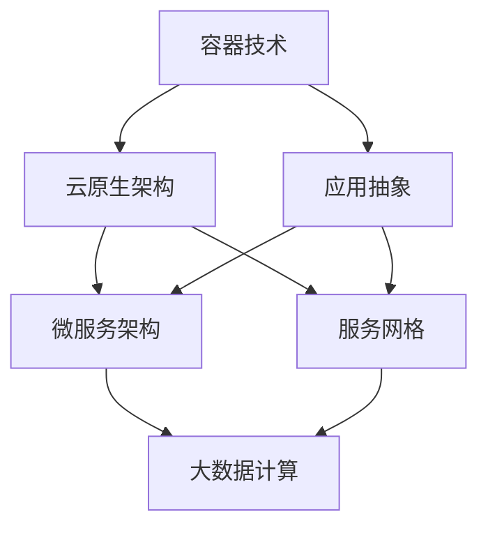
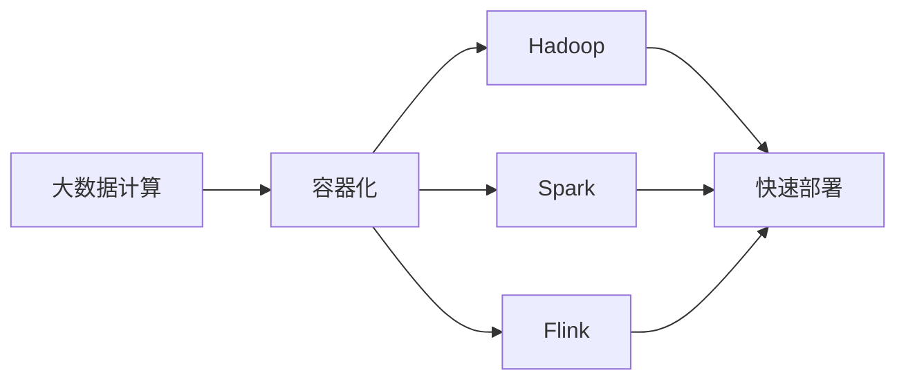
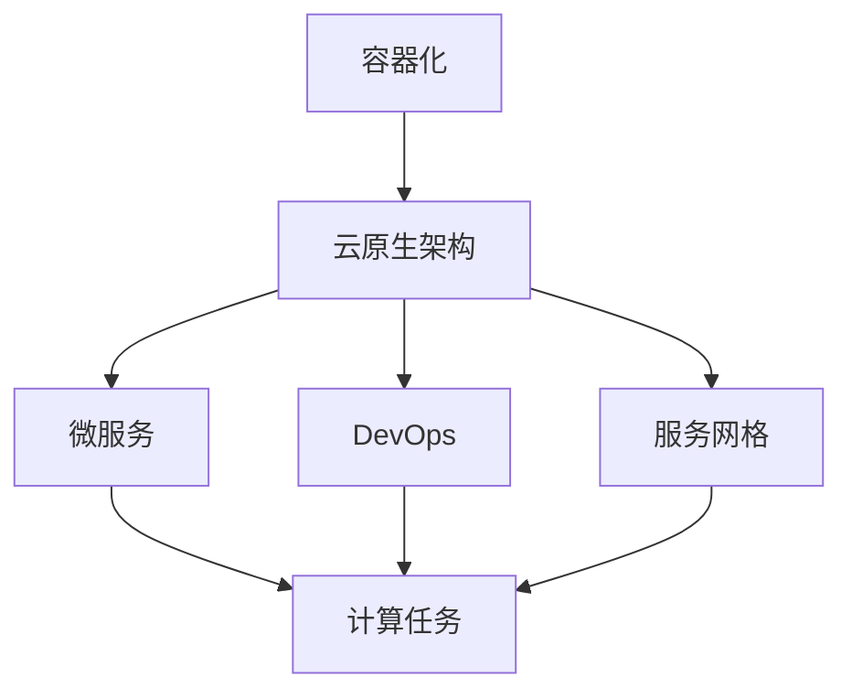
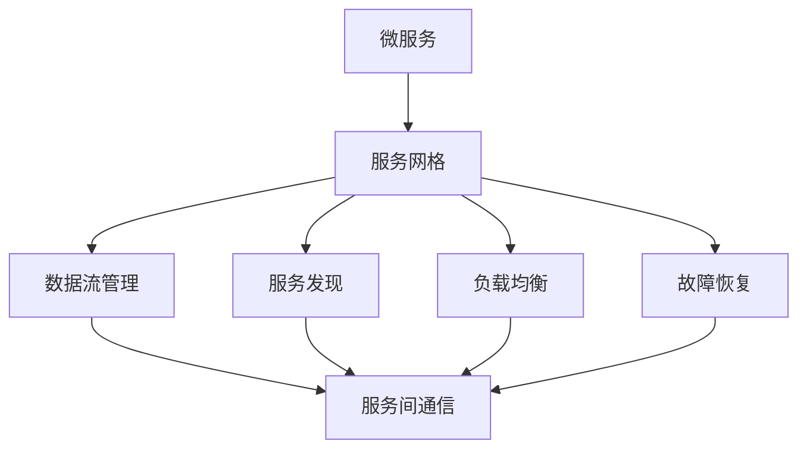
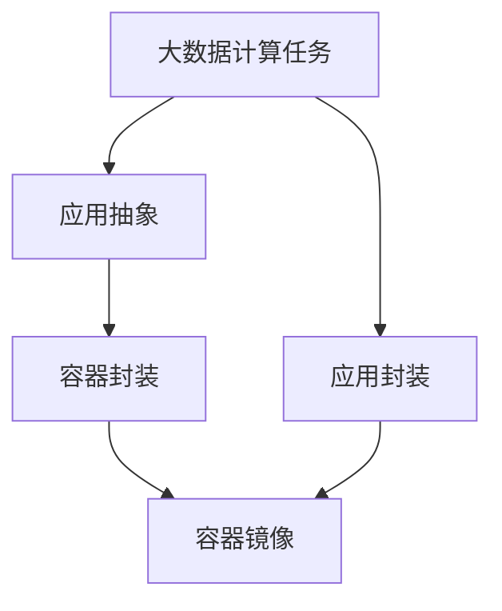
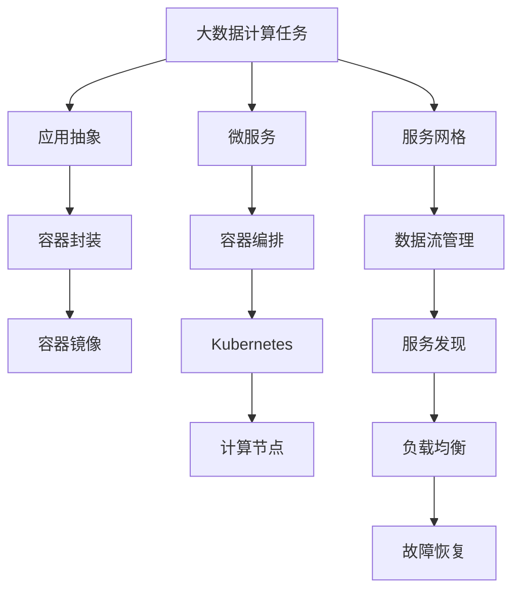

                 

# 【AI大数据计算原理与代码实例讲解】容器

> 关键词：容器技术, 云原生架构, 微服务, Kubernetes, Docker, 服务网格, 应用抽象, 分布式计算, 弹性伸缩, DevOps

## 1. 背景介绍

### 1.1 问题由来
容器技术作为现代云原生架构的重要组成部分，正在迅速渗透到各行各业。无论是互联网公司，还是传统企业，都需要借助容器化技术提升应用的可移植性、可扩展性和管理效率。容器技术的本质是通过操作系统级别的抽象，将应用程序及其依赖打包在一个独立的运行环境里，提供一种轻量级的、隔离的、易于部署和管理的计算环境。容器化不仅极大简化了部署和运维流程，还为云计算和大数据时代的分布式计算带来了革命性的变化。

然而，容器化技术并不是一个独立存在，而是与大数据计算紧密相连。大数据计算的复杂性和多样性，使得容器化在实践应用中面临诸多挑战。如何在大数据计算场景下高效地应用容器技术，成为业界关注的重点。本文将从容器化技术的原理出发，详细介绍其在大型分布式大数据计算中的应用，并通过具体代码实例，展示容器化技术在大数据计算场景中的实战应用。

### 1.2 问题核心关键点
大容器技术在大数据计算中的应用主要涉及以下几个关键点：
- **容器化技术**：通过将大数据计算的各个组件（如Hadoop、Spark、Flink等）容器化，实现应用的快速部署和弹性伸缩。
- **云原生架构**：通过容器编排工具（如Kubernetes）实现容器编排和管理，支持大规模、分布式的计算任务。
- **微服务架构**：将大数据计算任务拆解成多个小服务，每个服务独立运行，提高系统的可扩展性和可维护性。
- **服务网格**：通过在服务网格中管理数据流，实现服务间的通信和故障恢复，提升系统的可靠性和可用性。
- **应用抽象与封装**：通过抽象和封装，将复杂的大数据计算任务封装在容器里，简化管理，降低复杂度。

这些关键点共同构成了容器化技术在大数据计算中的核心应用框架，使得传统大数据计算任务能够平滑地迁移到容器化环境中，实现更高效、更灵活的部署和运维。

### 1.3 问题研究意义
研究容器化技术在大数据计算中的应用，对于推动大数据技术的发展，加速大数据产业的数字化转型，具有重要意义：
- **提升计算效率**：通过容器化技术，大数据计算任务的部署和扩展效率大大提高，能够更快速响应业务需求。
- **降低运维成本**：容器化技术简化了大数据计算任务的管理和维护，减少了人力投入和运维成本。
- **增强系统的可扩展性**：通过微服务和云原生架构，大数据计算任务能够轻松地进行水平扩展，支持更大规模的数据处理需求。
- **促进技术创新**：容器化技术为大数据计算带来了新的应用场景和架构模式，激发了更多的技术创新和业务创新。
- **推动产业升级**：容器化技术帮助传统企业构建更加灵活、高效、安全的大数据处理系统，加速数字化转型进程。

## 2. 核心概念与联系

### 2.1 核心概念概述

为了更好地理解容器化技术在大数据计算中的应用，本节将介绍几个密切相关的核心概念：

- **容器技术**：通过操作系统级别的抽象，将应用程序及其依赖打包在一个独立的运行环境里，提供一种轻量级的、隔离的、易于部署和管理的计算环境。
- **云原生架构**：基于容器化技术构建的应用架构，通过微服务、DevOps、服务网格等技术，支持大规模、分布式的计算任务。
- **微服务架构**：将一个大型的计算任务拆解成多个小服务，每个服务独立运行，提高系统的可扩展性和可维护性。
- **服务网格**：通过在服务网格中管理数据流，实现服务间的通信和故障恢复，提升系统的可靠性和可用性。
- **应用抽象与封装**：通过抽象和封装，将复杂的大数据计算任务封装在容器里，简化管理，降低复杂度。

这些核心概念之间的逻辑关系可以通过以下Mermaid流程图来展示：



这个流程图展示了容器化技术、云原生架构、微服务架构、服务网格和应用抽象在大数据计算中的应用和联系：

1. 容器技术通过将大数据计算的各个组件（如Hadoop、Spark、Flink等）容器化，实现应用的快速部署和弹性伸缩。
2. 云原生架构通过微服务、DevOps、服务网格等技术，支持大规模、分布式的计算任务。
3. 微服务架构将大数据计算任务拆解成多个小服务，每个服务独立运行，提高系统的可扩展性和可维护性。
4. 服务网格通过在服务网格中管理数据流，实现服务间的通信和故障恢复，提升系统的可靠性和可用性。
5. 应用抽象与封装通过抽象和封装，将复杂的大数据计算任务封装在容器里，简化管理，降低复杂度。

### 2.2 概念间的关系

这些核心概念之间存在着紧密的联系，形成了容器化技术在大数据计算中的应用生态系统。下面我通过几个Mermaid流程图来展示这些概念之间的关系。

#### 2.2.1 容器化技术的应用



这个流程图展示了容器化技术在大数据计算中的应用：

1. 大数据计算任务的各个组件（如Hadoop、Spark、Flink等）被容器化后，能够快速部署和扩展。
2. 容器化后的Hadoop、Spark、Flink等组件，可以快速地部署到不同的环境中，支持多种计算模式。

#### 2.2.2 云原生架构的应用



这个流程图展示了云原生架构在大数据计算中的应用：

1. 容器化技术结合微服务、DevOps、服务网格等技术，支持大规模、分布式的计算任务。
2. 微服务架构将大数据计算任务拆解成多个小服务，每个服务独立运行，提高系统的可扩展性和可维护性。
3. DevOps技术帮助开发、运维和测试团队协同工作，提升系统的交付效率。
4. 服务网格通过管理数据流，实现服务间的通信和故障恢复，提升系统的可靠性和可用性。

#### 2.2.3 服务网格的应用



这个流程图展示了服务网格在大数据计算中的应用：

1. 微服务架构将大数据计算任务拆解成多个小服务，每个服务独立运行。
2. 服务网格通过管理数据流，实现服务间的通信和故障恢复，提升系统的可靠性和可用性。
3. 服务网格提供服务发现、负载均衡和故障恢复等功能，帮助服务间的相互通信和容错处理。

#### 2.2.4 应用抽象与封装



这个流程图展示了应用抽象与封装在大数据计算中的应用：

1. 将复杂的大数据计算任务封装在容器里，简化管理，降低复杂度。
2. 容器封装通过操作系统级别的抽象，提供一种轻量级的、隔离的、易于部署和管理的计算环境。
3. 应用封装通过抽象和封装，将大数据计算任务封装在容器里，便于管理和扩展。

### 2.3 核心概念的整体架构

最后，我们用一个综合的流程图来展示这些核心概念在大数据计算中的应用：



这个综合流程图展示了从大数据计算任务到服务网格的整个应用过程：

1. 大数据计算任务首先经过应用抽象与封装，将任务封装在容器里。
2. 容器镜像通过容器编排工具（如Kubernetes）部署到计算节点上。
3. 微服务架构将大数据计算任务拆解成多个小服务，每个服务独立运行。
4. 服务网格通过管理数据流，实现服务间的通信和故障恢复，提升系统的可靠性和可用性。

通过这些流程图，我们可以更清晰地理解容器化技术在大数据计算中的应用过程和关键环节，为后续深入讨论具体的微调方法和技术奠定基础。

## 3. 核心算法原理 & 具体操作步骤
### 3.1 算法原理概述

容器化技术在大数据计算中的应用，主要依赖于容器编排工具（如Kubernetes）和微服务架构。其核心思想是：将大数据计算任务拆解成多个小服务，每个服务独立运行，通过容器编排工具进行管理和调度，支持大规模、分布式的计算任务。

形式化地，假设大数据计算任务分为N个微服务，每个微服务M_i由多个容器C_i,j组成，其中j表示容器的编号。在Kubernetes集群中，每个微服务M_i部署在多个计算节点N_i上，形成一个服务网格。整个计算任务的服务架构可以表示为：

$$
\mathcal{S} = \{ M_1, M_2, \ldots, M_N \}
$$

其中，每个微服务M_i的容器C_i,j表示为：

$$
C_i,j = (M_i, \{ C_{i,j} \}, N_i)
$$

表示微服务M_i中的第j个容器，运行在计算节点N_i上。

通过容器编排工具，可以对这些微服务和容器进行灵活调度和管理。例如，在计算任务负载增加时，Kubernetes会自动扩展微服务的容器数量，实现弹性的计算资源分配。在计算任务负载减少时，Kubernetes会自动缩减容器数量，减少计算资源的浪费。

### 3.2 算法步骤详解

容器化技术在大数据计算中的应用，主要包括以下几个关键步骤：

**Step 1: 应用拆解与封装**

首先，将大数据计算任务拆解成多个微服务。例如，一个大数据ETL任务可以分为数据采集、数据清洗、数据转换、数据存储等多个子任务。每个子任务独立运行，通过服务化的方式封装在容器中。

```python
from flask import Flask, request, jsonify

app = Flask(__name__)

@app.route('/data', methods=['POST'])
def process_data():
    data = request.json['data']
    # 数据处理代码
    return jsonify({'result': 'success'})
```

**Step 2: 容器编排**

将微服务部署在Kubernetes集群上，通过容器编排工具进行管理和调度。例如，使用YAML文件定义微服务的容器配置，包括容器镜像、资源限制、环境变量等。

```yaml
apiVersion: v1
kind: Pod
metadata:
  name: data-processing
spec:
  containers:
  - name: data-processing
    image: my-data-processing-image
    resources:
      requests:
        cpu: 1
        memory: 1Gi
      limits:
        cpu: 2
        memory: 2Gi
    env:
      - name: MY_ENV_VAR
        value: my-value
```

**Step 3: 服务发现与负载均衡**

通过服务网格（如Istio）进行服务发现和负载均衡。例如，使用Istio定义虚拟服务（Virtual Service）和路由规则，实现流量分发和服务发现。

```yaml
apiVersion: networking.istio.io/v1alpha3
kind: VirtualService
metadata:
  name: data-processing
spec:
  hosts:
  - "*"
  http:
  - route:
    - destination:
        host: data-processing
        port:
          number: 8080
```

**Step 4: 容器编排**

使用Kubernetes进行容器的编排和调度。例如，使用Kubernetes定义Deployment和Service，实现容器的自动部署和负载均衡。

```yaml
apiVersion: v1
kind: Deployment
metadata:
  name: data-processing
spec:
  replicas: 3
  selector:
    matchLabels:
      app: data-processing
  template:
    metadata:
      labels:
        app: data-processing
    spec:
      containers:
      - name: data-processing
        image: my-data-processing-image
        ports:
        - containerPort: 8080

apiVersion: v1
kind: Service
metadata:
  name: data-processing
spec:
  selector:
    app: data-processing
  ports:
  - protocol: TCP
    port: 8080
    targetPort: 8080
```

通过上述步骤，我们将大数据计算任务拆解成多个微服务，每个微服务通过容器封装，部署在Kubernetes集群上，并通过服务网格进行管理和调度，实现了高效、灵活的计算任务部署和调度。

### 3.3 算法优缺点

容器化技术在大数据计算中的应用，具有以下优点：

- **高效部署与扩展**：通过微服务和容器编排技术，大数据计算任务可以高效地部署和扩展，支持大规模、分布式的计算任务。
- **灵活管理**：通过容器编排工具，可以对微服务和容器进行灵活调度和管理，支持动态伸缩和资源优化。
- **降低复杂度**：通过应用抽象与封装，将复杂的大数据计算任务封装在容器里，简化管理，降低复杂度。
- **提高可靠性**：通过服务网格管理数据流，实现服务间的通信和故障恢复，提升系统的可靠性和可用性。

同时，容器化技术在大数据计算中的应用，也存在一些缺点：

- **学习曲线陡峭**：容器编排工具如Kubernetes和微服务架构需要一定的学习成本，初期的实施和部署可能比较复杂。
- **资源消耗较大**：容器化后的应用程序通常比原生应用程序占用更多的资源，如CPU和内存。
- **网络通信复杂**：服务网格需要额外的网络通信开销，可能影响系统的性能和响应速度。
- **安全性问题**：容器化环境的安全性管理相对复杂，需要额外的安全措施和防护策略。

尽管存在这些缺点，但容器化技术仍然是大数据计算的重要范式，能够显著提升计算任务的管理效率和部署灵活性。

### 3.4 算法应用领域

容器化技术在大数据计算中的应用，已经广泛应用于以下领域：

- **大数据ETL**：通过容器编排技术，实现大数据ETL任务的灵活部署和扩展。
- **数据仓库**：将数据仓库的任务封装在容器中，通过微服务和容器编排技术进行管理和调度。
- **数据湖**：构建数据湖平台，通过容器化技术实现数据的快速存储和处理。
- **机器学习**：将机器学习模型的训练和推理任务封装在容器中，通过微服务和容器编排技术进行管理和调度。
- **数据可视化**：将数据可视化的任务封装在容器中，通过微服务和容器编排技术进行管理和调度。

除了上述这些领域，容器化技术在大数据计算中的应用还在不断拓展，为更多领域提供高效、灵活的计算解决方案。

## 4. 数学模型和公式 & 详细讲解  
### 4.1 数学模型构建

在大数据计算中，容器化技术的应用主要依赖于微服务和容器编排工具。其数学模型构建可以抽象为一个图模型，其中每个微服务表示为一个节点，节点之间的连线表示服务间的通信关系。

假设大数据计算任务分为N个微服务，每个微服务M_i由多个容器C_i,j组成，其中j表示容器的编号。在Kubernetes集群中，每个微服务M_i部署在多个计算节点N_i上，形成一个服务网格。整个计算任务的服务架构可以表示为一个图G(V,E)，其中：

- V={M_1, M_2, ..., M_N} 表示微服务集合。
- E={(M_i, M_j)|i,j=1,...,N} 表示微服务之间的通信关系。

在数学上，微服务之间的通信关系可以用邻接矩阵A表示，其中A_ij=1表示微服务M_i和M_j之间存在通信关系，否则为0。因此，微服务之间的通信关系可以表示为一个对称的邻接矩阵A，其中A_i,i=0表示微服务自身不进行通信。

### 4.2 公式推导过程

在大数据计算中，容器编排工具通过调度算法对微服务和容器进行调度。常见的调度算法包括随机调度、优先级调度、负载均衡调度等。这里，我们以负载均衡调度为例，推导其数学模型。

假设微服务M_i的负载为L_i，Kubernetes集群中计算节点的数量为N，每个计算节点的计算能力为C。负载均衡调度的目标是最小化微服务的负载偏差，即：

$$
\min \sum_{i=1}^N |L_i - C|^2
$$

其中，|L_i - C|表示微服务M_i的负载与计算节点计算能力之间的偏差。

通过K-means聚类算法，可以将微服务的负载偏差最小化，实现负载均衡。具体步骤如下：

1. 初始化N个计算节点，每个节点的计算能力为C。
2. 将微服务M_i随机分配到一个计算节点N_i上。
3. 计算每个计算节点N_i上的负载偏差L_i=L_i-1 + L_i+1，其中L_i-1和L_i+1分别表示节点N_i的上一个和下一个节点的负载。
4. 将计算节点N_i上的负载偏差最小化，即：
   $$
   \min_{N_i} \sum_{j=1}^N |L_j - C|^2
   $$
   其中，L_j表示计算节点N_j的负载。
5. 重复步骤3和4，直到所有微服务的负载偏差最小化。

通过上述步骤，可以实现大数据计算任务在大规模、分布式环境中的高效部署和扩展。

### 4.3 案例分析与讲解

以一个实际的大数据计算任务为例，展示容器化技术在大数据计算中的应用。假设有一个大数据ETL任务，需要将数据从不同的来源采集、清洗、转换，最终存储到数据仓库中。我们将该任务拆解成三个微服务，分别是数据采集、数据清洗和数据转换，每个微服务独立运行，通过容器封装，部署在Kubernetes集群上。

1. **数据采集微服务**：负责从不同的数据源采集数据，封装在Docker容器中。通过Kubernetes的Deployment和Service定义容器配置和负载均衡规则。
2. **数据清洗微服务**：负责对采集的数据进行清洗和预处理，封装在Docker容器中。通过Kubernetes的Deployment和Service定义容器配置和负载均衡规则。
3. **数据转换微服务**：负责对清洗后的数据进行转换和转换，封装在Docker容器中。通过Kubernetes的Deployment和Service定义容器配置和负载均衡规则。

通过容器编排工具和微服务架构，可以将大数据ETL任务高效地部署和扩展，支持大规模、分布式的计算任务。

## 5. 项目实践：代码实例和详细解释说明
### 5.1 开发环境搭建

在进行容器化实践前，我们需要准备好开发环境。以下是使用Kubernetes和Docker进行部署的环境配置流程：

1. 安装Kubernetes集群：从官方文档下载和安装Kubernetes集群，包括Master和多个Node节点。
2. 安装Docker：从官方文档下载和安装Docker。
3. 配置Kubernetes和Docker环境变量：设置Kubernetes和Docker的配置文件和环境变量，以确保其正常工作。
4. 创建和管理Kubernetes命名空间：使用Kubectl命令创建和管理Kubernetes命名空间，用于隔离不同的应用。

完成上述步骤后，即可在Kubernetes集群中进行微服务部署和容器编排。

### 5.2 源代码详细实现

这里以一个简单的Web服务为例，展示Docker和Kubernetes的容器化实践。

首先，创建一个Docker镜像：

```docker
FROM python:3.8-slim
WORKDIR /app
COPY . /app
RUN pip install flask
```

然后，编写Flask应用程序代码：

```python
from flask import Flask, request, jsonify

app = Flask(__name__)

@app.route('/data', methods=['POST'])
def process_data():
    data = request.json['data']
    # 数据处理代码
    return jsonify({'result': 'success'})
```

接着，构建Docker镜像并上传到Docker Hub：

```bash
docker build -t my-data-processing-image .
docker push my-data-processing-image
```

然后，在Kubernetes集群中创建Deployment和Service：

```yaml
apiVersion: v1
kind: Deployment
metadata:
  name: data-processing
spec:
  replicas: 3
  selector:
    matchLabels:
      app: data-processing
  template:
    metadata:
      labels:
        app: data-processing
    spec:
      containers:
      - name: data-processing
        image: my-data-processing-image
        ports:
        - containerPort: 8080

apiVersion: v1
kind: Service
metadata:
  name: data-processing
spec:
  selector:
    app: data-processing
  ports:
  - protocol: TCP
    port: 8080
    targetPort: 8080
```

最后，使用Kubectl命令部署Docker镜像：

```bash
kubectl apply -f deployment.yaml
kubectl apply -f service.yaml
```

通过上述步骤，我们已经将Flask应用程序容器化，并在Kubernetes集群中进行了部署和负载均衡。

### 5.3 代码解读与分析

让我们再详细解读一下关键代码的实现细节：

**Dockerfile代码**：
- `FROM python:3.8-slim`：指定基础镜像为Python 3.8的轻量级镜像。
- `WORKDIR /app`：设置工作目录为`/app`。
- `COPY . /app`：将当前目录下的代码复制到容器中。
- `RUN pip install flask`：在容器中安装Flask依赖。

**Flask应用程序代码**：
- `@app.route('/data', methods=['POST'])`：定义HTTP POST请求的处理函数。
- `data = request.json['data']`：从请求中获取JSON数据。
- `# 数据处理代码`：处理数据。
- `return jsonify({'result': 'success'})`：返回JSON格式的响应结果。

**Kubernetes配置文件**：
- `kind: Deployment`：定义Deployment配置。
- `replicas: 3`：指定Deployment的副本数。
- `selector`：定义标签选择器。
- `template`：定义Pod模板。
- `kind: Service`：定义Service配置。
- `selector`：定义标签选择器。
- `ports`：定义Service的端口。

**Kubectl命令**：
- `kubectl apply -f deployment.yaml`：部署Deployment配置。
- `kubectl apply -f service.yaml`：部署Service配置。

通过上述代码和配置，我们已经将Flask应用程序容器化，并在Kubernetes集群中进行了部署和负载均衡。

### 5.4 运行结果展示

在成功部署后，可以使用Kubectl命令查看容器状态和Service状态：

```bash
kubectl get pods
kubectl get svc
```

可以看到，容器已经被成功部署，并且通过Service对外暴露了端口。

## 6. 实际应用场景
### 6.1 智能数据湖

基于容器化技术的大数据计算，可以构建智能数据湖平台，实现数据的高效存储和处理。智能数据湖平台不仅支持大规模、分布式的计算任务，还具备自动化数据管理、数据治理和数据服务能力。通过容器化技术，智能数据湖平台可以实现更高效、更灵活的数据处理和数据服务，满足企业对大数据应用的需求。

### 6.2 大数据ETL

容器化技术在大数据ETL任务中的应用，可以大大提升数据采集、数据清洗和数据转换的效率。通过微服务和容器编排技术，大数据ETL任务可以灵活地部署和扩展，支持大规模、分布式的计算任务。

### 6.3 数据可视化

容器化技术在大数据可视化任务中的应用，可以实现数据可视化的快速部署和扩展。通过微服务和容器编排技术，数据可视化任务可以灵活地进行管理和调度，支持大规模、分布式的计算任务。

### 6.4 未来应用展望

随着容器化技术的不断发展，其在大数据计算中的应用将越来越广泛。未来，容器化技术将与其他先进技术进行更深入的融合，如云原生架构、微服务架构、服务网格等，为大数据计算带来更多的创新和突破。

## 7. 工具和资源推荐
### 7.1 学习资源推荐

为了帮助开发者系统掌握容器化技术在大数据计算中的应用，这里推荐一些优质的学习资源：

1. **Kubernetes官方文档**：Kubernetes官方文档是学习Kubernetes的基础，提供了详细的配置和部署指南。
2. **Docker官方文档**：Docker官方文档是学习Docker的基础，提供了详细的配置和部署指南。
3. **Flask官方文档**：Flask官方文档是学习Flask的基础，

