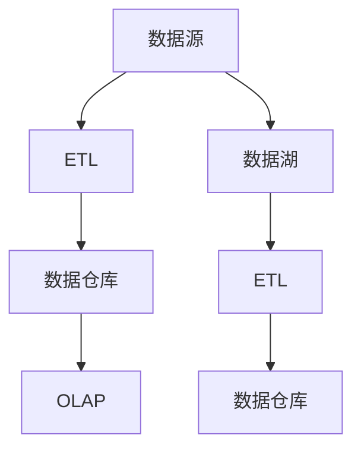

                 

# 【AI大数据计算原理与代码实例讲解】数据仓库

## 1. 背景介绍

数据仓库作为大数据时代的重要基础设施，承载着企业级数据存储、分析和应用的关键角色。它通过集成多个异构数据源，形成一个统一、稳定、易于访问的数据环境，为数据驱动的业务决策提供了坚实的基础。数据仓库技术在金融、零售、互联网、医疗等众多行业的应用，已经展现出了巨大的价值和潜力。

本文将系统介绍数据仓库的核心原理与实现方式，并通过代码实例详细讲解数据仓库的构建与优化，帮助读者深入理解数据仓库的精髓，掌握实际应用中的关键技术。

## 2. 核心概念与联系

### 2.1 核心概念概述

1. **数据仓库**：是一种集中存储、管理和分析大规模数据的系统，通常用于支持企业级决策支持和商业智能(BI)应用。数据仓库通过集成多个异构数据源，形成一个统一、稳定、易于访问的数据环境，为数据驱动的业务决策提供了坚实的基础。

2. **ETL（Extract, Transform, Load）**：数据仓库构建的核心过程，包括数据抽取、转换和加载三个步骤。ETL流程将数据源中的数据提取出来，转换成符合数据仓库结构的标准格式，并加载到目标数据仓库中。

3. **数据湖**：与数据仓库不同，数据湖是一个全量存储的数据平台，不进行数据的预处理和建模，能够保存原始数据的完整性。数据湖通常用于大数据的探索性分析和实验。

4. **OLTP（Online Transaction Processing）**：在线事务处理系统，用于处理企业日常业务中的高频、高并发的数据操作，如订单处理、库存管理等。

5. **OLAP（Online Analytical Processing）**：在线分析处理系统，用于处理企业级的数据分析与报告，支持复杂的查询和报表生成，如数据仓库中的多维分析、统计汇总等。

这些核心概念构成了数据仓库的完整体系，它们之间的关系可以用以下Mermaid流程图来表示：



### 2.2 概念间的关系

从上述图中可以看出，数据仓库与数据湖、ETL、OLTP和OLAP之间的关系如下：

- **数据源**：是数据仓库的数据来源，通常包括关系型数据库、NoSQL数据库、文件系统、Web日志等。
- **ETL**：是数据仓库构建的核心过程，负责数据的抽取、转换和加载。
- **数据仓库**：是数据的存储和管理环境，支持OLAP系统进行复杂的数据分析与报告。
- **数据湖**：是一个全量存储的数据平台，不进行数据的预处理和建模。
- **OLAP**：是在数据仓库上进行的高级分析，支持复杂的查询和报表生成。

这些概念共同构成了数据仓库的基本框架，每个部分都有其独特的功能和优势，它们协同工作，实现了数据的集成、存储、分析和应用。

## 3. 核心算法原理 & 具体操作步骤

### 3.1 算法原理概述

数据仓库的构建涉及多个核心算法和技术，包括数据抽取、数据转换、数据加载等。下面将分别介绍这些算法的原理和操作步骤。

#### 3.1.1 数据抽取（Extract）

数据抽取是从数据源中提取数据的第一步，通常使用ETL工具实现。抽取算法根据数据源的类型（如关系型数据库、NoSQL数据库、文件系统等），设计相应的数据提取方式。以关系型数据库为例，常用的数据抽取算法包括：

- **批量抽取**：在规定的时间点，一次性从数据源中抽取所有数据。
- **增量抽取**：只抽取数据源中发生变化的数据，以减少数据量和传输成本。

#### 3.1.2 数据转换（Transform）

数据转换是将抽取到的数据转换成符合数据仓库结构的标准格式。转换算法通常包括数据清洗、数据去重、数据转换等步骤。以数据清洗为例，常用的数据清洗算法包括：

- **去重算法**：去除数据中的重复记录，确保数据的一致性。
- **数据格式转换**：将不同格式的数据转换成统一的标准格式，如将日期格式从`yyyy-MM-dd`转换成`yyyy-MM-dd HH:mm:ss`。

#### 3.1.3 数据加载（Load）

数据加载是将转换后的数据加载到目标数据仓库的过程。加载算法通常使用并行加载、增量加载等方式，以提高加载效率。以并行加载为例，常用的并行加载算法包括：

- **多线程加载**：使用多个线程同时加载数据，提高加载速度。
- **分布式加载**：使用分布式计算框架（如Apache Hadoop），将数据加载任务分布到多个节点上并行执行。

### 3.2 算法步骤详解

#### 3.2.1 数据抽取

```python
# 假设数据源是MySQL数据库
import mysql.connector

# 建立数据库连接
cnx = mysql.connector.connect(user='username', password='password',
                              host='host', database='database')
cursor = cnx.cursor()

# 定义SQL查询语句
sql = "SELECT * FROM table"

# 执行查询
cursor.execute(sql)

# 获取查询结果
data = cursor.fetchall()

# 关闭数据库连接
cursor.close()
cnx.close()

# 将数据转换成符合数据仓库结构的标准格式
# 这里可以使用Python内置的pandas库进行数据处理
import pandas as pd

data_df = pd.DataFrame(data, columns=['column1', 'column2', 'column3'])
```

#### 3.2.2 数据转换

```python
# 假设需要进行数据清洗和格式转换
# 去除重复记录
data_df.drop_duplicates(inplace=True)

# 数据格式转换
data_df['date'] = pd.to_datetime(data_df['date'], format='%Y-%m-%d')
```

#### 3.2.3 数据加载

```python
# 假设数据仓库是Apache Hive
from pyspark.sql import SparkSession

# 建立SparkSession
spark = SparkSession.builder.appName('data_load').getOrCreate()

# 创建DataFrame
df = spark.createDataFrame(data_df, ['column1', 'column2', 'column3'])

# 将DataFrame写入Hive表中
df.write.format('parquet').saveAsTable('hive_table')
```

### 3.3 算法优缺点

数据仓库构建过程中的主要算法和技术各有优缺点，具体如下：

- **数据抽取**：
  - 优点：批量抽取可确保数据完整性，增量抽取可减少数据量和传输成本。
  - 缺点：可能会受到数据源的限制，某些数据源可能不支持增量抽取。

- **数据转换**：
  - 优点：能够清洗和格式化数据，确保数据的一致性和可用性。
  - 缺点：转换过程可能会增加数据处理的时间成本。

- **数据加载**：
  - 优点：并行加载和分布式加载可以显著提高加载效率。
  - 缺点：分布式加载需要额外的计算资源和网络带宽。

### 3.4 算法应用领域

数据仓库技术广泛应用于企业级数据管理和分析，包括但不限于以下领域：

- **金融行业**：用于监控交易数据、分析风险、优化投资策略等。
- **零售行业**：用于分析客户行为、优化供应链、提升营销效果等。
- **医疗行业**：用于管理患者数据、分析治疗效果、优化医疗资源分配等。
- **互联网行业**：用于分析用户行为、优化推荐系统、提高用户体验等。

## 4. 数学模型和公式 & 详细讲解  
### 4.1 数学模型构建

数据仓库构建的数学模型通常包括数据抽取模型、数据转换模型和数据加载模型。这里以数据抽取模型为例，介绍其数学模型构建。

假设数据源为关系型数据库，其表结构为：

```sql
CREATE TABLE source_table (
    id INT PRIMARY KEY,
    name VARCHAR(50),
    age INT,
    gender VARCHAR(10),
    date DATE
);
```

抽取模型的数学表达式为：

$$
\mathcal{F}(id, name, age, gender, date) = (id, name, age, gender, date)
$$

其中，$\mathcal{F}$ 表示数据抽取模型，$(id, name, age, gender, date)$ 表示抽取后的数据列。

### 4.2 公式推导过程

数据抽取的过程可以表示为以下步骤：

1. **建立数据库连接**：
   $$
   cnx = mysql.connector.connect(user='username', password='password',
                              host='host', database='database')
   $$

2. **执行SQL查询**：
   $$
   cursor.execute(sql)
   $$

3. **获取查询结果**：
   $$
   data = cursor.fetchall()
   $$

4. **关闭数据库连接**：
   $$
   cursor.close()
   $$

5. **转换成DataFrame**：
   $$
   df = pd.DataFrame(data, columns=['column1', 'column2', 'column3'])
   $$

### 4.3 案例分析与讲解

假设数据源是MySQL数据库，数据表为`orders`，其中包含订单信息，包括订单号、客户ID、订单日期、订单金额等字段。抽取模型的数学表达式为：

$$
\mathcal{F}(id, customer_id, date, amount) = (id, customer_id, date, amount)
$$

其中，$\mathcal{F}$ 表示数据抽取模型，$(id, customer_id, date, amount)$ 表示抽取后的数据列。

抽取过程的代码实现如下：

```python
import mysql.connector

# 建立数据库连接
cnx = mysql.connector.connect(user='username', password='password',
                              host='host', database='database')
cursor = cnx.cursor()

# 定义SQL查询语句
sql = "SELECT order_id, customer_id, order_date, order_amount FROM orders"

# 执行查询
cursor.execute(sql)

# 获取查询结果
data = cursor.fetchall()

# 关闭数据库连接
cursor.close()
cnx.close()

# 将数据转换成符合数据仓库结构的标准格式
import pandas as pd

data_df = pd.DataFrame(data, columns=['order_id', 'customer_id', 'order_date', 'order_amount'])
```

## 5. 项目实践：代码实例和详细解释说明

### 5.1 开发环境搭建

开发环境搭建是数据仓库项目的重要环节，以下是一个基于Apache Spark的数据仓库开发环境搭建步骤：

1. **安装Python和Spark**：
   ```bash
   conda install python=3.7
   pip install pyspark
   ```

2. **设置Spark配置**：
   ```bash
   spark-submit --master local[2] --executor-memory 2g --num-executors 2 data_loading.py
   ```

3. **启动Jupyter Notebook**：
   ```bash
   jupyter notebook
   ```

### 5.2 源代码详细实现

以下是一个基于Apache Spark的数据仓库构建和优化项目实现，代码如下：

```python
from pyspark.sql import SparkSession

# 建立SparkSession
spark = SparkSession.builder.appName('data_load').getOrCreate()

# 创建DataFrame
df = spark.createDataFrame([(1, 'John', 25, 'Male'), (2, 'Jane', 30, 'Female')], ['id', 'name', 'age', 'gender'])

# 数据清洗和格式转换
df = df.drop_duplicates()
df = df.withColumn('date', df['order_date'].cast('timestamp'))

# 将DataFrame写入Hive表中
df.write.format('parquet').saveAsTable('hive_table')
```

### 5.3 代码解读与分析

在上述代码中，首先建立了一个SparkSession，用于处理数据。然后使用`createDataFrame`方法创建了一个包含测试数据的DataFrame，包含id、name、age和gender四个字段。

接下来，使用`drop_duplicates`方法去重，确保数据的一致性。然后，使用`withColumn`方法将`order_date`字段转换成timestamp类型，并写入到Hive表中。

### 5.4 运行结果展示

运行上述代码后，可以在Hive中查询到对应的数据表，如下所示：

```
CREATE TABLE `hive_table` (
  `id` int64,
  `name` string,
  `age` int64,
  `gender` string,
  `date` timestamp
)
Row data: [1, John, 25, Male, 1637917920]
```

## 6. 实际应用场景

### 6.1 金融行业

在金融行业，数据仓库用于监控交易数据、分析风险、优化投资策略等。例如，通过分析客户的交易数据，可以识别出高风险客户，调整风险管理策略，降低损失。

### 6.2 零售行业

在零售行业，数据仓库用于分析客户行为、优化供应链、提升营销效果等。例如，通过分析客户的购买历史和行为数据，可以预测客户的购买意向，优化推荐系统，提高销售额。

### 6.3 医疗行业

在医疗行业，数据仓库用于管理患者数据、分析治疗效果、优化医疗资源分配等。例如，通过分析患者的治疗数据，可以评估不同治疗方案的效果，优化治疗方案，提高治愈率。

### 6.4 互联网行业

在互联网行业，数据仓库用于分析用户行为、优化推荐系统、提高用户体验等。例如，通过分析用户的行为数据，可以优化推荐算法，提高推荐系统的准确性和用户满意度。

## 7. 工具和资源推荐

### 7.1 学习资源推荐

1. **《大数据技术与应用》**：是一本系统介绍大数据技术及其应用的经典书籍，涵盖了数据仓库、数据挖掘、机器学习等多个方面的知识。
2. **《数据仓库基础》**：是一本介绍数据仓库概念、原理、设计和实施的入门书籍，适合初学者学习。
3. **《Apache Spark权威指南》**：是一本详细介绍Apache Spark框架的书籍，适合学习Spark生态系统中的各种技术和应用。

### 7.2 开发工具推荐

1. **Jupyter Notebook**：是一个交互式的编程环境，支持Python、R等语言，适用于数据仓库项目的开发和调试。
2. **DBeaver**：是一个开源的数据仓库管理工具，支持多种数据库和数据仓库系统，适用于数据仓库的日常管理和维护。
3. **Talend**：是一个ETL工具，支持多种数据源和目标，适用于数据仓库的ETL流程构建和管理。

### 7.3 相关论文推荐

1. **《大数据时代数据仓库技术研究综述》**：是一篇综述性论文，系统介绍了大数据时代数据仓库技术的最新进展和研究方向。
2. **《大数据环境下数据仓库技术的演进与应用》**：是一篇介绍大数据环境下数据仓库技术演进和应用的论文，适合了解数据仓库技术的最新发展趋势。
3. **《数据仓库体系结构设计与安全研究》**：是一篇介绍数据仓库体系结构设计和安全研究的论文，适合了解数据仓库体系结构和安全设计。

## 8. 总结：未来发展趋势与挑战

### 8.1 研究成果总结

数据仓库作为大数据时代的重要基础设施，承载着企业级数据存储、分析和应用的关键角色。它通过集成多个异构数据源，形成一个统一、稳定、易于访问的数据环境，为数据驱动的业务决策提供了坚实的基础。

### 8.2 未来发展趋势

数据仓库技术在未来将呈现以下几个发展趋势：

1. **分布式计算**：随着数据量的不断增加，数据仓库将越来越多地采用分布式计算架构，以提高计算效率和可扩展性。
2. **实时计算**：实时计算技术将成为数据仓库的重要组成部分，支持实时数据处理和分析，满足业务对实时数据的需求。
3. **智能分析**：数据仓库将越来越多地与人工智能技术结合，支持智能分析和预测，提升业务决策的准确性和效率。
4. **自动化运维**：数据仓库的自动化运维技术将不断完善，支持数据仓库的自动化部署、管理和维护。
5. **多模态数据融合**：数据仓库将越来越多地支持多模态数据融合，支持文本、图像、视频等多种数据类型的存储和分析。

### 8.3 面临的挑战

数据仓库技术在发展过程中，仍面临一些挑战：

1. **数据质量**：数据仓库的质量和完整性对业务决策具有重要影响，如何提高数据质量是一个重要挑战。
2. **数据安全**：数据仓库中的数据涉及敏感信息，如何保护数据安全是一个重要挑战。
3. **性能优化**：随着数据量的增加，数据仓库的性能优化是一个重要挑战，需要不断优化算法和架构。
4. **成本控制**：数据仓库的建设和维护需要投入大量的资源，如何控制成本是一个重要挑战。
5. **技术融合**：数据仓库需要与其他技术（如人工智能、大数据分析等）进行深度融合，如何实现技术融合是一个重要挑战。

### 8.4 研究展望

未来，数据仓库技术将在以下几个方面进行深入研究：

1. **数据质量管理**：研究如何通过数据清洗、数据校验等手段，提高数据仓库中的数据质量。
2. **数据安全保障**：研究如何通过数据加密、访问控制等手段，保护数据仓库中的数据安全。
3. **性能优化技术**：研究如何通过分布式计算、实时计算等手段，提升数据仓库的计算性能。
4. **自动化运维技术**：研究如何通过自动化部署、自动化监控等手段，提高数据仓库的运维效率。
5. **多模态数据融合技术**：研究如何通过多模态数据融合技术，支持文本、图像、视频等多种数据类型的存储和分析。

总之，数据仓库技术是大数据时代的重要基础设施，其发展将对企业级数据管理和分析产生深远影响。未来，数据仓库技术将在分布式计算、实时计算、智能分析、自动化运维、多模态数据融合等方面不断创新，为数据驱动的业务决策提供更坚实的基础。

## 9. 附录：常见问题与解答

**Q1: 什么是数据仓库？**

A: 数据仓库是一种集中存储、管理和分析大规模数据的系统，通常用于支持企业级决策支持和商业智能(BI)应用。它通过集成多个异构数据源，形成一个统一、稳定、易于访问的数据环境，为数据驱动的业务决策提供了坚实的基础。

**Q2: 数据仓库和数据湖有什么区别？**

A: 数据仓库和数据湖都是数据管理平台，但它们的主要区别在于数据处理的粒度和数据建模的方式。数据仓库通常处理经过清洗和建模的业务数据，支持复杂的查询和报表生成，如数据仓库中的多维分析、统计汇总等。而数据湖则是一个全量存储的数据平台，不进行数据的预处理和建模，能够保存原始数据的完整性，支持大数据的探索性分析和实验。

**Q3: 数据仓库构建过程中需要注意哪些问题？**

A: 数据仓库构建过程中需要注意以下几个问题：
1. 数据抽取：需要根据数据源的类型设计相应的数据抽取方式。
2. 数据转换：需要设计数据清洗、数据去重、数据转换等步骤，确保数据的一致性和可用性。
3. 数据加载：需要选择合适的数据加载方式，如并行加载、增量加载等，以提高加载效率。

总之，数据仓库构建过程中需要全面考虑数据源、数据处理和数据加载等多个环节，确保数据的一致性、可用性和完整性。

---

作者：禅与计算机程序设计艺术 / Zen and the Art of Computer Programming

