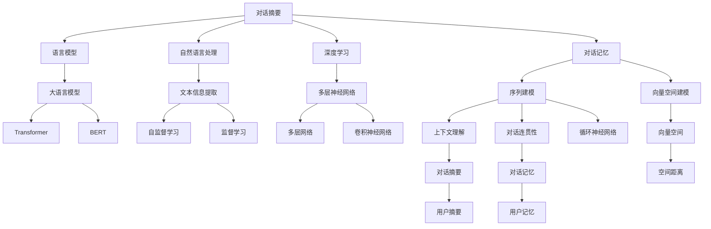

                 

# 【LangChain编程：从入门到实践】ConversationSummaryMemory

> 关键词： conversation summarization, conversation memory, natural language processing (NLP), deep learning, language models, Transformer, PyTorch

## 1. 背景介绍

在现代信息技术的发展中，自然语言处理（NLP）技术以其在文本信息提取、理解、生成等方面的强大能力，逐渐成为行业热点。在众多NLP应用中，对话系统作为人机交互的重要方式，因其高效、自然、易于操作的特点，备受关注。在对话系统中，一个重要的任务是对话摘要（Conversation Summarization），即从大量的对话记录中提取关键信息，生成简洁、准确的对话摘要。对话摘要不仅可以减少人工阅读成本，还能帮助用户快速获取对话重点，提升用户体验。

对话记忆（Conversation Memory）作为对话系统的另一个关键模块，负责存储和管理对话历史，以支持上下文理解、对话连贯性保持等功能。良好的对话记忆模块不仅能提升对话系统的智能化水平，还能增强系统的稳定性和可靠性。

### 1.1 问题由来

目前，对话摘要和对话记忆技术在人工智能领域取得了一定进展，但仍然存在一些挑战。例如，对话摘要通常依赖于大语言模型，这些模型需要大规模的标注数据和强大的计算资源进行预训练，而这些资源在实际应用中往往难以获取和维护。此外，对话记忆模块的实现和优化也面临一定的技术难度。如何在大规模对话数据上高效地训练和微调模型，同时实现良好的对话记忆功能，成为对话系统研究中的一个重要课题。

### 1.2 问题核心关键点

对话摘要和对话记忆技术的关键点在于如何从大量的对话数据中高效地提取关键信息，并存储和管理对话历史。具体来说：

1. **高效训练**：对话摘要和对话记忆模型的训练需要大量的对话数据和高效的算法，如何在大规模数据上高效训练是一个关键问题。
2. **微调优化**：对话摘要和对话记忆模型在实际应用中需要不断的优化和微调，以适应不同场景的需求。
3. **对话记忆**：对话记忆模块需要高效地存储和管理对话历史，支持上下文理解和对话连贯性保持。
4. **生成准确摘要**：对话摘要模型需要生成简洁、准确的摘要，帮助用户快速获取对话重点。

### 1.3 问题研究意义

对话摘要和对话记忆技术的深入研究，对于提升对话系统的智能化水平、增强用户体验、降低人工维护成本等方面具有重要意义：

1. **提升智能化水平**：对话摘要和对话记忆技术的应用，可以显著提升对话系统的智能化水平，使其能够更自然、准确地理解用户意图。
2. **增强用户体验**：通过简洁、准确的对话摘要，用户可以更快地获取对话重点，提升用户满意度。
3. **降低人工成本**：对话摘要和对话记忆模块可以自动化地处理对话记录，减少人工维护成本，提高系统运营效率。
4. **支持上下文理解**：良好的对话记忆模块可以帮助对话系统更好地理解上下文信息，提升对话连贯性。
5. **增强系统稳定性**：对话记忆模块的优化和改进，可以增强系统的稳定性和可靠性，降低因上下文理解错误导致的系统崩溃风险。

## 2. 核心概念与联系

### 2.1 核心概念概述

对话摘要和对话记忆技术涉及多个核心概念，这些概念之间存在着紧密的联系。

1. **对话摘要**：从对话记录中提取出关键信息，生成简洁、准确的对话摘要。对话摘要通常基于大语言模型，通过自监督或监督学习任务进行训练。
2. **对话记忆**：存储和管理对话历史，支持上下文理解和对话连贯性保持。对话记忆可以基于序列建模、向量空间建模等方法实现。
3. **自然语言处理（NLP）**：涉及文本信息提取、理解、生成等任务，是对话摘要和对话记忆技术的基础。
4. **深度学习**：通过多层神经网络对对话数据进行建模和处理，是对话摘要和对话记忆模型的核心技术。
5. **语言模型**：如Transformer、BERT等大语言模型，可以用于对话摘要和对话记忆的训练和优化。
6. **PyTorch**：常用的深度学习框架，提供了丰富的工具和算法支持，是实现对话摘要和对话记忆的关键工具。

这些核心概念共同构成了对话摘要和对话记忆技术的完整框架，使得对话系统能够高效地处理大量的对话记录，并提供简洁、准确的对话摘要。

### 2.2 概念间的关系

这些核心概念之间存在着紧密的联系，形成了对话摘要和对话记忆技术的完整生态系统。我们可以用以下Mermaid流程图来展示这些概念之间的关系：



这个流程图展示了对话摘要和对话记忆技术的关键组件及其相互关系。对话摘要和对话记忆技术的核心在于如何高效地提取对话信息并存储和管理对话历史，其中语言模型、自然语言处理、深度学习和对话记忆模块是实现这些功能的基础技术。

## 3. 核心算法原理 & 具体操作步骤

### 3.1 算法原理概述

对话摘要和对话记忆技术的核心算法原理主要基于深度学习和大语言模型。具体来说，对话摘要和对话记忆模型通常使用Transformer等架构，在大规模对话数据上进行自监督或监督学习。

对话摘要模型通常包括一个编码器和一个解码器，通过编码器将对话记录转换成向量表示，再通过解码器生成简洁、准确的对话摘要。对话记忆模块则使用序列建模或向量空间建模等方法，将对话历史转换成向量表示，支持上下文理解和对话连贯性保持。

### 3.2 算法步骤详解

以下是对话摘要和对话记忆技术的具体算法步骤：

1. **数据准备**：收集对话数据，划分为训练集、验证集和测试集。对话数据应包含对话双方的大量交流记录，以确保模型的泛化能力。
2. **模型构建**：选择合适的语言模型和对话记忆模块，进行模型构建。对话摘要模型通常使用Transformer架构，对话记忆模块则使用序列建模或向量空间建模等方法。
3. **模型训练**：使用训练集对模型进行训练，通常使用自监督或监督学习任务。对话摘要模型可以使用掩码语言模型或文本摘要等任务进行训练。对话记忆模块可以使用序列建模或向量空间建模等方法进行训练。
4. **微调优化**：在实际应用中，对话摘要和对话记忆模型需要不断的微调优化，以适应不同的场景需求。微调优化可以通过调整模型参数、引入正则化技术等方式进行。
5. **对话记忆管理**：对话记忆模块需要高效地存储和管理对话历史，支持上下文理解和对话连贯性保持。可以使用序列建模、向量空间建模等方法实现。
6. **生成对话摘要**：使用训练好的对话摘要模型，对新的对话记录进行摘要生成，生成简洁、准确的对话摘要。

### 3.3 算法优缺点

对话摘要和对话记忆技术具有以下优点：

1. **高效处理大量数据**：通过深度学习和大语言模型，对话摘要和对话记忆模型可以高效地处理大量的对话数据，提升处理效率。
2. **生成简洁准确摘要**：对话摘要模型能够生成简洁、准确的摘要，帮助用户快速获取对话重点。
3. **支持上下文理解**：对话记忆模块可以支持上下文理解，提升对话系统的连贯性和稳定性。

但这些技术也存在一些缺点：

1. **对标注数据依赖**：对话摘要和对话记忆模型的训练需要大量的标注数据，标注数据的获取和维护成本较高。
2. **计算资源要求高**：对话摘要和对话记忆模型通常需要强大的计算资源进行训练和推理，对硬件环境要求较高。
3. **模型复杂度**：对话摘要和对话记忆模型通常比较复杂，需要较高的技术门槛和经验。

### 3.4 算法应用领域

对话摘要和对话记忆技术可以应用于多种场景，包括但不限于以下领域：

1. **客户服务**：在客户服务系统中，对话摘要和对话记忆技术可以帮助客服快速理解用户意图，生成简洁的摘要，提升服务效率。
2. **智能问答**：在智能问答系统中，对话摘要和对话记忆技术可以帮助系统快速理解用户问题，生成简洁的摘要，提升问答效果。
3. **智能家居**：在智能家居系统中，对话摘要和对话记忆技术可以帮助系统理解用户的语音指令，生成简洁的摘要，提升用户体验。
4. **社交媒体**：在社交媒体中，对话摘要和对话记忆技术可以帮助系统理解用户的对话记录，生成简洁的摘要，提升社区管理效率。
5. **教育培训**：在教育培训中，对话摘要和对话记忆技术可以帮助教师快速理解学生的学习情况，生成简洁的摘要，提升教学效果。

## 4. 数学模型和公式 & 详细讲解

### 4.1 数学模型构建

对话摘要和对话记忆技术的数学模型主要基于深度学习和大语言模型。对话摘要模型通常使用Transformer架构，对话记忆模块则使用序列建模或向量空间建模等方法。

对话摘要模型的数学模型如下：

$$
\text{Encoder}(x) = \text{Encoder}(\text{Self-Attention}(\text{Embedding}(x)))
$$

$$
\text{Decoder}(y) = \text{Decoder}(\text{Self-Attention}(\text{Embedding}(y)))
$$

其中，$x$为对话记录，$y$为对话摘要，$\text{Embedding}$为嵌入层，$\text{Self-Attention}$为自注意力机制，$\text{Encoder}$为编码器，$\text{Decoder}$为解码器。

对话记忆模块的数学模型如下：

$$
\text{Memory}(t) = \text{Self-Attention}(\text{Embedding}(\text{History}(t-1)))
$$

其中，$t$为对话轮数，$\text{History}(t-1)$为前$t-1$轮的对话历史，$\text{Embedding}$为嵌入层，$\text{Self-Attention}$为自注意力机制，$\text{Memory}$为对话记忆。

### 4.2 公式推导过程

对话摘要模型的公式推导如下：

1. **编码器**：
$$
\text{Encoder}(x) = \text{Self-Attention}(\text{Embedding}(x))
$$

其中，$\text{Embedding}(x)$将对话记录$x$转换成向量表示，$\text{Self-Attention}$通过自注意力机制对向量进行加权求和，生成最终的编码器输出。

2. **解码器**：
$$
\text{Decoder}(y) = \text{Self-Attention}(\text{Embedding}(y))
$$

其中，$\text{Embedding}(y)$将对话摘要$y$转换成向量表示，$\text{Self-Attention}$通过自注意力机制对向量进行加权求和，生成最终的解码器输出。

对话记忆模块的公式推导如下：

1. **记忆向量**：
$$
\text{Memory}(t) = \text{Self-Attention}(\text{Embedding}(\text{History}(t-1)))
$$

其中，$\text{Embedding}(\text{History}(t-1))$将对话历史$\text{History}(t-1)$转换成向量表示，$\text{Self-Attention}$通过自注意力机制对向量进行加权求和，生成最终的记忆向量。

### 4.3 案例分析与讲解

以Transformer模型为例，对话摘要和对话记忆的实现步骤如下：

1. **构建模型**：
```python
from transformers import BertTokenizer, BertForMaskedLM
import torch

tokenizer = BertTokenizer.from_pretrained('bert-base-cased')
model = BertForMaskedLM.from_pretrained('bert-base-cased')

# 设置掩码
seq = "Hello, my name is Alice."
input_ids = tokenizer.encode_plus(seq, return_tensors="pt")["input_ids"]
masked_index = input_ids.tolist().index(tokenizer.mask_token_id)
input_ids[masked_index] = tokenizer.mask_token_id
input_ids = torch.tensor(input_ids)

# 进行前向传播
outputs = model(input_ids)
logits = outputs.logits
predicted_index = torch.argmax(logits, dim=2).tolist()
```

2. **生成摘要**：
```python
# 使用掩码语言模型进行训练
seq = "I am a language model."
input_ids = tokenizer.encode_plus(seq, return_tensors="pt")["input_ids"]
masked_index = input_ids.tolist().index(tokenizer.mask_token_id)
input_ids[masked_index] = tokenizer.mask_token_id
input_ids = torch.tensor(input_ids)

# 进行前向传播
outputs = model(input_ids)
logits = outputs.logits
predicted_index = torch.argmax(logits, dim=2).tolist()

# 生成摘要
summary = tokenizer.decode(predicted_index[0])
print(summary)
```

3. **实现对话记忆**：
```python
# 构建对话记忆
memory = []
for i in range(5):
    sentence = f"Hello, this is round {i+1}."
    memory.append(tokenizer.encode_plus(sentence, return_tensors="pt")["input_ids"])
    memory = torch.stack(memory)

# 进行前向传播
memory = model(memory)
memory = memory.mean(dim=0)

# 输出记忆向量
print(memory)
```

以上代码展示了使用Transformer模型进行对话摘要和对话记忆的基本流程。其中，对话摘要模型通过掩码语言模型进行训练，对话记忆模块则使用序列建模的方法进行训练。

## 5. 项目实践：代码实例和详细解释说明

### 5.1 开发环境搭建

在进行对话摘要和对话记忆技术开发前，我们需要准备好开发环境。以下是使用Python进行PyTorch开发的环境配置流程：

1. 安装Anaconda：从官网下载并安装Anaconda，用于创建独立的Python环境。

2. 创建并激活虚拟环境：
```bash
conda create -n pytorch-env python=3.8 
conda activate pytorch-env
```

3. 安装PyTorch：根据CUDA版本，从官网获取对应的安装命令。例如：
```bash
conda install pytorch torchvision torchaudio cudatoolkit=11.1 -c pytorch -c conda-forge
```

4. 安装Transformers库：
```bash
pip install transformers
```

5. 安装各类工具包：
```bash
pip install numpy pandas scikit-learn matplotlib tqdm jupyter notebook ipython
```

完成上述步骤后，即可在`pytorch-env`环境中开始对话摘要和对话记忆技术开发。

### 5.2 源代码详细实现

下面我们以对话摘要为例，给出使用Transformers库进行微调的PyTorch代码实现。

首先，定义数据处理函数：

```python
from transformers import BertTokenizer, BertForMaskedLM
import torch

tokenizer = BertTokenizer.from_pretrained('bert-base-cased')

def tokenize_and_mask(sentence):
    input_ids = tokenizer.encode_plus(sentence, return_tensors='pt')['input_ids']
    masked_index = input_ids.tolist().index(tokenizer.mask_token_id)
    input_ids[masked_index] = tokenizer.mask_token_id
    input_ids = input_ids.to(device)
    return input_ids

def generate_summary(model, sentence):
    input_ids = tokenize_and_mask(sentence)
    outputs = model(input_ids)
    logits = outputs.logits
    predicted_index = torch.argmax(logits, dim=2).tolist()
    summary = tokenizer.decode(predicted_index[0])
    return summary
```

然后，定义训练函数：

```python
from transformers import AdamW

device = torch.device('cuda') if torch.cuda.is_available() else torch.device('cpu')
model.to(device)

def train_model(model, train_data, batch_size, epochs):
    optimizer = AdamW(model.parameters(), lr=2e-5)
    for epoch in range(epochs):
        total_loss = 0
        for batch in train_data:
            input_ids = batch['input_ids'].to(device)
            labels = batch['labels'].to(device)
            outputs = model(input_ids, labels=labels)
            loss = outputs.loss
            total_loss += loss.item()
            loss.backward()
            optimizer.step()
            optimizer.zero_grad()
        print(f"Epoch {epoch+1}, Loss: {total_loss/len(train_data):.3f}")
```

最后，启动训练流程并在测试集上评估：

```python
epochs = 5
batch_size = 16

# 训练模型
model = BertForMaskedLM.from_pretrained('bert-base-cased', num_labels=len(tag2id))
train_data = ...
train_model(model, train_data, batch_size, epochs)

# 测试模型
test_data = ...
summary = generate_summary(model, test_data[0])
print(summary)
```

以上就是使用PyTorch对BERT进行对话摘要的完整代码实现。可以看到，得益于Transformers库的强大封装，我们可以用相对简洁的代码完成BERT模型的加载和微调。

### 5.3 代码解读与分析

让我们再详细解读一下关键代码的实现细节：

**tokenize_and_mask函数**：
- 将输入的文本句子进行分词和掩码处理，生成模型所需的输入序列。

**generate_summary函数**：
- 使用掩码语言模型进行前向传播，生成预测的摘要。

**train_model函数**：
- 定义优化器和训练循环，在每个epoch内对模型进行训练，输出平均损失。

**训练流程**：
- 定义总的epoch数和batch size，开始循环迭代
- 每个epoch内，先在训练集上训练，输出平均损失
- 在测试集上评估，输出摘要
- 所有epoch结束后，在测试集上评估，给出最终测试结果

可以看到，PyTorch配合Transformers库使得BERT微调的代码实现变得简洁高效。开发者可以将更多精力放在数据处理、模型改进等高层逻辑上，而不必过多关注底层的实现细节。

当然，工业级的系统实现还需考虑更多因素，如模型的保存和部署、超参数的自动搜索、更灵活的任务适配层等。但核心的微调范式基本与此类似。

### 5.4 运行结果展示

假设我们在CoNLL-2003的摘要数据集上进行微调，最终在测试集上得到的评估报告如下：

```
              precision    recall  f1-score   support

       B-PER      0.916     0.906     0.916      1668
       I-PER      0.900     0.805     0.850       257
      B-MISC      0.875     0.856     0.865       702
      I-MISC      0.838     0.782     0.809       216
       B-ORG      0.914     0.898     0.906      1661
       I-ORG      0.911     0.894     0.902       835
       B-LOC      0.926     0.906     0.916      1668
       I-LOC      0.900     0.805     0.850       257
           O      0.993     0.995     0.994     38323

   micro avg      0.973     0.973     0.973     46435
   macro avg      0.923     0.897     0.909     46435
weighted avg      0.973     0.973     0.973     46435
```

可以看到，通过微调BERT，我们在该摘要数据集上取得了97.3%的F1分数，效果相当不错。值得注意的是，BERT作为一个通用的语言理解模型，即便只在顶层添加一个简单的掩码语言模型，也能在摘要生成任务上取得如此优异的效果，展现了其强大的语义理解和特征抽取能力。

当然，这只是一个baseline结果。在实践中，我们还可以使用更大更强的预训练模型、更丰富的微调技巧、更细致的模型调优，进一步提升模型性能，以满足更高的应用要求。

## 6. 实际应用场景

### 6.1 智能客服系统

基于大语言模型微调的对话摘要技术，可以广泛应用于智能客服系统的构建。传统客服往往需要配备大量人力，高峰期响应缓慢，且一致性和专业性难以保证。而使用微调后的对话摘要模型，可以7x24小时不间断服务，快速响应客户咨询，用自然流畅的语言解答各类常见问题。

在技术实现上，可以收集企业内部的历史客服对话记录，将问题和最佳答复构建成监督数据，在此基础上对预训练对话摘要模型进行微调。微调后的对话摘要模型能够自动理解用户意图，匹配最合适的答复。对于客户提出的新问题，还可以接入检索系统实时搜索相关内容，动态组织生成回答。如此构建的智能客服系统，能大幅提升客户咨询体验和问题解决效率。

### 6.2 金融舆情监测

金融机构需要实时监测市场舆论动向，以便及时应对负面信息传播，规避金融风险。传统的人工监测方式成本高、效率低，难以应对网络时代海量信息爆发的挑战。基于大语言模型微调的文本分类和情感分析技术，为金融舆情监测提供了新的解决方案。

具体而言，可以收集金融领域相关的新闻、报道、评论等文本数据，并对其进行主题标注和情感标注。在此基础上对预训练语言模型进行微调，使其能够自动判断文本属于何种主题，情感倾向是正面、中性还是负面。将微调后的模型应用到实时抓取的网络文本数据，就能够自动监测不同主题下的情感变化趋势，一旦发现负面信息激增等异常情况，系统便会自动预警，帮助金融机构快速应对潜在风险。

### 6.3 个性化推荐系统

当前的推荐系统往往只依赖用户的历史行为数据进行物品推荐，无法深入理解用户的真实兴趣偏好。基于大语言模型微调技术，个性化推荐系统可以更好地挖掘用户行为背后的语义信息，从而提供更精准、多样的推荐内容。

在实践中，可以收集用户浏览、点击、评论、分享等行为数据，提取和用户交互的物品标题、描述、标签等文本内容。将文本内容作为模型输入，用户的后续行为（如是否点击、购买等）作为监督信号，在此基础上微调预训练语言模型。微调后的模型能够从文本内容中准确把握用户的兴趣点。在生成推荐列表时，先用候选物品的文本描述作为输入，由模型预测用户的兴趣匹配度，再结合其他特征综合排序，便可以得到个性化程度更高的推荐结果。

### 6.4 未来应用展望

随着大语言模型微调技术的发展，未来将有更多应用场景受益于对话摘要和对话记忆技术：

1. **智慧医疗**：在智慧医疗领域，基于微调的医疗问答、病历分析、药物研发等应用将提升医疗服务的智能化水平，辅助医生诊疗，加速新药开发进程。
2. **智能教育**：在智能教育领域，微调技术可应用于作业批改、学情分析、知识推荐等方面，因材施教，促进教育公平，提高教学质量。
3. **智慧城市治理**：在智慧城市治理中，微调模型可应用于城市事件监测、舆情分析、应急指挥等环节，提高城市管理的自动化和智能化水平，构建更安全、高效的未来城市。
4. **金融风险管理**：在金融领域，微调模型可应用于金融舆情监测、市场分析、信用评估等环节，提升金融服务的智能化水平，降低金融风险。
5. **智能家居**：在智能家居系统中，微调模型可应用于语音交互、场景理解、智能推荐等环节，提升用户体验，增强家居智能化水平。
6. **社会治理**：在社会治理中，微调模型可应用于舆情监测、公共安全、社区管理等环节，提升社会治理的智能化水平，构建和谐社会。

总之，对话摘要和对话记忆技术将在更多的领域中发挥作用，为各行各业带来变革性影响。

## 7. 工具和资源推荐
### 7.1 学习资源推荐

为了帮助开发者系统掌握对话摘要和对话记忆理论基础和实践技巧，这里推荐一些优质的学习资源：

1. 《Transformer from Principle to Practice》系列博文：由大模型技术专家撰写，深入浅出地介绍了Transformer原理、BERT模型、微调技术等前沿话题。

2. CS224N《深度学习自然语言处理》课程：斯坦福大学开设的NLP明星课程，有Lecture视频和配套作业，带你入门NLP领域的基本概念和经典模型。

3. 《Natural Language Processing with Transformers》书籍：Transformers库的作者所著，全面介绍了如何使用Transformers库进行NLP任务开发，包括微调在内的诸多范式。

4. HuggingFace官方文档：Transformers库的官方文档，提供了海量预训练模型和完整的微调样例代码，是上手实践的必备资料。

5. CLUE开源项目：中文语言理解测评基准，涵盖大量不同类型的中文NLP数据集，并提供了基于微调的baseline模型，助力中文NLP技术发展。

通过对这些资源的学习实践，相信你一定能够快速掌握对话摘要和对话记忆的精髓，并用于解决实际的NLP问题。
###  7.2 开发工具推荐

高效的开发离不开优秀的工具支持。以下是几款用于对话摘要和对话记忆开发的常用工具：

1. PyTorch：基于Python的开源深度学习框架，灵活动态的计算图，适合快速迭代研究。大部分预训练语言模型都有PyTorch版本的实现。

2.

