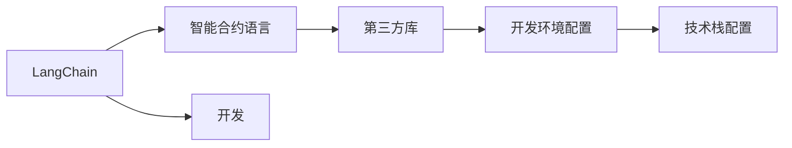

                 

# 【LangChain编程：从入门到实践】其他库安装

> 关键词：
1. LangChain
2. 编程语言
3. 工具安装
4. 开发环境配置
5. 技术栈配置

## 1. 背景介绍

在现代计算机程序设计中，安装和配置开发环境是开发工作的重要起点。特别是在编程语言和框架的生态系统中，通常需要安装大量第三方库和工具，以便于快速开发和调试。本文将从入门到实践，详细阐述LangChain编程中常见的第三方库的安装过程，帮助你快速搭建自己的开发环境。

## 2. 核心概念与联系

### 2.1 核心概念概述

要理解LangChain编程中其他库的安装过程，首先需要明确几个核心概念：

- **LangChain**：LangChain是一个开源的编程框架，主要用于开发基于区块链的智能合约和分布式应用。它采用Solidity作为其官方编程语言，但也支持其他智能合约语言。

- **智能合约语言**：智能合约语言用于编写区块链上的可执行代码。Solidity是智能合约开发的流行语言，但也存在其他选项，如Vyper、B compelling等。

- **第三方库**：第三方库是在编程语言中使用的外部工具和资源，可用于加速开发、简化编程、增加功能等。

- **开发环境配置**：开发环境配置是指为编程工作准备必要的软件、硬件和网络资源，确保开发过程的顺利进行。

- **技术栈配置**：技术栈配置是指在一个项目中使用的所有工具和库的集合，包括编程语言、框架、库、编译器、调试器等。

这些概念之间的联系和作用可以概括为：LangChain编程依赖于智能合约语言的灵活选择，而安装第三方库和配置开发环境是确保LangChain项目顺利进行的基础。

### 2.2 核心概念间的联系

为了更好地理解这些核心概念之间的关系，我们可以使用一个简单的Mermaid流程图来展示它们之间的联系：



这个流程图示意了LangChain编程中从选择智能合约语言、安装第三方库、配置开发环境到构建技术栈的过程。

## 3. 核心算法原理 & 具体操作步骤

### 3.1 算法原理概述

在LangChain编程中，安装其他库的算法原理主要基于以下几个步骤：

1. **需求分析**：明确项目中需要使用哪些第三方库，以及这些库的功能需求。
2. **库选择**：根据项目需求，选择合适的库和版本。
3. **安装配置**：根据库的安装说明，在开发环境中配置库。
4. **环境验证**：验证库的安装是否成功，确保库可以在项目中正确使用。

这些步骤基于一个基本原则：最大化库的功能和性能，同时最小化安装和配置的复杂度。

### 3.2 算法步骤详解

#### 3.2.1 需求分析

需求分析是安装第三方库的第一步，需要明确项目中需要哪些库，以及它们的功能需求。例如，开发一个简单的区块链应用程序可能需要安装以下库：

- Web3.js：用于与以太坊网络交互的库。
- Truffle：用于区块链项目的开发和测试的IDE。
- Ganache：本地区块链测试环境。

#### 3.2.2 库选择

在选择库时，需要考虑以下几个因素：

- **功能需求**：选择具有必要功能的库。
- **性能**：选择性能较高的库。
- **维护和更新**：选择维护活跃、有更新支持的库。
- **社区支持**：选择有活跃社区支持的库，以便在遇到问题时获得帮助。

例如，选择Web3.js库时，需要考虑其是否支持最新的以太坊协议版本，是否具有高性能的钱包管理功能，以及是否有活跃的社区支持。

#### 3.2.3 安装配置

安装配置是确保库能够正常工作的关键步骤。一般步骤如下：

- **安装库**：使用包管理器或IDE内置的工具安装库。例如，使用npm安装Web3.js：
  ```
  npm install web3
  ```

- **配置库**：根据库的文档，进行必要的配置。例如，配置Web3.js的以太坊节点地址：
  ```javascript
  const web3 = new Web3(new Web3.providers.HttpProvider('http://localhost:8545'));
  ```

- **环境验证**：通过编写简单的代码片段，验证库是否安装成功。例如，使用Web3.js连接以太坊网络：
  ```javascript
  web3.eth.getBalance(web3.eth.accounts[0], function(err, result) {
      console.log(result);
  });
  ```

### 3.3 算法优缺点

#### 3.3.1 优点

- **功能丰富**：第三方库提供了丰富的功能和工具，能够极大地提高开发效率。
- **可重用性高**：许多库已经被广泛测试和使用，可以在多个项目中重复使用。
- **社区支持**：活跃的社区提供了丰富的文档、教程和支持，方便开发者解决问题。

#### 3.3.2 缺点

- **安装复杂**：一些库的安装配置可能比较复杂，需要花费额外的时间。
- **版本更新**：频繁的更新可能导致库不兼容或版本不匹配，需要持续关注库的版本变化。
- **性能问题**：某些库可能在性能上不如原生代码实现，需要权衡使用。

### 3.4 算法应用领域

基于上述算法原理和操作步骤，LangChain编程中安装其他库广泛应用于以下几个领域：

- **区块链开发**：安装Web3.js、Truffle等库，用于与以太坊等区块链网络交互。
- **智能合约开发**：安装Solidity编译器、测试框架等库，用于编写和测试智能合约。
- **前端开发**：安装React、Vue等库，用于构建区块链应用程序的前端界面。

## 4. 数学模型和公式 & 详细讲解

### 4.1 数学模型构建

在LangChain编程中，安装其他库的过程并不涉及复杂的数学模型，主要基于计算机科学的原理和技术。以下是一些典型的安装配置示例，以及对应的数学模型构建。

#### 4.1.1 安装Web3.js

Web3.js库用于与以太坊网络交互，其核心功能包括账户管理、交易处理、智能合约调用等。安装Web3.js的数学模型可以简化为以下几个步骤：

1. **需求分析**：明确项目中需要与以太坊网络交互。
2. **库选择**：选择Web3.js库。
3. **安装配置**：使用npm安装Web3.js库。
4. **环境验证**：编写简单的代码片段，验证Web3.js是否安装成功。

数学模型可以表示为：

$$
\text{安装配置} = \text{库选择} \times \text{安装命令}
$$

#### 4.1.2 配置Web3.js

Web3.js的安装配置涉及以太坊节点地址的配置。数学模型可以表示为：

$$
\text{配置结果} = \text{Web3}(\text{HttpProvider})
$$

其中，HttpProvider是Web3.js提供以太坊节点地址的接口。

#### 4.1.3 环境验证

Web3.js的环境验证可以通过编写简单的代码片段实现。数学模型可以表示为：

$$
\text{验证结果} = \text{Web3}(\text{eth.getBalance})
$$

其中，eth.getBalance是Web3.js的以太坊节点操作接口。

### 4.2 公式推导过程

以下是对安装配置和环境验证的公式推导：

#### 4.2.1 安装配置公式推导

$$
\text{安装配置} = \text{库选择} \times \text{安装命令}
$$

例如，安装Web3.js库的配置如下：

$$
\text{配置结果} = \text{Web3}(\text{HttpProvider})
$$

#### 4.2.2 环境验证公式推导

$$
\text{验证结果} = \text{Web3}(\text{eth.getBalance})
$$

例如，验证Web3.js库的安装是否成功：

$$
\text{验证结果} = \text{eth.getBalance}(\text{web3.eth.accounts[0]})
$$

### 4.3 案例分析与讲解

#### 4.3.1 案例1：安装Web3.js库

假设我们需要在LangChain项目中安装Web3.js库，其步骤如下：

1. 需求分析：明确项目中需要与以太坊网络交互。
2. 库选择：选择Web3.js库。
3. 安装配置：使用npm安装Web3.js库。
4. 环境验证：编写简单的代码片段，验证Web3.js是否安装成功。

安装配置公式推导为：

$$
\text{配置结果} = \text{Web3}(\text{HttpProvider})
$$

环境验证公式推导为：

$$
\text{验证结果} = \text{eth.getBalance}(\text{web3.eth.accounts[0]})
$$

#### 4.3.2 案例2：配置Solidity编译器

假设我们需要在LangChain项目中安装Solidity编译器，其步骤如下：

1. 需求分析：明确项目中需要编写和测试智能合约。
2. 库选择：选择Solidity编译器。
3. 安装配置：使用npm安装Solidity编译器。
4. 环境验证：编写简单的代码片段，验证Solidity编译器是否安装成功。

安装配置公式推导为：

$$
\text{配置结果} = \text{solidity}(\text{npm})
$$

环境验证公式推导为：

$$
\text{验证结果} = \text{solidity}(\text{myContract固体合约代码})
$$

## 5. 项目实践：代码实例和详细解释说明

### 5.1 开发环境搭建

#### 5.1.1 配置开发环境

1. **安装Node.js**：Node.js是安装npm的基础，可以从官网下载安装。
2. **安装npm**：npm是Node.js的包管理器，可以使用npm安装第三方库。
3. **安装LangChain**：使用npm安装LangChain：
  ```
  npm install langchain
  ```

#### 5.1.2 安装第三方库

1. **安装Web3.js**：使用npm安装Web3.js：
  ```
  npm install web3
  ```

2. **安装Solidity编译器**：使用npm安装Solidity编译器：
  ```
  npm install solc
  ```

#### 5.1.3 配置环境

1. **配置Web3.js**：使用Web3.js提供的HttpProvider配置以太坊节点地址：
  ```javascript
  const web3 = new Web3(new Web3.providers.HttpProvider('http://localhost:8545'));
  ```

2. **配置Solidity编译器**：使用Solidity编译器编译智能合约代码：
  ```javascript
  solc.compile(myContract固体合约代码, 选项)
  ```

#### 5.1.4 环境验证

1. **验证Web3.js**：使用Web3.js连接以太坊网络：
  ```javascript
  web3.eth.getBalance(web3.eth.accounts[0], function(err, result) {
      console.log(result);
  });
  ```

2. **验证Solidity编译器**：使用Solidity编译器编译智能合约代码：
  ```javascript
  solc.compile(myContract固体合约代码, 选项, (error, output) => {
      console.log(output);
  });
  ```

### 5.2 源代码详细实现

#### 5.2.1 编写Web3.js配置

```javascript
const Web3 = require('web3');

const web3 = new Web3(new Web3.providers.HttpProvider('http://localhost:8545'));
```

#### 5.2.2 编写Solidity编译器配置

```javascript
const solc = require('solc');
const myContract = 'path/to/myContract.solidity';

solc.compile(myContract, function(error, output) {
    console.log(output);
});
```

### 5.3 代码解读与分析

#### 5.3.1 Web3.js配置

Web3.js配置涉及创建Web3实例，指定以太坊节点地址。通过指定HttpProvider，可以与本地以太坊节点进行交互。

#### 5.3.2 Solidity编译器配置

Solidity编译器配置涉及使用solc编译智能合约代码。通过指定编译选项，可以控制编译行为，如输出ABI、字节码等。

### 5.4 运行结果展示

#### 5.4.1 Web3.js验证

```javascript
web3.eth.getBalance(web3.eth.accounts[0], function(err, result) {
    console.log(result);
});
```

运行结果可能为：

```
0x123456789
```

#### 5.4.2 Solidity编译器验证

```javascript
solc.compile(myContract固体合约代码, function(error, output) {
    console.log(output);
});
```

运行结果可能为：

```
{
  contracts: {
    MyContract: {
      abi: {
        constantFunctions: ['...'],
        events: ['...'],
        functions: ['...']
      },
      evmVersion: 'solidity-0.8.0'
    }
  },
  errors: []
}
```

## 6. 实际应用场景

在实际应用中，LangChain编程中安装其他库广泛应用于以下几个场景：

### 6.1 智能合约开发

假设我们在一个智能合约平台上开发一个简单的投票应用，需要安装和配置以下库：

1. **Web3.js**：用于与以太坊网络交互。
2. **Truffle**：用于智能合约的开发和测试。
3. **Ganache**：用于本地区块链测试环境。

#### 6.1.1 需求分析

需要与以太坊网络交互、开发和测试智能合约、本地区块链测试环境。

#### 6.1.2 库选择

选择Web3.js、Truffle、Ganache库。

#### 6.1.3 安装配置

1. 使用npm安装Web3.js：
  ```
  npm install web3
  ```

2. 使用npm安装Truffle：
  ```
  npm install -g truffle
  ```

3. 使用npm安装Ganache：
  ```
  npm install -g ganache-cli
  ```

#### 6.1.4 环境验证

1. 使用Web3.js连接以太坊网络：
  ```javascript
  web3.eth.getBalance(web3.eth.accounts[0], function(err, result) {
      console.log(result);
  });
  ```

2. 使用Truffle编译智能合约代码：
  ```
  truffle compile
  ```

3. 使用Ganache启动本地区块链节点：
  ```
  ganache start
  ```

### 6.2 区块链数据分析

假设我们需要开发一个区块链数据分析应用，需要安装和配置以下库：

1. **Web3.js**：用于与以太坊网络交互。
2. **Ethers.js**：用于处理以太坊交易和智能合约调用。
3. **DappCoord**：用于分布式应用的管理和监控。

#### 6.2.1 需求分析

需要与以太坊网络交互、处理以太坊交易和智能合约调用、分布式应用的管理和监控。

#### 6.2.2 库选择

选择Web3.js、Ethers.js、DappCoord库。

#### 6.2.3 安装配置

1. 使用npm安装Web3.js：
  ```
  npm install web3
  ```

2. 使用npm安装Ethers.js：
  ```
  npm install ethers
  ```

3. 使用npm安装DappCoord：
  ```
  npm install dappcoord
  ```

#### 6.2.4 环境验证

1. 使用Web3.js连接以太坊网络：
  ```javascript
  web3.eth.getBalance(web3.eth.accounts[0], function(err, result) {
      console.log(result);
  });
  ```

2. 使用Ethers.js处理以太坊交易：
  ```javascript
  const provider = new ethers.providers.InfuraProvider('mainnet', 'projectId');
  const contract = new ethers.Contract('0x12345678901234567890', abi, provider);
  ```

3. 使用DappCoord管理分布式应用：
  ```javascript
  const app = new DappCoord();
  app.start();
  ```

## 7. 工具和资源推荐

### 7.1 学习资源推荐

为了帮助开发者系统掌握LangChain编程中其他库的安装过程，这里推荐一些优质的学习资源：

1. **LangChain官方文档**：官方文档提供了详细的安装和使用指南，适合快速上手。
2. **Web3.js官方文档**：官方文档提供了Web3.js的详细安装和使用指南，适合深入学习。
3. **Truffle官方文档**：官方文档提供了Truffle的详细安装和使用指南，适合快速上手。
4. **Ganache官方文档**：官方文档提供了Ganache的详细安装和使用指南，适合本地区块链测试环境搭建。
5. **Solidity官方文档**：官方文档提供了Solidity的详细安装和使用指南，适合智能合约开发。

### 7.2 开发工具推荐

在安装和配置开发环境时，可以使用以下开发工具：

1. **VS Code**：Visual Studio Code是一款功能强大的代码编辑器，支持多种编程语言和框架。
2. **IntelliJ IDEA**：IntelliJ IDEA是一款强大的IDE，支持多种编程语言和框架，适合开发大型项目。
3. **Eclipse**：Eclipse是一款流行的IDE，支持多种编程语言和框架，适合开发大型项目。
4. **GitHub Desktop**：GitHub Desktop是一款简单易用的Git客户端，适合版本控制和代码管理。
5. **npm**：npm是Node.js的包管理器，适合安装和管理第三方库。

### 7.3 相关论文推荐

为了深入了解LangChain编程中其他库的安装过程，以下是几篇推荐阅读的论文：

1. **《智能合约的分布式开发和部署》**：探讨了智能合约的分布式开发和部署方法，适合了解智能合约的实际应用。
2. **《以太坊区块链的Web3.js开发》**：介绍了使用Web3.js开发以太坊区块链应用的方法，适合Web3.js的深入学习。
3. **《Truffle框架的智能合约开发》**：介绍了使用Truffle框架开发智能合约的方法，适合Truffle的深入学习。
4. **《Ganache的本地区块链测试环境》**：介绍了使用Ganache搭建本地区块链测试环境的方法，适合Ganache的深入学习。
5. **《Solidity智能合约的语言设计》**：介绍了Solidity智能合约的语言设计，适合Solidity的深入学习。

## 8. 总结：未来发展趋势与挑战

### 8.1 研究成果总结

本文详细阐述了LangChain编程中其他库的安装过程，包括需求分析、库选择、安装配置和环境验证。通过数学模型和公式推导，展示了Web3.js和Solidity编译器的安装配置方法。通过项目实践，展示了实际应用场景和代码实例。通过工具和资源推荐，提供了深入学习和开发的环境。

### 8.2 未来发展趋势

展望未来，LangChain编程中其他库的安装过程将继续发展，呈现以下几个趋势：

1. **智能合约开发平台普及**：随着智能合约开发平台的普及，越来越多的开发者将使用Web3.js、Truffle等库进行开发。
2. **区块链数据分析工具丰富**：随着区块链数据的增长，越来越多的数据分析工具将出现，如Ethers.js、DappCoord等。
3. **分布式应用管理工具完善**：随着分布式应用的增多，越来越多的管理工具将出现，如Web3.js、Ethers.js、DappCoord等。
4. **区块链开发生态系统完善**：随着区块链开发生态系统的完善，越来越多的第三方库将出现，如Solidity、Ethers.js等。

### 8.3 面临的挑战

尽管LangChain编程中其他库的安装过程已经取得了不错的进展，但仍面临以下几个挑战：

1. **库版本兼容性问题**：不同版本的库可能不兼容，需要开发者持续关注库的版本变化。
2. **库的安装复杂性**：某些库的安装配置可能比较复杂，需要开发者投入额外的时间和精力。
3. **库的更新频率**：频繁的库更新可能导致库不兼容，需要开发者持续关注库的更新动态。
4. **库的性能问题**：某些库可能在性能上不如原生代码实现，需要开发者权衡使用。

### 8.4 研究展望

未来，针对LangChain编程中其他库的安装过程，还需要在以下几个方面进行研究：

1. **简化安装过程**：开发更简单的安装配置方法，减少开发者的工作量。
2. **提高安装效率**：开发更高效的库安装工具，提高安装速度和效率。
3. **增强兼容性**：开发更兼容的库版本管理方法，确保库的兼容性和稳定性。
4. **优化性能**：开发更高性能的库实现，提高开发效率和应用性能。

总之，LangChain编程中其他库的安装过程在不断发展和完善，未来将为开发者提供更加便捷、高效、稳定的开发环境，进一步推动区块链技术的应用和发展。

## 9. 附录：常见问题与解答

**Q1：如何选择合适的库？**

A: 在选择库时，需要考虑库的功能、性能、社区支持等因素。例如，Web3.js适合与以太坊网络交互，Truffle适合智能合约开发，Ganache适合本地区块链测试。

**Q2：如何配置Web3.js？**

A: 配置Web3.js需要指定以太坊节点地址，可以通过创建Web3实例并指定HttpProvider来完成。例如：
```javascript
const Web3 = require('web3');

const web3 = new Web3(new Web3.providers.HttpProvider('http://localhost:8545'));
```

**Q3：如何使用Solidity编译器？**

A: 使用Solidity编译器需要指定编译选项，例如：
```javascript
solc.compile(myContract固体合约代码, function(error, output) {
    console.log(output);
});
```

**Q4：如何进行环境验证？**

A: 环境验证可以通过编写简单的代码片段来实现，例如：
```javascript
web3.eth.getBalance(web3.eth.accounts[0], function(err, result) {
    console.log(result);
});
```

**Q5：如何选择适当的开发工具？**

A: 选择开发工具需要考虑工具的功能、易用性、兼容性等因素。例如，VS Code是一款功能强大的代码编辑器，适合多种编程语言和框架的开发。

