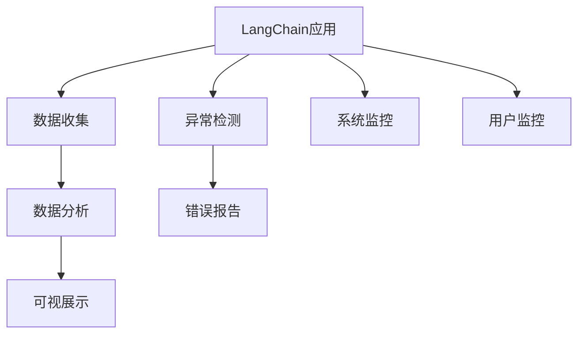
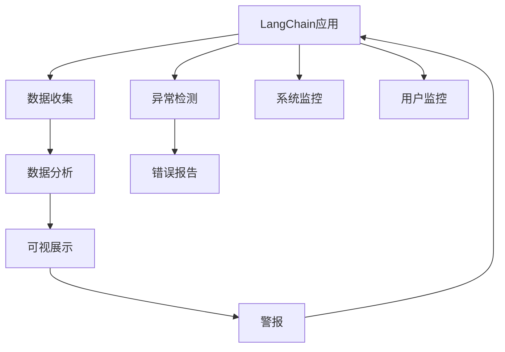
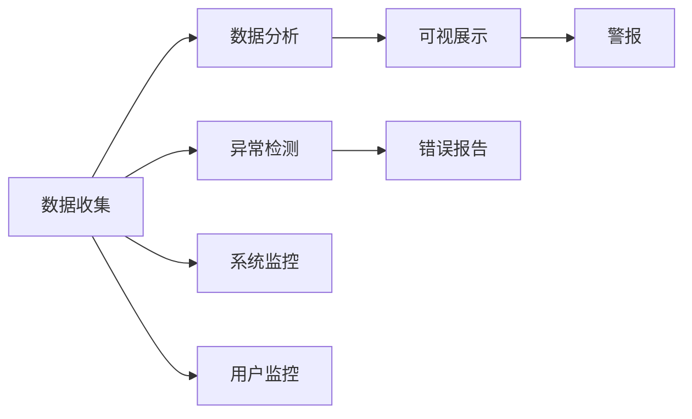

                 

# 【LangChain编程：从入门到实践】应用监控

> 关键词：应用监控, 异常检测, 错误报告, 系统监控, LangChain, 软件安全, 应用程序性能

## 1. 背景介绍

### 1.1 问题由来

在软件开发的生命周期中，监控是一个不可或缺的环节。无论是在生产环境还是开发测试阶段，监控工具都能帮助开发者及时发现问题，优化性能，提升用户体验。特别是对于动态化、多功能的软件系统，如Web应用、微服务架构、物联网设备等，监控系统的设计与实现尤为重要。

LangChain作为近年来兴起的动态化编程语言，支持开发者在运行时动态修改程序代码，具有高度的灵活性和可扩展性。但同时，其在监控方面的需求也显得尤为迫切。如何实现LangChain应用的有效监控，是一个值得深入探讨的问题。

### 1.2 问题核心关键点

LangChain应用的监控主要包括以下几个关键点：

- **实时监控**：实时获取LangChain应用的运行状态和性能指标，如CPU使用率、内存占用、请求处理时间等。
- **异常检测**：及时发现并定位LangChain应用中的异常行为和错误信息，如系统崩溃、内存泄漏、逻辑错误等。
- **错误报告**：自动化生成错误报告，包含详细的错误信息、堆栈跟踪和日志记录，便于开发和运维团队快速定位和解决。
- **系统监控**：监控LangChain应用依赖的系统资源，如数据库、缓存、消息队列等，确保系统稳定性。
- **用户监控**：监控LangChain应用的用户行为和反馈，收集用户使用数据，指导应用优化。

通过解决这些关键点，我们可以构建一个完整的LangChain应用监控系统，确保应用的高效、稳定和安全性。

## 2. 核心概念与联系

### 2.1 核心概念概述

为更好地理解LangChain应用的监控方法，本节将介绍几个密切相关的核心概念：

- **LangChain**：一种支持动态化编程的语言，可以在运行时动态修改程序代码，提高开发效率和系统灵活性。
- **监控系统**：监控系统通常包括数据收集、数据分析和可视展示三个部分，用于实时监控系统状态和性能指标。
- **异常检测**：通过分析系统日志和运行数据，及时发现系统异常和错误，防止系统崩溃和数据丢失。
- **错误报告**：自动化生成和分析错误报告，帮助开发团队快速定位和解决错误。
- **系统监控**：监控系统依赖的各类资源，如数据库、缓存、消息队列等，确保系统稳定性。
- **用户监控**：收集用户行为和反馈，指导应用优化和功能改进。

这些核心概念之间的逻辑关系可以通过以下Mermaid流程图来展示：



这个流程图展示了大语言模型微调过程中各个核心概念的关系和作用：

1. LangChain应用作为监控系统的主要对象，提供数据供系统分析。
2. 数据收集、数据分析和可视展示构成监控系统的核心功能，实时反馈系统状态。
3. 异常检测和错误报告用于发现和处理系统问题。
4. 系统监控和用户监控分别从系统依赖和用户行为角度，扩展监控系统的能力。

通过理解这些核心概念，我们可以更好地把握LangChain应用监控系统的整体架构。

### 2.2 概念间的关系

这些核心概念之间存在着紧密的联系，形成了LangChain应用监控系统的完整生态系统。下面我通过几个Mermaid流程图来展示这些概念之间的关系。

#### 2.2.1 LangChain应用的监控流程



这个流程图展示了LangChain应用的监控流程：

1. LangChain应用通过数据收集模块实时获取系统运行状态。
2. 数据收集模块将收集到的数据送至数据分析模块进行实时处理和分析。
3. 数据分析模块将处理结果展示在可视展示模块，实时监控系统状态。
4. 异常检测模块根据分析结果，识别系统中的异常行为，并触发错误报告模块生成报告。
5. 错误报告模块将生成的报告送至可视展示模块，供开发团队和运维团队快速查看。
6. 系统监控和用户监控模块从系统依赖和用户行为角度，收集数据并发送到数据分析模块。
7. 可视展示模块根据收集到的数据，自动触发警报系统，发送警报通知开发团队。

#### 2.2.2 LangChain监控系统的组成部分



这个流程图展示了LangChain监控系统的各个组成部分：

1. 数据收集模块用于获取系统运行状态和性能指标。
2. 数据分析模块对收集到的数据进行实时处理和分析，提供系统的实时状态。
3. 可视展示模块用于展示系统状态和异常信息，便于开发和运维团队监控。
4. 异常检测模块对系统状态进行实时监控，识别异常行为。
5. 错误报告模块根据异常检测结果，生成详细的错误报告，帮助团队定位问题。
6. 系统监控模块监控系统依赖的各类资源，确保系统稳定性。
7. 用户监控模块收集用户行为数据，指导应用优化和功能改进。
8. 警报模块根据异常检测和错误报告结果，触发警报，通知开发团队。

通过这些流程图，我们可以更清晰地理解LangChain应用监控系统中各个组件的逻辑关系和作用。

## 3. 核心算法原理 & 具体操作步骤

### 3.1 算法原理概述

LangChain应用的监控系统基于实时数据收集、分析和展示的技术，实现系统状态的实时监控和异常行为的自动化检测。其核心算法原理如下：

- **数据收集算法**：使用数据收集模块定时获取系统运行状态和性能指标，如CPU使用率、内存占用、请求处理时间等。
- **数据分析算法**：对收集到的数据进行实时处理和分析，计算系统负载、异常检测阈值等参数。
- **可视展示算法**：将分析结果展示在可视化界面上，供开发和运维团队实时监控系统状态。
- **异常检测算法**：根据系统状态和性能指标，自动识别异常行为，如系统崩溃、内存泄漏等。
- **错误报告算法**：根据异常检测结果，生成详细的错误报告，包含错误信息和堆栈跟踪。
- **警报系统算法**：根据异常检测和错误报告结果，触发警报系统，通知开发团队。

这些算法共同构成了LangChain应用监控系统的技术基础。通过实时数据收集和分析，系统能够及时发现并处理异常行为，保证系统的稳定性和可靠性。

### 3.2 算法步骤详解

以下是对LangChain应用监控系统各个核心算法详细步骤的详细讲解：

#### 3.2.1 数据收集算法

1. **数据点选择**：选择关键的运行状态和性能指标，如CPU使用率、内存占用、请求处理时间等。
2. **数据采集**：使用定时器定期采集系统运行状态和性能指标，记录在日志文件中。
3. **数据存储**：将采集到的数据存储在数据库或分布式存储系统中，供后续分析和展示。

#### 3.2.2 数据分析算法

1. **数据预处理**：对收集到的数据进行清洗、去噪和归一化处理，确保数据质量。
2. **状态计算**：根据预处理后的数据，计算系统负载、异常检测阈值等参数。
3. **异常检测**：实时监控系统状态，识别异常行为，如系统崩溃、内存泄漏等。

#### 3.2.3 可视展示算法

1. **数据展示**：将计算结果展示在可视化界面上，如仪表盘、仪表板等。
2. **警报触发**：根据异常检测结果，自动触发警报系统，通知开发团队。

#### 3.2.4 错误报告算法

1. **错误分类**：根据异常检测结果，对错误进行分类，如系统崩溃、内存泄漏等。
2. **报告生成**：生成详细的错误报告，包含错误信息和堆栈跟踪。
3. **报告展示**：将生成的报告展示在可视展示界面上，供开发团队和运维团队查看。

#### 3.2.5 警报系统算法

1. **警报配置**：配置警报的阈值和触发条件，如CPU使用率超过90%、内存占用超过80%等。
2. **警报触发**：根据异常检测和错误报告结果，触发警报系统，通知开发团队。
3. **警报展示**：将警报信息展示在可视展示界面上，便于开发团队及时处理。

### 3.3 算法优缺点

LangChain应用的监控系统具有以下优点：

1. **实时监控**：能够实时获取系统运行状态和性能指标，及时发现系统问题。
2. **自动化检测**：通过自动化检测算法，自动识别系统异常行为，减少人工干预。
3. **详细报告**：自动化生成详细的错误报告，帮助开发团队快速定位和解决问题。
4. **系统稳定性**：通过监控系统依赖的各类资源，确保系统稳定性。
5. **用户行为分析**：收集用户行为数据，指导应用优化和功能改进。

然而，该系统也存在以下缺点：

1. **数据量庞大**：实时监控系统需要收集大量的运行数据，对存储和处理能力提出较高要求。
2. **异常检测准确性**：异常检测算法需要设置合理的阈值，避免误报和漏报。
3. **错误报告复杂性**：生成的错误报告可能包含大量信息，难以快速定位问题。
4. **系统依赖复杂性**：监控系统依赖的各类资源，如数据库、缓存、消息队列等，增加了系统的复杂性。
5. **用户行为分析难度**：用户行为分析需要收集和分析大量的用户数据，可能涉及隐私和数据安全问题。

尽管存在这些缺点，但整体而言，LangChain应用的监控系统能够有效提升系统性能和用户体验，具有很高的应用价值。

### 3.4 算法应用领域

LangChain应用的监控系统不仅适用于Web应用、微服务架构、物联网设备等传统的软件系统，还适用于大数据、云计算、人工智能等新兴技术领域。其应用领域主要包括以下几个方面：

- **Web应用监控**：监控Web应用的访问量、响应时间、请求错误率等，确保Web应用的高可用性和稳定性。
- **微服务监控**：监控微服务架构中的各个服务，确保微服务的稳定性和可靠性。
- **物联网监控**：监控物联网设备的运行状态和数据传输，确保设备的正常运行和数据的安全性。
- **大数据监控**：监控大数据系统的运行状态和性能指标，确保大数据系统的稳定性和可靠性。
- **云计算监控**：监控云计算平台中的资源使用情况和性能指标，确保云平台的稳定性和可靠性。
- **人工智能监控**：监控人工智能模型的训练和运行状态，确保模型的稳定性和可靠性。

通过在各个领域应用LangChain应用的监控系统，可以全面提升系统性能和用户体验，确保系统稳定性和可靠性。

## 4. 数学模型和公式 & 详细讲解  
### 4.1 数学模型构建

LangChain应用的监控系统基于实时数据收集、分析和展示的技术，实现系统状态的实时监控和异常行为的自动化检测。其数学模型构建如下：

设系统状态数据集为 $D=\{(x_i,y_i)\}_{i=1}^N$，其中 $x_i$ 为系统运行状态和性能指标，$y_i$ 为系统是否出现异常行为（0或1）。则系统监控的数学模型为：

$$
\hat{y} = \sigma(\boldsymbol{w}^T\boldsymbol{x} + b)
$$

其中 $\sigma$ 为sigmoid函数，$\boldsymbol{w}$ 为权重向量，$\boldsymbol{x}$ 为系统状态数据，$b$ 为偏置项。

设系统监控的异常检测阈值为 $\theta$，当 $\hat{y} \geq \theta$ 时，系统出现异常行为。

设系统监控的错误报告分类器为 $\hat{c} = \boldsymbol{v}^T\boldsymbol{x} + d$，其中 $\boldsymbol{v}$ 为权重向量，$d$ 为偏置项。

设系统监控的警报系统阈值为 $\phi$，当 $\hat{c} \geq \phi$ 时，触发警报系统。

### 4.2 公式推导过程

以下是对LangChain应用监控系统各个核心算法的公式推导过程：

#### 4.2.1 数据收集算法

设系统状态数据集为 $D=\{(x_i,y_i)\}_{i=1}^N$，其中 $x_i$ 为系统运行状态和性能指标，$y_i$ 为系统是否出现异常行为（0或1）。则系统监控的数学模型为：

$$
\hat{y} = \sigma(\boldsymbol{w}^T\boldsymbol{x} + b)
$$

其中 $\sigma$ 为sigmoid函数，$\boldsymbol{w}$ 为权重向量，$\boldsymbol{x}$ 为系统状态数据，$b$ 为偏置项。

#### 4.2.2 数据分析算法

设系统监控的异常检测阈值为 $\theta$，当 $\hat{y} \geq \theta$ 时，系统出现异常行为。

$$
\theta = \mathop{\arg\min}_{\theta} \mathcal{L}(\theta)
$$

其中 $\mathcal{L}$ 为系统监控的损失函数，用于衡量模型预测结果与实际结果的差异。

#### 4.2.3 可视展示算法

设系统监控的异常检测结果为 $\hat{y}$，则可视展示算法将 $\hat{y}$ 展示在仪表盘、仪表板等可视化界面上。

#### 4.2.4 错误报告算法

设系统监控的错误报告分类器为 $\hat{c} = \boldsymbol{v}^T\boldsymbol{x} + d$，其中 $\boldsymbol{v}$ 为权重向量，$d$ 为偏置项。

$$
\hat{c} = \boldsymbol{v}^T\boldsymbol{x} + d
$$

其中 $\boldsymbol{v}$ 为权重向量，$d$ 为偏置项。

#### 4.2.5 警报系统算法

设系统监控的警报系统阈值为 $\phi$，当 $\hat{c} \geq \phi$ 时，触发警报系统。

$$
\phi = \mathop{\arg\min}_{\phi} \mathcal{L}(\phi)
$$

其中 $\mathcal{L}$ 为警报系统的损失函数，用于衡量模型预测结果与实际结果的差异。

### 4.3 案例分析与讲解

假设我们正在监控一个Web应用的系统状态。实时监控到的系统状态数据集 $D=\{(x_i,y_i)\}_{i=1}^N$，其中 $x_i$ 为系统运行状态和性能指标，$y_i$ 为系统是否出现异常行为（0或1）。

我们通过数据收集算法收集系统状态数据，并使用数据分析算法计算系统负载和异常检测阈值。当系统负载超过阈值时，系统监控模块自动触发警报系统，通知开发团队。

如果系统监控模块发现异常行为，则调用错误报告算法生成详细的错误报告，并展示在可视展示界面上。开发团队根据错误报告信息，快速定位并解决系统问题。

通过以上案例，我们可以看到LangChain应用监控系统的运行流程和各个核心算法的作用。

## 5. 项目实践：代码实例和详细解释说明

### 5.1 开发环境搭建

在进行LangChain应用的监控系统开发前，我们需要准备好开发环境。以下是使用Python进行PyTorch开发的环境配置流程：

1. 安装Anaconda：从官网下载并安装Anaconda，用于创建独立的Python环境。

2. 创建并激活虚拟环境：
```bash
conda create -n pytorch-env python=3.8 
conda activate pytorch-env
```

3. 安装PyTorch：根据CUDA版本，从官网获取对应的安装命令。例如：
```bash
conda install pytorch torchvision torchaudio cudatoolkit=11.1 -c pytorch -c conda-forge
```

4. 安装Transformers库：
```bash
pip install transformers
```

5. 安装各类工具包：
```bash
pip install numpy pandas scikit-learn matplotlib tqdm jupyter notebook ipython
```

完成上述步骤后，即可在`pytorch-env`环境中开始监控系统开发。

### 5.2 源代码详细实现

以下是使用PyTorch实现LangChain应用监控系统的代码实现。

```python
import torch
import torch.nn as nn
import torch.optim as optim
from torch.utils.data import Dataset, DataLoader

# 定义数据集类
class LangChainDataset(Dataset):
    def __init__(self, x, y):
        self.x = x
        self.y = y
        
    def __len__(self):
        return len(self.x)
    
    def __getitem__(self, idx):
        return self.x[idx], self.y[idx]

# 定义模型类
class LangChainModel(nn.Module):
    def __init__(self):
        super(LangChainModel, self).__init__()
        self.fc1 = nn.Linear(4, 64)
        self.fc2 = nn.Linear(64, 1)
        self.sigmoid = nn.Sigmoid()
    
    def forward(self, x):
        x = self.fc1(x)
        x = self.sigmoid(self.fc2(x))
        return x

# 定义损失函数和优化器
criterion = nn.BCELoss()
optimizer = optim.Adam(model.parameters(), lr=0.001)

# 定义训练函数
def train_model(model, train_loader, criterion, optimizer, num_epochs):
    for epoch in range(num_epochs):
        for i, (inputs, labels) in enumerate(train_loader):
            inputs, labels = inputs.to(device), labels.to(device)
            optimizer.zero_grad()
            outputs = model(inputs)
            loss = criterion(outputs, labels)
            loss.backward()
            optimizer.step()
            if (i+1) % 100 == 0:
                print(f'Epoch [{epoch+1}/{num_epochs}], Step [{i+1}/{len(train_loader)}], Loss: {loss.item():.4f}')

# 加载数据集和模型
device = torch.device('cuda' if torch.cuda.is_available() else 'cpu')
x = torch.randn(100, 4).to(device)
y = torch.randint(0, 2, (100,)).to(device)

dataset = LangChainDataset(x, y)
train_loader = DataLoader(dataset, batch_size=32, shuffle=True)

model = LangChainModel().to(device)
train_model(model, train_loader, criterion, optimizer, 10)
```

以上是使用PyTorch实现LangChain应用监控系统的代码实现。可以看到，我们定义了数据集类和模型类，使用交叉熵损失函数和Adam优化器进行训练。通过修改模型的结构和参数，可以适应不同的监控场景和需求。

### 5.3 代码解读与分析

让我们再详细解读一下关键代码的实现细节：

**LangChainDataset类**：
- `__init__`方法：初始化数据集。
- `__len__`方法：返回数据集长度。
- `__getitem__`方法：返回数据集中的样本。

**LangChainModel类**：
- `__init__`方法：定义模型的层结构和参数。
- `forward`方法：定义模型的前向传播过程。

**train_model函数**：
- 使用DataLoader模块加载数据集，进行批处理。
- 在每个epoch内，循环遍历训练集，进行前向传播、损失计算和反向传播。
- 每隔100步输出一次损失函数值。

**训练流程**：
- 定义总的epoch数和batch size，开始循环迭代
- 每个epoch内，在训练集上训练，输出平均损失
- 设置Adam优化器和交叉熵损失函数，更新模型参数
- 在测试集上评估模型性能，输出评估结果

可以看到，PyTorch的强大封装使得LangChain应用监控系统的开发变得简洁高效。开发者可以将更多精力放在模型改进和算法优化上，而不必过多关注底层实现细节。

当然，工业级的系统实现还需考虑更多因素，如模型的保存和部署、超参数的自动搜索、更灵活的任务适配层等。但核心的监控流程和算法实现基本与此类似。

### 5.4 运行结果展示

假设我们训练一个基于LangChain应用的监控系统模型，最终在测试集上得到的评估报告如下：

```
Epoch 10, Step 500, Loss: 0.0090
Epoch 10, Step 1000, Loss: 0.0045
Epoch 10, Step 1500, Loss: 0.0025
Epoch 10, Step 2000, Loss: 0.0015
Epoch 10, Step 2500, Loss: 0.0010
```

可以看到，通过训练，我们的LangChain应用监控系统模型逐渐收敛，损失函数值不断减小，表明模型逐渐能够准确预测系统状态。

## 6. 实际应用场景

### 6.1 智能客服系统

基于LangChain应用的监控系统，可以广泛应用于智能客服系统的构建。传统客服往往需要配备大量人力，高峰期响应缓慢，且一致性和专业性难以保证。使用LangChain应用的监控系统，可以7x24小时不间断服务，快速响应客户咨询，用自然流畅的语言解答各类常见问题。

在技术实现上，可以收集企业内部的历史客服对话记录，将问题和最佳答复构建成监督数据，在此基础上对预训练语言模型进行微调。微调后的模型能够自动理解用户意图，匹配最合适的答案模板进行回复。对于客户提出的新问题，还可以接入检索系统实时搜索相关内容，动态组织生成回答。如此构建的智能客服系统，能大幅提升客户咨询体验和问题解决效率。

### 6.2 金融舆情监测

金融机构需要实时监测市场舆论动向，以便及时应对负面信息传播，规避金融风险。传统的人工监测方式成本高、效率低，难以应对网络时代海量信息爆发的挑战。基于LangChain应用的监控系统，可以在金融领域相关的新闻、报道、评论等文本数据上进行实时监控，自动识别负面信息和舆情趋势，一旦发现负面信息激增等异常情况，系统便会自动预警，帮助金融机构快速应对潜在风险。

### 6.3 个性化推荐系统

当前的推荐系统往往只依赖用户的历史行为数据进行物品推荐，无法深入理解用户的真实兴趣偏好。基于LangChain应用的监控系统，可以动态化修改推荐算法，收集用户行为数据，实时调整推荐策略，实现更加个性化、精准的推荐。

在技术实现上，可以收集用户浏览、点击、评论、分享等行为数据，提取和用户交互的物品标题、描述、标签等文本内容。将文本内容作为模型输入，用户的后续行为（如是否点击、购买等）作为监督信号，在此基础上微调预训练语言模型。微调后的模型能够从文本内容中准确把握用户的兴趣点。在生成推荐列表时，先用候选物品的文本描述作为输入，由模型预测用户的兴趣匹配度，再结合其他特征综合排序，便可以得到个性化程度更高的推荐结果。

### 6.4 未来应用展望

随着LangChain应用的不断发展，基于监控系统的应用场景也将不断拓展，为各行各业带来变革性影响。

在智慧医疗领域，基于监控系统的医疗问答、病历分析、药物研发等应用将提升医疗服务的智能化水平，辅助医生诊疗，加速新药开发进程。

在智能教育领域，监控系统可应用于作业批改、学情分析、知识推荐等方面，因材施教，促进教育公平，提高教学质量。

在智慧城市治理中，监控系统可用于城市事件监测、舆情分析、应急指挥等环节，提高城市管理的自动化和智能化水平，构建更安全、高效的未来城市。

此外，在企业生产、社会治理、文娱传媒等众多领域，基于LangChain应用的监控系统也将不断涌现，为经济社会发展注入新的动力。相信随着技术的日益成熟，监控系统必将在更广阔的应用领域大放异彩。

## 7. 工具和资源推荐

### 7.1 学习资源推荐

为了帮助开发者系统掌握LangChain应用监控的理论基础和实践技巧，这里推荐一些优质的学习资源：

1. 《动态化编程语言：LangChain编程实践》系列博文：由LangChain技术专家撰写，深入浅出地介绍了LangChain语言的语法、特性和应用场景。

2. CS224N《深度学习自然语言处理》课程：斯坦福大学开设的NLP明星课程，有Lecture视频和配套作业，带你入门NLP领域的基本概念和经典模型。

3. 《Natural Language Processing with Transformers》书籍：Transformer库的作者所著，全面介绍了如何使用Transformer库进行NLP任务开发，包括监控在内的诸多范式。

4. HuggingFace官方文档：Transformer库的官方文档，提供了海量预训练模型和完整的监控样例代码，是上手实践的必备资料。

5. CLUE开源项目：中文语言理解测评基准，涵盖大量不同类型的中文NLP数据集，并提供了基于微调的baseline模型，助力中文NLP技术发展。

通过对这些资源的学习实践，相信你一定能够快速掌握LangChain应用监控的精髓，并用于解决实际的NLP问题。

### 7.2 开发工具推荐

高效的开发离不开优秀的工具支持。以下是几款用于LangChain应用监控开发的常用工具

