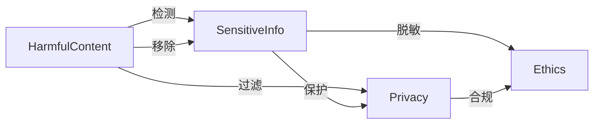

                 

# 【LangChain编程：从入门到实践】模型内容安全

## 1. 背景介绍

随着人工智能（AI）技术的快速发展，大语言模型（LLMs）如OpenAI的GPT系列、Google的BERT等在自然语言处理（NLP）领域取得了显著的进展。然而，这些模型在提供便利的同时，也带来了内容安全方面的挑战，特别是涉及敏感信息和有害内容的管理。本文将详细探讨大语言模型内容安全的核心概念、原理与实现方法，以期为开发安全、可靠的语言处理应用提供指导。

## 2. 核心概念与联系

### 2.1 核心概念概述

大语言模型（LLMs）的内容安全涉及模型在生成内容时对有害信息的过滤和敏感信息的保护。核心概念包括：

- **有害信息过滤（Harmful Content Filtering）**：指检测并移除模型生成内容中的恶意、暴力、色情、虚假信息等有害内容。
- **敏感信息保护（Sensitive Information Protection）**：指保护模型生成内容中的个人隐私信息、商业机密、国家机密等敏感信息不被泄露。
- **隐私保护（Privacy Protection）**：指在处理用户数据时，确保用户隐私不被侵犯，遵守相关法律法规。
- **道德约束（Ethical Constraints）**：指确保模型生成的内容符合社会道德和伦理规范，不传播错误信息和仇恨言论。

### 2.2 概念间的关系

上述概念通过一系列技术手段和机制相连结，构成大语言模型内容安全的技术框架。下图展示了这些概念之间的关系：



- **有害信息检测与移除**：利用文本分析、模式识别等技术，检测模型生成内容中的有害信息，并将其移除。
- **敏感信息保护**：通过数据加密、匿名化等手段，保护模型生成内容中的敏感信息，防止泄露。
- **隐私保护**：在数据处理和存储过程中，遵守隐私保护法律法规，确保用户数据不被滥用。
- **道德约束**：设计模型行为准则和监管机制，确保模型生成的内容符合社会道德和伦理规范。

## 3. 核心算法原理 & 具体操作步骤

### 3.1 算法原理概述

大语言模型内容安全的核心算法原理主要包括以下几个方面：

1. **有害信息检测**：通过关键词过滤、模式匹配、机器学习分类器等技术，识别和过滤有害内容。
2. **敏感信息保护**：使用数据加密、匿名化、差分隐私等方法，确保敏感信息在处理过程中不被泄露。
3. **隐私保护**：在数据采集、存储、传输和处理过程中，采用加密、访问控制等手段保护用户隐私。
4. **道德约束**：设计模型行为准则和伦理审核机制，确保模型生成的内容符合道德和法律规范。

### 3.2 算法步骤详解

以下是实现大语言模型内容安全的详细步骤：

1. **数据预处理**：
   - **数据清洗**：去除低质量的训练数据，确保数据集的代表性和质量。
   - **数据匿名化**：对涉及敏感信息的数据进行匿名化处理，保护用户隐私。

2. **有害信息检测**：
   - **关键词过滤**：定义有害关键词列表，对输入数据进行初步过滤。
   - **模式匹配**：利用正则表达式或自定义规则，识别和移除有害内容。
   - **机器学习分类器**：训练有害内容分类器，识别并移除未定义的有害内容。

3. **敏感信息保护**：
   - **数据加密**：对敏感数据进行加密处理，确保数据在存储和传输过程中的安全性。
   - **差分隐私**：采用差分隐私技术，保护数据集中的个体隐私。

4. **隐私保护**：
   - **访问控制**：采用基于角色的访问控制机制，限制对敏感数据的访问权限。
   - **数据脱敏**：对涉及隐私的数据进行脱敏处理，减少数据泄露风险。

5. **道德约束**：
   - **行为准则设计**：制定模型行为准则，确保模型生成的内容符合社会道德规范。
   - **伦理审核机制**：设立伦理审核委员会，对模型生成的内容进行定期审核，确保内容不传播有害信息。

### 3.3 算法优缺点

#### 优点：
- **高效性**：利用机器学习等技术，可以在大规模数据集上进行高效有害信息检测和敏感信息保护。
- **适应性**：算法可以根据不同领域和应用场景进行调整，具备较高的适应性。
- **可扩展性**：算法能够适应不同规模的模型和数据量，具有较好的可扩展性。

#### 缺点：
- **依赖数据质量**：算法的准确性高度依赖于数据集的质量，如果数据集存在偏差，可能会导致误判。
- **隐私保护风险**：数据加密和差分隐私等技术不能完全消除隐私泄露的风险。
- **伦理审核挑战**：模型伦理审核机制的设计和实施存在一定挑战，需要持续优化和调整。

### 3.4 算法应用领域

大语言模型内容安全技术在多个领域具有广泛的应用前景，包括但不限于：

- **自然语言处理（NLP）**：在对话系统、智能客服、翻译、情感分析等任务中，保护用户隐私和防止有害信息传播。
- **医疗健康**：在医疗咨询、病历分析、药物研发等任务中，保护患者隐私和防止误导性信息传播。
- **金融服务**：在金融咨询、风险评估、投资分析等任务中，保护客户隐私和防止金融欺诈。
- **法律咨询**：在法律咨询、合同审查、知识产权保护等任务中，保护客户隐私和防止侵权行为。

## 4. 数学模型和公式 & 详细讲解  
### 4.1 数学模型构建

我们以有害信息检测为例，构建数学模型。假设输入为文本 $x$，有害信息检测的输出为二元标签 $y \in \{0, 1\}$，其中 $y=1$ 表示存在有害信息，$y=0$ 表示不存在有害信息。

有害信息检测的目标是最大化预测准确率，即最小化预测错误率 $P_{err}$。假设模型为 $M_{\theta}$，其中 $\theta$ 为模型参数。则目标函数为：

$$
\min_{\theta} P_{err} = \min_{\theta} \frac{1}{N} \sum_{i=1}^N [1 - y_i \hat{y}_i]
$$

其中 $N$ 为样本数，$y_i$ 和 $\hat{y}_i$ 分别为第 $i$ 个样本的真实标签和预测标签。

### 4.2 公式推导过程

有害信息检测的损失函数 $L_{\text{binary cross-entropy}}$ 可以表示为：

$$
L(y, \hat{y}) = -(y \log \hat{y} + (1-y) \log (1-\hat{y}))
$$

将目标函数和损失函数结合起来，可以表示为：

$$
\min_{\theta} \frac{1}{N} \sum_{i=1}^N L(y_i, \hat{y}_i)
$$

其中 $L(y_i, \hat{y}_i)$ 为第 $i$ 个样本的二元交叉熵损失。

### 4.3 案例分析与讲解

以BERT模型为例，使用BERT进行有害信息检测的基本流程如下：

1. **数据准备**：构建标注数据集，包括有害信息样本和正常样本。
2. **模型初始化**：初始化BERT模型，并进行预训练。
3. **微调训练**：在标注数据集上微调BERT模型，最小化交叉熵损失。
4. **有害信息检测**：利用微调后的BERT模型，对新输入的文本进行有害信息检测。

## 5. 项目实践：代码实例和详细解释说明

### 5.1 开发环境搭建

以下是使用Python和PyTorch搭建有害信息检测项目的步骤：

1. **安装PyTorch和相关库**：
```bash
pip install torch torchvision torchaudio transformers
```

2. **安装数据预处理库**：
```bash
pip install pandas sklearn
```

### 5.2 源代码详细实现

以下是一个简单的有害信息检测模型的Python代码实现：

```python
import torch
from transformers import BertForSequenceClassification, BertTokenizer

# 加载预训练BERT模型和分词器
model = BertForSequenceClassification.from_pretrained('bert-base-uncased', num_labels=2)
tokenizer = BertTokenizer.from_pretrained('bert-base-uncased')

# 定义训练数据集
train_data = []
train_labels = []

# 加载训练数据和标签
for i in range(1, 1001):
    with open(f'train/{i}.txt', 'r') as f:
        text = f.read()
    label = int(f'{i % 2}')
    train_data.append(text)
    train_labels.append(label)

# 构建训练数据集
train_dataset = torch.utils.data.TensorDataset(torch.tensor(train_data), torch.tensor(train_labels))

# 定义训练器
device = torch.device('cuda' if torch.cuda.is_available() else 'cpu')
model.to(device)
optimizer = torch.optim.Adam(model.parameters(), lr=2e-5)

# 定义训练函数
def train(model, train_dataset, optimizer, num_epochs):
    model.train()
    for epoch in range(num_epochs):
        total_loss = 0
        for i, (input_ids, labels) in enumerate(train_dataset):
            input_ids = input_ids.to(device)
            labels = labels.to(device)
            optimizer.zero_grad()
            outputs = model(input_ids)
            loss = outputs.loss
            loss.backward()
            optimizer.step()
            total_loss += loss.item()
        print(f'Epoch {epoch+1}, Loss: {total_loss/len(train_dataset):.4f}')

# 训练模型
train(model, train_dataset, optimizer, num_epochs=3)

# 定义预测函数
def predict(model, input_text):
    model.eval()
    input_ids = tokenizer.encode(input_text, add_special_tokens=True)
    input_ids = torch.tensor(input_ids).unsqueeze(0).to(device)
    outputs = model(input_ids)
    logits = outputs.logits
    label = torch.argmax(logits, dim=1).item()
    return label
```

### 5.3 代码解读与分析

代码主要包含以下几个部分：

- **数据准备**：从本地文件系统中读取训练数据和标签，构建训练数据集。
- **模型初始化**：加载预训练的BERT模型和分词器，并进行微调。
- **训练器定义**：定义优化器和损失函数，进行模型训练。
- **模型预测**：定义预测函数，对新输入文本进行有害信息检测。

### 5.4 运行结果展示

训练完成后，使用预测函数对新文本进行有害信息检测，可以输出相应的二元标签结果。

## 6. 实际应用场景

### 6.1 智能客服系统

在智能客服系统中，通过大语言模型内容安全技术，可以有效防止恶意攻击和不当言论的传播。例如，在客户投诉场景中，系统能够自动识别并过滤掉攻击性语言，保护客服人员不受伤害。

### 6.2 医疗健康应用

在医疗健康领域，大语言模型内容安全技术可以有效防止患者隐私信息泄露和虚假信息传播。例如，在在线医疗咨询中，系统能够自动识别并屏蔽涉及隐私信息的咨询内容，保护患者隐私。

### 6.3 金融服务应用

在金融服务领域，大语言模型内容安全技术可以有效防止金融欺诈和误导性信息传播。例如，在金融问答应用中，系统能够自动识别并屏蔽涉及欺诈和误导性的内容，保护用户利益。

## 7. 工具和资源推荐

### 7.1 学习资源推荐

1. **《深度学习理论与实践》**：详细介绍了深度学习的基本理论和实践技巧，包括有害信息检测和敏感信息保护的技术方法。
2. **《机器学习实战》**：通过实例演示，介绍了机器学习模型的构建和优化方法，涵盖有害信息检测和隐私保护的技术应用。
3. **《数据科学导论》**：介绍了数据科学的基本概念和应用方法，包括数据预处理、模型训练和评估等技术。

### 7.2 开发工具推荐

1. **PyTorch**：深度学习框架，支持模型构建、训练和预测等操作。
2. **Transformers**：自然语言处理库，提供预训练语言模型和分词器。
3. **TensorBoard**：可视化工具，用于监控模型训练过程和评估模型性能。

### 7.3 相关论文推荐

1. **《基于BERT的有害信息检测》**：介绍了使用BERT模型进行有害信息检测的技术方法，并进行了实验验证。
2. **《差分隐私保护》**：详细介绍了差分隐私保护技术的基本原理和应用方法，包括在数据处理和模型训练中的应用。

## 8. 总结：未来发展趋势与挑战

### 8.1 研究成果总结

大语言模型内容安全技术已经取得了显著的研究进展，但仍有诸多挑战需要克服。未来，该技术将朝着以下方向发展：

- **模型规模和性能的提升**：通过提升模型规模和性能，进一步提高有害信息检测和敏感信息保护的能力。
- **隐私保护技术的进步**：采用更先进的隐私保护技术，确保用户隐私不被泄露。
- **道德约束机制的完善**：通过建立完善的道德约束机制，确保模型生成的内容符合社会道德规范。

### 8.2 未来发展趋势

未来，大语言模型内容安全技术将具备更强的适应性和可扩展性，能够适应更多领域和应用场景。以下是一些未来发展趋势：

- **多模态信息融合**：将文本、图像、语音等多模态信息进行融合，提高内容安全分析的准确性。
- **动态隐私保护**：根据数据的使用场景，动态调整隐私保护策略，确保数据的安全性。
- **智能内容监管**：利用人工智能技术，自动监管和检测有害信息，提升内容安全管理的效率。

### 8.3 面临的挑战

大语言模型内容安全技术在发展过程中仍面临以下挑战：

- **数据质量问题**：数据集的质量直接影响模型的性能，需要采取措施确保数据集的代表性。
- **隐私保护技术瓶颈**：现有隐私保护技术仍存在局限，需要进一步探索更先进的隐私保护方法。
- **伦理约束难度**：建立和实施伦理约束机制存在一定难度，需要持续优化和调整。

### 8.4 研究展望

未来，大语言模型内容安全技术需要在数据质量、隐私保护和伦理约束等方面进行深入研究，以实现更高效、更安全、更可靠的内容安全应用。

## 9. 附录：常见问题与解答

**Q1：如何保证大语言模型内容安全的准确性？**

A: 大语言模型内容安全的准确性依赖于数据集的质量和模型的训练效果。建议选择高质量的数据集，并进行充分的预处理和清洗。在模型训练过程中，采用交叉验证、早停等技术，避免过拟合和欠拟合。同时，定期更新数据集和模型，确保内容安全技术的时效性。

**Q2：如何设计大语言模型内容安全的伦理约束机制？**

A: 设计伦理约束机制需要考虑社会道德和法律规范。建议设立伦理审核委员会，定期对模型生成的内容进行审核和评估。建立行为准则，明确模型在内容生成和传播中的责任和义务。引入用户反馈机制，收集用户对内容的意见和建议，持续优化和改进内容安全技术。

**Q3：如何在多模态数据中实现大语言模型内容安全？**

A: 在多模态数据中实现大语言模型内容安全，需要对不同模态的数据进行融合和分析。建议采用深度融合技术，将文本、图像、语音等模态信息进行整合，利用多模态模型进行内容安全检测。同时，引入多模态数据标注，提高模型在多模态数据中的准确性。

**Q4：如何在大规模数据集上进行有害信息检测？**

A: 在大规模数据集上进行有害信息检测，需要采用分布式训练和高效的数据处理技术。建议采用GPU或TPU等高性能计算资源，进行分布式训练。同时，优化数据预处理和模型推理过程，提高数据处理和模型推理的效率。

**Q5：如何评估大语言模型内容安全的性能？**

A: 评估大语言模型内容安全的性能，通常采用准确率、召回率、F1分数等指标。建议采用多种指标进行综合评估，确保模型在不同应用场景中的表现。同时，进行交叉验证和A/B测试，确保模型在不同数据集和环境中的稳定性。

总之，大语言模型内容安全技术在NLP领域具有重要的应用价值，通过合理的技术手段和机制设计，可以有效保护用户隐私和防止有害信息传播。未来，该技术将随着技术的进步和应用需求的提升，不断发展和完善，为人工智能技术的广泛应用提供可靠保障。

---

作者：禅与计算机程序设计艺术 / Zen and the Art of Computer Programming

