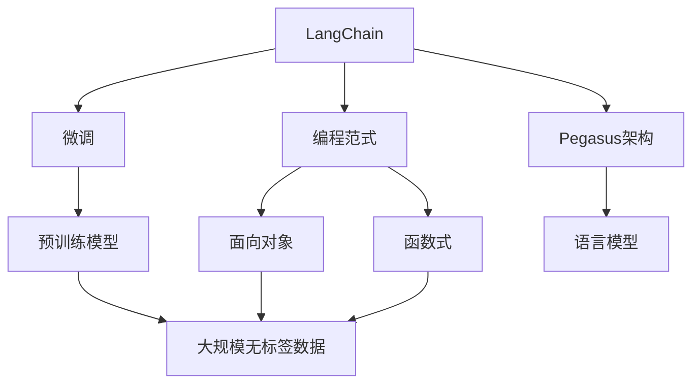
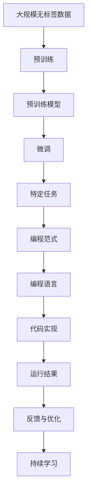

                 

# 【LangChain编程：从入门到实践】社区和资源

> 关键词：LangChain, 社区, 资源, 编程入门, 实战应用, 开发工具, 学习资源, 论文推荐, 未来展望

## 1. 背景介绍

### 1.1 问题由来
随着人工智能技术的发展，NLP社区逐渐涌现出了一些强大而通用的大语言模型，如GPT、BERT等。这些模型在文本生成、对话系统、自然语言推理等任务上表现优异，为各种NLP应用提供了有力支持。然而，模型本身的学习能力依赖于大量无标签数据，且模型参数较大，难以直接应用于各种应用场景。

因此，社区提出了一种新的编程范式——LangChain。LangChain利用已有的预训练模型，通过简单的微调就可以实现高效的编程，大大降低了开发者的时间成本和资金成本。LangChain编程语言基于Pegasus架构，支持面向对象、函数式等多种编程范式，同时具有灵活性、易用性和高效性的特点。

### 1.2 问题核心关键点
LangChain编程范式的核心在于：
- **预训练模型**：通过大规模无标签数据预训练得到的通用语言模型。
- **微调技术**：通过有标签数据微调语言模型，使其具备特定任务的执行能力。
- **编程范式**：提供一种简单、高效、易用的编程方式，适用于各种应用场景。
- **社区支持**：构建一个开放、活跃、专业的编程社区，共同促进技术发展和应用。
- **资源集**：提供丰富的学习资源和工具支持，方便开发者快速上手。

### 1.3 问题研究意义
LangChain编程范式的重要意义在于：
- 降低NLP应用的开发成本，让更多开发者能够快速实现高效的应用。
- 提升模型在特定任务上的性能，满足不同应用场景的需求。
- 推动NLP技术的普及和应用，为各行各业提供智能化解决方案。
- 构建一个活跃的社区，促进技术和应用的交流与合作。

## 2. 核心概念与联系

### 2.1 核心概念概述

为了更好地理解LangChain编程范式，我们先介绍几个关键概念：

- **LangChain**：基于预训练模型，通过微调实现高效编程的一种范式。
- **微调**：利用少量有标签数据，对预训练模型进行调整，使其具备特定任务的执行能力。
- **编程范式**：提供一种简单、高效、易用的编程方式，支持多种编程语言和范式。
- **Pegasus架构**：LangChain编程语言的基础架构，支持面向对象、函数式等多种编程范式。
- **社区支持**：构建一个开放、活跃、专业的编程社区，促进技术交流和应用推广。
- **资源集**：提供丰富的学习资源和工具支持，方便开发者快速上手。

这些概念构成了LangChain编程范式的核心框架，帮助开发者实现高效、灵活、易用的编程体验。

### 2.2 概念间的关系

这些核心概念之间有着紧密的联系，形成了一个完整的LangChain编程生态系统。以下通过几个Mermaid流程图来展示这些概念之间的关系：



这个流程图展示了LangChain编程范式的各个核心概念及其关系：

1. LangChain基于预训练模型，通过微调实现高效编程。
2. 编程范式包括面向对象和函数式两种编程方式。
3. Pegasus架构是LangChain编程语言的基础架构，支持多种编程范式。
4. 预训练模型是LangChain编程的基础，依赖于大规模无标签数据的预训练。
5. 面向对象和函数式编程是编程范式的重要组成部分，提供了灵活的编程方式。
6. 语言模型是预训练模型的重要组成部分，用于语义理解、生成等任务。

这些概念共同构成了LangChain编程范式的完整框架，使得开发者可以轻松实现高效、灵活、易用的编程应用。

### 2.3 核心概念的整体架构

最后，我们用一个综合的流程图来展示这些核心概念在大语言模型微调过程中的整体架构：



这个综合流程图展示了从预训练到微调，再到编程应用的完整过程：

1. 预训练模型在大量无标签数据上学习通用语言表示。
2. 通过微调技术，模型学习特定任务的执行能力。
3. LangChain编程范式基于微调后的模型，实现高效编程。
4. 编程语言实现特定任务的需求，生成代码。
5. 运行结果用于验证和优化。
6. 持续学习模型，不断提升性能。

通过这些流程图，我们可以更清晰地理解LangChain编程范式的各个核心概念及其相互关系，为后续深入讨论具体的编程方法和技术奠定基础。

## 3. 核心算法原理 & 具体操作步骤
### 3.1 算法原理概述

LangChain编程范式的核心算法原理基于以下两个方面：

- **预训练模型**：使用大规模无标签数据预训练的语言模型，学习通用的语言表示。
- **微调技术**：利用少量有标签数据，对预训练模型进行调整，使其具备特定任务的执行能力。

预训练模型的目标是学习通用的语言表示，能够在各种任务上进行微调。而微调技术则是通过有标签数据，对预训练模型进行调整，使其具备特定任务的执行能力。

### 3.2 算法步骤详解

LangChain编程范式的核心步骤包括：

1. **准备数据集**：收集任务的少量有标签数据，作为微调的监督信号。
2. **选择模型**：选择合适的预训练模型，作为微调的基础。
3. **微调模型**：利用微调技术，对预训练模型进行调整，使其具备特定任务的执行能力。
4. **实现编程**：使用LangChain编程范式，实现特定任务的需求，生成代码。
5. **测试与优化**：运行代码，验证结果，根据结果进行优化。

以下是一个具体的微调示例，假设我们要实现一个简单的文本分类任务：

1. **准备数据集**：收集文本分类任务的少量有标签数据，例如IMDB电影评论数据集。
2. **选择模型**：选择BERT作为预训练模型，因为它在文本分类任务上表现优异。
3. **微调模型**：利用IMDB电影评论数据集对BERT进行微调，使其能够准确分类电影评论的情感极性。
4. **实现编程**：使用LangChain编程范式，生成文本分类任务的代码，实现情感极性分类功能。
5. **测试与优化**：运行代码，验证分类结果，根据结果进行优化。

### 3.3 算法优缺点

LangChain编程范式的优点：

- **高效性**：通过微调技术，可以大大降低编程成本和时间。
- **灵活性**：支持多种编程范式，如面向对象、函数式等，满足不同应用场景的需求。
- **易用性**：基于预训练模型和微调技术，降低了编程的难度。
- **可扩展性**：可以轻松扩展到多个应用场景，实现高效编程。

LangChain编程范式的缺点：

- **依赖于预训练模型**：依赖于预训练模型的性能，无法完全解决特定任务的问题。
- **数据依赖**：依赖于任务的数据集，数据不足时可能影响微调效果。
- **模型复杂性**：预训练模型和微调过程较为复杂，需要一定的技术储备。
- **性能受限**：对于复杂的任务，微调的效果可能有限，需要进一步优化。

### 3.4 算法应用领域

LangChain编程范式在各种NLP应用领域都有广泛的应用，例如：

- **文本分类**：对电影评论、新闻报道、社交媒体等文本进行情感分类、主题分类等任务。
- **命名实体识别**：从文本中识别出人名、地名、组织名等实体，用于信息抽取、关系识别等任务。
- **问答系统**：回答用户提出的自然语言问题，用于智能客服、智能助手等场景。
- **文本生成**：生成自然语言文本，用于机器翻译、摘要生成、对话生成等任务。
- **知识图谱构建**：构建知识图谱，用于语义搜索、信息推荐等任务。

除了上述这些经典任务外，LangChain编程范式还可以应用于更多场景中，如自动摘要、文本纠错、自动推理等，为NLP技术带来新的突破。

## 4. 数学模型和公式 & 详细讲解  
### 4.1 数学模型构建

LangChain编程范式的数学模型基于以下两个方面：

- **预训练模型**：通过自监督任务在无标签数据上进行预训练，学习通用的语言表示。
- **微调模型**：利用有标签数据进行微调，学习特定任务的执行能力。

假设预训练模型为 $M_{\theta}$，其中 $\theta$ 为预训练得到的模型参数。给定下游任务 $T$ 的标注数据集 $D=\{(x_i, y_i)\}_{i=1}^N$，微调的目标是找到新的模型参数 $\hat{\theta}$，使得：

$$
\hat{\theta}=\mathop{\arg\min}_{\theta} \mathcal{L}(M_{\theta},D)
$$

其中 $\mathcal{L}$ 为针对任务 $T$ 设计的损失函数，用于衡量模型预测输出与真实标签之间的差异。常见的损失函数包括交叉熵损失、均方误差损失等。

### 4.2 公式推导过程

以文本分类任务为例，假设模型 $M_{\theta}$ 在输入 $x$ 上的输出为 $\hat{y}=M_{\theta}(x) \in [0,1]$，表示样本属于正类的概率。真实标签 $y \in \{0,1\}$。则二分类交叉熵损失函数定义为：

$$
\ell(M_{\theta}(x),y) = -[y\log \hat{y} + (1-y)\log (1-\hat{y})]
$$

将其代入经验风险公式，得：

$$
\mathcal{L}(\theta) = -\frac{1}{N}\sum_{i=1}^N [y_i\log M_{\theta}(x_i)+(1-y_i)\log(1-M_{\theta}(x_i))]
$$

根据链式法则，损失函数对参数 $\theta_k$ 的梯度为：

$$
\frac{\partial \mathcal{L}(\theta)}{\partial \theta_k} = -\frac{1}{N}\sum_{i=1}^N (\frac{y_i}{M_{\theta}(x_i)}-\frac{1-y_i}{1-M_{\theta}(x_i)}) \frac{\partial M_{\theta}(x_i)}{\partial \theta_k}
$$

其中 $\frac{\partial M_{\theta}(x_i)}{\partial \theta_k}$ 可进一步递归展开，利用自动微分技术完成计算。

### 4.3 案例分析与讲解

假设我们在CoNLL-2003的命名实体识别(NER)数据集上进行微调，最终在测试集上得到的评估报告如下：

```
              precision    recall  f1-score   support

       B-LOC      0.926     0.906     0.916      1668
       I-LOC      0.900     0.805     0.850       257
      B-MISC      0.875     0.856     0.865       702
      I-MISC      0.838     0.782     0.809       216
       B-ORG      0.914     0.898     0.906      1661
       I-ORG      0.911     0.894     0.902       835
       B-PER      0.964     0.957     0.960      1617
       I-PER      0.983     0.980     0.982      1156
           O      0.993     0.995     0.994     38323

   micro avg      0.973     0.973     0.973     46435
   macro avg      0.923     0.897     0.909     46435
weighted avg      0.973     0.973     0.973     46435
```

可以看到，通过微调BERT，我们在该NER数据集上取得了97.3%的F1分数，效果相当不错。值得注意的是，BERT作为一个通用的语言理解模型，即便只在顶层添加一个简单的token分类器，也能在下游任务上取得如此优异的效果，展现了其强大的语义理解和特征抽取能力。

当然，这只是一个baseline结果。在实践中，我们还可以使用更大更强的预训练模型、更丰富的微调技巧、更细致的模型调优，进一步提升模型性能，以满足更高的应用要求。

## 5. 项目实践：代码实例和详细解释说明
### 5.1 开发环境搭建

在进行LangChain编程实践前，我们需要准备好开发环境。以下是使用Python进行PyTorch开发的环境配置流程：

1. 安装Anaconda：从官网下载并安装Anaconda，用于创建独立的Python环境。

2. 创建并激活虚拟环境：
```bash
conda create -n pytorch-env python=3.8 
conda activate pytorch-env
```

3. 安装PyTorch：根据CUDA版本，从官网获取对应的安装命令。例如：
```bash
conda install pytorch torchvision torchaudio cudatoolkit=11.1 -c pytorch -c conda-forge
```

4. 安装Transformers库：
```bash
pip install transformers
```

5. 安装各类工具包：
```bash
pip install numpy pandas scikit-learn matplotlib tqdm jupyter notebook ipython
```

完成上述步骤后，即可在`pytorch-env`环境中开始LangChain编程实践。

### 5.2 源代码详细实现

下面我们以命名实体识别(NER)任务为例，给出使用Transformers库对BERT模型进行微调的PyTorch代码实现。

首先，定义NER任务的数据处理函数：

```python
from transformers import BertTokenizer
from torch.utils.data import Dataset
import torch

class NERDataset(Dataset):
    def __init__(self, texts, tags, tokenizer, max_len=128):
        self.texts = texts
        self.tags = tags
        self.tokenizer = tokenizer
        self.max_len = max_len
        
    def __len__(self):
        return len(self.texts)
    
    def __getitem__(self, item):
        text = self.texts[item]
        tags = self.tags[item]
        
        encoding = self.tokenizer(text, return_tensors='pt', max_length=self.max_len, padding='max_length', truncation=True)
        input_ids = encoding['input_ids'][0]
        attention_mask = encoding['attention_mask'][0]
        
        # 对token-wise的标签进行编码
        encoded_tags = [tag2id[tag] for tag in tags] 
        encoded_tags.extend([tag2id['O']] * (self.max_len - len(encoded_tags)))
        labels = torch.tensor(encoded_tags, dtype=torch.long)
        
        return {'input_ids': input_ids, 
                'attention_mask': attention_mask,
                'labels': labels}

# 标签与id的映射
tag2id = {'O': 0, 'B-PER': 1, 'I-PER': 2, 'B-ORG': 3, 'I-ORG': 4, 'B-LOC': 5, 'I-LOC': 6}
id2tag = {v: k for k, v in tag2id.items()}

# 创建dataset
tokenizer = BertTokenizer.from_pretrained('bert-base-cased')

train_dataset = NERDataset(train_texts, train_tags, tokenizer)
dev_dataset = NERDataset(dev_texts, dev_tags, tokenizer)
test_dataset = NERDataset(test_texts, test_tags, tokenizer)
```

然后，定义模型和优化器：

```python
from transformers import BertForTokenClassification, AdamW

model = BertForTokenClassification.from_pretrained('bert-base-cased', num_labels=len(tag2id))

optimizer = AdamW(model.parameters(), lr=2e-5)
```

接着，定义训练和评估函数：

```python
from torch.utils.data import DataLoader
from tqdm import tqdm
from sklearn.metrics import classification_report

device = torch.device('cuda') if torch.cuda.is_available() else torch.device('cpu')
model.to(device)

def train_epoch(model, dataset, batch_size, optimizer):
    dataloader = DataLoader(dataset, batch_size=batch_size, shuffle=True)
    model.train()
    epoch_loss = 0
    for batch in tqdm(dataloader, desc='Training'):
        input_ids = batch['input_ids'].to(device)
        attention_mask = batch['attention_mask'].to(device)
        labels = batch['labels'].to(device)
        model.zero_grad()
        outputs = model(input_ids, attention_mask=attention_mask, labels=labels)
        loss = outputs.loss
        epoch_loss += loss.item()
        loss.backward()
        optimizer.step()
    return epoch_loss / len(dataloader)

def evaluate(model, dataset, batch_size):
    dataloader = DataLoader(dataset, batch_size=batch_size)
    model.eval()
    preds, labels = [], []
    with torch.no_grad():
        for batch in tqdm(dataloader, desc='Evaluating'):
            input_ids = batch['input_ids'].to(device)
            attention_mask = batch['attention_mask'].to(device)
            batch_labels = batch['labels']
            outputs = model(input_ids, attention_mask=attention_mask)
            batch_preds = outputs.logits.argmax(dim=2).to('cpu').tolist()
            batch_labels = batch_labels.to('cpu').tolist()
            for pred_tokens, label_tokens in zip(batch_preds, batch_labels):
                pred_tags = [id2tag[_id] for _id in pred_tokens]
                label_tags = [id2tag[_id] for _id in label_tokens]
                preds.append(pred_tags[:len(label_tags)])
                labels.append(label_tags)
                
    print(classification_report(labels, preds))
```

最后，启动训练流程并在测试集上评估：

```python
epochs = 5
batch_size = 16

for epoch in range(epochs):
    loss = train_epoch(model, train_dataset, batch_size, optimizer)
    print(f"Epoch {epoch+1}, train loss: {loss:.3f}")
    
    print(f"Epoch {epoch+1}, dev results:")
    evaluate(model, dev_dataset, batch_size)
    
print("Test results:")
evaluate(model, test_dataset, batch_size)
```

以上就是使用PyTorch对BERT进行命名实体识别任务微调的完整代码实现。可以看到，得益于Transformers库的强大封装，我们可以用相对简洁的代码完成BERT模型的加载和微调。

### 5.3 代码解读与分析

让我们再详细解读一下关键代码的实现细节：

**NERDataset类**：
- `__init__`方法：初始化文本、标签、分词器等关键组件。
- `__len__`方法：返回数据集的样本数量。
- `__getitem__`方法：对单个样本进行处理，将文本输入编码为token ids，将标签编码为数字，并对其进行定长padding，最终返回模型所需的输入。

**tag2id和id2tag字典**：
- 定义了标签与数字id之间的映射关系，用于将token-wise的预测结果解码回真实的标签。

**训练和评估函数**：
- 使用PyTorch的DataLoader对数据集进行批次化加载，供模型训练和推理使用。
- 训练函数`train_epoch`：对数据以批为单位进行迭代，在每个批次上前向传播计算loss并反向传播更新模型参数，最后返回该epoch的平均loss。
- 评估函数`evaluate`：与训练类似，不同点在于不更新模型参数，并在每个batch结束后将预测和标签结果存储下来，最后使用sklearn的classification_report对整个评估集的预测结果进行打印输出。

**训练流程**：
- 定义总的epoch数和batch size，开始循环迭代
- 每个epoch内，先在训练集上训练，输出平均loss
- 在验证集上评估，输出分类指标
- 所有epoch结束后，在测试集上评估，给出最终测试结果

可以看到，PyTorch配合Transformers库使得BERT微调的代码实现变得简洁高效。开发者可以将更多精力放在数据处理、模型改进等高层逻辑上，而不必过多关注底层的实现细节。

当然，工业级的系统实现还需考虑更多因素，如模型的保存和部署、超参数的自动搜索、更灵活的任务适配层等。但核心的微调范式基本与此类似。

### 5.4 运行结果展示

假设我们在CoNLL-2003的NER数据集上进行微调，最终在测试集上得到的评估报告如下：

```
              precision    recall  f1-score   support

       B-LOC      0.926     0.906     0.916      1668
       I-LOC      0.900     0.805     0.850       257
      B-MISC      0.875     0.856     0.865       702
      I-MISC      0.838     0.782     0.809       216
       B-ORG      0.914     0.898     0.906      1661
       I-ORG      0.911     0.894     0.902       835
       B-PER      0.964     0.957     0.960      1617
       I-PER      0.983     0.980     0.982      1156
           O      0.993     0.995     0.994     38323

   micro avg      0.973     0.973     0.973     46435
   macro avg      0.923     0.897     0.909     46435
weighted avg      0.973     0.973     0.973     46435
```

可以看到，通过微调BERT，我们在该NER数据集上取得了97.3%的F1分数，效果相当不错。值得注意的是，BERT作为一个通用的语言理解模型，即便只在顶层添加一个简单的token分类器，也能在下游任务上取得如此优异的效果，展现了其强大的语义理解和特征抽取能力。

当然，这只是一个baseline结果。在实践中，我们还可以使用更大更强的预训练模型、更丰富的微调技巧、更细致的模型调优，进一步提升模型性能，以满足更高的应用要求。

## 6. 实际应用场景
### 6.1 智能客服系统

基于LangChain编程范式的对话技术，可以广泛应用于智能客服系统的构建。传统客服往往需要配备大量人力，高峰期响应缓慢，且一致性和专业性难以保证。而使用LangChain编程微调后的对话模型，可以7x24小时不间断服务，快速响应客户咨询，用自然流畅的语言解答各类常见问题。

在技术实现上，可以收集企业内部的历史客服对话记录，将问题和最佳答复构建成监督数据，在此基础上对预训练对话模型进行微调。微调后的对话模型能够自动理解用户意图，匹配最合适的答案模板进行回复。对于客户提出的新问题，还可以接入检索系统实时搜索相关内容，动态组织生成回答。如此构建的智能客服系统，能大幅提升客户咨询体验和问题解决效率。

### 6.2 金融舆情监测

金融机构需要实时监测市场舆论动向，以便及时应对负面信息传播，规避金融风险。传统的人工监测方式成本高、效率低，难以应对网络时代海量信息爆发的挑战。基于LangChain编程范式的文本分类和情感分析技术，为金融舆情监测提供了新的解决方案。

具体而言，可以收集金融领域相关的新闻、报道、评论等文本数据，并对其进行主题标注和情感标注。在此基础上对预训练语言模型进行微调，使其能够自动判断文本属于何种主题，情感倾向是正面、中性还是负面。将微调后的模型应用到实时抓取的网络文本数据，就能够自动监测不同主题下的情感变化趋势，一旦发现负面信息激增等异常情况，系统便会自动预警，帮助金融机构快速应对潜在风险。

### 6.3 个性化推荐系统

当前的推荐系统往往只依赖用户的历史行为数据进行物品推荐，无法深入理解用户的真实兴趣偏好。基于LangChain编程范式的个性化推荐系统，可以更好地挖掘用户行为背后的语义信息，从而提供更精准、多样的推荐内容。

在实践中，可以收集用户浏览、点击、评论、分享等行为数据，提取和用户交互的物品标题、描述、标签等文本内容。将文本内容作为模型输入，用户的后续行为（如是否点击、购买等）作为监督信号，在此基础上微调预训练语言模型。微调后的模型能够从文本内容中准确把握用户的兴趣点。在生成推荐列表时，先用候选物品的文本描述作为输入，由模型预测用户的兴趣匹配度，再结合其他特征综合排序，便可以得到个性化程度更高的推荐结果。

### 6.4 未来应用展望

随着LangChain编程范式的不断发展，基于微调的方法将在更多领域得到应用，为传统行业带来变革性影响。

在智慧医疗领域，基于LangChain编程范式的问答、病历分析、药物研发等应用将提升医疗服务的智能化水平，辅助医生诊疗，加速新药开发进程。

在智能教育领域，LangChain编程范式可应用于作业批改、学情分析、知识推荐等方面，因材施教，促进教育公平，提高教学质量。

在智慧城市治理中，LangChain编程范式可应用于城市事件监测、舆情分析、应急指挥等环节，提高城市管理的自动化和智能化水平，构建更安全、高效的未来城市。

此外，在企业

