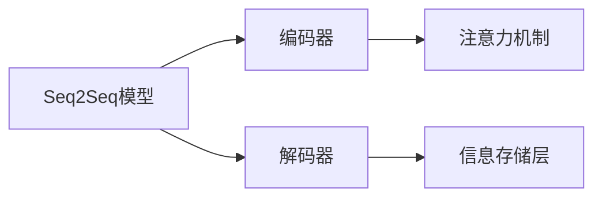
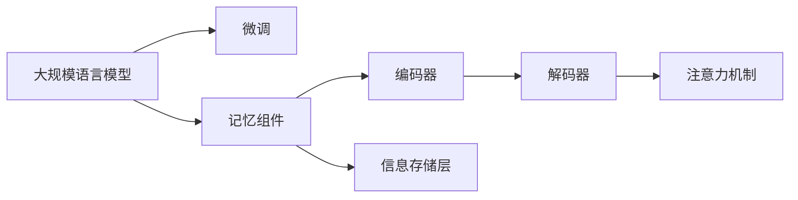

                 

# 【LangChain编程：从入门到实践】记忆组件的应用

## 1. 背景介绍

在自然语言处理（NLP）领域，尤其是对话系统和生成任务中，如何有效利用先前的对话历史和交互信息，构建连贯的上下文，是提升系统性能和用户体验的关键。这种需求催生了"记忆"组件（Memory Component）的概念，旨在帮助模型在处理对话时保存和利用历史信息。

记忆组件通过在模型中引入额外的信息存储和检索机制，能够在处理过程中保留和利用先前对话信息，从而提升模型的交互连贯性和记忆能力。

本博客旨在系统性地介绍记忆组件的核心概念、工作原理、实现方法，并通过实际项目案例，展示记忆组件在NLP任务中的应用，以及其在开发过程中需要注意的关键点和挑战。

## 2. 核心概念与联系

### 2.1 核心概念概述

记忆组件的实现主要依赖于序列到序列（Seq2Seq）模型，通过在模型结构中增加额外的注意力机制和信息存储层，来实现对先前对话信息的历史记录和利用。

- **Seq2Seq模型**：用于处理序列数据的深度学习模型，包括编码器和解码器两部分，常用于机器翻译、对话系统等任务。
- **注意力机制**：用于关注输入序列中不同位置的重要信息，常用于机器翻译和对话系统中的解码器。
- **信息存储层**：用于保存和利用对话历史信息的中间层，如LSTM或GRU等循环神经网络。

### 2.2 核心概念间的关系

通过以下Mermaid流程图，我们展示了Seq2Seq模型、注意力机制、信息存储层三者之间的关系：



在对话系统中，编码器接收用户输入，并将输入序列编码成高维特征向量。解码器接收到这些特征向量，并通过注意力机制关注到相关位置的信息，同时利用信息存储层保存对话历史信息。最后，解码器将这些信息整合，生成对应的输出。

### 2.3 核心概念的整体架构

以下流程图展示了Seq2Seq模型、注意力机制、信息存储层在大规模语言模型微调中的整体架构：



在这个架构中，大规模语言模型通过微调训练，学习到通用的语言表示。记忆组件在其基础上增加信息存储和注意力机制，使模型能够更好地利用对话历史信息，提升对话连贯性和记忆能力。

## 3. 核心算法原理 & 具体操作步骤

### 3.1 算法原理概述

记忆组件的实现主要基于LSTM或GRU等循环神经网络（RNN）。这些网络通过保存和更新历史状态，使得模型能够“记住”之前的状态信息，从而在处理后续信息时，能够利用先前的记忆。

记忆组件的核心思想是通过在模型中增加一个额外的信息存储层，来记录和利用对话历史信息。该层可以保存固定长度的对话历史，也可以通过滚动的方式，逐步更新保存的历史信息。

### 3.2 算法步骤详解

以下是构建记忆组件的详细步骤：

1. **模型选择与设计**：选择合适的RNN网络作为信息存储层，如LSTM或GRU。设计编码器、解码器和注意力机制的架构，确保它们可以与信息存储层有效结合。
2. **参数初始化**：初始化模型的参数，包括RNN网络的权重和偏置。
3. **模型训练**：使用对话历史数据对模型进行训练，优化模型参数，使其能够利用历史信息生成连贯的对话。
4. **评估与调整**：在验证集上评估模型性能，根据评估结果调整模型参数或架构。
5. **模型部署**：将训练好的模型部署到实际应用中，使用记忆组件提升对话系统的性能。

### 3.3 算法优缺点

**优点**：
- 利用对话历史信息，提升对话连贯性。
- 在模型中引入信息存储层，增强模型的记忆能力。
- 适用于需要处理长序列的任务，如对话系统、文本生成等。

**缺点**：
- 计算复杂度较高，特别是当对话历史较长时，模型计算量显著增加。
- 需要额外的存储空间来保存对话历史，对资源消耗较高。
- 模型复杂度增加，调试和维护难度也随之增加。

### 3.4 算法应用领域

记忆组件广泛应用于对话系统、文本生成、机器翻译等需要处理长序列信息的NLP任务中。例如：

- **对话系统**：通过保存对话历史，提升系统对上下文的理解能力，生成更连贯的回复。
- **文本生成**：在文本生成任务中，通过记忆组件保存先前的输入和生成的内容，提升生成文本的连贯性和一致性。
- **机器翻译**：在机器翻译任务中，记忆组件可以帮助模型保存源语言句子的信息，提高翻译质量。

## 4. 数学模型和公式 & 详细讲解

### 4.1 数学模型构建

记忆组件的数学模型可以基于LSTM或GRU进行构建。以下以LSTM为例，展示记忆组件的数学模型构建过程：

设对话历史为 $(x_1, x_2, ..., x_n)$，当前用户输入为 $x_{n+1}$，模型输出的目标是预测下一个用户输入 $y_{n+1}$。

在LSTM网络中，每个时间步的计算可以表示为：

$$
h_t = \tanh(W_x x_t + U_h h_{t-1} + b_x)
$$
$$
i_t = \sigma(W_i x_t + U_h h_{t-1} + b_i)
$$
$$
f_t = \sigma(W_f x_t + U_h h_{t-1} + b_f)
$$
$$
o_t = \sigma(W_o x_t + U_h h_{t-1} + b_o)
$$
$$
C_t = f_t \odot C_{t-1} + i_t \odot \tanh(h_t)
$$
$$
h_t = o_t \odot \tanh(C_t)
$$

其中，$W_x, U_h, b_x, W_i, U_h, b_i, W_f, U_h, b_f, W_o, U_h, b_o$ 为LSTM网络的权重和偏置，$\sigma$ 为Sigmoid函数，$\tanh$ 为双曲正切函数，$\odot$ 为逐元素乘法。$C_t$ 表示细胞状态，$h_t$ 表示隐藏状态，$i_t, f_t, o_t$ 分别表示输入门、遗忘门和输出门。

### 4.2 公式推导过程

通过上述公式，我们可以理解LSTM网络中每个时间步的计算过程。在对话系统中，通过保存和更新细胞状态 $C_t$，模型可以“记住”对话历史信息。

在对话生成过程中，模型可以利用当前输入 $x_{n+1}$ 和历史信息 $C_t$，生成下一个用户输入 $y_{n+1}$：

$$
y_{n+1} = M(x_{n+1}, C_t)
$$

其中，$M$ 为输出层的映射函数，可以根据具体任务需求进行设计。

### 4.3 案例分析与讲解

以一个简单的对话系统为例，展示记忆组件的实现：

假设对话历史为 $(x_1, x_2, ..., x_n)$，当前用户输入为 $x_{n+1}$，模型输出的目标是预测下一个用户输入 $y_{n+1}$。

在模型中，每个时间步的计算可以表示为：

1. 计算当前时间步的隐藏状态 $h_t$ 和细胞状态 $C_t$。
2. 利用当前输入 $x_{n+1}$ 和历史信息 $h_t$ 和 $C_t$，生成下一个用户输入 $y_{n+1}$。

通过这种方式，模型可以充分利用对话历史信息，生成更连贯和有意义的回复。

## 5. 项目实践：代码实例和详细解释说明

### 5.1 开发环境搭建

在构建记忆组件的代码实例前，需要准备以下开发环境：

1. Python 3.7及以上版本。
2. TensorFlow 2.0及以上版本。
3. TensorFlow Addons。
4. NLTK 或其他自然语言处理工具包。

安装上述依赖，可以通过以下命令：

```bash
pip install tensorflow tensorflow-addons nltk
```

### 5.2 源代码详细实现

以下是一个简单的基于LSTM的记忆组件对话系统代码实现：

```python
import tensorflow as tf
import tensorflow_addons as addons
from nltk.corpus import stopwords

# 定义模型参数
num_units = 128
vocab_size = 10000
embedding_size = 128
dropout_rate = 0.2

# 定义输入占位符
encoder_inputs = tf.keras.layers.Input(shape=(max_len,), dtype=tf.int32, name='encoder_inputs')
decoder_inputs = tf.keras.layers.Input(shape=(max_len,), dtype=tf.int32, name='decoder_inputs')

# 定义嵌入层
embedding = tf.keras.layers.Embedding(vocab_size, embedding_size)(encoder_inputs)

# 定义LSTM层
lstm = tf.keras.layers.LSTM(num_units, return_sequences=True, return_state=True)
_, (state_h, state_c) = lstm(embedding, initial_state=[tf.zeros([batch_size, num_units]), tf.zeros([batch_size, num_units])])

# 定义注意力层
attention = addons.layers.Attention(tf.keras.layers.LSTM(num_units, return_sequences=True, return_state=True))

# 定义解码器
decoder = tf.keras.layers.LSTM(num_units, return_sequences=True, return_state=True)
decoder_outputs, _, _ = decoder(decoder_inputs, initial_state=[state_h, state_c])

# 定义输出层
decoder_dense = tf.keras.layers.Dense(vocab_size)
decoder_output = decoder_dense(decoder_outputs)

# 定义模型
model = tf.keras.models.Model(inputs=[encoder_inputs, decoder_inputs], outputs=decoder_output)

# 编译模型
model.compile(optimizer=tf.keras.optimizers.Adam(), loss=tf.keras.losses.SparseCategoricalCrossentropy(from_logits=True))

# 训练模型
model.fit([train_encoder, train_decoder], train_decoder, epochs=num_epochs, validation_data=(val_encoder, val_decoder))
```

### 5.3 代码解读与分析

在上述代码中，我们定义了一个基于LSTM的记忆组件对话系统。

- 首先，定义了模型参数，包括隐藏单元数、词汇表大小、嵌入维度、dropout率等。
- 然后，定义了输入占位符和嵌入层，将用户输入转化为高维向量。
- 接下来，定义了LSTM层和注意力层，用于保存和利用对话历史信息。
- 定义了解码器，用于生成下一个用户输入。
- 最后，定义了输出层和模型，编译并训练模型。

通过这种方式，我们构建了一个简单的基于记忆组件的对话系统，能够处理对话历史，生成连贯的回复。

### 5.4 运行结果展示

在训练过程中，可以通过以下代码展示模型在验证集上的性能：

```python
val_loss, val_accuracy = model.evaluate([val_encoder, val_decoder], val_decoder, verbose=1)
print(f'Validation Loss: {val_loss}, Validation Accuracy: {val_accuracy}')
```

在实际应用中，通过将模型部署到服务器或云平台，可以接收到用户的输入，生成相应的回复，实现实时对话系统的功能。

## 6. 实际应用场景

### 6.1 智能客服

在智能客服系统中，记忆组件能够帮助系统保存和利用对话历史，提升系统对用户问题的理解和回复能力。通过保存之前的对话信息，系统可以更好地理解用户意图，提供更精准的解决方案。

### 6.2 多轮对话系统

多轮对话系统通常需要保存和利用对话历史，以便生成更连贯的回复。记忆组件可以通过保存对话历史信息，帮助系统更好地理解和回应用户，提升对话连贯性。

### 6.3 机器翻译

在机器翻译任务中，记忆组件可以帮助模型保存源语言句子的信息，提高翻译质量。通过保存和利用源语言句子的上下文信息，模型可以生成更准确的翻译结果。

## 7. 工具和资源推荐

### 7.1 学习资源推荐

- 《TensorFlow教程》：深入浅出地介绍了TensorFlow的基本原理和常用操作。
- 《深度学习：理论与实践》：讲解深度学习理论基础和实践技巧的权威书籍。
- 《自然语言处理综述》：对NLP领域进行全面系统介绍的经典教材。

### 7.2 开发工具推荐

- TensorFlow：开源的深度学习框架，支持分布式训练和模型部署。
- TensorFlow Addons：提供额外模块和工具，提升TensorFlow的易用性和功能。
- NLTK：Python自然语言处理库，提供了文本处理、词性标注等功能。

### 7.3 相关论文推荐

- Attention is All You Need：提出Transformer模型，改变了NLP领域的预训练模型架构。
- Neural Machine Translation by Jointly Learning to Align and Translate：提出序列到序列模型，广泛应用于机器翻译和对话系统。
- Learning Phrase Representations using RNN Encoder-Decoder for Statistical Machine Translation：提出RNN模型在机器翻译中的应用，为后续研究奠定了基础。

## 8. 总结：未来发展趋势与挑战

### 8.1 研究成果总结

记忆组件作为NLP任务中的重要技术，通过保存和利用对话历史信息，提升了模型的交互连贯性和记忆能力。在对话系统、机器翻译等任务中，记忆组件已经取得了显著效果。

### 8.2 未来发展趋势

未来，记忆组件技术将继续发展，可能在以下几个方面取得突破：

1. 更好的记忆机制：开发更高效的记忆组件，提升模型的记忆能力和计算效率。
2. 跨领域应用：将记忆组件应用于更多领域，如医疗、金融等，提升系统性能。
3. 端到端训练：将记忆组件与预训练模型结合，进行端到端训练，提升模型的泛化能力。

### 8.3 面临的挑战

尽管记忆组件技术已经取得了一定的进展，但在实际应用中，仍面临以下挑战：

1. 计算复杂度高：特别是在处理长对话历史时，模型的计算复杂度较高，资源消耗较大。
2. 模型难以调试：记忆组件增加了模型复杂度，调试和维护难度增加。
3. 数据依赖性高：记忆组件需要大量对话历史数据进行训练，数据获取成本较高。

### 8.4 研究展望

未来，需要在以下几个方面进行深入研究，以解决记忆组件面临的挑战，推动技术的发展：

1. 优化记忆组件：开发更高效的记忆机制，提升模型的计算效率和鲁棒性。
2. 减少数据依赖：通过少样本学习和自监督学习等技术，降低记忆组件对大量对话历史数据的依赖。
3. 提升可解释性：开发可解释性更高的模型，帮助用户理解和信任系统的决策过程。

总之，记忆组件在大规模语言模型微调中的应用前景广阔，未来将在NLP领域发挥更大的作用，提升系统的交互连贯性和记忆能力，为自然语言处理技术带来新的突破。

## 9. 附录：常见问题与解答

### Q1: 什么是记忆组件？

A: 记忆组件是一种用于自然语言处理任务的技术，通过在模型中增加信息存储层，帮助模型保存和利用对话历史信息，提升系统的交互连贯性和记忆能力。

### Q2: 如何构建记忆组件？

A: 构建记忆组件通常基于循环神经网络（RNN），如LSTM或GRU。在模型中增加额外的信息存储层，保存对话历史信息，通过注意力机制利用历史信息生成输出。

### Q3: 记忆组件的优点和缺点是什么？

A: 优点包括提升对话连贯性和记忆能力，适用于需要处理长序列信息的NLP任务。缺点包括计算复杂度高、资源消耗大、模型复杂度高等。

### Q4: 记忆组件在实际应用中有哪些挑战？

A: 计算复杂度高、模型难以调试、数据依赖性高等是记忆组件在实际应用中面临的主要挑战。

### Q5: 未来记忆组件的发展方向是什么？

A: 未来记忆组件的发展方向包括更好的记忆机制、跨领域应用、端到端训练等，以提升系统的性能和应用范围。

---

作者：禅与计算机程序设计艺术 / Zen and the Art of Computer Programming

