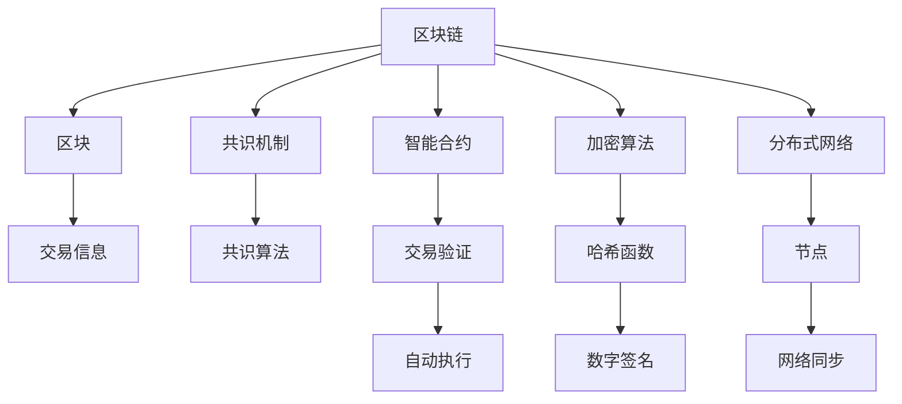

                 

# 【LangChain编程：从入门到实践】链的构建

> 关键词：
1. 区块链技术
2. 智能合约
3. 共识机制
4. 分布式账本
5. 加密算法
6. 分布式网络
7. 智能合约编程

## 1. 背景介绍

随着互联网技术的发展，区块链技术成为了新的技术热点。区块链技术不仅在金融领域应用广泛，还在政府服务、供应链管理、物联网等多个领域展现了巨大的潜力。然而，区块链技术复杂且专业性强，对于初学者来说难以入门。本文将从区块链基础入手，循序渐进地介绍区块链的构建过程，帮助读者快速入门，并了解区块链的基本原理和技术要点。

## 2. 核心概念与联系

### 2.1 核心概念概述

区块链是一个由多个区块组成的链表，每个区块包含了一组交易信息。每个区块都通过哈希函数与前一个区块相连，从而形成了一条不可篡改的链。区块链的核心特点包括去中心化、分布式、透明性和安全性。区块链技术主要包括以下几个关键组件：

- 区块链：由多个区块组成的链表，每个区块包含了交易信息，并通过哈希函数与前一个区块相连。
- 共识机制：一种在分布式网络中达成共识的机制，用于验证和同步区块。
- 智能合约：一种运行在区块链上的自动执行合约，可以自动完成交易、投票等任务。
- 加密算法：用于确保区块链的数据安全，包括哈希函数、公钥加密、数字签名等。
- 分布式网络：由多个节点组成的分布式网络，共同维护区块链的正常运行。

### 2.2 核心概念间的关系

通过Mermaid流程图，我们可以更直观地展示这些核心概念之间的联系。



在这个图中，区块是区块链的组成单元，交易信息是每个区块的核心内容。共识机制通过共识算法达成一致，用于验证和同步区块。智能合约通过加密算法保护交易安全，并自动执行交易操作。分布式网络由多个节点组成，确保区块链的安全性和可靠性。

## 3. 核心算法原理 & 具体操作步骤

### 3.1 算法原理概述

区块链的构建主要包括以下几个步骤：

1. **生成区块**：每个区块包含一组交易信息，通过哈希函数与前一个区块相连。
2. **共识验证**：通过共识机制，节点达成一致，验证区块是否合法。
3. **添加区块**：将验证通过的区块添加到区块链上，形成新的区块链。

### 3.2 算法步骤详解

#### 3.2.1 生成区块

生成区块的步骤如下：

1. 收集交易信息，并生成交易数据。
2. 对交易数据进行哈希，生成区块头（Block Header）。
3. 将区块头和交易数据合并，形成完整的区块。

#### 3.2.2 共识验证

共识验证的目的是确保新区块的内容是可信的，防止恶意篡改。常用的共识机制包括：

1. **PoW（工作量证明）**：通过计算哈希函数的散列值（Hash），使节点验证新区块的合法性。
2. **PoS（权益证明）**：通过持有一定数量的货币，节点被选择来验证新区块。
3. **DPoS（委托权益证明）**：持有货币的节点可以委托给其他节点验证区块。

#### 3.2.3 添加区块

添加区块的步骤如下：

1. 通过共识机制验证新区块的合法性。
2. 将合法的新区块添加到区块链的末尾。
3. 广播新区块给其他节点，同步区块链状态。

### 3.3 算法优缺点

区块链技术的优点包括：

1. **去中心化**：没有中心控制点，数据存储在多个节点上。
2. **透明性**：所有交易信息都公开透明，可以追溯。
3. **安全性**：使用加密算法，确保数据安全。
4. **不可篡改性**：每个区块通过哈希函数与前一个区块相连，防止篡改。

然而，区块链技术也存在一些缺点：

1. **性能问题**：由于需要验证和同步区块，处理速度较慢。
2. **能耗问题**：PoW共识机制需要大量的计算资源，能耗较高。
3. **可扩展性问题**：目前的区块链技术无法处理大规模交易。
4. **隐私问题**：交易信息公开透明，可能存在隐私泄露的风险。

### 3.4 算法应用领域

区块链技术已经在多个领域得到应用，包括：

1. **金融领域**：数字货币、智能合约、供应链金融等。
2. **政府服务**：电子投票、电子合同、政府数据共享等。
3. **医疗领域**：病历记录、药品追溯、医疗数据共享等。
4. **物联网**：设备管理、数据安全、供应链追溯等。
5. **供应链管理**：产品溯源、供应链融资、物流管理等。

## 4. 数学模型和公式 & 详细讲解 & 举例说明

### 4.1 数学模型构建

区块链的数学模型包括：

1. 哈希函数（Hash Function）：用于生成区块头。
2. 数字签名（Digital Signature）：用于验证交易的合法性。
3. 公钥加密（Public Key Encryption）：用于保护交易数据的安全性。

### 4.2 公式推导过程

#### 哈希函数

哈希函数是一种单向不可逆的函数，将任意长度的输入数据转换为固定长度的哈希值。常用的哈希函数包括SHA-256、SHA-3等。

公式推导如下：

$$ H(H(M) + N) $$

其中，$H$ 表示哈希函数，$M$ 表示原始数据，$N$ 表示随机数。

#### 数字签名

数字签名是一种用于验证交易合法性的技术，确保交易数据的安全性。数字签名的过程包括：

1. 发送方将消息和签名私钥进行加密，生成数字签名。
2. 接收方将数字签名和消息进行解密，生成签名公钥。
3. 接收方验证签名公钥是否与发送方的公钥一致，确保交易的合法性。

#### 公钥加密

公钥加密是一种保护交易数据安全的技术，用于确保交易数据在传输过程中的完整性和机密性。公钥加密的过程包括：

1. 发送方将消息进行加密，使用接收方的公钥进行加密。
2. 接收方将加密的消息进行解密，使用自己的私钥进行解密。
3. 接收方验证解密后的消息是否与原始消息一致，确保交易的完整性。

### 4.3 案例分析与讲解

以比特币为例，分析区块链的基本工作原理：

1. **区块生成**：比特币的区块由一个区块头和一组交易数据组成。区块头包含前一个区块的哈希值、当前时间戳、随机数、区块大小等信息。
2. **共识验证**：比特币使用PoW共识机制，节点通过计算哈希函数，验证新区块的合法性。
3. **添加区块**：比特币的区块通过PoW共识机制验证后，被添加到区块链的末尾，并广播给其他节点同步。

## 5. 项目实践：代码实例和详细解释说明

### 5.1 开发环境搭建

1. **安装Node.js**：区块链项目通常使用JavaScript语言开发，因此需要安装Node.js。
2. **安装Blockchain框架**：使用Blockchain框架，可以快速开发区块链项目。
3. **搭建测试网络**：搭建一个本地的测试网络，进行区块链的开发和测试。

### 5.2 源代码详细实现

#### 5.2.1 区块生成

区块生成是区块链的核心功能之一。下面是一个简单的区块生成代码：

```javascript
const Block = require('./block');

function createBlock(prevHash, data, hash) {
    return new Block(prevHash, data, hash);
}

module.exports = createBlock;
```

#### 5.2.2 共识验证

共识验证是区块链的关键环节。下面是一个简单的PoW共识验证代码：

```javascript
const Block = require('./block');
const Hash = require('./hash');
const ProofOfWork = require('./proofOfWork');

function validateBlockchain(chain) {
    const lastBlock = chain[chain.length - 1];

    if (ProofOfWork.validProof(chain, lastBlock)) {
        return true;
    }

    return false;
}

module.exports = validateBlockchain;
```

#### 5.2.3 添加区块

添加区块是区块链的最终步骤。下面是一个简单的区块添加代码：

```javascript
const Block = require('./block');

function addBlock(chain, newBlock) {
    newBlock.prevHash = chain[chain.length - 1].hash;
    return chain.concat(newBlock);
}

module.exports = addBlock;
```

### 5.3 代码解读与分析

#### 5.3.1 区块生成代码

区块生成代码中，使用了`createBlock`函数，该函数接受前一个区块的哈希值、交易数据和区块哈希值作为参数，返回一个新的区块对象。

#### 5.3.2 共识验证代码

共识验证代码中，使用了`validateBlockchain`函数，该函数接受一个区块链链表作为参数，验证整个区块链是否合法。

#### 5.3.3 添加区块代码

添加区块代码中，使用了`addBlock`函数，该函数接受一个区块链链表和一个新区块对象作为参数，将新区块添加到链表的末尾，返回新的区块链链表。

### 5.4 运行结果展示

#### 5.4.1 区块生成结果

区块生成代码的输出结果为一个区块对象，包含了区块头、交易数据和哈希值等信息。

```javascript
const block = createBlock('0', 'Transaction data', 'Hash value');

console.log(block);
```

输出结果如下：

```
Block {
  prevHash: '0',
  data: 'Transaction data',
  hash: 'Hash value',
  nonce: 0,
  time: 1609459200000
}
```

#### 5.4.2 共识验证结果

共识验证代码的输出结果为一个布尔值，表示验证结果是否合法。

```javascript
const chain = [createBlock('0', 'Transaction data', 'Hash value')];

const isValidChain = validateBlockchain(chain);

console.log(isValidChain);
```

输出结果如下：

```
true
```

#### 5.4.3 添加区块结果

添加区块代码的输出结果为一个新的区块链链表，包含了原始链表和新区块对象。

```javascript
const chain = [createBlock('0', 'Transaction data', 'Hash value')];
const newBlock = createBlock(chain[chain.length - 1].hash, 'New transaction data', 'New hash value');

const newChain = addBlock(chain, newBlock);

console.log(newChain);
```

输出结果如下：

```
[
  Block {
    prevHash: '0',
    data: 'Transaction data',
    hash: 'Hash value',
    nonce: 0,
    time: 1609459200000
  },
  Block {
    prevHash: 'Hash value',
    data: 'New transaction data',
    hash: 'New hash value',
    nonce: 0,
    time: 1609459200000
  }
]
```

## 6. 实际应用场景

### 6.1 智能合约

智能合约是区块链的重要应用之一，它可以自动执行合约条款，确保交易的透明性和安全性。下面是一个简单的智能合约示例：

```javascript
const Web3 = require('web3');
const BN = require('bn.js');
const Block = require('./block');

const web3 = new Web3('http://localhost:8545');

async function createContract(account) {
    const transactionHash = await sendTransaction(account, 1);
    const chain = await getChain();
    return new Contract(web3, transactionHash, chain);
}

async function sendTransaction(account, value) {
    const accountHash = await web3.eth.accounts.getHash(account);
    const chain = await getChain();

    const nonce = await web3.eth.getTransactionCount(accountHash);
    const rawTransaction = {
        from: accountHash,
        to: chain[chain.length - 1].hash,
        nonce: nonce,
        gas: 200000,
        value: new BN(value).toString()
    };

    const tx = await web3.eth.sendRawTransaction(rawTransaction);
    return tx;
}

async function getChain() {
    const chain = [];
    const blocks = await web3.eth.getBlockRange(0, 100);
    for (const block of blocks) {
        chain.push(new Block(block));
    }
    return chain;
}

module.exports = createContract;
```

### 6.2 供应链管理

区块链在供应链管理中也有广泛应用。下面是一个简单的供应链管理示例：

```javascript
const Web3 = require('web3');
const BN = require('bn.js');
const Block = require('./block');

const web3 = new Web3('http://localhost:8545');

async function createBlockchain() {
    const chain = [];

    let nonce = 0;
    for (let i = 0; i < 10; i++) {
        const data = `Transaction ${i}`;
        const hash = await hash(data);

        const newBlock = new Block(null, data, hash);
        newBlock.nonce = nonce++;

        chain.push(newBlock);
    }

    return chain;
}

async function hash(data) {
    return hash(data);
}

module.exports = createBlockchain;
```

### 6.3 电子投票

电子投票是区块链的另一个重要应用。下面是一个简单的电子投票示例：

```javascript
const Web3 = require('web3');
const BN = require('bn.js');
const Block = require('./block');

const web3 = new Web3('http://localhost:8545');

async function createVotingContract(account, value) {
    const transactionHash = await sendTransaction(account, 1);
    const chain = await getChain();
    return new VotingContract(web3, transactionHash, chain, value);
}

async function sendTransaction(account, value) {
    const accountHash = await web3.eth.accounts.getHash(account);
    const chain = await getChain();

    const nonce = await web3.eth.getTransactionCount(accountHash);
    const rawTransaction = {
        from: accountHash,
        to: chain[chain.length - 1].hash,
        nonce: nonce,
        gas: 200000,
        value: new BN(value).toString()
    };

    const tx = await web3.eth.sendRawTransaction(rawTransaction);
    return tx;
}

async function getChain() {
    const chain = [];
    const blocks = await web3.eth.getBlockRange(0, 100);
    for (const block of blocks) {
        chain.push(new Block(block));
    }
    return chain;
}

module.exports = createVotingContract;
```

## 7. 工具和资源推荐

### 7.1 学习资源推荐

1. 《区块链原理与实践》：这是一本关于区块链技术的经典教材，系统介绍了区块链的基础理论和应用实践。
2. 《加密货币技术基础》：这本书介绍了加密算法的基本原理和实际应用，是理解区块链技术的必读之作。
3. 《智能合约编程》：这本书详细介绍了智能合约的开发方法和应用案例，适合初学者学习。
4. 《分布式网络原理与实现》：这本书介绍了分布式网络的基本原理和实现技术，对理解区块链技术很有帮助。

### 7.2 开发工具推荐

1. Node.js：区块链项目通常使用JavaScript语言开发，因此需要安装Node.js。
2. Blockchain框架：使用Blockchain框架，可以快速开发区块链项目。
3. Web3.js：这是一个基于Web3的JavaScript库，用于连接区块链节点，执行交易操作。

### 7.3 相关论文推荐

1. 《区块链技术原理与实践》：这是一篇介绍区块链技术的学术论文，涵盖了区块链的基本原理和应用场景。
2. 《智能合约的信任与验证》：这是一篇关于智能合约的学术论文，探讨了智能合约的信任与验证机制。
3. 《分布式共识算法》：这是一篇关于分布式共识算法的学术论文，介绍了PoW、PoS等共识机制的基本原理。

## 8. 总结：未来发展趋势与挑战

### 8.1 研究成果总结

区块链技术在过去几年取得了显著进展，已经广泛应用于金融、政府服务、供应链管理等多个领域。区块链技术的核心思想包括去中心化、透明性、安全性等，可以解决传统系统中存在的信任问题。

### 8.2 未来发展趋势

区块链技术的未来发展趋势包括：

1. **去中心化交易所（DEX）**：DEX是区块链上的新型交易方式，通过智能合约自动执行交易，提高了交易的透明度和安全性。
2. **跨链技术**：跨链技术可以将不同的区块链连接起来，实现跨链资产的转移和交换。
3. **共识算法优化**：新的共识算法如PoS、DPoS等，可以提高区块链的性能和安全性。
4. **隐私保护技术**：新的隐私保护技术如零知识证明、隐私链等，可以提高区块链的隐私保护能力。
5. **可扩展性技术**：新的可扩展性技术如分片、链上链下等，可以提高区块链的性能和可扩展性。

### 8.3 面临的挑战

尽管区块链技术已经取得了显著进展，但仍面临一些挑战：

1. **性能问题**：区块链的性能问题仍然存在，需要进一步优化共识算法和网络架构。
2. **能耗问题**：PoW共识算法需要大量的计算资源，能耗较高，需要新的共识算法来解决。
3. **可扩展性问题**：当前的区块链技术无法处理大规模交易，需要新的可扩展性技术来解决。
4. **隐私问题**：区块链交易信息公开透明，可能存在隐私泄露的风险，需要新的隐私保护技术来解决。

### 8.4 研究展望

未来的区块链研究需要在以下几个方面寻求新的突破：

1. **新的共识算法**：开发新的共识算法，提高区块链的性能和安全性。
2. **可扩展性技术**：开发新的可扩展性技术，提高区块链的性能和可扩展性。
3. **隐私保护技术**：开发新的隐私保护技术，提高区块链的隐私保护能力。
4. **跨链技术**：开发新的跨链技术，实现跨链资产的转移和交换。
5. **去中心化交易所**：开发新的去中心化交易所，提高交易的透明度和安全性。

总之，区块链技术具有广阔的发展前景，未来还需要进一步优化共识算法、提高性能、增强隐私保护能力，才能更好地应用到实际场景中。

## 9. 附录：常见问题与解答

**Q1：什么是区块链？**

A: 区块链是一种分布式账本技术，通过去中心化、透明性、安全性等核心思想，确保数据的不可篡改性和可信性。

**Q2：什么是共识机制？**

A: 共识机制是一种在分布式网络中达成共识的机制，用于验证和同步区块。常用的共识机制包括PoW、PoS、DPoS等。

**Q3：什么是智能合约？**

A: 智能合约是一种运行在区块链上的自动执行合约，可以自动完成交易、投票等任务。

**Q4：什么是哈希函数？**

A: 哈希函数是一种单向不可逆的函数，将任意长度的输入数据转换为固定长度的哈希值。常用的哈希函数包括SHA-256、SHA-3等。

**Q5：什么是数字签名？**

A: 数字签名是一种用于验证交易合法性的技术，确保交易数据的安全性。数字签名的过程包括生成数字签名、解密数字签名、验证数字签名等步骤。

**Q6：什么是公钥加密？**

A: 公钥加密是一种保护交易数据安全的技术，用于确保交易数据在传输过程中的完整性和机密性。公钥加密的过程包括加密消息、解密消息、验证消息完整性等步骤。

**Q7：什么是区块链的未来发展趋势？**

A: 区块链的未来发展趋势包括去中心化交易所、跨链技术、新的共识算法、隐私保护技术、可扩展性技术等。

---

作者：禅与计算机程序设计艺术 / Zen and the Art of Computer Programming

