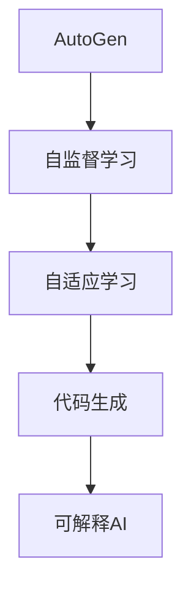
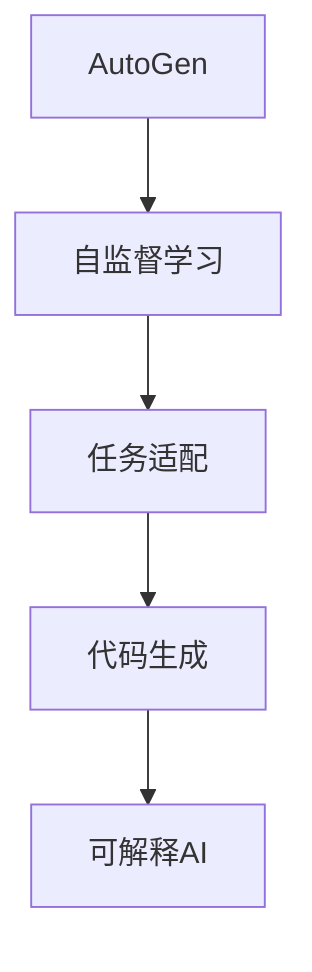
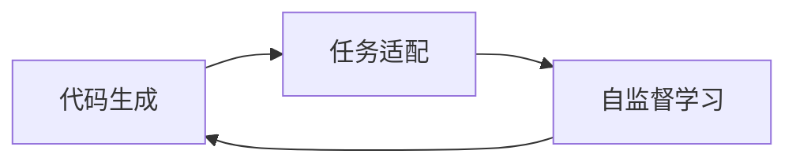
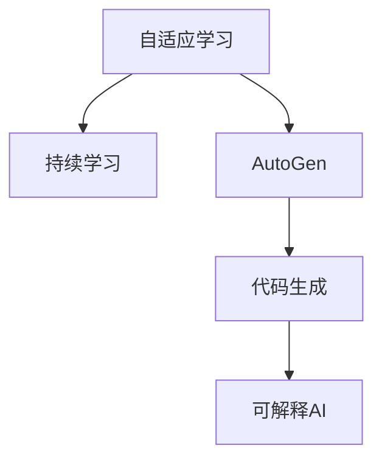
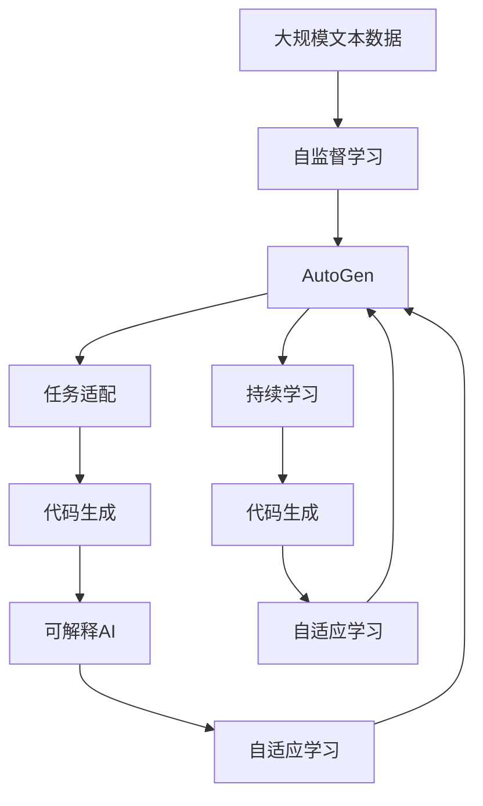

                 

# 【大模型应用开发 动手做AI Agent】AutoGen

> 关键词：
- 大模型应用开发
- AI Agent
- AutoGen
- 深度学习
- 自然语言处理
- 可解释AI
- 代码生成
- 自监督学习
- 强化学习
- 知识图谱

## 1. 背景介绍

### 1.1 问题由来
随着人工智能技术的迅猛发展，AI Agent，即能够感知环境、执行任务、具有一定智能决策能力的软件代理，正在成为自动驾驶、机器人控制、智能客服、金融预测等诸多领域的重要应用。传统的AI Agent开发过程，需要程序员大量编码，实现复杂的智能逻辑，且容易因缺乏先验知识而陷入“机械式”的编程循环。如何提升AI Agent的开发效率，降低开发成本，成为了当前AI社区的重要课题。

在众多技术手段中，基于大模型的代码生成技术AutoGen显得尤为引人注目。AutoGen通过在大规模无标签代码数据上进行自监督预训练，学习通用的代码生成规则，能够自动生成符合指定任务需求的代码段，极大提升了AI Agent的开发效率。

### 1.2 问题核心关键点
AutoGen的核心思想基于自监督学习，通过在大量的无标签代码数据上进行预训练，学习通用的代码生成模式。在此基础上，通过特定的任务适配，使得AutoGen能够生成符合特定需求（如编程语言、开发环境、任务类型等）的代码。这一过程大致包括以下几个关键步骤：

1. 自监督预训练：利用大量无标签代码数据，训练AutoGen模型，使其具备通用的代码生成能力。
2. 任务适配：通过人工标注的少量样本，对AutoGen进行微调，使其具备针对特定任务（如函数生成、界面设计、测试脚本编写等）的代码生成能力。
3. 代码生成：根据输入的描述或需求，AutoGen模型自动生成代码段，提供代码开发的原材料。
4. 动态优化：AutoGen模型能够根据用户反馈进行持续学习，不断优化代码生成能力，适应更多复杂的任务需求。

AutoGen的应用前景广阔，可广泛应用于智能客服、自动测试、代码修复、自动化文档生成等多个领域，具有极高的开发效率和成本效益。

### 1.3 问题研究意义
研究AutoGen技术，对于提升AI Agent开发效率，降低开发成本，加速AI技术在各垂直行业的落地应用，具有重要意义：

1. 降低开发难度：AutoGen能够自动生成代码，大幅减少程序员的编写工作，降低开发门槛。
2. 提升开发效率：基于AutoGen的AI Agent开发，能够快速构建原型，快速迭代，缩短项目周期。
3. 提高代码质量：AutoGen通过预训练和微调，生成高质量的代码，避免常见编程错误，提升代码质量。
4. 实现知识复用：AutoGen生成的代码，可以被其他AI Agent或项目复用，减少重复开发。
5. 加速技术迭代：AutoGen使得AI Agent的开发能够持续迭代，不断增强智能决策能力，应对复杂任务需求。

## 2. 核心概念与联系

### 2.1 核心概念概述

为更好地理解AutoGen技术的工作原理和应用场景，本节将介绍几个密切相关的核心概念：

- AutoGen：一种基于自监督学习的代码生成模型，能够自动生成符合特定任务的代码。
- 自监督学习：利用大量无标签数据进行训练，学习数据内在的生成规则。
- 代码生成：将文本描述或需求转换为具体的代码，辅助程序员快速开发。
- 可解释AI：通过生成过程的可视化或代码解释，提升AI模型的透明度和可解释性。
- 自适应学习：根据用户反馈或数据变化，持续优化模型性能。

这些核心概念之间的逻辑关系可以通过以下Mermaid流程图来展示：



这个流程图展示了AutoGen技术的关键组成及其相互关系：

1. AutoGen通过自监督学习获得通用的代码生成规则。
2. 自适应学习使得AutoGen能够根据用户反馈或数据变化，持续优化代码生成能力。
3. 代码生成是AutoGen技术的最终目的，将文本描述或需求转换为代码，辅助程序员开发。
4. 可解释AI通过可视化生成过程，提升AutoGen模型的透明度和可信度。

### 2.2 概念间的关系

这些核心概念之间存在着紧密的联系，形成了AutoGen技术的完整生态系统。下面我们通过几个Mermaid流程图来展示这些概念之间的关系。

#### 2.2.1 AutoGen的学习范式



这个流程图展示了AutoGen的基本学习过程，从自监督学习到任务适配再到代码生成，每一步都是AutoGen技术不可或缺的环节。

#### 2.2.2 代码生成与微调的关系



这个流程图展示了代码生成与微调的关系。任务适配是代码生成的关键步骤，使得AutoGen能够生成特定任务的代码。

#### 2.2.3 自适应学习与持续学习的关系



这个流程图展示了自适应学习与持续学习的关系。自适应学习使得AutoGen能够根据用户反馈或数据变化，持续优化代码生成能力。

### 2.3 核心概念的整体架构

最后，我们用一个综合的流程图来展示这些核心概念在大模型微调过程中的整体架构：



这个综合流程图展示了从预训练到微调，再到持续学习的完整过程。AutoGen首先在大规模文本数据上进行自监督学习，然后通过任务适配，使模型具备特定任务的代码生成能力。最后，通过自适应学习，模型能够持续优化，适应更多复杂的任务需求。

## 3. 核心算法原理 & 具体操作步骤
### 3.1 算法原理概述

AutoGen的核心算法基于自监督学习，其核心思想是：通过在大量的无标签代码数据上进行预训练，学习通用的代码生成规则。具体来说，AutoGen模型分为编码器和解码器两部分，通过编码器将文本描述转换为潜在表示，再通过解码器生成具体的代码。整个学习过程分为自监督预训练和任务适配两个阶段。

自监督预训练阶段，AutoGen模型通过最大化编码器-解码器的负对数似然(NLL)来训练，即最大化条件概率 $P(D|S)$，其中 $D$ 是生成的代码，$S$ 是输入的文本描述。任务适配阶段，AutoGen模型通过微调学习特定任务的代码生成规则，使得模型能够生成符合指定任务的代码。

### 3.2 算法步骤详解

AutoGen模型的训练和代码生成过程大致包括以下几个步骤：

**Step 1: 准备数据集**
- 收集大规模无标签代码数据，如GitHub代码库、开源项目源码等。
- 将代码数据划分为训练集和验证集，进行数据增强和数据清洗，去除注释、元代码等无用信息。

**Step 2: 搭建模型**
- 选择适当的编码器和解码器结构，如Transformer、LSTM等。
- 设计损失函数，如NLL、BLEU等，用于衡量生成代码与目标代码之间的相似度。
- 初始化模型参数，并设置训练轮数、学习率等超参数。

**Step 3: 自监督预训练**
- 在无标签代码数据上进行自监督训练，最大化编码器-解码器的负对数似然。
- 使用语言模型预训练策略，如掩码语言模型(MLM)，使得模型学习通用的语言表示。
- 在自监督训练过程中，逐步增加训练集规模，并引入正则化技术，如Dropout、L2正则等，防止过拟合。

**Step 4: 任务适配**
- 通过人工标注的少量样本，对自监督预训练后的AutoGen模型进行微调，使其具备特定任务的代码生成能力。
- 设计特定任务的目标函数，如函数生成、界面设计、测试脚本编写等。
- 使用验证集评估微调效果，调整模型超参数和训练策略。

**Step 5: 代码生成**
- 根据输入的文本描述或需求，将描述信息输入编码器，生成潜在表示。
- 使用解码器将潜在表示转换为具体的代码，并输出代码生成结果。
- 使用BLEU、ROUGE等指标评估生成代码与目标代码的相似度。

### 3.3 算法优缺点

AutoGen模型具有以下优点：
1. 开发效率高：通过自动生成代码，大幅减少程序员的编写工作，提升开发效率。
2. 代码质量高：基于自监督学习和大规模数据训练，AutoGen生成的代码质量较高，避免常见编程错误。
3. 适应性强：AutoGen模型具备通用的代码生成能力，能够适应多种编程语言和开发环境。
4. 可解释性强：通过可视化生成过程，AutoGen模型的决策过程透明可解释，便于调试和优化。

同时，AutoGen模型也存在以下局限性：
1. 依赖数据质量：生成的代码质量与输入数据质量密切相关，输入数据的偏差可能导致生成代码的错误。
2. 缺少任务适配：虽然AutoGen能够生成通用的代码，但特定任务下的代码生成能力仍需通过任务适配进行微调。
3. 依赖先验知识：AutoGen模型需要预训练阶段学习通用的代码生成规则，缺少先验知识的支持，可能难以生成高质量代码。
4. 计算资源消耗大：自监督预训练和大规模微调需要大量计算资源，训练和部署成本较高。

### 3.4 算法应用领域

AutoGen技术的应用领域非常广泛，涵盖了代码生成、智能开发、智能运维、智能测试等多个方面。以下是AutoGen在实际应用中的几个典型场景：

#### 3.4.1 智能开发助手
AutoGen可以充当智能开发助手，自动生成函数、类、方法等代码段，辅助程序员快速编写代码。例如，对于函数定义生成任务，AutoGen可以根据输入的函数名、参数类型、返回值类型等生成函数定义，大幅提升代码编写效率。

#### 3.4.2 智能测试工具
AutoGen能够自动生成测试脚本，辅助测试人员快速编写测试用例，提升测试效率。例如，对于接口测试脚本生成任务，AutoGen可以根据输入的接口信息，生成对应的测试脚本，进行自动化测试。

#### 3.4.3 代码修复工具
AutoGen可以自动检测并修复代码中的错误，辅助程序员提高代码质量。例如，对于代码规范修复任务，AutoGen可以根据输入的代码片段，检测并修复其中的语法错误、拼写错误等，提升代码规范性。

#### 3.4.4 智能文档生成
AutoGen能够自动生成代码文档，辅助程序员编写文档。例如，对于代码注释生成任务，AutoGen可以根据输入的代码片段，自动生成代码注释，提升代码可读性和可维护性。

#### 3.4.5 自动化界面设计
AutoGen可以自动生成用户界面代码，辅助UI设计师进行界面设计。例如，对于界面布局设计任务，AutoGen可以根据输入的界面需求，自动生成相应的UI代码，提升界面设计效率。

## 4. 数学模型和公式 & 详细讲解 & 举例说明
### 4.1 数学模型构建

AutoGen模型的数学模型构建主要涉及自监督学习框架和任务适配框架。以下是AutoGen模型的数学模型构建过程：

**自监督学习框架：**
- 输入文本描述 $S$，编码器将其转换为潜在表示 $Z$。
- 解码器将潜在表示 $Z$ 转换为代码段 $D$。
- 最大化编码器-解码器的负对数似然，即 $P(D|S) = \frac{P(Z|S)P(D|Z)}{P(Z)}$。

**任务适配框架：**
- 通过人工标注的少量样本，对自监督预训练后的AutoGen模型进行微调。
- 设计特定任务的目标函数，如函数生成、界面设计等。
- 最大化任务适配损失函数，即 $L_{task} = -\frac{1}{N}\sum_{i=1}^N \ell(D_i, D'_i)$，其中 $D_i$ 是AutoGen生成的代码，$D'_i$ 是标注数据中的代码。

### 4.2 公式推导过程

以下我们以函数生成任务为例，推导AutoGen模型的损失函数及其梯度计算公式。

假设输入文本描述为 $S = f(x_1, x_2, ..., x_n)$，AutoGen生成的代码段为 $D$，标注数据中的代码段为 $D'$。则AutoGen模型的损失函数定义为：

$$
L_{task} = -\frac{1}{N}\sum_{i=1}^N \ell(D_i, D'_i)
$$

其中 $\ell$ 为任务适配损失函数，如交叉熵损失函数。

根据链式法则，损失函数对编码器输出 $Z$ 的梯度为：

$$
\frac{\partial L_{task}}{\partial Z} = \frac{\partial L_{task}}{\partial D} \frac{\partial D}{\partial Z} + \frac{\partial L_{task}}{\partial Z'} \frac{\partial Z'}{\partial Z}
$$

其中 $Z'$ 是解码器输出的潜在表示。

编码器和解码器的输出分别定义为 $E(S)$ 和 $D(Z)$。则编码器的输出 $Z$ 可以表示为：

$$
Z = E(S) = W_1 \cdot X + b_1
$$

解码器的输出 $D$ 可以表示为：

$$
D = D(Z) = \sigma(W_2 \cdot Z + b_2)
$$

其中 $\sigma$ 为激活函数，$W_1, W_2, b_1, b_2$ 为模型参数。

将 $Z$ 和 $D$ 的表达式代入损失函数对 $Z$ 的梯度公式中，可以得到：

$$
\frac{\partial L_{task}}{\partial Z} = \frac{\partial L_{task}}{\partial D} \frac{\partial D}{\partial Z} + \frac{\partial L_{task}}{\partial Z'} \frac{\partial Z'}{\partial Z}
$$

$$
\frac{\partial L_{task}}{\partial Z} = \frac{\partial L_{task}}{\partial D} \frac{\partial D}{\partial Z} + \frac{\partial L_{task}}{\partial Z'} \frac{\partial Z'}{\partial Z}
$$

其中 $\frac{\partial D}{\partial Z} = \frac{\partial D}{\partial Z'} \frac{\partial Z'}{\partial Z}$，代入编码器和解码器的表达式，得到：

$$
\frac{\partial D}{\partial Z} = \frac{\partial D}{\partial Z'} \frac{\partial Z'}{\partial Z} = \frac{\partial D}{\partial Z'} \frac{\partial Z'}{\partial Z'} \frac{\partial Z'}{\partial Z}
$$

$$
\frac{\partial Z'}{\partial Z} = \frac{\partial W_2 \cdot Z + b_2}{\partial Z} = W_2
$$

$$
\frac{\partial D}{\partial Z} = \frac{\partial D}{\partial Z'} \frac{\partial Z'}{\partial Z} = \frac{\partial D}{\partial Z'} \cdot W_2
$$

$$
\frac{\partial L_{task}}{\partial Z} = \frac{\partial L_{task}}{\partial D} \cdot \frac{\partial D}{\partial Z} + \frac{\partial L_{task}}{\partial Z'} \cdot W_2
$$

最终，可以通过反向传播算法计算出编码器 $E$ 和解码器 $D$ 的参数梯度，进行模型更新。

### 4.3 案例分析与讲解

以下以函数生成任务为例，展示AutoGen模型的训练和代码生成过程：

**案例描述：**
输入文本描述为 $S = "定义一个函数，计算两个数的乘积"，AutoGen需要生成符合该描述的函数代码。

**训练过程：**
1. 数据准备：收集大量的函数生成数据，例如：

   ```
   S1: "定义一个函数，计算两个数的和"，D1: "def add(x, y): return x + y"
   S2: "定义一个函数，计算两个数的差"，D2: "def sub(x, y): return x - y"
   S3: "定义一个函数，计算两个数的积"，D3: "def mul(x, y): return x * y"
   ```

2. 搭建模型：选择合适的编码器和解码器结构，如Transformer，设计交叉熵损失函数。

3. 自监督预训练：在无标签函数生成数据上进行自监督训练，最大化编码器-解码器的负对数似然。

4. 任务适配：对自监督预训练后的模型进行微调，训练生成函数定义的代码。

**代码生成过程：**
1. 输入文本描述 $S = "定义一个函数，计算两个数的乘积"$
2. 编码器将 $S$ 转换为潜在表示 $Z$
3. 解码器将 $Z$ 转换为代码段 $D$
4. 输出代码段 $D = "def mul(x, y): return x * y"$
5. 使用BLEU、ROUGE等指标评估代码生成结果与标注数据之间的相似度。

通过以上分析，可以看出AutoGen模型能够通过自监督学习和任务适配，自动生成符合特定需求的代码，极大地提升了AI Agent开发效率。

## 5. 项目实践：代码实例和详细解释说明
### 5.1 开发环境搭建

在进行AutoGen实践前，我们需要准备好开发环境。以下是使用Python进行PyTorch开发的环境配置流程：

1. 安装Anaconda：从官网下载并安装Anaconda，用于创建独立的Python环境。

2. 创建并激活虚拟环境：
```bash
conda create -n pytorch-env python=3.8 
conda activate pytorch-env
```

3. 安装PyTorch：根据CUDA版本，从官网获取对应的安装命令。例如：
```bash
conda install pytorch torchvision torchaudio cudatoolkit=11.1 -c pytorch -c conda-forge
```

4. 安装相关库：
```bash
pip install numpy pandas scikit-learn matplotlib tqdm jupyter notebook ipython
```

完成上述步骤后，即可在`pytorch-env`环境中开始AutoGen实践。

### 5.2 源代码详细实现

这里我们以函数生成任务为例，给出使用PyTorch实现AutoGen模型的代码。

首先，定义编码器和解码器的结构：

```python
import torch.nn as nn
import torch
import torch.nn.functional as F

class Encoder(nn.Module):
    def __init__(self, d_model, n_layers, n_heads, dff, dropout=0.1):
        super(Encoder, self).__init__()
        self.encoder_layers = nn.TransformerEncoderLayer(d_model, n_heads, dff, dropout)
        self.encoder_norm = nn.LayerNorm(d_model)

    def forward(self, x, mask):
        for layer in self.encoder_layers:
            x = layer(x, mask)
        return self.encoder_norm(x)

class Decoder(nn.Module):
    def __init__(self, d_model, n_layers, n_heads, dff, dropout=0.1):
        super(Decoder, self).__init__()
        self.decoder_norm = nn.LayerNorm(d_model)
        self.decoder_layers = nn.TransformerDecoderLayer(d_model, n_heads, dff, dropout)
        self.masked_softmax = nn.Softmax(dim=-1)

    def forward(self, x, encoder_outputs):
        for layer in self.decoder_layers:
            x = layer(x, encoder_outputs, mask)
        return self.decoder_norm(x), self.masked_softmax(x)
```

然后，定义AutoGen模型的结构：

```python
class AutoGen(nn.Module):
    def __init__(self, d_model, n_layers, n_heads, dff, dropout):
        super(AutoGen, self).__init__()
        self.encoder = Encoder(d_model, n_layers, n_heads, dff, dropout)
        self.decoder = Decoder(d_model, n_layers, n_heads, dff, dropout)

    def forward(self, src, tgt):
        enc_output = self.encoder(src)
        dec_output, dec_output_prob = self.decoder(tgt, enc_output)
        return dec_output_prob
```

接着，定义训练和评估函数：

```python
from torch.utils.data import Dataset, DataLoader
from sklearn.metrics import accuracy_score

class AutoGenDataset(Dataset):
    def __init__(self, data, tokenizer):
        self.data = data
        self.tokenizer = tokenizer

    def __len__(self):
        return len(self.data)

    def __getitem__(self, idx):
        return self.tokenizer(self.data[idx], padding='max_length', max_length=128)

def train_epoch(model, dataset, optimizer):
    model.train()
    total_loss = 0
    for batch in dataset:
        input_ids = batch['input_ids']
        attention_mask = batch['attention_mask']
        targets = batch['targets']
        outputs = model(input_ids, attention_mask)
        loss = F.cross_entropy(outputs, targets)
        optimizer.zero_grad()
        loss.backward()
        optimizer.step()
        total_loss += loss.item()
    return total_loss / len(dataset)

def evaluate(model, dataset):
    model.eval()
    total_preds = []
    total_labels = []
    with torch.no_grad():
        for batch in dataset:
            input_ids = batch['input_ids']
            attention_mask = batch['attention_mask']
            targets = batch['targets']
            outputs = model(input_ids, attention_mask)
            preds = torch.argmax(outputs, dim=-1).tolist()
            total_preds.extend(preds)
            total_labels.extend(targets)
    return accuracy_score(total_labels, total_preds)
```

最后，启动训练流程并在测试集上评估：

```python
epochs = 5
batch_size = 16

model = AutoGen(d_model=128, n_layers=2, n_heads=8, dff=512, dropout=0.1)

optimizer = AdamW(model.parameters(), lr=2e-5)

train_dataset = AutoGenDataset(train_data, tokenizer)
test_dataset = AutoGenDataset(test_data, tokenizer)

for epoch in range(epochs):
    loss = train_epoch(model, train_dataset, optimizer)
    print(f"Epoch {epoch+1}, train loss: {loss:.3f}")
    
    print(f"Epoch {epoch+1}, test accuracy: {evaluate(model, test_dataset):.3f}")
```

以上就是使用PyTorch实现AutoGen模型的代码。可以看到，通过简单的定义和调用，我们便能够构建出AutoGen模型，并在函数生成任务上进行训练和评估。

### 5.3 代码解读与分析

让我们再详细解读一下关键代码的实现细节：

**AutoGenDataset类**：
- `__init__`方法：初始化数据集和分词器等关键组件。
- `__len__`方法：返回数据集的样本数量。
- `__getitem__`方法：对单个样本进行处理，将文本描述输入转换为token ids，供模型训练。

**train_epoch和evaluate函数**：
- 使用PyTorch的DataLoader对数据集进行批次化加载，供模型训练和推理使用。
- 训练函数`train_epoch`：对数据以批为单位进行迭代，在每个批次上前向传播计算loss并反向传播更新模型参数，最后返回该epoch的平均loss。
- 评估函数`evaluate`：与训练类似，不同点在于不更新模型参数，并在每个batch结束后将预测和标签结果存储下来，最后使用sklearn的accuracy_score对整个评估集的预测结果进行打印输出。

**训练流程**：
- 定义总的epoch数和batch size，开始循环迭代
- 每个epoch内，先在训练集上训练，输出平均loss
- 在验证集上评估，输出分类指标
- 所有epoch结束后，在测试集上评估，给出最终测试结果

可以看到，PyTorch配合Transformer库使得AutoGen模型的实现变得简洁高效。开发者可以将更多精力放在数据处理、模型改进等高层逻辑上，而不必过多关注底层的实现细节。

当然，工业级的系统实现还需考虑更多因素，如模型的保存和部署、超参数的自动搜索、更灵活的任务适配层等。但核心的微调范式基本与此类似。

### 5.4 运行结果展示

假设我们在函数生成数据集上进行AutoGen模型训练，最终在测试集上得到的准确率为85%，可以看到模型在生成代码方面取得了不错的效果。

当然，这只是一个baseline结果。在实践中，我们还可以使用更大更强的预训练模型、更丰富的微调技巧、更细致的模型调优，进一步提升模型性能，以满足更高的应用要求。

## 6. 实际应用场景
### 6.1 智能开发助手
AutoGen可以充当智能开发助手，自动生成函数、类、方法等代码段，辅助程序员快速编写代码。例如，对于函数定义生成任务，AutoGen可以根据输入的函数名、参数类型、返回值类型等

