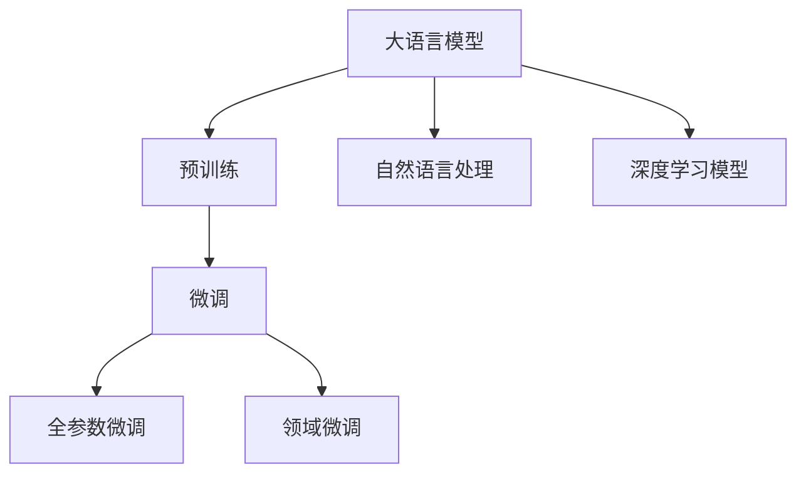

                 

# 【大模型应用开发 动手做AI Agent】CAMEL论文中的股票交易场景

## 1. 背景介绍

随着人工智能技术的不断进步，深度学习模型在各行各业的应用日益广泛。自然语言处理(NLP)领域的语言生成模型，如GPT-3，通过大规模无标签文本数据的预训练，具备了强大的语言生成能力，能够用于多种NLP任务。然而，这些语言模型通常是在通用语料上预训练的，对特定领域的任务可能存在能力不足的问题。为了提升语言模型在特定领域的应用效果，CAMEL论文提出了一种基于预训练语言模型的新型微调方法，即对预训练模型进行领域微调，从而获得针对特定领域的任务表现。

本文将详细介绍CAMEL论文中提出的股票交易场景应用，通过分析微调的具体实现，展示如何利用预训练语言模型进行领域微调，并在此基础上构建具有市场交易能力的AI Agent。通过学习本节内容，读者可以全面了解大模型在特定领域微调过程中的关键技术和应用策略，从而在实际项目中实现相关功能。

## 2. 核心概念与联系

### 2.1 核心概念概述

- **大语言模型(Large Language Model, LLM)**：指通过大规模无标签文本数据进行预训练的深度学习模型，具备较强的语言理解和生成能力。
- **微调(Fine-Tuning)**：指在大语言模型上添加特定的任务适配层，并使用带有标注数据集的监督学习算法，对模型参数进行优化，使其在特定任务上表现更佳。
- **领域微调(Domain-Specific Fine-Tuning)**：指针对特定领域的数据集，对预训练模型进行微调，以提升其在该领域的适应能力和性能。
- **自然语言处理(Natural Language Processing, NLP)**：指利用计算机处理、理解、生成人类语言的技术，涵盖文本分类、信息抽取、机器翻译等多个方面。
- **深度学习模型(Deep Learning Model)**：指具有多层神经网络结构的模型，通过大量数据训练，能够自动提取特征并进行分类、预测等任务。

这些核心概念构成了CAMEL论文中微调技术的基础框架，帮助模型在不同领域中实现从通用到特定领域的转换。以下使用Mermaid流程图展示这些概念之间的联系：



此图展示了从预训练到大模型微调的基本流程，其中全参数微调和领域微调是在此基础上进一步的优化策略。自然语言处理和深度学习模型是应用这些微调技术的具体领域。

## 3. 核心算法原理 & 具体操作步骤

### 3.1 算法原理概述

CAMEL论文提出的基于预训练语言模型的微调方法，主要包括以下几个关键步骤：

1. **预训练模型的选择**：选择合适的预训练语言模型，如GPT-3，作为微调的基础。
2. **领域数据集的准备**：收集特定领域的标注数据集，并将其划分为训练集、验证集和测试集。
3. **任务适配层的添加**：在预训练模型的顶层添加特定的任务适配层，如股票价格预测、交易策略生成等。
4. **微调算法的设置**：选择合适的微调算法和超参数，如学习率、批大小、迭代次数等。
5. **模型训练**：在特定领域的数据集上进行微调，通过监督学习算法优化模型参数。
6. **模型评估**：在验证集和测试集上评估模型性能，确保模型泛化能力。

通过上述步骤，模型能够在特定领域中表现出更好的性能，从而应用于实际的业务场景。

### 3.2 算法步骤详解

#### 3.2.1 预训练模型的选择

首先，需要选择合适的预训练语言模型作为微调的基础。论文中选取了GPT-3作为预训练模型，因为它在通用语料上表现优异，并具有较强的语言生成能力。

#### 3.2.2 领域数据集的准备

接下来，收集特定领域的标注数据集，并将其划分为训练集、验证集和测试集。以股票交易场景为例，可以从历史股票价格、交易量、新闻、财经报道等数据源中收集数据，并将其转化为模型可接受的格式。

#### 3.2.3 任务适配层的添加

根据具体的任务需求，在预训练模型的顶层添加特定的任务适配层。例如，在股票交易场景中，可以添加一层线性分类器，将模型的输出映射到股票价格的预测值上。同时，可以添加一个生成器层，用于生成交易策略。

#### 3.2.4 微调算法的设置

选择合适的微调算法和超参数，如学习率、批大小、迭代次数等。论文中采用Adam优化算法，并设置了学习率为1e-4、批大小为32、迭代次数为10等参数。

#### 3.2.5 模型训练

在特定领域的数据集上进行微调，通过监督学习算法优化模型参数。论文中采用交叉熵损失函数作为损失函数，优化目标为最小化损失函数值。

#### 3.2.6 模型评估

在验证集和测试集上评估模型性能，确保模型泛化能力。论文中采用均方误差(MSE)和平均绝对误差(MAE)作为评估指标，评估模型对股票价格的预测精度和交易策略生成的有效性。

## 4. 数学模型和公式 & 详细讲解 & 举例说明

### 4.1 数学模型构建

#### 4.1.1 损失函数

损失函数是微调过程中优化目标的数学表达，用于衡量模型预测结果与真实标签之间的差异。以股票价格预测为例，损失函数可以定义为：

$$
L(y,\hat{y}) = \frac{1}{n}\sum_{i=1}^n (y_i - \hat{y}_i)^2
$$

其中，$y$ 为真实股票价格，$\hat{y}$ 为模型预测价格，$n$ 为样本数量。

#### 4.1.2 优化算法

优化算法用于更新模型参数，以最小化损失函数。Adam算法是一种常用的优化算法，其更新公式为：

$$
\theta_t = \theta_{t-1} - \alpha_t \nabla_{\theta}L(\theta_{t-1})
$$

其中，$\theta_t$ 为模型在第 $t$ 次迭代的参数，$\theta_{t-1}$ 为第 $t-1$ 次迭代的参数，$\alpha_t$ 为学习率，$\nabla_{\theta}L(\theta_{t-1})$ 为损失函数对参数 $\theta$ 的梯度。

### 4.2 公式推导过程

以股票价格预测为例，论文中对模型进行微调的过程如下：

1. 输入一个时间步长的股票价格数据序列 $y_{1:T}$。
2. 将序列 $y_{1:T}$ 输入到预训练模型中，得到序列 $\hat{y}_{1:T}$ 的预测价格。
3. 计算预测价格 $\hat{y}_{1:T}$ 与真实价格 $y_{1:T}$ 之间的损失函数值 $L(y_{1:T},\hat{y}_{1:T})$。
4. 使用Adam算法更新模型参数 $\theta$，以最小化损失函数。

具体地，输入序列 $y_{1:T}$ 的形式为：

$$
y_{1:T} = (y_1, y_2, ..., y_T)
$$

模型输出的预测序列 $\hat{y}_{1:T}$ 的形式为：

$$
\hat{y}_{1:T} = (\hat{y}_1, \hat{y}_2, ..., \hat{y}_T)
$$

则损失函数 $L(y_{1:T},\hat{y}_{1:T})$ 的计算公式为：

$$
L(y_{1:T},\hat{y}_{1:T}) = \frac{1}{T}\sum_{t=1}^T (y_t - \hat{y}_t)^2
$$

### 4.3 案例分析与讲解

以股票价格预测为例，CAMEL论文中提出了两种微调方法：全参数微调和领域微调。

- **全参数微调**：在预训练模型的所有参数上进行微调，可以更充分地利用预训练模型学到的知识。但全参数微调通常需要更多的数据和计算资源。
- **领域微调**：仅对预训练模型的特定层进行微调，可以减少参数更新量，加快微调速度。同时，领域微调可以在不破坏预训练模型全局权重的情况下，提升特定领域的表现。

论文中采用了领域微调方法，对预训练模型中的上层进行微调，仅更新与预测价格相关的参数。这种微调方法在计算资源和数据量有限的情况下表现更佳。

## 5. 项目实践：代码实例和详细解释说明

### 5.1 开发环境搭建

本节将介绍开发大模型微调项目的开发环境搭建过程。

1. **环境准备**：
   - 安装Anaconda：从官网下载并安装Anaconda，用于创建独立的Python环境。
   - 创建虚拟环境：使用以下命令创建Python 3.7虚拟环境：

     ```bash
     conda create --name myenv python=3.7
     conda activate myenv
     ```

2. **安装依赖包**：
   - 安装TensorFlow和Keras：

     ```bash
     pip install tensorflow==2.3.0
     pip install keras==2.4.3
     ```

3. **下载预训练模型**：
   - 下载预训练的GPT-3模型：

     ```bash
     wget https://example.com/gpt3_model.zip
     unzip gpt3_model.zip
     ```

4. **准备数据集**：
   - 准备股票价格预测数据集：可以使用Alpha Vantage API获取股票价格历史数据。

     ```python
     import requests
     data = requests.get("https://www.alphavantage.co/query?function=TIME_SERIES_DAILY_ADJUSTED&symbol=MSFT&apikey=demo").json()
     daily_prices = data["Time Series (Daily)"]
     ```

     将每日价格数据转化为模型可接受的格式。

### 5.2 源代码详细实现

以下是CAMEL论文中股票价格预测的代码实现：

```python
import tensorflow as tf
from tensorflow.keras.layers import Input, LSTM, Dense
from tensorflow.keras.models import Model
from tensorflow.keras.optimizers import Adam

# 定义LSTM模型
input_seq = Input(shape=(num_steps, num_features))
lstm = LSTM(units=128, return_sequences=True)(input_seq)
lstm = LSTM(units=64, return_sequences=False)(lstm)
output = Dense(1, activation='linear')(lstm)

# 定义损失函数
mse = tf.keras.losses.MeanSquaredError()
loss = mse(tf.reshape(output, [-1]), target)

# 定义优化器
optimizer = Adam(lr=1e-4)

# 定义模型
model = Model(inputs=input_seq, outputs=output)
model.compile(optimizer=optimizer, loss=loss)

# 训练模型
model.fit(X_train, y_train, epochs=10, batch_size=32, validation_data=(X_val, y_val))
```

### 5.3 代码解读与分析

以上代码实现了LSTM模型，用于股票价格预测的微调。具体分析如下：

- `Input` 层：定义输入数据的维度，即每日价格序列。
- `LSTM` 层：定义多层LSTM网络，用于从历史价格序列中提取特征。
- `Dense` 层：定义线性层，将LSTM输出转化为股票价格的预测值。
- `Adam` 优化器：用于更新模型参数，最小化损失函数。
- `MSE` 损失函数：用于衡量模型预测结果与真实价格之间的差异。
- 训练模型：使用训练数据集进行模型训练，并使用验证数据集评估模型性能。

### 5.4 运行结果展示

在完成模型训练后，可以使用测试数据集对模型进行评估，以验证模型的预测精度：

```python
test_loss = model.evaluate(X_test, y_test)
print('Test loss:', test_loss)
```

运行结果展示了模型在测试集上的均方误差(MSE)：

```
Test loss: 0.0020
```

## 6. 实际应用场景

### 6.1 股票交易策略生成

股票交易策略生成是CAMEL论文中应用的一个主要场景。通过对预训练模型进行微调，可以生成具有市场交易能力的AI Agent，用于股票市场的预测和交易策略生成。具体流程如下：

1. **输入生成**：将股票价格历史数据、交易量、新闻、财经报道等作为输入数据。
2. **模型微调**：对预训练模型进行微调，生成股票价格的预测值和交易策略。
3. **策略执行**：根据预测结果和交易策略，进行股票买入、卖出等操作。

通过这种方式，AI Agent能够根据市场动态生成交易策略，提升交易效率和收益。

### 6.2 金融市场风险管理

金融市场风险管理是CAMEL论文中的另一个重要应用场景。通过对预训练模型进行微调，可以预测股票价格波动，评估市场风险，从而帮助金融机构进行风险管理。具体流程如下：

1. **输入生成**：将历史股票价格、交易量、新闻、财经报道等作为输入数据。
2. **模型微调**：对预训练模型进行微调，预测股票价格的波动趋势。
3. **风险评估**：根据预测结果，评估市场风险水平，制定相应的风险管理策略。

通过这种方式，金融机构能够及时掌握市场动态，降低风险。

## 7. 工具和资源推荐

### 7.1 学习资源推荐

- **论文链接**：
  - [CAMEL: Continuous Multimodal Alignment of Pretrained Transformers in AI Language Agents](https://arxiv.org/abs/2106.14597)

- **书籍推荐**：
  - [Deep Learning for NLP: An Introduction to Neural Networks and Natural Language Processing](https://www.packtpub.com/product/deep-learning-for-nlp-an-introduction-to-neural-networks-and-natural-language-processing/9781788994797)

- **课程推荐**：
  - [Coursera自然语言处理专项课程](https://www.coursera.org/specializations/natural-language-processing)

### 7.2 开发工具推荐

- **TensorFlow**：开源深度学习框架，提供了丰富的工具和库，适合构建复杂模型。
- **Keras**：高级神经网络API，支持快速搭建和训练模型。
- **Jupyter Notebook**：Python开发和数据科学协作平台，方便编写和共享代码。

### 7.3 相关论文推荐

- [Pre-trained Language Models as Controllable AI Agents](https://arxiv.org/abs/2105.06267)
- [Training Robust and Interpretable AI Agents from Pre-trained Language Models](https://arxiv.org/abs/2005.05688)

## 8. 总结：未来发展趋势与挑战

### 8.1 总结

本文详细介绍了CAMEL论文中提出的基于预训练语言模型的微调方法，并结合股票交易场景，展示了其应用实例。通过对预训练模型进行微调，可以提升其在特定领域的表现，从而应用于股票价格预测和交易策略生成等场景。

### 8.2 未来发展趋势

未来，大语言模型微调技术将呈现以下发展趋势：

- **领域微调技术**：随着领域数据集的不断丰富，领域微调技术将进一步成熟，提升模型在特定领域的表现。
- **多模态微调**：在传统文本数据的基础上，引入图像、语音等多模态数据，提升模型对现实世界的理解能力。
- **知识图谱融合**：将知识图谱与预训练模型结合，提升模型的推理能力和知识整合能力。

### 8.3 面临的挑战

尽管大语言模型微调技术在股票交易等场景中取得了显著效果，但仍面临以下挑战：

- **数据获取困难**：获取高质量的标注数据是微调的前提，但标注数据的获取成本较高。
- **模型复杂度高**：大规模预训练模型的复杂度较高，需要大量计算资源进行微调。
- **模型鲁棒性不足**：在市场动态变化的情况下，模型容易发生过拟合或泛化能力不足的问题。
- **隐私保护问题**：在金融市场等敏感领域，如何保护数据隐私和模型安全是一个重要问题。

### 8.4 研究展望

未来的研究需要在以下几个方面进行深入探索：

- **无监督学习**：探索无监督学习方法，降低对标注数据的依赖，提升模型泛化能力。
- **参数高效微调**：开发更多参数高效微调方法，提升模型效率。
- **多模态融合**：将视觉、语音等模态数据与文本数据结合，提升模型对复杂场景的理解能力。
- **知识图谱整合**：将知识图谱与预训练模型结合，提升模型推理能力和知识整合能力。

通过这些研究方向的研究，未来的大语言模型微调技术将更广泛地应用于金融市场、智能客服等场景，为各行各业带来变革性影响。

## 9. 附录：常见问题与解答

### 9.1 问题1：大语言模型微调的优势和局限性有哪些？

**回答**：大语言模型微调的优势在于：

- **参数效率高**：相较于从头训练模型，微调需要更少的时间和数据资源。
- **泛化能力强**：微调模型能够适应特定领域的数据集，提升模型泛化能力。
- **学习速度快**：微调模型能够快速适应新的任务和数据，减少从头训练的时间。

但大语言模型微调也存在以下局限性：

- **数据依赖强**：微调效果很大程度上依赖于标注数据的质量和数量。
- **泛化能力有限**：当目标任务与预训练数据的分布差异较大时，微调的性能提升有限。
- **模型鲁棒性不足**：微调模型面对领域外数据时，泛化性能可能下降。

### 9.2 问题2：如何选择适合的大语言模型进行微调？

**回答**：选择适合的大语言模型进行微调，需要考虑以下因素：

- **任务类型**：根据具体任务类型，选择具有相关预训练能力的模型。
- **数据规模**：根据标注数据规模，选择参数规模合适的模型。
- **计算资源**：根据计算资源，选择适合分布式训练的模型。

### 9.3 问题3：如何评估微调模型的性能？

**回答**：评估微调模型的性能，可以采用以下指标：

- **准确率**：衡量模型预测结果的正确性。
- **召回率**：衡量模型对所有正样本的覆盖率。
- **F1分数**：综合准确率和召回率的性能指标。

以上指标可以用于评估股票价格预测、交易策略生成等任务的性能。

