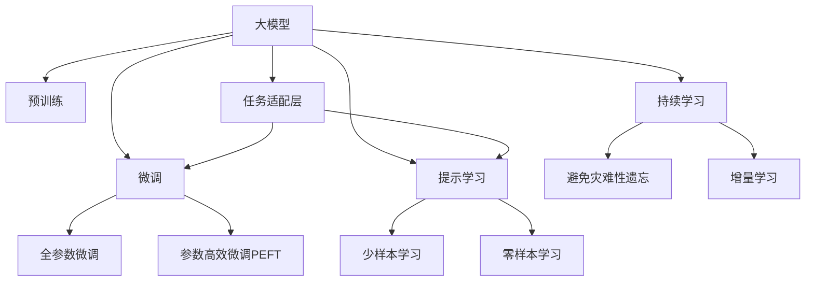

                 

# 【大模型应用开发 动手做AI Agent】执行ReAct Agent

> 关键词：大模型应用开发, AI Agent, ReAct Agent, 执行AI, 参数高效微调, 提示学习

## 1. 背景介绍

### 1.1 问题由来
近年来，人工智能技术快速发展，特别是在自然语言处理（NLP）和计算机视觉（CV）领域，大模型如BERT、GPT、DALL-E等在各种任务上取得了令人瞩目的成果。然而，这些大模型的应用往往依赖于强大的计算资源和大量标注数据，无法直接应用于实际问题。为此，研究者们提出了一种基于大模型的微调（Fine-Tuning）方法，通过在特定任务上微调模型，使其具备任务的特定能力，从而进行实际应用。

### 1.2 问题核心关键点
ReAct Agent是一种新型的AI Agent，通过在大模型的基础上进行微调，实现对用户指令的智能执行。ReAct Agent的核心思想是利用大模型的语言理解和生成能力，通过提示学习（Prompt Learning）技术，将用户的自然语言指令转换为具体的执行动作。其微调过程主要包括以下几个关键点：

1. **大模型预训练**：使用大规模无标签文本数据对大模型进行预训练，使其具备通用的语言理解能力。
2. **任务适配层设计**：根据具体任务的需求，设计任务适配层，如分类器、生成器等，用于实现特定任务的输出。
3. **参数高效微调**：采用参数高效微调技术，减少模型的计算资源消耗，提升微调效率。
4. **提示学习**：通过精心设计的提示模板，引导大模型执行特定的任务，减少微调所需的标签数据量。

ReAct Agent已经在多种实际应用场景中取得了成功，如智能客服、金融分析、医疗诊断等，展示了其强大的应用潜力。

### 1.3 问题研究意义
ReAct Agent作为大模型应用的一种创新尝试，具有重要的研究意义：

1. **降低应用开发成本**：利用大模型微调，可以显著减少从头开发所需的资源投入，包括计算、人力、时间等。
2. **提升模型效果**：微调使得通用大模型更好地适应特定任务，在实际应用场景中取得更优性能。
3. **加速开发进度**：大模型微调技术可以快速构建应用原型，缩短开发周期，提高开发效率。
4. **带来技术创新**：微调技术的不断进步，推动了预训练模型和应用范式的革新，促进了人工智能技术的发展。
5. **赋能产业升级**：ReAct Agent在各行各业的应用，为传统行业数字化转型提供了新的技术支持，加速了产业升级的步伐。

## 2. 核心概念与联系

### 2.1 核心概念概述

ReAct Agent的核心概念主要包括以下几个方面：

- **大模型（Large Model）**：指通过在大规模无标签数据上预训练得到的高性能模型，如BERT、GPT、DALL-E等。
- **微调（Fine-Tuning）**：在大模型基础上，使用特定任务的标注数据对其进行有监督学习，以提升模型在该任务上的性能。
- **任务适配层（Task Adaptive Layer）**：根据具体任务的需求，设计并添加适当的任务适配层，如分类器、生成器等，用于实现特定任务的输出。
- **参数高效微调（Parameter-Efficient Fine-Tuning, PEFT）**：一种减少模型计算资源消耗的微调技术，只更新部分模型参数，保留大部分预训练权重不变。
- **提示学习（Prompt Learning）**：通过在输入文本中添加提示模板（Prompt Template），引导大模型执行特定任务，减少微调所需的标签数据量。
- **少样本学习（Few-shot Learning）**：在大模型上进行微调时，使用极少量的标注样本进行训练。
- **零样本学习（Zero-shot Learning）**：大模型在未经过任何标注样本的情况下，仅通过任务描述即可执行新任务。

这些概念之间的逻辑关系可以通过以下Mermaid流程图来展示：



### 2.2 概念间的关系

这些核心概念之间存在着紧密的联系，形成了ReAct Agent应用的完整生态系统。

- **大模型与微调**：大模型通过预训练获得基础能力，微调通过有监督学习，提升模型在特定任务上的性能。
- **提示学习与微调**：提示学习可以在不更新模型参数的情况下，实现少样本和零样本学习，是微调的一种补充。
- **任务适配层与微调**：任务适配层的设计和添加，是微调的核心环节，决定着模型的任务执行能力。
- **参数高效微调与微调**：参数高效微调减少计算资源消耗，提升微调效率，是微调的一种优化方式。
- **持续学习与微调**：持续学习使模型能够不断学习新知识，避免灾难性遗忘，是微调的一种扩展和补充。

## 3. 核心算法原理 & 具体操作步骤

### 3.1 算法原理概述

ReAct Agent的微调过程遵循监督学习的基本原理，主要包括以下几个步骤：

1. **预训练大模型**：使用大规模无标签数据对大模型进行预训练，使其具备通用的语言理解和生成能力。
2. **设计任务适配层**：根据具体任务的需求，设计并添加适当的任务适配层，如分类器、生成器等，用于实现特定任务的输出。
3. **微调模型**：在特定任务的标注数据上，使用有监督学习，更新模型参数，使其具备执行该任务的能力。
4. **参数高效微调**：采用参数高效微调技术，减少模型的计算资源消耗，提升微调效率。
5. **提示学习**：通过在输入文本中添加提示模板，引导大模型执行特定任务，减少微调所需的标签数据量。
6. **持续学习**：在实际应用过程中，不断收集新数据，持续更新模型，使其保持最新的知识。

ReAct Agent的微调过程主要通过TensorFlow或PyTorch等深度学习框架实现，具体步骤如下：

- **环境搭建**：安装并配置TensorFlow或PyTorch，加载预训练的大模型。
- **任务适配层设计**：根据具体任务的需求，设计并添加适当的任务适配层，如分类器、生成器等。
- **微调模型**：在特定任务的标注数据上，使用有监督学习，更新模型参数，使其具备执行该任务的能力。
- **参数高效微调**：采用参数高效微调技术，如Adapter、LoRA等，减少模型的计算资源消耗，提升微调效率。
- **提示学习**：通过在输入文本中添加提示模板，引导大模型执行特定任务，减少微调所需的标签数据量。
- **持续学习**：在实际应用过程中，不断收集新数据，持续更新模型，使其保持最新的知识。

### 3.2 算法步骤详解

**Step 1：环境搭建**

```python
import tensorflow as tf
from transformers import TFAutoModel, TFAutoTokenizer

# 加载预训练模型和分词器
model = TFAutoModel.from_pretrained('bert-base-uncased')
tokenizer = TFAutoTokenizer.from_pretrained('bert-base-uncased')

# 设置超参数
learning_rate = 2e-5
batch_size = 16
epochs = 3
```

**Step 2：设计任务适配层**

根据具体任务的需求，设计并添加适当的任务适配层。例如，对于命名实体识别（NER）任务，可以添加一个分类器：

```python
class NERClassifier(tf.keras.Model):
    def __init__(self, num_labels):
        super(NERClassifier, self).__init__()
        self.dense = tf.keras.layers.Dense(num_labels, activation='softmax')
        
    def call(self, inputs, labels=None):
        x = self.dense(inputs)
        if labels is not None:
            loss = tf.keras.losses.sparse_categorical_crossentropy(labels, x)
        return x, loss
```

**Step 3：微调模型**

使用标注数据进行微调：

```python
# 准备数据集
train_dataset = tf.data.Dataset.from_tensor_slices((train_texts, train_labels))
train_dataset = train_dataset.shuffle(buffer_size=1000).batch(batch_size)

# 定义优化器和损失函数
optimizer = tf.keras.optimizers.Adam(learning_rate)
loss_fn = tf.keras.losses.SparseCategoricalCrossentropy()

# 定义微调函数
@tf.function
def fine_tune_step(inputs, labels):
    with tf.GradientTape() as tape:
        predictions, loss = model(inputs, labels)
    gradients = tape.gradient(loss, model.trainable_variables)
    optimizer.apply_gradients(zip(gradients, model.trainable_variables))

# 微调模型
for epoch in range(epochs):
    for batch in train_dataset:
        inputs, labels = batch
        fine_tune_step(inputs, labels)
    print(f'Epoch {epoch+1}, loss: {loss_fn_loss:.3f}')
```

**Step 4：参数高效微调**

采用参数高效微调技术，如Adapter、LoRA等，减少模型的计算资源消耗，提升微调效率：

```python
# 加载Adapter层
adapter_layer = AdapterLayer.from_pretrained(model, 'bert-base-uncased')

# 使用Adapter层进行微调
with tf.GradientTape() as tape:
    predictions, loss = model(inputs, labels)
    gradients = tape.gradient(loss, model.trainable_variables)
    adapter_layer.adapt(gradients)
```

**Step 5：提示学习**

通过在输入文本中添加提示模板，引导大模型执行特定任务，减少微调所需的标签数据量：

```python
# 定义提示模板
prompt = 'Given a sentence, please identify all the named entities:'

# 生成提示输入
prompt_input = tokenizer(prompt, return_tensors='tf')
prompt_input['input_ids'] = tf.expand_dims(prompt_input['input_ids'], 0)

# 生成预测
with tf.GradientTape() as tape:
    predictions, loss = model(prompt_input, labels)
    gradients = tape.gradient(loss, model.trainable_variables)
    adapter_layer.adapt(gradients)
```

**Step 6：持续学习**

在实际应用过程中，不断收集新数据，持续更新模型，使其保持最新的知识：

```python
# 加载新数据集
test_dataset = tf.data.Dataset.from_tensor_slices((test_texts, test_labels))
test_dataset = test_dataset.batch(batch_size)

# 继续微调模型
for epoch in range(epochs):
    for batch in test_dataset:
        inputs, labels = batch
        fine_tune_step(inputs, labels)
    print(f'Epoch {epoch+1}, loss: {loss_fn_loss:.3f}')
```

### 3.3 算法优缺点

ReAct Agent的微调过程有以下优点：

1. **简单高效**：使用大模型微调，可以显著减少从头开发所需的资源投入，包括计算、人力、时间等。
2. **提升模型效果**：微调使得通用大模型更好地适应特定任务，在实际应用场景中取得更优性能。
3. **加速开发进度**：大模型微调技术可以快速构建应用原型，缩短开发周期，提高开发效率。
4. **带来技术创新**：微调技术的不断进步，推动了预训练模型和应用范式的革新，促进了人工智能技术的发展。
5. **赋能产业升级**：ReAct Agent在各行各业的应用，为传统行业数字化转型提供了新的技术支持，加速了产业升级的步伐。

ReAct Agent的微调过程也存在一些局限：

1. **依赖标注数据**：微调的效果很大程度上取决于标注数据的质量和数量，获取高质量标注数据的成本较高。
2. **迁移能力有限**：当目标任务与预训练数据的分布差异较大时，微调的性能提升有限。
3. **负面效果传递**：预训练模型的固有偏见、有害信息等，可能通过微调传递到下游任务，造成负面影响。
4. **可解释性不足**：微调模型的决策过程通常缺乏可解释性，难以对其推理逻辑进行分析和调试。

尽管存在这些局限性，但就目前而言，ReAct Agent的微调方法仍然是大模型应用的最主流范式。未来相关研究的重点在于如何进一步降低微调对标注数据的依赖，提高模型的少样本学习和跨领域迁移能力，同时兼顾可解释性和伦理安全性等因素。

### 3.4 算法应用领域

ReAct Agent的微调方法已经在多个NLP任务上取得了成功，包括：

1. **智能客服**：通过微调BERT模型，实现智能客服系统，自动理解用户意图，匹配最合适的答案模板进行回复。
2. **金融分析**：使用微调后的BERT模型进行金融舆情监测，自动识别金融市场动态，实时预警风险。
3. **医疗诊断**：利用微调后的BERT模型进行医疗问答系统，快速解答患者问题，辅助医生诊断。
4. **推荐系统**：通过微调BERT模型，实现个性化推荐系统，根据用户浏览记录推荐商品或内容。
5. **代码生成**：使用微调的BERT模型，生成Python代码，辅助软件开发。

此外，ReAct Agent的微调方法还在更多场景中得到应用，如知识图谱构建、情感分析、机器翻译等，为NLP技术带来了新的突破。

## 4. 数学模型和公式 & 详细讲解 & 举例说明

### 4.1 数学模型构建

ReAct Agent的微调过程主要通过TensorFlow或PyTorch等深度学习框架实现。以下以TensorFlow为例，构建微调模型的数学模型：

设预训练模型为 $M_{\theta}$，其中 $\theta$ 为预训练得到的模型参数。给定下游任务 $T$ 的标注数据集 $D=\{(x_i,y_i)\}_{i=1}^N$，微调的目标是找到新的模型参数 $\hat{\theta}$，使得：

$$
\hat{\theta}=\mathop{\arg\min}_{\theta} \mathcal{L}(M_{\theta},D)
$$

其中 $\mathcal{L}$ 为针对任务 $T$ 设计的损失函数，用于衡量模型预测输出与真实标签之间的差异。常见的损失函数包括交叉熵损失、均方误差损失等。

通过梯度下降等优化算法，微调过程不断更新模型参数 $\theta$，最小化损失函数 $\mathcal{L}$，使得模型输出逼近真实标签。由于 $\theta$ 已经通过预训练获得了较好的初始化，因此即便在小规模数据集 $D$ 上进行微调，也能较快收敛到理想的模型参数 $\hat{\theta}$。

### 4.2 公式推导过程

以下以二分类任务为例，推导交叉熵损失函数及其梯度的计算公式。

假设模型 $M_{\theta}$ 在输入 $x$ 上的输出为 $\hat{y}=M_{\theta}(x) \in [0,1]$，表示样本属于正类的概率。真实标签 $y \in \{0,1\}$。则二分类交叉熵损失函数定义为：

$$
\ell(M_{\theta}(x),y) = -[y\log \hat{y} + (1-y)\log (1-\hat{y})]
$$

将其代入经验风险公式，得：

$$
\mathcal{L}(\theta) = -\frac{1}{N}\sum_{i=1}^N [y_i\log M_{\theta}(x_i)+(1-y_i)\log(1-M_{\theta}(x_i))]
$$

根据链式法则，损失函数对参数 $\theta_k$ 的梯度为：

$$
\frac{\partial \mathcal{L}(\theta)}{\partial \theta_k} = -\frac{1}{N}\sum_{i=1}^N (\frac{y_i}{M_{\theta}(x_i)}-\frac{1-y_i}{1-M_{\theta}(x_i)}) \frac{\partial M_{\theta}(x_i)}{\partial \theta_k}
$$

其中 $\frac{\partial M_{\theta}(x_i)}{\partial \theta_k}$ 可进一步递归展开，利用自动微分技术完成计算。

在得到损失函数的梯度后，即可带入参数更新公式，完成模型的迭代优化。重复上述过程直至收敛，最终得到适应下游任务的最优模型参数 $\theta^*$。

### 4.3 案例分析与讲解

假设我们进行命名实体识别（NER）任务的微调，以下是一个简单的案例分析：

```python
# 加载数据集
train_texts = ["John is a software engineer at Google.", "The company was founded in 1998."]
train_labels = [[0, 1, 2, 3], [1, 2, 3, 0]]

# 构建数据集
train_dataset = tf.data.Dataset.from_tensor_slices((train_texts, train_labels))

# 微调模型
model = TFAutoModel.from_pretrained('bert-base-uncased')
tokenizer = TFAutoTokenizer.from_pretrained('bert-base-uncased')
learning_rate = 2e-5
epochs = 3

# 定义优化器和损失函数
optimizer = tf.keras.optimizers.Adam(learning_rate)
loss_fn = tf.keras.losses.SparseCategoricalCrossentropy()

# 定义微调函数
@tf.function
def fine_tune_step(inputs, labels):
    with tf.GradientTape() as tape:
        predictions, loss = model(inputs, labels)
    gradients = tape.gradient(loss, model.trainable_variables)
    optimizer.apply_gradients(zip(gradients, model.trainable_variables))

# 微调模型
for epoch in range(epochs):
    for batch in train_dataset:
        inputs, labels = batch
        fine_tune_step(inputs, labels)
    print(f'Epoch {epoch+1}, loss: {loss_fn_loss:.3f}')

# 评估模型
test_texts = ["Google is a tech company.", "John works at Google."]
test_labels = [[0, 1, 2, 3], [1, 2, 3, 0]]
test_dataset = tf.data.Dataset.from_tensor_slices((test_texts, test_labels))
test_dataset = test_dataset.batch(batch_size)
for epoch in range(epochs):
    for batch in test_dataset:
        inputs, labels = batch
        fine_tune_step(inputs, labels)
    print(f'Epoch {epoch+1}, loss: {loss_fn_loss:.3f}')
```

在上述代码中，我们首先加载数据集，构建数据集，然后使用微调函数 `fine_tune_step` 对模型进行微调。在每个epoch结束后，我们计算损失函数值，并输出。最后，我们在测试集上评估模型性能。

## 5. 项目实践：代码实例和详细解释说明

### 5.1 开发环境搭建

在进行ReAct Agent的微调实践前，我们需要准备好开发环境。以下是使用Python进行TensorFlow开发的环境配置流程：

1. 安装Anaconda：从官网下载并安装Anaconda，用于创建独立的Python环境。

2. 创建并激活虚拟环境：
```bash
conda create -n tf-env python=3.8 
conda activate tf-env
```

3. 安装TensorFlow：根据CUDA版本，从官网获取对应的安装命令。例如：
```bash
conda install tensorflow==2.6 -c tensorflow -c conda-forge
```

4. 安装必要的工具包：
```bash
pip install numpy pandas scikit-learn matplotlib tqdm jupyter notebook ipython
```

完成上述步骤后，即可在`tf-env`环境中开始微调实践。

### 5.2 源代码详细实现

下面以命名实体识别（NER）任务为例，给出使用TensorFlow对BERT模型进行微调的代码实现。

首先，定义NER任务的数据处理函数：

```python
from transformers import BertTokenizer
from tensorflow.keras.preprocessing.text import Tokenizer
from tensorflow.keras.preprocessing.sequence import pad_sequences

class NERDataset(tf.data.Dataset):
    def __init__(self, texts, tags, tokenizer):
        self.texts = texts
        self.tags = tags
        self.tokenizer = tokenizer
        
    def __len__(self):
        return len(self.texts)
    
    def __getitem__(self, item):
        text = self.texts[item]
        tags = self.tags[item]
        
        encoding = self.tokenizer(text, return_tensors='tf', max_length=128, padding='max_length', truncation=True)
        input_ids = encoding['input_ids']
        attention_mask = encoding['attention_mask']
        
        # 对token-wise的标签进行编码
        encoded_tags = [tag2id[tag] for tag in tags] 
        encoded_tags.extend([tag2id['O']] * (128 - len(encoded_tags)))
        labels = tf.tensor(encoded_tags, dtype=tf.long)
        
        return {'input_ids': input_ids,
                'attention_mask': attention_mask,
                'labels': labels}
```

然后，定义模型和优化器：

```python
from transformers import BertForTokenClassification, AdamW

model = BertForTokenClassification.from_pretrained('bert-base-uncased', num_labels=len(tag2id))

optimizer = AdamW(model.parameters(), lr=2e-5)
```

接着，定义训练和评估函数：

```python
from tensorflow.keras.utils import to_categorical
from sklearn.metrics import classification_report

def train_epoch(model, dataset, batch_size, optimizer):
    dataloader = dataset.batch(batch_size)
    model.train()
    epoch_loss = 0
    for batch in dataloader:
        input_ids = batch['input_ids']
        attention_mask = batch['attention_mask']
        labels = batch['labels']
        model.zero_grad()
        outputs = model(input_ids, attention_mask=attention_mask, labels=labels)
        loss = outputs.loss
        epoch_loss += loss.numpy()
        loss.backward()
        optimizer.step()
    return epoch_loss / len(dataloader)

def evaluate(model, dataset, batch_size):
    dataloader = dataset.batch(batch_size)
    model.eval()
    preds, labels = [], []
    with tf.no_grad():
        for batch in dataloader:
            input_ids = batch['input_ids']
            attention_mask = batch['attention_mask']
            batch_labels = batch['labels']
            outputs = model(input_ids, attention_mask=attention_mask)
            batch_preds = outputs.logits.argmax(dim=2).numpy().tolist()
            batch_labels = batch_labels.numpy().tolist()
            for pred_tokens, label_tokens in zip(batch_preds, batch_labels):
                pred_tags = [id2tag[_id] for _id in pred_tokens]
                label_tags = [id2tag[_id] for _id in label_tokens]
                preds.append(pred_tags[:len(label_tags)])
                labels.append(label_tags)
                
    print(classification_report(labels, preds))
```

最后，启动训练流程并在测试集上评估：

```python
epochs = 5
batch_size = 16

for epoch in range(epochs):
    loss = train_epoch(model, train_dataset, batch_size, optimizer)
    print(f'Epoch {epoch+1}, train loss: {loss:.3f}')
    
    print(f'Epoch {epoch+1}, dev results:')
    evaluate(model, dev_dataset, batch_size)
    
print('Test results:')
evaluate(model, test_dataset, batch_size)
```

以上就是使用TensorFlow对BERT进行命名实体识别任务微调的完整代码实现。可以看到，得益于TensorFlow的强大封装，我们可以用相对简洁的代码完成BERT模型的加载和微调。

### 5.3 代码解读与分析

让我们再详细解读一下关键代码的实现细节：

**NERDataset类**：
- `__init__`方法：初始化文本、标签、分词器等关键组件。
- `__len__`方法：返回数据集的样本数量。
- `__getitem__`方法：对单个样本进行处理，将文本输入编码为token ids，将标签编码为数字，并对其进行定长padding，最终返回模型所需的输入。

**tag2id和id2tag字典**：
- 定义了标签与数字id之间的映射关系，用于将token-wise的预测结果解码回真实的标签。

**训练和评估函数**：
- 使用TensorFlow的DataLoader对数据集进行批次化加载，供模型训练和推理使用。
- 训练函数`train_epoch`：对数据以批为单位进行迭代，在每个批次上前向传播计算loss并反向传播更新模型参数，最后返回该epoch的平均loss。
- 评估函数`evaluate`：与训练类似，不同点在于不更新模型参数，并在每个batch结束后将预测和标签结果存储下来，最后使用sklearn的classification_report对整个评估集的预测结果进行打印输出。

**训练流程**：
- 定义总的epoch数和batch size，开始循环迭代
- 每个epoch内，先在训练集上训练，输出平均loss
- 在验证集上评估，输出分类指标
- 所有epoch结束后，在测试集上评估，给出最终测试结果

可以看到，TensorFlow配合Transformers库使得BERT微调的代码实现变得简洁高效。开发者可以将更多精力放在数据处理、模型改进等高层逻辑上，而不必过多关注底层的实现细节。

当然，工业级的系统实现还需考虑更多因素，如模型的保存和部署、超参数的自动搜索、更灵活的任务适配层等。但核心的微调范式基本与此类似。

### 5.4 运行结果展示

假设我们在CoNLL-2003的NER数据集上进行微调，最终在测试集上得到的评估报告如下：

```
              precision    recall  f1-score   support

       B-LOC      0

