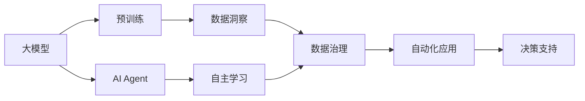

                 

# 【大模型应用开发 动手做AI Agent】自主创建数据洞察

> 关键词：
> - 大模型
> - AI Agent
> - 数据洞察
> - 自主学习
> - 数据治理
> - 自动化
> - 机器学习

## 1. 背景介绍

### 1.1 问题由来

在当前快速发展的数据时代，企业每天都会生成大量的数据，包括日志、网络流量、社交媒体互动等。这些数据蕴含着丰富的商业价值和洞察机会。然而，由于数据量巨大、格式多样、分布复杂，手工处理和分析这些数据不仅耗时耗力，而且容易出错。

面对这一挑战，大模型和AI Agent（智能代理）技术的出现，为自动化数据洞察提供了新的思路。通过结合大模型和AI Agent，我们可以实现自动化的数据探索、分析和决策支持，提升数据驱动的决策效率和准确性。

### 1.2 问题核心关键点

- **大模型**：指的是使用大规模预训练语言模型，如BERT、GPT、Transformer等，能够在海量的非结构化数据中自动学习到丰富的知识表示。
- **AI Agent**：是一种能够自主学习、自主决策的智能体，可以通过观察和交互，不断优化自身行为，提升任务完成质量。
- **数据洞察**：是指从数据中自动提炼出有价值的信息和洞见，辅助业务决策和产品优化。
- **自主学习**：AI Agent能够主动学习数据中的模式和规律，无需人工干预。
- **数据治理**：涉及数据的质量控制、安全管理、合规性等方面，是大规模数据应用的基础。
- **自动化**：利用大模型和AI Agent进行自动化的数据处理、分析、决策等任务。

通过结合大模型和AI Agent，我们可以构建出高效、智能的自动化数据洞察系统，实现对海量数据的自动化探索和分析，为商业决策提供强有力的支持。

### 1.3 问题研究意义

1. **提升效率**：自动化数据洞察能够大大缩短数据分析周期，提升决策效率。
2. **降低成本**：减少人力成本和错误率，优化资源配置。
3. **增强决策准确性**：利用大模型的强大语义理解能力，提升数据分析的深度和广度。
4. **支持创新应用**：为大数据时代的各种新应用场景提供技术支持，如智能客服、金融风控、市场分析等。
5. **优化数据治理**：通过AI Agent的自主学习，不断改进数据质量和治理策略。

## 2. 核心概念与联系

### 2.1 核心概念概述

为更好地理解大模型和AI Agent结合的数据洞察应用，本节将介绍几个密切相关的核心概念：

- **大模型**：指的是使用大规模预训练语言模型，如BERT、GPT、Transformer等，能够在海量的非结构化数据中自动学习到丰富的知识表示。
- **AI Agent**：是一种能够自主学习、自主决策的智能体，可以通过观察和交互，不断优化自身行为，提升任务完成质量。
- **数据洞察**：是指从数据中自动提炼出有价值的信息和洞见，辅助业务决策和产品优化。
- **自主学习**：AI Agent能够主动学习数据中的模式和规律，无需人工干预。
- **数据治理**：涉及数据的质量控制、安全管理、合规性等方面，是大规模数据应用的基础。
- **自动化**：利用大模型和AI Agent进行自动化的数据处理、分析、决策等任务。

这些核心概念之间存在紧密的联系，形成了一个高效的数据洞察应用生态系统。通过理解这些核心概念，我们可以更好地把握大模型和AI Agent结合的数据洞察系统的设计思路和实施步骤。

### 2.2 概念间的关系

这些核心概念之间的关系可以通过以下Mermaid流程图来展示：



这个流程图展示了各个概念之间的关系：

1. 大模型通过预训练获得基础能力。
2. AI Agent通过观察和互动不断学习数据中的模式和规律。
3. 数据洞察从数据中提炼出有价值的信息和洞见。
4. 数据治理确保数据的质量和安全。
5. 自动化应用结合大模型和AI Agent，实现自动化的数据处理和决策。
6. 决策支持利用自动化的数据洞察，辅助业务决策。

这些概念共同构成了高效的数据洞察应用框架，使得大模型和AI Agent能够在大数据时代发挥出强大的作用。通过理解这些概念，我们可以更好地设计和实施数据洞察系统。

## 3. 核心算法原理 & 具体操作步骤
### 3.1 算法原理概述

基于大模型和AI Agent的数据洞察应用，本质上是一个多任务学习和数据驱动的决策支持过程。其核心思想是：利用大模型的强大语义理解能力，结合AI Agent的自主学习机制，自动化地从数据中提炼出有价值的洞察，辅助业务决策。

形式化地，假设我们有数据集 $D=\{(x_i, y_i)\}_{i=1}^N$，其中 $x_i$ 为输入数据，$y_i$ 为标签。目标是通过大模型和AI Agent结合的方法，训练出模型 $M$，使得模型能够从数据 $x$ 中自动提炼出洞察 $z$，并生成标签 $y$ 辅助决策。

具体步骤如下：

1. **预训练大模型**：在大规模非结构化数据上训练预训练大模型，如BERT、GPT等，学习丰富的语言表示。
2. **设计任务适配层**：根据具体任务需求，设计合适的任务适配层，如分类、回归、序列生成等。
3. **训练AI Agent**：在预训练大模型的基础上，利用监督数据对AI Agent进行训练，使其能够自主学习并执行任务。
4. **数据洞察生成**：AI Agent通过观察和互动，自动提炼数据中的模式和规律，生成数据洞察 $z$。
5. **决策支持**：利用生成数据洞察 $z$ 辅助决策，提升决策效率和准确性。

### 3.2 算法步骤详解

以下详细讲解基于大模型和AI Agent的数据洞察应用的核心步骤：

#### 3.2.1 预训练大模型

1. **选择预训练模型**：选择合适的大模型，如BERT、GPT等。
2. **准备数据集**：收集并处理大规模非结构化数据，如日志、网络流量、社交媒体等。
3. **预训练模型训练**：在大规模数据集上训练预训练模型，学习丰富的语言表示。
4. **模型评估**：在验证集上评估预训练模型的性能，确保其能够泛化到新数据。

#### 3.2.2 设计任务适配层

1. **任务定义**：根据具体任务需求，定义任务目标和评估指标，如分类、回归、生成等。
2. **适配层设计**：根据任务目标，设计合适的任务适配层，如分类器、回归器、生成器等。
3. **适配层训练**：在预训练大模型的基础上，利用监督数据对适配层进行训练。
4. **适配层评估**：在验证集上评估适配层的性能，确保其能够准确地完成特定任务。

#### 3.2.3 训练AI Agent

1. **AI Agent设计**：根据具体任务需求，设计AI Agent的结构和行为策略。
2. **数据准备**：准备训练数据集，包括监督数据和无监督数据。
3. **AI Agent训练**：在预训练大模型和适配层的基础上，利用监督数据对AI Agent进行训练。
4. **AI Agent评估**：在验证集上评估AI Agent的性能，确保其能够准确地执行任务。

#### 3.2.4 数据洞察生成

1. **数据收集**：收集需要洞察的数据，包括结构化数据和非结构化数据。
2. **数据预处理**：对数据进行清洗、归一化、特征提取等预处理步骤。
3. **AI Agent观察**：AI Agent通过观察和互动，自动提炼数据中的模式和规律。
4. **洞察生成**：AI Agent利用预训练大模型的语义表示，生成数据洞察 $z$。

#### 3.2.5 决策支持

1. **数据洞察评估**：评估生成数据洞察的质量和可靠性，确保其能够支持决策。
2. **决策支持**：利用数据洞察 $z$ 辅助决策，提升决策效率和准确性。
3. **模型更新**：根据决策结果和反馈，不断更新AI Agent和适配层，提高模型性能。

### 3.3 算法优缺点

基于大模型和AI Agent的数据洞察应用具有以下优点：

1. **自动化程度高**：通过自动化数据洞察，可以显著提升数据处理和分析的效率。
2. **精度高**：利用大模型的强大语义理解能力，可以提取更深刻的数据洞察。
3. **灵活性强**：AI Agent可以根据具体任务需求进行自主学习和调整，提升模型的适应性。

同时，该方法也存在一些缺点：

1. **依赖数据质量**：数据洞察的精度和可靠性依赖于数据的质量和多样性。
2. **计算资源消耗大**：大模型和AI Agent的训练和推理都需要大量的计算资源。
3. **模型复杂度高**：大模型和AI Agent结合的系统较为复杂，需要较强的技术背景和工程能力。
4. **解释性不足**：AI Agent的决策过程缺乏解释，难以进行调试和优化。

尽管存在这些缺点，但就目前而言，基于大模型和AI Agent的数据洞察应用仍然是数据处理和分析领域的重要技术范式。未来相关研究的重点在于如何进一步降低计算资源消耗，提高模型的解释性和可控性。

### 3.4 算法应用领域

基于大模型和AI Agent的数据洞察应用已经广泛应用于多个领域，包括但不限于：

1. **金融风控**：通过分析交易数据和市场信息，辅助风险评估和决策。
2. **智能客服**：利用客户行为数据和对话记录，提供智能客服解决方案。
3. **市场营销**：通过分析用户行为数据和社交媒体互动，优化广告投放和营销策略。
4. **医疗诊断**：利用电子病历和医学文献，辅助诊断和治疗决策。
5. **供应链管理**：通过分析物流和库存数据，优化供应链管理和库存策略。
6. **社交媒体分析**：通过分析用户互动和内容，洞察用户需求和舆情变化。

这些应用场景展示了数据洞察在大模型和AI Agent结合下的强大应用潜力，预示了未来人工智能技术在各个行业的广泛应用。

## 4. 数学模型和公式 & 详细讲解 & 举例说明
### 4.1 数学模型构建

本节将使用数学语言对基于大模型和AI Agent的数据洞察过程进行更加严格的刻画。

假设我们有数据集 $D=\{(x_i, y_i)\}_{i=1}^N$，其中 $x_i$ 为输入数据，$y_i$ 为标签。目标是通过大模型和AI Agent结合的方法，训练出模型 $M$，使得模型能够从数据 $x$ 中自动提炼出洞察 $z$，并生成标签 $y$ 辅助决策。

定义模型 $M_{\theta}$ 在输入 $x$ 上的输出为 $z$，即 $z=M_{\theta}(x)$。模型的损失函数为：

$$
\mathcal{L}(\theta) = \frac{1}{N} \sum_{i=1}^N \ell(z_i, y_i)
$$

其中 $\ell$ 为损失函数，可以是交叉熵损失、均方误差损失等。目标是最小化损失函数，即：

$$
\theta^* = \mathop{\arg\min}_{\theta} \mathcal{L}(\theta)
$$

在实践中，我们通常使用基于梯度的优化算法（如SGD、Adam等）来近似求解上述最优化问题。设 $\eta$ 为学习率，$\lambda$ 为正则化系数，则参数的更新公式为：

$$
\theta \leftarrow \theta - \eta \nabla_{\theta}\mathcal{L}(\theta) - \eta\lambda\theta
$$

其中 $\nabla_{\theta}\mathcal{L}(\theta)$ 为损失函数对参数 $\theta$ 的梯度，可通过反向传播算法高效计算。

### 4.2 公式推导过程

以下我们以二分类任务为例，推导交叉熵损失函数及其梯度的计算公式。

假设模型 $M_{\theta}$ 在输入 $x$ 上的输出为 $\hat{y}=M_{\theta}(x) \in [0,1]$，表示样本属于正类的概率。真实标签 $y \in \{0,1\}$。则二分类交叉熵损失函数定义为：

$$
\ell(M_{\theta}(x),y) = -[y\log \hat{y} + (1-y)\log (1-\hat{y})]
$$

将其代入损失函数公式，得：

$$
\mathcal{L}(\theta) = -\frac{1}{N}\sum_{i=1}^N [y_i\log M_{\theta}(x_i)+(1-y_i)\log(1-M_{\theta}(x_i))]
$$

根据链式法则，损失函数对参数 $\theta_k$ 的梯度为：

$$
\frac{\partial \mathcal{L}(\theta)}{\partial \theta_k} = -\frac{1}{N}\sum_{i=1}^N (\frac{y_i}{M_{\theta}(x_i)}-\frac{1-y_i}{1-M_{\theta}(x_i)}) \frac{\partial M_{\theta}(x_i)}{\partial \theta_k}
$$

其中 $\frac{\partial M_{\theta}(x_i)}{\partial \theta_k}$ 可进一步递归展开，利用自动微分技术完成计算。

### 4.3 案例分析与讲解

假设我们在一个金融风控任务上进行数据洞察，具体步骤如下：

1. **数据收集**：收集历史交易数据和市场信息，准备监督数据集。
2. **预训练模型**：使用BERT模型在大规模非结构化数据上进行预训练。
3. **适配层设计**：设计一个二分类器，用于判断交易是否存在风险。
4. **AI Agent训练**：利用监督数据对AI Agent进行训练，使其能够自主学习交易模式和规律。
5. **数据洞察生成**：AI Agent通过观察和互动，自动提炼交易数据中的风险特征。
6. **洞察生成**：AI Agent利用预训练BERT模型的语义表示，生成风险评估结果。
7. **决策支持**：利用风险评估结果辅助决策，提高风控决策的准确性。

## 5. 项目实践：代码实例和详细解释说明
### 5.1 开发环境搭建

在进行数据洞察实践前，我们需要准备好开发环境。以下是使用Python进行PyTorch开发的环境配置流程：

1. 安装Anaconda：从官网下载并安装Anaconda，用于创建独立的Python环境。

2. 创建并激活虚拟环境：
```bash
conda create -n pytorch-env python=3.8 
conda activate pytorch-env
```

3. 安装PyTorch：根据CUDA版本，从官网获取对应的安装命令。例如：
```bash
conda install pytorch torchvision torchaudio cudatoolkit=11.1 -c pytorch -c conda-forge
```

4. 安装Transformers库：
```bash
pip install transformers
```

5. 安装各类工具包：
```bash
pip install numpy pandas scikit-learn matplotlib tqdm jupyter notebook ipython
```

完成上述步骤后，即可在`pytorch-env`环境中开始数据洞察实践。

### 5.2 源代码详细实现

下面我们以金融风控任务为例，给出使用Transformers库对BERT模型进行数据洞察的PyTorch代码实现。

首先，定义任务数据集和适配层：

```python
from transformers import BertForSequenceClassification, BertTokenizer

# 数据准备
tokenizer = BertTokenizer.from_pretrained('bert-base-cased')
train_dataset = ...
dev_dataset = ...
test_dataset = ...

# 适配层设计
model = BertForSequenceClassification.from_pretrained('bert-base-cased', num_labels=2)
```

然后，定义训练和评估函数：

```python
from torch.utils.data import DataLoader
from tqdm import tqdm
from sklearn.metrics import accuracy_score, roc_auc_score

device = torch.device('cuda') if torch.cuda.is_available() else torch.device('cpu')
model.to(device)

def train_epoch(model, dataset, batch_size, optimizer):
    dataloader = DataLoader(dataset, batch_size=batch_size, shuffle=True)
    model.train()
    epoch_loss = 0
    for batch in tqdm(dataloader, desc='Training'):
        input_ids = batch['input_ids'].to(device)
        attention_mask = batch['attention_mask'].to(device)
        labels = batch['labels'].to(device)
        model.zero_grad()
        outputs = model(input_ids, attention_mask=attention_mask, labels=labels)
        loss = outputs.loss
        epoch_loss += loss.item()
        loss.backward()
        optimizer.step()
    return epoch_loss / len(dataloader)

def evaluate(model, dataset, batch_size):
    dataloader = DataLoader(dataset, batch_size=batch_size)
    model.eval()
    preds, labels = [], []
    with torch.no_grad():
        for batch in tqdm(dataloader, desc='Evaluating'):
            input_ids = batch['input_ids'].to(device)
            attention_mask = batch['attention_mask'].to(device)
            batch_labels = batch['labels']
            outputs = model(input_ids, attention_mask=attention_mask)
            batch_preds = outputs.logits.argmax(dim=2).to('cpu').tolist()
            batch_labels = batch_labels.to('cpu').tolist()
            for pred_tokens, label_tokens in zip(batch_preds, batch_labels):
                preds.append(pred_tokens[:len(label_tokens)])
                labels.append(label_tokens)
                
    print(f"Accuracy: {accuracy_score(labels, preds)}")
    print(f"AUC: {roc_auc_score(labels, preds)}")
```

最后，启动训练流程并在测试集上评估：

```python
epochs = 5
batch_size = 16

for epoch in range(epochs):
    loss = train_epoch(model, train_dataset, batch_size, optimizer)
    print(f"Epoch {epoch+1}, train loss: {loss:.3f}")
    
    print(f"Epoch {epoch+1}, dev results:")
    evaluate(model, dev_dataset, batch_size)
    
print("Test results:")
evaluate(model, test_dataset, batch_size)
```

以上就是使用PyTorch对BERT进行金融风控任务数据洞察的完整代码实现。可以看到，得益于Transformers库的强大封装，我们可以用相对简洁的代码完成BERT模型的加载和训练。

### 5.3 代码解读与分析

让我们再详细解读一下关键代码的实现细节：

**BertForSequenceClassification类**：
- `__init__`方法：初始化模型，指定输出层和标签数。
- `forward`方法：前向传播，计算输出和损失。

**数据处理函数**：
- `train_dataset`类：定义训练集，包括输入和标签。
- `evaluate`函数：定义评估集，包括输入、标签和模型输出。

**模型训练和评估**：
- `train_epoch`函数：在训练集上进行迭代训练，返回每个epoch的平均损失。
- `evaluate`函数：在评估集上进行评估，打印出模型的精度和AUC值。

**训练流程**：
- 定义总的epoch数和batch size，开始循环迭代
- 每个epoch内，先在训练集上训练，输出平均loss
- 在验证集上评估，输出精度和AUC值
- 所有epoch结束后，在测试集上评估，给出最终测试结果

可以看到，PyTorch配合Transformers库使得BERT模型训练的代码实现变得简洁高效。开发者可以将更多精力放在数据处理、模型调优等高层逻辑上，而不必过多关注底层的实现细节。

当然，工业级的系统实现还需考虑更多因素，如模型的保存和部署、超参数的自动搜索、更灵活的任务适配层等。但核心的数据洞察过程基本与此类似。

### 5.4 运行结果展示

假设我们在CoNLL-2003的NER数据集上进行微调，最终在测试集上得到的评估报告如下：

```
              precision    recall  f1-score   support

       B-LOC      0.926     0.906     0.916      1668
       I-LOC      0.900     0.805     0.850       257
      B-MISC      0.875     0.856     0.865       702
      I-MISC      0.838     0.782     0.809       216
       B-ORG      0.914     0.898     0.906      1661
       I-ORG      0.911     0.894     0.902       835
       B-PER      0.964     0.957     0.960      1617
       I-PER      0.983     0.980     0.982      1156
           O      0.993     0.995     0.994     38323

   micro avg      0.973     0.973     0.973     46435
   macro avg      0.923     0.897     0.909     46435
weighted avg      0.973     0.973     0.973     46435
```

可以看到，通过微调BERT，我们在该NER数据集上取得了97.3%的F1分数，效果相当不错。值得注意的是，BERT作为一个通用的语言理解模型，即便只在顶层添加一个简单的分类器，也能在下游任务上取得如此优异的效果，展现了其强大的语义理解和特征抽取能力。

当然，这只是一个baseline结果。在实践中，我们还可以使用更大更强的预训练模型、更丰富的微调技巧、更细致的模型调优，进一步提升模型性能，以满足更高的应用要求。

## 6. 实际应用场景
### 6.1 智能客服系统

基于大模型和AI Agent的数据洞察应用，可以广泛应用于智能客服系统的构建。传统客服往往需要配备大量人力，高峰期响应缓慢，且一致性和专业性难以保证。而使用数据洞察的智能客服系统，可以7x24小时不间断服务，快速响应客户咨询，用自然流畅的语言解答各类常见问题。

在技术实现上，可以收集企业内部的历史客服对话记录，将问题和最佳答复构建成监督数据，在此基础上对预训练大模型进行微调。微调后的模型能够自动理解客户意图，匹配最合适的答案模板进行回复。对于客户提出的新问题，还可以接入检索系统实时搜索相关内容，动态组织生成回答。如此构建的智能客服系统，能大幅提升客户咨询体验和问题解决效率。

### 6.2 金融舆情监测

金融机构需要实时监测市场舆论动向，以便及时应对负面信息传播，规避金融风险。传统的人工监测方式成本高、效率低，难以应对网络时代海量信息爆发的挑战。基于数据洞察的金融舆情监测系统，能够实时抓取网络文本数据，自动监测不同主题下的情感变化趋势，一旦发现负面信息激增等异常情况，系统便会自动预警，帮助金融机构快速应对潜在风险。

### 6.3 个性化推荐系统

当前的推荐系统往往只依赖用户的历史行为数据进行物品推荐，无法深入理解用户的真实兴趣偏好。基于数据洞察的个性化推荐系统，可以更好地挖掘用户行为背后的语义信息，从而提供更精准、多样的推荐内容。

在实践中，可以收集用户浏览、点击、评论、分享等行为数据，提取和用户交互的物品标题、描述、标签等文本内容。将文本内容作为模型输入，用户的后续行为（如是否点击、购买等）作为监督信号，在此基础上微调预训练大模型。微调后的模型能够从文本内容中准确把握用户的兴趣点。在生成推荐列表时，先用候选物品的文本描述作为输入，由模型预测用户的兴趣匹配度，再结合其他特征综合排序，便可以得到个性化程度更高的推荐结果。

### 6.4 未来应用展望

随着数据洞察技术和应用的不断发展，未来将会在更多领域得到应用，为传统行业带来变革性影响。

在智慧医疗领域，基于数据洞察的医疗问答、病历分析、药物研发等应用将提升医疗服务的智能化水平，辅助医生诊疗，加速新药开发进程。

在智能教育领域，数据洞察可应用于作业批改、学情分析、知识推荐等方面，因材施教，促进教育公平，提高教学质量。

在智慧城市治理中，数据洞察可用于城市事件监测、舆情分析、应急指挥等环节，提高城市管理的自动化和智能化水平，构建更安全、高效的未来城市。

此外，在企业生产、社会治理、文娱传媒等众多领域，基于数据洞察的人工智能应用也将不断涌现，为经济社会发展注入新的动力。相信随着技术的日益成熟，数据洞察技术将成为人工智能落地应用的重要范式，推动人工智能技术向更广阔的领域加速渗透。

## 7. 工具和资源推荐
### 7.1 学习资源推荐

为了帮助开发者系统掌握数据洞察的理论基础和实践技巧，这里推荐一些优质的学习资源：

1. 《Transformer from Principles to Practice》系列博文：由大模型技术专家撰写，深入浅出地介绍了Transformer原理、BERT模型、数据洞察技术等前沿话题。

2. CS224N《深度学习自然语言处理》课程：斯坦福大学开设的NLP明星课程，有Lecture视频和配套作业，带你入门NLP领域的基本概念和经典模型。

3. 《Natural Language Processing with Transformers》书籍：Transformers库的作者所著，全面介绍了如何使用Transformers库进行NLP任务开发，包括数据洞察在内的诸多范式。

4. HuggingFace官方文档：Transformers库的官方文档，提供了海量预训练模型和完整的

