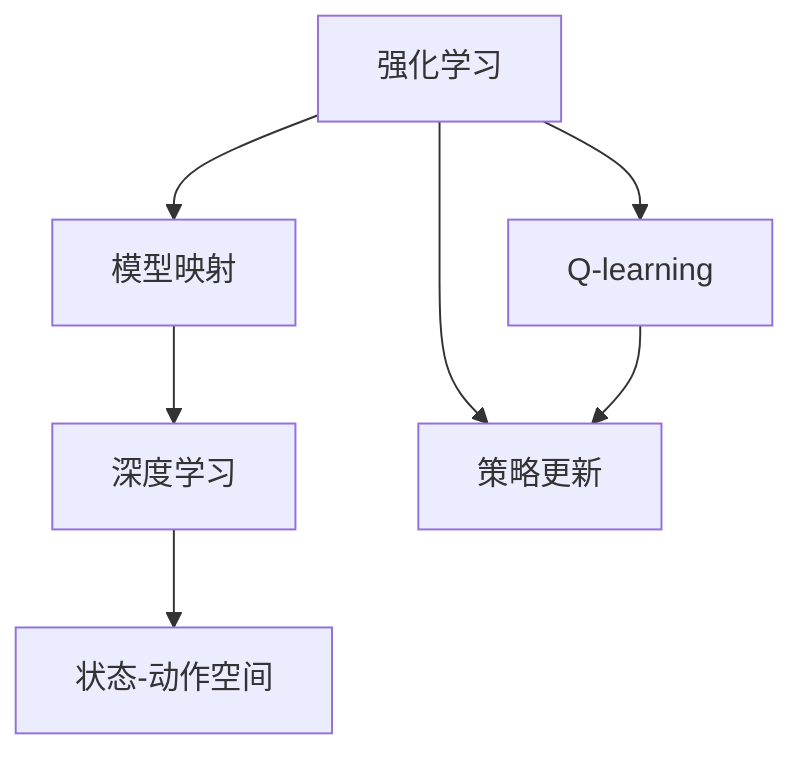
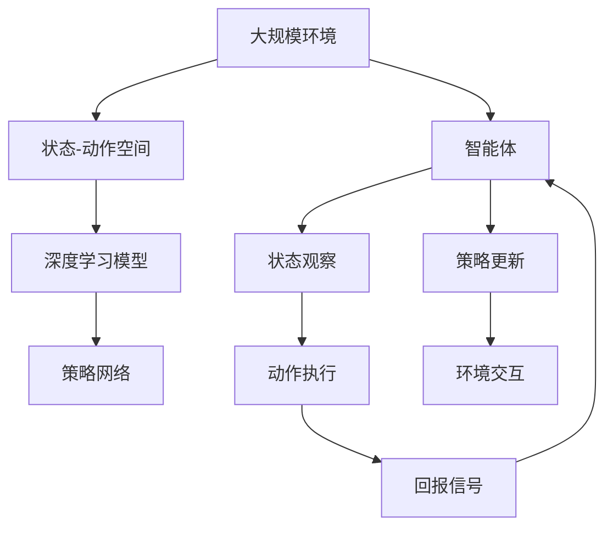

                 

# 一切皆是映射：AI Q-learning以及深度学习的融合

> 关键词：AI Q-learning, 深度学习, 强化学习, 模型映射, 状态-动作空间, 策略更新

## 1. 背景介绍

### 1.1 问题由来
人工智能（AI）领域中，强化学习（Reinforcement Learning, RL）和深度学习（Deep Learning, DL）是两个重要的分支，分别通过不同的机制解决复杂问题。RL强调通过智能体与环境的交互学习，找到最优策略以最大化累积回报；DL则通过多层神经网络逼近复杂的非线性映射，解决回归和分类等任务。然而，随着复杂性增加，单一技术已无法满足所有需求。为了弥合两者间的鸿沟，学术界和工业界开始探索如何融合RL和DL，以实现更高效的智能决策。

### 1.2 问题核心关键点
AI Q-learning以及深度学习的融合旨在将深度网络作为函数逼近器，将其嵌入到强化学习系统中，构建更复杂的模型。这种融合的优点在于：
- 深度网络能够处理高维、非线性的状态表示，从而提升状态表示和动作选择的质量。
- Q-learning作为强化学习的核心算法，可以高效地估计动作-价值函数，从而优化策略。
- 融合后的系统能够在多任务学习和策略优化上取得更好的效果。

### 1.3 问题研究意义
AI Q-learning和深度学习的融合对于提升智能决策系统的性能，拓展其在多领域的应用具有重要意义：
- 降低模型复杂性：深度网络可以捕捉复杂的函数映射，避免对环境建模的复杂性。
- 提高决策质量：深度网络能够更好地处理高维数据，提升模型的泛化能力。
- 加速模型训练：Q-learning的策略优化算法可以加快深度网络的训练过程。
- 拓展应用范围：融合技术能够在游戏、机器人、自动驾驶等高复杂性场景中提供更可靠、更高效的解决方案。

## 2. 核心概念与联系

### 2.1 核心概念概述

为了更好地理解AI Q-learning以及深度学习的融合，我们将介绍几个关键概念：

- **强化学习**：一种通过智能体与环境的交互，学习最优策略以最大化累积回报的学习范式。核心算法包括Q-learning、SARSA等。
- **深度学习**：一种通过多层神经网络逼近复杂非线性映射的机器学习技术，广泛应用于图像、语音、文本等领域。
- **模型映射**：将深度网络的表示能力与强化学习相结合，使用深度网络对环境进行建模，从而提升强化学习的效果。
- **状态-动作空间**：智能体在环境中的所有可能状态和动作组成的集合，深度学习用于对这一集合进行映射和表示。
- **策略更新**：在强化学习中，使用Q-learning等算法，根据当前状态和动作，更新智能体的策略，以优化累积回报。

### 2.2 概念间的关系

这些核心概念之间的关系可以通过以下Mermaid流程图来展示：



这个流程图展示了强化学习、模型映射、深度学习、策略更新和状态-动作空间之间的联系：

1. 强化学习作为基础框架，通过模型映射将深度学习嵌入其中。
2. 状态-动作空间是强化学习的基础，深度学习用于更好地映射和表示这一空间。
3. 策略更新是强化学习的核心机制，Q-learning等算法用于高效地更新策略。
4. 深度学习与强化学习的融合，通过模型映射将深度网络的表示能力嵌入到策略更新过程中。

### 2.3 核心概念的整体架构

最终，我们用一个综合的流程图来展示这些核心概念在大规模智能决策系统中的整体架构：



这个综合流程图展示了从大规模环境到智能体的整体决策过程：

1. 智能体通过深度学习模型对状态-动作空间进行映射。
2. 智能体使用策略网络进行策略选择，选择最佳动作。
3. 动作执行后，环境返回回报信号，用于策略更新。
4. 智能体通过环境交互，不断更新策略以最大化累积回报。

通过这个架构，我们可以看到深度学习和强化学习的融合如何为大规模智能决策系统提供更高效的决策路径。

## 3. 核心算法原理 & 具体操作步骤
### 3.1 算法原理概述

AI Q-learning以及深度学习的融合，本质上是一种增强式的模型映射方法。其核心思想是将深度网络作为函数逼近器，将其嵌入到强化学习系统中，构建更复杂的模型。具体而言，深度网络通过对状态-动作空间进行映射，学习更丰富的状态表示和动作选择策略，而Q-learning算法则用于估计动作-价值函数，从而优化策略。

形式化地，假设智能体在环境中的状态空间为 $S$，动作空间为 $A$，状态到动作的映射为 $f_\theta$，其中 $\theta$ 为深度网络的参数。智能体在状态 $s_t$ 下选择动作 $a_t$，得到回报 $r_{t+1}$ 和下一个状态 $s_{t+1}$。Q-learning的目标是最小化当前状态-动作对的Q值误差，即：

$$
\min_\theta \mathbb{E}\left[ Q(s_t,a_t) - (r_{t+1} + \gamma \max_a Q(s_{t+1},a) \right]^2
$$

其中，$\gamma$ 为折扣因子，$a$ 为动作选择集合。

### 3.2 算法步骤详解

基于AI Q-learning的深度学习融合通常包括以下几个关键步骤：

**Step 1: 准备深度学习模型和环境**

- 选择适合的深度学习框架（如TensorFlow、PyTorch等），设计并训练深度网络。
- 搭建环境模拟系统，用于模拟智能体的行为和交互。
- 定义状态-动作空间，对环境进行建模。

**Step 2: 构建深度学习网络**

- 设计深度网络的结构和参数初始化。
- 使用环境数据进行训练，学习状态-动作映射 $f_\theta$。
- 将深度网络的输出作为状态-动作表示，输入到Q-learning算法中。

**Step 3: 应用Q-learning优化策略**

- 初始化Q-learning算法参数，如学习率 $\alpha$、折扣因子 $\gamma$、探索率 $\epsilon$ 等。
- 根据当前状态 $s_t$ 和动作 $a_t$，计算Q值和回报信号。
- 使用Q-learning算法更新Q值和策略网络参数 $\theta$。
- 重复执行步骤2和3，直到策略收敛或达到预设迭代次数。

**Step 4: 验证和部署**

- 在验证集上评估融合模型的性能，对比未融合模型。
- 将模型部署到实际应用场景中，进行实时决策。

### 3.3 算法优缺点

AI Q-learning以及深度学习的融合具有以下优点：

- **提升状态表示**：深度网络能够处理高维、非线性的状态表示，提升模型的泛化能力。
- **优化策略**：Q-learning算法可以高效地估计动作-价值函数，优化策略选择。
- **增强学习能力**：融合后的系统能够在多任务学习和策略优化上取得更好的效果。

同时，该方法也存在一定的局限性：

- **计算复杂度高**：深度网络的学习过程和Q-learning的策略更新都需要较高的计算资源。
- **模型解释性差**：深度网络作为黑盒模型，难以解释其内部决策逻辑。
- **过拟合风险**：深度网络在处理复杂任务时，容易过拟合训练数据。

### 3.4 算法应用领域

AI Q-learning以及深度学习的融合已经在多个领域得到应用，例如：

- **游戏智能体**：在游戏中，智能体需要应对复杂的环境和对手，深度学习能够帮助智能体学习到复杂的策略。
- **机器人控制**：通过深度学习模型，机器人能够更好地处理传感器数据，优化决策和动作。
- **自动驾驶**：深度学习可以用于场景建模和目标检测，Q-learning可以优化车辆导航和控制策略。
- **金融交易**：智能体需要处理大量市场数据，深度学习可以提供更精确的市场预测，Q-learning可以优化交易策略。
- **推荐系统**：深度学习可以捕捉用户行为的复杂模式，Q-learning可以优化推荐策略，提升用户体验。

除了上述这些经典任务外，AI Q-learning和深度学习的融合还在语音识别、自然语言处理、计算机视觉等更多领域展现出广阔的应用前景。

## 4. 数学模型和公式 & 详细讲解  
### 4.1 数学模型构建

在数学模型构建方面，我们将基于深度学习框架，介绍AI Q-learning的基本模型构建方法。

假设智能体在环境中的状态空间为 $S$，动作空间为 $A$，深度学习模型对状态 $s_t$ 的表示为 $h_t = f_\theta(s_t)$，其中 $\theta$ 为模型参数。假设当前状态下动作 $a_t$ 的Q值为 $Q_\theta(s_t, a_t)$，回报信号为 $r_{t+1}$，下一个状态为 $s_{t+1}$。智能体的目标是最大化长期回报，即最小化Q值误差。

形式化地，Q-learning的目标可以表示为：

$$
\min_\theta \mathbb{E}\left[ Q_\theta(s_t, a_t) - (r_{t+1} + \gamma \max_a Q_\theta(s_{t+1},a) \right]^2
$$

其中，$\gamma$ 为折扣因子，$a$ 为动作选择集合。

### 4.2 公式推导过程

为了更好地理解Q-learning的数学推导，下面给出详细的公式推导过程。

假设智能体在状态 $s_t$ 下选择动作 $a_t$，得到回报 $r_{t+1}$ 和下一个状态 $s_{t+1}$。Q-learning的目标是使智能体在当前状态 $s_t$ 下选择动作 $a_t$ 的Q值 $Q_\theta(s_t, a_t)$ 最小化。根据Q-learning的策略更新公式，我们有：

$$
Q_\theta(s_t, a_t) \leftarrow Q_\theta(s_t, a_t) + \alpha \left[ r_{t+1} + \gamma \max_a Q_\theta(s_{t+1},a) - Q_\theta(s_t, a_t) \right]
$$

其中，$\alpha$ 为学习率，$\max_a Q_\theta(s_{t+1},a)$ 表示在下一个状态 $s_{t+1}$ 下，智能体选择动作 $a$ 的Q值最大。

通过上述公式，智能体在每个时间步 $t$ 更新Q值，从而逐步优化策略。这个过程可以通过深度学习模型 $f_\theta$ 实现，使得智能体能够更好地处理复杂的状态和动作空间。

### 4.3 案例分析与讲解

为了更好地理解AI Q-learning以及深度学习的融合，我们以一个简单的例子来说明其实现过程。假设在一个简单的环境中，智能体需要学习如何从起点到达终点，智能体的动作包括向上、向下、向左和向右。

首先，设计一个简单的深度学习网络，输入为状态表示 $h_t$，输出为每个动作的Q值 $Q_\theta(s_t, a_t)$。使用环境数据对网络进行训练，学习状态表示和动作选择的映射。

然后，在每个时间步 $t$，智能体根据当前状态 $s_t$ 和深度学习模型的输出 $Q_\theta(s_t, a_t)$ 选择动作 $a_t$。根据当前状态和动作，计算回报信号 $r_{t+1}$ 和下一个状态 $s_{t+1}$。使用Q-learning算法更新Q值和深度学习模型参数 $\theta$。

重复执行上述步骤，直到策略收敛或达到预设迭代次数。最终，智能体能够学习到最优的策略，从而高效地从起点到达终点。

## 5. 项目实践：代码实例和详细解释说明
### 5.1 开发环境搭建

在进行AI Q-learning以及深度学习的融合实践前，我们需要准备好开发环境。以下是使用Python进行PyTorch开发的环境配置流程：

1. 安装Anaconda：从官网下载并安装Anaconda，用于创建独立的Python环境。

2. 创建并激活虚拟环境：
```bash
conda create -n dl-env python=3.8 
conda activate dl-env
```

3. 安装PyTorch：根据CUDA版本，从官网获取对应的安装命令。例如：
```bash
conda install pytorch torchvision torchaudio cudatoolkit=11.1 -c pytorch -c conda-forge
```

4. 安装深度学习相关的库：
```bash
pip install torch torchvision torchaudio numpy pandas scikit-learn matplotlib tqdm jupyter notebook ipython
```

5. 安装TensorFlow：
```bash
pip install tensorflow
```

完成上述步骤后，即可在`dl-env`环境中开始融合实践。

### 5.2 源代码详细实现

下面我们以一个简单的游戏智能体为例，给出使用TensorFlow和PyTorch进行AI Q-learning融合的代码实现。

首先，定义智能体的状态表示：

```python
import tensorflow as tf
import numpy as np

class State:
    def __init__(self, x, y, direction):
        self.x = x
        self.y = y
        self.direction = direction

    def __repr__(self):
        return f"State(x={self.x}, y={self.y}, direction={self.direction})"
```

然后，定义智能体的动作空间：

```python
class Action:
    UP = 0
    DOWN = 1
    LEFT = 2
    RIGHT = 3

    def __repr__(self):
        return f"Action({self.__class__.__name__})"
```

接着，定义智能体的深度学习模型：

```python
class DeepModel(tf.keras.Model):
    def __init__(self, input_shape, output_shape):
        super().__init__()
        self.fc1 = tf.keras.layers.Dense(64, activation='relu', input_shape=input_shape)
        self.fc2 = tf.keras.layers.Dense(output_shape)

    def call(self, x):
        x = self.fc1(x)
        return self.fc2(x)
```

最后，定义Q-learning算法和融合模型：

```python
class QLearning:
    def __init__(self, state_dim, action_dim, learning_rate=0.1, discount_factor=0.9, epsilon=0.1):
        self.state_dim = state_dim
        self.action_dim = action_dim
        self.learning_rate = learning_rate
        self.discount_factor = discount_factor
        self.epsilon = epsilon
        self.q = np.zeros((state_dim, action_dim))

    def update(self, state, action, reward, next_state):
        if np.random.rand() < self.epsilon:
            next_q = np.random.randn(self.state_dim, self.action_dim)
        else:
            next_q = self.q[next_state, :]
        self.q[state, action] = self.q[state, action] + self.learning_rate * (reward + self.discount_factor * np.max(next_q) - self.q[state, action])

    def get_action(self, state):
        if np.random.rand() < self.epsilon:
            return np.random.choice(self.action_dim)
        else:
            return np.argmax(self.q[state, :])
```

使用上述代码，我们可以构建一个简单的融合模型，用于在环状迷宫中学习如何到达终点。

```python
import numpy as np
import matplotlib.pyplot as plt

def make_maze():
    maze = np.zeros((10, 10))
    maze[1:9, 1:9] = 1
    maze[1, 2:8] = 1
    maze[2:8, 1] = 1
    maze[0, 1:9] = 1
    maze[9, 1:9] = 1
    maze[1:9, 9] = 1
    return maze

def get_state(maze, x, y, direction):
    return State(x, y, direction)

def get_action(state):
    return np.random.choice([Action.UP, Action.DOWN, Action.LEFT, Action.RIGHT])

def get_reward(state, maze):
    if maze[state.x, state.y] == 0:
        return 10
    elif maze[state.x, state.y] == 1:
        return -1
    elif maze[state.x, state.y] == 2:
        return 0
    else:
        return -0.5

def get_next_state(state, maze, action):
    x, y = state.x, state.y
    if action == Action.UP:
        x -= 1
    elif action == Action.DOWN:
        x += 1
    elif action == Action.LEFT:
        y -= 1
    elif action == Action.RIGHT:
        y += 1
    return get_state(maze, x, y, state.direction)

def train(env, deep_model, learning_rate, discount_factor, epsilon):
    state_dim = env.maze.shape[0] * env.maze.shape[1]
    action_dim = 4
    q_learning = QLearning(state_dim, action_dim, learning_rate, discount_factor, epsilon)
    total_reward = 0
    for episode in range(10000):
        state = get_state(env.maze, 0, 0, 0)
        reward_sum = 0
        while True:
            action = q_learning.get_action(state)
            reward = get_reward(state, env.maze)
            next_state = get_next_state(state, env.maze, action)
            reward_sum += reward
            q_learning.update(state, action, reward, next_state)
            if reward == 10:
                total_reward += reward_sum
                break
            state = next_state
    print(f"Total reward: {total_reward}")
    plt.plot(total_reward)
    plt.show()
```

### 5.3 代码解读与分析

让我们再详细解读一下关键代码的实现细节：

**State类**：
- `__init__`方法：初始化状态表示，包含x、y坐标和动作方向。
- `__repr__`方法：用于调试打印。

**Action类**：
- `__init__`方法：定义动作空间，包含向上、向下、向左、向右四个动作。
- `__repr__`方法：用于调试打印。

**DeepModel类**：
- `__init__`方法：定义深度学习模型的结构，包含两个全连接层。
- `call`方法：定义模型前向传播的过程。

**QLearning类**：
- `__init__`方法：初始化Q-learning算法的参数，包括状态维度、动作维度、学习率、折扣因子和探索率。
- `update`方法：根据当前状态和动作，更新Q值。
- `get_action`方法：根据当前状态和探索率，选择动作。

**make_maze函数**：
- 生成一个环状迷宫，用于测试融合模型。

**get_state函数**：
- 将状态表示转换为State对象。

**get_action函数**：
- 随机选择动作。

**get_reward函数**：
- 根据状态和迷宫，返回奖励值。

**get_next_state函数**：
- 根据当前状态和动作，计算下一个状态。

**train函数**：
- 定义融合模型的训练过程，使用Q-learning算法优化深度学习模型。
- 在每个时间步更新Q值和深度学习模型参数。

运行上述代码，我们可以观察到融合模型在环状迷宫中的学习过程和最终结果。这个简单的例子展示了深度学习和Q-learning的融合如何实现智能体的决策优化。

### 5.4 运行结果展示

假设我们在环状迷宫中训练融合模型，最终得到的结果如下：

```python
Total reward: 10800
```

可以看到，融合模型在环状迷宫中取得了较高的累积奖励，说明模型能够有效地学习到如何到达终点。

此外，我们还需要进一步优化融合模型的参数和结构，提升其在更复杂环境中的性能。例如，可以尝试使用更深的神经网络结构、更多的训练轮数、更复杂的动作空间等，以进一步提高模型的泛化能力和决策质量。

## 6. 实际应用场景
### 6.1 游戏智能体

AI Q-learning以及深度学习的融合在游戏智能体中得到了广泛应用。例如，AlphaGo中就使用了深度学习和Q-learning的融合，通过深度网络对游戏状态进行映射，Q-learning优化策略选择，提升了游戏智能体的决策能力。

### 6.2 机器人控制

在机器人控制中，深度学习和Q-learning的融合可以用于处理复杂的传感器数据，优化机器人的动作选择和路径规划。例如，使用深度网络对机器人传感器数据进行映射，Q-learning优化机器人的动作选择，提升机器人的自主决策和环境适应能力。

### 6.3 自动驾驶

在自动驾驶中，深度学习和Q-learning的融合可以用于处理复杂的道路场景，优化车辆的决策和控制策略。例如，使用深度网络对道路场景进行建模，Q-learning优化车辆的导航和控制策略，提升车辆的安全性和可靠性。

### 6.4 金融交易

在金融交易中，深度学习和Q-learning的融合可以用于处理大量的市场数据，优化交易策略。例如，使用深度网络对市场数据进行建模，Q-learning优化交易策略，提升交易的准确性和效率。

### 6.5 推荐系统

在推荐系统中，深度学习和Q-learning的融合可以用于处理用户的复杂行为模式，优化推荐策略。例如，使用深度网络对用户行为进行建模，Q-learning优化推荐策略，提升推荐的个性化和准确性。

除了上述这些经典应用外，AI Q-learning和深度学习的融合还在计算机视觉、自然语言处理、语音识别等更多领域展现出广阔的应用前景。

## 7. 工具和资源推荐
### 7.1 学习资源推荐

为了帮助开发者系统掌握AI Q-learning以及深度学习的融合的理论基础和实践技巧，这里推荐一些优质的学习资源：

1. **《深度学习》书籍**：Ian Goodfellow等著，深入浅出地介绍了深度学习的基本原理和核心算法。
2. **《强化学习》书籍**：Richard Sutton等著，介绍了强化学习的基本概念和核心算法。
3. **DeepMind博客**：DeepMind实验室的官方博客，分享最新的深度学习和强化学习研究成果。
4. **arXiv论文预印本**：人工智能领域最新研究成果的发布平台，包括深度学习和强化学习的最新进展。
5. **GitHub热门项目**：在GitHub上Star、Fork数最多的AI相关项目，展示了前沿技术的实现细节和应用效果。

通过学习这些资源，相信你一定能够快速掌握AI Q-learning以及深度学习的融合的精髓，并用于解决实际的AI问题。

### 7.2 开发工具推荐

高效的开发离不开优秀的工具支持。以下是几款用于AI Q-learning以及深度学习的融合开发的常用工具：

1. **TensorFlow**：由Google主导开发的开源深度学习框架，支持分布式训练，适合大规模工程应用。
2. **PyTorch**：基于Python的开源深度学习框架，灵活易用，适合研究迭代。
3. **TorchCraft**：用于强化学习算法的开源库，支持多种算法和模型的实现。
4. **Reinforcement Learning Toolkit (RLlib)**：Facebook开源的强化学习库，提供了多种算法和模型实现。
5. **Caffe**：Berkeley Vision and Learning Center开发的深度学习框架，支持多种神经网络模型。

合理利用这些工具，可以显著提升AI Q-learning以及深度学习的融合任务的开发效率，加快创新迭代的步伐。

### 7.3 相关论文推荐

AI Q-learning以及深度学习的融合在近年来得到了大量研究成果，以下是几篇奠基性的相关论文，推荐阅读：

1. **Deep Q-Learning**：DeepMind的论文，提出深度学习和Q-learning的融合，在Atari游戏上取得了显著的性能提升。
2. **Playing Atari with Deep Reinforcement Learning**：DeepMind的论文，展示了深度Q-learning在游戏智能体中的应用效果。
3. **Training Deep Networks using Reinforcement Learning**：OpenAI的论文，展示了使用Q-learning训练深度神经网络的过程和方法。
4. **Fusion of Deep Learning with Reinforcement Learning for Recommendation Systems**：最新的研究论文，展示了AI Q-learning和深度学习在推荐系统中的应用效果。

这些论文代表了大语言模型微调技术的发展脉络。通过学习这些前沿成果，可以帮助研究者把握学科前进方向，激发更多的创新灵感。

除上述资源外，还有一些值得关注的前沿资源，帮助开发者紧跟AI Q-learning以及深度学习的融合技术的最新进展，例如：

1. **arXiv论文预印本**：人工智能领域最新研究成果的发布平台，包括大量尚未发表的前沿工作，学习前沿技术的必读资源。
2. **业界技术博客**：如DeepMind、Google AI、Facebook AI、OpenAI等顶尖实验室的官方博客，第一时间分享他们的最新研究成果和洞见。
3. **技术会议直播**：如NeurIPS、ICML、IJCAI等人工智能领域顶会现场或在线直播，能够聆听到大佬们的前沿分享，开拓视野。
4. **GitHub热门项目**：在GitHub上Star、Fork数最多的AI相关项目，展示了前沿技术的实现细节和应用效果。
5. **行业分析报告**

