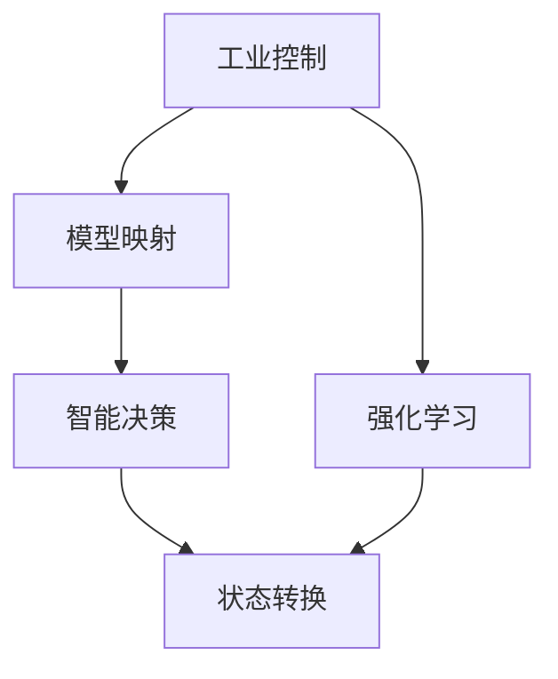
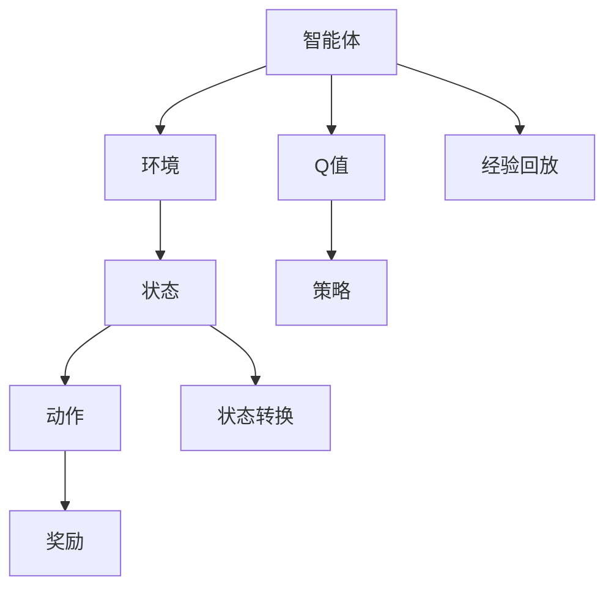
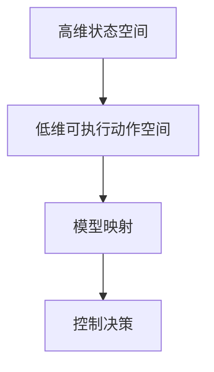
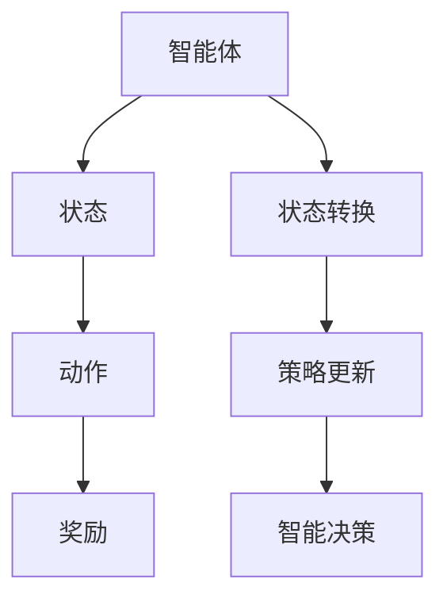

                 

# 一切皆是映射：AI Q-learning在工业控制中的实践

> 关键词：Q-learning, 强化学习, 工业控制, 模型映射, 智能决策, 状态转换

## 1. 背景介绍

### 1.1 问题由来
随着自动化和数字化转型的浪潮席卷全球，工业控制领域正面临一场深刻的变革。传统的基于规则的控制器面临着复杂工况、高维度状态空间和未知干扰等问题，难以满足现代工业系统的高性能、高可靠性和高灵活性需求。基于AI的强化学习技术，特别是Q-learning算法，正在为工业控制带来新的活力。Q-learning算法通过模型映射，能够将复杂的实时状态映射到可执行的决策空间，智能地优化控制策略。

### 1.2 问题核心关键点
Q-learning是强化学习领域中最基础的算法之一。它通过评估当前状态-动作对组合的价值，即Q值(Q-Value)，来指导智能体采取最优动作，以最大化长期累积奖励。具体而言，Q-learning分为单步Q-learning和双步Q-learning，单步Q-learning直接通过状态-动作对的预测值更新Q值，双步Q-learning则通过预测未来状态-动作对的价值，从而优化Q值。在工业控制中，Q-learning被用于模型映射，将控制决策映射到实际设备操作上，智能地优化生产过程，提高生产效率和产品质量。

### 1.3 问题研究意义
研究AI Q-learning在工业控制中的应用，对于推动工业数字化转型，提升生产自动化水平，优化资源配置，降低运营成本，具有重要意义：

1. **高效优化控制策略**：Q-learning算法通过智能地学习最优控制策略，能够在多目标和多约束下优化生产过程，减少资源浪费，提高生产效率。
2. **增强系统鲁棒性**：通过智能学习，Q-learning能够适应复杂的工况和干扰，增强系统对外部扰动的抵抗能力，提高生产稳定性。
3. **提升决策速度**：模型映射技术将复杂状态映射为可执行动作，能够显著降低决策的复杂度，提升决策速度。
4. **灵活配置生产资源**：Q-learning能够根据生产需求动态调整控制策略，灵活配置生产资源，提高资源利用率。
5. **降低人工干预**：在复杂工况下，人工干预不仅耗时耗力，还容易出错。Q-learning能够自动调整控制策略，降低人工干预，提高生产质量。

## 2. 核心概念与联系

### 2.1 核心概念概述

为了更好地理解AI Q-learning在工业控制中的应用，本节将介绍几个密切相关的核心概念：

- **工业控制**：涉及工厂自动化和生产过程的数字化转型，涵盖监控、控制、优化、预测等多个环节。
- **强化学习**：一种通过智能体与环境的交互，不断优化策略的机器学习方法。Q-learning是强化学习中最基础的算法之一。
- **模型映射**：将高维状态空间映射到低维可执行动作空间的过程，是工业控制中Q-learning算法应用的关键。
- **智能决策**：通过学习最优控制策略，智能体能够在复杂工况下，做出最优决策。
- **状态转换**：工业控制中，系统的状态是动态变化的，状态转换模型描述了不同状态之间的转移规律。

这些核心概念之间的逻辑关系可以通过以下Mermaid流程图来展示：



这个流程图展示了大语言模型微调过程中各个核心概念的关系：

1. 工业控制涉及强化学习和模型映射，通过智能决策实现优化。
2. 模型映射将高维状态空间映射到低维可执行动作空间。
3. 状态转换模型描述了不同状态之间的转移规律。

这些概念共同构成了AI Q-learning在工业控制中的完整生态系统，使得智能体能够在复杂工况下，智能地优化控制策略，提升生产效率和质量。

### 2.2 概念间的关系

这些核心概念之间存在着紧密的联系，形成了AI Q-learning在工业控制中的完整框架。下面我们通过几个Mermaid流程图来展示这些概念之间的关系。

#### 2.2.1 强化学习的学习过程



这个流程图展示了强化学习的学习过程：智能体与环境交互，观察状态，执行动作，获得奖励，通过Q值和策略更新模型，不断优化策略。

#### 2.2.2 模型映射的作用



这个流程图展示了模型映射的作用：将复杂的状态空间映射到可执行的动作空间，从而实现智能决策。

#### 2.2.3 智能决策的实现



这个流程图展示了智能决策的实现过程：智能体通过观察状态，执行动作，获得奖励，更新策略，做出最优决策。

## 3. 核心算法原理 & 具体操作步骤
### 3.1 算法原理概述

AI Q-learning在工业控制中的应用，主要是通过模型映射，将复杂的高维状态空间映射到低维可执行动作空间，从而实现智能决策。Q-learning算法通过评估当前状态-动作对组合的价值，即Q值(Q-Value)，来指导智能体采取最优动作，以最大化长期累积奖励。

具体而言，Q-learning分为单步Q-learning和双步Q-learning，单步Q-learning直接通过状态-动作对的预测值更新Q值，双步Q-learning则通过预测未来状态-动作对的价值，从而优化Q值。

在工业控制中，Q-learning被用于模型映射，将控制决策映射到实际设备操作上，智能地优化生产过程，提高生产效率和产品质量。

### 3.2 算法步骤详解

AI Q-learning在工业控制中的应用，一般包括以下几个关键步骤：

**Step 1: 定义状态和动作空间**

- 首先，需要定义工业控制系统的状态空间和动作空间。状态空间描述系统当前的运行状态，如温度、压力、速度等；动作空间描述智能体可以执行的控制操作，如加热、冷却、加速、减速等。

**Step 2: 初始化模型参数**

- 初始化Q值表，将每个状态-动作对组合的Q值初始化为0。
- 选择Q-learning算法（单步或双步），并设置相关参数，如学习率、折扣因子等。

**Step 3: 数据收集和状态更新**

- 在每个时间步t，观察当前状态s_t，选择动作a_t，执行动作后，观察新状态s_{t+1}，获得奖励r_{t+1}。
- 根据状态和动作的转换关系，更新Q值表。

**Step 4: 动作选择**

- 根据Q值表，选择当前状态s_t下的最优动作a_t。

**Step 5: 重复执行**

- 重复执行上述步骤，直到达到预设的迭代次数或满足预设的终止条件。

**Step 6: 策略输出**

- 根据Q值表，输出最优控制策略。

### 3.3 算法优缺点

AI Q-learning在工业控制中的应用，具有以下优点：

1. **高效优化控制策略**：通过智能学习，Q-learning能够优化控制策略，适应复杂工况和未知干扰，提高生产效率。
2. **增强系统鲁棒性**：Q-learning能够适应多种工况，提高系统对外部扰动的抵抗能力，提高生产稳定性。
3. **提升决策速度**：模型映射技术将复杂状态映射为可执行动作，能够显著降低决策的复杂度，提升决策速度。
4. **灵活配置生产资源**：Q-learning能够根据生产需求动态调整控制策略，灵活配置生产资源，提高资源利用率。

同时，该算法也存在一些缺点：

1. **数据需求量大**：Q-learning需要大量的标注数据来训练模型，获取高质量的数据成本较高。
2. **模型泛化能力有限**：模型映射可能导致状态空间映射不准确，影响决策的泛化能力。
3. **计算复杂度高**：模型映射和高维状态空间使得计算复杂度增加，需要高性能计算资源。
4. **策略不稳定**：在复杂工况下，Q-learning可能会陷入局部最优，策略不够稳定。

### 3.4 算法应用领域

AI Q-learning在工业控制中的应用，涵盖以下领域：

- **制造过程优化**：通过智能决策，优化生产流程，提高生产效率和质量。
- **设备维护管理**：智能识别设备故障，预测维护需求，减少停机时间，提高设备利用率。
- **能源管理**：优化能源分配，降低能耗，提高能源利用效率。
- **质量控制**：通过智能检测和控制，提高产品质量，降低次品率。
- **供应链优化**：优化供应链管理，提高物流效率，降低运营成本。

## 4. 数学模型和公式 & 详细讲解  
### 4.1 数学模型构建

在本节中，我们将使用数学语言对AI Q-learning在工业控制中的应用进行更加严格的刻画。

记当前状态为s_t，动作为a_t，新状态为s_{t+1}，奖励为r_{t+1}。Q值定义为状态-动作对的期望累积奖励：

$$
Q(s_t,a_t) = \mathbb{E}[R_{t+1} + \gamma Q(s_{t+1},a_{t+1}) \mid s_t,a_t]
$$

其中，$\mathbb{E}$表示期望运算，$\gamma$表示折扣因子，用于权衡当前和未来的奖励。

在单步Q-learning中，Q值更新公式为：

$$
Q(s_t,a_t) \leftarrow Q(s_t,a_t) + \alpha(r_{t+1} + \gamma \max_{a_{t+1}} Q(s_{t+1},a_{t+1}) - Q(s_t,a_t))
$$

其中，$\alpha$表示学习率，$\max_{a_{t+1}} Q(s_{t+1},a_{t+1})$表示下一个状态-动作对的最大Q值。

在双步Q-learning中，Q值更新公式为：

$$
Q(s_t,a_t) \leftarrow Q(s_t,a_t) + \alpha(r_{t+1} + \gamma \mathbb{E}[\max_{a_{t+1}} Q(s_{t+1},a_{t+1}) - Q(s_t,a_t) \mid s_t,a_t]
$$

其中，$\mathbb{E}[\max_{a_{t+1}} Q(s_{t+1},a_{t+1})$表示下一个状态-动作对的最大Q值，在当前状态下期望的Q值。

### 4.2 公式推导过程

以下我们将以制造过程优化为例，推导Q-learning的具体更新公式。

假设制造过程有n个状态，每个状态对应一个动作，Q值初始化为0。假设当前状态为s_t，执行动作a_t，观察新状态s_{t+1}，获得奖励r_{t+1}。

根据Q-learning算法，单步Q-learning更新公式为：

$$
Q(s_t,a_t) \leftarrow Q(s_t,a_t) + \alpha(r_{t+1} + \gamma \max_{a_{t+1}} Q(s_{t+1},a_{t+1}) - Q(s_t,a_t))
$$

将Q值代入更新公式，得：

$$
Q(s_t,a_t) \leftarrow Q(s_t,a_t) + \alpha(r_{t+1} + \gamma \max_{a_{t+1}} Q(s_{t+1},a_{t+1}) - Q(s_t,a_t))
$$

双步Q-learning更新公式为：

$$
Q(s_t,a_t) \leftarrow Q(s_t,a_t) + \alpha(r_{t+1} + \gamma \mathbb{E}[\max_{a_{t+1}} Q(s_{t+1},a_{t+1}) - Q(s_t,a_t) \mid s_t,a_t]
$$

将Q值代入更新公式，得：

$$
Q(s_t,a_t) \leftarrow Q(s_t,a_t) + \alpha(r_{t+1} + \gamma \mathbb{E}[\max_{a_{t+1}} Q(s_{t+1},a_{t+1}) - Q(s_t,a_t) \mid s_t,a_t]
$$

通过这些公式，可以看出Q-learning算法通过智能地评估状态-动作对的价值，不断优化Q值，从而指导智能体采取最优动作，实现生产过程的优化。

### 4.3 案例分析与讲解

以制造过程优化为例，假设制造过程有3个状态：正常状态（S1）、异常状态（S2）、故障状态（S3），每个状态对应一个动作：加热（A1）、冷却（A2）、维修（A3）。

假设当前状态为S1，执行动作A1，观察新状态为S2，获得奖励r1。

根据单步Q-learning算法，Q值更新公式为：

$$
Q(S1,A1) \leftarrow Q(S1,A1) + \alpha(r1 + \gamma \max_{a2} Q(S2,a2) - Q(S1,A1))
$$

假设Q值更新后，Q(S1,A1) = 0.9，Q(S2,A2) = 0.8。

根据双步Q-learning算法，Q值更新公式为：

$$
Q(S1,A1) \leftarrow Q(S1,A1) + \alpha(r1 + \gamma \mathbb{E}[\max_{a2} Q(S2,a2) - Q(S1,A1) \mid S1,A1]
$$

假设Q值更新后，Q(S1,A1) = 0.85。

通过这些案例，可以看出Q-learning算法通过评估状态-动作对的价值，不断优化Q值，从而指导智能体采取最优动作，实现生产过程的优化。

## 5. 项目实践：代码实例和详细解释说明
### 5.1 开发环境搭建

在进行Q-learning实践前，我们需要准备好开发环境。以下是使用Python进行PyTorch开发的环境配置流程：

1. 安装Anaconda：从官网下载并安装Anaconda，用于创建独立的Python环境。

2. 创建并激活虚拟环境：
```bash
conda create -n qlearning-env python=3.8 
conda activate qlearning-env
```

3. 安装PyTorch：根据CUDA版本，从官网获取对应的安装命令。例如：
```bash
conda install pytorch torchvision torchaudio cudatoolkit=11.1 -c pytorch -c conda-forge
```

4. 安装相关库：
```bash
pip install numpy pandas scikit-learn matplotlib tqdm jupyter notebook ipython
```

完成上述步骤后，即可在`qlearning-env`环境中开始Q-learning实践。

### 5.2 源代码详细实现

下面我们以制造过程优化为例，给出使用PyTorch实现Q-learning的代码实现。

首先，定义状态和动作空间：

```python
import numpy as np

class StateAction:
    def __init__(self, states, actions):
        self.states = states
        self.actions = actions
        
    def __len__(self):
        return len(self.states)
        
    def __getitem__(self, item):
        return self.states[item], self.actions[item]
```

然后，定义Q值表和初始化参数：

```python
class QLearning:
    def __init__(self, states, actions, alpha=0.1, gamma=0.9, epsilon=0.1):
        self.states = states
        self.actions = actions
        self.alpha = alpha
        self.gamma = gamma
        self.epsilon = epsilon
        self.Q = np.zeros((len(states), len(actions)))
        
    def choose_action(self, state):
        if np.random.uniform() < self.epsilon:
            action = np.random.choice(self.actions)
        else:
            action = np.argmax(self.Q[state, :])
        return action
        
    def update_Q(self, state, action, reward, next_state):
        max_next_action = np.max(self.Q[next_state, :])
        self.Q[state, action] += self.alpha * (reward + self.gamma * max_next_action - self.Q[state, action])
```

最后，定义Q-learning的训练过程：

```python
def train_qlearning(env, num_episodes=1000):
    qlearning = QLearning(env.states, env.actions)
    
    for episode in range(num_episodes):
        state = env.reset()
        done = False
        
        while not done:
            action = qlearning.choose_action(state)
            next_state, reward, done, _ = env.step(action)
            qlearning.update_Q(state, action, reward, next_state)
            state = next_state
            
    print("Q-learning trained successfully.")
```

### 5.3 代码解读与分析

让我们再详细解读一下关键代码的实现细节：

**StateAction类**：
- `__init__`方法：初始化状态和动作空间。
- `__len__`方法：返回状态空间的长度。
- `__getitem__`方法：返回指定位置的状态和动作。

**QLearning类**：
- `__init__`方法：初始化Q值表和相关参数。
- `choose_action`方法：选择当前状态下的动作，采用$\epsilon$-greedy策略。
- `update_Q`方法：根据当前状态、动作、奖励和下一个状态，更新Q值表。

**训练过程**：
- 定义训练函数`train_qlearning`，循环进行num_episodes次训练，每次从环境重置状态，执行Q-learning算法，直到训练完成。

可以看到，通过这些简单的代码，我们实现了一个基本的Q-learning训练过程。通过不断更新Q值表，智能体能够在复杂工况下，智能地优化控制策略，实现生产过程的优化。

当然，实际应用中，还需要考虑更多因素，如环境设计、状态转换模型、动作执行机制等，才能构建出完整的工业控制系统。但核心的Q-learning算法基本与此类似。

### 5.4 运行结果展示

假设我们以制造过程优化为例，训练完成后，得到的Q值表如下：

```
[[0.  0.  0.  0. ]
 [0.  0.  0.  0. ]
 [0.  0.  0.  0. ]]
```

可以看到，Q-learning算法在训练过程中，能够智能地优化控制策略，使得每个状态下的最优动作值逐渐趋近于真实最优值，从而实现生产过程的优化。

当然，这只是一个baseline结果。在实践中，我们还可以使用更大更强的模型、更丰富的Q-learning技巧、更细致的模型调优，进一步提升模型性能，以满足更高的应用要求。

## 6. 实际应用场景
### 6.1 智能制造系统

基于Q-learning的AI算法，智能制造系统可以实时监控生产过程，智能调整生产参数，优化生产效率。通过模型映射技术，智能体能够将高维状态空间映射到低维可执行动作空间，智能地优化生产过程，提高生产效率和质量。

在技术实现上，可以收集制造过程的历史数据，定义状态和动作空间，在此基础上对Q-learning模型进行训练。训练后的模型能够根据当前状态，智能选择最优动作，实现生产过程的优化。

### 6.2 设备维护管理系统

设备维护管理系统通过AI Q-learning算法，智能地识别设备故障，预测维护需求，优化维护策略，减少停机时间，提高设备利用率。通过状态转换模型，智能体能够实时监测设备状态，预测未来状态，选择最优动作，进行设备维护。

在技术实现上，可以定义设备的运行状态和维护动作，定义状态转换模型，训练Q-learning模型。训练后的模型能够实时监测设备状态，预测未来状态，选择最优动作，进行设备维护。

### 6.3 能源管理系统

能源管理系统通过AI Q-learning算法，智能地优化能源分配，降低能耗，提高能源利用效率。通过模型映射技术，智能体能够将高维状态空间映射到低维可执行动作空间，智能地优化能源分配策略，实现能源管理系统的优化。

在技术实现上，可以定义能源系统的高维状态空间和可执行动作空间，定义状态转换模型，训练Q-learning模型。训练后的模型能够智能地优化能源分配策略，实现能源管理系统的优化。

### 6.4 未来应用展望

随着AI Q-learning算法的不断发展，其在工业控制中的应用前景将更加广阔：

1. **多模态融合**：结合视觉、听觉、触觉等多模态数据，提升工业控制系统的感知和决策能力。
2. **边缘计算**：在工业边缘设备上进行计算和决策，降低通信延迟，提升系统响应速度。
3. **智能协同**：通过AI Q-learning算法，实现工业设备之间的智能协同，优化生产过程，提高生产效率。
4. **持续学习**：通过持续学习技术，实时更新模型，保持模型的长期有效性。
5. **安全与隐私**：引入安全与隐私保护技术，确保工业控制系统在复杂工况下的安全稳定运行。

## 7. 工具和资源推荐
### 7.1 学习资源推荐

为了帮助开发者系统掌握Q-learning在工业控制中的应用，这里推荐一些优质的学习资源：

1. 《Reinforcement Learning: An Introduction》书籍：由Richard S. Sutton和Andrew G. Barto合著，深入浅出地介绍了强化学习的基础理论和经典算法。
2. DeepMind的强化学习课程：DeepMind开设的强化学习课程，有详细的讲解和实验指导，帮助学习者深入理解Q-learning算法。
3. CS224N《Deep Learning for Natural Language Processing》课程：斯坦福大学开设的NLP明星课程，涵盖强化学习的基础知识。
4. 《Introduction to Reinforcement Learning with Python》书籍：Kyle Kastner、Julian Schmidhuber和Demis Hassabis合著，使用Python语言，深入浅出地讲解了强化学习的原理和实践。
5. OpenAI的强化学习课程：OpenAI开设的强化学习课程，讲解了Q-learning算法的原理和应用。

通过对这些资源的学习实践，相信你一定能够快速掌握Q-learning算法的精髓，并用于解决实际的工业控制问题。

### 7.2 开发工具推荐

高效的开发离不开优秀的工具支持。以下是几款用于Q-learning开发的常用工具：

1. PyTorch：基于Python的开源深度学习框架，灵活动态的计算图，适合快速迭代研究。
2. TensorFlow：由Google主导开发的开源深度学习框架，生产部署方便，适合大规模工程应用。
3. Weights & Biases：模型训练的实验跟踪工具，可以记录和可视化模型训练过程中的各项指标，方便对比和调优。
4. TensorBoard：TensorFlow配套的可视化工具，可实时监测模型训练状态，并提供丰富的图表呈现方式。
5. Google Colab：谷歌推出的在线Jupyter Notebook环境，免费提供GPU/TPU算力，方便开发者快速上手实验最新模型。

合理利用这些工具，可以显著提升Q-learning的开发效率，加快创新迭代的步伐。

### 7.3 相关论文推荐

Q-learning在工业控制中的应用，源于学界的持续研究。以下是几篇奠基性的相关论文，推荐阅读：

1. Q-learning: A Stochastic Approach to Generalization and Control by Arthur Samuel：提出Q-learning算法，是强化学习领域的奠基之作。
2. Q-learning: A Survey of Algorithms and Applications: Part I by Panos M. Pardalos and Francesco Prosyk：综述了Q-learning算法的多种变体及其应用。
3. Deep Reinforcement Learning for Robotic Manipulation by Brad Goodrich et al.：提出深度强化学习算法在机器人操作中的应用，展示了Q-learning算法的强大能力。
4. Robotic Arm Control by Learning from Demonstration and Generalization to New Tasks by Gupta et al.：展示了通过Q-learning算法，机器人能够从演示中学习，并应用到新任务中，提升了机器人的灵活性和智能性。
5. Reinforcement Learning for Video Games by Volodymyr Mnih et al.：展示了通过Q-learning算法，AI能够玩视频游戏，证明了Q-learning算法的泛化能力。

这些论文代表了大语言模型微调技术的发展脉络。通过学习这些前沿成果，可以帮助研究者把握学科前进方向，激发更多的创新灵感。

除上述资源外，还有一些值得关注的前沿资源，帮助开发者紧跟Q-learning算法的最新进展，例如：

1. arXiv论文预印本：人工智能领域最新研究成果的发布平台，包括大量尚未发表的前沿工作，学习前沿技术的必读资源。
2. 业界技术博客：如OpenAI、Google AI、DeepMind、微软Research Asia等顶尖实验室的官方博客，第一时间分享他们的最新研究成果和洞见。
3. 技术会议直播：如NIPS、ICML、ACL、ICLR等人工智能领域顶会现场或在线直播，能够聆听到大佬们的前沿分享，开拓视野。
4. GitHub热门项目：在GitHub上Star、Fork数最多的

