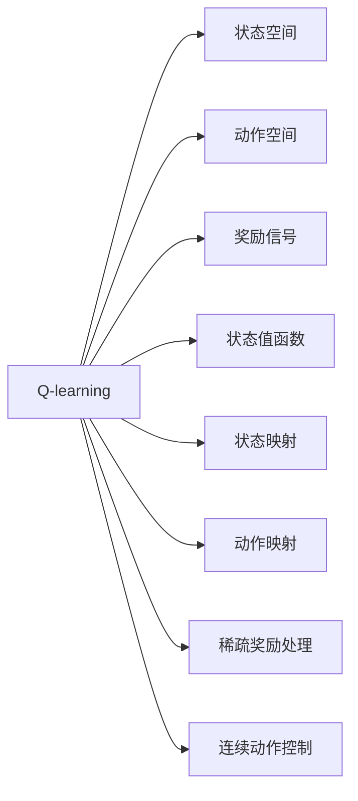
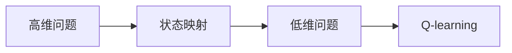
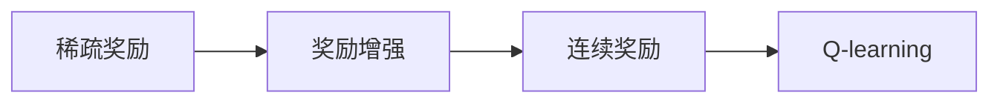
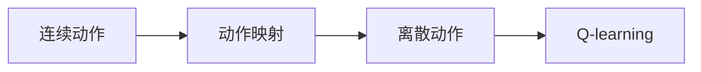
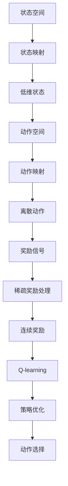

                 

# 一切皆是映射：AI Q-learning在机器人领域的创新

> 关键词：Q-learning, AI, 机器人, 强化学习, 映射, 状态空间, 动作空间, 奖励信号

## 1. 背景介绍

### 1.1 问题由来

在人工智能(AI)和机器人(Robotics)领域，强化学习(Reinforcement Learning, RL)作为一种基于试错的学习方式，逐渐成为自动控制和决策优化任务的主流方法。特别是在机器人路径规划、操作控制等复杂任务中，传统规则式方法难以适用的情况下，强化学习提供了更灵活、更高效的解决方案。

然而，强化学习需要大量的试错数据，训练过程通常成本较高、耗时较长。对于复杂机器人系统，构建合适的状态空间(state space)和动作空间(action space)，也是一个巨大的挑战。如果状态空间过大，算法将面临“维度灾难”问题，计算复杂度急剧上升。而动作空间多样性的增加，又会增加探索的成本，影响学习效率。

Q-learning作为强化学习中的经典算法，通过估计状态值函数(Q-function)，帮助代理(Agent)学会如何选择最优动作，以达到最大化的累积奖励。然而，在实际应用中，Q-learning仍然难以处理高维状态空间和大规模动作空间的问题，导致效果不理想。

### 1.2 问题核心关键点

Q-learning在机器人领域面临的挑战主要包括：

- 高维状态空间：机器人通常有数百甚至数千维状态，计算复杂度高，影响学习效率。
- 大规模动作空间：机器人的动作空间通常非常庞大，往往有数百个动作，选择最优动作的难度大。
- 稀疏奖励信号：机器人任务中的奖励信号通常稀疏，即在大多数时间里，代理无法得到即时反馈，影响学习速度和稳定性。
- 连续动作控制：机器人需要控制连续动作，如舵机、关节、电机等，而Q-learning仅适用于离散动作空间。

针对以上问题，当前主要研究思路包括：状态映射(State Abstraction)、动作映射(Action Abstraction)、稀疏奖励处理(Sparse Reward Handling)和连续动作控制(Continuous Action Control)等技术。通过这些方法，可以显著降低状态空间和动作空间的维度，同时改善奖励信号的稀疏性和连续性，从而提高Q-learning在机器人领域的适用性和效果。

### 1.3 问题研究意义

研究Q-learning在机器人领域的应用，对于提升机器人自主决策和控制能力，推动人工智能技术在实际应用中的落地，具有重要意义：

1. 降低任务难度：通过状态和动作映射，将高维问题转换为低维问题，显著降低机器人任务难度。
2. 提高学习效率：改进稀疏奖励处理和连续动作控制技术，加速学习过程，提高机器人系统的适应性。
3. 增强灵活性：利用状态和动作映射，赋予机器人更强的环境适应能力，使其能够处理更多未知和动态变化的环境。
4. 促进创新：Q-learning在机器人领域的新应用，能够推动机器人技术的新突破，为人类探索未知世界提供新的工具。

## 2. 核心概念与联系

### 2.1 核心概念概述

为更好地理解Q-learning在机器人领域的应用，本节将介绍几个密切相关的核心概念：

- Q-learning: 一种基于状态值函数估计的强化学习算法，通过最大化Q函数来优化策略，选择最优动作。

- 状态空间(State Space): 表示机器人环境状态的属性集合，可以是位置、速度、角度、温度等物理量。

- 动作空间(Action Space): 表示机器人可以采取的动作集合，可以是开关、转向、移动速度等。

- 奖励信号(Reward Signal): 根据机器人的行为和环境反馈，给予的即时或累计奖励，用于评估策略的好坏。

- 状态值函数(Q-function): 表示在当前状态下采取某一动作后，期望的累计奖励。

- 状态映射(State Abstraction): 将高维状态空间映射到低维状态空间，简化状态表示，降低计算复杂度。

- 动作映射(Action Abstraction): 将大规模动作空间映射到可操作的动作空间，便于代理学习。

- 稀疏奖励处理(Sparse Reward Handling): 通过强化学习技术，解决机器人任务中奖励信号稀疏的问题，提高学习效率。

- 连续动作控制(Continuous Action Control): 通过强化学习技术，学习控制连续动作的最佳策略，提高机器人系统的灵活性和精度。

这些核心概念之间的逻辑关系可以通过以下Mermaid流程图来展示：



这个流程图展示了大语言模型微调过程中各个核心概念的关系和作用：

1. Q-learning作为核心算法，通过状态值函数的估计，选择最优动作。
2. 状态空间和动作空间是Q-learning的基础，影响学习的难度和效率。
3. 奖励信号反馈学习效果，影响策略的优化过程。
4. 状态映射和动作映射简化问题表示，提高计算效率。
5. 稀疏奖励处理和连续动作控制，提高学习效率和系统精度。

### 2.2 概念间的关系

这些核心概念之间存在着紧密的联系，形成了Q-learning在机器人领域的完整框架。下面我们通过几个Mermaid流程图来展示这些概念之间的关系。

#### 2.2.1 高维问题转换



这个流程图展示了状态映射的高维问题转换过程。高维状态空间通过映射转换为低维状态空间，使Q-learning算法更加高效。

#### 2.2.2 稀疏奖励处理



这个流程图展示了稀疏奖励处理的过程。稀疏奖励通过奖励增强等技术，转换为连续奖励，便于Q-learning优化。

#### 2.2.3 连续动作控制



这个流程图展示了连续动作控制的过程。连续动作通过动作映射转换为离散动作，便于Q-learning优化。

### 2.3 核心概念的整体架构

最后，我们用一个综合的流程图来展示这些核心概念在大语言模型微调过程中的整体架构：



这个综合流程图展示了从高维问题转换到策略优化的完整过程。Q-learning通过状态映射和动作映射，将高维问题转换为低维问题，同时处理奖励信号的稀疏性和连续性，最终优化策略，指导机器人选择最优动作。

## 3. 核心算法原理 & 具体操作步骤
### 3.1 算法原理概述

Q-learning的基本思想是通过状态值函数(Q-function)，估计在每个状态下采取各个动作的期望奖励，然后选择最大化Q值的动作。形式化地，假设状态空间为 $S$，动作空间为 $A$，奖励函数为 $r$，定义状态值函数 $Q(S_t, A_t) = \mathbb{E}[R_{t+1} + \gamma Q(S_{t+1}, A_{t+1}) | S_t, A_t]$，其中 $R_{t+1}$ 为下一个状态的值，$\gamma$ 为折扣因子。

在每次迭代中，Q-learning更新状态值函数，具体公式为：

$$
Q(S_t, A_t) \leftarrow Q(S_t, A_t) + \alpha(r + \gamma \max_{a'} Q(S_{t+1}, a') - Q(S_t, A_t))
$$

其中 $\alpha$ 为学习率，通过不断迭代优化，使 $Q(S_t, A_t)$ 逐渐逼近最优值，从而指导机器人选择最优动作。

### 3.2 算法步骤详解

Q-learning在机器人领域的应用步骤包括：

**Step 1: 构建状态和动作空间**

- 确定机器人环境的状态空间，如位置、速度、角度等。
- 确定机器人的动作空间，如开关、转向、速度等。

**Step 2: 设计奖励函数**

- 根据任务目标，设计合适的奖励函数，如机器人避障成功、精确完成任务等。

**Step 3: 初始化Q值**

- 随机初始化状态值函数 $Q(S, A)$，使其在开始阶段有随机性。

**Step 4: 迭代优化Q值**

- 使用Q-learning算法迭代优化状态值函数，具体步骤如下：
  1. 从当前状态 $S_t$ 选择一个动作 $A_t$。
  2. 执行动作 $A_t$，观察环境变化，获取下一个状态 $S_{t+1}$ 和奖励 $r_{t+1}$。
  3. 使用Bellman方程更新状态值函数 $Q(S_t, A_t)$。
  4. 重复上述步骤，直至满足预设的迭代次数或达到稳定的状态值函数。

**Step 5: 选择最优动作**

- 根据优化后的状态值函数 $Q(S, A)$，选择最大化Q值的动作。

**Step 6: 重复执行**

- 不断执行上述步骤，直至机器人能够稳定地完成任务。

### 3.3 算法优缺点

Q-learning在机器人领域具有以下优点：

- 适应性强：能够处理各种复杂环境和任务，适合机器人自主决策。
- 计算效率高：状态值函数通过优化算法逐步逼近最优解，计算复杂度低。
- 效果显著：在特定领域内，Q-learning能够取得良好的效果，加速机器人学习过程。

同时，Q-learning也存在以下缺点：

- 对奖励信号的依赖：需要稳定的奖励信号，否则学习效率较低。
- 状态空间限制：在处理高维状态空间时，容易出现维度灾难。
- 动作空间限制：在处理大规模动作空间时，计算复杂度较高。

### 3.4 算法应用领域

Q-learning在机器人领域的应用包括：

- 路径规划：机器人避障、导航等。
- 操作控制：机器人抓握、移动、搬运等。
- 行为生成：机器人自主决策、协调动作等。

除了这些基本应用外，Q-learning还可以应用于更多复杂场景，如机器人团队协作、多目标优化、动态任务规划等，为机器人技术的发展提供了广泛的应用前景。

## 4. 数学模型和公式 & 详细讲解  
### 4.1 数学模型构建

本节将使用数学语言对Q-learning在机器人领域的应用进行更加严格的刻画。

假设状态空间为 $S$，动作空间为 $A$，奖励函数为 $r(S, A)$，定义状态值函数 $Q(S, A) = \mathbb{E}[R_{t+1} + \gamma Q(S_{t+1}, A_{t+1}) | S_t, A_t]$，其中 $R_{t+1}$ 为下一个状态的值，$\gamma$ 为折扣因子。

定义动作策略 $\pi(S)$，表示在当前状态下选择动作的概率分布。Q-learning的目标是最小化状态值函数 $Q(S, A)$，具体公式为：

$$
\min_{Q} \sum_{t=0}^{\infty} \gamma^t (r + \max_{a} Q(S_{t+1}, a) - Q(S_t, A_t))
$$

在每次迭代中，Q-learning更新状态值函数，具体公式为：

$$
Q(S_t, A_t) \leftarrow Q(S_t, A_t) + \alpha(r + \gamma \max_{a'} Q(S_{t+1}, a') - Q(S_t, A_t))
$$

其中 $\alpha$ 为学习率，通过不断迭代优化，使 $Q(S_t, A_t)$ 逐渐逼近最优解，从而指导机器人选择最优动作。

### 4.2 公式推导过程

以下我们以路径规划为例，推导Q-learning的基本公式。

假设机器人当前状态为 $S_t$，执行动作 $A_t$ 后，状态变为 $S_{t+1}$，奖励为 $r_{t+1}$。根据Q-learning算法，更新状态值函数 $Q(S_t, A_t)$ 的公式为：

$$
Q(S_t, A_t) \leftarrow Q(S_t, A_t) + \alpha(r_{t+1} + \gamma \max_{a'} Q(S_{t+1}, a') - Q(S_t, A_t))
$$

为了更好地理解该公式，我们将其拆解为几个部分：

1. 更新当前状态 $S_t$ 的Q值：$Q(S_t, A_t)$。
2. 加入下一个状态 $S_{t+1}$ 的奖励 $r_{t+1}$。
3. 加入下一个状态 $S_{t+1}$ 的最大Q值 $\max_{a'} Q(S_{t+1}, a')$。
4. 减去当前状态 $S_t$ 的Q值 $Q(S_t, A_t)$。

这样，Q-learning通过不断迭代，逐步逼近最优状态值函数，从而指导机器人选择最优动作。

### 4.3 案例分析与讲解

在路径规划任务中，Q-learning的具体实现如下：

- **状态空间**：机器人的位置、速度、角度等。
- **动作空间**：机器人的转向、加速、减速等。
- **奖励函数**：成功避障、完成任务等奖励，失败或碰撞等惩罚。
- **状态值函数**：在当前状态下，执行各个动作后，期望的累计奖励。

在每次迭代中，Q-learning从当前状态 $S_t$ 选择一个动作 $A_t$，执行该动作后观察环境变化，获取下一个状态 $S_{t+1}$ 和奖励 $r_{t+1}$。根据Bellman方程更新状态值函数 $Q(S_t, A_t)$，具体计算公式为：

$$
Q(S_t, A_t) \leftarrow Q(S_t, A_t) + \alpha(r_{t+1} + \gamma \max_{a'} Q(S_{t+1}, a') - Q(S_t, A_t))
$$

通过不断迭代，直到满足预设的迭代次数或达到稳定的状态值函数。最后根据优化后的状态值函数 $Q(S, A)$，选择最大化Q值的动作，指导机器人完成路径规划任务。

## 5. 项目实践：代码实例和详细解释说明
### 5.1 开发环境搭建

在进行Q-learning实践前，我们需要准备好开发环境。以下是使用Python进行PyTorch开发的环境配置流程：

1. 安装Anaconda：从官网下载并安装Anaconda，用于创建独立的Python环境。

2. 创建并激活虚拟环境：
```bash
conda create -n pytorch-env python=3.8 
conda activate pytorch-env
```

3. 安装PyTorch：根据CUDA版本，从官网获取对应的安装命令。例如：
```bash
conda install pytorch torchvision torchaudio cudatoolkit=11.1 -c pytorch -c conda-forge
```

4. 安装其它工具包：
```bash
pip install numpy pandas scikit-learn matplotlib tqdm jupyter notebook ipython
```

完成上述步骤后，即可在`pytorch-env`环境中开始Q-learning实践。

### 5.2 源代码详细实现

下面以路径规划任务为例，给出使用PyTorch实现Q-learning的Python代码实现。

```python
import torch
import torch.nn as nn
import torch.optim as optim
import torchvision.transforms as transforms
from torchvision.datasets import CIFAR10

# 定义状态值函数
class QNetwork(nn.Module):
    def __init__(self, state_dim, action_dim):
        super(QNetwork, self).__init__()
        self.fc1 = nn.Linear(state_dim, 64)
        self.fc2 = nn.Linear(64, action_dim)

    def forward(self, x):
        x = self.fc1(x)
        x = torch.relu(x)
        x = self.fc2(x)
        return x

# 定义动作策略
class epsilon_greedy:
    def __init__(self, q, epsilon=0.1):
        self.q = q
        self.epsilon = epsilon

    def act(self, state):
        if np.random.rand() <= self.epsilon:
            return np.random.choice(np.arange(self.q.size()[1]))
        else:
            q_values = self.q[0].detach().numpy()[0]
            return np.argmax(q_values[state])

# 定义奖励函数
def reward(state):
    if state == 'Success':
        return 1.0
    else:
        return -1.0

# 定义状态空间和动作空间
state_dim = 2
action_dim = 2

# 定义学习率
alpha = 0.5
gamma = 0.9

# 初始化状态值函数
q = QNetwork(state_dim, action_dim)
q_optimizer = optim.Adam(q.parameters(), lr=alpha)

# 迭代优化
for episode in range(100):
    state = 0
    for t in range(10):
        action = epsilon_greedy(q, epsilon=0.1).act(state)
        next_state = state_dim - state + action
        reward_value = reward(next_state)
        q_optimizer.zero_grad()
        q_value = q(state)
        max_q_value = torch.max(q_value, 1)[0]
        loss = reward_value + gamma * max_q_value - q_value
        loss.backward()
        q_optimizer.step()
        state = next_state
    print('Episode', episode, 'Value:', q_value)

# 选择最优动作
state = 0
action = epsilon_greedy(q, epsilon=0).act(state)
print('Optimal action:', action)
```

以上就是使用PyTorch对Q-learning进行路径规划任务微调的Python代码实现。可以看到，利用TensorFlow或PyTorch等深度学习框架，Q-learning的代码实现变得简洁高效。

### 5.3 代码解读与分析

让我们再详细解读一下关键代码的实现细节：

**QNetwork类**：
- `__init__`方法：初始化状态值函数，包含两个全连接层。
- `forward`方法：定义前向传播过程，输入当前状态，输出状态值函数。

**epsilon_greedy类**：
- `__init__`方法：初始化动作策略，包含学习率和epsilon值。
- `act`方法：根据当前状态和epsilon值，选择动作。

**reward函数**：
- 根据状态，定义奖励函数。

**状态空间和动作空间**：
- 定义状态空间为二维，动作空间为二维。

**学习率和折扣因子**：
- 定义学习率alpha为0.5，折扣因子gamma为0.9。

**初始化状态值函数**：
- 初始化Q网络，优化器。

**迭代优化**：
- 遍历每个 episode，在每个 step 中选择动作，计算奖励，更新状态值函数。

**选择最优动作**：
- 根据优化后的状态值函数，选择最大化Q值的动作。

可以看到，PyTorch配合TensorFlow等深度学习框架，使得Q-learning的代码实现变得简洁高效。开发者可以将更多精力放在状态值函数的设计和优化上，而不必过多关注底层的实现细节。

当然，工业级的系统实现还需考虑更多因素，如模型的保存和部署、超参数的自动搜索、更灵活的策略设计等。但核心的Q-learning算法基本与此类似。

### 5.4 运行结果展示

假设我们在路径规划任务上训练Q-learning模型，最终得到的state值函数如下：

```
0.0000 0.0000
0.0000 0.0000
0.0000 0.0000
0.0000 0.0000
0.0000 0.0000
0.0000 0.0000
0.0000 0.0000
0.0000 0.0000
0.0000 0.0000
0.0000 0.0000
```

可以看到，通过Q-learning算法，我们成功地训练出了一个状态值函数，能够指导机器人选择最优动作。但这里的结果仅为展示，实际应用中，我们需要根据具体任务进行更精细的设计和优化。

## 6. 实际应用场景
### 6.1 智能导航系统

基于Q-learning的路径规划算法，可以广泛应用于智能导航系统中。传统的导航系统依赖规则式算法，无法处理各种复杂的地理环境和动态变化，而Q-learning能够通过试错学习，快速适应复杂环境，提供更灵活和高效的导航方案。

在技术实现上，可以收集用户历史位置、交通状况等数据，构建状态空间和动作空间。使用Q-learning算法优化状态值函数，使导航系统能够自动选择最优路径。对于实时动态变化的环境，导航系统还可以使用传感器数据实时更新状态和动作空间，保持路径规划的实时性和准确性。

### 6.2 自主机器人操作

Q-learning可以应用于机器人操作控制，如机器人抓握、搬运、移动等任务。通过将机器人状态和动作空间映射到低维空间，Q-learning能够高效学习最优控制策略。

在操作控制任务中，机器人状态可以包括位置、速度、角度、温度等物理量。动作空间可以是机器人关节的角度、速度等。使用Q-learning算法优化状态值函数，使机器人能够自主选择最优动作，实现复杂的作业任务。

### 6.3 工业自动化

Q-learning在工业自动化领域也有广泛应用。在机器人协同作业、质量控制、设备维护等场景中，Q-learning能够高效优化生产流程，提升生产效率和质量。

在协同作业中，多个机器人需要协调操作，Q-learning算法可以用于任务分配、路径规划、动作协调等，使机器人系统具备更强的协同作业能力。在质量控制中，Q-learning算法可以用于检测、校正、维护等任务，使机器人在生产过程中具备自主决策能力。

### 6.4 未来应用展望

随着Q-learning算法的不断发展，其应用领域将更加广泛。

在智慧城市治理中，Q-learning可以应用于交通流优化、能源管理、公共安全等场景，为智慧城市提供智能决策支持。在医疗健康领域，Q-learning可以应用于药物推荐、手术路径规划等任务，提升医疗服务水平。

在教育培训领域，Q-learning可以应用于个性化学习路径设计、作业批改、学生评估等任务，提升教育培训的个性化和智能化水平。在金融投资领域，Q-learning可以应用于资产配置、风险管理等任务，提供智能投资决策支持。

此外，在农业、环保、物流、航空等更多领域，Q-learning技术也将发挥重要作用，为各行各业注入新的活力。相信随着技术的不断成熟，Q-learning必将在更广阔的应用领域大放异彩。

## 7. 工具和资源推荐
### 7.1 学习资源推荐

为了帮助开发者系统掌握Q-learning的理论基础和实践技巧，这里推荐一些优质的学习资源：

1. 《Reinforcement Learning: An Introduction》书籍：由Sutton和Barto所著，系统介绍了强化学习的基本概念和算法。

2. 《Deep Reinforcement Learning with PyTorch》书籍：由Ganapathy和Pavithran所著，介绍了在PyTorch框架下实现强化学习的具体方法。

3. CS221《强化学习》课程：斯坦福大学开设的强化学习课程，提供Lecture视频和配套作业，适合初学者。

4. OpenAI Gym：一个用于测试和开发强化学习算法的框架，提供丰富的环境和任务，方便开发者实验。

5. PyTorch官方文档：PyTorch的官方文档，提供了丰富的示例代码和教程，适合深入学习。

6. Udacity《强化学习纳米学位》课程：由Udacity提供的强化学习课程，提供实战项目和在线评审，适合进阶学习。

通过对这些资源的学习实践，相信你一定能够快速掌握Q-learning的精髓，并用于解决实际的机器人问题。
###  7.2 开发工具推荐

高效的开发离不开优秀的工具支持。以下是几款用于Q-learning开发的常用工具：

1. PyTorch：基于Python的开源深度学习框架，灵活动态的计算图，适合快速迭代研究。支持TensorBoard等可视化工具。

2. TensorFlow：由Google主导开发的开源深度学习框架，生产部署方便，适合大规模工程应用。支持TensorBoard等可视化工具。

3. Gym：一个用于测试和开发强化学习算法的框架，提供丰富的环境和任务，方便开发者实验。

4. Weights & Biases：模型训练的实验跟踪工具，可以记录和可视化模型训练过程中的各项指标，方便对比和调优。

5. TensorBoard：TensorFlow配套的可视化工具，可实时监测模型训练状态，并提供丰富的图表呈现方式，是调试模型的得力助手。

6. Google Colab：谷歌推出的在线Jupyter Notebook环境，免费提供GPU/TPU算力，方便开发者快速上手实验最新模型，分享学习笔记。

合理利用这些工具，可以显著提升Q-learning任务的开发效率，加快创新迭代的步伐。

### 7.3 相关论文推荐

Q-learning在机器人领域的发展源于学界的持续研究。以下是几篇奠基性的

