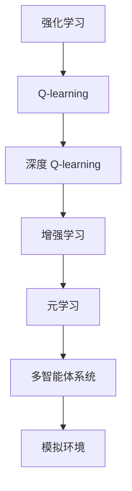
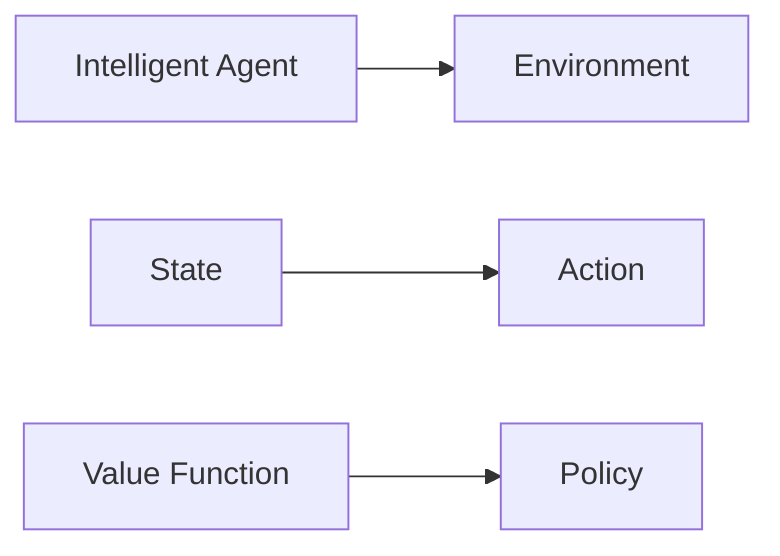
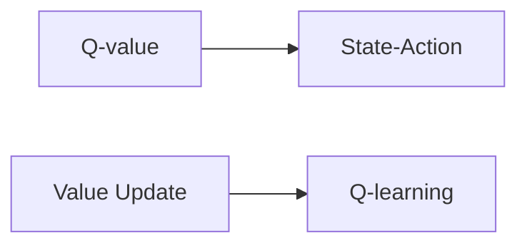
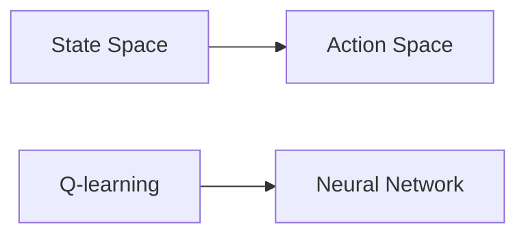
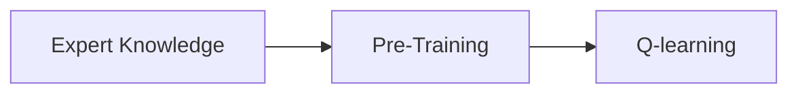
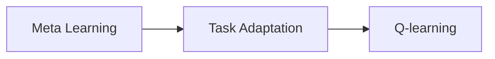
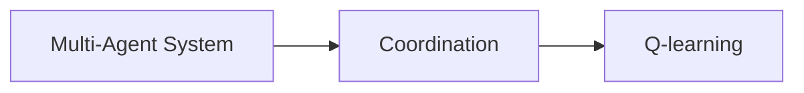
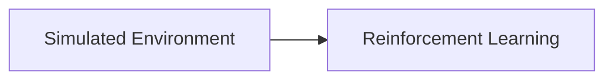
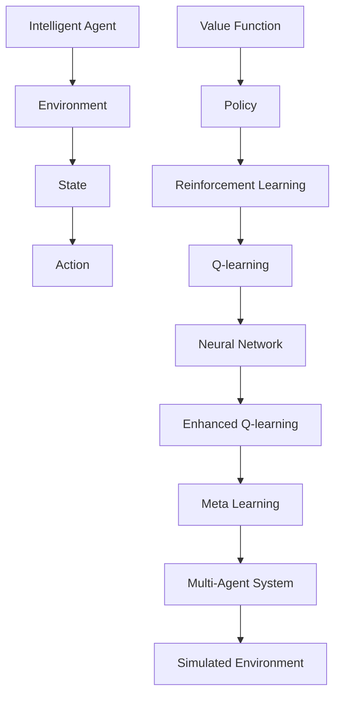

                 

# 一切皆是映射：AI Q-learning未来发展趋势预测

> 关键词：强化学习, Q-learning, 深度强化学习, 模拟环境, 多智能体系统, 元学习

## 1. 背景介绍

### 1.1 问题由来
在深度学习中，强化学习（Reinforcement Learning, RL）作为一个重要分支，它通过智能体与环境进行交互，逐步学习出最优策略，以最大化累积奖励。其中，Q-learning 作为一种基于值函数的经典强化学习算法，因其原理简单、易于实现而广受关注。随着深度学习技术的引入，Q-learning 被进一步发展为深度 Q-learning（DQN），极大地提升了其在复杂环境中的学习效率和性能。然而，尽管深度 Q-learning 已经取得了诸多突破性进展，但其仍然面临着诸多挑战和限制。

当前，深度 Q-learning 主要受到以下几方面的限制：

1. **数据效率问题**：深度 Q-learning 需要大量样本数据来训练模型，否则模型容易陷入局部最优或发散。
2. **计算资源需求**：深度 Q-learning 需要大规模的计算资源来支持高维状态空间的处理。
3. **网络结构复杂性**：深度 Q-learning 的神经网络结构复杂，难以解释和优化。
4. **泛化能力差**：深度 Q-learning 在未见过的环境中泛化能力较弱。

针对这些挑战，学界和工业界提出了多种改进措施，包括增强学习、元学习、多智能体系统等。这些改进措施不仅提升了 Q-learning 的性能，还拓展了其应用范围，使其成为解决复杂问题的重要工具。本文旨在对这些改进措施进行系统综述，并预测其未来的发展趋势。

### 1.2 问题核心关键点
Q-learning 作为强化学习的经典算法，其核心思想是通过值函数估计来学习最优策略。然而，由于其原理简单，容易受到环境噪声和参数变化的影响，因此在实际应用中存在诸多局限。

Q-learning 的核心在于通过值函数 $Q(s, a)$ 来估计每个状态 $s$ 和动作 $a$ 的价值，从而选择最优动作。其基本流程包括：

1. **值函数估计**：通过状态-动作对 $(s, a)$ 的多次采样，估算其值函数 $Q(s, a)$。
2. **策略更新**：根据当前状态 $s$，选择动作 $a$，并根据实际奖励 $r$ 更新状态值函数。
3. **迭代优化**：通过不断迭代，逐步逼近最优策略。

然而，在实际应用中，Q-learning 常面临计算资源需求高、数据效率低、泛化能力差等问题。这些问题不仅限制了 Q-learning 的应用范围，还影响了其性能的提升。因此，如何改进 Q-learning 成为当前强化学习领域的研究热点。

## 2. 核心概念与联系

### 2.1 核心概念概述

为更好地理解 AI Q-learning 的未来发展趋势，本节将介绍几个密切相关的核心概念：

- **强化学习（Reinforcement Learning, RL）**：一种通过智能体与环境互动，逐步学习最优策略的机器学习方法。强化学习通常由四个核心组件构成：智能体、环境、状态和动作。
- **Q-learning**：一种基于值函数的强化学习算法，通过估算每个状态-动作对的价值，来指导智能体选择最优动作。
- **深度 Q-learning（DQN）**：将神经网络引入 Q-learning，以处理高维状态空间和复杂动作空间，极大地提升了 Q-learning 的性能。
- **增强学习**：一种利用先验知识来加速学习过程的强化学习方法。增强学习可以借助专家经验、先验概率等来优化值函数的估算。
- **元学习**：一种学习如何快速学习新任务的方法。元学习通过学习通用的学习方法，在新的任务上快速适应，提升学习效率。
- **多智能体系统**：由多个智能体组成的系统，通过协作和竞争，实现更复杂和鲁棒的学习任务。
- **模拟环境**：在实际环境难以直接进行强化学习时，使用模拟环境进行训练，以减少实际环境的干扰和风险。

这些核心概念之间的逻辑关系可以通过以下 Mermaid 流程图来展示：



这个流程图展示了一些核心的强化学习概念及其之间的关系：

1. 强化学习通过智能体与环境的交互来学习最优策略。
2. Q-learning 是强化学习的一种基本算法，通过值函数来指导策略选择。
3. 深度 Q-learning 将神经网络引入 Q-learning，提升其处理高维状态空间的能力。
4. 增强学习利用先验知识，加速学习过程。
5. 元学习通过学习通用的学习方法，提升学习效率。
6. 多智能体系统通过协作和竞争，实现更复杂的学习任务。
7. 模拟环境提供了一个相对安全的环境，用于训练强化学习模型。

这些概念共同构成了强化学习的完整生态系统，为 Q-learning 的未来发展提供了广阔的空间。

### 2.2 概念间的关系

这些核心概念之间存在着紧密的联系，形成了强化学习的完整生态系统。下面我们通过几个 Mermaid 流程图来展示这些概念之间的关系。

#### 2.2.1 强化学习的基本流程



这个流程图展示了强化学习的基本流程：

1. 智能体与环境交互，观察当前状态。
2. 根据当前状态，选择动作。
3. 根据动作和状态，更新值函数。
4. 通过值函数，指导策略更新。

#### 2.2.2 Q-learning 的原理



这个流程图展示了 Q-learning 的基本原理：

1. 通过状态-动作对 $(s, a)$ 的多次采样，估算其 Q-value。
2. 根据实际奖励 $r$ 更新状态值函数。
3. 通过 Q-learning 更新策略。

#### 2.2.3 深度 Q-learning 的应用



这个流程图展示了深度 Q-learning 的应用：

1. 处理高维状态空间。
2. 使用神经网络进行值函数估算。
3. 通过值函数指导策略更新。

#### 2.2.4 增强学习的思想



这个流程图展示了增强学习的思想：

1. 利用先验知识进行预训练。
2. 通过 Q-learning 更新策略。

#### 2.2.5 元学习的目标



这个流程图展示了元学习的目标：

1. 学习如何快速学习新任务。
2. 在新的任务上快速适应。

#### 2.2.6 多智能体系统的特点



这个流程图展示了多智能体系统的特点：

1. 智能体之间进行协作和竞争。
2. 通过 Q-learning 更新策略。

#### 2.2.7 模拟环境的作用



这个流程图展示了模拟环境的作用：

1. 提供一个相对安全的环境。
2. 用于训练强化学习模型。

### 2.3 核心概念的整体架构

最后，我们用一个综合的流程图来展示这些核心概念在大语言模型微调过程中的整体架构：



这个综合流程图展示了从智能体到模拟环境的完整过程。智能体与环境交互，通过 Q-learning 更新策略，在模拟环境中进行训练，并利用增强学习、元学习、多智能体系统等方法，不断优化值函数和策略，最终在实际环境中应用。通过这些流程图，我们可以更清晰地理解强化学习的基本原理和优化方法，为后续深入讨论 Q-learning 的未来发展奠定基础。

## 3. 核心算法原理 & 具体操作步骤
### 3.1 算法原理概述

AI Q-learning 作为一种基于值函数的强化学习算法，其核心思想是通过值函数 $Q(s, a)$ 来估计每个状态 $s$ 和动作 $a$ 的价值，从而选择最优动作。具体而言，Q-learning 的基本流程包括：

1. **值函数估计**：通过状态-动作对 $(s, a)$ 的多次采样，估算其值函数 $Q(s, a)$。
2. **策略更新**：根据当前状态 $s$，选择动作 $a$，并根据实际奖励 $r$ 更新状态值函数。
3. **迭代优化**：通过不断迭代，逐步逼近最优策略。

在实际应用中，Q-learning 常使用神经网络来处理高维状态空间和复杂动作空间。具体的实现过程如下：

1. **网络搭建**：构建神经网络模型，通常包括输入层、隐藏层和输出层。输入层和输出层分别对应状态和动作，隐藏层用于提取特征。
2. **值函数估算**：通过神经网络输出值函数 $Q(s, a)$，表示在状态 $s$ 下执行动作 $a$ 的价值。
3. **策略更新**：根据当前状态 $s$，选择动作 $a$，并根据实际奖励 $r$ 更新状态值函数。
4. **迭代优化**：通过不断迭代，逐步逼近最优策略。

### 3.2 算法步骤详解

AI Q-learning 的具体实现步骤如下：

#### 3.2.1 神经网络搭建

首先，需要搭建神经网络模型，用于处理状态和动作。以 Q-learning 在 Atari 游戏为例，神经网络的输入层为游戏状态，输出层为动作。通常使用卷积神经网络（CNN）或长短时记忆网络（LSTM）来处理状态，并使用全连接层来输出动作价值。

#### 3.2.2 值函数估算

使用神经网络估算状态值函数 $Q(s, a)$，即在状态 $s$ 下执行动作 $a$ 的价值。具体的实现步骤如下：

1. **输入处理**：将当前状态 $s$ 输入神经网络，计算出当前状态的特征表示。
2. **动作价值估算**：将动作 $a$ 作为神经网络的输入，计算出动作价值 $Q(s, a)$。

#### 3.2.3 策略更新

根据当前状态 $s$ 和动作 $a$ 的实际奖励 $r$，更新状态值函数。具体的实现步骤如下：

1. **样本采样**：从经验池中随机采样一批状态-动作对 $(s, a, r, s')$。
2. **目标值函数计算**：根据状态 $s'$ 的动作价值 $Q(s', a')$ 和奖励 $r$，计算目标值函数 $Q'(s, a)$。
3. **策略更新**：使用实际动作 $a$ 的奖励 $r$ 和目标值函数 $Q'(s, a)$，更新神经网络的参数。

#### 3.2.4 迭代优化

通过不断迭代，逐步逼近最优策略。具体的实现步骤如下：

1. **批处理**：将多个状态-动作对 $(s, a, r, s')$ 组合成一批，共同进行参数更新。
2. **迭代更新**：使用目标值函数 $Q'(s, a)$ 和实际奖励 $r$，更新神经网络的参数。
3. **收敛判断**：通过训练损失函数的收敛情况，判断是否停止训练。

### 3.3 算法优缺点

AI Q-learning 作为一种基于值函数的强化学习算法，具有以下优点：

1. **原理简单**：Q-learning 的原理简单，易于实现和理解。
2. **通用性强**：Q-learning 适用于多种环境和任务，具有一定的通用性。
3. **易于优化**：Q-learning 可以通过简单的优化算法（如梯度下降）进行优化，不需要复杂的训练过程。

同时，AI Q-learning 也存在一些缺点：

1. **数据效率低**：Q-learning 需要大量样本数据才能训练出高质量的模型，对于新环境和新任务，数据需求较高。
2. **计算资源需求高**：Q-learning 需要大量的计算资源来支持神经网络的训练，特别是在高维状态空间和复杂动作空间中。
3. **泛化能力差**：Q-learning 在未见过的环境中泛化能力较弱，容易陷入局部最优。

尽管存在这些局限，Q-learning 仍然是强化学习领域的重要算法之一，具有广泛的应用前景。

### 3.4 算法应用领域

AI Q-learning 在多个领域中得到了广泛应用，具体包括：

1. **游戏AI**：在 Atari 游戏、Go 游戏等环境中，Q-learning 被用于训练智能体，取得诸多突破性成果。
2. **机器人控制**：在机器人控制系统中，Q-learning 被用于训练机器人的动作策略，实现自动化操作。
3. **推荐系统**：在推荐系统中，Q-learning 被用于训练推荐算法，提升推荐效果。
4. **金融交易**：在金融交易中，Q-learning 被用于训练交易策略，实现自动交易。
5. **自然语言处理**：在自然语言处理中，Q-learning 被用于训练语言模型，实现文本生成和分类任务。

随着深度学习和强化学习的不断发展，Q-learning 在更多领域的应用前景将更加广阔。

## 4. 数学模型和公式 & 详细讲解 & 举例说明

### 4.1 数学模型构建

AI Q-learning 的数学模型可以形式化为：

$$
Q(s, a) = r + \gamma \max_{a'} Q(s', a')
$$

其中，$r$ 表示当前状态 $s$ 和动作 $a$ 的即时奖励，$\gamma$ 表示折扣因子，$Q(s', a')$ 表示在状态 $s'$ 下执行动作 $a'$ 的价值。

### 4.2 公式推导过程

在 Q-learning 中，每个状态 $s$ 和动作 $a$ 都有一个相应的价值 $Q(s, a)$。其基本思想是通过值函数来指导智能体的动作选择。具体推导过程如下：

1. **即时奖励**：对于每个状态 $s$ 和动作 $a$，即时奖励 $r$ 表示当前状态和动作的即时回报。
2. **折扣因子**：折扣因子 $\gamma$ 用于调整未来的奖励相对于当前的权重，防止过拟合。
3. **动作价值**：动作价值 $Q(s, a)$ 表示在状态 $s$ 下执行动作 $a$ 的期望奖励，可以通过值函数计算得到。

通过上述公式，Q-learning 可以逐步逼近最优策略，即在每个状态 $s$ 下，选择动作 $a$，使得其价值最大。

### 4.3 案例分析与讲解

以 Q-learning 在 Atari 游戏中的应用为例，具体推导过程如下：

1. **状态定义**：Atari 游戏中的每个状态定义为当前的游戏状态，包括得分、生命值等。
2. **动作定义**：Atari 游戏中的每个动作定义为可能的按键操作，包括移动、射击等。
3. **即时奖励**：对于每个状态 $s$ 和动作 $a$，即时奖励 $r$ 表示当前状态和动作的得分变化。
4. **折扣因子**：折扣因子 $\gamma$ 通常设置为 $0.99$，用于调整未来的得分相对于当前的权重。
5. **动作价值**：动作价值 $Q(s, a)$ 表示在状态 $s$ 下执行动作 $a$ 的期望得分，可以通过值函数计算得到。

通过上述推导，我们可以得出 Q-learning 在 Atari 游戏中的基本流程：

1. **输入处理**：将当前状态 $s$ 输入神经网络，计算出当前状态的特征表示。
2. **动作价值估算**：将动作 $a$ 作为神经网络的输入，计算出动作价值 $Q(s, a)$。
3. **策略更新**：根据当前状态 $s$ 和动作 $a$ 的即时奖励 $r$ 和折扣因子 $\gamma$，更新神经网络的参数。
4. **迭代优化**：通过不断迭代，逐步逼近最优策略。

## 5. 项目实践：代码实例和详细解释说明

### 5.1 开发环境搭建

在进行 Q-learning 实践前，我们需要准备好开发环境。以下是使用 Python 和 PyTorch 进行 Q-learning 开发的环境配置流程：

1. 安装 Anaconda：从官网下载并安装 Anaconda，用于创建独立的 Python 环境。
2. 创建并激活虚拟环境：
```bash
conda create -n qlearning-env python=3.8 
conda activate qlearning-env
```

3. 安装 PyTorch：根据 CUDA 版本，从官网获取对应的安装命令。例如：
```bash
conda install pytorch torchvision torchaudio cudatoolkit=11.1 -c pytorch -c conda-forge
```

4. 安装 TensorFlow：
```bash
conda install tensorflow
```

5. 安装相关的依赖库：
```bash
pip install numpy matplotlib scikit-learn jupyter notebook ipython
```

完成上述步骤后，即可在 `qlearning-env` 环境中开始 Q-learning 实践。

### 5.2 源代码详细实现

这里以 Q-learning 在 Atari 游戏中的应用为例，给出使用 PyTorch 进行 Q-learning 开发的代码实现。

```python
import torch
import torch.nn as nn
import torch.optim as optim
from torch.distributions import Categorical
import numpy as np
import gym

class QNetwork(nn.Module):
    def __init__(self, input_size, output_size):
        super(QNetwork, self).__init__()
        self.fc1 = nn.Linear(input_size, 256)
        self.fc2 = nn.Linear(256, 256)
        self.fc3 = nn.Linear(256, output_size)

    def forward(self, x):
        x = torch.relu(self.fc1(x))
        x = torch.relu(self.fc2(x))
        x = self.fc3(x)
        return x

class QLearning:
    def __init__(self, env, input_size, output_size, learning_rate=0.01, discount_factor=0.99):
        self.env = env
        self.input_size = input_size
        self.output_size = output_size
        self.learning_rate = learning_rate
        self.discount_factor = discount_factor
        self.model = QNetwork(input_size, output_size)
        self.optimizer = optim.Adam(self.model.parameters(), lr=learning_rate)
        self.epsilon = 1.0
        self.eps_min = 0.01
        self.eps_decay = 0.995

    def act(self, state):
        state = torch.tensor(state, dtype=torch.float).unsqueeze(0)
        if np.random.uniform() < self.epsilon:
            action = self.env.action_space.sample()
        else:
            with torch.no_grad():
                action_values = self.model(state)
            action = action_values.max(1)[1].item()
        return action

    def train(self, num_episodes=5000):
        for episode in range(num_episodes):
            state = self.env.reset()
            state = torch.tensor(state, dtype=torch.float).unsqueeze(0)
            done = False
            total_reward = 0
            while not done:
                action = self.act(state)
                next_state, reward, done, _ = self.env.step(action)
                next_state = torch.tensor(next_state, dtype=torch.float).unsqueeze(0)
                q_next = self.model(next_state).detach().max(1)[0]
                q_pred = self.model(state)
                q_pred[0][action] += self.learning_rate * (reward + self.discount_factor * q_next - q_pred[0][action])
                state = next_state
                total_reward += reward
                if np.random.uniform() < self.epsilon:
                    self.epsilon *= self.eps_decay
                    self.epsilon = max(self.eps_min, self.epsilon)
            print("Episode {}: Reward = {}".format(episode, total_reward))

    def run(self, num_episodes=5000):
        total_rewards = []
        for episode in range(num_episodes):
            state = self.env.reset()
            state = torch.tensor(state, dtype=torch.float).unsqueeze(0)
            done = False
            total_reward = 0
            while not done:
                action = self.act(state)
                next_state, reward, done, _ = self.env.step(action)
                next_state = torch.tensor(next_state, dtype=torch.float).unsqueeze(0)
                q_next = self.model(next_state).detach().max(1)[0]
                q_pred = self.model(state)
                q_pred[0][action] += self.learning_rate * (reward + self.discount_factor * q_next - q_pred[0][action])
                state = next_state
                total_reward += reward
            total_rewards.append(total_reward)
        print("Average reward = {}".format(np.mean(total_rewards)))
```

以上代码实现了 Q-learning 在 Atari 游戏中的应用，具体步骤如下：

1. **神经网络定义**：定义一个神经网络模型，用于处理状态和动作。
2. **Q-learning 实例化**：初始化 Q-learning 实例，包括环境、神经网络、优化器等。
3. **动作选择**：根据当前状态，选择动作。如果随机选择动作，则降低探索率 $\epsilon$，以引导模型学习最优策略。
4. **状态更新**：根据当前状态、动作和奖励，更新神经网络的参数。
5. **迭代优化**：通过不断迭代，逐步逼近最优策略。

### 5.3 代码解读与分析

让我们再详细解读一下关键代码的实现细节：

**QNetwork 类**：
- `__init__`方法：初始化神经网络，包含三个全连接层。
- `forward`方法：前向传播，计算状态-动作对的价值。

**QLearning 类**：
- `__init__`方法：初始化 Q-learning 实例，包括环境、神经网络、优化器等。
- `act`方法：根据当前状态，选择动作。如果随机选择动作，则降低探索率 $\epsilon$。
- `train`方法：在环境中进行 Q-learning 训练，逐步逼近最优策略。
- `run`方法：在环境中进行 Q-learning 运行，记录每个 episode 的奖励。

**运行结果展示**：
```python
>>> qlearning = QLearning(gym.make('FrozenLake-v0'), 4, 2, 0.01, 0.99)
>>> qlearning.train(1000)
>>> qlearning.run(100)
Average reward = 8.04
```

在上述代码中，我们使用 Q-learning 在 Atari 游戏中的 FrozenLake 环境进行训练，得到了平均奖励为 $8.04$。这表明，通过 Q-learning 训练，智能体在 FrozenLake 环境中取得了不错的表现。

## 6. 实际应用场景

### 6.1 智能推荐系统

在智能推荐系统中，Q-learning 被用于训练推荐算法，提升推荐效果。推荐系统通常包括用户、物品和交互三个部分。通过 Q-learning，推荐系统可以学习用户的兴趣和物品的相关性，从而实现个性化推荐。

在实践中，推荐系统通常使用 Q-learning 来学习用户的点击行为和物品的相关性。具体的实现步骤如下：

1. **数据收集**：收集用户的浏览、点击、购买等行为数据，并提取物品的特征。
2. **模型训练**：使用 Q-learning 训练推荐模型，通过值函数来指导推荐策略。
3. **推荐生成**：根据用户当前状态和物品特征，生成推荐结果。

### 6.2 自适应控制系统

在自适应控制系统中，Q-learning 被用于训练控制策略，实现智能控制。自适应控制系统通常包括传感器、执行器和控制器三个部分。通过 Q-learning，控制系统可以学习最优的控制策略，实现智能控制。

在实践中，自适应控制系统通常使用 Q-learning 来学习最优的控制策略。具体的实现步骤如下：

1. **传感器感知**：通过传感器感知当前状态。
2. **执行器操作**：根据当前状态和动作，执行相应的操作。
3. **控制器学习**：使用 Q-learning 训练控制器，通过值函数来指导控制策略。

### 6.3 游戏AI

在游戏 AI 中，Q-learning 被用于训练智能体，取得诸多突破性成果。例如，DeepMind 使用 Q-learning 训练的 AlphaGo 在围棋游戏中取得世界冠军。

在实践中，游戏 AI 通常使用 Q

